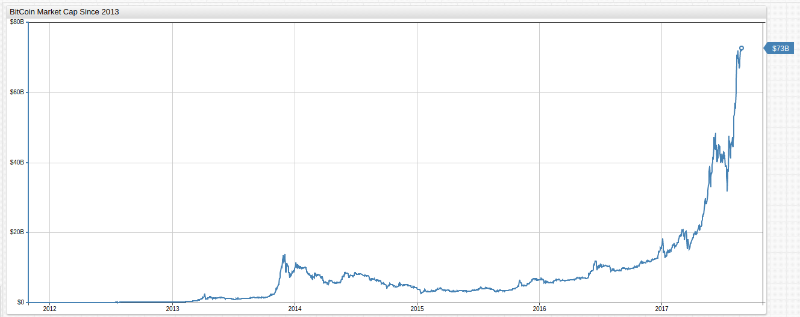
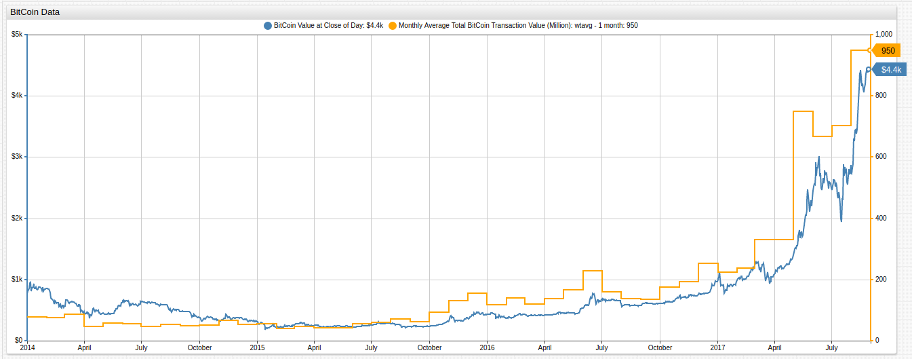

BitCoin After the GHash.IO Era
===

> _Visualizations made using [Axibase Time Series Database](https://axibase.com/products/axibase-time-series-database/), author
has no position in BitCoin_
### Introduction

Since its introduction by the enigmatic figure known only as Satoshi Nakamoto, BitCoin has transformed from a fringe investment
security used by speculators and dark web consumers to the world's premier CryptoCurrency with market capitalization of
more than [$70 billion USD](https://coinmarketcap.com/) and an average of more than 200,000 transactions a day since 2016.
BitCoin is created through a process called mining, special machines can be built specifically for the task and they quickly 
appeared after BitCoin's debut. Collective mining operations called pools followed shortly after as well, advantageous because
the large-scale nature of certain operations gave rise to better results. 

**Figure 1**: BitCoin Market Capitalization

_Source_: [CoinDesk](https://www.coindesk.com/price/)

> Open the ChartLab visualization above and navigate through time using the dropdown menus at the top of the screen.

In July 2014, a BitCoin mining pool known as [GHash.IO](http://ghash.io/) breached an unspoken BitCoin convention by achieving 51% 
of the total hash power for the first time in BitCoin's short history, which established what became the first BitCoin trust. 
In the months leading to GHash.IO gaining control of the 51% majority of the total hash rate the BitCoin market was rattled and huge 
sell-offs occured, causing the value of BitCoin to plummet at the beginning of the year when speculation began to occur about 
when GHash.IO would reach the dreaded 51% mark. Though the number of transactions remained consistent, the value of those 
transactions also decreased as shown below.

**Figure 2**: BitCoin Value and BTC Transaction Value (2013-2015)

_Source_: Quandl - [Market Capitalization](https://www.quandl.com/data/BCHAIN/MKTCP-Bitcoin-Market-Capitalization), [Estimated Transaction Value](https://www.quandl.com/data/BCHAIN/ETRVU-Bitcoin-Estimated-Transaction-Volume-USD)

> Open the ChartLab visualization above and navigate through time using the dropdown menus at the top of the screen.

For those unfamiliar with BitCoin mining technique and terminology, the currency operates using a blockchain protocol, that is,
all BitCoin are inseparably linked though a combination of numbers designating all previous BitCoin transactions. Miners
gain new BitCoin by confirming these transactions with their personal machines, verifying the combination of numbers is valid,
and then attempting to discover the next link in the blockchain through brute force, literally guessing. The hash protocol
is designed so that the most efficient way to discover a new hash is to use no method other than random input. If a more
efficient method were to be discovered somehow, that particular hash protocol would be discarded and no longer used. Special
hardware units have been made to complete this guessing process for users, all they have to do is supervise and wait.

Hash rate is the measure at which a machine is able to compute the hash function per second, effectively completing one guess.
Because of the nature of the protocol, the higher the hash rate, the more bitcoin a particular machine is able to mine. Hash rate
is directly proportional to a miner's profitability.

Not long after BitCoin's establishment, mining pools formed to more effectively extract new coins, with profits split among participants.
One of the more successful outfits called GHash.IO soon established a dominant position on the BitCoin market and within a year
of its establishment was approaching 51% control of the BitCoin hash rate, potentially giving them unprecedented power over the market.

### Outcome

Eventually, GHash.IO was disbanded, the operators of the mining group understood the implications of a 51% hash rate
shareholder: they could effectively counterfeit BitCoin through double spending of coins, a problem created by a loophole
in the blockchain protocol methodology (whereby the user is effectively able to verify their own transaction and receive BitCoin
for doing so, only to spend the original coin again because they now hold consecutive blocks unknown to anyone else), deny pending 
transactions from other BitCoin miners because of their control of consecutive points in a given blockchain, and exercise 
the powers of a central monetary authority, something that those who established BitCoin sought to avoid with its distributed 
levers of power.

However, since the mining pool was disbanded and new guidelines were established for miners and mining pools, BitCoin has
generally seen a healthy resurgence in both usage and value.

**Figure 3**: BitCoin Value and BTC Transaction Value (Post 2014)

_Source_: Quandl - [Market Capitalization](https://www.quandl.com/data/BCHAIN/MKTCP-Bitcoin-Market-Capitalization), [Estimated Transaction Value](https://www.quandl.com/data/BCHAIN/ETRVU-Bitcoin-Estimated-Transaction-Volume-USD)

> Open the ChartLab visualization above and navigate through time using the dropdown menus at the top of the screen.

### The Future of CryptoCurrency

The number of transactions occuring each day using BitCoin has reached impressive levels since its emergence in 2009 and despite
a contraction in recent months, the figure remains strong with over 200,000 unique transactions occuring each day. Additionally,
the number of unique BitCoin addresses has also continued to increase, showing that even today new users are opening BitCoin
wallets and beginning to invest themselves.

**Figure 4**: BitCoin Usage Metrics

_Source_: Quandl - [Number of Users](https://www.quandl.com/data/BCHAIN/NADDU-Bitcoin-Number-of-Unique-Bitcoin-Addresses-Used), [Number of Transactions](https://www.quandl.com/data/BCHAIN/NTRAN-Bitcoin-Number-of-Transactions)

Of course, BitCoin is utterly dwarfed in size when compared to other payment processors; Mastercard, for example, handles
around [300 million unique transactions](http://www.techrepublic.com/blog/decision-central/process-300-million-transactions-a-day-without-going-crazy/)
a day, but its relevance is growing all the time. Russian Deputy Minister of Finance Alexei Moiseyev recently announced that 
qualified investors will soon be able to [trade BitCoin on the Moscow Stock Exchange](https://www.forbes.com/sites/kenrapoza/2017/08/30/moscow-stock-exchange-opens-to-crypto-currency-trade/#66b76e3426d1),
and unnamed U.S. elected officials are currently striving to extend the same kind of legal protection to BitCoin that
exists for other currency, with respect to [seizure of assets](https://news.bitcoin.com/u-s-lawmakers-aim-to-protect-bitcoin-users-from-government-harassment/).

These concerns began to surface in 2013 after agents from the Federal Bureau of Investigation arrested collaborators involved
in the organization and operation of Silk Road, an Amazon-like website hosted on the internet that allowed users to buy and
sell whatever they wanted anonymously. Naturally, illegal transactions began to occur with increasing frequency ultimately
resulting in the lifetime imprisonment of Silk Road founder along with several members of the law enforcement team who investigated him, and after all
was said and done, the FBI became the [single largest holder of BitCoin in a wallet](https://www.wired.com/2013/12/fbi_wallet/).

Additionally, one of the hallmarks of the early years of BitCoin was volatility, huge surges and plunges in value were the
norm as the currency sought some kind of root in the real world. Using [econometric analysis]() in the [ChartLab](https://apps.axibse.com) 
interface, BitCoin's traded value can be normalized using log returns to track how the currency has stabilized of late.

**Figure 5**: BitCoin Closing Value Log Returns

Logarithmic, or log, returns are a simple methodology used by traders to normalize the value of a given stock. The same principle
can be applied here to BitCoin's traded value because it's volatility more closely resembles that of a stock, than that of
a currency in normal circulation. Log returns here demonstrate that the volatility present in the early days of BitCoin are
not as common in its current incarnation. Fluctuations in price of several hundred percent occuring in a matter of a few days
were common in BitCoin's early years, though they appear quite insignificant when seen alongside the jumps in value that BitCoin
has showed of late, in fact they happened much less predictably that current BitCoin fluctuations.

### Conclusion

The near future has a lot in store for BitCoin and BitCoin users, hundreds of new CryptoCurrencies have appeared on the modern 
market, some of them more successfully then others, to challenge BitCoin's supremacy in the world of digital currency. But
BitCoin has made moves to stay relevant as well, recently splitting the blockchain into unique entities, BitCoin Classic
and [BitCoin Cash](https://news.bitcoin.com/what-every-bitcoiner-should-know-about-bitcoin-cash/) for those interested in 
using BitCoin as an investment security or a day-to-day payment processor respectively. Other BitCoin forks exist as well,
each serving some niche of the BitCoin community. Whatever your feelings on BitCoin are, the once tiny digital currency
has made its home in the public eye and is becoming more and more difficult to denounce as a fringe movement. 
