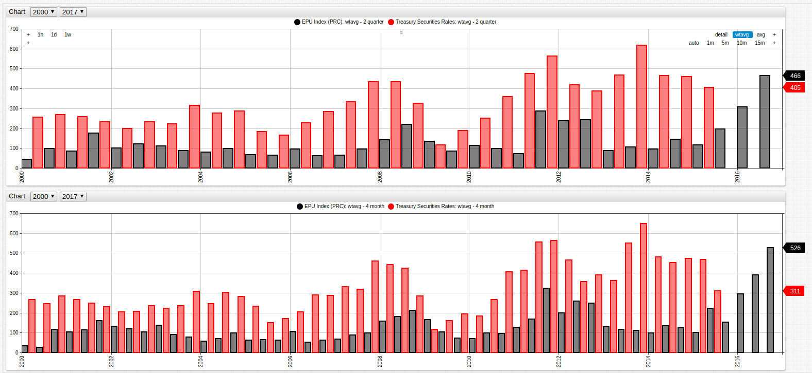
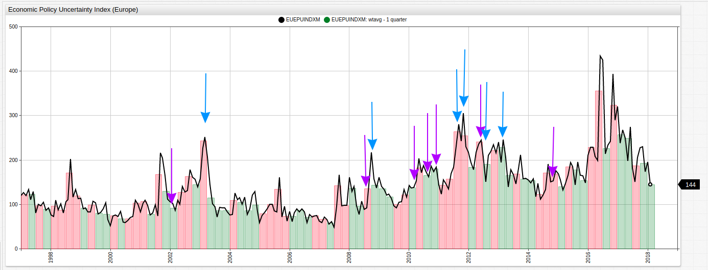

# United States Federal Reserve: The Economic Policy Uncertainty Index


[](https://apps.axibase.com/chartlab/59f36025#fullscreen)

*Fig. 1*: The EPU Index for the United States, China, Russia, and Europe (Eurozone countries), superimposed over the quarterly average of the same value. Months where the EPU value was greater than the quarterly average are shown in red using an [`alert-expression`](https://axibase.com/products/axibase-time-series-database/visualization/widgets/alert-expressions/).

**Source Data**: [FRED Economic Data](https://fred.stlouisfed.org/categories/33201)

**Visualization Tool**: [Axibase ChartLab](https://apps.axibase.com/chartlab)

**Structured Query Language (SQL)**: [Axibase SQL Console](https://github.com/axibase/atsd/blob/master/sql/README.md#overview)

## Introduction

Published in 2015 by the [National Bureau of Economic Research](http://www.nber.org/) in Cambridge, Massachusetts, a paper entitled [Measuring Economic Policy Uncertainty](http://www.policyuncertainty.com/media/BakerBloomDavis.pdf) seeks to establish a set of clear guidelines for quantifying economic policy uncertainty with the following questions:

* **Who** is responsible for making economic policy decisions?
* **What** economic policy will be enacted?
* What **effects** will that policy have on the local economy?

According to the authors (Baker, Bloom, and Davis), their EPU (Economic Policy Uncertainty) metric is able to accurately
predict economic growth and investment by tracking geopolitical events such as international treaties, public information like newspapers and policy position releases, and actual actions undertaken by government bodies such as a central bank raising interest rates.

## Visualization

This box chart shows the range of the EPU index for each of the 4 regions. A wider range shows greater variance of index values, and the central box has may be modified to include any [percentile](https://axibase.com/products/axibase-time-series-database/visualization/widgets/box-chart-widget/#tab-id-6) values. According to the data, the People's Republic of China has seen the most volatile movements of their EPU Index, followed by the Eurozone, the Russian Federation, and the United States. Perhaps this is due to recent slow downs in the fixed assets and exports industry in China in recent years as the index reached its absolute maximum value within the last few years.


[](https://apps.axibase.com/chartlab/af5d576e/2/#fullscreen)

*Fig 2*: Use the drop-down menus in the ChartLab sandbox to change the date range of the visualization. Open the Editor window to modify percentile range with a `percentile = X%/Y%` expression where `X` and `Y` are the values of the percentile range you would like to display.

Tracking the EPU Index for the People's Republic of China alongside more concrete metrics can be used to examine the validity of the EPU Index. Shown below, the EPU is placed alongside real PRC Treasury Securities rates for the last decade and a half. The quarterly and bi-annual averages are compared in the same environment and a `wtavg` expression is used to smooth the occasionally volatile movement of both indices. Treasury Securities are a good tool for tracking economic potential and growth because they show the interest rates that businesses borrowing money are paying to their lenders. Historically speaking, a lower interest rate usually encourages business to borrow money and expand their operations.


[](https://apps.axibase.com/chartlab/661d387e/#fullscreen)

*Fig. 3*: Economic Policy Uncertainty Index and PRC Treasury Securities Rates (2000-2017), bi-annually and quarterly.

The above figure was creating using the [`weighted average`](https://axibase.com/products/axibase-time-series-database/visualization/widgets/configuring-the-widgets/aggregators/) statistical tool. This tool may be used to creating a rolling average value for a specific time period. For more information about using this statistical tool, see the following [guide](../../Support/Moving-Avg/README.md).

### Dual Axis

Using a time series chart with two axes, drastically different data may be compared side-by-side without significantly altering one dataset using a [`replace-value`](https://apps.axibase.com/chartlab/3f080fe4/2/) expression. In the visualization here, per capita GDP for the Russian Federation is compared alongside EPU index for the same period of time using [`axis`](https://axibase.com/products/axibase-time-series-database/visualization/widgets/time-chart/#tab-id-2) expressions.


[](https://apps.axibase.com/chartlab/ebbe24c0/#fullscreen)

*Fig. 4*: The left and right axis display different orders of value based on the `axis` setting. Open the Editor window in ChartLab to see the syntax for such expressions.

Dual axis visualizations are helpful for comparing data of different orders of magnitude. In the above case for example the per capita GDP value tracks quite closely to the annual average EPU Index value for the Russian Federation.

## SQL Queries

Election season is a notoriously uncertain economic time period for the United States, as elections have been known to represent dramatic changes in policy and personnel that reshape the face of American policy. Using the following SQL query to track the EPU Index during election years only, and comparing that data to the election results, it is expected that more contested elections should generate a higher EPU Index.

```sql
SELECT year(time) AS Election, value AS EPU_Index
FROM usepuindxd_
WHERE year(time) % 4 = 0 AND month(time) = 1
```

The above query returns the following results:

| Year | EPU Index |
|---|:--:|
|2016|80.38|
|2012|93.05|
|2008|182.06|
|2004|156.17|
|2000|80.38|

Using [public data](https://www.britannica.com/topic/United-States-Presidential-Election-Results-1788863) from [Encyclopaedia Britannica](https://www.britannica.com/) to track election results for the same period of time produces the following visualization.


[](https://apps.axibase.com/chartlab/73ab0050/2/#fullscreen)

*Fig. 5*: Historical election result data from recent U.S. presidential elections, the winning candidate has been separated from the remaining area using the [`expand`](https://axibase.com/products/axibase-time-series-database/visualization/widgets/pie-chart-widget/#tab-id-2) setting. Open the ChartLab sandbox to view the complete figure.

Although the 2016 election was one of the more contentious in recent U.S. history, the EPU index immediately before the election was lower than the previous four elections.

The European debt crisis was a financial debacle that was inflamed by the so called P.I.G.S. countries (Portugal, Ireland, Greece, and Spain) coming dangerously close to defaulting on their outrageously high government debts. Tracking several events alongside the EPU index reflects the panic and uncertainty of the multi-year crisis, bailout, and recovery process. Using the following 7 events to chronicle the timeline:

* Jan 1, 2002: Euro banknotes and coins begin circulation.
* Nov 27, 2008: European Union stimulus package totalling 200 billion Euro is proposed and eventually approved.
* Feb 9, 2010: The first of three austerity packages are introduced to combat out of control debt growth in Greece.
* May 2, 2010: European Union announces a 110 billion Euro bailout for Greece.
* Nov 28, 2010: European Union announces an 85 billion Euro bailout for the Republic of Ireland.
* Mar 13, 2012: A second bailout for Greece is proposed and approved for and additional 130 billion Euro after further inspection of government financial records reveal the depth and severity of the problem is even worse than originally understood.
* July 1, 2014: The end of the EU bailout policy, and completion of funds distribution.

The following SQL query will return the [average value](https://github.com/axibase/atsd/blob/master/sql/README.md#aggregation-functions) of the EPU index for the Eurozone for the period from 2002 until 2018 and will consolidate the information using a [`round` expression](https://github.com/axibase/atsd/blob/master/sql/README.md#mathematical-functions).

```sql
SELECT ROUND(AVG(value), 0) AS "average-epu" FROM EUEPUINDXM_
  WHERE datetime  >= '2002-01'
```

> The `datetime` column can be compared with literal dates specified in [various date formats](https://github.com/axibase/atsd/blob/master/sql/README.md#interval-condition) including ISO 8601 and short dates such as `yyyy-MM`.

This query returns the following:

|average-epu|
|:-:|
|152|

The next query will target the months of each of the events above and so we can compare it to the index value from the birth of the Euro to the periods including the crisis, bailout, and eventual recovery.

```sql
SELECT datetime, ROUND(value,0) FROM EUEPUINDXM_
  WHERE datetime  IN ('2002-01','2008-11','2010-02','2010-05','2010-11','2012-03','2014-07')
```

Multiple `datetime` values can be conveniently enumerated as a list using an [`IN`](https://github.com/axibase/atsd/blob/master/sql/README.md#in-expression) expression. The above query returns the following values for each of the targeted months:

|Event|EPU Index Value|
|---|:-:|
|Euro banknotes begin circulation|106|
|EU stimulus package|157|
|Greek austerity rollout|137|
|Greek bailout #1|203|
|Ireland bailout|173|
|Greek bailout #2|177|
|Bailout period concludes|120|

Further querying the data to show the top seven entries for the period from January 2002 to July 2014 using the following:

```sql
SELECT datetime, ROUND(value, 0) AS "top-epu" FROM EUEPUINDXM_
  WHERE datetime  >= '2002-01'
  --AND datetime <= '2014-07'
  --ORDER BY value desc LIMIT 7
```

This query shows that none of the expected entries appear among the greatest EPU index values during the examined time period in descending order using an [`ORDER BY`](https://github.com/axibase/atsd/blob/master/sql/README.md#where-clause) expression in the `WHERE` clause.

|Date|EPU Index Value|
|---|:-:|
|2011-11|305|
|2011-09|280|
|2003-03|251|
|2013-03|245|
|2012-06|245|
|2011-10|242|
|2013-01|240|

Tracking both results on a simple [time series chart](https://axibase.com/products/axibase-time-series-database/visualization/widgets/time-chart/) to compare the expected versus actual results:



*Fig 5*: Highlighted above are points from both queries. Expected results are highlighted with purple arrows while actual results are highlighted with blue arrows.

## Conclusion

As expected the EPU Index is much stronger as a metric that tracks changes across broader periods of time than responding to specific events, evidenced by the inability of the index to respond to major events such as those predicted in the Eurozone demonstrations. However, it is quite a strong predictor of broad periods of time, when the vast number of factors considered by the economists who designed the index may be compiled together and averaged for longer spans.

Using SQL queries and visualization tools, predictive algorithms and compiled indices may be quickly evaluated against actual data to confirm their validity and evaluate their relative strengths and weaknesses.

### Resources

Use the following tools to recreate any of the visualizations seen here.

* Install an ATSD instance on your local Linux system [here](https://github.com/axibase/atsd/blob/master/installation/README.md).
* Visit [FRED](https://fred.stlouisfed.org/) for any of the data used in this article.
* Access the ChartLab sandbox, and other Axibase applications, [here](https://apps.axibase.com/) and comprehensive documentation [here](https://axibase.com/products/axibase-time-series-database/visualization/widgets/).
* Download the following [parser job file](resources/csv-parser-epu-demo.xml) which contains the settings that you can use to configure the CSV Document parser in the ATSD interface. Use the following [walkthrough](../../how-to/shared/import-csv-parser.md) for help uploading the XML file to ATSD.
