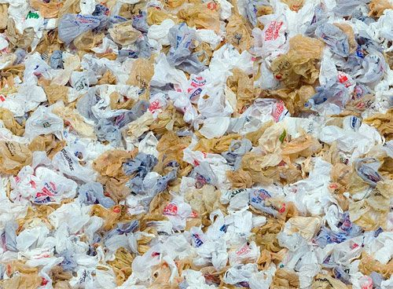
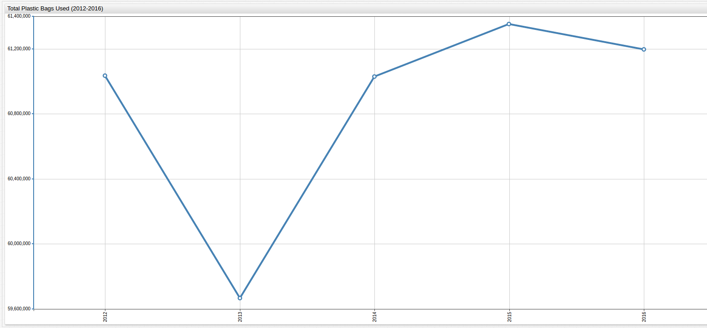
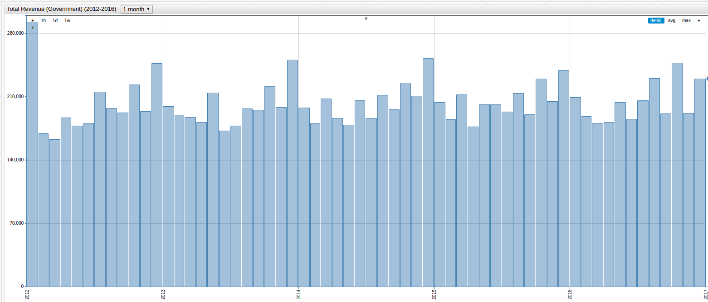
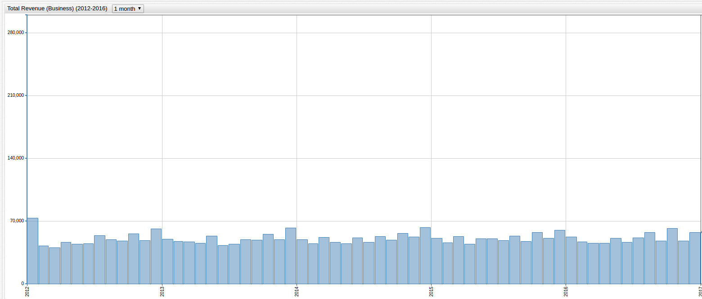
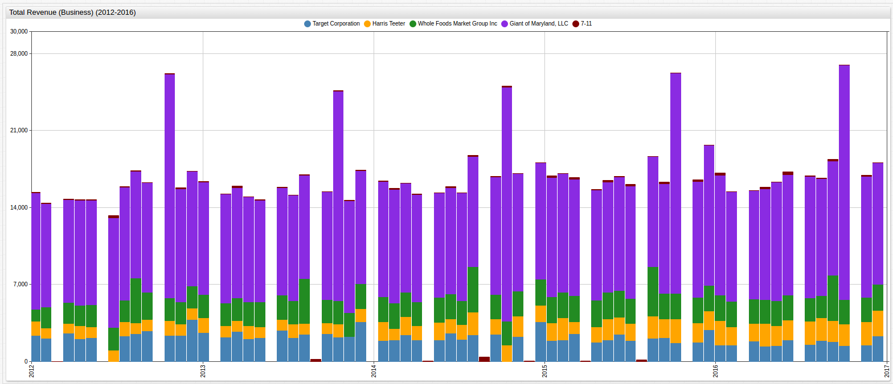
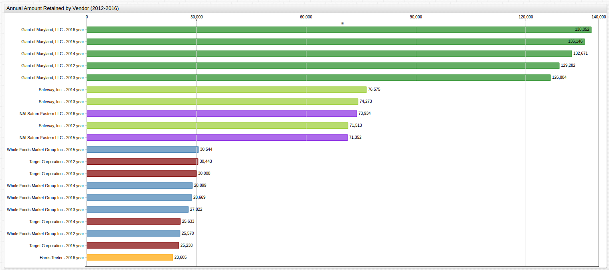

# The Effectiveness of the Bag Tax



## Introduction

Many local governments across the country have already put in to effect the now famous "Bag Tax," meant to encourage better
habits while shopping and discourage rampant, wasteful use of the dreaded plastic bag. The legislation is straightforward
enough, shoppers who want plastic bags for whatever reason have to pay up, usually around a nickel per bag; the new excise
tax is collected by the store who passes it on to the county government, while keeping up to a penny for themselves. In
Montgomery County, Maryland the [revenue generated by the tax](https://www3.montgomerycountymd.gov/311/Solutions.aspx?SolutionId=1-2H7NJZ)
is put towards water quality initiatives.

The Montgomery County tax was put into effect in 2012, and was presented not as a means of generating revenue, but rather as a way of reducing
plastic bag litter, which adds an estimated [forty tons](http://montgomerycountymd.gov/bag/Resources/Files/community_presentation.pdf) of debris to local rivers and tributaries every year. Montgomery County
spends an average [$3 million every year](http://montgomerycountymd.gov/bag/Resources/Files/community_presentation.pdf)
cleaning up such waste and initially estimated that the Bag Tax would be able to reduce plastic bag-related waste in local
waterways by up to [65%](http://montgomerycountymd.gov/bag/Resources/Files/community_presentation.pdf).

The Montgomery County Bag Tax has now been in effect for half a decade, and the county has released [data](https://catalog.data.gov/dataset/bag-tax)
that quantifies the tax's relevant metrics: how much various retailers are collecting from shoppers, how much they are paying
to the county government versus keeping for themselves, and perhaps most importantly, the number of plastic bags going out
door and potentially, into the county's waterways.

## Data

In order to measure the effectiveness of the bag tax as a method of reducing overall plastic bag use, the Montgomery County
data from the [2010 United States Census](https://www.census.gov/2010census/data/) can be used to define a per capita usage
of plastic bags and assess whether the last five years have shown a decrease in plastic bag usage as the city intended. Because
the official Census was performed in 2010, and local population estimates exist for 2015 an average step amount must be calculated
in order to determine yearly population totals. Averaging the difference in population numbers provides a approximate per year
increase value (+14,503 persons) which gives these estimates:

| Year | Population |
|------|------------|
| 2012 | 1,000,783 |
| 2013 | 1,015,286 |
| 2014 | 1,029,789 |
| 2015* | 1,044,292 |
| 2016 | 1,044,292 |

> *Source: Montgomery College [Public Data](http://cms.montgomerycollege.edu/EDU/Department.aspx?id=45574)

### Overall Bag Usage

Because of the 2012 implementation date of the Montgomery County Bag Tax, records about businesses' bag usage before 2012
are scarce. However, tracking from 2012 until 2016 is possible and can be used to grade plastic bag usage using the
[SQL Console](https://axibase.com/docs/atsd/sql/):

```sql
SELECT date_format(time, 'yyyy') AS "Year", sum(value)/1000000 AS "Bag Count (Million)"
  FROM bagcount WHERE date_format(time, 'yyyy') BETWEEN '2012' AND '2016'
GROUP BY 'Year'
  ORDER BY 'Year'
```

```ls
| Year | Bag Count (Million) |
|------|---------------------|
| 2012 | 61.0                |
| 2013 | 59.7                |
| 2014 | 61.0                |
| 2015 | 61.4                |
| 2016 | 61.2                |
```



[](https://apps.axibase.com/chartlab/945ebdb5/2/#fullscreen)

### Per Capita Bag Usage Defined

| Year | Per Capita Bag Use |
|------|:------------------:|
| 2012 | 61 |
| 2013 | 59 |
| 2014 | 59 |
| 2015 | 59 |
| 2016 | 58 |

This table shows that after the initial drop in plastic bag usage, the average person continued to use the same number of bags
until 2016 when another drop was detected. For clarification, per capita bag use divides the number of people living in Montgomery
County by the number of reported bags used per year to arrive at an estimated value of the number of plastic bags used by
the average person in a given year. Though the population of Montgomery County, Maryland is growing the number of bags used
is decreasing.


[](https://apps.axibase.com/chartlab/945ebdb5/15/#fullscreen)

This visualization shows the same timespan as above, but aggregates total plastic bag usage by month instead of
year, highlighting the sharp increases and decreases in month-to-month usage. The local maxima for each year is unsurprisingly
located somewhere during the holiday season each year.

### Revenue Generated (County Government)

The county mandates that a plastic bag cost as much as $0.05, with $0.04 paid to the government and a maximum $0.01 kept by
the organization selling to the plastic bag to offset the additional infrastructure needed to accurately record bag sales.

```sql
SELECT date_format(time, 'yyyy') AS "Year", sum(value)/1000000 AS "Tax Revenue (Million USD)"
  FROM amountdue WHERE date_format(time, 'yyyy') BETWEEN '2012' AND '2016'
GROUP BY 'Year'
  ORDER BY 'Year'
```

```ls
| Year | Tax Revenue (Million USD) |
|------|---------------------------|
| 2012 | 2.44                      |
| 2013 | 2.39                      |
| 2014 | 2.44                      |
| 2015 | 2.45                      |
| 2016 | 2.45                      |
```

> Use the dropdown menu to view totals by year, month, or week.



[](https://apps.axibase.com/chartlab/945ebdb5/9/#fullscreen)

> This chart shows the amount of revenue generated from five of the largest companies in the country.


[](https://apps.axibase.com/chartlab/945ebdb5/10/#fullscreen)

> Note that certain months are empty because many companies pay their taxes at some internally-determined interval, which
may result in a delay in payments. This typically applies to larger companies who may aggregate bag sales across the entire
county instead of just one or two locations.

The income generated by the county government aligns fairly well to the costs expected to accumulate from waterway clean-up
projects targeted at removing litter from local streams and rivers. The table here shows per capita amounts paid to the Montgomery
County Government:

| Year | Per Capita Tax Paid |
|------|:-------------------:|
| 2012 | $2.44 |
| 2013 | $2.35 |
| 2014 | $2.37 |
| 2015 | $2.35 |
| 2016 | $2.35 |

The Bag Tax costs each citizen roughly two and a half dollars each year, hardly a burden on even the most modest salary.

### Revenue Generated (Private Business)

```sql
SELECT date_format(time, 'yyyy') AS "Year", sum(value)/1000000 AS "Revenue Generated (Million USD)"
  FROM amountretained WHERE date_format(time, 'yyyy') BETWEEN '2012' AND '2016'
GROUP BY 'Year'
  ORDER BY 'Year'
```

```ls
| Year | Revenue Generated (Million USD) |
|------|---------------------------------|
| 2012 | 0.61                            |
| 2013 | 0.60                            |
| 2014 | 0.61                            |
| 2015 | 0.61                            |
| 2016 | 0.61                            |
```

> View revenue generated by all Maryland vendors for the observed period, by week, month, or year.



[](https://apps.axibase.com/chartlab/945ebdb5/13/#fullscreen)



[](https://apps.axibase.com/chartlab/945ebdb5/14/#fullscreen)

Montgomery County businesses were able keep about $610,000 between them each year. The table below shows this cost passed on
to the people of Montgomery County:

| Year | Per Capita Revenue Generated |
|------|:----------------------------:|
| 2012 | $0.61 |
| 2013 | $0.59 |
| 2014 | $0.59 |
| 2015 | $0.58 |
| 2016 | $0.58 |

## Analysis

The average Montgomery County citizen has paid roughly three dollars each year since the bag tax was implemented in 2012, with
the majority of that total used by the government to offset their own costs for water quality improvement projects.
Although companies in the county were able to generate some extra income, it is likely that this amount was re-invested
to deal with the increase in infrastructure related to the levying of the new tax, new employees, paperwork,
overtime, or a little bit of all four. Even when analyzing these profits by business, no individual or organization
made a significant amount from the Bag Tax:

```sql
SELECT tags.vendorname AS "Vendor", date_format(time, 'yyyy') AS "Year", sum(value)/1000000 AS "Revenue (Million USD)"
  FROM amountretained WHERE date_format(time, 'yyyy') BETWEEN '2012' AND '2016'
GROUP BY 'Year', 'Vendor'
  ORDER BY 'Revenue (Million USD)' DESC
LIMIT 20
```

```ls
| Vendor                       | Year | Revenue (Million USD) |
|------------------------------|------|-----------------------|
| Giant of Maryland, LLC       | 2016 | 0.14                  |
| Giant of Maryland, LLC       | 2015 | 0.14                  |
| Giant of Maryland, LLC       | 2014 | 0.13                  |
| Giant of Maryland, LLC       | 2012 | 0.13                  |
| Giant of Maryland, LLC       | 2013 | 0.13                  |
| Safeway, Inc.                | 2014 | 0.08                  |
| Safeway, Inc.                | 2013 | 0.07                  |
| NAI Saturn Eastern LLC       | 2016 | 0.07                  |
| Safeway, Inc.                | 2012 | 0.07                  |
| NAI Saturn Eastern LLC       | 2015 | 0.07                  |
| Whole Foods Market Group Inc | 2015 | 0.03                  |
| Target Corporation           | 2012 | 0.03                  |
| Target Corporation           | 2013 | 0.03                  |
| Whole Foods Market Group Inc | 2014 | 0.03                  |
| Whole Foods Market Group Inc | 2016 | 0.03                  |
| Whole Foods Market Group Inc | 2013 | 0.03                  |
| Target Corporation           | 2014 | 0.03                  |
| Whole Foods Market Group Inc | 2012 | 0.03                  |
| Target Corporation           | 2015 | 0.03                  |
| Harris Teeter                | 2016 | 0.02                  |
```



[](https://apps.axibase.com/chartlab/95365f3d/7/#fullscreen)

Even enormous national retailers like [Giant-Landover](https://giantfood.com/), [Whole Foods](http://www.wholefoodsmarket.com/), and [Safeway](http://www.safeway.com/)
never recorded a significant amount of revenue from bag sales, though Giant-Landover held the top spot for every recorded year, with a
five year total revenue of $670,000 (Don't worry too much though, that total accounts for about 0.02% of their recorded 2016 profits).

## Conclusions

After the initial implementation of the Bag Tax, plastic bags sales noticeably decreased the following year. After that, sales
recovered slightly and now the average person uses about four less plastic bags a year. With respect to its goal of reducing
overall plastic bag use, at least in Montgomery County, the Bag Tax seems ineffective. However, the income
generated from plastic bag sales is used by the county government to enact water quality initiates which counteract the harmful
effects of plastic litter clogging up the county's waterways. The county estimates this total to be around $3 million, and
the Bag Tax successfully generated roughly that amount. This may be the Bag Tax's hidden beauty, while perhaps ineffective at modifying
the desired behavior, by taxing plastic bag users for their bags, the county is able to offset its own costs which previously
came from another revenue source and still perform its goals of removing garbage from the environment without any individual
or group seeing a steep increase in their personal tax payments.

Many detractors of the Bag Tax make claims that businesses will be able to illicitly profit from the sale of plastic bags,
but according to the data, most retailers and wholesalers saw an insignificant amount of money retained as a result of implementation.
Additionally, the amount of money that the tax generates for the government itself is most likely not even enough to totally
offset the cost of their already operating waterway clean-up programs.

From its declared standpoint of reducing plastic bag usage, the bag tax appears to come up short, however its value is demonstrated
in its ability to generate needed income for important projects by collecting almost imperceptible amounts from each citizen
and then using that money to perform tasks made necessary by the product being taxed. The Bag Tax is in fact,
everything a tax is supposed to be.