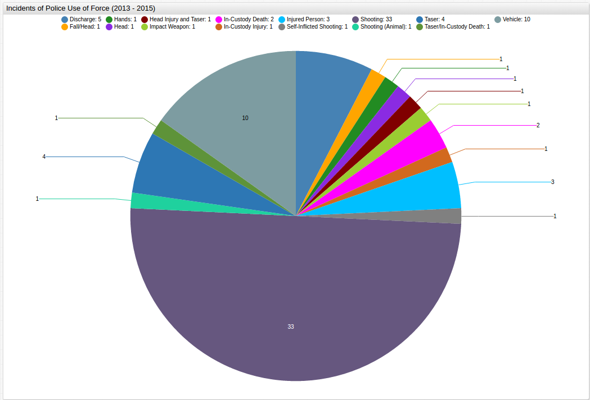
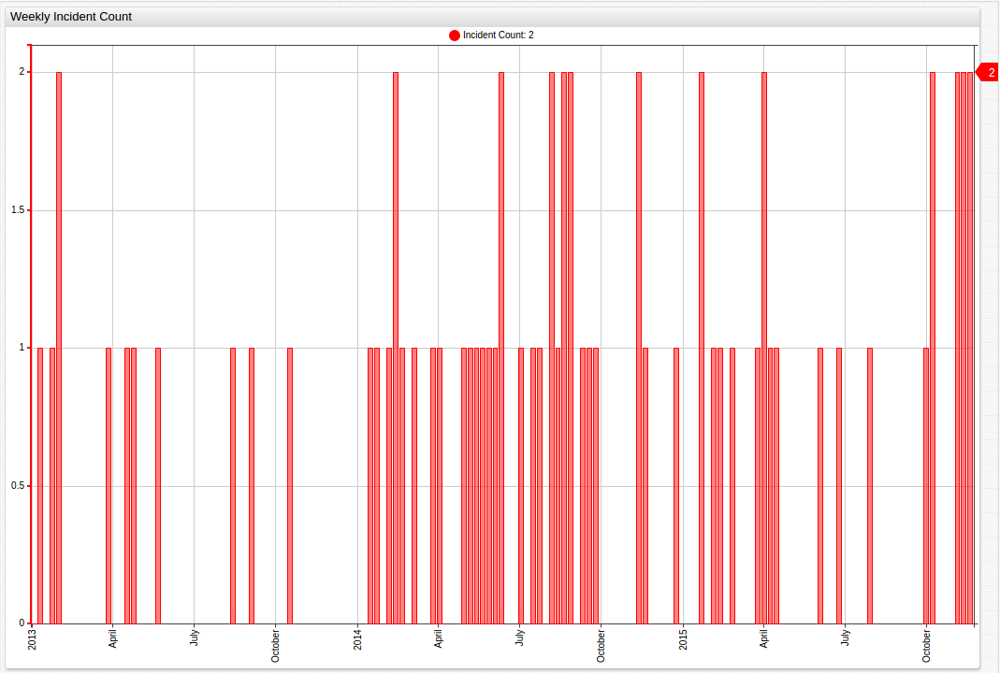
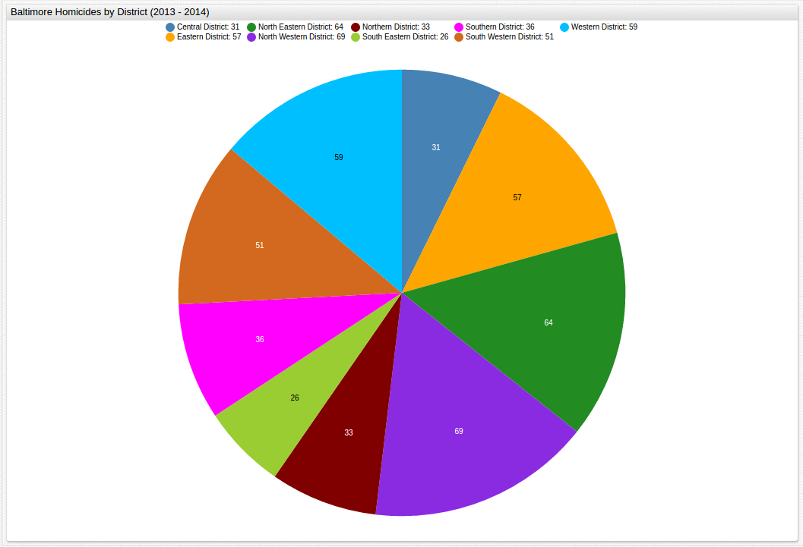
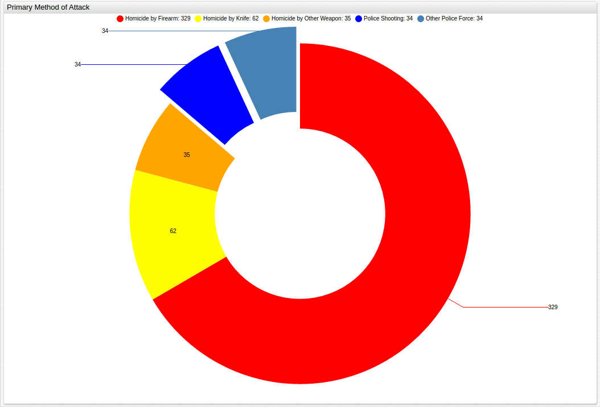
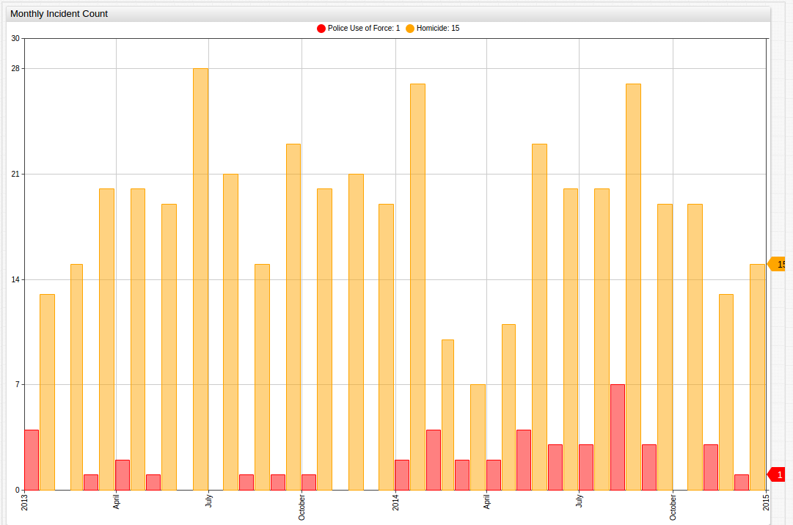
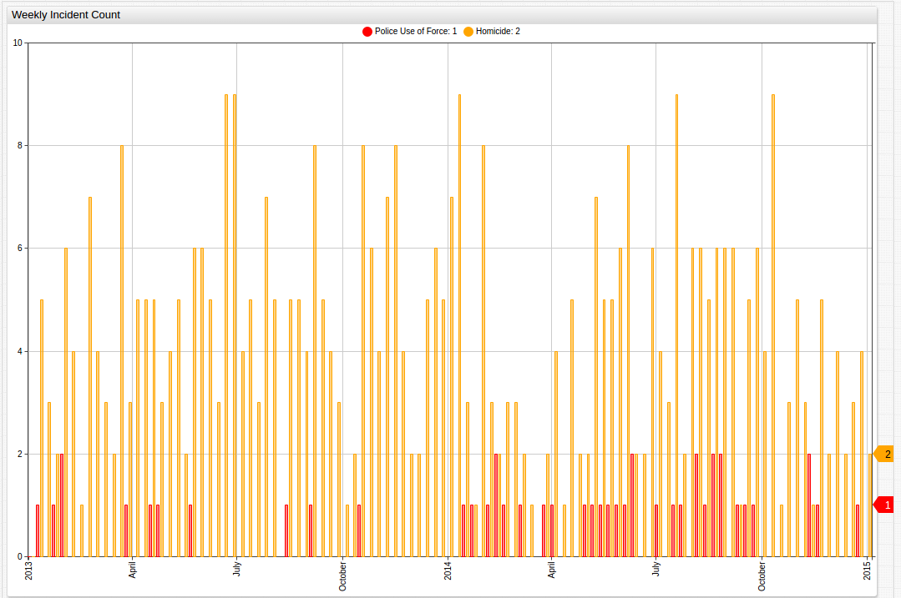
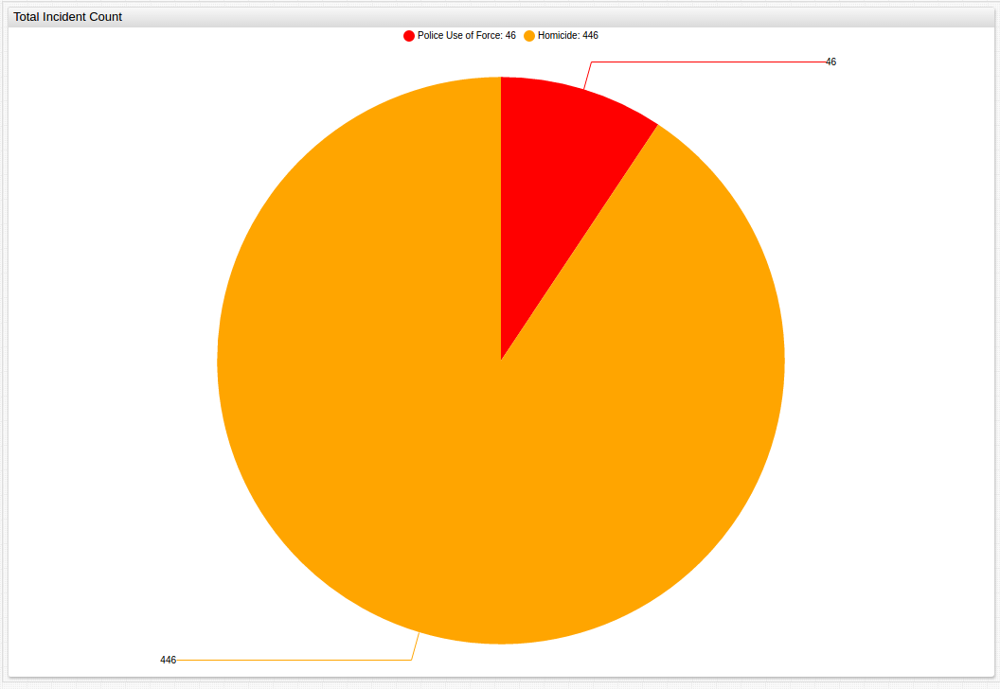
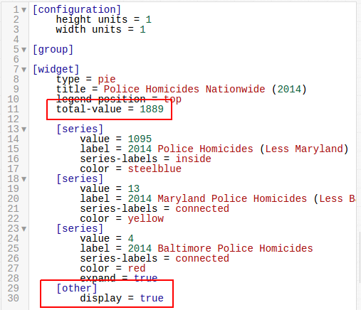
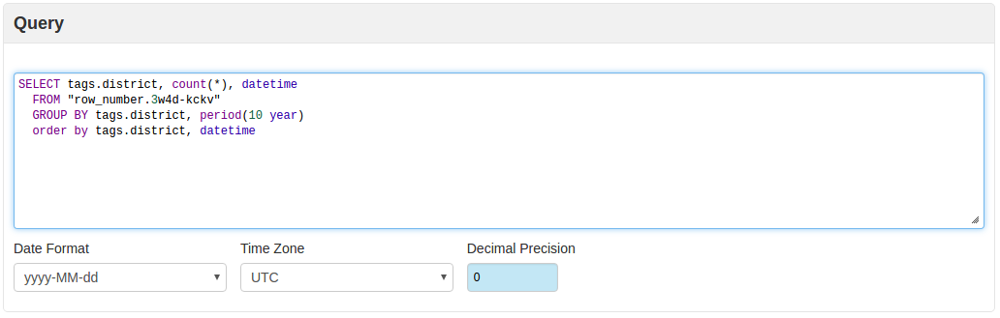

### Baltimore Police and the Use of Force


#### Methodology

The City of Baltimore, Maryland has published [data](https://catalog.data.gov/dataset/2013-2014-bpd-officer-involved-shootings-bcf3c)
about incidents of force used by the Police Department which have come under investigation by 
the BPD Force Investigation Team. Using this data set, which begins in 2013 and continues until the end of 2015, 
these actions can be scrutinized based on a number of criteria including the location 
of the incident, the nature of the incident, and the date of the incident. 
Axibase Time Series Database software allows for the presentation of such data in a way that 
underscores key features of the information. Due to the nature of the data, using a 
[Structured Query Language](https://github.com/axibase/atsd/blob/master/api/sql/README.md#overview)
is the most effective way to sort and display the information. In order to efficiently query
this data, it should be converted into a more usable time series, 
using [Socrata](https://github.com/axibase/axibase-collector/blob/master/jobs/socrata.md).

_(For additional information about performing these steps, please see the [Action Items](#Action-Items)
section below)_

Additionally, the City of Baltimore has recorded a number of figures regarding crime in the city,
including homicide rates during the years 2013 and 2014. Baltimore has one of the highest murder 
rates in the country, and even ranks 19th on the planet 
[for highest per capita murder rate](http://www.worldatlas.com/articles/most-dangerous-cities-in-the-world.html).
These two data sets can be compared and contrasted to underline a number of features
regarding the nature and the scope of the violence that occurs against the backdrop of a nearly three hundred
year old city less than forty miles from the nation's capitol.

#### Data

The general format for SQL queries for this data set is:

```sql
SELECT tags.YOURTAGHERE, count(*), datetime
  FROM "row_number.YOUR_DATA_HERE" 
  GROUP BY tags.YOUR_TAG_HERE, period(YOUR_TIMEPERIOD_HERE)
  order by tags.YOUR_TAG_HERE, datetime
```

The Structured Query Language allows the user to ask and answer a series of relevant questions
about both sets of data, and ChartLab allow the user to visualize and compare this data for
an even deeper understanding of the information. For a step-by-step explanation of how to
effectively format your data and structure your queries
the [Action Items](#Action-Items) section at the end of the article will provide more comprehensive 
instructions.

##### Where Did These Incidents Occur?


To organize the data so that the location of the incident is considered, the following SQL query
is used:

```sql
SELECT tags.district, count(*), datetime
  FROM "row_number.3w4d-kckv" 
  GROUP BY tags.district, period(10 year)
  order by tags.district, datetime
```
Notice the time period is arbitrarily set to a 10-year interval, any interval greater than the
total interval of the data (roughly three years) will display the results identically.

This query's results are displayed as follows:

```ls
| tags.district | count(*) | 
|---------------|----------| 
| null          | 3        | 
| CD            | 3        | 
| ED            | 11       | 
| ND            | 5        | 
| NED           | 8        | 
| NWD           | 8        | 
| SD            | 6        | 
| SED           | 5        | 
| SWD           | 10       | 
| WD            | 9        | 
```

The data has been sorted by its cardinal and intermediate cardinal direction,
this classification corresponds to the Baltimore City Planning Map
shown below. Data lacking location information has been displayed with the district tag `null`.
Please notice that the Eastern District of the city is split into two Police Precincts 
(Eastern and Southeastern), and the unlabeled blue area just below the Central District is
considered to be Downtown for planning purposes but is patrolled by police from the Central
Precinct, so that data will be included with other Central District data.


_([Source](http://cityview.baltimorecity.gov/planningmaps/index.html#/map/1389e1fceb374e1e98a82800e46a8a63):
Baltimore City Planning Department)_

The results from the first query can also be visualized as shown below, by precinct:


##### What Was the Nature of These Incidents?

To organize the data so that the nature of the incident is considered, the following SQL query
is used:

```sql
SELECT tags.type, count(*), datetime
  FROM "row_number.3w4d-kckv" 
  GROUP BY tags.type, period(10 year)
  order by tags.type, datetime
```

This query's results are displayed as follows:

```ls
| tags.type                | count(*) |
|--------------------------|----------|
| Discharge                | 5        |  
| Fall/Head                | 1        |
| Hands                    | 1        |
| Head Injury              | 3        |
| Head Injury & Taser      | 1        |
| Impact Weapon            | 1        |
| In Custody Injury        | 1        |
| In Custody Death         | 2        |
| Injured Person           | 3        | 
| Self Inflicted Shooting  | 1        | 
| Shooting                 | 33       |
| Shooting (Animal)        | 1        |
| Taser                    | 4        |
| Taser / In Custody Death | 1        |
| Vehicle                  | 10       |
```

Shown below is a visualization of three years' worth of incidents, sorted by the type of 
altercation:



##### When Did These Incidents Occur?

To organize the data so that the year of the incident is considered, the following SQL query is
used:

```sql
SELECT datetime, count(*)
  FROM "row_number.3w4d-kckv" 
  GROUP BY period(1 year)
  order by datetime
```

Notice here that the time interval is not arbitrary because it is the variable being considered.
In order to display the results at an interval of one year, set the time period to one year.

This query's results are displayed as follows:

```ls
| datetime   | count(*) | 
|------------|----------| 
| 2013-01-01 | 12       | 
| 2014-01-01 | 34       | 
| 2015-01-01 | 22       | 
```

To organize the data so that the month of the incident is considered, the following SQL query is
used:

```sql
SELECT datetime, count(*)
  FROM "row_number.3w4d-kckv" 
  GROUP BY period(1 month)
  order by datetime
```

This query's results are displayed as follows:

```ls
| datetime   | count(*) | 
|------------|----------| 
| 2013-01-01 | 5        | 
| 2013-03-01 | 1        | 
| 2013-04-01 | 2        | 
| 2013-05-01 | 1        | 
| 2013-08-01 | 1        | 
| 2013-09-01 | 1        | 
| 2013-10-01 | 1        | 
| 2014-01-01 | 2        | 
| 2014-02-01 | 4        | 
| 2014-03-01 | 2        | 
| 2014-04-01 | 2        | 
| 2014-05-01 | 4        | 
| 2014-06-01 | 3        | 
| 2014-07-01 | 3        | 
| 2014-08-01 | 7        | 
| 2014-09-01 | 3        | 
| 2014-11-01 | 3        | 
| 2014-12-01 | 1        | 
| 2015-01-01 | 2        | 
| 2015-02-01 | 3        | 
| 2015-03-01 | 1        | 
| 2015-04-01 | 4        | 
| 2015-06-01 | 2        | 
| 2015-07-01 | 1        | 
| 2015-09-01 | 1        | 
| 2015-10-01 | 2        | 
| 2015-11-01 | 6        | 
```

Notice that months without incident are omitted from the results table. This data can be 
further visualized in ChartLab:


[](https://apps.axibase.com/chartlab/3f33d4ba/19/)

Empty columns, or months without incident, are not omitted here, because the nature of the
visualization is such that an omission of empty months would distort the chronology of the
data.

To organize the data so that the week of the incident is considered, the following SQL 
query is used:

```sql
SELECT datetime, count(*)
  FROM "row_number.3w4d-kckv" 
  GROUP BY period(1 week)
  order by datetime
```
These results can also be visualized in ChartLab:



[](https://apps.axibase.com/chartlab/3f33d4ba/21/)

To organize the data so that the day of the incident is considered the following SQL query is
used:

```sql
SELECT datetime, count(*)
  FROM "row_number.3w4d-kckv" 
  GROUP BY period(1 day)
  order by datetime
```

For the sake of brevity, the resulting table is displayed below in the [Appendix](#Appendix). 

Using [homicide data](https://data.baltimorecity.gov/Crime/Homicides-2013-Present/33zm-qy8h#rateUp)
also provided by the City of Baltimore, the scale of police brutality can be shown alongside
instances of homicide by civilians on other civilians. Does an increase in homicides result in
an increase in police use of force? Do districts that see high levels of police use of force
also see high levels of homicide? Is there a correlation at all? 

Similar to the first data set, [Socrata](https://github.com/axibase/axibase-collector/blob/master/jobs/socrata.md)
should be used to compile the data in meaningful way and a [Structured Query Language](https://github.com/axibase/atsd/blob/master/api/sql/README.md#overview)
should be used again.

_(For a more detailed explanation of performing SQL Queries, see the [Appendix](#Appendix)
below)_

##### Where Did These Homicides Occur?

To organize the data so that the location of the incident is considered, 
the following SQL query is used:

```$xslt
SELECT tags.district, count(*), datetime
  FROM "row_number.33zm-qy8h" 
  GROUP BY tags.district, period(10 year)
  order by tags.district, datetime
```
Once again, an arbitrary time period greater than the two-year period of observation is used, 
in order to truncate the data to a convenient display. This query's results are displayed as
follows:

```ls
| tags.district | count(*) | 
|---------------|----------| 
| CENTRAL       | 31       | 
| EASTERN       | 57       | 
| NORTHEASTERN  | 64       | 
| NORTHERN      | 33       | 
| NORTHWESTERN  | 69       | 
| SOUTHEASTERN  | 26       | 
| SOUTHERN      | 36       | 
| SOUTHWESTERN  | 51       | 
| WESTERN       | 59       | 
```

A second visualization of the data shows nearly identical results to those seen above, the rates
of homicides and incidents of police use of force follow a similar pattern:



Using a side-by-side comparison in ChartLab, the data can be viewed even more precisely,
and the relationship between incidents resulting in the use of force by police, the local
rate of homicide, and the location of the incident is underscored:


[](https://apps.axibase.com/chartlab/e3872c5c/5/)

Although the recorded incidents of police use of force are not necessarily fatal, for the 
given time period eight of them resulted in the death of the victim, there is ostensibly 
a correlation between incidents of homicide and incidents of police use of force when the
data is controlled for location. Areas with a higher frequency of homicides often see
an increase in the number of events that the Baltimore Police use force to apprehend 
someone with whom they come in contact.

##### What was the Nature of These Homicides? 

The City of Baltimore includes figures that consider the weapon used in the commission of
recorded homicides, to query the SQL Console about this information, the following syntax
is used:

```ls
SELECT tags.weapon, count(*), datetime
  FROM "row_number.33zm-qy8h" 
  GROUP BY tags.weapon, period(10 year)
  order by tags.weapon, datetime
  ```

Unsurprisingly, firearms are the primary tool of homicide for the observed period. The results
of this query are displayed as follows:

```ls
| tags.weapon | count(*) | 
|-------------|----------| 
| FIREARM     | 329      | 
| KNIFE       | 62       | 
| OTHER       | 35       | 
```

These results can be shown alongside the primary method of attack by police in recorded 
incidents:



Data from police-involved incidents is shown in two shades of blue, and has been separated
from the primary portion of the graph to highlight its insertion here.

##### When Did These Homicides Occur? 

To organize the data so that the year of the incident is considered, the following SQL query 
is used:

```$xslt
SELECT datetime, count(*)
  FROM "row_number.33zm-qy8h" 
  GROUP BY period (1 year)
  order by datetime
```

The results of this query are displayed as follows:

```ls
| datetime   | count(*) | 
|------------|----------| 
| 2013-01-01 | 222      | 
| 2014-01-01 | 204      | 
```

Because of the way the data is stored, modifications need to be made to the way the collector
reads the data for effective use, see the [Action Items](#Action-Items) below for the assignment code
needed.

To organize the data so that the month of the incident is considered, the following SQL
query is used:

```$xslt
SELECT datetime, count(*)
  FROM "row_number.33zm-qy8h" 
  GROUP BY period (1 month)
  order by datetime
```

The results of this query are displayed as follows:

```ls
| datetime   | count(*) | 
|------------|----------| 
| 2013-01-01 | 14       | 
| 2013-02-01 | 13       | 
| 2013-03-01 | 18       | 
| 2013-04-01 | 20       | 
| 2013-05-01 | 20       | 
| 2013-06-01 | 24       | 
| 2013-07-01 | 18       | 
| 2013-08-01 | 15       | 
| 2013-09-01 | 23       | 
| 2013-10-01 | 18       | 
| 2013-11-01 | 20       | 
| 2013-12-01 | 19       | 
| 2014-01-01 | 24       | 
| 2014-02-01 | 10       | 
| 2014-03-01 | 7        | 
| 2014-04-01 | 12       | 
| 2014-05-01 | 22       | 
| 2014-06-01 | 18       | 
| 2014-07-01 | 21       | 
| 2014-08-01 | 26       | 
| 2014-09-01 | 18       | 
| 2014-10-01 | 18       | 
| 2014-11-01 | 13       | 
| 2014-12-01 | 15       | 
```

Using ChartLab, a side-by-side comparison of incidents of police use of force and homicides in
the city of Baltimore can be done on a monthly basis:



[](https://apps.axibase.com/chartlab/3f33d4ba/22/)

Here, the same correlation is less visible, with only one of the three spikes in homicides 
matched by a similar spike in police use of force.

Likewise, a side-by-side comparison of incidents of police use of force and homicides in the 
city of Baltimore can be done on a weekly basis:



[](https://apps.axibase.com/chartlab/3f33d4ba/23/)

Here, the peaks in police use of force are further smoothed to indicate that the hypothetically
resultant increase in police use of force actually occurs on a somewhat delayed basis after
a spike in the number of homicides.

Notice that in ChartLab, the `endtime` command has to be modified to reflect the
difference in observation periods of the two data sets.

These two data sets can also be combined to show the total number of incidents of police use of force and homicides
over the span of the entire observed period.



[](https://apps.axibase.com/chartlab/3f33d4ba/25/)

#### Analysis

After the death of Freddie Gray at the hands of the Baltimore Police Department in 2015, widespread
protests broke out across the country with the epicenter of the demonstrations in the city of
Baltimore itself. These demonstrations quickly led to violence, with drugstores looted, vehicles
set on fire, and police officers and protesters alike injured in the ensuing melee. The 
city was ultimately placed under an official state of emergency by the Governor of Maryland and 
the State National Guard was deployed to quash the unrest. The incident brought to light
a range of issues with the way the American police force deals with the people they are sworn to
protect and serve.

Across the entire United States, official data on people killed by the police is surprisingly difficult to find. 
Police agencies are not obligated to provide this data and as a result many of them do not. There are several citizen-run
operations that collect data but [the most reliable of these](http://www.killedbypolice.net/) 
did not begin operation until May of 2013. Based on their figures, which cite news stories for each killing they claim,
777 Americans were killed in 2013 and 1,112 were killed in 2014 at the hands of the
police. Fifteen of these victims were killed in the state of Maryland in 2013 and seventeen were killed in 2014. 
From these numbers, four victims were killed in Baltimore in 2013 and four more were killed in 2014. Officer-involved
homicide made up 1.9% of total Baltimore homicides in 2013, and 1.8% of total Baltimore homicides in 2014. 


In order to display the total number of police homicides for the observed years, the `[other]`
function can be used, only displaying the desired year's data, but still showing other data 
alongside for perspective. See the [Appendix](#Appendix) below for more detailed instructions.


The protest actions centered around the claim that the death of Mr. Gray was yet another unneeded and
careless casualty at the hands of a violent and overly-militarized police force, and 
officials' inability to explain the incident clearly only frustrated those who
felt that the problem was far from resolved by their internal investigations. Countless stories have been published
by various media outlets that have both defended and defamed law enforcement officers and their actions.

A total of six officers would be indicted and charged in a second-degree murder case that would 
ultimately see all six either acquitted, released on a mistrial, or free to go because the
charges against them were dropped. Now, as the incident fades into memory, questions still remain
about the ability of the citizenry to police the police, and thankfully, public data is 
available that allows them to do just that.

#### Action Items

1. Download [Docker](https://docs.docker.com/engine/installation/linux/ubuntu/).
2. Download the [docker-compose.yml](Resources/docker-compose.yml) file to launch the ATSD 
container bundle.
4. Launch containers by specifying the built-in collector account credentials that will be used by Axibase Collector to insert data into ATSD.

```sh
   export C_USER=myuser; export C_PASSWORD=mypassword; docker-compose pull && docker-compose up -d
   ```
   
Note that both data sets have been collected under one Socrata job.

Contact [Axibase](https://axibase.com/feedback/) with any questions.

#### Appendix

In order to highlight specific data, as shown [here](#What-Was-the-Nature-of-These-Homicides?),
use the command `expand = true` under the `[series]` which should be expanded:


In order to display a full series of data, but only show detailed information for a desired
portion, the `[other]` command needs to be included in the `[series]` cluster, and a
value for `total-value = x` needs to be added under the `[widget]` cluster.



The default setting for the `[other]` command is `false` so if the `display = true` command 
is not entered, the visualization will lack the `total-value` information.

A detailed explanation of performing SQL queries:

```sql
SELECT tags.YOURTAGHERE, count(*), datetime
  FROM "row_number.YOUR_DATA_HERE" 
  GROUP BY tags.YOUR_TAG_HERE, period(YOUR_TIMEPERIOD_HERE)
  order by tags.YOUR_TAG_HERE, datetime
```

Using this generic model, a series of queries can be performed in the [SQL Console](https://nur.axibase.com/sql/console).

The `tags.YOURTAGHERE` corresponds to the metric the user is interested in querying.



With the results displayed below, after the `execute` command is given. Erroneous data, or 
data lacking the desired information with be displayed as `null`.


The `datetime` column can be modified to display day in any desirable format, in cases of 
data with more specific time specifications:


Changing between data sets only requires the modification of one line:


When controlling this data for time, because the data has been collected and 
stored as a time series, no additional `tags` commands are needed, but a slightly different
syntax is used:

```sql
SELECT datetime, count(*)
  FROM "row_number.3w4d-kckv" 
  GROUP BY period(1 day)
  order by datetime
```

The period of observation can be modified on the third line using a myriad of [time units](https://github.com/axibase/atsd/blob/master/api/data/series/time-unit.md),
and the resulting table looks like this:

```ls
| datetime   | count(*) | 
|------------|----------| 
| 2013-01-02 | 1        | 
| 2013-01-13 | 1        | 
| 2013-01-25 | 1        | 
| 2013-01-28 | 1        | 
| 2013-01-29 | 1        | 
| 2013-03-28 | 1        | 
| 2013-04-18 | 1        | 
| 2013-04-22 | 1        | 
| 2013-05-25 | 1        | 
| 2013-08-13 | 1        | 
| 2013-09-04 | 1        | 
| 2013-10-16 | 1        | 
| 2014-01-13 | 1        | 
| 2014-01-26 | 1        | 
| 2014-02-03 | 1        | 
| 2014-02-12 | 2        | 
| 2014-02-21 | 1        | 
| 2014-03-06 | 1        | 
| 2014-03-26 | 1        | 
| 2014-04-04 | 1        | 
| 2014-04-29 | 1        | 
| 2014-05-07 | 1        | 
| 2014-05-16 | 1        | 
| 2014-05-20 | 1        | 
| 2014-05-27 | 1        | 
| 2014-06-06 | 1        | 
| 2014-06-13 | 1        | 
| 2014-06-15 | 1        | 
| 2014-07-01 | 1        | 
| 2014-07-14 | 1        | 
| 2014-07-21 | 1        | 
| 2014-08-05 | 1        | 
| 2014-08-07 | 1        | 
| 2014-08-17 | 1        | 
| 2014-08-18 | 1        | 
| 2014-08-20 | 1        | 
| 2014-08-26 | 1        | 
| 2014-08-31 | 1        | 
| 2014-09-09 | 1        | 
| 2014-09-20 | 1        | 
| 2014-09-23 | 1        | 
| 2014-11-10 | 1        | 
| 2014-11-15 | 1        | 
| 2014-11-23 | 1        | 
| 2014-12-28 | 1        | 
| 2015-01-22 | 1        | 
| 2015-01-24 | 1        | 
| 2015-02-07 | 1        | 
| 2015-02-14 | 1        | 
| 2015-02-23 | 1        | 
| 2015-03-27 | 1        | 
| 2015-04-04 | 1        | 
| 2015-04-05 | 1        | 
| 2015-04-12 | 1        | 
| 2015-04-18 | 1        | 
| 2015-06-07 | 1        | 
| 2015-06-28 | 1        | 
| 2015-07-27 | 1        | 
| 2015-09-28 | 1        | 
| 2015-10-06 | 1        | 
| 2015-10-11 | 1        | 
| 2015-11-06 | 1        | 
| 2015-11-08 | 1        | 
| 2015-11-11 | 1        | 
| 2015-11-15 | 2        | 
| 2015-11-20 | 1        | 
```

Please contact [Axibase](https://axibase.com/feedback/) with any questions.