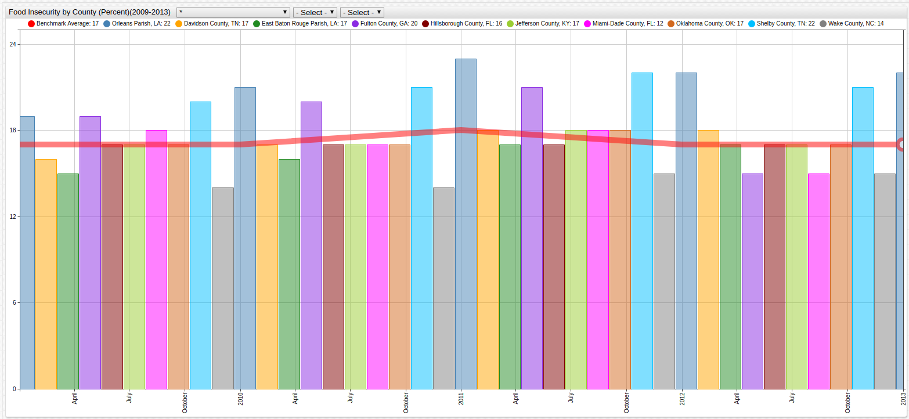

Food Insecurity in America (2009-2013)
===

>Visualization Tool: [Axibase Time Series Database](https://axibase.com/products/axibase-time-series-database/)

**Figure 1**: Average Food Insecurity Rates for Selected Counties.

> Use the dropdown menus to navigate through time or observe a specific county. 

The United States of America is considered by most of the world to be a land of plenty, but that doesn't mean that 
food security problems don't exist. In fact, an average one in seven persons is labeled as food insecure by the United States
Department of Agriculture (USDA)([1](http://www.worldhunger.org/hunger-in-america-2016-united-states-hunger-poverty-facts/)). Such a person is considered to have unstable access to nutritious and varied food, though 
not necessarily starving. A full explanation of the definition of food insecurity can be found on the [USDA's website](https://www.ers.usda.gov/topics/food-nutrition-assistance/food-security-in-the-us/definitions-of-food-security/).

The City of New Orleans tracks public health statistics such as this one, and releases the data through [data.gov](https://catalog.data.gov/dataset/food-insecurity-rates-2009-present),
which is the source of the above dataset. Open the visualization in [ChartLab](http://apps.axibase.com) to see which counties included in the dataset
from [Axibase](http://axibase.com) have above average rates of food insecurity for the observed period (2009-2013) and contact [Feeding America](http://www.feedingamerica.org/take-action/volunteer/)
or another charity if you want to lend a hand.
