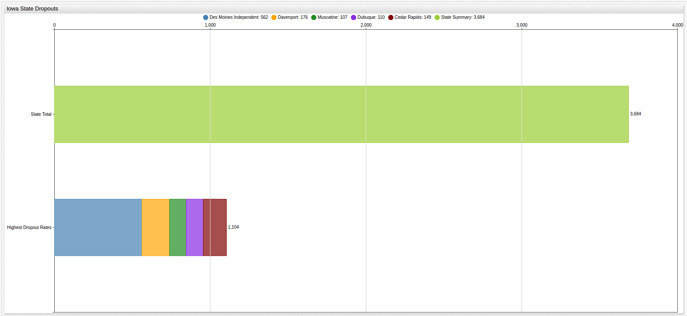

Who is Dropping Out in the State with the Fewest Dropouts Per Year?
===

> Data Source: [The State of Iowa](https://www.iowa.gov/)

> Visualizations: [ChartLab](https://apps.axibase.com) from [Axibase](https://axibase.com)

**Figure 1.1**: Iowa State Total Dropouts

For the 2014-2015 academic year, more than [90%](https://www2.ed.gov/admins/lead/account/consolidated/sy14-15part1/ia.pdf) 
of eligible Iowa students successfully graduated high school making it the [highest 
performing state](https://nces.ed.gov/programs/coe/indicator_coi.asp) in the country with respect to graduation rate, and the 
first state in recent memory to see such results. Using publicly-available [education data](https://catalog.data.gov/dataset/2014-2015-public-school-district-dropout-rates)
released by the State of Iowa, it can be seen that cities which account for just 17% of the state's three and a half million residents, 
also account for more than 30% of the state's high school dropouts.

**Table 1.1**: Iowa State population and dropout rate

| State | Population | Dropouts | Dropout Rate* |
|-------|------------|----------|---------------|
| Iowa | 3,124,000 | 3684 | 0.12 % |

**Table 1.2**: Cities with high dropout rates

| City | Population | Dropouts | Dropout Rate* | 
|------|------------|----------|---------------|
| Cedar Rapids | 129,195 | 149 | 0.12% |
| Davenport | 102,488 | 176 | 0.17% | 
| Des Moines | 209,220 | 562 | 0.27% |
| Dubuque | 58,436 | 110 | 0.19% | 
| Muscatine | 23,888 | 107 | 0.45% |

> *Dropout rate is a calculation of the percent of residents that dropped out, not _eligible_ residents who dropped out.

While Iowa is certainly ahead of the curve in terms of overall graduation rates, the cities shown above have plenty of room
improve.
