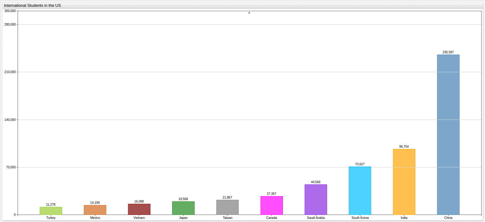
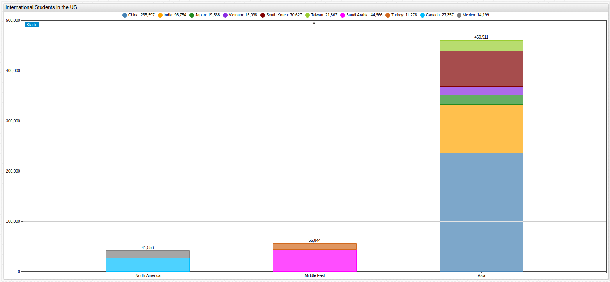

Where Do International Students in the United States Come From?
===

> Visualization: [ChartLab](https://apps.axibase.com/chartlab) based on [Axibase Time Series Database](https://axibase.com/products/axibase-time-series-database/)

> Structured Query Language: [SQL Console](https://github.com/axibase/atsd/blob/master/sql/README.md)

**Figure 1.1**



[](https://apps.axibase.com/chartlab/69decfcc/2/#fullscreen)

America has always been a country that thrived on immigration, and American universities are regarded among the best in
the world. International students find the middle ground of these two metrics and come to the country to experience American
life and study at some of our best universities, sometimes returning home after they complete their education
and sometimes accepting work and joining the millions who have done the same throughout history. 

But where do they come from?

**Script 1.1**

```sql
SELECT tags.country AS "Country", value/1000 AS "Thousand Students"
  FROM "no_of_students"
ORDER BY value DESC
```

**Table 1.1**

```ls
| Country      | Thousand Students | 
|--------------|-------------------| 
| China        | 235.6             | 
| India        | 96.8              | 
| South Korea  | 70.6              | 
| Saudi Arabia | 44.6              | 
| Canada       | 27.4              | 
| Taiwan       | 21.9              | 
| Japan        | 19.6              | 
| Vietnam      | 16.1              | 
| Mexico       | 14.2              | 
| Turkey       | 11.3              | 
```

The number of international students is on a growing arc upward and **Figure 1.1** above details the home country of the
top ten groups of international students studying in the United States from [2013 data](https://catalog.data.gov/dataset/top-10-source-countries-of-international-students-in-the-us-2013-44dd7)
released by the State of Hawaii.

The visualization below arranges the data by continent for an additional perspective. 

**Figure 2.2**



[](https://apps.axibase.com/chartlab/de703084/2/#fullscreen)

If you would like to see your data analyzed with Axibase tools [contact us](https://axibase.com/feedback/).
