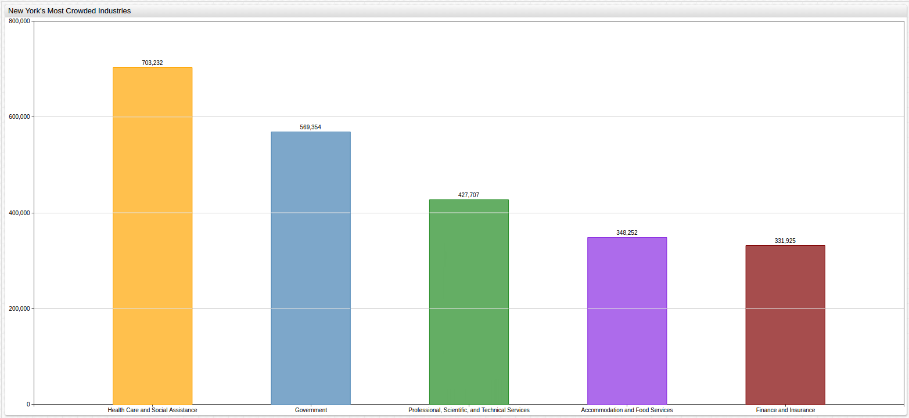

# New York City's Most Crowded Industries



[](https://apps.axibase.com/chartlab/6402f01c/19/#fullscreen)

Running New York City is a big business. In fact, according to [data](https://catalog.data.gov/dataset/jobs-by-industry)
released by the State of New York that tracks employment figures by industry, the top two industries
are partially staffed or entirely staffed by government employees and the third position
is sure to include government staffers on the payroll as well. That's big news considering
the state's annual budget for the current fiscal year (2017) was ranked second in the union at a whopping
[$153 billion dollars](https://www.nysenate.gov/newsroom/articles/senate-passes-2017-18-state-budget-protects-taxpayers-provides-record-investments)
and the City of New York has its own [local budget](http://council.nyc.gov/budget/) that totals about half that number as well.
New York City and State officials have stood behind the expansion and implementation of the Affordable Care Act
locally, which has seen the health care and social assistance industry add over 100,000 new jobs over the past four
years in the Big Apple alone.


[](https://apps.axibase.com/chartlab/6402f01c/20/)

Additionally, the number of working government positions in the city has increased by roughly 38,000
and using the [SQL Console](https://axibase.com/docs/atsd/sql/) from the [Axibase Time Series Database](https://axibase.com/products/axibase-time-series-database/),
New York City figures can be compared to New York State figures:

## New York State

| tags.industry                                                            | total     |
|--------------------------------------------------------------------------|-----------|
| Health Care and Social Assistance                                        | 1490611.0 |
| Government                                                               | 1461296.0 |
| Retail Trade                                                             | 967686.0  |
| Accommodation and Food Services                                          | 738279.0  |
| Professional, Scientific, and Technical Services                         | 717452.0  |
| Finance and Insurance                                                    | 517559.0  |
| Administrative and Support and Waste Management and Remediation Services | 478621.0  |
| Other Services (except Public Administration)                            | 472521.0  |
| Manufacturing                                                            | 461920.0  |
| Educational Services (Private)                                           | 443827.0  |
| Construction                                                             | 440951.0  |
| Wholesale Trade                                                          | 321104.0  |
| Transportation and Warehousing                                           | 290617.0  |
| Information                                                              | 266837.0  |
| Real Estate and Rental and Leasing                                       | 212393.0  |
| Arts, Entertainment, and Recreation                                      | 207120.0  |
| Management of Companies and Enterprises                                  | 137955.0  |
| Agriculture, Forestry, Fishing and Hunting                               | 43486.0   |
| Unclassified Industry                                                    | 37759.0   |
| Utilities                                                                | 37302.0   |
| Mining, Quarrying, and Oil and Gas Extraction                            | 4708.0    |

>The above table was produced with this query:

```sql
SELECT tags.industry, sum(value) as total
  FROM "jobs"
WHERE date_format(time, 'yyyy') = '2015'
  GROUP BY tags.industry
ORDER BY total DESC
```

## New York City

| tags.industry                                                            | total    |
|--------------------------------------------------------------------------|----------|
| Health Care and Social Assistance                                        | 703232.0 |
| Government                                                               | 569354.0 |
| Professional, Scientific, and Technical Services                         | 427707.0 |
| Retail Trade                                                             | 361545.0 |
| Accommodation and Food Services                                          | 348252.0 |
| Finance and Insurance                                                    | 331925.0 |
| Other Services (except Public Administration)                            | 234622.0 |
| Administrative and Support and Waste Management and Remediation Services | 231492.0 |
| Educational Services (Private)                                           | 226112.0 |
| Information                                                              | 186987.0 |
| Construction                                                             | 176174.0 |
| Transportation and Warehousing                                           | 146998.0 |
| Wholesale Trade                                                          | 138371.0 |
| Real Estate and Rental and Leasing                                       | 136806.0 |
| Arts, Entertainment, and Recreation                                      | 109737.0 |
| Manufacturing                                                            | 81624.0  |
| Management of Companies and Enterprises                                  | 68224.0  |
| Unclassified Industry                                                    | 22212.0  |
| Utilities                                                                | 15246.0  |
| Agriculture, Forestry, Fishing and Hunting                               | 560.0    |
| Mining, Quarrying, and Oil and Gas Extraction                            | 64.0     |

>The above table was produced with this query:

```sql
SELECT tags.industry, sum(value) as total
  FROM "jobs"
WHERE date_format(time, 'yyyy') = '2015' and tags.region = 'New York City'
  GROUP BY tags.industry
ORDER BY total DESC
```