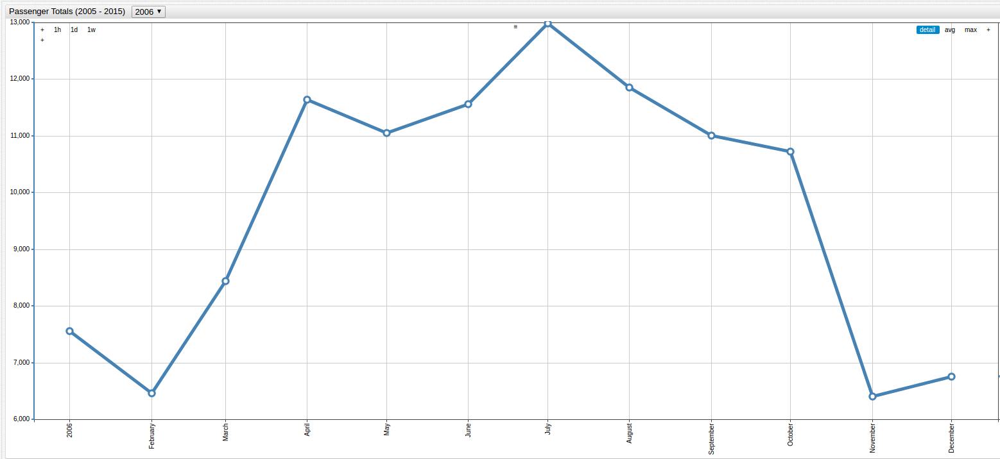
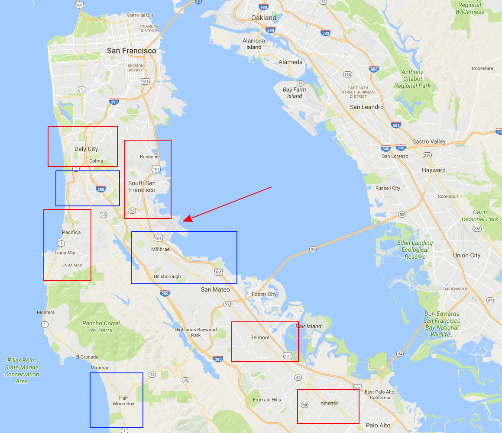

Air Traffic Noise Complaints in San Francisco by the Numbers
==

> Visualization tools in [Axibase Time Series Database](https://axibase.com/products/axibase-time-series-database/).

Thinking of moving to San Francisco anytime soon? Check out [data](https://github.com/axibase/open-data-catalog/blob/master/datasets/q3xd-hfi8.md) 
released by the [City of San Francisco](https://catalog.data.gov/organization/city-of-san-francisco) that covers
complaints of air traffic noise from various locations in the San Francisco metropolitan area. Not only
is 'Frisco home to the Golden Gate Bridge, one of the wonders of the modern world, but also San
Francisco International Airport, or SFO as it's known to frequent fliers. The data was collected by
the airport's [Office of Aircraft Noise Abatement](https://www.flysfo.com/community/noise-abatement) and includes
complaints received via email, hotline, and even handwritten letter. Open [ChartLab](https://apps.axibase.com/chartlab) below and navigate through time
using the drop-down menu at the top of the visualization:

> Neighborhoods with more than 48 complaints in any given year are highlighted in red, while
those that received 24 or less complaints are highlighted in blue.

The visualization below further contracts the data, showing complaints by neighborhood received during each month and year:

Follow SFO's seasonal passenger ebb and flow trends to spot patterns in complaint traffic, using additional [city data](https://github.com/axibase/open-data-catalog/blob/master/datasets/rkru-6vcg.md). It's no
surprise that during peak travel months, the number of complaints received increases as well:

The map below has been modified to highlight neighborhoods with a low number of complaints in blue and a
high number of complaints in red, as well as an arrow pointing to the location of the airport itself:

> Contact [Axibase](https://axibase.com/feedback/) with any questions.
