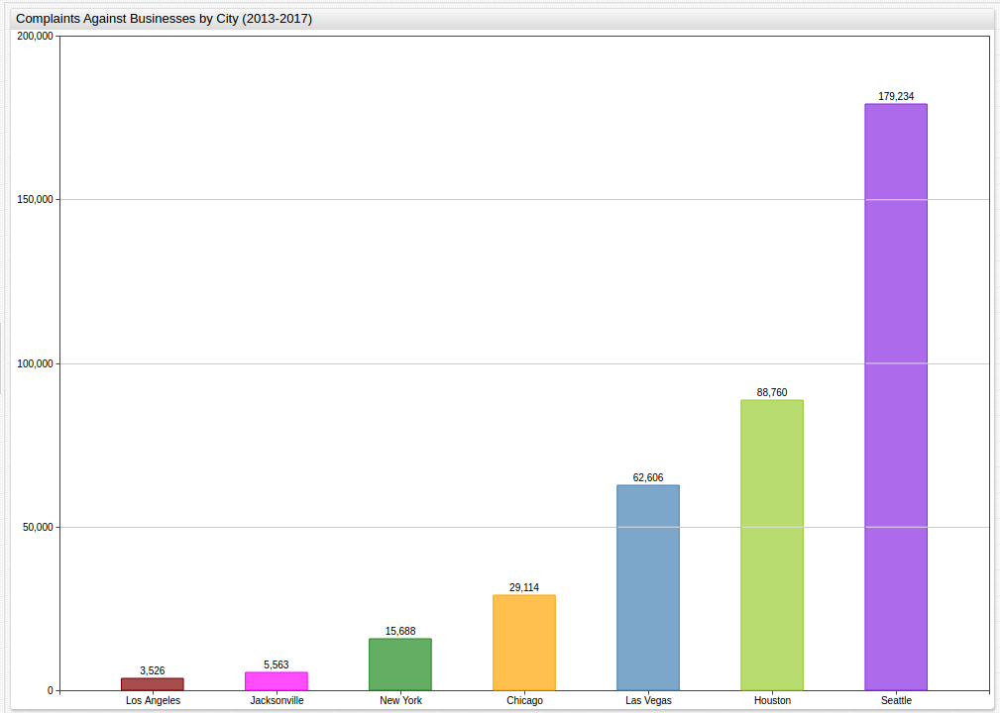

The Seattle Freeze Cools Business
===

The Seattle Freeze is a well-documented local phenomena that usually leaves visitors 
perplexed as to how residents of the Emerald City manage to get along at all. The
story goes that Seattlites are notorious for their unfriendly attitude and cold demeanor, thus
"The Freeze," as it has come to be called. Apparently that chilly outlook on life has
made its way into the world of business as well. Seattle is a relatively small city in the Pacific
Northwest of the country but according to [data](https://catalog.data.gov/dataset/complaint-by-practice)
released by the State of Washington logging business complaints to the Better Business 
Bureau across the country, Jet City has managed to rack up a stupefying 200,000 unique complaints 
in just the last four year, almost as many as Houston, Las Vegas, Chicago, New York, Jacksonville, 
and Los Angeles combined over the same observed period. Unsurprisingly, the majority of these complaints were lodged against collection agencies
representing one interest or another, unpaid medical or credit card being making up the
bulk of Seattle's breathtaking amount of BBB inquires.

Using analytics tools from [Axibase](https://axibase.com/) designed to handle the utterly immense amount of 
raw data contained in this dataset and engineered to work within the [Socrata](https://github.com/axibase/axibase-collector/blob/master/jobs/socrata.md) 
framework that governments use to publish data, visualizing data that would overwhelm other
processing engines is convenient, effective, and meaningful in ways that it has never
been before.