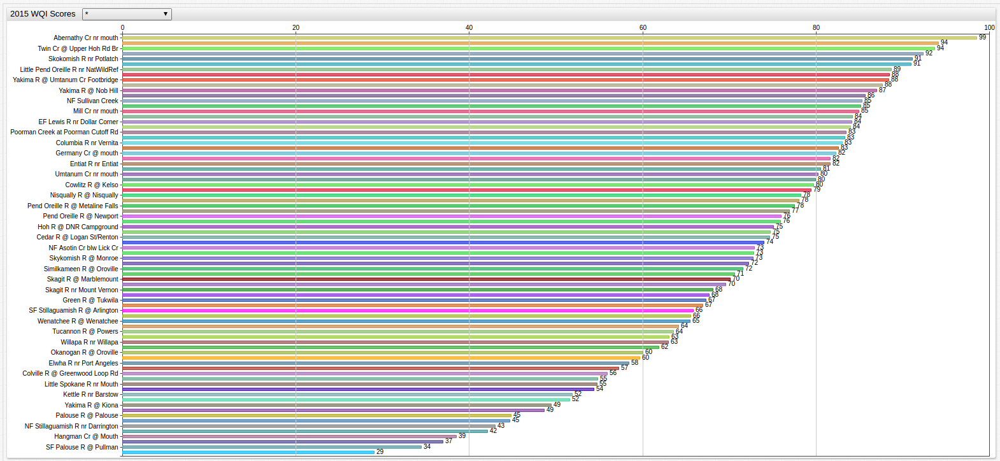
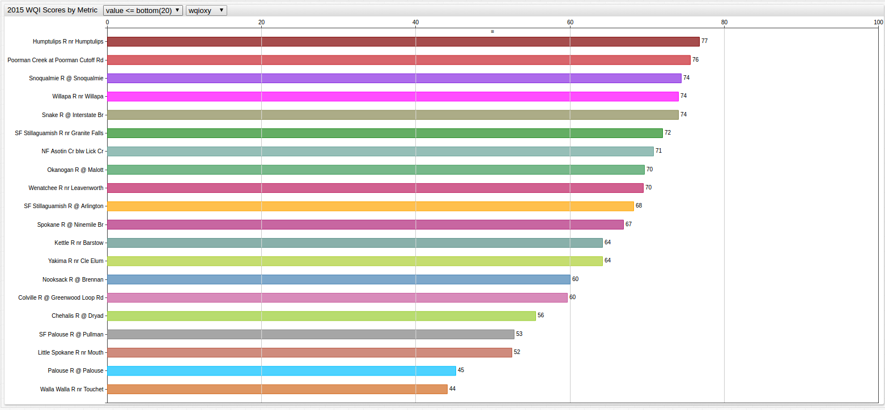

The Cleanest Water in Washington State
===

**Figure 1.1**


[](https://apps.axibase.com/chartlab/89c8183d/2/#fullscreen)

> Use the drop-down menu to examine the Top 10 or Bottom 10 testing stations, or use the Wildcard ([`*`](https://axibase.com/products/axibase-time-series-database/visualization/widgets/configuring-the-widgets/))
option to view all available testing sites together.


**Figure 1.1** above shows the ranking of the results of the latest Water Quality Index tests performed by the State of Washington.
Washington State is known for its scenic mountain ranges, diverse climate, and crystal clear water and has
published the [following dataset](https://catalog.data.gov/dataset/annual-2015-water-quality-index-data), which tracks
a number of metrics for the 2015 Water Quality tests performed by the [Department of Ecology](http://www.ecy.wa.gov/):

**Table 1.1**

| Metric Abbreviation | Abbreviation Meaning | Metric Weight |
|---------------------|----------------------|---------------|
| overallwqi_2015 | **Overall Water Quality Index (WQI) Score** | 1.00 |
| wqifc | **Fecal Coliform** count (mg FC / L H2O) | .176 |
| wqioxy | **Dissolved O2** (mg/L), ideally between 1-15 mg/L| 0.187 |
| wqiph | **Probability of Hydrogen (pH)**, ascending scale, 1-14 | 0.121 |
| wqitemp | **Temperature Score** for regularity |  0.11 |
| wqitp | **Total Phosphate** (mg/L), essential compound for growth of plant and animal life in freshwater | 0.11 |
| wqitpn | **Total Persulfate Nitrogen** (mg/L), contributes to animal and plant growth. | 0.11 |
| wqitss | **Total Suspended Solids** (mg/L) | 0.08 |
| wqiturb | **Turbidity**, a measurement which records the cloudiness of haziness of water in Nephelometric Turbidity Units (NTU) | 0.09 |

These metrics all have individual weights applied based on their importance in the overall make-up of a body of water's health,
and have been converted to a 0-100 ascending scale. Such a scale can be ambiguous to the amateur viewer, and so
conversions to qualitative words have also been provided below:

**Table 1.2**

| Range | Quality |
|-------|---------|
| 90-100 | Excellent |
| 70-90 | Good |
| 50-70 | Medium |
| 25-50 | Bad |
| 0-25 | Very Bad |

>More information about the Water Quality Index, its methodology, or metrics, can be found [here](https://www.water-research.net/)

Use the [ChartLab](https://apps.axibase.com/chartlab) visualization below, and the dropdown menus at the top of the screen to choose the desired metric, and compare
the Top 10, Top 20, or Top 30, Bottom 10, Bottom 20, or Bottom 30 testing sites, or use the Wildcard option to view all
available testing sites together.


**Figure 2.1**


[](https://apps.axibase.com/chartlab/89c8183d/5/#fullscreen)

The map below shows the Top 10 Overall Best WQI site locations noted in blue, and the Bottom 10 Overall Worst WQI site locations
noted in red. The Station ID for each site is contained in the metadata, and can be summoned with the following SQL
query in the [Axibase TSD SQL Console](https://github.com/axibase/atsd/blob/master/sql/README.md#overview) and then cross-referenced
to the Department of Ecology's own map (linked [here](https://fortress.wa.gov/ecy/eap/riverwq/regions/state_ContTemp.asp)):


```sql
SELECT tags.station_name AS "Station Name", value AS "WQI Overall Score", tags.station AS "Station Code"
  FROM "overallwqi_2015"
ORDER BY value DESC
  LIMIT 10
```

**Table 2.1**: Highest Water Quality Test Sites

```ls
| Station Name                        | WQI Overall Score | Station Code |
|-------------------------------------|-------------------|--------------|
| Abernathy Cr nr mouth               | 99                | 25E060       |
| Hamma Hamma R @ Lena Creek Camp     | 94                | 16B130       |
| Twin Cr @ Upper Hoh Rd Br           | 94                | 20E101       |
| Methow R @ Twisp                    | 92                | 48A140       |
| Skokomish R nr Potlatch             | 91                | 16A070       |
| Cedar R nr Landsburg                | 91                | 08C110       |
| Little Pend Oreille R nr NatWildRef | 89                | 59B200       |
| Duckabush R nr Brinnon              | 88                | 16C090       |
| Yakima R @ Umtanum Cr Footbridge    | 88                | 39A055       |
| Columbia R @ Umatilla               | 88                | 31A070       |
```

```sql
SELECT tags.station_name AS "Station Name", value AS "WQI Overall Score", tags.station AS "Station Code"
  FROM "overallwqi_2015"
ORDER BY value ASC
  LIMIT 10
```

**Table 2.2**: Lowest Water Quality Test Sites

```ls
| Station Name                     | WQI Overall Score | Station Code |
|----------------------------------|-------------------|--------------|
| NF Stillaguamish R @ Cicero      | 29                | 05B070       |
| SF Palouse R @ Pullman           | 34                | 34B110       |
| Palouse R @ Hooper               | 37                | 34A070       |
| Hangman Cr @ Mouth               | 39                | 56A070       |
| Crab Cr nr Beverly               | 42                | 41A070       |
| NF Stillaguamish R nr Darrington | 43                | 05B110       |
| Nooksack R @ Brennan             | 45                | 01A050       |
| Palouse R @ Palouse              | 45                | 34A170       |
| Walla Walla R nr Touchet         | 49                | 32A070       |
| Yakima R @ Kiona                 | 49                | 37A090       |
```

**Map 1.1**


Find your favorite waterway in the data above, or discover a new one and enjoy all the natural beauty
that Washington has to offer.
