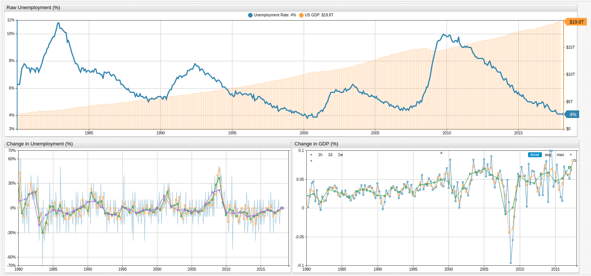
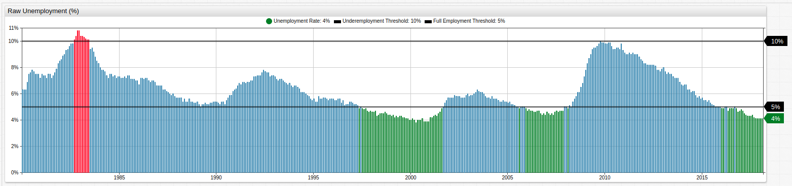
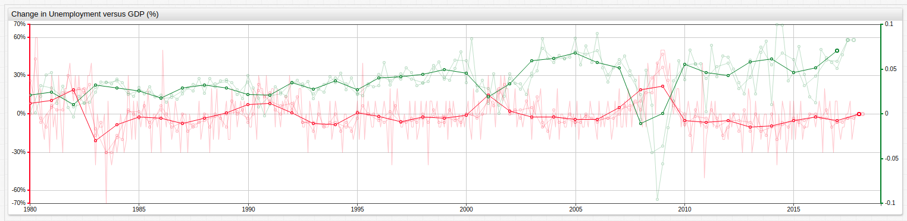

# U.S. Approaching 3-Year Mark for Full Employment


[](https://trends.axibase.com/3a3b1c01#fullscreen)

*Fig 1.* The upper chart in the **TRENDS** visualization above tracks U.S. unemployment and GDP, while the lower charts track percent change in unemployment and GDP value, respectively. 

> For specific configuration information about any of the visualizations in this article, see the [Configuration](#configuration) section towards the end of this page.

### Overview

Since the 1980s, the United States has almost always been on the wrong side of the unemployment statistics, only seeing full employment in the country for a handful of years leading up to September 11, 2001 and a few years again preceding the 2008-2009 stock market crash. The idealists among those in the economic class like to consider "Full Employment" to be somewhere around 1-2%, but the reality is that this is almost never the case. A phenomenon known as frictional unemployment means that most experts tend to consider a country fully-employed as long as the unemployment level is [less than roughly 5%](https://www.npr.org/2013/01/03/168508910/what-is-a-good-unemployment-number-really).

### What is Frictional Unemployment?

[Frictional unemployment](https://www.economicshelp.org/blog/glossary/frictional-unemployment/) is the understanding that at any given time, some percentage of the population will be unemployed of their own volition. Whether it's because of a personal sabbatical, the desire to find a new job without working during the hunt, or other circumstantial factors, some part of the population will be counted as unemployed when perhaps they shouldn't be.

### When has the U.S seen full employment?


[](https://trends.axibase.com/39178867#fullscreen)

*Fig 2.* Periods of full employment are highlighted in green and periods of over 10% unemployment are highlighted in red. Full-employment and 10%-unemployment `[threshold]` series are used to highlight upper and lower value limits.

The **TRENDS** chart above tracks periods with full employment using an `alert-expression`. The exceptionally high unemployment period during the early 1980s may be explained by the then-ongoing worldwide recession which began in 1979 amid a global energy crisis caused by the Iranian oil embargo and subsequent Iran-Iraq war, combined with extreme Fed monitary policy meant to combat double-digit inflation. Ironically, the global oil supply only contracted about 4% during the embargo, but speculation, panic, and commodity runs caused a huge price surge which wouldn't be reversed for almost twenty years.

### How Does GDP Correlate to Unemployment?

While correlation alone can never be used to prove causation, common sense tells us that the more unemployed there are in the population, the worse off the GDP will inevitably be. Compare the percent-change charts from above for unemployment and GDP when they are overlaid on one another.


[](https://trends.axibase.com/2a9d8451#fullscreen)

*Fig 3.* Series of dramatically different orders of magnitude may be shown on the same visualization using an `axis` setting.

Annual average percent change in both GDP and unemployment is the dominant line in the above visualization. Using the two-argument `avg()` function, a series may be averaged according to a user-specified time period. Because unemployment data is collected monthly, it has been averaged by month, quarter, half year, and year. Because GDP data is collected quarterly, it has been average by quarter, half year, and year.

### Configuration

* Read this brief [guide](/../master/how-to/shared/trends.md) about working in the **TRENDS** sandbox if you are unfamiliar with this service.

* *Fig 1.* (for full configuration settings open the **TRENDS** visualization [above](#us-approaching-3-year-mark-for-full-employment))

```sql
## [configuration] level settings have been removed for brevity.

[series]
  label-format = Unemployment Rate
  format = %
  replace-value = value/100
  style = stroke-width:3
```
* [`format`](https://axibase.com/products/axibase-time-series-database/visualization/widgets/configuring-the-widgets/format-settings/) setting is used to display numerical information without insignificant figures. 
```sql  
[series]      
  value = fred.MonthlyChange('base')
  alias = month
  display = false
```
* [`value`](https://axibase.com/products/axibase-time-series-database/visualization/widgets/configuring-the-widgets/) setting can define series value without `entity` or `metric`. In this case, a [user-defined function](https://github.com/axibase/charts/blob/master/syntax/udf.md) is used for inline value calculation.
```
[series]
  value = avg('month')
  format = %    
  style = opacity: 0.5
[series]
  value = avg('month', '.25 year')        
  format = %   
```
* [`avg()`](https://github.com/axibase/charts/blob/master/syntax/value_functions.md#statistical-functions) statistical function is used with one or two arguments representing the `alias` of series to be averaged and the `period` across which the average should be calculated, respectively.

* *Fig. 2* (for full configuration settings open the **TRENDS** visualization [above](#when-has-the-us-seen-full-employment))
```sql      
## [configuration] level settings have been removed for brevity.

[series]
  label-format = Unemployment Rate
  replace-value = value/100
  format = %
  alert-expression = value
  alert-style = if (alert > 0.10) return 'color: red'
  alert-style = if (alert < 0.05) return 'color: green'
```
* [`alert-expression`](https://axibase.com/products/axibase-time-series-database/visualization/widgets/configuring-the-widgets/) may be created and customized using `alert-style` setting, where 
```sql
[threshold]
   value = 0.10
   color = black
   format = %
   style = stroke-width: 3; opacity: 0.5
   label-format = Underemployment Threshold
[threshold]
   value = 0.05
   color = black
   format = %
   style = stroke-width: 3; opacity: 0.5
   label-format = Full Employment Threshold
```
* `[threshold]` series are used to define upper and lower limits for particular values.

* *Fig. 3* (for full configuration settings open the **TRENDS** visualization [above](#how-does-gdp-correlate-to-unemployment))

```sql
[series]
  color = green
  axis = right
  value = avg('m-gdp', '.25 year')
  style = opacity: 0.25  
```
* [`axis`](https://axibase.com/products/axibase-time-series-database/visualization/widgets/time-chart/#tab-id-2) setting is used to enable dual-axis functionality when comparing two series of different orders of magnitude.

### Resources

The **TRENDS** service relies on [Axibase Time Series Database](https://axibase.com/products/axibase-time-series-database/) for data-storage and processing tasks. All of the data from the above article has been loaded into a publicly-accessible instance of the **TRENDS** sandbox. Open any of the above visualizations shown here to perform custom modifications based on the [Charts Documentation](https://axibase.com/products/axibase-time-series-database/visualization/widgets/) or any of the configuration settings explained in this article. 

To create your own chart using the existing data, open an empty **TRENDS** [instance](https://trends.axibase.com/).

For questions, technical support, or to suggest a dataset that you would like to see visualized, visit our [GitHub repository](https://github.com/axibase/atsd-use-cases) and [raise an issue](https://github.com/axibase/atsd-use-cases/issues).

Source data used for this article is linked here:

* **U.S. Bureau of Labor Statistics**, [Civilian Unemployment Rate](https://fred.stlouisfed.org/series/UNRATE)
* **U.S. Bureau of Economic Analysis**, [Gross Domestic Product](https://fred.stlouisfed.org/series/GDP)
