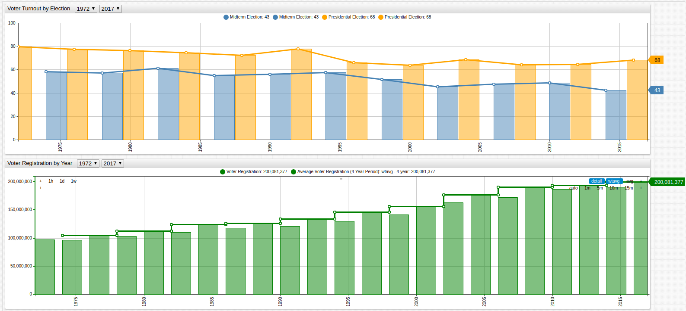

# United States Voter Turnout Since 1970

* Data Source: [The Institute for Democracy and Electoral Assistance](http://www.idea.int/data-tools/question-countries-view/521/295/ctr)

* Visualization Tool: [Axibase Time Series Database](https://axibase.com/products/axibase-time-series-database/)

One of the key indicators of a healthy democracy is active participation by its citizenry, who are responsible for electing
officials to implement the will of the people. Tracking this data since the 1970 elections shows a steadily decreasing voter
turnout rate with each significant election. Another point of interest is the vast difference in voter turnout for presidential
and mid-term elections, both of which are tracked by the [The Institute for Democracy and Electoral Assistance](http://www.idea.int/about-us).

One positive indicator among the decreasing voter turnout rates is the increase in the number of registered voters. Although
several years showed small reductions in the number of registered voters, when averaged by election cycle, registration numbers
have been steadily increasing.

Each presidential election since 1970 is detailed below to give the data context, showing which elections drew the highest voter turnout
rates:

| Election Year | Candidates | Winner |
|---------------|------------|--------|
| 2016 | Donald J. Trump (R)   Hillary Clinton (D) | Donald J. Trump |
| 2012 | Barack Obama (D)   Mitt Romney (R) | Barack Obama |
| 2008 | Barack Obama (D)   John McCain (R) | Barack Obama |
| 2004 | George W. Bush (R)   John Kerry (D) | George W. Bush |
| 2000 | Al Gore (D)   George W. Bush (R) | George W. Bush |
| 1996 | Bill Clinton (D)   Bob Dole (R)   Ross Perot (I)   | Bill Clinton |
| 1992 | Bill Clinton (D)   George H.W. Bush (R)   Ross Perot (I)   | Bill Clinton
| 1988 | George H.W. Bush (R)   Michael Dukakis (D)   | George H.W. Bush |
| 1984 | Ronald Reagan (R)   Walter Mondale (D)   | Ronald Reagan |
| 1980 | Jimmy Carter (D)   John B. Anderson (I)   Ronald Reagan (R) | Ronald Reagan |
| 1976 | Gerald Ford (R)   Jimmy Carter (D)   | Jimmy Carter |
| 1972 | George McGovern (D)   Richard Nixon (R) | Richard Nixon |