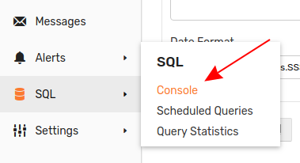

# The World Progress Scorecard: In-Depth Visualization with SQL and User-Defined Functions


[](https://trends.axibase.com/eb435d60)

### Introduction

The **World Progress Scorecard** is an aggregation of many statistics that are collected by various international agencies including the [World Bank](http://www.worldbank.org/) and [United Nations Statistical Division](https://unstats.un.org/home/) and retrieved from the [Federal Reserve Economic Research](https://fred.stlouisfed.org/) API. 

Open the **TRENDS** visualization above and use the drop-down menus to navigate between all countries which have recorded data, grouped in alphabetically ascending order. The observed metric may be changed using the right-most drop-down menu. The metrics tracked in the visualization are described in the table below:

|Metric Name |Description |
|------------|------------|
|adolescent_fertility_rate_by_country | Recorded births by women aged 15-19 |
|age_dependency_ratio_by_country | Population aged 0-14 or 65+ |
|crude_birth_rate_by_country| Recorded births by women aged 15-65 per 100,000 members of a population|
|fertility_rate_total_by_country|Recorded births by women aged 15-65 per 100,000 women|
|infant_mortality_rate_by_country| Recorded deaths of infants under 1 year old per 1000 live births|
|life_expectancy_at_birth_by_country|Number of years a newborn is predicted to live given constant mortality figures|
|population_total_by_country| Recorded number of people living in a given country|

For detailed information about using the **TRENDS** service, read this [guide](/../master/how-to/shared/trends.md).

### Visualization

The visualizations in the chart above demonstrate a [user-defined function](/../master/how-to/shared/trends.md#user-defined-functions) which sets the year 1990 as the baseline using the [`fred.js`](https://apps-chartlab.axibase.com/portal/resource/scripts/fred.js) library. Using the `PercentChangeFromYearAgo` function instead creates the visualization below. Open the **TRENDS** interface and explore the data using the same drop-down menus to navigate between countries and metrics.


[](https://trends.axibase.com/5ce2f40e#)

Axibase [Charts API](https://axibase.com/products/axibase-time-series-database/visualization/widgets/) uses a simple syntax with robust functionality. The underlying mechanics of the `PercentChangeFromYearAgo` function are shown here:

```
value = var v = value('cpi'); var p = value('prev_cpi'); if(p!=null && v!=null) return (v / p - 1) * 100
```

To implement this function, the following syntax is used:

```sql
value = fred.PercentChangeFromYearAgo('raw')
```

Open the **TRENDS** visualization and use any of the supported user-defined functions from the [`fred.js` library](/../master/how-to/shared/trends.md#fred-library).

### SQL Queries

Although a non-relational database, ATSD supports an SQL-like feature called [SQL Console](https://github.com/axibase/atsd/tree/master/sql#overview). This convenient interface lets users quickly query data. To launch a local ATSD instance, and use the SQL console for yourself, follow the launch instructions in the [Resources](#resources) section of this article. 

#### Greatest Life Expectancy for Year 2015

```sql
SELECT year(time) AS "Year",
  tags.country AS "Country",
  value AS "Life Expectancy"
FROM "life_expectancy_at_birth_by_country"
  WHERE "Year" = 2015
ORDER BY "Life Expectancy" DESC
  LIMIT 10
```

| Year | Country           | Life Expectancy | 
|------|-------------------|-----------------| 
| 2015 | Hong Kong         | 84              | 
| 2015 | Macao             | 84              | 
| 2015 | Spain             | 83              | 
| 2015 | Switzerland       | 83              | 
| 2015 | Singapore         | 83              | 
| 2015 | Sweden            | 83              | 
| 2015 | Australia         | 82              | 
| 2015 | Luxembourg        | 82              | 
| 2015 | Republic of Korea | 82              | 
| 2015 | Canada            | 82              | 

#### Lowestt Life Expectancy at Birth for Year 2015

```sql
SELECT year(time) AS "Year",
  tags.country AS "Country",
  value AS "Life Expectancy"
FROM "life_expectancy_at_birth_by_country"
  WHERE "Year" = 2015
ORDER BY "Life Expectancy" ASC
  LIMIT 10
```

| Year | Country                   | Life Expectancy | 
|------|---------------------------|-----------------| 
| 2015 | Central African Republic  | 51              | 
| 2015 | Sierra Leone              | 51              | 
| 2015 | Chad                      | 53              | 
| 2015 | Nigeria                   | 53              | 
| 2015 | Republic of Cote d'Ivoire | 53              | 
| 2015 | Lesotho                   | 54              | 
| 2015 | Somalia                   | 56              | 
| 2015 | Republic of South Sudan   | 56              | 
| 2015 | Swaziland                 | 57              | 
| 2015 | Burundi                   | 57              | 

#### Greatest Average Life Expectancy Across Observed Period (1970-2015)

```sql
SELECT tags.country AS "Country",
  AVG(value) AS "Life Expectancy"
FROM "life_expectancy_at_birth_by_country"
GROUP BY "Country"
ORDER BY AVG(value) DESC
  LIMIT 10
```

| Country       | Life Expectancy | 
|---------------|-----------------| 
| Liechtenstein | 80              | 
| Switzerland   | 78              | 
| Bermuda       | 78              | 
| Sweden        | 78              | 
| Hong Kong     | 78              | 
| Norway        | 78              | 
| Spain         | 78              | 
| Canada        | 78              | 
| Macao         | 78              | 
| Netherlands   | 77              | 

#### Lowest Average Life Expectancy Across Observed Period (1970-2015)

```sql
SELECT tags.country AS "Country",
  AVG(value) AS "Life Expectancy"
FROM "life_expectancy_at_birth_by_country"
GROUP BY "Country"
ORDER BY AVG(value) ASC
  LIMIT 10
```

| Country                  | Life Expectancy | 
|--------------------------|-----------------| 
| Sierra Leone             | 41              | 
| Republic of South Sudan  | 45              | 
| Mali                     | 46              | 
| Angola                   | 46              | 
| Niger                    | 46              | 
| Mozambique               | 46              | 
| Nigeria                  | 47              | 
| Chad                     | 47              | 
| Central African Republic | 47              | 
| Somalia                  | 48              | 

### Resources

* Launch a local ATSD instance to use SQL Console;

```
docker run -d -p 8443:8443 -p 9443:9443 \
  --name=atsd-sandbox \
  axibase/atsd-sandbox:latest
```

* Wait until `All applications started` appears;

* Open ATSD interface: `https://atsd-hostname:8443`

* Open the **SQL** menu and select **Console**;



* Use ATSD [documentation](https://github.com/axibase/atsd/tree/master/sql#overview) for syntax and functional information.

> If you have any questions or comments, [raise an issue](https://github.com/axibase/atsd-use-cases/issues) on our GitHub page.
