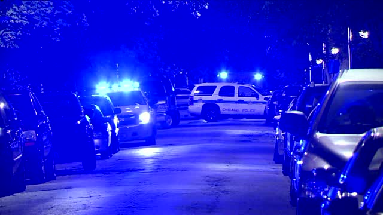
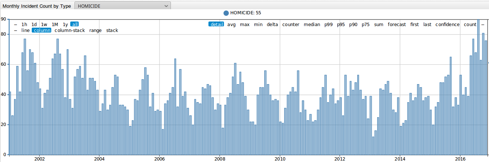
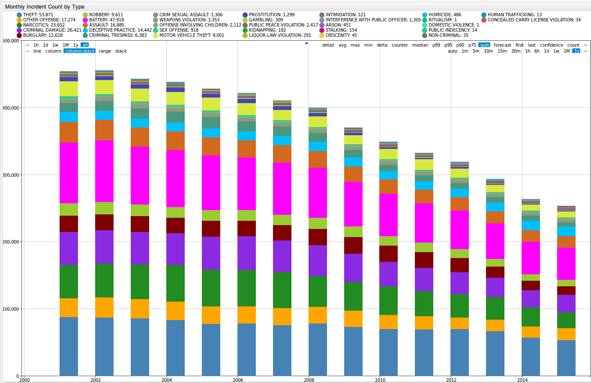

 

Analyzing Chicago Crime Statistics
==================================

### Introduction
----------------

Pizza. Michael Jordan. Lake Michigan. Jazz. The Bean. These are some of the great things that Chicago, Illinois, is known for. There is another thing that has defined the city since its birth, and 
as of lately seems to be all we think about when it comes to Chicago: crime. In 2016, Chicago, the 3rd most populous city in the United States, [had more homicides](http://www.foxnews.com/us/2017/01/01/1-chicagos-bloodiest-years-ends-with-762-homicides.html)
than New York City and Los Angeles combined. In 2016, there were [762 murders](http://edition.cnn.com/2017/01/02/us/chicago-murder-rate-2016-visual-guide/) in the city, a 53% increase from 496 murders in 2015. In 2016, there were 4,331 total shooting victims, compared to 2,939 in 2015.
From 2004 to 2015, the peak number of murders in the city was 513. From 2011 to 2015, the city recorded less than 3,000 shooting victims per year. So what is the reason for this alarming increase in
crime in Chicago? Was there an increase in all crime, or was the rise in murders and shootings an exception? In this article we will analyze a dataset from data.gov looking at 
[Chicago crime statistics](https://catalog.data.gov/dataset/crimes-2001-to-present-398a4) from 2001 to the present time.  

### Chicago Crime Statistics
----------------------------

Below is an image of monthly homicide totals from January 2001 through December 2016. Between 2004 and 2015, Chicago only twice experienced a year with more than 500 murders, with 513 murders occurring
in 2008. This number jumped to 762 in 2016.  

 
By clicking on the button below, you can take a closer look at these numbers, as well as totals for 31 other crime types, including weapons violations, prostitution, robbery, assault, and domestic 
violence among many others. 

Looking at this next figure, we can observe where exactly these murders were committed. This dataset provides 42 different locations, including Street, Alley, Apartment, and Tavern among many others.
We can see that Homicides most often take place on the Street more than anywhere else.

Below is a table showing the locations with the highest number of murders for 2016 and 2015.

| Location Description      | 2016| 2015|
|---------------------------|-----|-----| 
| STREET                    | 430 | 282 |
| AUTO                      | 85  | 52 |
| ALLEY                     | 44  | 25 |
| APARTMENT                 | 44  | 22 |
| HOUSE                     | 34  | 35 |
| PORCH                     | 19  | 14 |
| YARD                      | 15  | 14 |
| PARKING LOT               | 13  | 7 |
| VACANT LOT                | 10  | 0 |
| GAS STATION               | 9   | 2 |
| PARK PROPERTY             | 8   | 13|

By clicking on the below link, you can filter each of the 32 crime types included in this dataset for 42 locations. 

So what caused this drastic increase in murders in Chicago in 2016? Was there an uptick in crime in general in the city?

There actually has been a long term decrease in crime in general Chicago, as we can see in the figure below. There were, however, increases for certain crimes in 2016 from 2015.
  

 

So if crime has been going down over time and the city has been becoming safer, what can the drastic rise in the number of murders be attributed to? According to [an article by the Chicago Tribune](http://www.chicagotribune.com/news/opinion/editorials/ct-chicago-crime-increase-causes-edit-0118-md-20170117-story.html),
the release of a video showing the police fatally shooting Laquan McDonald, the launch of a Justice Department investigation of the Chicago Police Department, and a decline in the number of street
stops by the police, resulting from a new policy on street stops between the city of Chicago and the American Civil Liberties Union.  

### Sources
-----------

Title Photo: http://www.zerohedge.com/news/2016-08-23/chicagos-violent-crime-spreading-safe-north-side