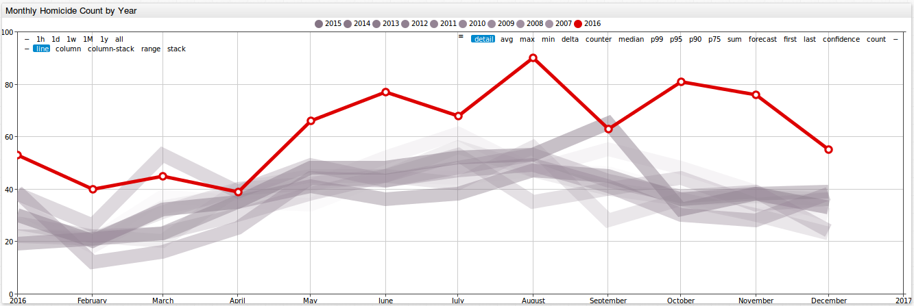

 

Analyzing Chicago Crime Statistics
==================================

### Introduction
----------------

Pizza. Michael Jordan. Lake Michigan. Jazz. The Bean. These are some of the great things that Chicago, Illinois, is known for. There is another thing that has defined the city since its birth, which 
as of lately seems to be all we think about when it comes to Chicago: crime. In 2016, Chicago, the 3rd most populous city in the United States, [had more homicides](http://www.foxnews.com/us/2017/01/01/1-chicagos-bloodiest-years-ends-with-762-homicides.html)
than New York City and Los Angeles combined. In 2016, there were [762 murders](http://edition.cnn.com/2017/01/02/us/chicago-murder-rate-2016-visual-guide/) in the city, a 53% increase from 496 murders
in 2015. In 2016, there were 4,331 total shooting victims, compared to 2,939 in 2015. From 2004 to 2015, the peak number of murders in the city was 513. From 2011 to 2015, the city recorded less 
than 3,000 shooting victims per year. So what is the reason for this alarming increase in crime in Chicago? Was there an increase in all crime, or was the rise in murders and shootings an 
exception? In this article we will analyze a dataset from data.gov looking at [Chicago crime statistics](https://catalog.data.gov/dataset/crimes-2001-to-present-398a4) from 2001 to the present time.  

### Chicago Crime Statistics Dataset
------------------------------------

Let's take a look at the dataset titled **Crimes - 2001 to present** from [data.gov](https://www.data.gov/).

This dataset can be found here: https://catalog.data.gov/dataset/crimes-2001-to-present-398a4. On the data.gov website, datasets can be downloaded as a CSV (1.4 GB), RDF, JSON (2.8 GB), or a 
XML file. This dataset can easily be parsed using the JSON job in Axibase.

This dataset contains crime statistics collected monthly from 2001 to the present time. Statistics are available for 32 different crime types. Furthermore, these crimes may be filtered by the location
where the crime occurred, and by the specific crime type. For example, for the crime type **Narcotics**, you may filter by 96 locations (alley, street, gas station) and 49 specific violations (possession
of cocaine, manufacturing and delivering heroin, or soliciting narcotics). Each crime type has it's own number of locations and specific violations that it may be sorted for.

While you can manually analyze this information in a spreadsheet program, it is much more convenient to interact with the data once it is loaded into a database. The 
[Axibase Time Series Database (ATSD)](http://axibase.com/products/axibase-time-series-database/) is a powerful tool when it comes to storing, analyzing, and visualizing datasets. We will use the
following two aspects of ASTD to look into this dataset: interactive graphs from Chart Lab and tables output from SQL queries. 

### Homicide Numbers
--------------------

Below is an image of monthly homicide totals from January 2001 through December 2016. The month with the highest murder total in 2016 was August, which experienced 90 murders. August 2015 only had 53 murders.   

By clicking on the button below, you can take a closer look at these numbers, as well as monthly totals for 31 other crime types, including weapons violations, prostitution, robbery, assault, and 
domestic violence, among many others.

Looking at the previous figure, we can acquire a general understanding of the landscape of Chicago, but it is difficult to tell how monthly totals for 2016 compare to previous years. Looking at this
next figure, we can see that murder totals were higher almost across the board for 2016 than in previous years.

Looking at this next figure, we can observe where exactly homicides were committed. This dataset provides 42 different locations, including Street, Alley, Apartment, and Tavern among many others.
We can see that Homicides most often take place on the Street more than anywhere else.

Below is a table showing the locations with some of the highest number of murders for 2016 and 2015.

| Location Description      | 2016| 2015|
|---------------------------|-----|-----| 
| STREET                    | 430 | 282 |
| AUTO                      | 85  | 52 |
| ALLEY                     | 44  | 25 |
| APARTMENT                 | 44  | 22 |
| HOUSE                     | 34  | 35 |
| PORCH                     | 19  | 14 |

By clicking on the below link, you can filter each of the 32 crime types included in this dataset for 42 locations. 

### A Deeper Look at Crime
-------------------------- 

So what caused this drastic increase in murders in Chicago in 2016? Did the city experience an uptick in crime as a whole? There actually has been a long term decrease in crime in general Chicago, 
as we can see in the figure below. 

There were, however, increases for certain crimes in 2016 from 2015. The number of arrests increased for each of the following crime types: robbery from 9,611 to 11,894 (23.8%), motor 
vehicle theft from 9,001 to 10,247 (13.8%), assault from 16,885 to 18,580 (10.0%), and criminal sexual assault from 1,306 to 1,426 (9.2%). The number of narcotics arrests, however, decreased 
from 25,562 in 2015 to 12,329 (48.0%) in 2016. Gambling and Liquor Law violations decreased by 39% and 23%, respectively. Below is a figure showing the change from 2015 to 2016 for each of the 
crime types included in this dataset.  
    

So if crime has been going down over time and the city has been becoming safer, what can the drastic rise in the number of murders be attributed to? According to [an article by the Chicago Tribune](http://www.chicagotribune.com/news/opinion/editorials/ct-chicago-crime-increase-causes-edit-0118-md-20170117-story.html),
the release of a video showing the police fatally shooting Laquan McDonald, the launch of a Justice Department investigation of the Chicago Police Department, and a decline in the number of street
stops by the police, resulting from a new policy on street stops between the city of Chicago and the American Civil Liberties Union.  

### Sources
-----------

Title Photo: http://www.zerohedge.com/news/2016-08-23/chicagos-violent-crime-spreading-safe-north-side