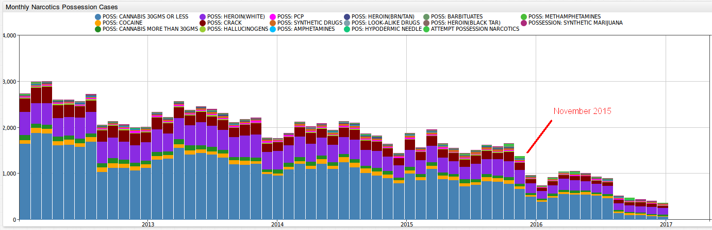
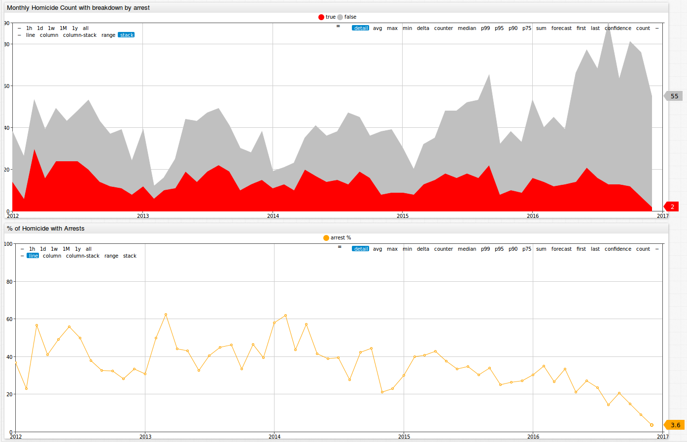

 

Analyzing Chicago Crime Statistics
==================================

### Introduction
----------------

Pizza. Michael Jordan. Lake Michigan. Jazz. The Bean. These are some of the great things that Chicago, Illinois, is known for. There is another thing that has defined the city since its birth, and 
as of lately seems to be all we think about when it comes to Chicago: crime. In 2016, Chicago, the 3rd most populous city in the United States, [had more homicides](http://www.foxnews.com/us/2017/01/01/1-chicagos-bloodiest-years-ends-with-762-homicides.html)
than New York City and Los Angeles **combined**. In 2016, there were [762 murders](http://edition.cnn.com/2017/01/02/us/chicago-murder-rate-2016-visual-guide/) in the city, a **53% increase** from 496
in 2015. In 2016, there were 4,331 total shooting victims, compared to 2,939 in 2015. From 2004 to 2015, the peak number of murders in the city was 513. From 2011 to 2015, the city recorded less 
than 3,000 shooting victims per year. So what is the reason for this alarming increase in violence in Chicago? Was there an increase in all kinds of crime, or was the rise in murders and shootings an 
exception? In this article we will analyze a dataset from data.gov looking at [Chicago crime statistics](https://catalog.data.gov/dataset/crimes-2001-to-present-398a4) from 2001 to the present time.  

### Chicago Crime Statistics Dataset
------------------------------------

Let's take a look at the dataset titled **Crimes - 2001 to present** from [data.gov](https://www.data.gov/). 

This dataset can be found here: https://catalog.data.gov/dataset/crimes-2001-to-present-398a4. On the data.gov website, datasets can be downloaded as a CSV (1.4 GB), RDF, JSON (2.8 GB), or a 
XML file. This dataset can easily be parsed using the JSON job in Axibase.

This dataset contains crime statistics collected monthly from 2001 to the present time. Statistics are available for 32 different crime types. Furthermore, these crimes may be filtered by the location
where the crime occurred, and by the specific crime type. For example, for the crime type **Narcotics**, you may filter by 96 locations (alley, street, gas station) and 49 specific violations (possession
of cocaine, manufacturing and delivering heroin, or soliciting narcotics). Each crime type has it's own number of locations and specific violations that it may be sorted for.

While you can manually analyze this information in a spreadsheet program, it is much more convenient to interact with the data once it is loaded into a database. The 
[Axibase Time Series Database (ATSD)](http://axibase.com/products/axibase-time-series-database/) is a powerful tool when it comes to storing, analyzing, and visualizing datasets. We will use the
following two aspects of ASTD to look into this dataset: interactive graphs from [Chart Lab](/ChartLabIntro/README.md) and tables output from [SQL queries](https://github.com/axibase/atsd-docs/blob/master/api/sql/README.md#overview).

### Homicide Numbers
--------------------

Below is an image of monthly homicide totals from January 2008 through December 2016. The month with the highest murder total in 2016 was August, which experienced 90 murders. August 2015 only had 53 murders.
Taking a closer look at this graph, we can see that every year seems to follow a general trend of low numbers to start the year out, with totals increasing in the summer months, and then dropping back
down as winter approaches. 


By clicking on the button below, you can take a closer look at these numbers, as well as monthly totals for 31 other crime types, including weapons violations, prostitution, robbery, assault, and 
domestic violence, among many others.

[](https://apps.axibase.com/chartlab/3f33d4ba)

From the previous figure we can acquire a general understanding of the landscape of Chicago, but it is difficult to tell how monthly totals for 2016 compare to previous years. Looking at the below
line chart, we can see that murder totals were higher almost across the board for 2016 than in previous years.


Click on this button to explore this Chart Lab portal:

[](https://apps.axibase.com/chartlab/3f33d4ba/16/)

In addition to looking at graphical outputs, we can also perform [SQL queries](https://github.com/axibase/atsd-docs/blob/master/api/sql/README.md#overview), which we can use to search for specific 
information contained in this dataset. For example, we can see that 2016 months totals are greater than the previous years as a whole. But what were the average monthly totals for the last several
years before the city experienced the horrific spike of 2016?

```sql
SELECT date_format(time, 'MMM') AS 'month', avg(value)
FROM 'cc.cases-by-primary-type'
 WHERE datetime >= '2001-01-01T00:00:00Z' AND datetime < '2016-01-01T00:00:00Z'
 AND tags.primary_type = 'HOMICIDE'
GROUP BY date_format(time, 'MMM')
ORDER BY date_format(time, 'MM')
```

```ls
| month  | avg(value) | 
|--------|------------| 
| Jan    | 30.4       | 
| Feb    | 22.9       | 
| Mar    | 34.1       | 
| Apr    | 38.5       | 
| May    | 43.4       | 
| Jun    | 48.3       | 
| Jul    | 55.1       | 
| Aug    | 49.8       | 
| Sep    | 47.5       | 
| Oct    | 41.7       | 
| Nov    | 37.6       | 
| Dec    | 36.3       | 
```

How about the deadliest day of the week in Chicago in 2016?

```sql
SELECT date_format(time, 'EEE') AS 'day_of_week', count(value)
 FROM 'chg.row_number'
WHERE datetime >= '2016-01-01T00:00:00Z'
 AND tags.primary_type = 'HOMICIDE'
 AND entity = 'ijzp-q8t2'
GROUP BY date_format(time, 'u')
```

```ls
| day_of_week  | count(value) | 
|--------------|--------------| 
| Mon          | 112.0        | 
| Tue          | 106.0        | 
| Wed          | 105.0        | 
| Thu          | 85.0         | 
| Fri          | 107.0        | 
| Sat          | 123.0        | 
| Sun          | 142.0        | 
```

Did the most common locations for homicides changes from 2015 to 2016? The below pie chart shows the top five locations were homicides were committed in 2015 and 2016. Both years have the same top five
locations for murders (alley, apartment, street, house, auto) and we can see that the greatest number of homicide took place on the street. These percentages experienced almost no change from 2015
to 2016. The percentage of murders on the street in 2015 and 2016 was exactly same at 68%.  


Click on this button to explore each of the 32 crime types included in this dataset for 42 locations: 

[](https://apps.axibase.com/chartlab/d5c04002/6/)

With the below SQL query, we can look at the average number of the top locations of murders from 2001 through 2015.

```sql
SELECT tags.location_description, count(value)/15
FROM 'chg.row_number'
WHERE datetime >= '2001-01-01T00:00:00Z' and datetime < '2016-01-01T00:00:00Z'
AND tags.primary_type = 'HOMICIDE'
AND entity = 'ijzp-q8t2'
GROUP BY tags.location_description
--HAVING count(value)/15 >= 5
ORDER BY 2 DESC
LIMIT 20
```

```ls
| tags.location_description  | count(value)/15 | 
|----------------------------|-----------------| 
| STREET                     | 230.1           | 
| AUTO                       | 58.3            | 
| APARTMENT                  | 41.9            | 
| ALLEY                      | 31.5            | 
| HOUSE                      | 26.2            | 
| PORCH                      | 15.2            | 
| YARD                       | 9.9             | 
| PARKING LOT                | 8.3             | 
| PARK PROPERTY              | 5.9             | 
| VACANT LOT                 | 5.5             | 
| HALLWAY                    | 5.0             | 
| GANGWAY                    | 3.9             | 
| RETAIL STORE               | 3.9             | 
| GAS STATION DRIVE/PROP.    | 2.7             | 
| GARAGE                     | 2.5             | 
| CHA GROUNDS                | 2.5             | 
| RESTAURANT                 | 2.3             | 
| CHA HALLWAY                | 2.3             | 
| CHA PARKING LOT            | 2.3             | 
| TAVERN                     | 2.0             | 
```

### A Deeper Look at Crime in Chicago
-------------------------------------

So what caused this drastic increase in murders in Chicago in 2016? Did the city experience an uptick in crime as a whole? 

There actually has been a long term decrease in crime in general Chicago, as we can see in the figure below. 


Below is a figure showing the change from 2015 to 2016 for each of the crime types included in this dataset.  
    


There were increases for certain crimes in 2016 from 2015. The number of arrests increased for each of the following crime types: 

* Robbery: 9,611 to 11,894 (**23.8%**)
* Motor vehicle theft: 9,001 to 10,247 (**13.8%**)
* Assault: 16,885 to 18,580 (**10.0%**)
* Criminal sexual assault: 1,306 to 1,426 (**9.2%**)

The number of arrests decreased for each of the following crime types: 

* Narcotics: 25,562 in 2015 to 12,329 (**48.0%**)
* Gambling: (**39%**)
* Liquor Law Violations: (**23%**)
 
While a decrease in the number of arrests may seem like a good thing, it can mean quite the opposite. Below is a screenshot of narcotics possession arrests from 2011 through 2017. There seems to be
a relative steady decline beginning in 2011. One may think initially that this is because of the eradication of drugs from the city, which would lead to a fewer number of arrests. However, a one 
year reduction of 48.0% for narcotics makes one think that there may be something else at play.



According to [an article by the Chicago Tribune](http://www.chicagotribune.com/news/opinion/editorials/ct-chicago-crime-increase-causes-edit-0118-md-20170117-story.html),
the release of a video in November 2015 showing the police fatally shooting of a black teenager ([Laquan McDonald](https://en.wikipedia.org/wiki/Shooting_of_Laquan_McDonald)), the launch of a Justice Department investigation of the Chicago Police Department, and a decline 
in the number of street stops by the police, resulting from a new policy on street stops between the city of Chicago and the American Civil Liberties Union have had a drastic affect on policing in
Chicago. According to [Vice News](https://news.vice.com/video/with-killings-on-the-rise-in-chicago-police-are-putting-their-hands-up), because of the Laquan McDonald shooting Police have become afraid of becoming the next "viral video" and are
less willing to go out, put themselves on the line, and prevent murders and make narcotics involved arrests.
 
Below is a figure showing the monthly homicide count in Chicago with breakdown by arrest. The red represents murders that resulted in an arrest at the time of the incident, while grey represents 
murders without any arrests made. We can see that December 2016 had 57 murders. Of these murders, 55 had no arrest made and only 2 resulted in an arrest, resulting in a 3.6% arrest rate. What can this 
drastically low arrest rate be due to? Is it because there is such a high number of killings that the police are unable to make any arrests? Or have the police become less invested in their work, and
as a result less willing to go out, fight crime, make arrests, and make a difference?     



### Action Items
----------------

Below are the summarized steps to follow to install local configurations of ATSD and Axibase Collector and create SQL queries for analyzing Chicago crime statistics:

1. Install [Docker](https://docs.docker.com/engine/installation/linux/ubuntulinux/).
2. Download the [`docker-compose.yml`](https://raw.githubusercontent.com/axibase/atsd-use-cases/master/ChicagoCrime/resources/docker-compose.yml) file to launch the ATSD / Axibase Collector container bundle.
 
```sql
   curl -o docker-compose.yml https://raw.githubusercontent.com/axibase/atsd-use-cases/master/ChicagoCrime/resources/docker-compose.yml
   ```

3. Launch containers with the following command:
 
```sql
   export C_USER=myuser; export C_PASSWORD=mypassword; docker-compose pull && docker-compose up -d
   ```

4. The dataset is over 3 gigabytes, so give Axibase Collector 15-20 minutes to download, parse, and insert data into ATSD. You can monitor the progress on the Job Statistics page in Axibase Collector.

If you require assistance in installing this software or have any questions, please feel free to [contact us](https://axibase.com/feedback/) and we would be happy to be of assistance!

### Sources
-----------

Title Photo: http://www.zerohedge.com/news/2016-08-23/chicagos-violent-crime-spreading-safe-north-side