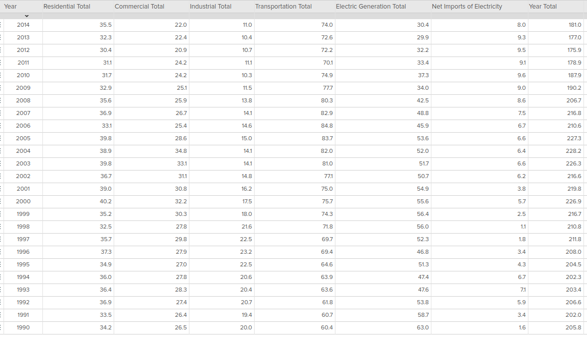
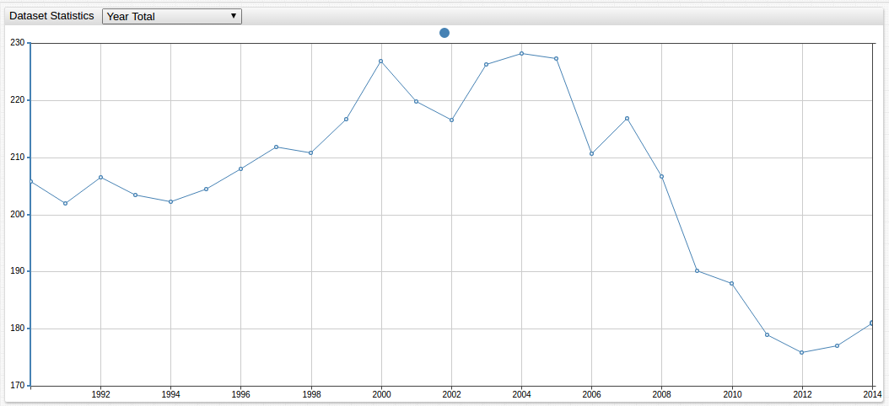
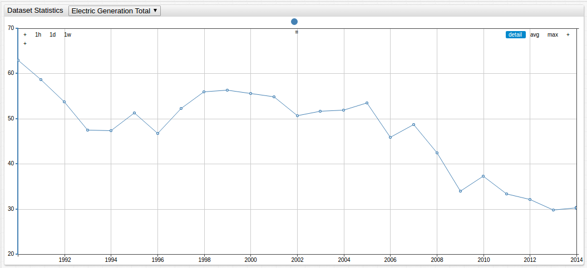
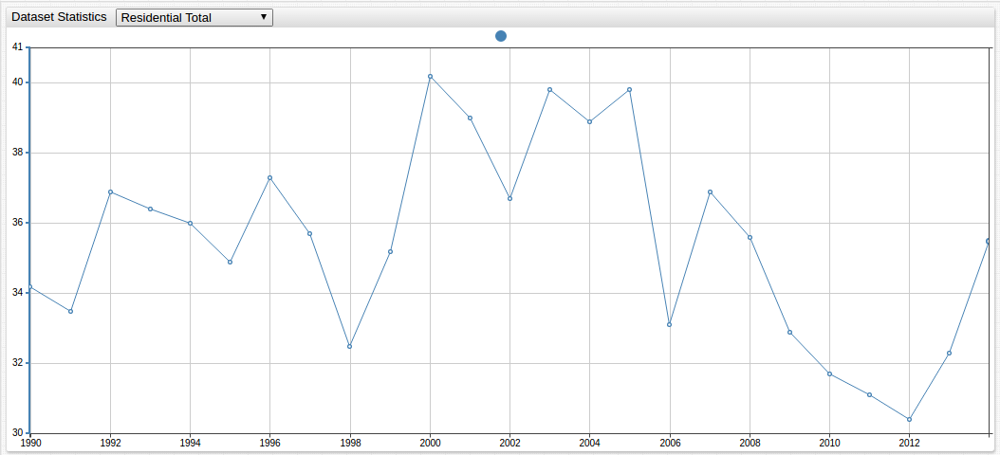
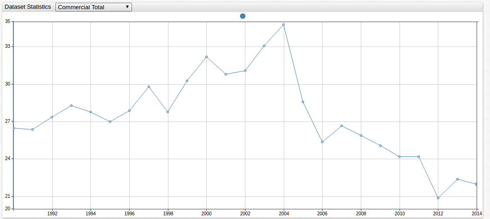
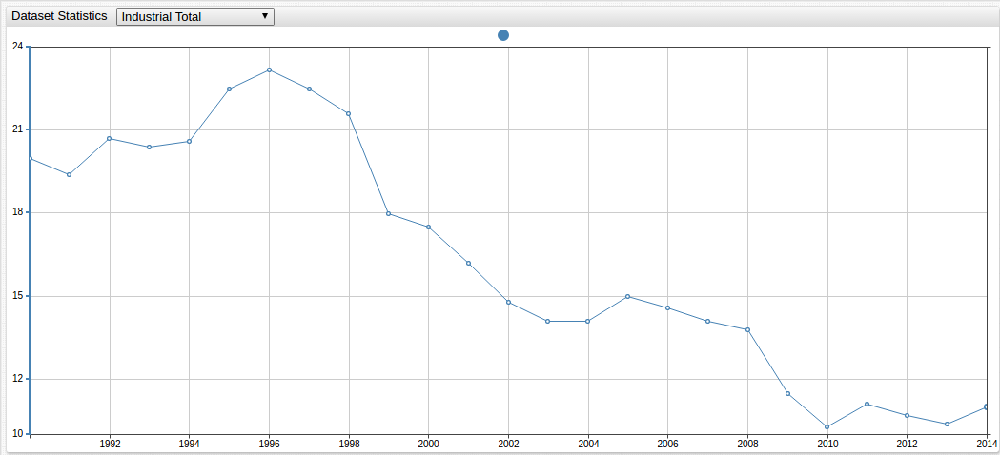
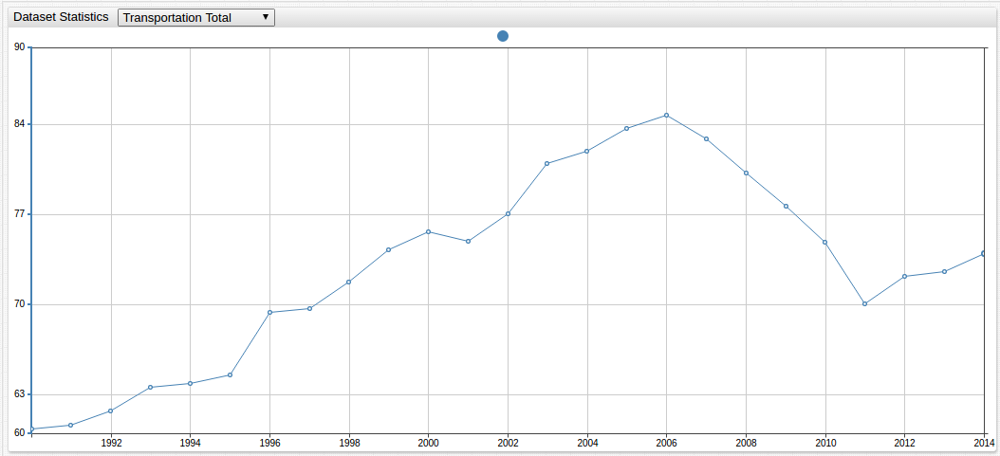
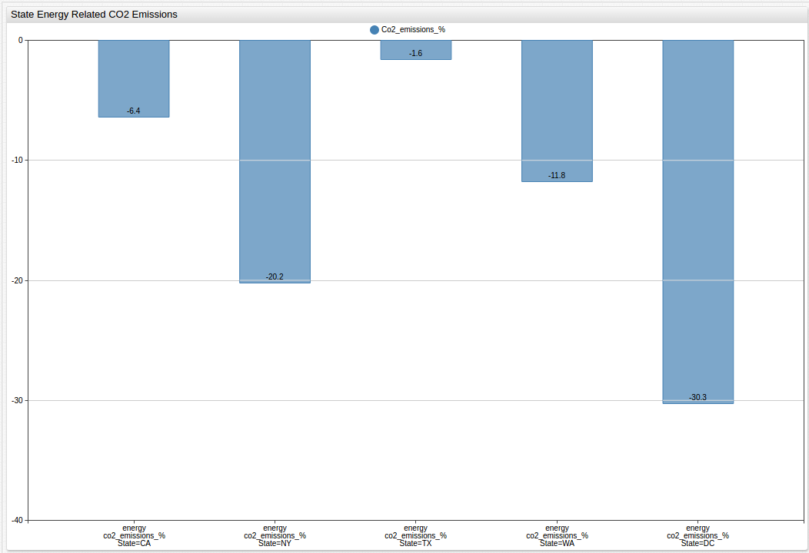

## Climate Change: Back to the Drawing Board  

#### Introduction  

The [Paris Climate Accords](Resources/ParisAgreement.txt) are the most recent iteration of the [United Nations Framework 
Convention on Climate Change](Resources/UNFCCC.txt), a near-universally recognized treaty 
ratified by the General Assembly of the United Nations in 1992. Although non-binding,
the Paris Agreement is designed to curb greenhouse gas emissions though diplomacy, 
self-regulation, and what amounts to international peer pressure, while providing aid to
countries still developing their energy infrastructure.  

[Proponents of the agreement](Resources/ParisGood.txt) see the nonbinding nature of the pact 
as an improvement from the now defunct [Kyoto Protocol](Resources/KyotoProtocol.txt), 
which promised an imposed action plan for those not meeting their emissions reduction targets, 
but many of its detractors [claim](Resources/ParisBad.txt) that this lack of enforceability 
will create lopsided results, with countries like America and Great Britain 
heavily investing in greener options at great personal expense while some of the largest 
producers of carbon dioxide emissions like China and India, will not even begin to see a [peak 
in their production](Resources/China2030.txt) for up to ten years in the future.  

So, is America's position as a green leader truly in jeopardy?
Have the last decades of climate change action produced the desired results?
And perhaps most importantly, what does the data show?

#### Methodology  

Using [data](https://catalog.data.gov/dataset/air-quality-ef520) made available by the state of New York that examines 
its fuel consumption over a time period that begins in 1990 and continues to 2014, Axibase data
scientists can examine New York's efforts to curb domestic greenhouse gas production, 
explore the sector as a whole, view the results of the work of many states side by side, 
and analyze the results of several decades of effort. The New York data can be extrapolated 
to serve as a microcosm for the efforts of the entire country. 

 
_The raw data provided by the state of New York can be visualized in a number of ways using
the Axibase Time Series Database software to highlight various outcomes._  

The data contains information from several spheres of the economy: industrial, residential, 
commercial, and transportation. Additionally, there are figures that concern New Yorks's use of 
imported energy, that is, energy produced outside the state itself. This is an interesting and
important figure to consider because currently, externally produced energy makes up about
half of the [New York energy market](Resources/NewYorkEnergyProfile.txt).  

#### Data  

  

 

A broad breakdown of New York fossil fuel consumption shows an energy sector that is making
ardent strides to reduce its industrial use of fossil fuels, while maintaining an above average
amount of residential consumption. Data for externally produced energy is omitted here to 
highlight internal features of the market.  

  

 

Although there is a recent trend indicating an increase in fossil fuel consumption, on the whole,
New York has been lauded as a [prime example](Resources/NewYorkGreen.txt) of the power of green legislation, evidenced by a 
dramatic overall reduction of fossil fuel consumption.  

  

The energy sector makes up the largest amount of internal greenhouse gas production and analysts
are encouraged to see an energy market dominated by coal production able to reduce greenhouse 
gas emissions in the production sector by more than 50% over the last two and a half decades. 
 

  

Not only does the consumer sector show little net improvement throughout the observed period, 
it is also the source of an ever-growing share of total consumption. 

  

Despite a sharp peak in 2004, the State of New York has produced encouraging results in the 
commercial sector in the last decade. The commercial sector is defined as non-residential use
of fossil fuels and waste management.  

   

New York has seen the disappearance of over 
[100,000 internal manufacturing jobs](Resources/NewYorkLabor.txt) 
in the last two decades, many to overseas manufacturers.  

  

The effects of the state's efforts to reduce fossil fuel consumption by increasing bicycle and
bus infrastructure are [producing encouraging results](Resources/NewYorkTransit.txt).  

  

With the downturn of the coal industry following the subprime mortgage crisis 
that left former industry titans penniless and facing bankruptcy, the state of New York and 
its historically coal-heavy energy sector have been forced to find new alternatives 
to supply their energy needs, including importing energy from neighboring states and Canada, 
evidenced here by a sharp increase in import amounts following the 2007 bubble burst. 

  

 

Using [data](Resources/EIAByState.txt) from the Energy Information Agency, New York's performance
is shown relative to other states and territories: California, Texas, Washington, 
and the District of Columbia, with the national mean being -7.5%.
 

Advanced charting can be done for side-by-side comparison of relevant data.  

 

When comparing the best performing and worst performing sectors of the New York energy market,
a simultaneous comparison highlights the achievements of the industrial sector and the 
shortcomings of the residential sector.  

 

Although similar when comparing percent change, a stacked comparison blatantly shows
the difference in absolute change of two similarly performing sectors.  

  

 

A histogram that displays all sectors together can highlight trends that may be otherwise
missed.

  

 

Likewise, total performance can be analyzed based on change per year and overall amount 
per year for a clear understanding of the performance of each sector.  

#### Analysis

During the observed period, New York greenhouse gas production is shown to decrease noticeably
with a difference of more than 20 million metric tons of fossil fuels consumed in the year 2014
when compared to the 1990 numbers.  

New York is considered a model state for environmentalists who point to the 
[per capita](Resources/NewYorkPerCap.txt) consumption rate that New York boasts, 
the second lowest in the nation behind only the District of Columbia, 
as a gold standard of what is achievable for other populous states like
Texas that seem to be lagging behind in the green transition. Considering per sector usage of 
fossil fuels helps illuminate the concerns of analysts who claim that while America may 
be making strides on a macro scale, more changes are needed to see the kinds of goals laid 
out by the previous administration reached in due time. New York is no
exception as the domestic energy market is dominated by coal production.  

The largest push from most green media shifts the focus of reducing America's carbon footprint 
to the individual. Low flow toilets, florescent light bulbs, and a host of
other green technologies have been steadily making waves on the consumer market, 
[making claims](Resources/GreenIsGood.txt) that they hold the key to
reducing fossil fuel use though indirect means. However an examination of the residential 
fossil fuel use data tells another story, showing that today's fossil fuel consumption 
by New Yorkers on a residential level is actually greater than the 1990 numbers. 
To be fair, that uptick in consumer-level consumption is a recent trend, 
with several years during the early 2010's showing slightly lower fossil fuel 
usage. Nonetheless, residential usage makes up roughly [10-15%](Resources/USEnergyUse.txt) 
of America's fossil fuel consumption, and almost 30% of New York's.
This figure does not even include fuels used to power consumer motor vehicles,
typically considered to be the hardest hit on the environment. Despite earnest
intent, it seems that at least on a consumer level, fossil fuel consumption has not 
dramatically changed. For the observed period, the standard deviation was just 2.82, 
which accounts for less than 10% of the observed mean, in exact terms 7.95%.  

#### Conclusions   

The true effects of the President's decision have yet to be seen of course,
as the clause in the Paris Agreement that relates to voluntary withdrawal states a country 
must give almost half a decade's notice to the other signatories, 
but some [legal experts](Resources/CFLTrump.txt) have theorized that the President may be able to withdraw from the 
original 1992 framework in order to bypass the lengthy withdrawal process in as soon as
a year. In the meantime, however, public data provided by states like New York can offer
a unique insight to the mechanisms currently in place and help analysts make predictions about
the validity of future efforts.
 