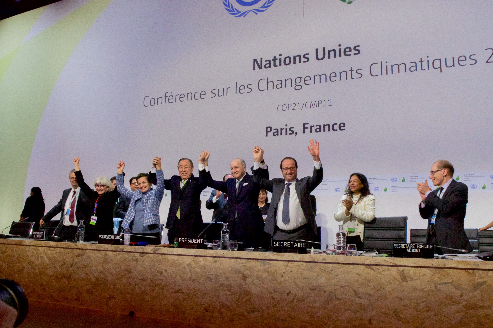
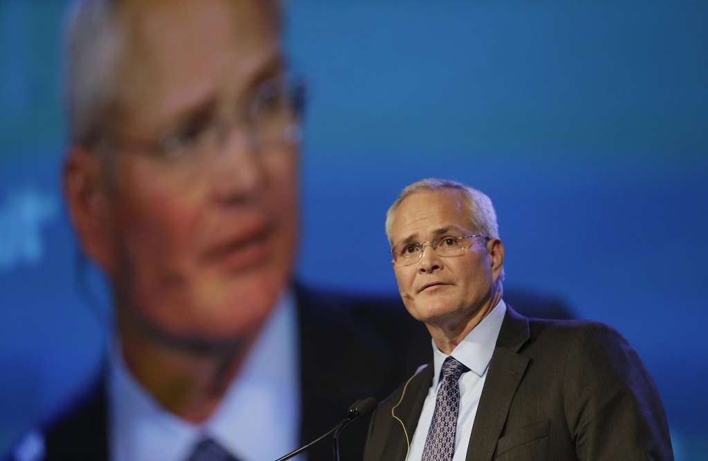

## Climate Change: Back to the Drawing Board  

#### Introduction  
Recently President Donald Trump, the self-styled crusader against what he has called
harmful and self-sabotaging climate change policy
announced that the United States would unconditionally withdraw from the
Paris Climate Accords, signed by his predecessor Barack Obama in 2016. Critics of the move quickly
emerged to denounce the president as ignorant and short-sighted, including the former president
responsible for entering America into the agreement. His supporters however, applaud the decision as 
a much-needed step in the right direction and a welcome opportunity to return sovereignty to America, 
something 
they claim the Paris Agreement stifled through uneven aid packages aimed at helping 
developing nations spur growth in their energy sectors.  

The Paris Accords are the most recent iteration of the United Nations Framework Convention on 
Climate Change, a universally recognized treaty ratified by the General Assembly of the
United Nations in 1992. After the collapse of the now infamous Kyoto Protocol, a void existed in
the eyes of climate activists that they hoped would be filled by the Paris Agreement. Although 
nonbinding, the Paris Agreement is designed to curb the greenhouse gas emissions from the 
world's largest producers though diplomacy and what amounts to international peer pressure, while
providing aid to countries still developing their energy infrastructure.  

 
*World leaders celebrate the completion of negotiations regarding the Paris Climate Accords 
in 2015.* 

While proponents of the agreement see the nonbinding nature of the pact 
as an improvement from the now
defunct Kyoto Protocol, which promised an imposed action plan that could include trade sanctions
for those not meeting their emissions reduction targets, many of its detractors claim that this
lack of enforceability will create lopsided results, with countries like America and Great Britain
heavily investing in greener options at great personal expense while some of the largest producers of 
carbon dioxide emissions like China and India, will not even begin to see a peak in their 
production for up to ten years in the future.  

America's future as a leader in clean energy has been alternately applauded and reviled by officials
on both sides of the aisle, and with the President's latest foray into the international limelight,
leaders from other countries, including China, have come out to show their continued support of 
the agreement. So, is America's position as a green leader truly in jeopardy as President Trump's
critics claim? Have the last decades
of climate change action produced the desired results or been just another act on the stage of 
political theater? And perhaps most importantly, what does the data show?  

#### Methodology  
Using data made available by the State of New York that examines 
its internal greenhouse gas emission from
fuel consumption over a time period that begins in 1990 and continues to 2014, Axibase data
scientists using the Axibase Time Series Database software can conveniently display and examine
New York's efforts to curb domestic greenhouse gas production, explore the sector as a whole,
view the results of the work of many states side by side, and analyze the results of several
decades of effort with ease. The New York data can be extrapolated to serve as a
microcosm about the efforts of the entire country and the state of affairs of green
politics and policy in a country whose attitude towards climate change, at least externally,
has taken on a very different face of late. 

The data contains information from several spheres of the economy: industrial, residential, 
commercial, and transportation. Additionally, there are figures that concern New Yorks's use of 
imported energy, that is, energy produced outside the state itself. This is an interesting and
important figure to consider because currently, externally produced energy makes up about
half of the New York energy market.  

#### Data  

The true functionality of any datum is always limited by the user's ability to draw 
meaningful conclusions from its visualization. Axibase Time Series Database software
brings together usability and functionality, to make even enormous data sets easy to 
manage, digest, and present.
 

  

A broad breakdown of New York fossil fuel consumption using Axibase Time Series Database software
shows an energy sector that is making
ardent strides to reduce its industrial use of fossil fuels, while maintaining an above average
amount of residential consumption. Data for externally produced energy is omitted here to 
highlight internal features of the market.  

  

Although there is a recent trend indicating an increase in fossil fuel consumption, on the whole,
New York has been lauded as a prime example of the power of green legislation, evidenced by a 
dramatic overall reduction of fossil fuel consumption.  

  

The energy sector makes up the largest amount of internal greenhouse gas production and analysts
are encouraged to see an energy market dominated by coal production able to reduce 
greenhouse gas emissions in the production sector by more than 50% over the last two and a half
decades.  

  

A lack of progress in the consumer sector has left many wondering about the true nature of 
green technology aimed at individuals. Not only does the consumer sector show little net improvement
throughout the observed period, it is also the source of an ever-growing share of total 
 consumption. 

  

Despite a sharp peak in 2004, the State of New York has produced encouraging results in the 
commercial sector in the last decade. The commercial sector is defined as non-residential use
of fossil fuels and waste management, a traditionally difficult sector to manage owing to the 
complications that arise when disposing of volatile and hazardous materials.  

   

New York has seen the disappearance of over 100,000 internal manufacturing jobs in the last 
two decades, many to overseas manufacturers. Interestingly, an entrepreneurial boom 
seen in 2014 by state auditors corresponds to the increase in greenhouse gas production 
the following year.  

  

During her term as commissioner of the New York City Department of Transportation from 2007 to 
2013, Janette Sadik-Khan strove to improve the efficiency of her city's transportation 
industry. Hailed as a green visionary by some, including the New York Times, Sadik-Khan has also
been the subject of a number of unsuccessful lawsuits regarding her aggressive expansion of the
city's bus and bike programs. After her tenure in the city of New York, the state's largest
transportation-related greenhouse gas producer, Ms. Sadik-Khan moved
on to a leadership role for the Michael Bloomberg philanthropic consultancy Bloomberg 
Associates and authored a book called _Streetfight: Handbook for an Urban Revolution_. 
The results of her work are tangible with respect to overall greenhouse gas production in the
state.  

  

With the downturn of the coal industry following the subprime mortgage crisis colloquially known
as the Great Recession that left former industry titans penniless and facing bankruptcy,
the state of New York and its historically coal-heavy energy sector have been forced to 
find new alternatives to supply their energy needs, including importing energy from neighboring
states and Canada, evidenced here by a sharp increase in import amounts following the 2007 bubble
 burst. 

  

Using data from the Energy Information Agency, New York's average performance is shown relative to 
other comparably populous states: California, Texas, Washington, and the District of Columbia.
Washington D.C. was the highest
performing United States territory during the observed period (2000 - 2014) with respect to 
percentile reduction of greenhouse gas emissions.
Although there was not a single state that show positive, or increased carbon dioxide output,
several including Texas showed lackluster performance below the national average, 
with the national mean value being 7.5%.
 

#### Analysis  
During the observed period, New York greenhouse gas production is shown to decrease noticeably
with a difference of more than 20 million metric tons of fossil fuels consumed in the year 2014
when compared to the 1990 numbers, despite the state seeing a population increase of almost 
2 million individuals. This change in usage constitutes a reduction of roughly 10%, most of which was 
was achieved during Democratic control of the state by Governors Eliot Spitzer and his successor
David Patterson, with the expansion of green policy
continuing throughout the two terms of the Obama administration leading to further progress
in the battle against unrestricted greenhouse gas production. George Pataki's administration 
saw the height of New York
fossil fuel consumption, with peak usage in 2004, edging out the previous Petaki era high of 226.9 million
metric tons by two and a half million.  

New York is considered a model state for environmentalists who point to the per capita 
consumption rate that New York boasts, the second lowest in the nation, behind only the District
of Columbia as a gold standard of what is achievable for other populous states like
Texas that seem to be lagging behind in the green transition. Considering per sector usage of fossil fuels helps illuminate the concerns of analysts who 
claim that while America may be making strides on a macro scale, more changes are needed to see
the kinds of goals laid out by the Obama administration reached in due time. New York is no
exception as the domestic energy market is dominated by coal production.  

The largest push from most green media shifts the focus of reducing America's carbon footprint 
to the individual. Low flow toilets, florescent light bulbs, and a host of
other green technologies have 
been steadily making waves on the consumer market, making claims that they hold the key to
reducing fossil fuel use though indirect means. However an examination of the residential 
fossil fuel use data tells another story, showing that today's fossil fuel consumption 
by New Yorkers on a residential level is actually
greater than the 1990 numbers. To be fair, that uptick in consumer-level consumption is a 
recent trend, with several years during the early 2010's showing slightly lower fossil fuel usage.
Nonetheless, residential usage makes up roughly 10-15% of America's fossil fuel consumption,
and almost 30% of New York's.
This figure does not even include fuels used to power consumer motor vehicles,
typically considered to be the hardest hit on the environment. Despite earnest
intent, it seems that at least on a consumer level, fossil fuel consumption has not dramatically
changed. For the observed period, the standard deviation was just 2.82, 
which accounts for less than 10% of the observed mean, in exact terms 7.95%.  

#### Conclusions

In recent days since President Trump's announcement, executives from ExxonMobil and ConocoPhillips
have surprised many observers as they have come out in support for the Paris Climate Agreements
and claimed that a unilateral withdrawal by America benefits no one, and may actually harm
U.S. foreign relations as China steps forward to fill the dearth in leadership 
they claim a U.S. withdrawal would create. 
These beliefs have been echoed across several industries by Robert Dudley of British Petroleum, 
Elon Musk of SpaceX, and Bob Iger of the Walt Disney Corporation, the latter two of whom resigned 
from their appointed roles on the President's economic advisory board in protest of his decision. 
While expressing his support 
for the Paris Agreement during a recent share holders' meeting,
ExxonMobil CEO Darren Woods offered a seemingly paradoxical statement about the future of 
global energy production
when he claimed that a low-carbon economy is an inevitable reality of the future for the 
developed nations of the world, but underscored the opportunity to expand fossil fuel 
industries to the one billion people worldwide that currently live without electricity.
 

*ExxonMobil CEO Darren Woods recently spoke out in favor of the Paris Climate Accords.*

The true effects of the President's decision have yet to be seen of course,
as the article in the Paris
Agreement that relates to voluntary withdrawal states a country must give almost half a decade of 
notice to the other signatories, but some legal experts associated with the
Council on Foreign Relations have stated that the President may be able to withdraw from the 
original 1992 framework, in order to bypass the lengthy withdrawal process, in as soon as
one year. 
 

As the world continues to spin, the gas continues to burn, and the politicians continue to
debate, one cannot help but be reminded of the principle of inertia as policy and practice 
continue their seemingly endless oscillation back and forth, with each action proving more
difficult to counter than the last.