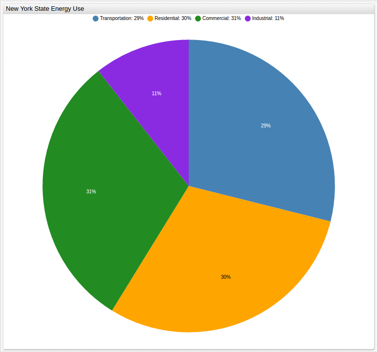

## Climate Change: Back to the Drawing Board 

#### Introduction

The [Paris Climate Accords](http://unfccc.int/files/essential_background/convention/application/pdf/english_paris_agreement.pdf) are the most recent iteration of the [United Nations Framework 
Convention on Climate Change](https://unfccc.int/resource/docs/convkp/conveng.pdf), 
a near-universally recognized treaty ratified by the General Assembly of the United Nations in 1992. 
Although non-binding, the Paris Agreement is designed to curb greenhouse gas emissions though diplomacy, 
self-regulation, and what amounts to international peer pressure, while providing aid to
countries still developing their energy infrastructure. 

Proponents of the agreement see the non-binding nature of the pact 
as an improvement from the now defunct [Kyoto Protocol](http://unfccc.int/resource/docs/convkp/kpeng.pdf), 
which promised an imposed action plan for those not meeting their emissions reduction targets, 
but many of its detractors claim that this lack of enforceability 
will create lopsided results, with countries like America and Great Britain 
heavily investing in greener options at great personal expense while some of the largest 
producers of greenhouse gas emissions like China and India, will not even begin to see a [peak 
in their production](http://climateactiontracker.org/countries/china.html) 
for up to ten years in the future.

So, is America's position as a green leader truly in jeopardy?
Have the last decades of climate change action produced the desired results?
And perhaps most importantly, what does the data show?

#### Methodology 

Using [data](https://catalog.data.gov/dataset/greenhouse-gas-emissions-from-fuel-combustion-million-metric-tons-beginning-1990)
 made available by New York State that examines its greenhouse gas emissions from 
fuel consumption over a time period that begins in 1990 and continues to 2014, 
Axibase data scientists can examine the State's efforts to curb domestic greenhouse gas emission, 
explore the sector as a whole, view the results of the work of many states side by side, 
and analyze the results of several decades of effort. The New York State data can be extrapolated 
to serve as a microcosm for the efforts of the entire country.

The data contains information from several spheres of the economy: industrial, residential, 
commercial, and transportation. Additionally, there are figures that concern New York State's use of 
imported energy, that is, energy produced outside the state itself. This is an interesting and
important variable to consider because currently, externally produced energy makes up more than
half of the [New York State energy market](https://www.eia.gov/state/analysis.php?sid=NY).

#### Data 

 

Total emissions from each sector can be analyzed together to get a clearer 
representation of the complete data that a simpler chart would neglect.

 

The current picture of New York State energy consumption sorted by end-use sector based on
[2015 data](https://www.eia.gov/state/?sid=NY#tabs-1) from the United States Energy 
Information Agency.

 

Using [time series data](https://www.eia.gov/environment/emissions/state/analysis/pdf/table1.pdf) 
from the Energy Information Agency, the results of efforts to reduce greenhouse gas emissions
are shown relative to other states and territories from 2000 to 2014 alongside the 
United States national average. 

Advanced charting can be done for side-by-side comparison of relevant data: 

When analyzing the emissions from two sectors of the New York State energy market,
a simultaneous comparison highlights the achievements of the industrial sector and the 
shortcomings of the residential sector. 

Although similar when comparing percent change, a stacked comparison shows
the stark difference in absolute change of two similarly performing sectors.

 

A histogram that displays all sectors together can highlight trends that may be otherwise
missed such as the sharp decrease in emissions from all sectors between 2007 and 2012. 

#### Analysis

During the observed period, New York State greenhouse gas emissions are shown to decrease noticeably
with a difference of more than 20 million metric tons of gas emitted in the year 2014
compared to the 1990 numbers. Although there is a recent trend indicating an increase in greenhouse gas emission, on the whole,
New York State has been lauded as a prime example of the power of green legislation, evidenced by a 
dramatic overall reduction of emissions. The energy sector makes up the largest amount of internal greenhouse gas emission and analysts
are encouraged to see an energy market dominated by coal production able to reduce
emissions in the production sector by more than 50% over the last two and a half decades.

The consumer sector shows little net improvement throughout the observed period and
it is also the source of an ever-growing share of total emissions. Despite a sharp peak in 
2004, the State of New York has produced encouraging results in the 
commercial sector in the last decade. The commercial sector is defined as the emissions from
non-residential use of fossil fuels and waste management. New York State has seen the 
disappearance of over 
[100,000 manufacturing jobs](https://www.osc.state.ny.us/reports/economic/employment_trends_nys_2013.pdf) 
in the last two decades, many to overseas manufacturers, which contributes
to the substantial decrease in greenhouse gas emissions. The effects of the state's efforts to reduce greenhouse gas emission by increasing bicycle and
bus infrastructure have produced noticeable results as well and with the downturn of the coal industry following the subprime mortgage crisis 
that left former industry titans penniless and facing bankruptcy, the state of New York and 
its historically coal-heavy energy sector have been forced to find new alternatives 
to supply their energy needs, including importing energy from neighboring states and Canada.

New York is considered a model state by environmentalists who point to the 
[per capita](https://www.eia.gov/state/?sid=NY) consumption rate, 
the second lowest in the nation behind only the District of Columbia, 
as the gold standard of what is achievable for other populous states like
Texas that seem to be lagging behind in the green transition. Considering per sector usage of 
fossil fuels alongside emissions helps illuminate the concerns of analysts who claim 
that while America may be making strides on a macro scale, 
more changes are needed to see the kinds of goals laid 
out by the previous administration reached in due time. 

The largest push from green media shifts the focus of reducing America's carbon footprint 
to the individual. Low flow toilets, florescent light bulbs, and a host of
other green technologies have been steadily making waves on the consumer market, 
making claims that they are the key to reducing greenhouse gas emission, 
however an examination of the residential emission data tells another story, 
showing that today's emissions by residents of the state 
are actually greater than the 1990 numbers. 
To be fair, that uptick in consumer-level emission is a recent trend, 
with several years during the early 2010's showing slightly lower greenhouse gas emissions. 
Nonetheless, residential emissions make up just [12%](https://www.epa.gov/ghgemissions/sources-greenhouse-gas-emissions) 
of America's total greenhouse gas emission, and 30% of New York State's.
This figure does not even include emissions from consumer motor vehicles,
typically considered to be the most harmful to the environment, which are included in 
transportation data. Despite earnest intent, it seems that at least on the consumer level, 
greenhouse gas emissions have not changed dramatically. For the observed period, 
the standard deviation of the residential sector was 2.82, which accounts for just 7.95% of 
the observed mean.

#### Conclusions

The true effects of the President's decision have yet to be seen of course,
as the clause in the Paris Agreement that relates to voluntary withdrawal states a country 
must give almost half a decade's notice to the other signatories, 
but some [legal experts](https://www.cfr.org/blog-post/vietnam-and-united-states-make-nice-now-disappointment-looms)
have theorized that the President may be able to withdraw from the original 1992 framework
in order to bypass the lengthy withdrawal process in as soon as a year. Further, most of the 
mechanisms of the Paris Agreement were set to begin taking effect in 2020, making them mostly
symbolic at present. In the meantime, however, 
public data provided by states like New York can offer a unique insight to the policies currently 
in place and help analysts make predictions about the validity of future efforts.

#### Action Items

Using the following procedure, users can replicate data analysis seen here.

1. Install [Docker](https://docs.docker.com/engine/installation/linux/ubuntu/).

2. Download the [`docker-compose.yml`](resources/docker-compose.yml) file to launch the ATSD container bundle.

3. Launch containers with the following command:

4. Open Axibase Timeseries Database and begin working with your data.

[Contact Axibase](https://axibase.com/feedback/) with any questions here.
