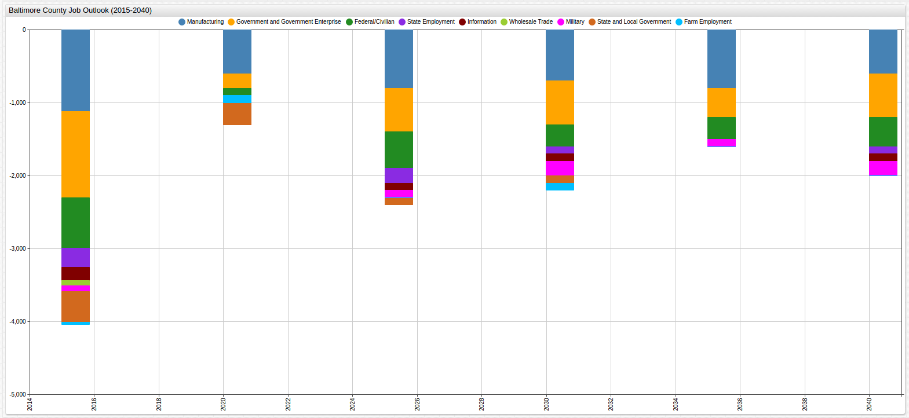

Projected Baltimore Employment Figures (2001-2040)
===

[Data Source](https://github.com/axibase/open-data-catalog/blob/master/datasets/5w8e-5mc3.md)

[SQL Console](https://axibase.com/) and [ChartLab](https://apps.axibase.com/) from Axibase

#### Total Projected Employment Numbers (2001-2040)

```sql
SELECT datetime AS "Year", value/1000 AS "Total Jobs (Thousand)"
  FROM atsd_series
WHERE entity = '5w8e-5mc3' AND metric LIKE ('job_title.total_employment')
  GROUP BY datetime, value 
ORDER BY 'Year' ASC
  LIMIT 20
```

```ls
| Year       | Total Jobs (Thousand) | 
|------------|-----------------------| 
| 2001-01-01 | 467.00                | 
| 2002-01-01 | 468.42                | 
| 2003-01-01 | 470.95                | 
| 2004-01-01 | 484.19                | 
| 2005-01-01 | 496.97                | 
| 2006-01-01 | 506.33                | 
| 2007-01-01 | 519.80                | 
| 2008-01-01 | 520.36                | 
| 2009-01-01 | 510.50                | 
| 2010-01-01 | 505.13                | 
| 2011-01-01 | 509.85                | 
| 2012-01-01 | 513.86                | 
| 2013-01-01 | 513.36                | 
| 2015-01-01 | 519.90                | 
| 2020-01-01 | 541.70                | 
| 2025-01-01 | 553.60                | 
| 2030-01-01 | 562.30                | 
| 2035-01-01 | 570.80                | 
| 2040-01-01 | 579.90                | 
```


[](https://apps.axibase.com/chartlab/19d89e95/2/#fullscreen)

#### Most Populous Industries (2001)

```sql
SELECT metric.label AS "Job Field", first(value)/1000 AS "2001 Total (Thousand)"
  FROM atsd_series
WHERE entity = '5w8e-5mc3' and metric LIKE 'job_title.%' AND metric.label != 'Total Employment'
  GROUP BY 'Job Field'
ORDER BY '2001 Total (Thousand)' DESC
  LIMIT 10
```

```ls
| Job Field                             | 2001 Total (Thousand) | 
|---------------------------------------|-----------------------| 
| Retail trade                          | 61.61                 | 
| Government and government enterprises | 60.42                 | 
| Health care and social assistance     | 55.07                 | 
| State and local                       | 42.45                 | 
| Administrative and waste services     | 35.57                 | 
| Professional and technical services   | 34.51                 | 
| Manufacturing                         | 33.02                 | 
| Construction                          | 29.79                 | 
| Local                                 | 29.37                 | 
| Finance and insurance                 | 27.71                 | 
```


[](https://apps.axibase.com/chartlab/fa80759c/7/#fullscreen)

#### Most Populous Industries (2040)

```sql
SELECT metric.label AS "Job Field", last(value)/1000 AS "2040 Total (Thousand)"
  FROM atsd_series
WHERE entity = '5w8e-5mc3' and metric LIKE 'job_title.%' AND metric.label != 'Total Employment'
  GROUP BY 'Job Field'
ORDER BY '2040 Total (Thousand)' DESC
  LIMIT 10
```

```ls
| Job Field                                    | 2040 Total (Thousand) | 
|----------------------------------------------|-----------------------| 
| Health care and social assistance            | 90.40                 | 
| Retail trade                                 | 59.30                 | 
| Government and government enterprises        | 56.60                 | 
| Professional and technical services          | 52.40                 | 
| Administrative and waste services            | 45.30                 | 
| Finance and insurance                        | 44.00                 | 
| State and local                              | 41.70                 | 
| Construction                                 | 40.00                 | 
| Accommodation and food services              | 34.80                 | 
| Other services, except public administration | 34.30                 |  
```


[](https://apps.axibase.com/chartlab/fa80759c/8/#fullscreen)

#### Most Populous Industries (Average) (2001-2040)

```sql
SELECT metric.label AS "Job Field", avg(value)/1000 AS "Average Total (Thousand)"
  FROM atsd_series
WHERE entity = '5w8e-5mc3' and metric LIKE 'job_title.%' AND metric.label != 'Total Employment'
  GROUP BY 'Job Field'
ORDER BY 'Average Total (Thousand)' DESC
  LIMIT 10
```

```ls
| Job Field                             | Average Total (Thousand) | 
|---------------------------------------|--------------------------| 
| Health care and social assistance     | 72.04                    | 
| Government and government enterprises | 59.60                    | 
| Retail trade                          | 59.04                    | 
| Professional and technical services   | 43.89                    | 
| State and local                       | 41.86                    | 
| Finance and insurance                 | 37.47                    | 
| Administrative and waste services     | 36.30                    | 
| Construction                          | 33.92                    | 
| Local                                 | 29.96                    | 
| Accommodation and food services       | 29.79                    | 
```


[](https://apps.axibase.com/chartlab/56ce84ce/5/#fullscreen)

#### Most Positive Job Outlook (2001-2040)

> Job Outlook is a measurement used by economists to describe the tendency of a particular industry to see growth in
employment numbers over a given period of time.

```sql
SELECT metric.label AS "Job Field", delta(value)/1000 AS "Average Total (Thousand)"
  FROM atsd_series
WHERE entity = '5w8e-5mc3' and metric LIKE 'job_title.%' AND metric.label != 'Total Employment'
  GROUP BY 'Job Field'
ORDER BY 'Average Total (Thousand)' DESC
  LIMIT 10
```

```ls
| Job Field                                    | Average Total (Thousand) | 
|----------------------------------------------|--------------------------| 
| Health care and social assistance            | 35.33                    | 
| Professional and technical services          | 17.89                    | 
| Finance and insurance                        | 16.29                    | 
| Educational services                         | 10.75                    | 
| Other services, except public administration | 10.24                    | 
| Construction                                 | 10.21                    | 
| Administrative and waste services            | 9.73                     | 
| Real estate and rental and leasing           | 9.12                     | 
| Accommodation and food services              | 8.25                     | 
| Arts, entertainment, and recreation          | 6.96                     | 
```


[](https://apps.axibase.com/chartlab/56ce84ce/4/#fullscreen)

> The delta value is shown for each of the ten fields above

#### Least Populous Industries (2001)

```sql
SELECT metric.label AS "Job Field", first(value)/1000 AS "Average Total (Thousand)"
  FROM atsd_series
WHERE entity = '5w8e-5mc3' and metric LIKE 'job_title.%' AND metric.label != 'Total Employment'
  GROUP BY 'Job Field'
ORDER BY 'Average Total (Thousand)' ASC
  LIMIT 10
```

```ls
| Job Field                                        | Average Total (Thousand) | 
|--------------------------------------------------|--------------------------| 
| Mining                                           | 0.36                     | 
| Forestry, fishing, related activities, and other | 0.46                     | 
| Farm employment                                  | 1.43                     | 
| Utilities                                        | 1.51                     | 
| Management of companies and enterprises          | 1.54                     | 
| Military                                         | 2.63                     | 
| Information                                      | 8.76                     | 
| Educational services                             | 9.25                     | 
| Transportation and warehousing                   | 10.38                    | 
| Arts, entertainment, and recreation              | 10.45                    | 
```


#### Least Populous Industries (2040)

```sql
SELECT metric.label AS "Job Field", last(value)/1000 AS "Average Total (Thousand)"
  FROM atsd_series
WHERE entity = '5w8e-5mc3' and metric LIKE 'job_title.%' AND metric.label != 'Total Employment'
  GROUP BY 'Job Field'
ORDER BY 'Average Total (Thousand)' ASC
  LIMIT 10
```

```ls
| Job Field                                        | Average Total (Thousand) | 
|--------------------------------------------------|--------------------------| 
| Forestry, fishing, related activities, and other | 0.40                     | 
| Mining                                           | 0.60                     | 
| Farm employment                                  | 0.90                     | 
| Utilities                                        | 1.30                     | 
| Military                                         | 1.60                     | 
| Information                                      | 6.90                     | 
| Management of companies and enterprises          | 6.90                     | 
| Employment State                                 | 11.20                    | 
| Transportation and warehousing                   | 12.80                    | 
| Federal, civilian                                | 13.30                    |  
```


#### Least Populous Industries (Average) (2001-2040)

```sql
SELECT metric.label AS "Job Field", avg(value)/1000 AS "Average Total (Thousand)"
  FROM atsd_series
WHERE entity = '5w8e-5mc3' and metric LIKE 'job_title.%' AND metric.label != 'Total Employment'
  GROUP BY 'Job Field'
ORDER BY 'Average Total (Thousand)' ASC
  LIMIT 10
```
 
```ls
| Job Field                                        | Average Total (Thousand) | 
|--------------------------------------------------|--------------------------| 
| Forestry, fishing, related activities, and other | 0.43                     | 
| Mining                                           | 0.53                     | 
| Farm employment                                  | 1.09                     | 
| Utilities                                        | 1.36                     | 
| Military                                         | 2.33                     | 
| Management of companies and enterprises          | 4.01                     | 
| Information                                      | 8.15                     | 
| Transportation and warehousing                   | 11.79                    | 
| Employment State                                 | 11.91                    | 
| Arts, entertainment, and recreation              | 12.93                    | 
```


[](https://apps.axibase.com/chartlab/56ce84ce/7/#fullscreen)

#### Least Positive Job Outlook (2001-2040)

```sql
SELECT metric.label AS "Job Field", delta(value)/1000 AS "Average Total (Thousand)"
  FROM atsd_series
WHERE entity = '5w8e-5mc3' and metric LIKE 'job_title.%' AND metric.label != 'Total Employment'
  GROUP BY 'Job Field'
ORDER BY 'Average Total (Thousand)' ASC
  LIMIT 10
```

```ls
| Job Field                             | Average Total (Thousand) | 
|---------------------------------------|--------------------------| 
| Manufacturing                         | -19.42                   | 
| Government and government enterprises | -3.82                    | 
| Retail trade                          | -2.31                    | 
| Federal, civilian                     | -2.04                    | 
| Employment State                      | -1.88                    | 
| Information                           | -1.86                    | 
| Wholesale trade                       | -1.68                    | 
| Military                              | -1.03                    | 
| State and local                       | -0.75                    | 
| Farm employment                       | -0.53                    | 
```



[](https://apps.axibase.com/chartlab/56ce84ce/6/#fullscreen)
