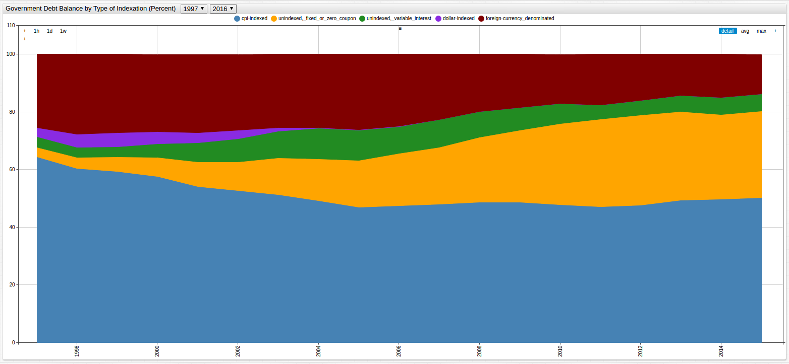
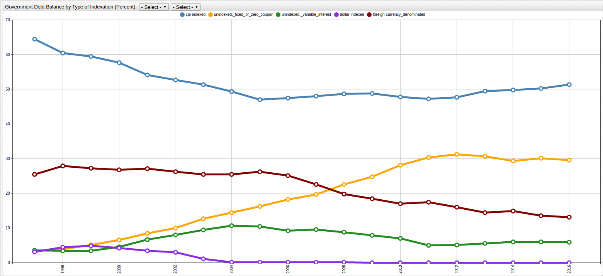

# Bank of Israel Debt, 1997-2016

ChartLab and SQL Console in [Axibase Time Series Database](https://axibase.com/docs/atsd/)

> Data Source: [Bank of Israel](http://www.boi.org.il/en/DataAndStatistics/Pages/Default.aspx)

## Debt Balances (NIS Billion, current value)


[](https://apps.axibase.com/chartlab/c6a6b0c8/7/#fullscreen)

```sql
SELECT date_format(time, 'yyyy') AS "Date", pd.value AS "Public Debt", gd.value AS "Government Debt", dd.value AS "Domestic Debt", fd.value AS "Foreign Debt"
  FROM "public_debt(nis)" AS pd JOIN "government_debt_(nis)" AS gd JOIN "domestic_debt_(nis)" AS dd JOIN "foreign_debt_(nis)" AS fd
GROUP BY 'Date', pd.value, gd.value, dd.value, fd.value
  ORDER BY 'Date'
```

| Date | Public Debt | Government Debt | Domestic Debt | Foreign Debt |
|------|-------------|-----------------|---------------|--------------|
| 1997 | 372         | 360             | 268           | 92           |
| 1998 | 421         | 409             | 295           | 114          |
| 1999 | 435         | 422             | 308           | 115          |
| 2000 | 429         | 417             | 305           | 112          |
| 2001 | 460         | 448             | 326           | 121          |
| 2002 | 517         | 504             | 372           | 132          |
| 2003 | 536         | 523             | 390           | 133          |
| 2004 | 554         | 541             | 403           | 138          |
| 2005 | 564         | 551             | 407           | 145          |
| 2006 | 549         | 536             | 402           | 135          |
| 2007 | 536         | 523             | 405           | 118          |
| 2008 | 557         | 545             | 437           | 108          |
| 2009 | 608         | 596             | 486           | 110          |
| 2010 | 618         | 606             | 502           | 103          |
| 2011 | 644         | 631             | 521           | 110          |
| 2012 | 679         | 666             | 559           | 107          |
| 2013 | 709         | 696             | 596           | 100          |
| 2014 | 729         | 716             | 610           | 106          |
| 2015 | 746         | 728             | 629           | 99           |
| 2016 | 760         | 740             | 643           | 97           |

## Debt Balances as Percent GDP


[](https://apps.axibase.com/chartlab/c6a6b0c8/6/#fullscreen)

```sql
SELECT date_format(time, 'yyyy') AS "Date", pd.value AS "Public Debt Percent GDP", gd.value AS "Government Debt Percent GDP", dd.value AS "Domestic Debt Percent GDP", fd.value AS "Foreign Debt Percent GDP"
  FROM "public_debt" AS pd JOIN "government_debt" AS gd JOIN "domestic_debt" AS dd JOIN "foreign_debt" AS fd
GROUP BY 'Date', pd.value, gd.value, dd.value, fd.value
  ORDER BY 'Date'
```

| Date | Public Debt Percent GDP | Government Debt Percent GDP | Domestic Debt Percent GDP | Foreign Debt Percent GDP |
|------|-------------------------|-----------------------------|---------------------------|--------------------------|
| 1997 | 94                      | 91                          | 68                        | 23                       |
| 1998 | 96                      | 93                          | 67                        | 26                       |
| 1999 | 90                      | 87                          | 63                        | 24                       |
| 2000 | 80                      | 77                          | 57                        | 21                       |
| 2001 | 84                      | 82                          | 59                        | 22                       |
| 2002 | 90                      | 88                          | 65                        | 23                       |
| 2003 | 93                      | 91                          | 68                        | 23                       |
| 2004 | 91                      | 89                          | 66                        | 23                       |
| 2005 | 88                      | 86                          | 64                        | 23                       |
| 2006 | 80                      | 78                          | 59                        | 20                       |
| 2007 | 73                      | 71                          | 55                        | 16                       |
| 2008 | 72                      | 70                          | 56                        | 14                       |
| 2009 | 75                      | 73                          | 60                        | 14                       |
| 2010 | 71                      | 69                          | 58                        | 12                       |
| 2011 | 69                      | 68                          | 56                        | 12                       |
| 2012 | 68                      | 67                          | 56                        | 11                       |
| 2013 | 67                      | 66                          | 56                        | 9                        |
| 2014 | 66                      | 65                          | 55                        | 10                       |
| 2015 | 64                      | 63                          | 54                        | 8                        |
| 2016 | 62                      | 60                          | 53                        | 8                        |


[](https://apps.axibase.com/chartlab/7b59b331/8/#fullscreen)

## Government Debt Balance by Type of Indexation



[](https://apps.axibase.com/chartlab/c6a6b0c8/3/#fullscreen)

```sql
SELECT date_format(time, 'yyyy') AS "Date", cpi.value AS "CPI-Indexed", ui1.value AS "Unindexed, Fixed or Zero", ui2.value AS "Inindexed, Variable", di.value AS "Dollar-Indexed", fcd.value AS "Foreign-Currency Denominated"
  FROM "cpi-indexed" AS cpi JOIN "unindexed,_fixed_or_zero_coupon" AS ui1 JOIN "unindexed,_variable_interest" AS ui2 JOIN "dollar-indexed" AS di JOIN "foreign-currency_denominated" AS fcd
GROUP BY 'Date', cpi.value, ui1.value, ui2.value, di.value, fcd.value
  ORDER BY 'Date'
```

| Date | CPI-Indexed | Unindexed, Fixed or Zero | Inindexed, Variable | Dollar-Indexed | Foreign-Currency Denominated |
|------|-------------|--------------------------|---------------------|----------------|------------------------------|
| 1997 | 64          | 3                        | 4                   | 3              | 26                           |
| 1998 | 60          | 4                        | 3                   | 4              | 28                           |
| 1999 | 59          | 5                        | 3                   | 5              | 27                           |
| 2000 | 58          | 7                        | 5                   | 4              | 27                           |
| 2001 | 54          | 8                        | 7                   | 4              | 27                           |
| 2002 | 53          | 10                       | 8                   | 3              | 26                           |
| 2003 | 51          | 13                       | 9                   | 1              | 26                           |
| 2004 | 49          | 14                       | 11                  | 0              | 26                           |
| 2005 | 47          | 16                       | 10                  | 0              | 26                           |
| 2006 | 48          | 18                       | 9                   | 0              | 25                           |
| 2007 | 48          | 20                       | 10                  | 0              | 23                           |
| 2008 | 49          | 23                       | 9                   | 0              | 20                           |
| 2009 | 49          | 25                       | 8                   | 0              | 18                           |
| 2010 | 48          | 28                       | 7                   | 0              | 17                           |
| 2011 | 47          | 30                       | 5                   | 0              | 18                           |
| 2012 | 48          | 31                       | 5                   | 0              | 16                           |
| 2013 | 49          | 31                       | 6                   | 0              | 14                           |
| 2014 | 50          | 29                       | 6                   | 0              | 15                           |
| 2015 | 50          | 30                       | 6                   | 0              | 14                           |
| 2016 | 51          | 30                       | 6                   | 0              | 13                           |


[](https://apps.axibase.com/chartlab/040c4e03/2/#fullscreen)



[](https://apps.axibase.com/chartlab/c6a6b0c8/5/#fullscreen)
