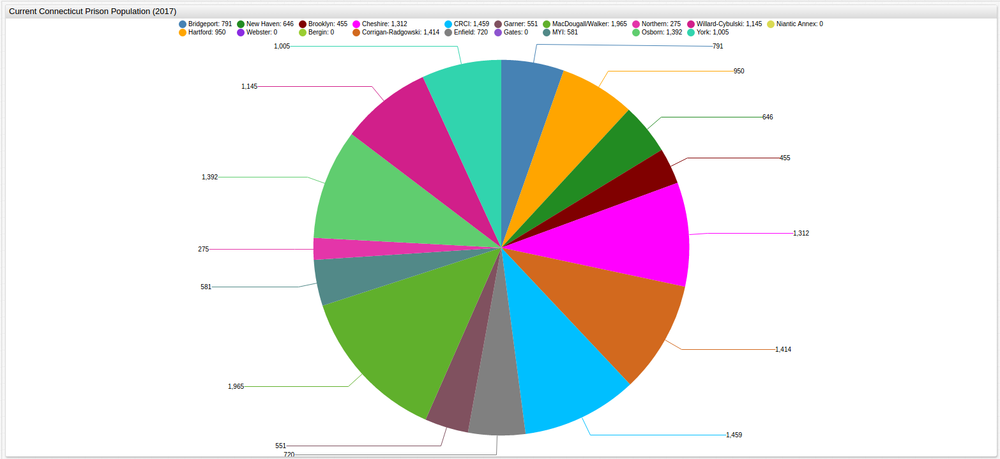

# Connecticut Prison Populations

[Source Dataset](https://github.com/axibase/open-data-catalog/blob/master/datasets/f8ar-pgu4.md)

[SQL Console](https://axibase.com/docs/atsd/sql/)

[ChartLab](https://apps.axibase.com/chartlab) in [Axibase Time Series Database](https://axibase.com/products/axibase-time-series-database/)

## Total Connecticut Prison Population by Quarter (2009 - 2017)


[](https://apps.axibase.com/chartlab/bff45f46/8/#fullscreen)

```sql
SELECT date_format(time, 'yyyy-MM') AS "Time", sum(value)/1000 AS "Total Population (1000 Persons)"
  FROM average_inmate_population
GROUP BY time
  ORDER BY time, 'Total Population (1000 Persons)'
```

| Time    | Total Population (1000 Persons) |
|---------|---------------------------------|
| 2009-09 | 18.83                           |
| 2009-12 | 18.47                           |
| 2010-03 | 18.31                           |
| 2010-06 | 18.33                           |
| 2010-09 | 18.51                           |
| 2010-12 | 18.21                           |
| 2011-03 | 17.80                           |
| 2011-06 | 17.67                           |
| 2011-09 | 17.71                           |
| 2011-12 | 17.55                           |
| 2012-03 | 17.15                           |
| 2012-06 | 16.79                           |
| 2012-09 | 16.64                           |
| 2012-12 | 16.64                           |
| 2013-03 | 16.62                           |
| 2013-06 | 16.79                           |
| 2013-09 | 17.09                           |
| 2013-12 | 16.93                           |
| 2014-03 | 16.70                           |
| 2014-06 | 16.54                           |
| 2014-09 | 16.55                           |
| 2014-12 | 16.51                           |
| 2015-03 | 16.22                           |
| 2015-06 | 16.10                           |
| 2015-09 | 16.12                           |
| 2015-12 | 15.95                           |
| 2016-03 | 15.71                           |
| 2016-04 | 0.60                            |
| 2016-04 | 4.06                            |
| 2016-06 | 15.38                           |
| 2016-09 | 15.12                           |
| 2016-12 | 14.12                           |
| 2017-03 | 13.87                           |

## Average Connecticut Prison Population by Facility (2009 - 2017)


[](https://apps.axibase.com/chartlab/bff45f46/3/#fullscreen)

```sql
SELECT tags.facility_name AS "Facility Name", avg(value) AS "Population"
  FROM average_inmate_population
GROUP BY 'Facility Name'
   ORDER BY 'Population' DESC, 'Facility Name'
```

| Facility Name      | Population |
|--------------------|------------|
| MacDougall/Walker  | 2069       |
| Osborn             | 1925       |
| Corrigan-Radgowski | 1564       |
| CRCI               | 1443       |
| Cheshire           | 1410       |
| Willard-Cybulski   | 1152       |
| York               | 1097       |
| Hartford           | 1069       |
| Bridgeport         | 936        |
| New Haven          | 779        |
| Enfield            | 741        |
| Garner             | 590        |
| MYI                | 555        |
| Brooklyn           | 481        |
| Niantic Annex*     | 434        |
| Bergin*            | 360        |
| Northern           | 279        |
| Gates*             | 205        |
| Webster*           | 22         |

> \* Bergin, Gates, Niantic Annex, and Webster Prisons closed in 2011, 2011, 2016, and 2010
respectively.


[](https://apps.axibase.com/chartlab/bff45f46/9/#fullscreen)

## Current Connecticut Prison Population by Facility (2017)



[](https://apps.axibase.com/chartlab/bff45f46/10/#fullscreen)

```sql
SELECT tags.facility_name AS "Facility Name", last(value) AS "Population"
  FROM average_inmate_population
GROUP BY 'Facility Name'
   ORDER BY 'Facility Name', 'Population'
 ```

| Facility Name      | Population |
|--------------------|------------|
| Bergin             | 0          |
| Bridgeport         | 791        |
| Brooklyn           | 455        |
| CRCI               | 1459       |
| Cheshire           | 1312       |
| Corrigan-Radgowski | 1414       |
| Enfield            | 720        |
| Garner             | 551        |
| Gates              | 0          |
| Hartford           | 950        |
| MYI                | 581        |
| MacDougall/Walker  | 1965       |
| New Haven          | 646        |
| Niantic Annex      | 0          |
| Northern           | 275        |
| Osborn             | 1392       |
| Webster            | 0          |
| Willard-Cybulski   | 1145       |
| York   | 1005       |

## Average Connecticut Prison Population Density by Facility (2009 - 2017)

> Density is defined as [(Number of Prisoners)/(Number of Beds)]


[](https://apps.axibase.com/chartlab/bff45f46/11/#fullscreen)

```sql
SELECT tags.facility_name AS "Facility Name", avg(value) AS "Density"
  FROM inmate_population_density
WHERE tags.facility_name NOT IN ('Bergin', 'Gates', 'Niantic Annex', 'Webster')
  GROUP BY 'Facility Name'
ORDER BY 'Density' DESC
```

| Facility Name      | Density |
|--------------------|---------|
| Hartford           | 109     |
| Brooklyn           | 105     |
| Corrigan-Radgowski | 105     |
| Willard-Cybulski   | 104     |
| Enfield            | 102     |
| New Haven          | 102     |
| MacDougall/Walker  | 97      |
| Cheshire           | 97      |
| Osborn             | 94      |
| CRCI               | 93      |
| York               | 93      |
| Bridgeport         | 92      |
| Garner             | 79      |
| MYI                | 78      |
| Northern           | 48      |

> Non-operational prisons have been removed from this query.


[](https://apps.axibase.com/chartlab/bff45f46/12/#fullscreen)

> The five most densely-populated Connecticut prisons are shown above.

## Current Connecticut Prison Population Density by Facility (2017)

> Density is defined as [(Number of Prisoners)/(Number of Beds)]

```sql
SELECT tags.facility_name AS "Facility Name", last(value) AS "Density"
  FROM inmate_population_density
WHERE tags.facility_name NOT IN ('Bergin', 'Gates', 'Niantic Annex', 'Webster')
  GROUP BY 'Facility Name'
ORDER BY 'Density' DESC, 'Facility Name'
```

| Facility Name      | Density |
|--------------------|---------|
| Brooklyn           | 100     |
| Willard-Cybulski   | 100     |
| Enfield            | 100     |
| Osborn             | 99      |
| CRCI               | 99      |
| Hartford           | 97      |
| Corrigan-Radgowski | 94      |
| MacDougall/Walker  | 92      |
| Bridgeport         | 90      |
| MYI                | 88      |
| York               | 88      |
| New Haven          | 87      |
| Cheshire           | 86      |
| Garner             | 82      |
| Northern           | 49      |