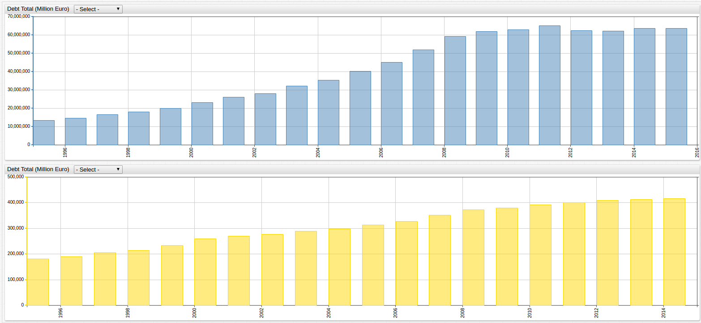

European Union Debt by Country (2005-2016)
==

> **Data Source**: [Eurostat](http://ec.europa.eu/eurostat/tgm/table.do?tab=table&init=1&language=en&pcode=teina225&plugin=1)

> **Visualization**: [ChartLab](https://apps.axibase.com/chartlab)

> **Structured Query Language**: [SQL Console](https://github.com/axibase/atsd/blob/master/sql/README.md) in [Axibase Time Series Database](https://axibase.com/products/axibase-time-series-database/)

## Debt Total

**Figure 1.1**



[](https://apps.axibase.com/chartlab/e4e290d2/9/#fullscreen)

> Open the ChartLab visualization above and use the drop-down menus to navigate between countries or select the European Union
total. Use both charts to compare two countries, one country to the EU total, or any other desired combination.

## Debt as Percent of GDP

**Figure 2.1** 

 

[](https://apps.axibase.com/chartlab/5d6d6252/5/#fullscreen)

> Open the ChartLab visualization above and use the drop-down menu to navigate between countries. The red line represents
the European Union debt as a percent of GDP, used as a baseline for reference.

## Debt as a Portion of the European Union Total

**Figure 3.1**


[](https://apps.axibase.com/chartlab/64b4fd84/13/#fullscreen)

> Open the ChartLab visualization above and use the drop-down menu to navigate through time. 

## Data

Use the following index to navigate between countries, the numerical data associated with the above [ChartLab](https://apps.axibase.com/chartlab)
visualizations and their corresponding SQL queries are shown below:

**European Union Countries Index**:

* [European Union Total](#european-union-total)
* [Austria](#austria)
* [Belgium](#belgium)
* [Bulgaria](#bulgaria)
* [Croatia](#croatia)
* [Cyprus](#cyprus)
* [Czech Republic](#czech-republic)
* [Denmark](#denmark)
* [Estonia](#estonia)
* [Finland](#finland)
* [France](#france)
* [Germany](#germany)
* [Greece](#greece)
* [Hungary](#hungary)
* [Ireland](#ireland)
* [Italy](#italy)
* [Latvia](#latvia)
* [Lithuania](#lithuania)
* [Luxembourg](#luxembourg)
* [Malta](#malta)
* [Netherlands](#netherlands)
* [Poland](#poland)
* [Portugal](#portugal)
* [Romania](#romania)
* [Slovakia](#slovakia)
* [Slovenia](#slovenia)
* [Spain](#spain)
* [Sweden](#sweden)
* [United Kingdom](#united-kingdom)

Using additional [EuroStat population data](http://ec.europa.eu/eurostat/web/population-demography-migration-projections/population-data), this debt has been indexed by per capita value as well [here](../EU_Debt_percap/README.md).

### European Union Total

#### Debt

**Query 1.1**

```sql
SELECT date_format(time, 'yyyy') AS "Year", value/1000000 AS "Gross Debt (Trillion Euro)"
  FROM government_consolidated_gross_debt WHERE tags.geo = 'European Union (28 countries)'
```

**Table 1.1**

```ls
| Year | Gross Debt (Trillion Euro) | 
|------|----------------------------| 
| 2005 | 7.13                       | 
| 2006 | 7.37                       | 
| 2007 | 7.47                       | 
| 2008 | 7.93                       | 
| 2009 | 8.96                       | 
| 2010 | 10.05                      | 
| 2011 | 10.70                      | 
| 2012 | 11.27                      | 
| 2013 | 11.62                      | 
| 2014 | 12.14                      | 
| 2015 | 12.50                      | 
| 2016 | 12.39                      | 
```

#### Debt as Percent of GDP

**Query 1.2**

```sql
SELECT date_format(time, 'yyyy') AS "Year", value AS "Debt Percent of GDP"
  FROM "%eutotal" WHERE entity = 'eu-debt-data-2'
```

**Table 1.2**

```ls
| Year | Debt Percent of GDP | 
|------|---------------------| 
| 2005 | 61.50               | 
| 2006 | 60.10               | 
| 2007 | 57.60               | 
| 2008 | 60.70               | 
| 2009 | 72.80               | 
| 2010 | 78.40               | 
| 2011 | 81.10               | 
| 2012 | 83.80               | 
| 2013 | 85.70               | 
| 2014 | 86.70               | 
| 2015 | 84.90               | 
| 2016 | 83.50               | 
```
Return to the **[index](#data)**

### Austria

#### Debt

**Query 2.1**

```sql
SELECT date_format(time, 'yyyy') AS "Year", value/1000000 AS "Gross Debt (Trillion Euro)"
  FROM government_consolidated_gross_debt WHERE tags.geo = 'Austria'
```

**Table 2.1**

```ls
| Year | Gross Debt (Trillion Euro) | 
|------|----------------------------| 
| 2005 | 0.17                       | 
| 2006 | 0.18                       | 
| 2007 | 0.18                       | 
| 2008 | 0.20                       | 
| 2009 | 0.23                       | 
| 2010 | 0.24                       | 
| 2011 | 0.25                       | 
| 2012 | 0.26                       | 
| 2013 | 0.26                       | 
| 2014 | 0.28                       | 
| 2015 | 0.29                       | 
| 2016 | 0.30                       | 
```

#### Debt as Percent of GDP

**Query 2.2**

```sql
SELECT date_format(time, 'yyyy') AS "Year", value AS "Debt Percent of GDP"
  FROM "%austria" WHERE entity = 'eu-debt-data-2'
```

**Table 2.2**

```ls
| Year | Debt Percent of GDP | 
|------|---------------------| 
| 2005 | 68.60               | 
| 2006 | 67.30               | 
| 2007 | 65.10               | 
| 2008 | 68.80               | 
| 2009 | 80.10               | 
| 2010 | 82.80               | 
| 2011 | 82.60               | 
| 2012 | 82.00               | 
| 2013 | 81.30               | 
| 2014 | 84.40               | 
| 2015 | 85.50               | 
| 2016 | 84.60               | 
```

Return to the **[index](#data)**

### Belgium

#### Debt

**Query 3.1**

```sql
SELECT date_format(time, 'yyyy') AS "Year", value/1000000 AS "Gross Debt (Trillion Euro)"
  FROM government_consolidated_gross_debt WHERE tags.geo = 'Belgium'
```

**Table 3.1**

```ls
| Year | Gross Debt (Trillion Euro) | 
|------|----------------------------| 
| 2005 | 0.29                       | 
| 2006 | 0.30                       | 
| 2007 | 0.30                       | 
| 2008 | 0.33                       | 
| 2009 | 0.35                       | 
| 2010 | 0.36                       | 
| 2011 | 0.39                       | 
| 2012 | 0.40                       | 
| 2013 | 0.41                       | 
| 2014 | 0.43                       | 
| 2015 | 0.43                       | 
| 2016 | 0.45                       | 
```

#### Debt as Percent of GDP

**Query 3.2**

```sql
SELECT date_format(time, 'yyyy') AS "Year", value AS "Debt Percent of GDP"
  FROM "%belgium" WHERE entity = 'eu-debt-data-2'
```

**Table 3.2**

```ls
| Year | Debt Percent of GDP | 
|------|---------------------| 
| 2005 | 94.60               | 
| 2006 | 91.00               | 
| 2007 | 87.00               | 
| 2008 | 92.50               | 
| 2009 | 99.50               | 
| 2010 | 99.70               | 
| 2011 | 102.60              | 
| 2012 | 104.30              | 
| 2013 | 105.60              | 
| 2014 | 106.70              | 
| 2015 | 106.00              | 
| 2016 | 105.90              | 
```

Return to the **[index](#data)**

### Bulgaria

#### Debt

**Query 4.1**

```sql
SELECT date_format(time, 'yyyy') AS "Year", value/1000000 AS "Gross Debt (Trillion Euro)"
  FROM government_consolidated_gross_debt WHERE tags.geo = 'Bulgaria'
```

**Table 4.1**

```ls
| Year | Gross Debt (Trillion Euro) | 
|------|----------------------------| 
| 2005 | 0.0064                     | 
| 2006 | 0.0057                     | 
| 2007 | 0.0053                     | 
| 2008 | 0.0048                     | 
| 2009 | 0.0051                     | 
| 2010 | 0.0059                     | 
| 2011 | 0.0063                     | 
| 2012 | 0.0070                     | 
| 2013 | 0.0071                     | 
| 2014 | 0.0115                     | 
| 2015 | 0.0118                     | 
| 2016 | 0.0140                     | 
```

#### Debt as Percent of GDP

**Query 4.2**

```sql
SELECT date_format(time, 'yyyy') AS "Year", value AS "Debt as Percent of GDP"
  FROM "%bulgaria"
```

**Table 4.2**

```ls
| Year | Debt Percent of GDP | 
|------|---------------------| 
| 2005 | 26.80               | 
| 2006 | 21.00               | 
| 2007 | 16.30               | 
| 2008 | 13.00               | 
| 2009 | 13.70               | 
| 2010 | 15.30               | 
| 2011 | 15.20               | 
| 2012 | 16.70               | 
| 2013 | 17.00               | 
| 2014 | 27.00               | 
| 2015 | 26.00               | 
| 2016 | 29.50               | 
```

Return to the **[index](#data)**

### Croatia

#### Debt

**Query 5.1**

```sql
SELECT date_format(time, 'yyyy') AS "Year", value/1000000 AS "Gross Debt (Trillion Euro)"
  FROM government_consolidated_gross_debt WHERE tags.geo = 'Croatia'
```

**Table 5.1**

```ls
| Year | Gross Debt (Trillion Euro) | 
|------|----------------------------| 
| 2005 | 0.0151                     | 
| 2006 | 0.0156                     | 
| 2007 | 0.0166                     | 
| 2008 | 0.0187                     | 
| 2009 | 0.0222                     | 
| 2010 | 0.0259                     | 
| 2011 | 0.0288                     | 
| 2012 | 0.0309                     | 
| 2013 | 0.0355                     | 
| 2014 | 0.0371                     | 
| 2015 | 0.0379                     | 
| 2016 | 0.0382                     | 
```

#### Debt as Percent of GDP

**Query 5.2**

```sql
SELECT date_format(time, 'yyyy') AS "Year", value AS "Debt Percent of GDP"
  FROM "%croatia" WHERE entity = 'eu-debt-data-2'
```

**Table 5.2**

```ls
| Year | Debt Percent of GDP | 
|------|---------------------| 
| 2005 | 41.30               | 
| 2006 | 38.90               | 
| 2007 | 37.70               | 
| 2008 | 39.60               | 
| 2009 | 49.00               | 
| 2010 | 58.30               | 
| 2011 | 65.20               | 
| 2012 | 70.70               | 
| 2013 | 82.20               | 
| 2014 | 86.60               | 
| 2015 | 86.70               | 
| 2016 | 84.20               | 
```

Return to the **[index](#data)**

### Cyprus

#### Debt

**Query 6.1**

```sql
SELECT date_format(time, 'yyyy') AS "Year", value/1000000 AS "Gross Debt (Trillion Euro)"
  FROM government_consolidated_gross_debt WHERE tags.geo = 'Cyprus'
```

**Table 6.1**

```ls
| Year | Gross Debt (Trillion Euro) | 
|------|----------------------------| 
| 2005 | 0.0095                     | 
| 2006 | 0.0095                     | 
| 2007 | 0.0094                     | 
| 2008 | 0.0085                     | 
| 2009 | 0.0100                     | 
| 2010 | 0.0108                     | 
| 2011 | 0.0129                     | 
| 2012 | 0.0154                     | 
| 2013 | 0.0185                     | 
| 2014 | 0.0188                     | 
| 2015 | 0.0190                     | 
| 2016 | 0.0193                     | 
```

#### Debt as Percent of GDP

**Query 6.2**

```sql
SELECT date_format(time, 'yyyy') AS "Year", value AS "Debt Percent of GDP"
  FROM "%cyprus" WHERE entity = 'eu-debt-data-2'
```

**Table 6.2**

```ls
| Year | Debt Percent of GDP | 
|------|---------------------| 
| 2005 | 62.80               | 
| 2006 | 58.70               | 
| 2007 | 53.50               | 
| 2008 | 44.70               | 
| 2009 | 53.40               | 
| 2010 | 55.80               | 
| 2011 | 65.20               | 
| 2012 | 79.30               | 
| 2013 | 102.20              | 
| 2014 | 107.10              | 
| 2015 | 107.50              | 
| 2016 | 107.80              | 
```

Return to the **[index](#data)**

### Czech Republic

#### Debt

**Query 7.1**

```sql
SELECT date_format(time, 'yyyy') AS "Year", value/1000000 AS "Gross Debt (Trillion Euro)"
  FROM government_consolidated_gross_debt WHERE tags.geo = 'Czech Republic'
```

**Table 7.1**

```sql
| Year | Gross Debt (Trillion Euro) | 
|------|----------------------------| 
| 2005 | 0.0315                     | 
| 2006 | 0.0356                     | 
| 2007 | 0.0400                     | 
| 2008 | 0.0428                     | 
| 2009 | 0.0505                     | 
| 2010 | 0.0602                     | 
| 2011 | 0.0623                     | 
| 2012 | 0.0718                     | 
| 2013 | 0.0671                     | 
| 2014 | 0.0656                     | 
| 2015 | 0.0680                     | 
| 2016 | 0.0649                     | 
```

#### Debt as Percent of GDP

**Query 7.2**
```sql
SELECT date_format(time, 'yyyy') AS "Year", value AS "Debt Percent of GDP"
  FROM "%czech_republic" WHERE entity = 'eu-debt-data-2'
```

**Table 7.2**

```ls
| Year | Debt Percent of GDP | 
|------|---------------------| 
| 2005 | 28.00               | 
| 2006 | 27.90               | 
| 2007 | 27.80               | 
| 2008 | 28.70               | 
| 2009 | 34.10               | 
| 2010 | 38.20               | 
| 2011 | 39.80               | 
| 2012 | 44.50               | 
| 2013 | 44.90               | 
| 2014 | 42.20               | 
| 2015 | 40.30               | 
| 2016 | 37.20               | 
```

Return to the **[index](#data)**

### Denmark

#### Debt

**Query 8.1**

```sql
SELECT date_format(time, 'yyyy') AS "Year", value/1000000 AS "Gross Debt (Trillion Euro)"
  FROM government_consolidated_gross_debt WHERE tags.geo = 'Denmark'
```
**Table 8.1**

```ls
| Year | Gross Debt (Trillion Euro) | 
|------|----------------------------| 
| 2005 | 0.0795                     | 
| 2006 | 0.0712                     | 
| 2007 | 0.0638                     | 
| 2008 | 0.0805                     | 
| 2009 | 0.0930                     | 
| 2010 | 0.1035                     | 
| 2011 | 0.1145                     | 
| 2012 | 0.1140                     | 
| 2013 | 0.1139                     | 
| 2014 | 0.1168                     | 
| 2015 | 0.1074                     | 
| 2016 | 0.1047                     | 
```

#### Debt as Percent of GDP

**Query 8.2**

```sql
SELECT date_format(time, 'yyyy') AS "Year", value AS "Debt Percent of GDP"
  FROM "%denmark" WHERE entity = 'eu-debt-data-2'
```

**Table 8.2**

```ls
| Year | Debt Percent of GDP | 
|------|---------------------| 
| 2005 | 37.40               | 
| 2006 | 31.50               | 
| 2007 | 27.30               | 
| 2008 | 33.30               | 
| 2009 | 40.20               | 
| 2010 | 42.60               | 
| 2011 | 46.10               | 
| 2012 | 44.90               | 
| 2013 | 44.00               | 
| 2014 | 44.00               | 
| 2015 | 39.60               | 
| 2016 | 37.80               | 
```

Return to the **[index](#data)**

### Estonia

#### Debt

**Query 9.1**

```sql
SELECT date_format(time, 'yyyy') AS "Year", value/1000000 AS "Gross Debt (Trillion Euro)"
  FROM government_consolidated_gross_debt WHERE tags.geo = 'Estonia'
```

**Table 9.1**

```ls
| Year | Gross Debt (Trillion Euro) | 
|------|----------------------------| 
| 2005 | 0.0005                     | 
| 2006 | 0.0006                     | 
| 2007 | 0.0006                     | 
| 2008 | 0.0007                     | 
| 2009 | 0.0010                     | 
| 2010 | 0.0010                     | 
| 2011 | 0.0010                     | 
| 2012 | 0.0017                     | 
| 2013 | 0.0019                     | 
| 2014 | 0.0021                     | 
| 2015 | 0.0020                     | 
| 2016 | 0.0020                     | 
```

#### Debt as Percent of GDP

**Query 9.2**

```sql
SELECT date_format(time, 'yyyy') AS "Year", value AS "Debt Percent of GDP"
  FROM "%estonia" WHERE entity = 'eu-debt-data-2'
```

**Table 9.2**

```ls
| Year | Debt Percent of GDP | 
|------|---------------------| 
| 2005 | 4.50                | 
| 2006 | 4.40                | 
| 2007 | 3.70                | 
| 2008 | 4.50                | 
| 2009 | 7.00                | 
| 2010 | 6.60                | 
| 2011 | 6.10                | 
| 2012 | 9.70                | 
| 2013 | 10.20               | 
| 2014 | 10.70               | 
| 2015 | 10.10               | 
| 2016 | 9.50                | 
```

Return to the **[index](#data)**

### Finland

#### Debt

**Query 10.1**

```sql
SELECT date_format(time, 'yyyy') AS "Year", value/1000000 AS "Gross Debt (Trillion Euro)"
  FROM government_consolidated_gross_debt WHERE tags.geo = 'Finland'
```

**Table 10.1**

```ls
| Year | Gross Debt (Trillion Euro) | 
|------|----------------------------| 
| 2005 | 0.0658                     | 
| 2006 | 0.0659                     | 
| 2007 | 0.0634                     | 
| 2008 | 0.0633                     | 
| 2009 | 0.0755                     | 
| 2010 | 0.0882                     | 
| 2011 | 0.0955                     | 
| 2012 | 0.1077                     | 
| 2013 | 0.1148                     | 
| 2014 | 0.1237                     | 
| 2015 | 0.1334                     | 
| 2016 | 0.1361                     | 
```

#### Debt as Percent of GDP

**Query 10.2**

```sql
SELECT date_format(time, 'yyyy') AS "Year", value AS "Debt Percent of GDP"
  FROM "%finland" WHERE entity = 'eu-debt-data-2'
```

**Table 10.2**

```ls
| Year | Debt Percent of GDP | 
|------|---------------------| 
| 2005 | 40.00               | 
| 2006 | 38.20               | 
| 2007 | 34.00               | 
| 2008 | 32.70               | 
| 2009 | 41.70               | 
| 2010 | 47.10               | 
| 2011 | 48.50               | 
| 2012 | 53.90               | 
| 2013 | 56.50               | 
| 2014 | 60.20               | 
| 2015 | 63.70               | 
| 2016 | 63.60               | 
```

Return to the **[index](#data)**

### France

#### Debt

**Query 11.1**

```sql
SELECT date_format(time, 'yyyy') AS "Year", value/1000000 AS "Gross Debt (Trillion Euro)"
  FROM government_consolidated_gross_debt WHERE tags.geo = 'France'
```

**Table 11.1**

```ls
| Year | Gross Debt (Trillion Euro) | 
|------|----------------------------| 
| 2005 | 1.1898                     | 
| 2006 | 1.1933                     | 
| 2007 | 1.2520                     | 
| 2008 | 1.3573                     | 
| 2009 | 1.5307                     | 
| 2010 | 1.6317                     | 
| 2011 | 1.7537                     | 
| 2012 | 1.8684                     | 
| 2013 | 1.9529                     | 
| 2014 | 2.0380                     | 
| 2015 | 2.0982                     | 
| 2016 | 2.1474                     | 
```

#### Debt as Percent of GDP

**Query 11.2**

```sql
SELECT date_format(time, 'yyyy') AS "Year", value AS "Debt Percent of GDP"
  FROM "%france" WHERE entity = 'eu-debt-data-2'
```

**Table 11.2**

```ls
| Year | Debt Percent of GDP | 
|------|---------------------| 
| 2005 | 67.10               | 
| 2006 | 64.40               | 
| 2007 | 64.30               | 
| 2008 | 68.00               | 
| 2009 | 78.90               | 
| 2010 | 81.60               | 
| 2011 | 85.20               | 
| 2012 | 89.50               | 
| 2013 | 92.30               | 
| 2014 | 94.90               | 
| 2015 | 95.60               | 
| 2016 | 96.00               | 
```

Return to the **[index](#data)**

### Germany

#### Debt

**Query 12.1**

```sql
SELECT date_format(time, 'yyyy') AS "Year", value/1000000 AS "Gross Debt (Trillion Euro)"
  FROM government_consolidated_gross_debt WHERE tags.geo = 'Germany (until 1990 former territory of the FRG)'
```

**Table 12.1**

```ls
| Year | Gross Debt (Trillion Euro) | 
|------|----------------------------| 
| 2005 | 1.5414                     | 
| 2006 | 1.5913                     | 
| 2007 | 1.5999                     | 
| 2008 | 1.6689                     | 
| 2009 | 1.7856                     | 
| 2010 | 2.0888                     | 
| 2011 | 2.1283                     | 
| 2012 | 2.2049                     | 
| 2013 | 2.1898                     | 
| 2014 | 2.1896                     | 
| 2015 | 2.1588                     | 
| 2016 | 2.1404                     | 
```

#### Debt as Percent of GDP

**Query 12.2**

```sql
SELECT date_format(time, 'yyyy') AS "Year", value AS "Debt Percent of GDP"
  FROM "%germany" WHERE entity = 'eu-debt-data-2'
```

**Table 12.2**

```ls
| Year | Debt Percent of GDP | 
|------|---------------------| 
| 2005 | 67.00               | 
| 2006 | 66.50               | 
| 2007 | 63.70               | 
| 2008 | 65.10               | 
| 2009 | 72.60               | 
| 2010 | 81.00               | 
| 2011 | 78.70               | 
| 2012 | 79.90               | 
| 2013 | 77.50               | 
| 2014 | 74.90               | 
| 2015 | 71.20               | 
| 2016 | 68.30               | 
```

Return to the **[index](#data)**

### Greece

#### Debt

**Query 13.1**

```sql
SELECT date_format(time, 'yyyy') AS "Year", value/1000000 AS "Gross Debt (Trillion Euro)"
  FROM government_consolidated_gross_debt WHERE tags.geo = 'Greece'
```

**Table 13.1**

```ls
| Year | Gross Debt (Trillion Euro) | 
|------|----------------------------| 
| 2005 | 0.2140                     | 
| 2006 | 0.2256                     | 
| 2007 | 0.2399                     | 
| 2008 | 0.2648                     | 
| 2009 | 0.3011                     | 
| 2010 | 0.3306                     | 
| 2011 | 0.3563                     | 
| 2012 | 0.3051                     | 
| 2013 | 0.3205                     | 
| 2014 | 0.3197                     | 
| 2015 | 0.3117                     | 
| 2016 | 0.3149                     | 
```

#### Debt as Percent of GDP

**Query 13.2**

```sql
SELECT date_format(time, 'yyyy') AS "Year", value AS "Debt Percent of GDP"
  FROM "%greece" WHERE entity = 'eu-debt-data-2'
```

**Table 13.2**

```ls
| Year | Debt Percent of GDP | 
|------|---------------------| 
| 2005 | 107.40              | 
| 2006 | 103.60              | 
| 2007 | 103.10              | 
| 2008 | 109.40              | 
| 2009 | 126.70              | 
| 2010 | 146.20              | 
| 2011 | 172.10              | 
| 2012 | 159.60              | 
| 2013 | 177.40              | 
| 2014 | 179.70              | 
| 2015 | 177.40              | 
| 2016 | 179.00              | 
```

Return to the **[index](#data)**

### Hungary

#### Debt

**Query 14.1**

```sql
SELECT date_format(time, 'yyyy') AS "Year", value/1000000 AS "Gross Debt (Trillion Euro)"
  FROM government_consolidated_gross_debt WHERE tags.geo = 'Hungary'
```

**Table 14.1**

```ls
| Year | Gross Debt (Trillion Euro) | 
|------|----------------------------| 
| 2005 | 0.0537                     | 
| 2006 | 0.0620                     | 
| 2007 | 0.0660                     | 
| 2008 | 0.0726                     | 
| 2009 | 0.0757                     | 
| 2010 | 0.0784                     | 
| 2011 | 0.0722                     | 
| 2012 | 0.0767                     | 
| 2013 | 0.0777                     | 
| 2014 | 0.0777                     | 
| 2015 | 0.0804                     | 
| 2016 | 0.0837                     | 
```

#### Debt as Percent of GDP

**Query 14.2**

```sql
SELECT date_format(time, 'yyyy') AS "Year", value AS "Debt Percent of GDP"
  FROM "%hungary" WHERE entity = 'eu-debt-data-2'
```

**Table 14.2**

```ls
| Year | Debt Percent of GDP | 
|------|---------------------| 
| 2005 | 60.50               | 
| 2006 | 64.60               | 
| 2007 | 65.60               | 
| 2008 | 71.60               | 
| 2009 | 77.80               | 
| 2010 | 80.50               | 
| 2011 | 80.70               | 
| 2012 | 78.20               | 
| 2013 | 76.60               | 
| 2014 | 75.70               | 
| 2015 | 74.70               | 
| 2016 | 74.10               | 
```

Return to the **[index](#data)**

### Ireland

##### Debt

**Query 15.1**

```sql
SELECT date_format(time, 'yyyy') AS "Year", value/1000000 AS "Gross Debt (Trillion Euro)"
  FROM government_consolidated_gross_debt WHERE tags.geo = 'Ireland'
```

**Table 15.1**

```ls
| Year | Gross Debt (Trillion Euro) | 
|------|----------------------------| 
| 2005 | 0.0444                     | 
| 2006 | 0.0437                     | 
| 2007 | 0.0471                     | 
| 2008 | 0.0796                     | 
| 2009 | 0.1047                     | 
| 2010 | 0.1442                     | 
| 2011 | 0.1897                     | 
| 2012 | 0.2100                     | 
| 2013 | 0.2153                     | 
| 2014 | 0.2033                     | 
| 2015 | 0.2014                     | 
| 2016 | 0.2006                     | 
```

#### Debt as Percent of GDP

**Query 15.2**

```sql
SELECT date_format(time, 'yyyy') AS "Year", value AS "Debt Percent of GDP"
  FROM "%ireland" WHERE entity = 'eu-debt-data-2'
```

**Table 15.2**

```ls
| Year | Debt Percent of GDP | 
|------|---------------------| 
| 2005 | 26.10               | 
| 2006 | 23.60               | 
| 2007 | 23.90               | 
| 2008 | 42.40               | 
| 2009 | 61.70               | 
| 2010 | 86.30               | 
| 2011 | 109.60              | 
| 2012 | 119.50              | 
| 2013 | 119.50              | 
| 2014 | 105.30              | 
| 2015 | 78.70               | 
| 2016 | 75.40               | 
```

Return to the **[index](#data)**

### Italy

#### Debt

**Query 16.1**

```sql
SELECT date_format(time, 'yyyy') AS "Year", value/1000000 AS "Gross Debt (Trillion Euro)"
  FROM government_consolidated_gross_debt WHERE tags.geo = 'Italy'
```

**Table 16.1**

```ls
| Year | Gross Debt (Trillion Euro) | 
|------|----------------------------| 
| 2005 | 1.5186                     | 
| 2006 | 1.5881                     | 
| 2007 | 1.6062                     | 
| 2008 | 1.6714                     | 
| 2009 | 1.7702                     | 
| 2010 | 1.8517                     | 
| 2011 | 1.9079                     | 
| 2012 | 1.9900                     | 
| 2013 | 2.0702                     | 
| 2014 | 2.1372                     | 
| 2015 | 2.1729                     | 
| 2016 | 2.2179                     | 
```

#### Debt as Percent of GDP

**Query 16.2**

```sql
SELECT date_format(time, 'yyyy') AS "Year", value AS "Debt Percent of GDP"
  FROM "%italy" WHERE entity = 'eu-debt-data-2'
```

**Table 16.2**

```ls
| Year | Debt Percent of GDP | 
|------|---------------------| 
| 2005 | 101.90              | 
| 2006 | 102.60              | 
| 2007 | 99.80               | 
| 2008 | 102.40              | 
| 2009 | 112.50              | 
| 2010 | 115.40              | 
| 2011 | 116.50              | 
| 2012 | 123.40              | 
| 2013 | 129.00              | 
| 2014 | 131.80              | 
| 2015 | 132.10              | 
| 2016 | 132.60              | 
```

Return to the **[index](#data)**

### Latvia

#### Debt

**Query 17.1**

```sql
SELECT date_format(time, 'yyyy') AS "Year", value/1000000 AS "Gross Debt (Trillion Euro)"
  FROM government_consolidated_gross_debt WHERE tags.geo = 'Latvia'
```

**Table 17.1**

```ls
| Year | Gross Debt (Trillion Euro) | 
|------|----------------------------| 
| 2005 | 0.0016                     | 
| 2006 | 0.0017                     | 
| 2007 | 0.0019                     | 
| 2008 | 0.0045                     | 
| 2009 | 0.0068                     | 
| 2010 | 0.0084                     | 
| 2011 | 0.0087                     | 
| 2012 | 0.0091                     | 
| 2013 | 0.0089                     | 
| 2014 | 0.0097                     | 
| 2015 | 0.0089                     | 
| 2016 | 0.0100                     | 
```

#### Debt as Percent of GDP

**Query 17.2**

```sql
SELECT date_format(time, 'yyyy') AS "Year", value AS "Debt Percent of GDP"
  FROM "%latvia" WHERE entity = 'eu-debt-data-2'
```

**Table 17.2**

```ls
| Year | Debt Percent of GDP | 
|------|---------------------| 
| 2005 | 11.70               | 
| 2006 | 9.90                | 
| 2007 | 8.40                | 
| 2008 | 18.70               | 
| 2009 | 36.60               | 
| 2010 | 47.40               | 
| 2011 | 42.70               | 
| 2012 | 41.20               | 
| 2013 | 39.00               | 
| 2014 | 40.90               | 
| 2015 | 36.50               | 
| 2016 | 40.10               | 
```

Return to the **[index](#data)**

### Lithuania

#### Debt

**Query 18.1**

```sql
SELECT date_format(time, 'yyyy') AS "Year", value/1000000 AS "Gross Debt (Trillion Euro)"
  FROM government_consolidated_gross_debt WHERE tags.geo = 'Lithuania'
```

**Table 18.1**

```sql
| Year | Gross Debt (Trillion Euro) | 
|------|----------------------------| 
| 2005 | 0.0037                     | 
| 2006 | 0.0042                     | 
| 2007 | 0.0046                     | 
| 2008 | 0.0048                     | 
| 2009 | 0.0075                     | 
| 2010 | 0.0102                     | 
| 2011 | 0.0116                     | 
| 2012 | 0.0133                     | 
| 2013 | 0.0135                     | 
| 2014 | 0.0148                     | 
| 2015 | 0.0159                     | 
| 2016 | 0.0155                     | 
```

#### Debt as Percent of GDP

**Query 18.2**

```sql
SELECT date_format(time, 'yyyy') AS "Year", value AS "Debt Percent of GDP"
  FROM "%lithuania" WHERE entity = 'eu-debt-data-2'
```

**Table 18.2**

```ls
| Year | Debt Percent of GDP | 
|------|---------------------| 
| 2005 | 17.60               | 
| 2006 | 17.20               | 
| 2007 | 15.90               | 
| 2008 | 14.60               | 
| 2009 | 28.00               | 
| 2010 | 36.20               | 
| 2011 | 37.20               | 
| 2012 | 39.80               | 
| 2013 | 38.70               | 
| 2014 | 40.50               | 
| 2015 | 42.70               | 
| 2016 | 40.20               | 
```

Return to the **[index](#data)**

### Luxembourg

#### Debt

**Query 19.1**

```sql
SELECT date_format(time, 'yyyy') AS "Year", value/1000000 AS "Gross Debt (Trillion Euro)"
  FROM government_consolidated_gross_debt WHERE tags.geo = 'Luxembourg'
```

**Table 19.1**

```ls
| Year | Gross Debt (Trillion Euro) | 
|------|----------------------------| 
| 2005 | 0.0022                     | 
| 2006 | 0.0026                     | 
| 2007 | 0.0029                     | 
| 2008 | 0.0057                     | 
| 2009 | 0.0058                     | 
| 2010 | 0.0080                     | 
| 2011 | 0.0081                     | 
| 2012 | 0.0096                     | 
| 2013 | 0.0109                     | 
| 2014 | 0.0112                     | 
| 2015 | 0.0113                     | 
| 2016 | 0.0109                     | 
```

#### Debt as Percent of GDP

**Query 19.2**

```sql
SELECT date_format(time, 'yyyy') AS "Year", value AS "Debt Percent of GDP"
  FROM "%luxembourg" WHERE entity = 'eu-debt-data-2'
```

**Table 19.2**

```ls
| Year | Debt Percent of GDP | 
|------|---------------------| 
| 2005 | 7.50                | 
| 2006 | 7.90                | 
| 2007 | 7.80                | 
| 2008 | 15.10               | 
| 2009 | 16.00               | 
| 2010 | 19.90               | 
| 2011 | 18.80               | 
| 2012 | 21.80               | 
| 2013 | 23.40               | 
| 2014 | 22.40               | 
| 2015 | 21.60               | 
| 2016 | 20.00               | 
```

Return to the **[index](#data)**

### Malta

#### Debt

**Query 20.1**

```sql
SELECT date_format(time, 'yyyy') AS "Year", value/1000000 AS "Gross Debt (Trillion Euro)"
  FROM government_consolidated_gross_debt WHERE tags.geo = 'Malta'
```

**Table 20.1**

```ls
| Year | Gross Debt (Trillion Euro) | 
|------|----------------------------| 
| 2005 | 0.0036                     | 
| 2006 | 0.0035                     | 
| 2007 | 0.0036                     | 
| 2008 | 0.0038                     | 
| 2009 | 0.0042                     | 
| 2010 | 0.0045                     | 
| 2011 | 0.0048                     | 
| 2012 | 0.0049                     | 
| 2013 | 0.0052                     | 
| 2014 | 0.0054                     | 
| 2015 | 0.0056                     | 
| 2016 | 0.0058                     | 
```

#### Debt as Percent of GDP

**Query 20.2**

```sql
SELECT date_format(time, 'yyyy') AS "Year", value AS "Debt Percent of GDP"
  FROM "%malta" WHERE entity = 'eu-debt-data-2'
```

**Table 20.2**

```ls
| Year | Debt Percent of GDP | 
|------|---------------------| 
| 2005 | 70.10               | 
| 2006 | 64.60               | 
| 2007 | 62.40               | 
| 2008 | 62.70               | 
| 2009 | 67.80               | 
| 2010 | 67.60               | 
| 2011 | 70.40               | 
| 2012 | 68.10               | 
| 2013 | 68.70               | 
| 2014 | 64.30               | 
| 2015 | 60.60               | 
| 2016 | 58.30               | 
```

Return to the **[index](#data)**

### Netherlands

#### Debt

**Query 21.1**

```sql
SELECT date_format(time, 'yyyy') AS "Year", value/1000000 AS "Gross Debt (Trillion Euro)"
  FROM government_consolidated_gross_debt WHERE tags.geo = 'Netherlands'
```

**Table 21.1**

```ls
| Year | Gross Debt (Trillion Euro) | 
|------|----------------------------| 
| 2005 | 0.2689                     | 
| 2006 | 0.2597                     | 
| 2007 | 0.2621                     | 
| 2008 | 0.3505                     | 
| 2009 | 0.3511                     | 
| 2010 | 0.3747                     | 
| 2011 | 0.3963                     | 
| 2012 | 0.4283                     | 
| 2013 | 0.4422                     | 
| 2014 | 0.4505                     | 
| 2015 | 0.4410                     | 
| 2016 | 0.4341                     | 
```

#### Debt as Percent of GDP

**Query 21.2**

```sql
SELECT date_format(time, 'yyyy') AS "Year", value AS "Debt Percent of GDP"
  FROM "%netherlands" WHERE entity = 'eu-debt-data-2'
```

**Table 21.2**

```ls
| Year | Debt Percent of GDP | 
|------|---------------------| 
| 2005 | 49.30               | 
| 2006 | 44.80               | 
| 2007 | 42.70               | 
| 2008 | 54.80               | 
| 2009 | 56.90               | 
| 2010 | 59.30               | 
| 2011 | 61.60               | 
| 2012 | 66.40               | 
| 2013 | 67.70               | 
| 2014 | 67.90               | 
| 2015 | 65.20               | 
| 2016 | 62.30               | 
```

Return to the **[index](#data)**

### Poland

#### Debt

**Query 22.1**

```sql
SELECT date_format(time, 'yyyy') AS "Year", value/1000000 AS "Gross Debt (Trillion Euro)"
  FROM government_consolidated_gross_debt WHERE tags.geo = 'Poland'
```

**Table 22.1**

```ls
| Year | Gross Debt (Trillion Euro) | 
|------|----------------------------| 
| 2005 | 0.1192                     | 
| 2006 | 0.1311                     | 
| 2007 | 0.1459                     | 
| 2008 | 0.1433                     | 
| 2009 | 0.1653                     | 
| 2010 | 0.1932                     | 
| 2011 | 0.1902                     | 
| 2012 | 0.2148                     | 
| 2013 | 0.2221                     | 
| 2014 | 0.2022                     | 
| 2015 | 0.2157                     | 
| 2016 | 0.2282                     | 
```

#### Debt as Percent of GDP

**Query 22.2**

```sql
SELECT date_format(time, 'yyyy') AS "Year", value AS "Debt Percent of GDP"
  FROM "%poland" WHERE entity = 'eu-debt-data-2'
```

**Table 22.2**

```ls
| Year | Debt Percent of GDP | 
|------|---------------------| 
| 2005 | 46.40               | 
| 2006 | 46.90               | 
| 2007 | 44.20               | 
| 2008 | 46.30               | 
| 2009 | 49.40               | 
| 2010 | 53.10               | 
| 2011 | 54.10               | 
| 2012 | 53.70               | 
| 2013 | 55.70               | 
| 2014 | 50.20               | 
| 2015 | 51.10               | 
| 2016 | 54.40               | 
```

Return to the **[index](#data)**

### Portugal

#### Debt

**Query 23.1**

```sql
SELECT date_format(time, 'yyyy') AS "Year", value/1000000 AS "Gross Debt (Trillion Euro)"
  FROM government_consolidated_gross_debt WHERE tags.geo = 'Portugal'
```

**Table 23.1**

```ls
| Year | Gross Debt (Trillion Euro) | 
|------|----------------------------| 
| 2005 | 0.1069                     | 
| 2006 | 0.1150                     | 
| 2007 | 0.1201                     | 
| 2008 | 0.1282                     | 
| 2009 | 0.1467                     | 
| 2010 | 0.1731                     | 
| 2011 | 0.1962                     | 
| 2012 | 0.2126                     | 
| 2013 | 0.2197                     | 
| 2014 | 0.2260                     | 
| 2015 | 0.2315                     | 
| 2016 | 0.2411                     | 
```

#### Debt as Percent of GDP

**Query 23.2**

```sql
SELECT date_format(time, 'yyyy') AS "Year", value AS "Debt Percent of GDP"
  FROM "%portugal" WHERE entity = 'eu-debt-data-2'
```

**Table 23.2**

```ls
| Year | Debt Percent of GDP | 
|------|---------------------| 
| 2005 | 67.40               | 
| 2006 | 69.20               | 
| 2007 | 68.40               | 
| 2008 | 71.70               | 
| 2009 | 83.60               | 
| 2010 | 96.20               | 
| 2011 | 111.40              | 
| 2012 | 126.20              | 
| 2013 | 129.00              | 
| 2014 | 130.60              | 
| 2015 | 129.00              | 
| 2016 | 130.40              | 

```

Return to the **[index](#data)**

### Romania

#### Debt

**Query 24.1**

```sql
SELECT date_format(time, 'yyyy') AS "Year", value/1000000 AS "Gross Debt (Trillion Euro)"
  FROM government_consolidated_gross_debt WHERE tags.geo = 'Romania'
```

**Table 24.1**

```ls
| Year | Gross Debt (Trillion Euro) | 
|------|----------------------------| 
| 2005 | 0.0124                     | 
| 2006 | 0.0126                     | 
| 2007 | 0.0148                     | 
| 2008 | 0.0172                     | 
| 2009 | 0.0280                     | 
| 2010 | 0.0375                     | 
| 2011 | 0.0447                     | 
| 2012 | 0.0499                     | 
| 2013 | 0.0539                     | 
| 2014 | 0.0587                     | 
| 2015 | 0.0597                     | 
| 2016 | 0.0630                     | 
```

#### Debt as Percent of GDP

**Query 24.2**

```sql
SELECT date_format(time, 'yyyy') AS "Year", value AS "Debt Percent of GDP"
  FROM "%romania" WHERE entity = 'eu-debt-data-2'
```

**Table 24.2**

```ls
| Year | Debt Percent of GDP | 
|------|---------------------| 
| 2005 | 15.70               | 
| 2006 | 12.30               | 
| 2007 | 12.70               | 
| 2008 | 13.20               | 
| 2009 | 23.20               | 
| 2010 | 29.90               | 
| 2011 | 34.20               | 
| 2012 | 37.30               | 
| 2013 | 37.80               | 
| 2014 | 39.40               | 
| 2015 | 38.00               | 
| 2016 | 37.60               | 
```

Return to the **[index](#data)**

### Slovakia

#### Debt

**Query 25.1**

```sql
SELECT date_format(time, 'yyyy') AS "Year", value/1000000 AS "Gross Debt (Trillion Euro)"
  FROM government_consolidated_gross_debt WHERE tags.geo = 'Slovakia'
```

**Table 25.1**

```ls
| Year | Gross Debt (Trillion Euro) | 
|------|----------------------------| 
| 2005 | 0.0137                     | 
| 2006 | 0.0152                     | 
| 2007 | 0.0170                     | 
| 2008 | 0.0195                     | 
| 2009 | 0.0232                     | 
| 2010 | 0.0278                     | 
| 2011 | 0.0308                     | 
| 2012 | 0.0379                     | 
| 2013 | 0.0406                     | 
| 2014 | 0.0407                     | 
| 2015 | 0.0413                     | 
| 2016 | 0.0421                     | 
```

#### Debt as Percent of GDP

**Query 25.2**

```sql
SELECT date_format(time, 'yyyy') AS "Year", value AS "Debt Percent of GDP"
  FROM "%slovakia" WHERE entity = 'eu-debt-data-2'
```

**Table 25.2**

```ls
| Year | Debt Percent of GDP | 
|------|---------------------| 
| 2005 | 34.10               | 
| 2006 | 31.00               | 
| 2007 | 30.10               | 
| 2008 | 28.50               | 
| 2009 | 36.30               | 
| 2010 | 41.20               | 
| 2011 | 43.70               | 
| 2012 | 52.20               | 
| 2013 | 54.70               | 
| 2014 | 53.60               | 
| 2015 | 52.50               | 
| 2016 | 51.90               | 
```

Return to the **[index](#data)**

### Slovenia

#### Debt

**Query 26.1**

```sql
SELECT date_format(time, 'yyyy') AS "Year", value/1000000 AS "Gross Debt (Trillion Euro)"
  FROM government_consolidated_gross_debt WHERE tags.geo = 'Slovenia'
```

**Table 26.1**

```sql
| Year | Gross Debt (Trillion Euro) | 
|------|----------------------------| 
| 2005 | 0.0077                     | 
| 2006 | 0.0082                     | 
| 2007 | 0.0080                     | 
| 2008 | 0.0083                     | 
| 2009 | 0.0125                     | 
| 2010 | 0.0139                     | 
| 2011 | 0.0172                     | 
| 2012 | 0.0194                     | 
| 2013 | 0.0255                     | 
| 2014 | 0.0302                     | 
| 2015 | 0.0321                     | 
| 2016 | 0.0317                     | 
```

#### Debt as Percent of GDP

**Query 26.2**

```sql
SELECT date_format(time, 'yyyy') AS "Year", value AS "Debt Percent of GDP"
  FROM "%slovenia" WHERE entity = 'eu-debt-data-2'
```

**Table 26.2**

```ls
| Year | Debt Percent of GDP | 
|------|---------------------| 
| 2005 | 26.30               | 
| 2006 | 26.00               | 
| 2007 | 22.80               | 
| 2008 | 21.80               | 
| 2009 | 34.60               | 
| 2010 | 38.40               | 
| 2011 | 46.60               | 
| 2012 | 53.90               | 
| 2013 | 71.00               | 
| 2014 | 80.90               | 
| 2015 | 83.10               | 
| 2016 | 79.70               | 
```

Return to the **[index](#data)**

### Spain

#### Debt

**Query 27.1**

```sql
SELECT date_format(time, 'yyyy') AS "Year", value/1000000 AS "Gross Debt (Trillion Euro)"
  FROM government_consolidated_gross_debt WHERE tags.geo = 'Spain'
```

**Table 27.1**

```ls
| Year | Gross Debt (Trillion Euro) | 
|------|----------------------------| 
| 2005 | 0.3935                     | 
| 2006 | 0.3921                     | 
| 2007 | 0.3847                     | 
| 2008 | 0.4406                     | 
| 2009 | 0.5695                     | 
| 2010 | 0.6501                     | 
| 2011 | 0.7443                     | 
| 2012 | 0.8915                     | 
| 2013 | 0.9790                     | 
| 2014 | 1.0416                     | 
| 2015 | 1.0739                     | 
| 2016 | 1.1070                     | 
```

#### Debt as Percent of GDP 

**Query 27.2**

```sql
SELECT date_format(time, 'yyyy') AS "Year", value AS "Debt Percent of GDP"
  FROM "%spain" WHERE entity = 'eu-debt-data-2'
```

**Table 27.2**

```ls
| Year | Debt Percent of GDP | 
|------|---------------------| 
| 2005 | 42.30               | 
| 2006 | 38.90               | 
| 2007 | 35.60               | 
| 2008 | 39.50               | 
| 2009 | 52.80               | 
| 2010 | 60.10               | 
| 2011 | 69.50               | 
| 2012 | 85.70               | 
| 2013 | 95.50               | 
| 2014 | 100.40              | 
| 2015 | 99.80               | 
| 2016 | 99.40               | 
```

Return to the **[index](#data)**

### Sweden

#### Debt

**Query 28.1**

```sql
SELECT date_format(time, 'yyyy') AS "Year", value/1000000 AS "Gross Debt (Trillion Euro)"
  FROM government_consolidated_gross_debt WHERE tags.geo = 'Sweden'
```

**Table 28.1**

```ls
| Year | Gross Debt (Trillion Euro) | 
|------|----------------------------| 
| 2005 | 0.1514                     | 
| 2006 | 0.1497                     | 
| 2007 | 0.1360                     | 
| 2008 | 0.1169                     | 
| 2009 | 0.1317                     | 
| 2010 | 0.1503                     | 
| 2011 | 0.1540                     | 
| 2012 | 0.1622                     | 
| 2013 | 0.1721                     | 
| 2014 | 0.1896                     | 
| 2015 | 0.1999                     | 
| 2016 | 0.1906                     | 
```

#### Debt as Percent of GDP

**Query 28.2**

```sql
SELECT date_format(time, 'yyyy') AS "Year", value AS "Debt Percent of GDP"
  FROM "%sweden" WHERE entity = 'eu-debt-data-2'
```

**Table 28.2**

```ls
| Year | Debt Percent of GDP | 
|------|---------------------| 
| 2005 | 48.90               | 
| 2006 | 43.70               | 
| 2007 | 39.00               | 
| 2008 | 37.50               | 
| 2009 | 41.00               | 
| 2010 | 38.30               | 
| 2011 | 37.50               | 
| 2012 | 37.80               | 
| 2013 | 40.40               | 
| 2014 | 45.20               | 
| 2015 | 43.90               | 
| 2016 | 41.60               | 
```

Return to the **[index](#data)**

### United Kingdom

#### Debt

**Query 29.1**

```sql
SELECT date_format(time, 'yyyy') AS "Year", value/1000000 AS "Gross Debt (Trillion Euro)"
  FROM government_consolidated_gross_debt WHERE tags.geo = 'United Kingdom'
```

**Table 29.1**

```ls
| Year | Gross Debt (Trillion Euro) | 
|------|----------------------------| 
| 2005 | 0.8063                     | 
| 2006 | 0.8887                     | 
| 2007 | 0.8774                     | 
| 2008 | 0.8241                     | 
| 2009 | 1.1033                     | 
| 2010 | 1.3876                     | 
| 2011 | 1.5908                     | 
| 2012 | 1.7459                     | 
| 2013 | 1.7990                     | 
| 2014 | 2.0604                     | 
| 2015 | 2.2699                     | 
| 2016 | 2.0222                     | 
```

#### Debt as Percent of GDP

**Query 29.2**

```sql
SELECT date_format(time, 'yyyy') AS "Year", value AS "Debt Percent of GDP"
  FROM "%united_kingdom" WHERE entity = 'eu-debt-data-2'
```

**Table 29.2**

```ls
| Year | Debt Percent of GDP | 
|------|---------------------| 
| 2005 | 40.10               | 
| 2006 | 41.00               | 
| 2007 | 42.00               | 
| 2008 | 50.20               | 
| 2009 | 64.50               | 
| 2010 | 76.00               | 
| 2011 | 81.60               | 
| 2012 | 85.10               | 
| 2013 | 86.20               | 
| 2014 | 88.10               | 
| 2015 | 89.00               | 
| 2016 | 89.30               | 
```

Return to the **[index](#data)**
