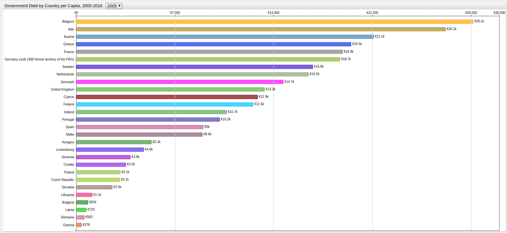
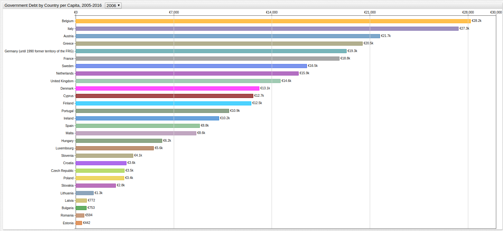
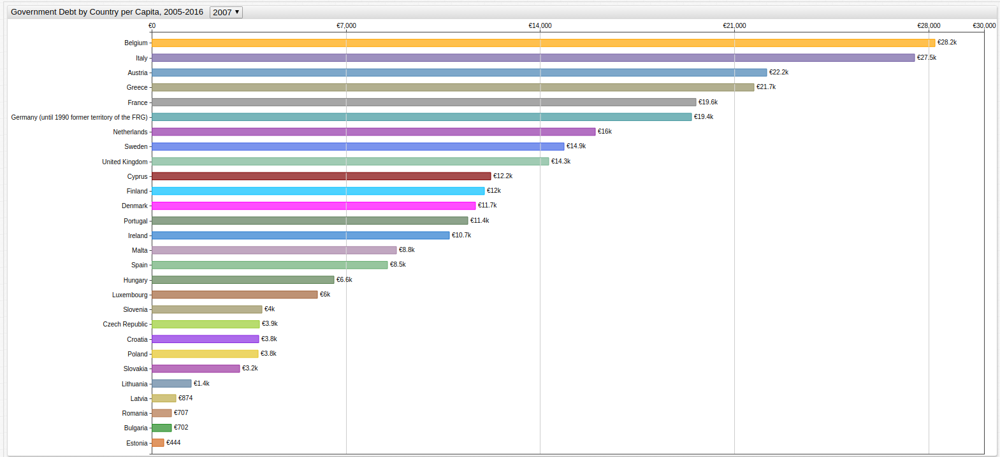
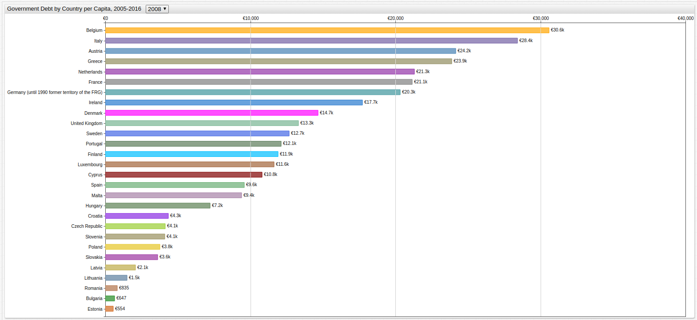
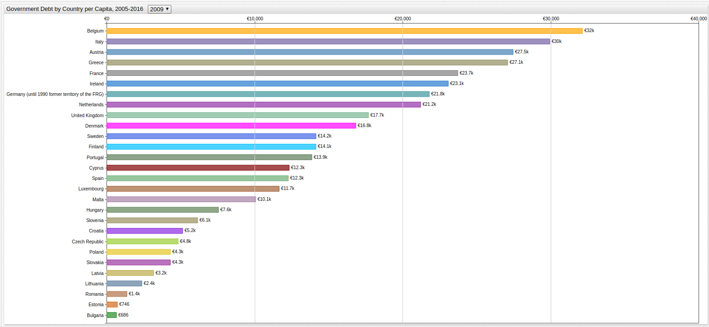
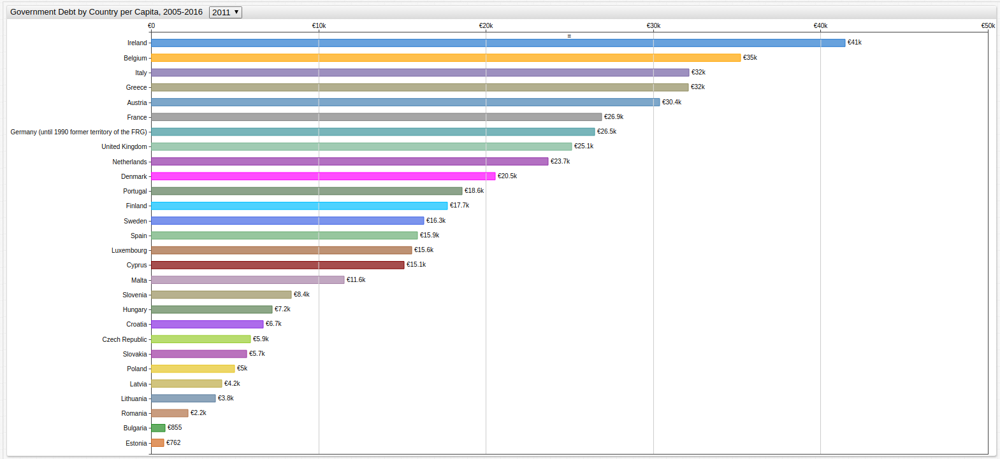
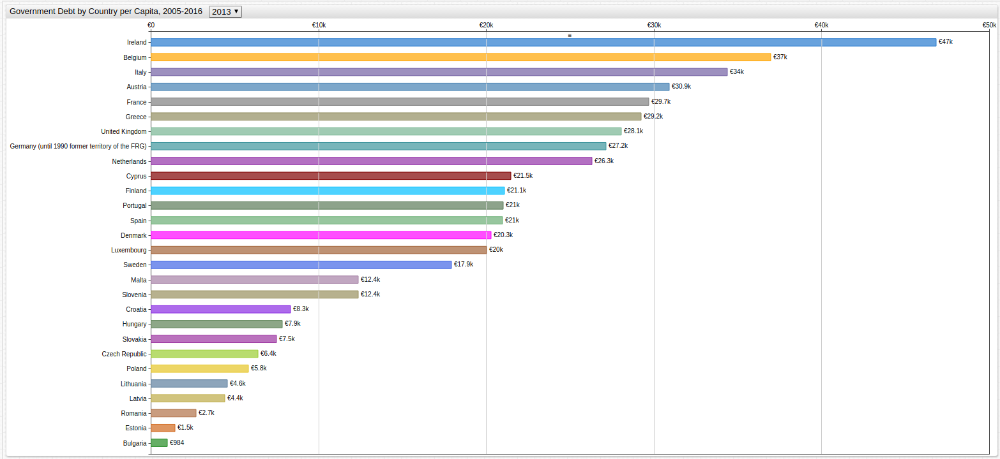
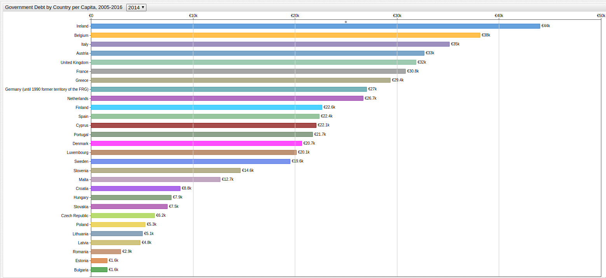
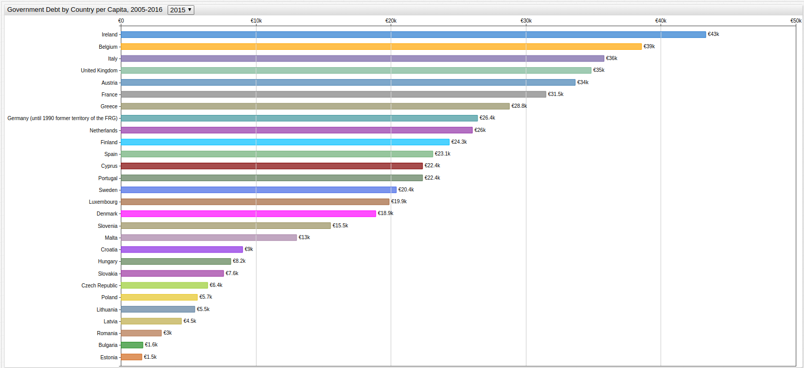
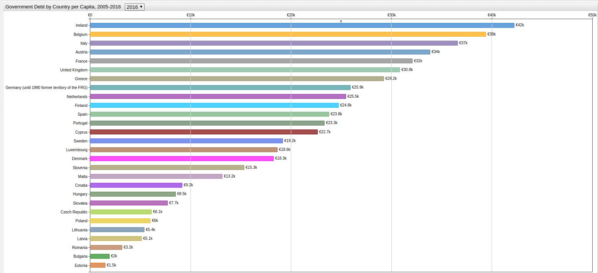

# European Union Debt by Country Per Capita (2005-2016)

Debt Data Source: [EuroStat](http://ec.europa.eu/eurostat/tgm/table.do?tab=table&init=1&language=en&pcode=teina225&plugin=1)

Population Data Source: [EuroStat](http://ec.europa.eu/eurostat/web/population-demography-migration-projections/population-data)

Visualization Tool: [ChartLab](https://apps.axibase.com/chartlab)

Structured Query Language: [SQL Console](https://github.com/axibase/atsd/blob/master/sql/README.md) in [Axibase Time Series Database](https://axibase.com/products/axibase-time-series-database/)

This entry is an expansion of an earlier entry titled [European Union Debt by Country](../EU_Debt/README.md).

## Year Index

Per capita debt indexed by country and year from 2005 to 2016.

* [2005](#2005)
* [2006](#2006)
* [2007](#2007)
* [2008](#2008)
* [2009](#2009)
* [2010](#2010)
* [2011](#2011)
* [2012](#2012)
* [2013](#2013)
* [2014](#2014)
* [2015](#2015)
* [2016](#2016)
* [Per Capita Debt Growth (2006-2016)](#debt-growth)

### 2005



[](https://apps.axibase.com/chartlab/f78f99c7/#fullscreen)

```sql
SELECT SUBSTR(debt.tags.geo, 1, locate('(', debt.tags.geo)-1) AS "Country",
  ROUND(debt.value/pop.value*1000000, -2) AS "Per Capita Debt (Euro)"
FROM government_consolidated_gross_debt AS debt
  JOIN "average_population_-_total" AS pop
  ON debt.entity = pop.entity AND debt.time = pop.time AND debt.tags = pop.tags
WHERE date_format(time, 'yyyy') = 2005
  AND debt.entity = 'eurostat'
  AND debt.tags.geo NOT LIKE 'Euro%'
ORDER BY debt.tags.geo
```

| Country        | Per Capita Debt (Euro) |
|----------------|------------------------|
| Austria        | 21100                  |
| Belgium        | 28100                  |
| Bulgaria       | 800                    |
| Croatia        | 3500                   |
| Cyprus         | 12900                  |
| Czech Republic | 3100                   |
| Denmark        | 14700                  |
| Estonia        | 400                    |
| Finland        | 12500                  |
| France         | 18900                  |
| Germany        | 18700                  |
| Greece         | 19500                  |
| Hungary        | 5300                   |
| Ireland        | 10700                  |
| Italy          | 26200                  |
| Latvia         | 700                    |
| Lithuania      | 1100                   |
| Luxembourg     | 4800                   |
| Malta          | 8900                   |
| Netherlands    | 16500                  |
| Poland         | 3100                   |
| Portugal       | 10200                  |
| Romania        | 600                    |
| Slovakia       | 2500                   |
| Slovenia       | 3800                   |
| Spain          | 9000                   |
| Sweden         | 16800                  |
| United Kingdom | 13300                  |

* Return to the [Index](#year-index)

### 2006



[](https://apps.axibase.com/chartlab/f78f99c7/2/#fullscreen)

```sql
SELECT SUBSTR(debt.tags.geo, 1, locate('(', debt.tags.geo)-1) AS "Country",
  ROUND(debt.value/pop.value*1000000, -2) AS "Per Capita Debt (Euro)"
FROM government_consolidated_gross_debt AS debt
  JOIN "average_population_-_total" AS pop
  ON debt.entity = pop.entity AND debt.time = pop.time AND debt.tags = pop.tags
WHERE date_format(time, 'yyyy') = 2006
  AND debt.entity = 'eurostat'
  AND debt.tags.geo NOT LIKE 'Euro%'
ORDER BY debt.tags.geo
```

| Country        | Per Capita Debt (Euro) |
|----------------|------------------------|
| Austria        | 21700                  |
| Belgium        | 28200                  |
| Bulgaria       | 800                    |
| Croatia        | 3600                   |
| Cyprus         | 12700                  |
| Czech Republic | 3500                   |
| Denmark        | 13100                  |
| Estonia        | 400                    |
| Finland        | 12500                  |
| France         | 18800                  |
| Germany        | 19300                  |
| Greece         | 20500                  |
| Hungary        | 6200                   |
| Ireland        | 10200                  |
| Italy          | 27300                  |
| Latvia         | 800                    |
| Lithuania      | 1300                   |
| Luxembourg     | 5600                   |
| Malta          | 8600                   |
| Netherlands    | 15900                  |
| Poland         | 3400                   |
| Portugal       | 10900                  |
| Romania        | 600                    |
| Slovakia       | 2800                   |
| Slovenia       | 4100                   |
| Spain          | 8800                   |
| Sweden         | 16500                  |
| United Kingdom | 14600                  |

* Return to the [Index](#year-index)

### 2007



[](https://apps.axibase.com/chartlab/f78f99c7/3/#fullscreen)

```sql
SELECT SUBSTR(debt.tags.geo, 1, locate('(', debt.tags.geo)-1) AS "Country",
  ROUND(debt.value/pop.value*1000000, -2) AS "Per Capita Debt (Euro)"
FROM government_consolidated_gross_debt AS debt
  JOIN "average_population_-_total" AS pop
  ON debt.entity = pop.entity AND debt.time = pop.time AND debt.tags = pop.tags
WHERE date_format(time, 'yyyy') = 2007
  AND debt.entity = 'eurostat'
  AND debt.tags.geo NOT LIKE 'Euro%'
ORDER BY debt.tags.geo
```

| Country        | Per Capita Debt (Euro) |
|----------------|------------------------|
| Austria        | 22200                  |
| Belgium        | 28200                  |
| Bulgaria       | 700                    |
| Croatia        | 3800                   |
| Cyprus         | 12200                  |
| Czech Republic | 3900                   |
| Denmark        | 11700                  |
| Estonia        | 400                    |
| Finland        | 12000                  |
| France         | 19600                  |
| Germany        | 19400                  |
| Greece         | 21700                  |
| Hungary        | 6600                   |
| Ireland        | 10700                  |
| Italy          | 27500                  |
| Latvia         | 900                    |
| Lithuania      | 1400                   |
| Luxembourg     | 6000                   |
| Malta          | 8800                   |
| Netherlands    | 16000                  |
| Poland         | 3800                   |
| Portugal       | 11400                  |
| Romania        | 700                    |
| Slovakia       | 3200                   |
| Slovenia       | 4000                   |
| Spain          | 8500                   |
| Sweden         | 14900                  |
| United Kingdom | 14300                  |

* Return to the [Index](#year-index)

### 2008



[](https://apps.axibase.com/chartlab/f78f99c7/4/#fullscreen)

```sql
SELECT SUBSTR(debt.tags.geo, 1, locate('(', debt.tags.geo)-1) AS "Country",
  ROUND(debt.value/pop.value*1000000, -2) AS "Per Capita Debt (Euro)"
FROM government_consolidated_gross_debt AS debt
  JOIN "average_population_-_total" AS pop
  ON debt.entity = pop.entity AND debt.time = pop.time AND debt.tags = pop.tags
WHERE date_format(time, 'yyyy') = 2008
  AND debt.entity = 'eurostat'
  AND debt.tags.geo NOT LIKE 'Euro%'
ORDER BY debt.tags.geo
```

| Country        | Per Capita Debt (Euro) |
|----------------|------------------------|
| Austria        | 24200                  |
| Belgium        | 30600                  |
| Bulgaria       | 600                    |
| Croatia        | 4300                   |
| Cyprus         | 10800                  |
| Czech Republic | 4100                   |
| Denmark        | 14700                  |
| Estonia        | 600                    |
| Finland        | 11900                  |
| France         | 21100                  |
| Germany        | 20300                  |
| Greece         | 23900                  |
| Hungary        | 7200                   |
| Ireland        | 17700                  |
| Italy          | 28400                  |
| Latvia         | 2100                   |
| Lithuania      | 1500                   |
| Luxembourg     | 11600                  |
| Malta          | 9400                   |
| Netherlands    | 21300                  |
| Poland         | 3800                   |
| Portugal       | 12100                  |
| Romania        | 800                    |
| Slovakia       | 3600                   |
| Slovenia       | 4100                   |
| Spain          | 9600                   |
| Sweden         | 12700                  |
| United Kingdom | 13300                  |

* Return to the [Index](#year-index)

### 2009



[](https://apps.axibase.com/chartlab/f78f99c7/5/#fullscreen)

```sql
SELECT SUBSTR(debt.tags.geo, 1, locate('(', debt.tags.geo)-1) AS "Country",
  ROUND(debt.value/pop.value*1000000, -2) AS "Per Capita Debt (Euro)"
FROM government_consolidated_gross_debt AS debt
  JOIN "average_population_-_total" AS pop
  ON debt.entity = pop.entity AND debt.time = pop.time AND debt.tags = pop.tags
WHERE date_format(time, 'yyyy') = 2009
  AND debt.entity = 'eurostat'
  AND debt.tags.geo NOT LIKE 'Euro%'
ORDER BY debt.tags.geo
```

| Country        | Per Capita Debt (Euro) |
|----------------|------------------------|
| Austria        | 27500                  |
| Belgium        | 32200                  |
| Bulgaria       | 700                    |
| Croatia        | 5200                   |
| Cyprus         | 12300                  |
| Czech Republic | 4800                   |
| Denmark        | 16800                  |
| Estonia        | 700                    |
| Finland        | 14100                  |
| France         | 23700                  |
| Germany        | 21800                  |
| Greece         | 27100                  |
| Hungary        | 7600                   |
| Ireland        | 23100                  |
| Italy          | 30000                  |
| Latvia         | 3200                   |
| Lithuania      | 2400                   |
| Luxembourg     | 11700                  |
| Malta          | 10100                  |
| Netherlands    | 21200                  |
| Poland         | 4300                   |
| Portugal       | 13900                  |
| Romania        | 1400                   |
| Slovakia       | 4300                   |
| Slovenia       | 6100                   |
| Spain          | 12300                  |
| Sweden         | 14200                  |
| United Kingdom | 17700                  |

* Return to the [Index](#year-index)

### 2010


[](https://apps.axibase.com/chartlab/f78f99c7/6/#fullscreen)

```sql
SELECT SUBSTR(debt.tags.geo, 1, locate('(', debt.tags.geo)-1) AS "Country",
  ROUND(debt.value/pop.value*1000000, -2) AS "Per Capita Debt (Euro)"
FROM government_consolidated_gross_debt AS debt
  JOIN "average_population_-_total" AS pop
  ON debt.entity = pop.entity AND debt.time = pop.time AND debt.tags = pop.tags
WHERE date_format(time, 'yyyy') = 2010
  AND debt.entity = 'eurostat'
  AND debt.tags.geo NOT LIKE 'Euro%'
ORDER BY debt.tags.geo
```

| Country        | Per Capita Debt (Euro) |
|----------------|------------------------|
| Austria        | 29200                  |
| Belgium        | 33400                  |
| Bulgaria       | 800                    |
| Croatia        | 6000                   |
| Cyprus         | 13000                  |
| Czech Republic | 5700                   |
| Denmark        | 18700                  |
| Estonia        | 700                    |
| Finland        | 16400                  |
| France         | 25200                  |
| Germany        | 25500                  |
| Greece         | 29700                  |
| Hungary        | 7800                   |
| Ireland        | 31600                  |
| Italy          | 31200                  |
| Latvia         | 4000                   |
| Lithuania      | 3300                   |
| Luxembourg     | 15700                  |
| Malta          | 10800                  |
| Netherlands    | 22600                  |
| Poland         | 5100                   |
| Portugal       | 16400                  |
| Romania        | 1900                   |
| Slovakia       | 5200                   |
| Slovenia       | 6800                   |
| Spain          | 14000                  |
| Sweden         | 16000                  |
| United Kingdom | 22100                  |

* Return to the [Index](#year-index)

### 2011



[](https://apps.axibase.com/chartlab/f78f99c7/7/#fullscreen)

```sql
SELECT SUBSTR(debt.tags.geo, 1, locate('(', debt.tags.geo)-1) AS "Country",
  ROUND(debt.value/pop.value*1000000, -2) AS "Per Capita Debt (Euro)"
FROM government_consolidated_gross_debt AS debt
  JOIN "average_population_-_total" AS pop
  ON debt.entity = pop.entity AND debt.time = pop.time AND debt.tags = pop.tags
WHERE date_format(time, 'yyyy') = 2011
  AND debt.entity = 'eurostat'
  AND debt.tags.geo NOT LIKE 'Euro%'
ORDER BY debt.tags.geo
```

| Country        | Per Capita Debt (Euro) |
|----------------|------------------------|
| Austria        | 30400                  |
| Belgium        | 35200                  |
| Bulgaria       | 900                    |
| Croatia        | 6700                   |
| Cyprus         | 15100                  |
| Czech Republic | 5900                   |
| Denmark        | 20500                  |
| Estonia        | 800                    |
| Finland        | 17700                  |
| France         | 26900                  |
| Germany        | 26500                  |
| Greece         | 32100                  |
| Hungary        | 7200                   |
| Ireland        | 41500                  |
| Italy          | 32100                  |
| Latvia         | 4200                   |
| Lithuania      | 3800                   |
| Luxembourg     | 15600                  |
| Malta          | 11600                  |
| Netherlands    | 23700                  |
| Poland         | 5000                   |
| Portugal       | 18600                  |
| Romania        | 2200                   |
| Slovakia       | 5700                   |
| Slovenia       | 8400                   |
| Spain          | 15900                  |
| Sweden         | 16300                  |
| United Kingdom | 25100                  |

* Return to the [Index](#year-index)

### 2012


[](https://apps.axibase.com/chartlab/f78f99c7/8/#fullscreen)

```sql
SELECT SUBSTR(debt.tags.geo, 1, locate('(', debt.tags.geo)-1) AS "Country",
  ROUND(debt.value/pop.value*1000000, -2) AS "Per Capita Debt (Euro)"
FROM government_consolidated_gross_debt AS debt
  JOIN "average_population_-_total" AS pop
  ON debt.entity = pop.entity AND debt.time = pop.time AND debt.tags = pop.tags
WHERE date_format(time, 'yyyy') = 2012
  AND debt.entity = 'eurostat'
  AND debt.tags.geo NOT LIKE 'Euro%'
ORDER BY debt.tags.geo
```

| Country        | Per Capita Debt (Euro) |
|----------------|------------------------|
| Austria        | 30900                  |
| Belgium        | 36300                  |
| Bulgaria       | 1000                   |
| Croatia        | 7200                   |
| Cyprus         | 17900                  |
| Czech Republic | 6800                   |
| Denmark        | 20400                  |
| Estonia        | 1300                   |
| Finland        | 19900                  |
| France         | 28600                  |
| Germany        | 27400                  |
| Greece         | 27600                  |
| Hungary        | 7700                   |
| Ireland        | 45800                  |
| Italy          | 33400                  |
| Latvia         | 4500                   |
| Lithuania      | 4400                   |
| Luxembourg     | 18000                  |
| Malta          | 11600                  |
| Netherlands    | 25600                  |
| Poland         | 5600                   |
| Portugal       | 20200                  |
| Romania        | 2500                   |
| Slovakia       | 7000                   |
| Slovenia       | 9400                   |
| Spain          | 19100                  |
| Sweden         | 17000                  |
| United Kingdom | 27400                  |

* Return to the [Index](#year-index)

### 2013



[](https://apps.axibase.com/chartlab/f78f99c7/9/#fullscreen)

```sql
SELECT SUBSTR(debt.tags.geo, 1, locate('(', debt.tags.geo)-1) AS "Country",
  ROUND(debt.value/pop.value*1000000, -2) AS "Per Capita Debt (Euro)"
FROM government_consolidated_gross_debt AS debt
  JOIN "average_population_-_total" AS pop
  ON debt.entity = pop.entity AND debt.time = pop.time AND debt.tags = pop.tags
WHERE date_format(time, 'yyyy') = 2013
  AND debt.entity = 'eurostat'
  AND debt.tags.geo NOT LIKE 'Euro%'
ORDER BY debt.tags.geo
```

| Country        | Per Capita Debt (Euro) |
|----------------|------------------------|
| Austria        | 30900                  |
| Belgium        | 37000                  |
| Bulgaria       | 1000                   |
| Croatia        | 8300                   |
| Cyprus         | 21500                  |
| Czech Republic | 6400                   |
| Denmark        | 20300                  |
| Estonia        | 1500                   |
| Finland        | 21100                  |
| France         | 29700                  |
| Germany        | 27200                  |
| Greece         | 29200                  |
| Hungary        | 7900                   |
| Ireland        | 46800                  |
| Italy          | 34400                  |
| Latvia         | 4400                   |
| Lithuania      | 4600                   |
| Luxembourg     | 20000                  |
| Malta          | 12400                  |
| Netherlands    | 26300                  |
| Poland         | 5800                   |
| Portugal       | 21000                  |
| Romania        | 2700                   |
| Slovakia       | 7500                   |
| Slovenia       | 12400                  |
| Spain          | 21000                  |
| Sweden         | 17900                  |
| United Kingdom | 28100                  |

* Return to the [Index](#year-index)

### 2014



[](https://apps.axibase.com/chartlab/f78f99c7/10/#fullscreen)

```sql
SELECT SUBSTR(debt.tags.geo, 1, locate('(', debt.tags.geo)-1) AS "Country",
  ROUND(debt.value/pop.value*1000000, -2) AS "Per Capita Debt (Euro)"
FROM government_consolidated_gross_debt AS debt
  JOIN "average_population_-_total" AS pop
  ON debt.entity = pop.entity AND debt.time = pop.time AND debt.tags = pop.tags
WHERE date_format(time, 'yyyy') = 2014
  AND debt.entity = 'eurostat'
  AND debt.tags.geo NOT LIKE 'Euro%'
ORDER BY debt.tags.geo
```

| Country        | Per Capita Debt (Euro) |
|----------------|------------------------|
| Austria        | 32700                  |
| Belgium        | 38100                  |
| Bulgaria       | 1600                   |
| Croatia        | 8800                   |
| Cyprus         | 22100                  |
| Czech Republic | 6200                   |
| Denmark        | 20700                  |
| Estonia        | 1600                   |
| Finland        | 22600                  |
| France         | 30800                  |
| Germany        | 27000                  |
| Greece         | 29400                  |
| Hungary        | 7900                   |
| Ireland        | 44000                  |
| Italy          | 35200                  |
| Latvia         | 4800                   |
| Lithuania      | 5100                   |
| Luxembourg     | 20100                  |
| Malta          | 12700                  |
| Netherlands    | 26700                  |
| Poland         | 5300                   |
| Portugal       | 21700                  |
| Romania        | 2900                   |
| Slovakia       | 7500                   |
| Slovenia       | 14600                  |
| Spain          | 22400                  |
| Sweden         | 19600                  |
| United Kingdom | 31900                  |

* Return to the [Index](#year-index)

### 2015



[](https://apps.axibase.com/chartlab/f78f99c7/11/#fullscreen)

```sql
SELECT SUBSTR(debt.tags.geo, 1, locate('(', debt.tags.geo)-1) AS "Country",
  ROUND(debt.value/pop.value*1000000, -2) AS "Per Capita Debt (Euro)"
FROM government_consolidated_gross_debt AS debt
  JOIN "average_population_-_total" AS pop
  ON debt.entity = pop.entity AND debt.time = pop.time AND debt.tags = pop.tags
WHERE date_format(time, 'yyyy') = 2015
  AND debt.entity = 'eurostat'
  AND debt.tags.geo NOT LIKE 'Euro%'
ORDER BY debt.tags.geo
```

| Country        | Per Capita Debt (Euro) |
|----------------|------------------------|
| Austria        | 33600                  |
| Belgium        | 38600                  |
| Bulgaria       | 1600                   |
| Croatia        | 9000                   |
| Cyprus         | 22400                  |
| Czech Republic | 6400                   |
| Denmark        | 18900                  |
| Estonia        | 1500                   |
| Finland        | 24300                  |
| France         | 31500                  |
| Germany        | 26400                  |
| Greece         | 28800                  |
| Hungary        | 8200                   |
| Ireland        | 43300                  |
| Italy          | 35800                  |
| Latvia         | 4500                   |
| Lithuania      | 5500                   |
| Luxembourg     | 19900                  |
| Malta          | 13000                  |
| Netherlands    | 26000                  |
| Poland         | 5700                   |
| Portugal       | 22400                  |
| Romania        | 3000                   |
| Slovakia       | 7600                   |
| Slovenia       | 15500                  |
| Spain          | 23100                  |
| Sweden         | 20400                  |
| United Kingdom | 34900                  |

* Return to the [Index](#year-index)

### 2016



```sql
SELECT SUBSTR(debt.tags.geo, 1, locate('(', debt.tags.geo)-1) AS "Country",
  ROUND(debt.value/pop.value*1000000, -2) AS "Per Capita Debt (Euro)"
FROM government_consolidated_gross_debt AS debt
  JOIN "average_population_-_total" AS pop
  ON debt.entity = pop.entity AND debt.time = pop.time AND debt.tags = pop.tags
WHERE date_format(time, 'yyyy') = 2016
  AND debt.entity = 'eurostat'
  AND debt.tags.geo NOT LIKE 'Euro%'
ORDER BY debt.tags.geo
```

| Country        | Per Capita Debt (Euro) |
|----------------|------------------------|
| Austria        | 33900                  |
| Belgium        | 39400                  |
| Bulgaria       | 2000                   |
| Croatia        | 9200                   |
| Cyprus         | 22700                  |
| Czech Republic | 6100                   |
| Denmark        | 18300                  |
| Estonia        | 1500                   |
| Finland        | 24800                  |
| France         | 32100                  |
| Germany        | 25900                  |
| Greece         | 29200                  |
| Hungary        | 8500                   |
| Ireland        | 42200                  |
| Italy          | 36600                  |
| Latvia         | 5100                   |
| Lithuania      | 5400                   |
| Luxembourg     | 18600                  |
| Malta          | 13200                  |
| Netherlands    | 25500                  |
| Poland         | 6000                   |
| Portugal       | 23300                  |
| Romania        | 3200                   |
| Slovakia       | 7700                   |
| Slovenia       | 15300                  |
| Spain          | 23800                  |
| Sweden         | 19200                  |
| United Kingdom | 30800                  |

* Return to the [Index](#year-index)

### Debt Growth

Per capita debt growth indexed by country from 2006 to 2016.


[](https://apps.axibase.com/chartlab/d38e750e/6/#fullscreen)

```sql
SELECT SUBSTR(debt.tags.geo, 1, locate('(', debt.tags.geo)-1) AS Country,
  ROUND(FIRST(debt.value)/FIRST(pop.value)*1000000, -2) AS "2006, €",
  ROUND(LAST(debt.value)/LAST(pop.value)*1000000, -2) AS "2016, €",
  ROUND((LAST(debt.value)/LAST(pop.value) - FIRST(debt.value)/FIRST(pop.value))*1000000, -2) AS "New Debt, €",
  ROUND(100*((LAST(debt.value)/LAST(pop.value))/(FIRST(debt.value)/FIRST(pop.value))-1)) AS "New Debt, %"
FROM government_consolidated_gross_debt AS debt
  JOIN "average_population_-_total" AS pop
  ON debt.entity = pop.entity AND debt.time = pop.time AND debt.tags = pop.tags
WHERE datetime BETWEEN '2006-01-01T00:00:00Z' AND '2016-01-01T00:00:00Z'
  AND debt.entity = 'eurostat'
  AND Country NOT LIKE 'Euro%'
  GROUP BY debt.entity, Country
ORDER BY Country
```

| Country        | 2006, € | 2016, € | New Debt, € | New Debt, % |
|----------------|---------|---------|-------------|-------------|
| Austria        | 21700   | 33900   | 12200       | 56          |
| Belgium        | 28200   | 39400   | 11200       | 40          |
| Bulgaria       | 800     | 2000    | 1200        | 160         |
| Croatia        | 3600    | 9200    | 5600        | 154         |
| Cyprus         | 12700   | 22700   | 10000       | 79          |
| Czech Republic | 3500    | 6100    | 2700        | 77          |
| Denmark        | 13100   | 18300   | 5200        | 40          |
| Estonia        | 400     | 1500    | 1100        | 241         |
| Finland        | 12500   | 24800   | 12200       | 98          |
| France         | 18800   | 32100   | 13300       | 71          |
| Germany        | 19300   | 25900   | 6600        | 34          |
| Greece         | 20500   | 29200   | 8800        | 43          |
| Hungary        | 6200    | 8500    | 2400        | 38          |
| Ireland        | 10200   | 42200   | 32000       | 313         |
| Italy          | 27300   | 36600   | 9300        | 34          |
| Latvia         | 800     | 5100    | 4400        | 564         |
| Lithuania      | 1300    | 5400    | 4100        | 327         |
| Luxembourg     | 5600    | 18600   | 13100       | 235         |
| Malta          | 8600    | 13200   | 4600        | 54          |
| Netherlands    | 15900   | 25500   | 9600        | 60          |
| Poland         | 3400    | 6000    | 2600        | 75          |
| Portugal       | 10900   | 23300   | 12400       | 114         |
| Romania        | 600     | 3200    | 2600        | 439         |
| Slovakia       | 2800    | 7700    | 4900        | 173         |
| Slovenia       | 4100    | 15300   | 11300       | 275         |
| Spain          | 8800    | 23800   | 15000       | 170         |
| Sweden         | 16500   | 19200   | 2700        | 17          |
| United Kingdom | 14600   | 30800   | 16200       | 111         |

* Return to the [Index](#year-index)
