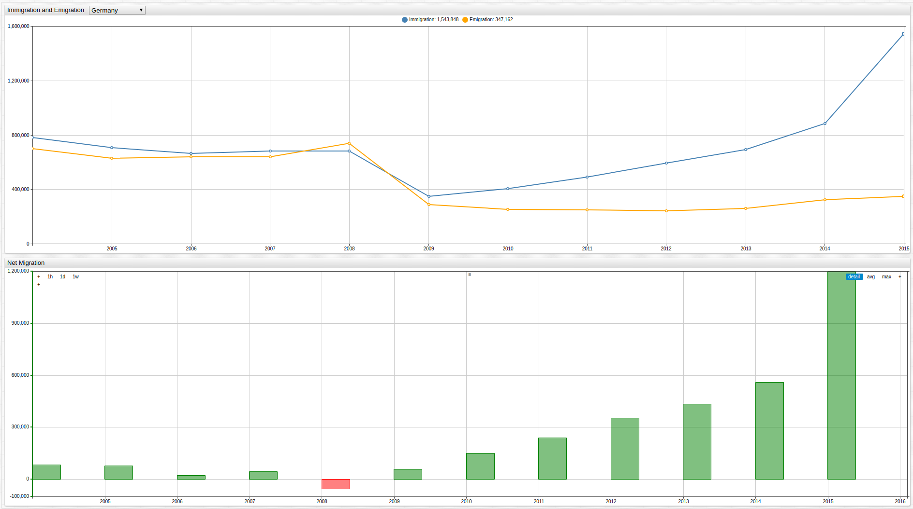

# European Union Net Migration by Country

_Source_: EuroStat [Immigration](http://ec.europa.eu/eurostat/tgm/table.do?tab=table&init=1&language=en&pcode=tps00176&plugin=1) and [Emigration](http://ec.europa.eu/eurostat/tgm/table.do?tab=table&init=1&language=en&pcode=tps00177&plugin=1) Data

_Visualization_: [ChartLab](https://apps.axibase.com/chartlab)

_Database_: [Axibase Time Series Database](https://axibase.com/docs/atsd/)

Annual data recording immigration and emigration from member countries of the European Union, sorted by nation and shown alongside
net migration data.

> Use the dropdown menu to navigate between countries.

Additional European Union datasets:

* [European Union Debt by Country](../EU_Debt/README.md)
* [European Union Per Capita Debt by Country](../EU_Debt_percap/README.md)
