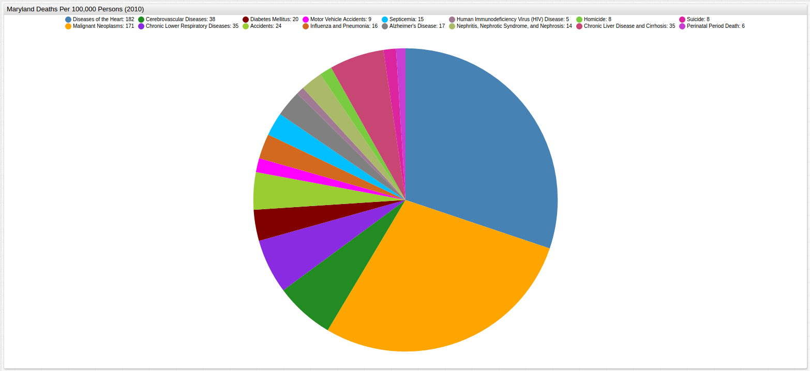

Maryland Death Statistics (1993-2015)
===

[Source Dataset](https://github.com/axibase/open-data-catalog/blob/master/datasets/i4x2-3kc7.md)

[SQL Console](https://github.com/axibase/atsd/blob/master/sql/README.md) from [Axibase Time Series Database](https://axibase.com/products/axibase-time-series-database/)

[ChartLab](https://apps.axibase.com/chartlab)

### Total Maryland Deaths Per 100,000 Persons (1992 - 2011)


[](https://apps.axibase.com/chartlab/bb18ecdc/5/#fullscreen)

```sql
SELECT date_format(time, 'yyyy') AS 'Year', value as 'Total Deaths per 100,000 Persons'
  FROM atsd_series
WHERE entity = 'i4x2-3kc7' AND metric like ('cause.of.death.*') AND metric.label like ('All Causes')
  GROUP BY date_format(time, 'yyyy'), metric, value
ORDER BY date_format(time, 'yyyy')
```

```ls
| Year | Total Deaths per 100,000 Persons |
|------|----------------------------------|
| 1992 | 943                              |
| 1993 | 960                              |
| 1994 | 954                              |
| 1995 | 952                              |
| 1996 | 940                              |
| 1997 | 917                              |
| 1998 | 905                              |
| 1999 | 907                              |
| 2000 | 906                              |
| 2001 | 890                              |
| 2002 | 863                              |
| 2003 | 850                              |
| 2004 | 805                              |
| 2005 | 794                              |
| 2006 | 791                              |
| 2007 | 780                              |
| 2008 | 771                              |
| 2009 | 761                              |
| 2010 | 727                              |
| 2011 | 714                              |
| 2012 | 703                              |
| 2013 | 706                              |
| 2014 | 697                              |
| 2015 | 706                              |
```


### Maryland Deaths Per 100,000 Persons by Cause (1992 - 2011)


[](https://apps.axibase.com/chartlab/bb18ecdc/6/#fullscreen)

```sql
SELECT metric.label AS 'Cause of Death', sum(value) AS 'Total'
  FROM atsd_series
WHERE entity = 'i4x2-3kc7' AND metric like ('cause.of.death.*') AND metric.label != ('All Causes')
  GROUP BY metric
ORDER BY metric.label
```

```ls
| Cause of Death                                         | Total |
|--------------------------------------------------------|-------|
| Accidents                                              | 640   |
| Alzheimer's Disease                                    | 387   |
| Assault (Homicide)                                     | 238   |
| Cerebrovascular Diseases                               | 1223  |
| Certain Conditions Originating in the Perinatal Period | 160   |
| Chronic Liver Disease and Cirrhosis                    | 192   |
| Chronic Lower Respiratory Diseases                     | 887   |
| Diabetes Mellitus                                      | 617   |
| Diseases of the Heart                                  | 5457  |
| Human Immunodeficiency Virus (HIV) Disease             | 249   |
| Influenza and Pneumonia                                | 492   |
| Intentional Self-Harm (Suicide)                        | 219   |
| Malignant Neoplasms                                    | 4697  |
| Motor Vehicle Accidents                                | 258   |
| Nephritis, Nephrotic Syndrome, and Nephrosis           | 308   |
| Septicemia                                             | 422   |
```

### Total Deaths Per 100,000 Persons by Year

Querying these data for death information by cause and year is shown below.


### Total Deaths Per 100,000 Persons by Cause and Year (1992, 1998, 2004, 2010)


[](https://apps.axibase.com/chartlab/bb18ecdc/7/#fullscreen)

##### Total Deaths Per 100,000 Persons (1992)

```sql
SELECT date_format(time, 'yyyy') AS 'Year', metric.label AS 'Cause of Death', value AS 'Total'
  FROM atsd_series
WHERE entity = 'i4x2-3kc7' AND metric like ('cause.of.death.*') AND metric.label like ('*') and date_format(time, 'yyyy') = '1992' and metric.label != 'All Causes'
  GROUP BY date_format(time, 'yyyy'), metric, value
ORDER BY date_format(time, 'yyyy'), metric.label
```

```ls
| Year | Cause of Death                                         | Total |
|------|--------------------------------------------------------|-------|
| 1992 | Accidents                                              | 27    |
| 1992 | Alzheimer's Disease                                    | 11    |
| 1992 | Assault (Homicide)                                     | 12    |
| 1992 | Cerebrovascular Diseases                               | 58    |
| 1992 | Certain Conditions Originating in the Perinatal Period | 8     |
| 1992 | Chronic Liver Disease and Cirrhosis                    | 9     |
| 1992 | Chronic Lower Respiratory Diseases                     | 38    |
| 1992 | Diabetes Mellitus                                      | 27    |
| 1992 | Diseases of the Heart                                  | 298   |
| 1992 | Human Immunodeficiency Virus (HIV) Disease             | 16    |
| 1992 | Influenza and Pneumonia                                | 21    |
| 1992 | Intentional Self-Harm (Suicide)                        | 9     |
| 1992 | Malignant Neoplasms                                    | 237   |
| 1992 | Motor Vehicle Accidents                                | 11    |
| 1992 | Nephritis, Nephrotic Syndrome, and Nephrosis           | 15    |
| 1992 | Septicemia                                             | 18    |
```


##### Total Deaths Per 100,000 Persons (1998)

```sql
SELECT date_format(time, 'yyyy') AS 'Year', metric.label AS 'Cause of Death', value AS 'Total'
  FROM atsd_series
WHERE entity = 'i4x2-3kc7' AND metric like ('cause.of.death.*') AND metric.label like ('*') and date_format(time, 'yyyy') = '1998' and metric.label != 'All Causes'
  GROUP BY date_format(time, 'yyyy'), metric, value
ORDER BY date_format(time, 'yyyy'), metric.label
```

```ls
| Year | Cause of Death                                         | Total |
|------|--------------------------------------------------------|-------|
| 1998 | Accidents                                              | 28    |
| 1998 | Alzheimer's Disease                                    | 15    |
| 1998 | Assault (Homicide)                                     | 11    |
| 1998 | Cerebrovascular Diseases                               | 62    |
| 1998 | Certain Conditions Originating in the Perinatal Period | 8     |
| 1998 | Chronic Liver Disease and Cirrhosis                    | 9     |
| 1998 | Chronic Lower Respiratory Diseases                     | 39    |
| 1998 | Diabetes Mellitus                                      | 31    |
| 1998 | Diseases of the Heart                                  | 259   |
| 1998 | Human Immunodeficiency Virus (HIV) Disease             | 10    |
| 1998 | Influenza and Pneumonia                                | 26    |
| 1998 | Intentional Self-Harm (Suicide)                        | 10    |
| 1998 | Malignant Neoplasms                                    | 219   |
| 1998 | Motor Vehicle Accidents                                | 10    |
| 1998 | Nephritis, Nephrotic Syndrome, and Nephrosis           | 12    |
| 1998 | Septicemia                                             | 19    |
```


##### Total Deaths Per 100,000 Persons (2004)

```sql
SELECT date_format(time, 'yyyy') AS 'Year', metric.label AS 'Cause of Death', value AS 'Total'
  FROM atsd_series
WHERE entity = 'i4x2-3kc7' AND metric like ('cause.of.death.*') AND metric.label like ('*') and date_format(time, 'yyyy') = '2004' and metric.label != 'All Causes'
  GROUP BY date_format(time, 'yyyy'), metric, value
ORDER BY date_format(time, 'yyyy'), metric.label
```

```ls
| Year | Cause of Death                                         | Total |
|------|--------------------------------------------------------|-------|
| 2004 | Accidents                                              | 26    |
| 2004 | Alzheimer's Disease                                    | 17    |
| 2004 | Assault (Homicide)                                     | 10    |
| 2004 | Cerebrovascular Diseases                               | 51    |
| 2004 | Certain Conditions Originating in the Perinatal Period | 7     |
| 2004 | Chronic Liver Disease and Cirrhosis                    | 7     |
| 2004 | Chronic Lower Respiratory Diseases                     | 36    |
| 2004 | Diabetes Mellitus                                      | 26    |
| 2004 | Diseases of the Heart                                  | 211   |
| 2004 | Human Immunodeficiency Virus (HIV) Disease             | 10    |
| 2004 | Influenza and Pneumonia                                | 21    |
| 2004 | Intentional Self-Harm (Suicide)                        | 9     |
| 2004 | Malignant Neoplasms                                    | 188   |
| 2004 | Motor Vehicle Accidents                                | 12    |
| 2004 | Nephritis, Nephrotic Syndrome, and Nephrosis           | 13    |
| 2004 | Septicemia                                             | 20    |
```


##### Total Deaths Per 100,000 Persons (2010)

```sql
SELECT date_format(time, 'yyyy') AS 'Year', metric.label AS 'Cause of Death', value AS 'Total'
  FROM atsd_series
WHERE entity = 'i4x2-3kc7' AND metric like ('cause.of.death.*') AND metric.label like ('*') and date_format(time, 'yyyy') = '2010' and metric.label != 'All Causes'
  GROUP BY date_format(time, 'yyyy'), metric, value
ORDER BY date_format(time, 'yyyy'), metric.label
```

```ls
| Year | Cause of Death                                         | Total |
|------|--------------------------------------------------------|-------|
| 2010 | Accidents                                              | 24    |
| 2010 | Alzheimer's Disease                                    | 17    |
| 2010 | Assault (Homicide)                                     | 8     |
| 2010 | Cerebrovascular Diseases                               | 38    |
| 2010 | Certain Conditions Originating in the Perinatal Period | 6     |
| 2010 | Chronic Liver Disease and Cirrhosis                    | 7     |
| 2010 | Chronic Lower Respiratory Diseases                     | 35    |
| 2010 | Diabetes Mellitus                                      | 20    |
| 2010 | Diseases of the Heart                                  | 182   |
| 2010 | Human Immunodeficiency Virus (HIV) Disease             | 5     |
| 2010 | Influenza and Pneumonia                                | 16    |
| 2010 | Intentional Self-Harm (Suicide)                        | 8     |
| 2010 | Malignant Neoplasms                                    | 171   |
| 2010 | Motor Vehicle Accidents                                | 9     |
| 2010 | Nephritis, Nephrotic Syndrome, and Nephrosis           | 14    |
| 2010 | Septicemia                                             | 15    |
```


