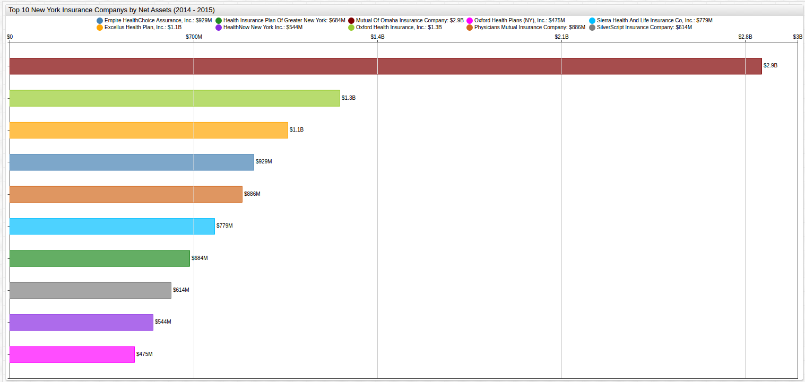
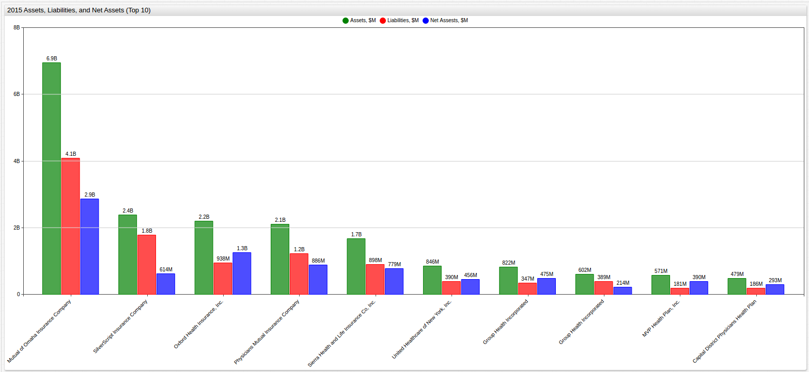
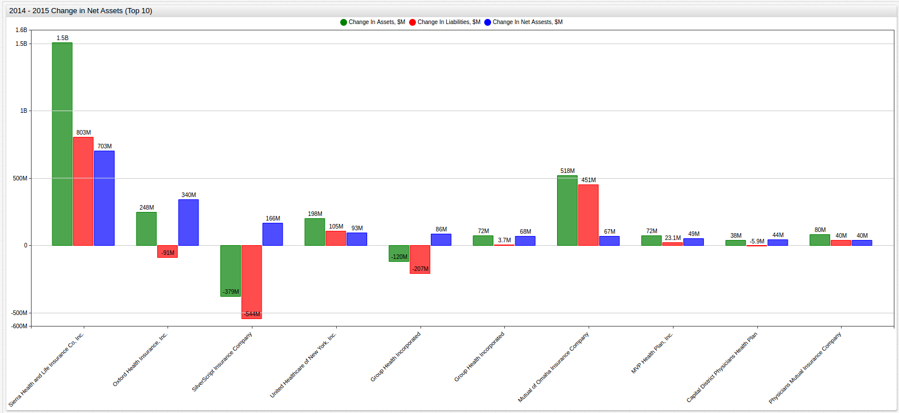

## New York Insurance Company Assets and Liabilities

### References

* [Dataset](https://github.com/axibase/open-data-catalog/blob/master/datasets/xek8-zfrt.md)
* [SQL Syntax](https://github.com/axibase/atsd/tree/master/api/sql) from [Axibase](https://axibase.com)
* Axibase [ChartLab](https://apps.axibase.com/)

### 2015 Insurance Assets (Top 10)

```sql
SELECT tags.company_name AS 'Company', SUM(value)/1000000 AS 'Total Assets, $M'
  FROM assets
WHERE datetime = '2015-01-01T00:00:00Z'
  GROUP BY tags.company_name
ORDER BY 'Total Assets, $M' DESC
  LIMIT 10
```

```ls
| Company                                        | Total Assets, $M | 
|------------------------------------------------|------------------| 
| Mutual of Omaha Insurance Company              | 6945             | 
| Excellus Health Plan, Inc.                     | 3027             | 
| SilverScript Insurance Company                 | 2386             | 
| Empire HealthChoice Assurance, Inc.            | 2379             | 
| Oxford Health Insurance, Inc.                  | 2195             | 
| Physicians Mutual Insurance Company            | 2106             | 
| Sierra Health and Life Insurance Co, Inc.      | 1677             | 
| Health Insurance Plan of Greater New York      | 1644             | 
| Trustmark Insurance Company                    | 1407             | 
| UnitedHealthcare Insurance Company of New York | 1223             | 
```

### 2015 Insurance Liabilities (Top 10)

```sql
SELECT tags.company_name AS 'Company', SUM(value)/1000000 AS 'Total Assets, $M'
  FROM liabilities
WHERE datetime = '2015-01-01T00:00:00Z'
  GROUP BY tags.company_name
ORDER BY 'Total Assets, $M' DESC
  LIMIT 10
```

```ls
| Company                                        | Total Assets, $M | 
|------------------------------------------------|------------------| 
| Mutual of Omaha Insurance Company              | 4082             | 
| Excellus Health Plan, Inc.                     | 1967             | 
| SilverScript Insurance Company                 | 1772             | 
| Empire HealthChoice Assurance, Inc.            | 1450             | 
| Physicians Mutual Insurance Company            | 1221             | 
| Trustmark Insurance Company                    | 1120             | 
| Health Insurance Plan of Greater New York      | 960              | 
| Oxford Health Insurance, Inc.                  | 938              | 
| Sierra Health and Life Insurance Co, Inc.      | 898              | 
| UnitedHealthcare Insurance Company of New York | 749              | 
```

### 2015 Insurance Assets Versus Liabilities (Top 10)

```sql
SELECT a.tags.company_name AS 'Company', SUM(a.value - l.value)/1000000 AS 'Net Assets, $M'
  FROM 'Liabilities' l INNER JOIN 'Assets' a
WHERE datetime = '2015-01-01T00:00:00Z'
  GROUP BY a.tags.company_name
ORDER BY 'Net Assets' DESC
  LIMIT 10
```

```ls
| Company                                   | Net Assets, $M | 
|-------------------------------------------|----------------| 
| Mutual of Omaha Insurance Company         | 2863           | 
| Oxford Health Insurance, Inc.             | 1257           | 
| Excellus Health Plan, Inc.                | 1059           | 
| Empire HealthChoice Assurance, Inc.       | 929            | 
| Physicians Mutual Insurance Company       | 886            | 
| Sierra Health and Life Insurance Co, Inc. | 779            | 
| Health Insurance Plan of Greater New York | 684            | 
| SilverScript Insurance Company            | 614            | 
| HealthNow New York Inc.                   | 544            | 
| Oxford Health Plans (NY), Inc.            | 475            | 
```



[](https://apps.axibase.com/chartlab/3904f832/12/#fullscreen)

#### 2015 New York Insurance Assets Versus Liabilities (Top 10)
 


[](https://apps.axibase.com/chartlab/6402f01c/78/#fullscreen)

### 2014 - 2015 Change in Net Insurance Assets (Top 10)

```sql
SELECT t1.tags.company_name AS 'Company', 
  (LAST(t1.value) - FIRST(t1.value))/1000000 AS 'Change in Assets, $M',
  (LAST(t2.value) - FIRST(t2.value))/1000000 AS 'Change in Liabilities, $M',
  (LAST(t1.value) - FIRST(t1.value) - (LAST(t2.value) - FIRST(t2.value)))/1000000 AS 'Change in Net Assets, $M'
FROM assets t1
  JOIN liabilities t2
GROUP BY t1.tags.company_name
  ORDER BY 'Change in Net Assets, $M' DESC
LIMIT 10
```

```ls
| Company                                   | Change in Assets, $M | Change in Liabilities, $M | Change in Net Assets, $M | 
|-------------------------------------------|----------------------|---------------------------|--------------------------| 
| Sierra Health and Life Insurance Co, Inc. | 1506.6               | 803.2                     | 703.4                    | 
| Oxford Health Insurance, Inc.             | 248.4                | -91.4                     | 339.8                    | 
| SilverScript Insurance Company            | -378.5               | -544.2                    | 165.6                    | 
| Unitedhealthcare of New York, Inc.        | 198.0                | 105.1                     | 92.8                     | 
| Group Health Incorporated                 | -120.3               | -206.7                    | 86.3                     | 
| Oxford Health Plans (NY), Inc.            | 71.7                 | 3.7                       | 68.0                     | 
| Mutual of Omaha Insurance Company         | 518.3                | 451.2                     | 67.1                     | 
| MVP Health Plan, Inc.                     | 72.5                 | 23.1                      | 49.4                     | 
| Capital District Physicians Health Plan   | 38.0                 | -5.9                      | 43.9                     | 
| Physicians Mutual Insurance Company       | 80.0                 | 40.0                      | 40.1                     | 
```



[](https://apps.axibase.com/chartlab/6402f01c/76/#fullscreen)
