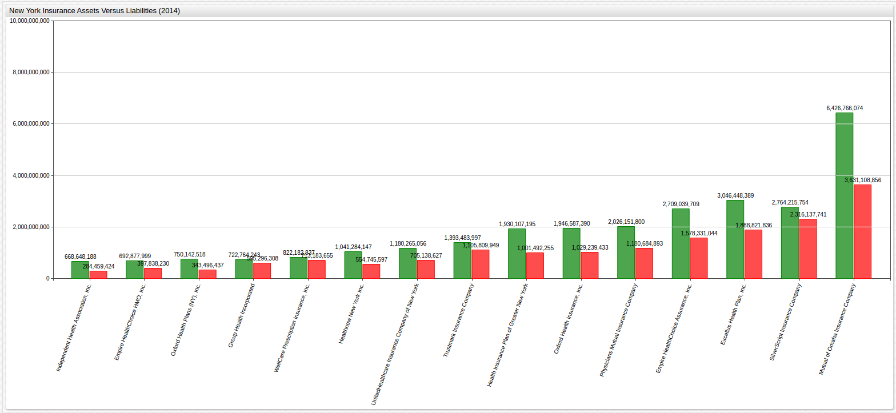
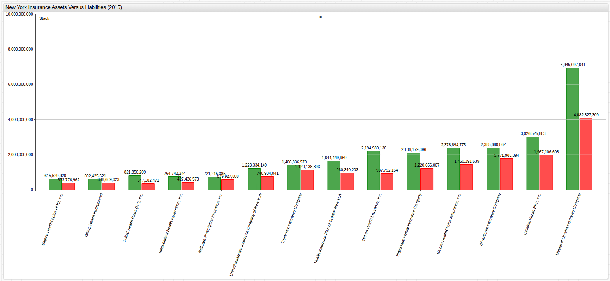
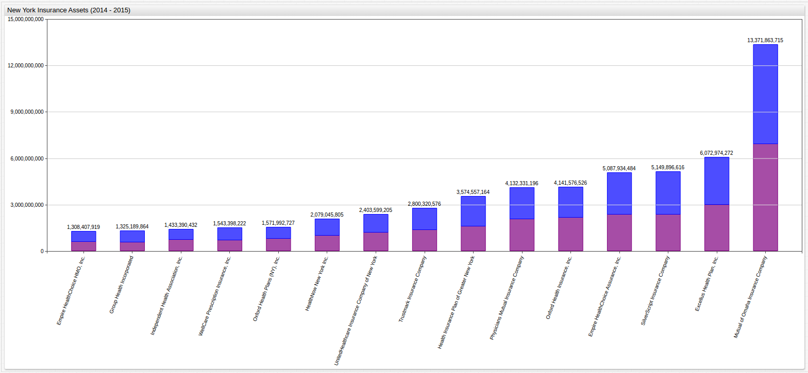
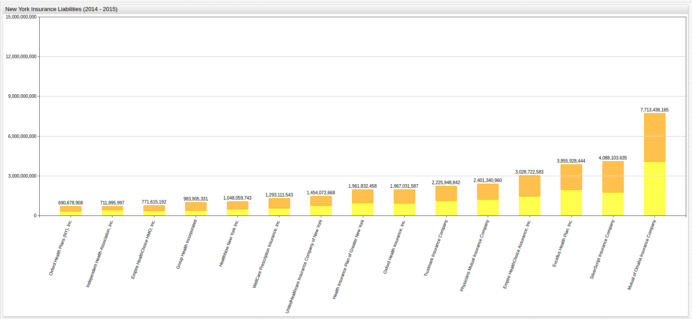

Querying New York Insurance Asset Versus Liability Data
==

[Source Dataset](https://github.com/axibase/open-data-catalog/blob/master/datasets/xek8-zfrt.md)

[SQL Console](https://github.com/axibase/atsd/tree/master/api/sql) from [Axibase](https://axibase.com)

[ChartLab](https://apps.axibase.com/) from [Axibase](https://axibase.com)

### 2014 New York Insurance Assets (Top 15):

```sql
SELECT TAGS.COMPANY_NAME, SUM(VALUE) AS TOTAL
  FROM 'ASSETS'
WHERE DATE_FORMAT(TIME, 'YYYY') = 2014
  GROUP BY TAGS.COMPANY_NAME
ORDER BY TOTAL DESC
  LIMIT 15
  ```
```sql
| tags.COMPANY_NAME                              | TOTAL      | 
|------------------------------------------------|------------| 
| Mutual of Omaha Insurance Company              | 6426766074 | 
| Excellus Health Plan, Inc.                     | 3046448389 | 
| SilverScript Insurance Company                 | 2764215754 | 
| Empire HealthChoice Assurance, Inc.            | 2709039709 | 
| Physicians Mutual Insurance Company            | 2026151800 | 
| Oxford Health Insurance, Inc.                  | 1946587390 | 
| Health Insurance Plan of Greater New York      | 1930107195 | 
| Trustmark Insurance Company                    | 1393483997 | 
| UnitedHealthcare Insurance Company of New York | 1180265056 | 
| Healthnow New York Inc.                        | 1041284147 | 
| WellCare Prescription Insurance, Inc.          | 822182837  | 
| Oxford Health Plans (NY), Inc.                 | 750142518  | 
| Group Health Incorporated                      | 722764243  | 
| Empire HealthChoice HMO, Inc.                  | 692877999  | 
| Independent Health Association, Inc.           | 668648188  | 
```

### 2014 New York Insurance Liabilities (Top 15)

```sql
SELECT TAGS.COMPANY_NAME, SUM(VALUE) AS TOTAL
  FROM 'LIABILITIES'
WHERE DATE_FORMAT(TIME, 'YYYY') = 2014
  GROUP BY TAGS.COMPANY_NAME
ORDER BY TOTAL DESC
  LIMIT 15
```

```sql
| tags.COMPANY_NAME                              | TOTAL      | 
|------------------------------------------------|------------| 
| Mutual of Omaha Insurance Company              | 3631108856 | 
| SilverScript Insurance Company                 | 2316137741 | 
| Excellus Health Plan, Inc.                     | 1888821836 | 
| Empire HealthChoice Assurance, Inc.            | 1578331044 | 
| Physicians Mutual Insurance Company            | 1180684893 | 
| Trustmark Insurance Company                    | 1105809949 | 
| Oxford Health Insurance, Inc.                  | 1029239433 | 
| Health Insurance Plan of Greater New York      | 1001492255 | 
| WellCare Prescription Insurance, Inc.          | 713183655  | 
| UnitedHealthcare Insurance Company of New York | 705138627  | 
| Group Health Incorporated                      | 595296308  | 
| MedAmerica Insurance Company of New York       | 564288632  | 
| Healthnow New York Inc.                        | 554745597  | 
| Envision Insurance Company                     | 477390360  | 
| Empire HealthChoice HMO, Inc.                  | 397838230  | 
```

### 2014 New York Insurance Assets Versus Liabilities (Top 15)

```sql
SELECT a.TAGS.COMPANY_NAME, SUM(a.value - l.value) as 'Net Profit'
  FROM 'LIABILITIES' l INNER JOIN 'ASSETS' a
WHERE DATE_FORMAT(TIME, 'YYYY') = '2014'
  GROUP BY a.TAGS.COMPANY_NAME
ORDER BY 'Net Profit' DESC
  LIMIT 15
```
  
```sql
| a.tags.COMPANY_NAME                                      | Net Profit | 
|----------------------------------------------------------|------------| 
| Mutual of Omaha Insurance Company                        | 2795657218 | 
| Excellus Health Plan, Inc.                               | 1157626553 | 
| Empire HealthChoice Assurance, Inc.                      | 1130708665 | 
| Health Insurance Plan of Greater New York                | 928614940  | 
| Oxford Health Insurance, Inc.                            | 917347957  | 
| Physicians Mutual Insurance Company                      | 845466907  | 
| Healthnow New York Inc.                                  | 486538550  | 
| UnitedHealthcare Insurance Company of New York           | 475126429  | 
| SilverScript Insurance Company                           | 448078013  | 
| Oxford Health Plans (NY), Inc.                           | 406646081  | 
| Independent Health Association, Inc.                     | 384188764  | 
| Unitedhealthcare of New York, Inc.                       | 363008308  | 
| Care Improvement Plus of South Central Insurance Company | 348584843  | 
| MVP Health Plan, Inc.                                    | 340544971  | 
| HealthSpring Life & Health Insurance Company, Inc.       | 327862169  | 
```



[](https://apps.axibase.com/chartlab/6402f01c/28/#fullscreen)

### 2015 New York Insurance Assets (Top 15):
   
```sql
SELECT TAGS.COMPANY_NAME, SUM(VALUE) AS TOTAL
  FROM 'ASSETS'
WHERE DATE_FORMAT(TIME, 'YYYY') = 2015
  GROUP BY TAGS.COMPANY_NAME
ORDER BY TOTAL DESC
  LIMIT 15
```

```sql
| tags.COMPANY_NAME                                        | TOTAL      | 
|----------------------------------------------------------|------------| 
| Mutual of Omaha Insurance Company                        | 6945097641 | 
| Excellus Health Plan, Inc.                               | 3026525883 | 
| SilverScript Insurance Company                           | 2385680862 | 
| Empire HealthChoice Assurance, Inc.                      | 2378894775 | 
| Oxford Health Insurance, Inc.                            | 2194989136 | 
| Physicians Mutual Insurance Company                      | 2106179396 | 
| Sierra Health and Life Insurance Co, Inc.                | 1676627228 | 
| Health Insurance Plan of Greater New York                | 1644449969 | 
| Trustmark Insurance Company                              | 1406836579 | 
| UnitedHealthcare Insurance Company of New York           | 1223334149 | 
| HealthNow New York Inc.                                  | 1037761658 | 
| Care Improvement Plus of South Central Insurance Company | 900901751  | 
| Unitedhealthcare of New York, Inc.                       | 846115374  | 
| Oxford Health Plans (NY), Inc.                           | 821850209  | 
| Independent Health Association, Inc.                     | 764742244  | 
```

### 2015 New York Insurance Liabilities (Top 15)

```sql
SELECT TAGS.COMPANY_NAME, SUM(VALUE) AS TOTAL
  FROM 'LIABILITIES'
WHERE DATE_FORMAT(TIME, 'YYYY') = 2015
  GROUP BY TAGS.COMPANY_NAME
ORDER BY TOTAL DESC
  LIMIT 15
```

```sql
| tags.COMPANY_NAME                                        | TOTAL      | 
|----------------------------------------------------------|------------| 
| Mutual of Omaha Insurance Company                        | 4082327309 | 
| Excellus Health Plan, Inc.                               | 1967106608 | 
| SilverScript Insurance Company                           | 1771965894 | 
| Empire HealthChoice Assurance, Inc.                      | 1450391539 | 
| Physicians Mutual Insurance Company                      | 1220656067 | 
| Trustmark Insurance Company                              | 1120138893 | 
| Health Insurance Plan of Greater New York                | 960340203  | 
| Oxford Health Insurance, Inc.                            | 937792154  | 
| Sierra Health and Life Insurance Co, Inc.                | 897649603  | 
| UnitedHealthcare Insurance Company of New York           | 748934041  | 
| MedAmerica Insurance Company of New York                 | 664486011  | 
| Care Improvement Plus of South Central Insurance Company | 585750014  | 
| WellCare Prescription Insurance, Inc.                    | 579927888  | 
| HealthNow New York Inc.                                  | 493314146  | 
| Independent Health Association, Inc.                     | 427436573  | 
```

### 2015 New York Insurance Assets Versus Liabilities (Top 15)

```sql
SELECT a.TAGS.COMPANY_NAME, SUM(a.value - l.value) as 'NET PROFIT'
  FROM 'LIABILITIES' l INNER JOIN 'ASSETS' a
WHERE DATE_FORMAT(TIME, 'YYYY') = '2015'
  GROUP BY a.TAGS.COMPANY_NAME
ORDER BY 'NET PROFIT' DESC
  LIMIT 15
```

```sql
| a.tags.COMPANY_NAME                                | NET PROFIT | 
|----------------------------------------------------|------------| 
| Mutual of Omaha Insurance Company                  | 2862770332 | 
| Oxford Health Insurance, Inc.                      | 1257196982 | 
| Excellus Health Plan, Inc.                         | 1059419275 | 
| Empire HealthChoice Assurance, Inc.                | 928503236  | 
| Physicians Mutual Insurance Company                | 885523329  | 
| Sierra Health and Life Insurance Co, Inc.          | 778977625  | 
| Health Insurance Plan of Greater New York          | 684109766  | 
| SilverScript Insurance Company                     | 613714968  | 
| HealthNow New York Inc.                            | 544447512  | 
| Oxford Health Plans (NY), Inc.                     | 474667738  | 
| UnitedHealthcare Insurance Company of New York     | 474400108  | 
| Unitedhealthcare of New York, Inc.                 | 455854822  | 
| MVP Health Plan, Inc.                              | 389926723  | 
| Independent Health Association, Inc.               | 337305671  | 
| HealthSpring Life & Health Insurance Company, Inc. | 327376963  | 
```


[](https://apps.axibase.com/chartlab/6402f01c/30/#fullscreen)

### 2014 - 2015 New York Insurance Assets (Top 15)

```sql
SELECT TAGS.COMPANY_NAME, SUM(VALUE) as 'TOTAL ASSETS'
  FROM 'ASSETS'
WHERE DATE_FORMAT(TIME, 'YYYY') IN ('2014','2015')
  GROUP BY TAGS.COMPANY_NAME
ORDER BY 'TOTAL ASSETS' DESC
  LIMIT 15
  ```

```sql
| tags.COMPANY_NAME                                        | TOTAL ASSETS | 
|----------------------------------------------------------|--------------| 
| Mutual of Omaha Insurance Company                        | 13371863715  | 
| Excellus Health Plan, Inc.                               | 6072974272   | 
| SilverScript Insurance Company                           | 5149896616   | 
| Empire HealthChoice Assurance, Inc.                      | 5087934484   | 
| Oxford Health Insurance, Inc.                            | 4141576526   | 
| Physicians Mutual Insurance Company                      | 4132331196   | 
| Health Insurance Plan of Greater New York                | 3574557164   | 
| Trustmark Insurance Company                              | 2800320576   | 
| UnitedHealthcare Insurance Company of New York           | 2403599205   | 
| Sierra Health and Life Insurance Co, Inc.                | 1846701301   | 
| Oxford Health Plans (NY), Inc.                           | 1571992727   | 
| Care Improvement Plus of South Central Insurance Company | 1547776539   | 
| WellCare Prescription Insurance, Inc.                    | 1543398222   | 
| Unitedhealthcare of New York, Inc.                       | 1494272630   | 
| Independent Health Association, Inc.                     | 1433390432   | 
```



[](https://apps.axibase.com/chartlab/6402f01c/33/#fullscreen)


### 2014 - 2015 New York Insurance Liabilities (Top 15)

```sql
SELECT TAGS.COMPANY_NAME, SUM(VALUE) as 'TOTAL LIABILITIES'
  FROM 'LIABILITIES'
WHERE DATE_FORMAT(TIME, 'YYYY') IN ('2014','2015')
  GROUP BY TAGS.COMPANY_NAME
ORDER BY 'TOTAL LIABILITIES' DESC
  LIMIT 15
```

```sql
| tags.COMPANY_NAME                                        | TOTAL LIABILITIES | 
|----------------------------------------------------------|-------------------| 
| Mutual of Omaha Insurance Company                        | 7713436165        | 
| SilverScript Insurance Company                           | 4088103635        | 
| Excellus Health Plan, Inc.                               | 3855928444        | 
| Empire HealthChoice Assurance, Inc.                      | 3028722583        | 
| Physicians Mutual Insurance Company                      | 2401340960        | 
| Trustmark Insurance Company                              | 2225948842        | 
| Oxford Health Insurance, Inc.                            | 1967031587        | 
| Health Insurance Plan of Greater New York                | 1961832458        | 
| UnitedHealthcare Insurance Company of New York           | 1454072668        | 
| WellCare Prescription Insurance, Inc.                    | 1293111543        | 
| MedAmerica Insurance Company of New York                 | 1228774643        | 
| Sierra Health and Life Insurance Co, Inc.                | 992138866         | 
| Group Health Incorporated                                | 983905331         | 
| Care Improvement Plus of South Central Insurance Company | 884039959         | 
| Empire HealthChoice HMO, Inc.                            | 771615192         | 
```



[](https://apps.axibase.com/chartlab/6402f01c/34/#fullscreen)

### 2014 - 2015 New York Insurance Assets Versus Liabilities (Top 15)

```sql
SELECT a.TAGS.COMPANY_NAME, SUM(a.value - l.value) as 'NET PROFIT'
  FROM 'LIABILITIES' l INNER JOIN 'ASSETS' a
WHERE DATE_FORMAT(TIME, 'YYYY') = '2014' or DATE_FORMAT(TIME, 'YYYY') = '2015'
  GROUP BY a.TAGS.COMPANY_NAME
ORDER BY 'NET PROFIT' DESC
  LIMIT 15
```

```sql
| a.tags.COMPANY_NAME                                      | NET PROFIT | 
|----------------------------------------------------------|------------| 
| Mutual of Omaha Insurance Company                        | 5658427550 | 
| Excellus Health Plan, Inc.                               | 2217045828 | 
| Oxford Health Insurance, Inc.                            | 2174544939 | 
| Empire HealthChoice Assurance, Inc.                      | 2059211901 | 
| Physicians Mutual Insurance Company                      | 1730990236 | 
| Health Insurance Plan of Greater New York                | 1612724706 | 
| SilverScript Insurance Company                           | 1061792981 | 
| UnitedHealthcare Insurance Company of New York           | 949526537  | 
| Oxford Health Plans (NY), Inc.                           | 881313819  | 
| Sierra Health and Life Insurance Co, Inc.                | 854562435  | 
| Unitedhealthcare of New York, Inc.                       | 818863130  | 
| MVP Health Plan, Inc.                                    | 730471694  | 
| Independent Health Association, Inc.                     | 721494435  | 
| Care Improvement Plus of South Central Insurance Company | 663736580  | 
| HealthSpring Life & Health Insurance Company, Inc.       | 655239132  | 
```