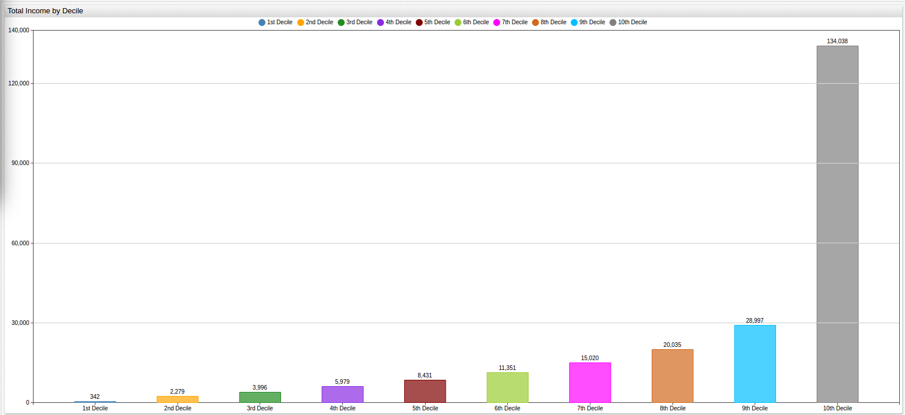
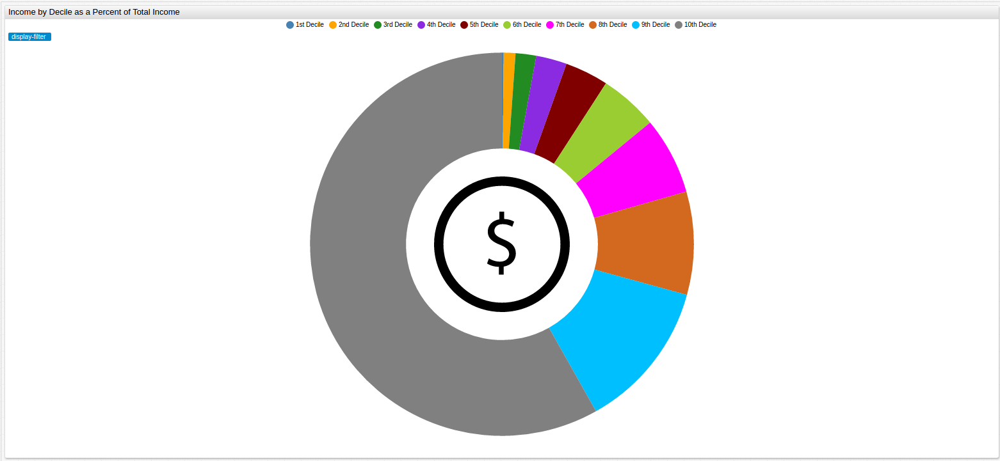

# New York City Income by Adjusted Gross Income (AGI) Range (2014)

* Data Source: [The City of New York](https://catalog.data.gov/dataset/personal-income-by-agi-range-3b6e6)

* Visualizations: [ChartLab](https://apps.axibase.com/chartlab) from [Axibase](https://axibase.com)

* Structured Query Language (SQL): [SQL Console](https://axibase.com/docs/atsd/sql/) from [Axibase](https://axibase.com)

All data is stored in the [Axibase Time Series Database](https://axibase.com). Download the Community Version [here](https://axibase.com/docs/atsd/installation/).

## Adjusted Gross Income (AGI)

"Adjusted Gross Income is defined as gross income minus adjustments to income." (Source: [Internal Revenue Service](https://www.irs.gov/uac/definition-of-adjusted-gross-income))

A person's AGI reflects the total amount of money that they earned in a given fiscal year minus whatever deductions that
filer will be making. The City of New York has collected information for all local tax filers, and aggregated them into ten
equally sized groups representing increasing 10th percentiles (called deciles here). The first decile represents the bottom
10% of New York City wage earners by AGI while the tenth decile represents the top 10% of New York City wage earners by AGI.

## Number of Filers

```sql
SELECT tags.income_group AS "AGI Decile", value AS "Total Filers", value/1000 AS "Total Filers (1000)"
  FROM "number_of_filers"
```

| AGI Decile  | Total Filers | Total Filers (1000) |
|-------------|--------------|---------------------|
| Total       | 3461521      | 3462                |
| 1st Decile  | 346320       | 346                 |
| 2nd Decile  | 346026       | 346                 |
| 3rd Decile  | 346159       | 346                 |
| 4th Decile  | 346193       | 346                 |
| 5th Decile  | 246213       | 246                 |
| 6th Decile  | 346021       | 346                 |
| 7th Decile  | 346268       | 346                 |
| 8th Decile  | 346132       | 346                 |
| 9th Decile  | 346068       | 346                 |
| 10th Decile | 346121       | 346                 |


[](https://apps.axibase.com/chartlab/1576163d/2/#fullscreen)

## Average Income by Decile

```sql
SELECT tags.income_group AS "AGI Decile", value AS "Decile Average Income"
  FROM "average_income_per_filer"
```

| AGI Decile  | Decile Average Income |
|-------------|-----------------------|
| Total       | 66580                 |
| 1st Decile  | 988                   |
| 2nd Decile  | 6587                  |
| 3rd Decile  | 11543                 |
| 4th Decile  | 17270                 |
| 5th Decile  | 24353                 |
| 6th Decile  | 32804                 |
| 7th Decile  | 43377                 |
| 8th Decile  | 57881                 |
| 9th Decile  | 83790                 |
| 10th Decile | 387259                |


[](https://apps.axibase.com/chartlab/d979bec5/2/#fullscreen)

> Average Total Income for all deciles: $66,580/year.

| AGI Decile | Percent of Average Income (%)|
|:----------:|:-------------------------:|
| 1st Decile | 1.48% |
| 2nd Decile | 9.89% |
| 3rd Decile | 17.34% |
| 4th Decile | 25.94% |
| 5th Decile | 36.58% |
| 6th Decile | 49.27% |
| 7th Decile | 65.15% |
| 8th Decile | 86.93% |
| 9th Decile | 125.85% |
| 10th Decile | 581.65% |

> A person making the average adjusted salary in New York City ($66580/year) is in the upper 85th percentile of wage earners.

## Total Income by Decile

```sql
SELECT tags.income_group AS "Age Decile", value AS "Decile Total Income (USD Million)"
  FROM "total_income_dollars_in_millions"
```

| Age Decile  | Decile Total Income (USD Million) |
|-------------|-----------------------------------|
| Total       | 230468                            |
| 1st Decile  | 342                               |
| 2nd Decile  | 2279                              |
| 3rd Decile  | 3996                              |
| 4th Decile  | 5979                              |
| 5th Decile  | 8431                              |
| 6th Decile  | 11351                             |
| 7th Decile  | 15020                             |
| 8th Decile  | 20034                             |
| 9th Decile  | 28997                             |
| 10th Decile | 134038                            |



[](https://apps.axibase.com/chartlab/d979bec5/3/#fullscreen)

## Income by Decile as a Percent of Total Income

```sql
SELECT tags.income_group AS "Age Decile", ((value/230468)*100) AS "Percent of Total Income"
  FROM "total_income_dollars_in_millions" WHERE tags.income_group != 'Total'
```

> This is a calculated metric using the `Total` figure from **Table 3.1** as the total value.

| Age Decile  | Percent of Total Income |
|-------------|-------------------------|
| 1st Decile  | 0.15                    |
| 2nd Decile  | 0.99                    |
| 3rd Decile  | 1.73                    |
| 4th Decile  | 2.59                    |
| 5th Decile  | 3.66                    |
| 6th Decile  | 4.93                    |
| 7th Decile  | 6.52                    |
| 8th Decile  | 8.69                    |
| 9th Decile  | 12.58                   |
| 10th Decile | 58.16                   |

>The top 10th percentile of earners in New York City earned almost 60% of the adjusted gross income in 2014.



[](https://apps.axibase.com/chartlab/1576163d/3/#fullscreen)