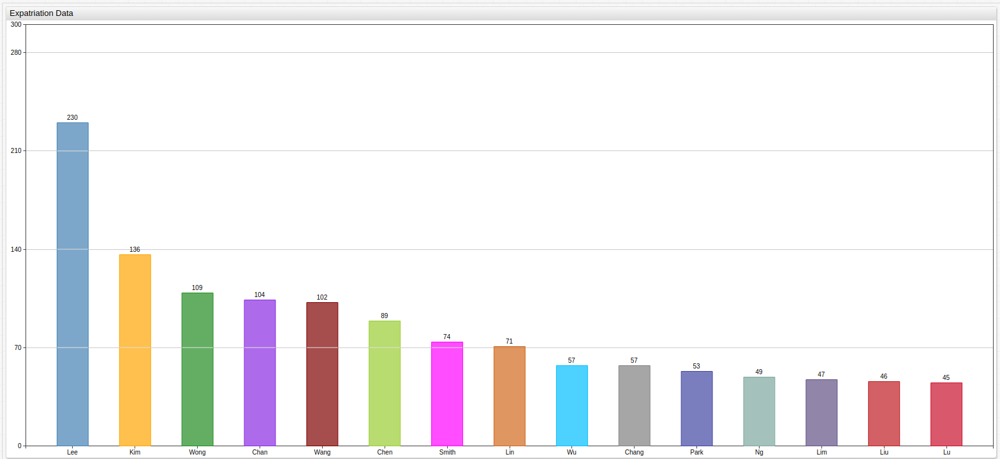

# United States Expatriation at an All-Time High


## Introduction

Expatriation is the temporary or permanent relocation of a person by choice or by force from their native country to any
other country in the world for work, pleasure, or purpose. History has seen expatriation from nearly every country in the world up to and including the current
epoch. Famous American expatriates throughout history have included American founding father Benjamin Franklin, who worked as
the first United States Minister to France for almost a decade after appointment by the Continental Congress in 1778. The
sixth President of the United States John Quincy Adams, who served as a U.S. Diplomat in four countries before winning the Presidency
as a Democratic-Republican in 1825, most notably opening American diplomatic ties as the first United States Minister to the Russian Empire, a position he loved
so much he declined a subsequent offer to serve as an Associate Justice on the Supreme Court of the United States a few years later.
American expatriates have come from all walks of life: authors, such as Ernest Hemingway who lived in China, Spain, Cuba, and was
even present on the beach code-named Omaha in Normandy during the allied landing. Musicians, like Jimi Hendrix who rose to
international fame in London after leaving his native Seattle, directors like Stanley Kubrick, singers like Tina Turner, and even basketball players like
Allen Iverson, who played an incomplete season for a Turkish basketball team in 2010 after retiring from the NBA.

For those who decide to make the change permanent, there comes a time when the inconvenience of living abroad as a resident alien
outweighs the novelty and many decide to renounce their citizenship for one reason or another. Unsurprisingly, this is a long
and complicated process, one of the main features of which is settling up with the [Internal Revenue Service](https://www.irs.gov/)
(IRS) via the eponymous [Expatriation Tax](https://www.irs.gov/individuals/international-taxpayers/expatriation-tax).

## Data

The [Federal Register](https://www.federalregister.gov/) is a publishing outlet for the United States Government where the IRS
officially releases quarterly information about American citizens who renounce their passport in lieu of a new one and other long-term
residents who have decided to repatriate, view the raw data [here](https://www.federalregister.gov/documents/2017/05/10/2017-09475/quarterly-publication-of-individuals-who-have-chosen-to-expatriate-as-required-by-section-6039g) and use the [Axibase Data Crawler](https://github.com/axibase/atsd-data-crawlers/tree/irs-expatriation-data-crawler) designed specifically for collecting, parsing, organizing and inserting historical expatriation data and new data as it becomes available.

Axibase covered last quarter's expatriation release [here](README.md) and is using
this quarter's release to follow-up. Every election cycle countless celebrities and netizens issue their promise to leave
if their candidate fails to get elected and the growing notoriety surrounding the 2016 Presidential Election has proven to
be no different.

This type of social theater is almost as old as the country itself as there have been
a number of similarly divisive elections throughout American history: Andrew Jackson's victory in 1828 was seen as a populace uprising against
the corrupt political elite and a return to the authority of the common man, Abraham Lincoln's second term was viewed as the
tightening of federal authority to excessive levels that ultimately led to the American Civil War, Franklin Roosevelt was called
a dangerous communist whose infamous court-packing plan favorably increased the number of seats on the Supreme Court to his
advantage and was seen as abhorrent and traitorous by many, and of course who can forget recent elections that have featured scandal after
scandal and two modern Presidents who served after losing the popular vote, but winning in the electorate.


[View in ChartLab](https://apps.axibase.com/chartlab/654b9945#fullscreen)

```sql
SELECT date_format(time,'yyyy') AS "Year", value AS "Naturalizations"
 FROM Naturalized.Citizens
```

> Data queried in the [SQL Console](https://github.com/axibase/atsd/blob/master/sql/README.md).

| Year | Naturalizations  |
|------|------------------|
| 2001 | 613,161          |
| 2002 | 589,727          |
| 2003 | 456,063          |
| 2004 | 536,176          |
| 2005 | 600,366          |
| 2006 | 702,663          |
| 2007 | 659,233          |
| 2008 | 1,050,399        |
| 2009 | 741,982          |
| 2010 | 619,075          |
| 2011 | 690,705          |
| 2012 | 762,742          |
| 2013 | 777,416          |
| 2014 | 654,949          |
| 2015 | 729,995          |

To give the issue further context, the table and visualization above use the most current Department of Homeland Security (DHS) [data](https://www.uscis.gov/news/fact-sheets/naturalization-fact-sheet)
available to display current naturalization numbers in the United States. Naturalization is the sister process to expatriation,
because as a person expatriates from one country they must be naturalized in another or end up a [stateless person](http://www.unhcr.org/stateless-people.html).

Naturalization numbers in America have remained fairly constant throughout the last decade because there are a number of federal regulations that
control the amount of long-term immigrants that America accepts each year and that quota is met without fail. As noted in the
our Q1 article, the sister value and subject of this examination, expatriation numbers, has been steadily growing for several
consecutive years.


[View in ChartLab](https://apps.axibase.com/chartlab/7fa5b643#fullscreen)

```sql
SELECT date_format(time+365*24*60*60000, 'yyyy') AS "Year",
  count(value) AS "Year Total",
  count(value)-lag(count(value)) AS "Y-o-Y Change",
  100*(count(value)-lag(count(value)))/lag(count(value)) AS "Y-o-Y Change, %"
FROM "us-expatriate-counter"
  WHERE entity = 'us.irs' AND datetime <= '2017-06-30T00:00:00Z'
GROUP BY period(1 YEAR, END_TIME)
  ORDER BY period(1 YEAR, END_TIME)
```

> The above query features robust syntax and calculated values. See the following [tutorials](https://github.com/axibase/atsd/blob/master/sql/README.md#examples) to understand more about SQL Console.

| Year | Year Total | Y-o-Y Change | Y-o-Y Change, % |
|------|------------|--------------|-----------------|
| 2000 | 273        | null         | null            |
| 2001 | 502        | 229          | 84              |
| 2002 | 322        | -180         | -36             |
| 2003 | 646        | 324          | 101             |
| 2004 | 474        | -172         | -27             |
| 2005 | 911        | 437          | 92              |
| 2006 | 351        | -560         | -61             |
| 2007 | 368        | 17           | 5               |
| 2008 | 394        | 26           | 7               |
| 2009 | 166        | -228         | -58             |
| 2010 | 1395       | 1229         | 740             |
| 2011 | 1812       | 417          | 30              |
| 2012 | 1412       | -400         | -22             |
| 2013 | 2091       | 679          | 48              |
| 2014 | 2766       | 675          | 32              |
| 2015 | 3626       | 860          | 31              |
| 2016 | 4143       | 517          | 14              |
| 2017 | 6807       | 2664         | 64              |


[View in ChartLab](https://apps.axibase.com/chartlab/7fa5b643/5/#fullscreen)

Expatriation has been increasing each year by roughly 30% since 2010, which featured abnormally high expatriation rates, most
likely attributable to the economic turndown of the Great Recession which began in the United States as a result of the sub-prime
mortgage crisis. American citizenship is often sought after for the economic opportunity that comes along with the passport, as the
ability to work and do business in the country is heavily restricted or regulated, and with the value of that investment or
opportunity in question, it is unsurprising that the number of investors in the system, that is, new citizens, would fluctuate. It seems
appropriate to call naturalization an investment because of the nature of the process, which is long, complicated, and often
quite expensive similar to a long-position that will cost more at purchasing time but promises high returns after reaching
maturity.

The peak, or more appropriately, valley of the global recession occurred in 2009 when the global GDP contracted causing
a decline in the median family income of [about five percent](https://web.stanford.edu/group/recessiontrends/cgi-bin/web/sites/all/themes/barron/pdf/IncomeWealthDebt_fact_sheet.pdf).


[View in ChartLab](https://apps.axibase.com/chartlab/7fa5b643/2/#fullscreen)

```sql
SELECT CEIL(CAST(date_format(time, 'M') AS NUMBER)/3) AS "Quarter", date_format(time, 'yyyy') AS "Year",
  count(value) AS "Quarter Total"
FROM "us-expatriate-counter"
  WHERE entity = 'us.irs' AND date_format(time, 'yyyy-MM') >= '2013-01' AND datetime <= now
GROUP BY period(1 QUARTER)
  ORDER BY period(1 QUARTER)
```

| Quarter | Year | Quarter Total |
|---------|------|---------------|
| 1       | 2013 | 679           |
| 2       | 2013 | 1129          |
| 3       | 2013 | 560           |
| 4       | 2013 | 631           |
| 1       | 2014 | 999           |
| 2       | 2014 | 576           |
| 3       | 2014 | 775           |
| 4       | 2014 | 1061          |
| 1       | 2015 | 1331          |
| 2       | 2015 | 459           |
| 3       | 2015 | 1426          |
| 4       | 2015 | 1057          |
| 1       | 2016 | 1154          |
| 2       | 2016 | 506           |
| 3       | 2016 | 1379          |
| 4       | 2016 | 2359          |
| 1       | 2017 | 1313          |
| 2       | 2017 | 1756          |

Reducing the timespan to look at data over the last 5 years captures the repetition of this trend for this
period of time. Of the eighteen quarters included in this query, only six of them, roughly 33% showed negative growth for
this statistic.

## Conclusion

Growing expatriation numbers provide interesting insight into the perception of America both domestically and abroad, as these
numbers not only include U.S. citizens who renounce their citizenship, but also long-term resident aliens who have returned home.

Almost unbelievably, the IRS does not strip characteristic information about expatriates from their publications meaning that
first and last names are included in the data. Using [Social Security data](https://www.ssa.gov/oact/babynames/decades/century.html)
concerning the most common first names chosen throughout the last century and [United States Census data](http://www.census.gov/main/www/cen2000.html)
concerning the most common last names to compare, the following queries and visualizations show
the number of expatriates by common first and common last name throughout the entire observed period, ranked by their frequency
in the IRS publication.

**The goal of these queries is purely demonstrative and lighthearted. There is no intention to invade privacy, defame people, or
otherwise cause harm.**


```sql
SELECT tags.first_name AS "First Name",
  count(value) AS "Expat Total"
FROM "us-expatriate-counter"
  WHERE entity = 'us.irs' AND datetime <= now
GROUP BY tags.first_name
  ORDER BY count(value) desc
LIMIT 15
```

| First Name  | Expat Total |
|-------------|-------------|
| JOHN        | 323         |
| MICHAEL     | 317         |
| DAVID       | 310         |
| ROBERT      | 273         |
| PETER       | 211         |
| JAMES       | 200         |
| THOMAS      | 193         |
| DANIEL      | 179         |
| WILLIAM     | 172         |
| SUSAN       | 167         |
| RICHARD     | 160         |
| MARY        | 155         |
| CHRISTOPHER | 153         |
| JENNIFER    | 138         |
| PATRICIA    | 132         |

> All of these names appear on the list of most common American first names, linked [here](https://www.ssa.gov/oact/babynames/decades/century.html)



```sql
SELECT tags.last_name AS "Last Name",
  count(value) AS "Expat Total"
FROM "us-expatriate-counter"
  WHERE entity = 'us.irs' AND datetime <= now
GROUP BY tags.last_name
  ORDER BY count(value) desc
LIMIT 15
```

| Last Name | Expat Total |
|-----------|-------------|
| LEE       | 230         |
| KIM       | 136         |
| WONG      | 109         |
| CHAN      | 104         |
| WANG      | 102         |
| CHEN      | 89          |
| SMITH     | 74          |
| LIN       | 71          |
| WU        | 57          |
| CHANG     | 57          |
| PARK      | 53          |
| NG        | 49          |
| LIM       | 47          |
| LIU       | 46          |
| LI        | 45          |

>Only the name Smith appears on the list of most common American last names, linked [here](http://www.census.gov/main/www/cen2000.html)

Use the [Axibase Data Crawler](https://github.com/axibase/atsd-data-crawlers/tree/irs-expatriation-data-crawler) to collect the data used in this article and examine it yourself in [ChartLab](https://apps.axibase.com/chartlab).