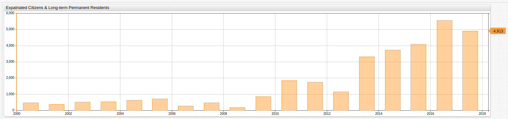
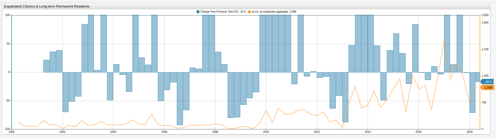

# First Quarter Expatriation Shows Marked Decrease After Post-Election Turmoil


## Introduction

The [Internal Revenue Service](https://www.irs.gov/) (IRS) of the United States releases quarterly reports tracking the number of expatriated citizens processed in the previous three-month period. The reports are announced via the [Federal Register](https://www.federalregister.gov/) which is the primary publication medium of the federal government and used by a number of agencies as an outreach arm to the public.

Ostensibly, the tax bureau maintains these records instead of [Citizenship and Immigration Services](https://www.uscis.gov/) (CIS) because the IRS uses that information to adjudicate decisions regarding those expatriating citizens upon whom the [Expatriation Tax](https://www.irs.gov/individuals/international-taxpayers/expatriation-tax) should be levied.

Previous articles tracking United States expatriation:

* [2017 Q2](2017-1.md)
* [2017 Q3](2017-2.md)
* [2017 Q4](2017-3.md)

---

## Expatriation Review

Axibase [tracked](2017-3.md) record-high expatriation during 2017; in the fourth quarter of last year however, it seemed that expatriation levels had begun to normalize once again. Naturally, the number of expatriating citizens is far lower than the amount of number of new citizens due to naturalization, but the trend remains interesting nonetheless. This trend has been noted by such publications as the [Washington Post](https://www.washingtonpost.com/news/worldviews/wp/2017/02/10/a-potentially-historic-number-of-people-are-giving-up-their-u-s-citizenship/?noredirect=on&utm_term=.5a0d04f0ffb5) as far back as early 2017, when Axibase published our [first article](2017-1.md) citing the trend.

---

## Current Data

The underlying IRS report contains the names of the individuals who expatriated in the first quarter of 2018.

Support for date aggregations in [Axibase Time Series Database](https://axibase.com/docs/atsd/) SQL syntax allows reporting on both the annual and quarterly basis.

### Annual Data

```sql
SELECT date_format(time+365*24*60*60000, 'yyyy') AS "Year",
  count(value) AS "Year Total",
  count(value)-lag(count(value)) AS "Y-o-Y Change",
  100*(count(value)-lag(count(value)))/lag(count(value)) AS "Y-o-Y Change, %"
FROM "us-expatriate-counter"
  WHERE entity = 'us.irs' AND datetime <= '2018-03-31T00:00:00Z'
GROUP BY period(1 YEAR, END_TIME)
  ORDER BY period(1 YEAR, END_TIME)
```

| Year | Year Total | Y-o-Y Change | Y-o-Y Change, % |
|------|------------|--------------|-----------------|
| 2000 | 184        | null         | null            |
| 2001 | 470        | 286          | 155             |
| 2002 | 373        | -97          | -21             |
| 2003 | 507        | 134          | 36              |
| 2004 | 545        | 38           | 7               |
| 2005 | 645        | 100          | 18              |
| 2006 | 724        | 79           | 12              |
| 2007 | 285        | -439         | -61             |
| 2008 | 485        | 200          | 70              |
| 2009 | 174        | -311         | -64             |
| 2010 | 853        | 679          | 390             |
| 2011 | 1850       | 997          | 117             |
| 2012 | 1742       | -108         | -6              |
| 2013 | 1151       | -591         | -34             |
| 2014 | 3319       | 2168         | 188             |
| 2015 | 3743       | 424          | 13              |
| 2016 | 4096       | 353          | 9               |
| 2017 | 5557       | 1461         | 36              |
| 2018 | 4913       | -644         | -12             |

[**ChartLab**](../ChartLabIntro/README.md) is a visualization service which can display ATSD data as charts. **ChartLab** features a wide range of widgets which can be created using a declarative syntax.



[](https://apps.axibase.com/chartlab/ad0f3f03#fullscreen)

### Quarterly Data

```sql
SELECT CEIL(CAST(date_format(time, 'M') AS NUMBER)/3) AS "Quarter", date_format(time, 'yyyy') AS "Year",
  count(value) AS "Quarter Total"
FROM "us-expatriate-counter"
  WHERE entity = 'us.irs' AND date_format(time, 'yyyy-MM') >= '2014-01' AND datetime <= now
GROUP BY period(1 QUARTER)
  ORDER BY period(1 QUARTER)
```

| Quarter | Year | Quarter Total |
|---------|------|---------------|
| 1       | 2013 | 679           |
| 2       | 2013 | 1129          |
| 3       | 2013 | 560           |
| 4       | 2013 | 631           |
| 1       | 2014 | 999           |
| 2       | 2014 | 576           |
| 3       | 2014 | 775           |
| 4       | 2014 | 1061          |
| 1       | 2015 | 1331          |
| 2       | 2015 | 459           |
| 3       | 2015 | 1426          |
| 4       | 2015 | 1057          |
| 1       | 2016 | 1154          |
| 2       | 2016 | 506           |
| 3       | 2016 | 1379          |
| 4       | 2016 | 2359          |
| 1       | 2017 | 1313          |
| 2       | 2017 | 1756          |
| 3       | 2017 | 1374          |
| 4       | 2017 | 685           |
| 1       | 2018 | 1098          |

Although lower than 2017 Q1, 2018 Q1 data is on the order of recent, record-setting years for expatriation numbers.

Using **ChartLab** for data visualization of the quarterly samples:


[](https://apps.axibase.com/chartlab/ae048be8#fullscreen)

---

## On-Loading Expatriation Data

The data published by the Federal Register requires an intermediate ETL step in order to be available for analysis. This extraction-transformation-loading procedure is implemented by a [web crawler](https://github.com/axibase/atsd-data-crawlers/tree/irs-expatriation-data-crawler) built specifically for the task of tracking Federal Register publications for new expatriation data releases.

The Web Crawler operates according to this workflow:


The Web Crawler reads incoming data from the Federal Register and parses it into [`series` commands](https://axibase.com/docs/atsd/api/network/series.html), readable by [ATSD](https://axibase.com/docs/atsd/), the database which hosts all the data used in this article and supports the background operations of [SQL Console](https://axibase.com/docs/atsd/sql/). A `series` command template is shown below:

```ls
series d:{iso-date} e:{entity} t:{tag-1}={val-1} m:{metric-1}={number}
```

In the case of expatriation data here, the entity is the publishing body, `us.irs` and the metric is `us-expatriate-counter`.

SQL result set with raw data output no grouping, and entity / metric labels included:

```sql
SELECT datetime, tags.first_name, tags.middle_name, tags.last_name
  FROM "us-expatriate-counter"
WHERE entity = 'us.irs'
  ORDER BY datetime DESC
LIMIT 10
```

```txt
| datetime              | tags.first_name  | tags.middle_name  | tags.last_name |
|-----------------------|------------------|-------------------|----------------|
| 2018-03-31T00:00:00Z  | DARSHAM          | EVA               | VOOGT          |
| 2018-03-31T00:00:00Z  | MAX-DOMINIC      | GRAFBEISSEL       | VONGYMNICH     |
| 2018-03-31T00:00:00Z  | JORRIT           | FRISCO            | VANDERVEEN     |
| 2018-03-31T00:00:00Z  | HATTAN           | KHALED            | UJAIMI         |
| 2018-03-31T00:00:00Z  | KANAE            | -                 | TSURUGA        |
| 2018-03-31T00:00:00Z  | ELTJE            | FREDERIKA         | TOLLENAAR      |
| 2018-03-31T00:00:00Z  | GUYSLAINE        | AIMEE             | THALMANN       |
| 2018-03-31T00:00:00Z  | ZHENGPING        | -                 | TAN            |
| 2018-03-31T00:00:00Z  | MOTOKI           | -                 | TAKAHASHI      |
| 2018-03-31T00:00:00Z  | AASIYA           | -                 | TAHIR          |
```

---

### Additional Visualizations

#### `time_offset`

Data may also be compared using `time_offset` features whereby variable time-offsets may be applied to a dataset so that it may be compared to itself during a different time period, useful when working with time series data.


[](https://apps.axibase.com/chartlab/f3b0e94f#fullscreen)

Additionally, a [`SUM`](https://github.com/axibase/charts/blob/master/syntax/value_functions.md#statistical-functions) value function may be applied to aggregate quarterly samples into annual totals using a [`period`](https://axibase.com/products/axibase-time-series-database/visualization/widgets/configuring-the-widgets/) setting.

```javascript
period = 1 year
statistics = SUM
time-offset = 1 year
```

#### `fred.PercentChangeFromYearAgo`

A number of built-in [statistical functions](https://github.com/axibase/charts/blob/master/syntax/value_functions.md#statistical-functions) are already supported by ChartLab, and [user-defined functions](../how-to/shared/trends.md#user-defined-functions) may be added to a local ATSD instance. You can follow these [instructions](https://github.com/axibase/charts/blob/master/syntax/udf.md#deploying-function-files) to upload a user-defined function as a JavaScript file.



[](https://apps.axibase.com/chartlab/1ae83460#fullscreen)

Visualization uses the `PercentChangeFromYearAgo` user-defined function. While the absolute value of U.S. expatriates was the greatest during 2016-2017, the greatest relative change was actually observed several years ago.

While the underlying function may be quite verbose:

```ls
value = var v = value('cpi'); var p = value('prev_cpi'); if(p!=null && v!=null) return (v / p - 1) * 100
```

The syntax required in the ChartLab configuration is simple:

```ls
value = fred.PercentChangeFromYearAgo('raw')
```

> View the complete [`fred.js`](../how-to/shared/trends.md#fred-library) UDF library here.

#### Highlights

The charts library provides settings quarters where the percent change from the previous year was greater than 50% in red, and quarters where it was less than -10% in green.


[](https://apps.axibase.com/chartlab/8828458c#fullscreen)

The syntax for the `alert-expression` above is shown here:

```ls
    alert-expression = value > 50 ? 4000 : value < -10 ? -100 : 0
    alert-style = if (alert > 50) return 'color:red'
    alert-style = if (alert < -10) return 'color:green'
```

When using a two-parameter `alert-expression`, three arguments are needed: an upper bound, lower bound, and median value separated by `:` delimiter.

For more information about ChartLab syntax or to explore other features which may be used in the example above, see the complete [ChartLab documentation](https://axibase.com/products/axibase-time-series-database/visualization/widgets/).
