Quantifying Public Health: The American Fitness Index
=====

### Methodology
[Data](https://catalog.data.gov/dataset/american-fitness-index-ranking-2010-present)
originally released by the [American College of Sports Medicine](http://www.acsm.org/) and
partially-published by the City of New Orleans attempts to quantify the overall health of the 
fifty largest metropolitan areas in the United States every year. The 100-point scale
takes into account a number of factors they believe contribute to the overall health
of a city and its surrounding area with the goal of informing policy makers of the
reality of public health in their areas. 

>A detailed explanation of how the ACSM 
assigns scores can be found in the [Appendix](#Appendix)

The data compares ten Metropolitan Statistical Areas (MSAs) located primarily
in the Southeast of the country, a region notorious for its problems with public health. 
However, the data is otherwise quite diverse, representing MSAs from seven states and
including the United States average values as well. Further, high-scoring MSAs like 
Atlanta, Georgia are shown alongside low-scoring MSAs like Oklahoma City,
Oklahoma and with a five-year time period of observation (2011 to 2015), enough data
exists to effectively observe and record recent trends.

### Data

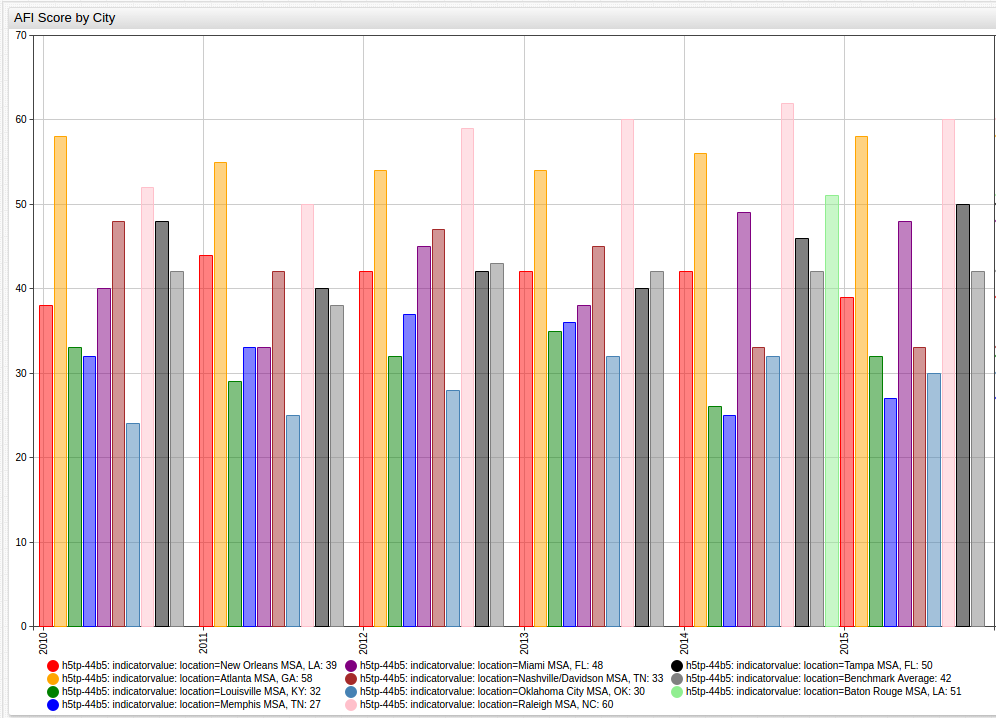

Looking at an entire set of data at once is often unhelpful and overwhelming, but here
this visualization can be used to offer a wide lens through which to view what amounts
to quite a lot of data over a long period of time. A noticeable feature of this 
visualization is the trend that saw nearly every recorded MSA here lose points between
2010 and 2011, only to show improvement throughout the rest of the observation period.

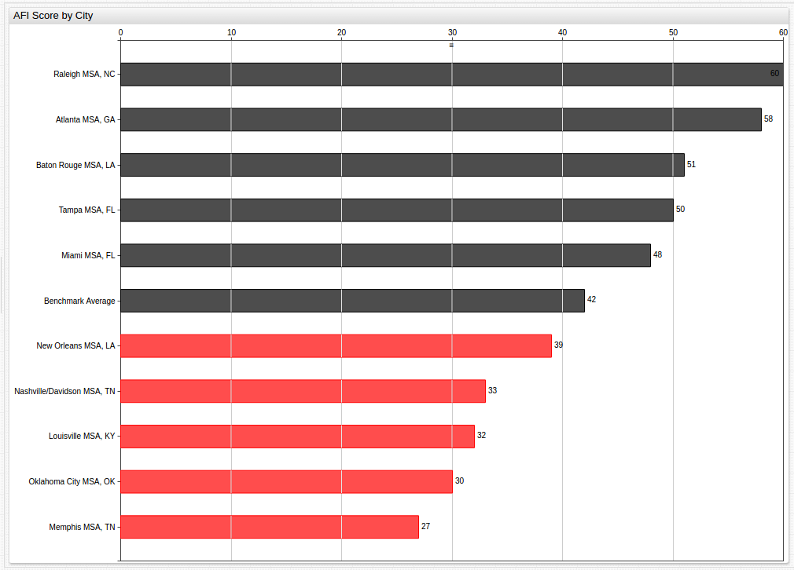

This visualization looks at year 2015 data and highlights those cities performing 
below the National Benchmark Average, or mean value for all 50 observed cities,
with the `ALERT` command.

>For more information about using this command, see the [Appendix](#Appendix)

In order to observe trends in individual MSAs, finding an effective method to sort
the data is needed. By organizing the data by city, chronologically, a user can find
trends that were not as obvious in the first visualization:

>See [Appendix](#Appendix) for an alternative display of the above data

Using the date as the primary control, and focusing the layout of the visualization
on the trend across the observed MSAs for a given year, a third configuration is
needed:

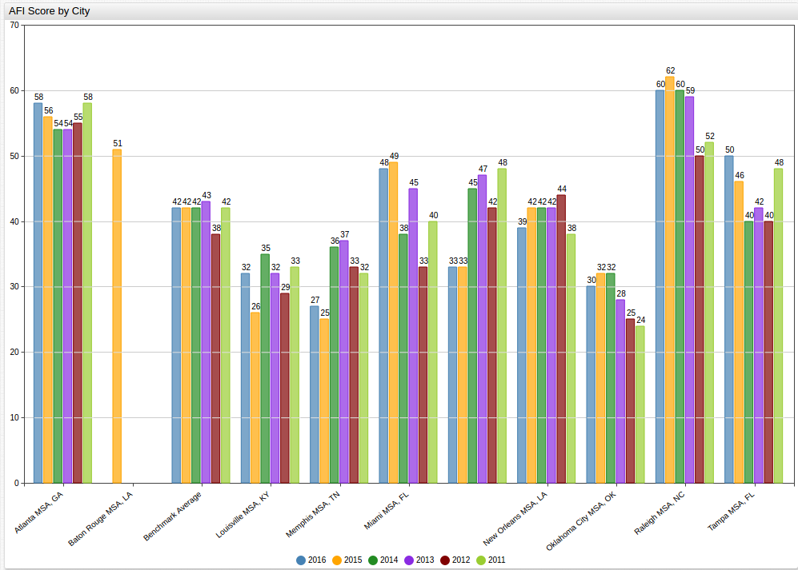

Although the two charts are rendered almost identically with respect to the data,
the key difference is how they are presented. Here we see the graph organized to show
trends based on the year, and even though a significant amount of data is still
present, tracing patterns year-to-year has become much easier than it was in the previous
display. Notice that because data is only available for 2015 for Baton Rouge, 
Louisiana the remaining empty columns are still rendered for the sake of chronology.

Average performance of the observed cities can displayed with a less ambiguous 
visualization using the [Gauge Chart](https://axibase.com/products/axibase-time-series-database/visualization/widgets/gauge-chart/)
that shows subjective performance standards, here the threshold has been set at 42,
the mean value of the 5-year United States Benchmark Average value:

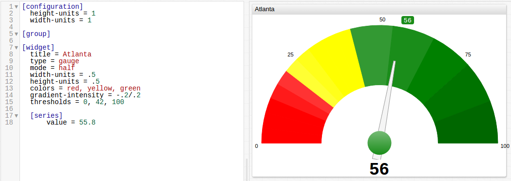

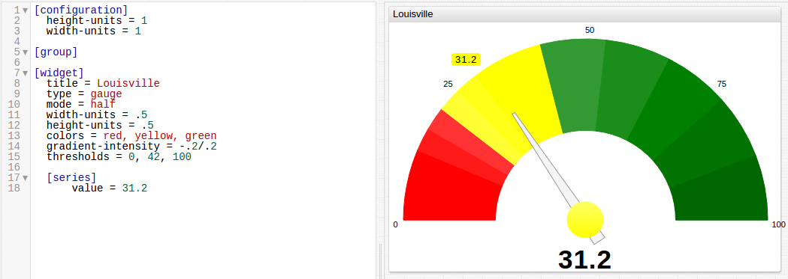

Using `display` commands, erroneous or extra data can be masked in order to compare 
the best and worst performing MSAs over the observed period. For this data, Oklahoma City, Oklahoma 
was the lowest-performing MSA and Raleigh, North Carolina was the highest-performing MSA. 
Displayed next to one another, their absolute and relative differences can be 
underlined:

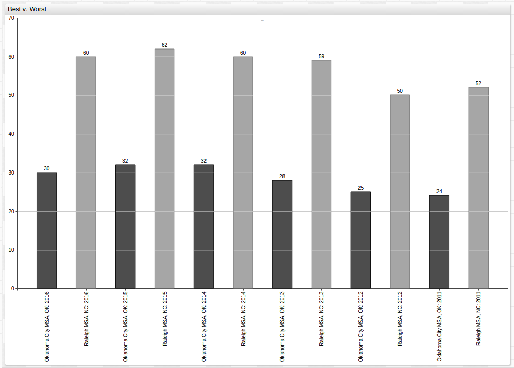

In order to make observations about the performance of one MSA over the observed time,
a similar strategy can be used with a different method of visualization:

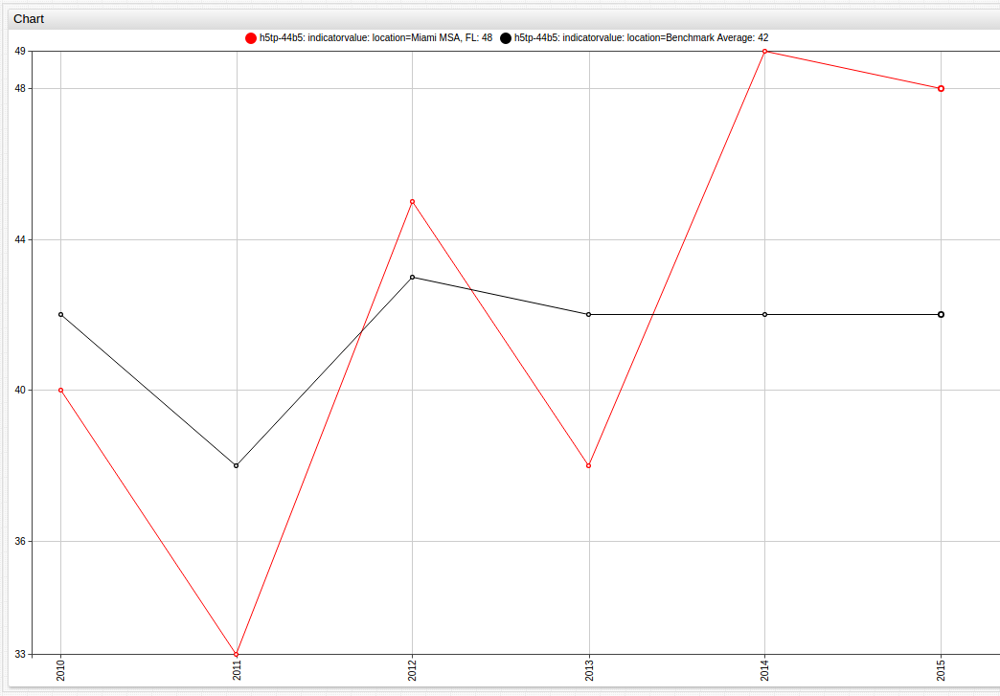

Or, to compare the results of data observed within one state, additions can easily be
made to include a third entity:

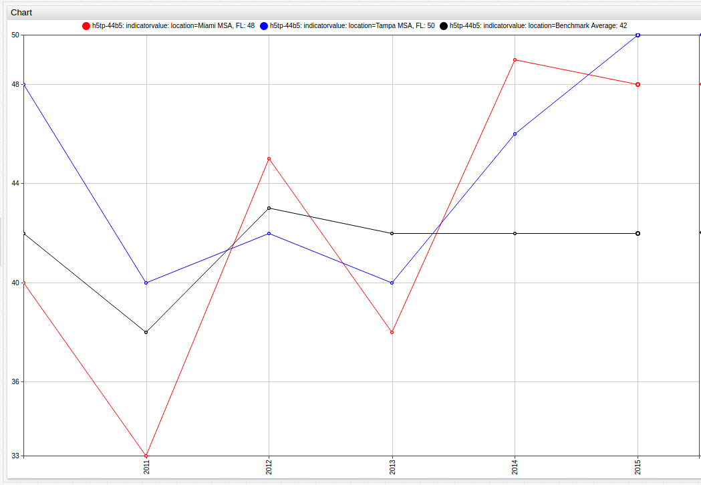

The same can be done using the two Tennessee MSAs, Memphis and Nashville/Davidson,
displayed here alongside the Benchmark Average value:

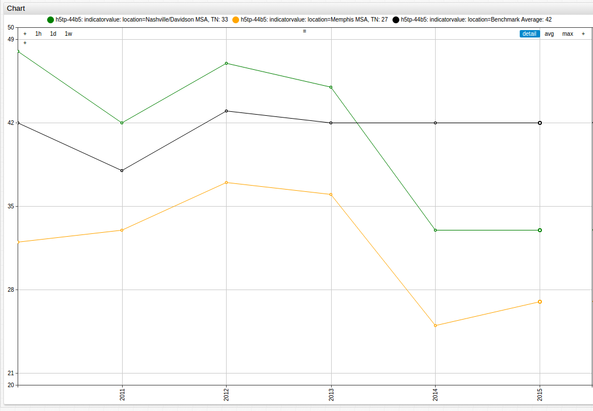

Additionally, using cities that serve as state capitols can be used as a microcosm
for the indicators of the state itself:

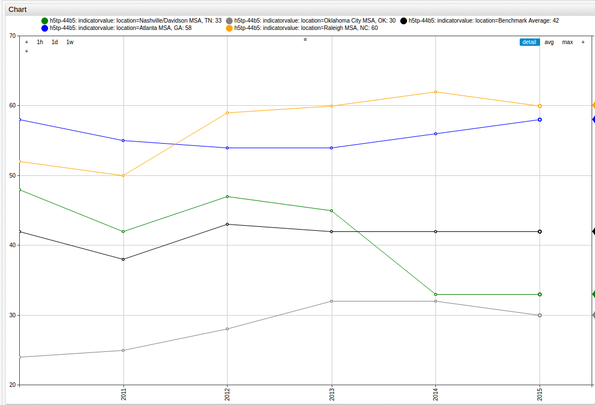

###Appendix

#### How the AFI is Calculated:

The American Fitness Index is calculated using the following formula: 

``
x = [( \sum_1^n r w) / Max ] * 100
``

Where,
* _x_ = Total Score
* _n_ = up to 15 for **Personal Health** or 16 for **Community and Environment** indicators are
either present and counted, or not. 
* _r_ = Metropolitan Statistical Area (MSA) Rank out of 50.
* _w_ = Weighted value of indicator, determined by ACSM internally.
* _Max_ = A hypothetical maximum score for the MSA if it were to rank best on both indicators.

([_Source_](http://www.americanfitnessindex.org/methodology/): American Fitness Index)

#### Using the `ALERT` Command

The [`ALERT`](https://axibase.com/products/axibase-time-series-database/visualization/widgets/bar-chart-widget/#tab-id-3)
command has a two-part syntax:

`alert-expression = YOUR_CONDITION_HERE`

`alert-style = fill: COLOR; stroke = COLOR`

And is shown in a ChartLab example below:

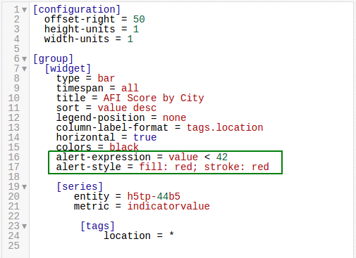

#### Alternative Display of City By Year Data

It may be more desirable to separate each body of data, for a cleaner visualization 
as shown below:

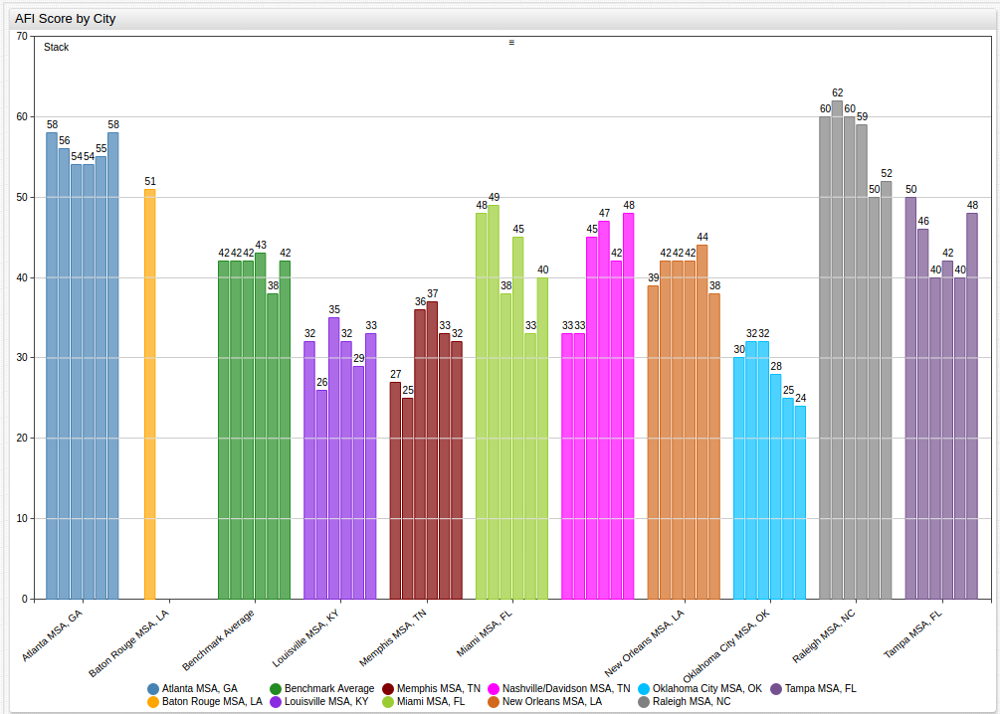

The visualization show above uses the [`group`](https://axibase.com/products/axibase-time-series-database/visualization/widgets/bar-chart-widget/#[widget]-settings)
command in the `[widget]` cluster,shown below:

Because of the highlighted command, data is separated by its `location` tag, but in
the visualization shown in the [Data](#Data) section, the `group = location` tag 
is ignored because of the [`sort`](https://axibase.com/products/axibase-time-series-database/visualization/widgets/bar-chart-widget/#[widget]-settings)
command shown below:

