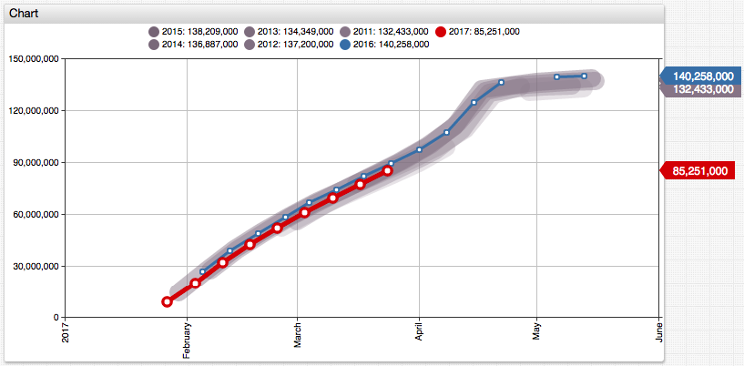
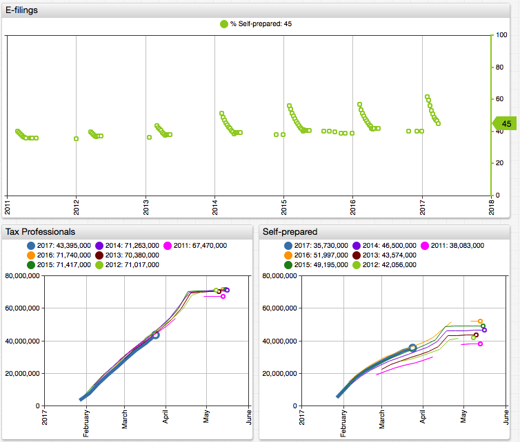

Tax Day 2017: Are U.S. Tax Payers Procrastinating?
==============

Americans are filing fewer tax returns this year.

According to the IRS, the total number of tax returns received by the agency as of March 31 is down by **4.1%** compared to previous year.

**Total Returns Received in 2017 compared to 2016**

| Date | Change |
|------|-------:|
| February 24 | -10.6% |
| March 03 | -8.5% |
| March 10 | -6.8% |
| March 17 | -5.5% |
| March 24 | -4.7% |
| March 31 | -4.1% |

_Source: [IRS Filing Season Statistics](https://www.irs.gov/uac/2017-and-prior-year-filing-season-statistics)_



[](https://apps.axibase.com/chartlab/626f6fb9/3/#fullscreen)

One of the possible reasons is refund delays introduced by the [Protecting Americans From Tax Hikes Act of 2015](https://www.irs.gov/uac/newsroom/path-act-tax-related-provisions) (**PATH**). While some news reports have speculated that the slack is caused by the misguided expectations of a possible [tax relief](http://www.reuters.com/article/us-money-taxes-delays-idUSKBN16L18C) in the aftermath of the 2017 presidential election, the PATH Act appears to be the most credible explanation for the drop in filings. The Act mandates the IRS to put a hold on refunds claiming the Earned Income Tax Credit or the Additional Child Tax Credit until mid-February. It removes incentives for the early filers to submit the returns as soon as possible. To its credit the PATH act attempts to fight a major loophole that allowed identity fraudsters to submit **5 million** fake returns and steal **[$30 billion](https://www.justice.gov/tax/stolen-identity-refund-fraud)** from tax payers in 2013 of which only **$24 billion** was recovered.

However, the PATH Act alone cannot explain the drop in filings in the second half of the season, so another frequently cited reason is the shift in the Tax Day this year to April 18th giving the U.S. tax payers an extra weekend to prepare their taxes.

Such nation-wide calendar changes, even by a few days, are worth a closer look since they affect not just the trivial events such as proverbial lines at USPS offices but have the potential to change travel patterns and even suppress retail traffic around the tax weekend. They certainly make year-on-year comparisons more tricky.

To normalize the year-on-year data reported by IRS we will load the data into Axibase Time Series Database and apply the [`LAG`](https://github.com/axibase/atsd/tree/master/sql#lag) and [`INTERPOLATE`](https://github.com/axibase/atsd/tree/master/sql#regularization) functions to calculate the yearly change in both the absolute and percentage terms under three different behavioral scenarios.

Note that the IRS reports reference two dates used for year-on-year comparison, for example:

> Cumulative statistics comparing 04/01/2016 and 03/31/2017

These dates are Fridays when the metrics were collected and as such they ignore day-of-week and Tax Day changes between the annual periods. In this particular [example](https://www.irs.gov/uac/newsroom/filing-season-statistics-for-week-ending-march-31-2017), 2017-Mar-31 is the 90th day in year whereas 2016-Apr-01 is the 92nd day in year. 2017-Mar-31 is 18 days away from the Tax Day, whereas 2016-Apr-01 is 17 days from the Tax Day. By removing these calendar discrepancies we should be able to get a clearer picture.

Lets build the year-on-year comparisons for the following three scenarios:

* Case 1. Tax payers file returns on the same calendar date each year, so March 31 should be compared with March 31. After many years of doing it, people might have a marker in their calendar to do it on April 10th, for example.
* Case 2. Tax payers file returns on the same ordinal day in each year, e.g. on the 90th day. It takes time to gather forms and receipts from employers, banks, brokers, and this effort takes certain amount of time each year. We'll assume such effort to be a constant number.
* Case 3. Tax payers file returns based on the deadline, e.i. when 10 days are remaining to Tax Day. Historically, it's been April 15th, however with the introduction of the Emancipation Day in Washington, D.C, the specific Tax Day will change more often going forward.

## Case 1: File Tax on the Same Calendar Date

```sql
SELECT date_format(time, 'yyyy') AS "Year",
  date_format(time, 'MMM-dd') AS "Date",
  value/1000000 AS "Curr Year, Mln",
  LAG(value)/1000000 AS "Prev Year, Mln",
  (value-LAG(value))/1000000 AS "YoY Change, Mln",
  (value/LAG(value)-1)*100 AS "YoY Change, %"
  FROM "irs_season.count_year_current"
WHERE tags.section = 'Individual Income Tax Returns' AND tags.type = 'Total Returns Received'
  AND date_format(time, 'MM-dd') = '03-31'
  WITH INTERPOLATE(1 DAY)
ORDER BY date_format(time, 'MM-dd')
```

In this query example, the `LAG(column_name)` function provides a convenient syntax to access columns in the previous row within the current result set.

The `WITH INTERPOLATE(1 DAY)` clause is used to fill the missing data points and make the series regular.  

| Year | Date   | Curr Year, Mln | Prev Year, Mln | YoY Change, Mln | YoY Change, % |
|------|--------|----------------:|----------------:|------------------:|----------------:|
| 2011 | Mar-31 | 88.7            | null            | null              | null            |
| 2012 | Mar-31 | 92.2            | 88.7            | 3.5               | 4.0             |
| 2013 | Mar-31 | 90.6            | 92.2            | -1.5              | -1.7            |
| 2014 | Mar-31 | 94.7            | 90.6            | 4.0               | 4.4             |
| 2015 | Mar-31 | 95.3            | 94.7            | 0.6               | 0.7             |
| 2016 | Mar-31 | 96.5            | 95.3            | 1.2               | 1.2             |
| 2017 | Mar-31 | 93.7            | 96.5            | -2.8              | -2.9            |

## Case 2: File Taxes on the Same Day in Year

```sql
SELECT date_format(time, 'yyyy') AS "Year",
  date_format(time, 'MMM-dd') AS "Date",
  CAST(date_format(time, 'D') AS NUMBER) AS "Day in Year",
  value/1000000 AS "Curr Year, Mln",
  LAG(value)/1000000 AS "Prev Year, Mln",
  (value-LAG(value))/1000000 AS "YoY Change, Mln",
  (value/LAG(value)-1)*100 AS "YoY Change, %"
  FROM "irs_season.count_year_current"
WHERE tags.section = 'Individual Income Tax Returns' AND tags.type = 'Total Returns Received'
  AND "Day in Year" = CAST(date_format(date_parse('2017-03-31T00:00:00Z'), 'D') AS NUMBER)
  WITH INTERPOLATE(1 DAY)
ORDER BY "Day in Year", time
```

The [`date_format`](https://github.com/axibase/atsd/tree/master/sql#date-formatting-functions) function can be conveniently used to perform date- and calendar-based filtering.


| Year | Date   | Day in Year | Curr Year, Mln | Prev Year, Mln | YoY Change, Mln | YoY Change, % |
|------|--------|------------:|----------------------:|-------------------:|------------------:|----------------:|
| 2011 | Mar-31 | 90          | 88.7                  | null               | null              | null            |
| 2012 | Mar-30 | 90          | 91.1                  | 88.7               | 2.4               | 2.7             |
| 2013 | Mar-31 | 90          | 90.6                  | 91.1               | -0.4              | -0.5            |
| 2014 | Mar-31 | 90          | 94.7                  | 90.6               | 4.0               | 4.4             |
| 2015 | Mar-31 | 90          | 95.3                  | 94.7               | 0.6               | 0.7             |
| 2016 | Mar-30 | 90          | 95.3                  | 95.3               | -0.0              | -0.0            |
| 2017 | Mar-31 | 90          | 93.7                  | 95.3               | -1.6              | -1.7            |

## Case 3: File Taxes based on Days Remaining to Filing Date (Tax Day)

```sql
SELECT date_format(time, 'yyyy') AS "Year",
  date_format(time, 'MMM-dd') AS "Date",
  CAST(date_format(time, 'D') AS NUMBER) AS "Day in Year",
  CAST(date_format(date_parse(CONCAT(date_format(time, 'yyyy'), '-04-',   
    CASE date_format(time, 'yyyy')               
      WHEN '2012' OR '2018' THEN '17'
      WHEN '2016' OR '2017' THEN '18'
      ELSE '15'
    END, 'T00:00:00Z')), 'D') AS NUMBER) - CAST(date_format(time, 'D') AS NUMBER) AS "Days to File",     
  value/1000000 AS "Curr Year, Mln",
  LAG(value)/1000000 AS "Prev Year, Mln",
  (value-LAG(value))/1000000 AS "YoY Change, Mln",
  (value/LAG(value)-1)*100 AS "YoY Change, %"
  FROM "irs_season.count_year_current"
WHERE tags.section = 'Individual Income Tax Returns' AND tags.type = 'Total Returns Received'
  -- 18 days between 31-Mar-2017 and 18-Apr-2017  
  AND "Days to File" = 18
  WITH INTERPOLATE(1 DAY)
ORDER BY "Days to File" DESC, time
```

| Year | Date   | Day in Year | Days to File | Curr Year, Mln | Prev Year, Mln | YoY Change, Mln | YoY Change, % |
|------|--------|-------------|--------------|----------------|----------------|-----------------|---------------|
| 2011 | Mar-28 | 87          | 18           | 85.5           | null           | null            | null          |
| 2012 | Mar-30 | 90          | 18           | 91.1           | 85.5           | 5.6             | 6.6           |
| 2013 | Mar-28 | 87          | 18           | 87.2           | 91.1           | -3.9            | -4.3          |
| 2014 | Mar-28 | 87          | 18           | 90.8           | 87.2           | 3.6             | 4.1           |
| 2015 | Mar-28 | 87          | 18           | 91.5           | 90.8           | 0.8             | 0.8           |
| 2016 | Mar-31 | 91          | 18           | 96.5           | 91.5           | 4.9             | 5.4           |
| 2017 | Mar-31 | 90          | 18           | 93.7           | 96.5           | -2.8            | -2.9          |


## Summary

By normalizing the raw data collected by IRS we're observing the following percentage changes for the 2017/16 filing season.

| Case | 2017/2016 YoY Change, %   |
|------|-------:|
| 1 | -2.9 |
| 2 | -1.7 |
| 3 | -2.9 |

These estimates are measurably smaller than **4.1%** drop displayed in the latest IRS report. The American taxpayers appear to be not procrastinating - they are reacting to legislative changes in a rational way.

We noticed however that the trends are not uniform across E-filing channels.

**2017/2016 YoY Change, %**

| Case | Tax Professionals | Self-prepared |
|------|-------:|---:|
| 3 | -3.3 | -1.8 |

```sql
SELECT date_format(time, 'yyyy') AS "Year",
  date_format(time, 'MMM-dd') AS "Date",
  CAST(date_format(time, 'D') AS NUMBER) AS "Day in Year",
  CAST(date_format(date_parse(CONCAT(date_format(time, 'yyyy'), '-04-',   
    CASE date_format(time, 'yyyy')               
      WHEN '2012' OR '2018' THEN '17'
      WHEN '2016' OR '2017' THEN '18'
      ELSE '15'
    END, 'T00:00:00Z')), 'D') AS NUMBER) - CAST(date_format(time, 'D') AS NUMBER) AS "Days to File",     
  value/1000000 AS "Returns Received, Mln",
  LAG(value)/1000000 AS "Previous Year, Mln",
  (value-LAG(value))/1000000 AS "Y-o-Y Change, Mln",
  (value/LAG(value)-1)*100 AS "Y-o-Y Change, %"
  FROM "irs_season.count_year_current"
WHERE tags.section = 'E-filing Receipts' AND tags.type = 'Self-prepared'
--WHERE tags.section = 'E-filing Receipts' AND tags.type = 'Tax Professionals'
  AND "Days to File" = 18
  WITH INTERPOLATE(1 DAY)
ORDER BY "Days to File" DESC, time
```

Given that a higher percentage (60+%) of early returns is submitted via tax preparers, the PATH Act appears to have had a disproportionate impact on tax professionals.



[](https://apps.axibase.com/chartlab/fc79b852/2/#fullscreen)


## Querying Data
---

You can take a closer
look at the IRS filing statistics by installing a local [Axibase Time Series Database](http://axibase.com/products/axibase-time-series-database/) instance and loading the data for interactive analysis with SQL and charts.

The list of available series:

| section                       | type                    |
|-------------------------------|-------------------------|
| Individual Income Tax Returns | Total Returns Received  |
| Individual Income Tax Returns | Total Returns Processed |
| E-filing Receipts             | Total                   |
| E-filing Receipts             | Tax Professionals       |
| E-filing Receipts             | Self-prepared           |
| Total Refunds                 | Amount                  |
| Direct Deposit Refunds        | Amount                  |
| Direct Deposit Refunds        | Number                  |
| Direct Deposit Refunds        | Average refund          |
| Total Refunds                 | Number                  |
| Total Refunds                 | Average refund          |
| Web Usage                     | Visits to IRS.gov       |

You can also use [ChartLab](https://apps.axibase.com/chartlab/) to create, save, and share custom visualizations based on hosted data.

## Installation Steps
---

1. Install the database from a Docker image:

   ```sql
    docker run \
      --detach \
      --name=atsd \
      --publish 8443:8443 \
      axibase/atsd:latest
   ```

2. Login into ATSD at https://your-docker-host:8443 and configure the pre-defined administrator account.
3. Import the data [`series.txt`](Resources/series.txt) pre-collected by the [web crawler](https://github.com/axibase/atsd-data-crawlers/tree/irs-crawler) on **Metrics > Data Entry** page.
4. Open the SQL tab in the top menu and execute one of the above SQL queries.
5. To download and parse [IRS filing statistics pages](https://www.irs.gov/uac/2017-and-prior-year-filing-season-statistics) for continuous updates throughout this filing season and beyond run the web crawler.

> Feel free to contact us with installation and technical support issues via the [feedback](https://axibase.com/feedback/) form.

## References
---

* Title Image: [1920 Tax Season](https://upload.wikimedia.org/wikipedia/commons/archive/8/81/20060827235737%211920_tax_forms_IRS.jpg)
* Axibase Time Series Database [SQL Documentation](https://github.com/axibase/atsd/tree/master/sql#overview)
* IRS [2017 and Prior Year Filing Season Statistics](https://www.irs.gov/uac/2017-and-prior-year-filing-season-statistics)
* Reuters: "[U.S. taxpayers procrastinate on filing returns this year](http://www.reuters.com/article/us-money-taxes-delays-idUSKBN16L18C)"
* Time: "[Fewer Americans Are Filing Their Tax Returns This Year Than in 2016](http://time.com/money/4697931/fewer-americans-filing-tax-returns/)"
