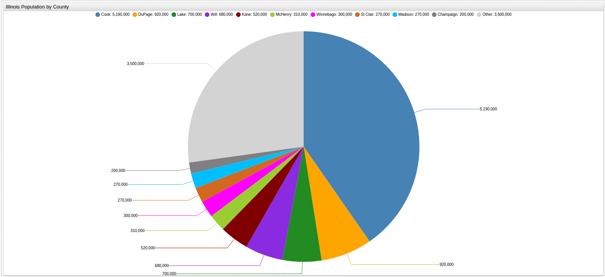
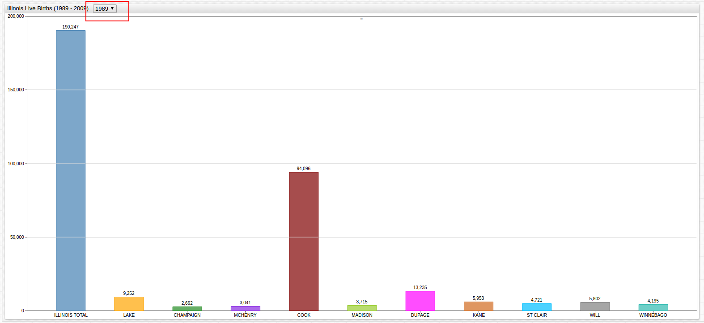
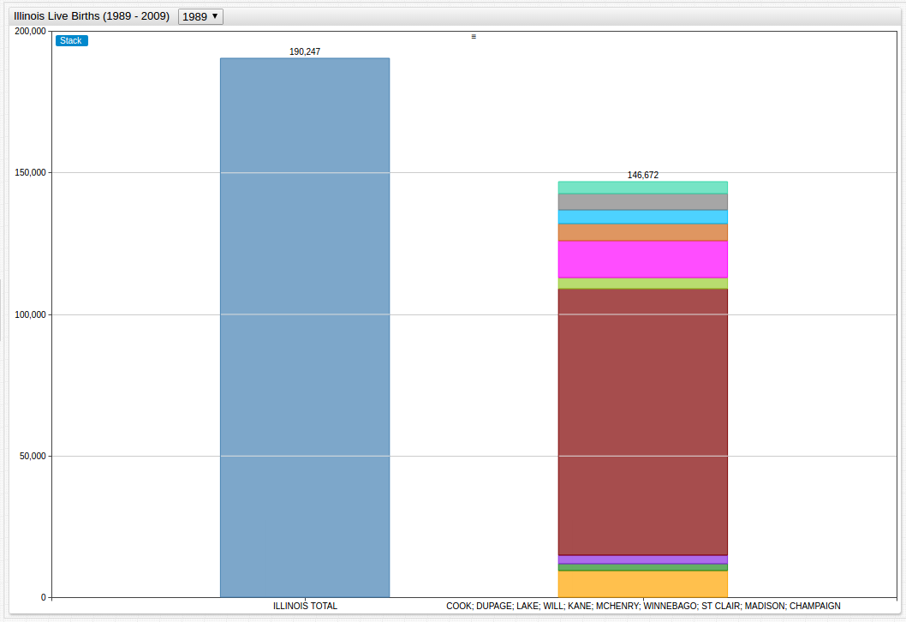
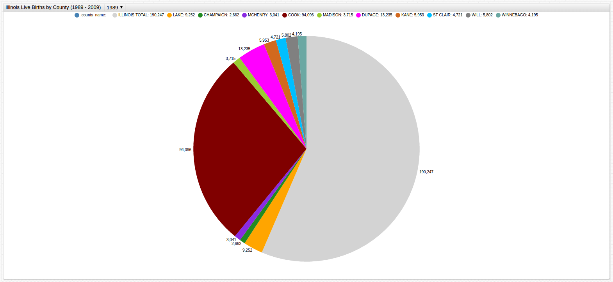
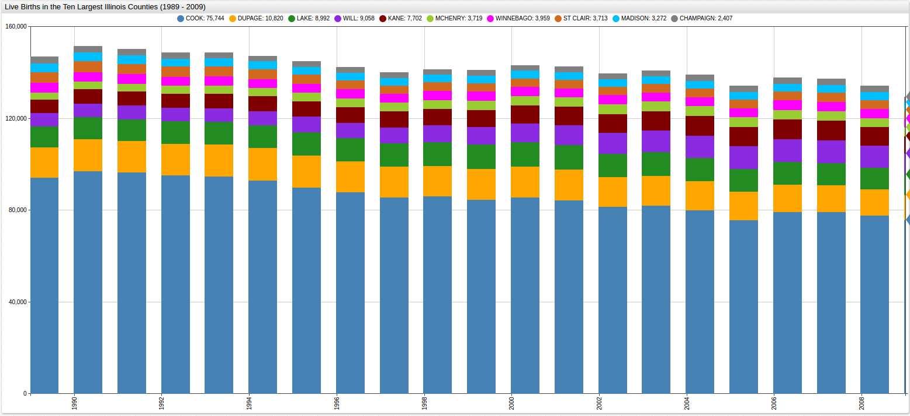
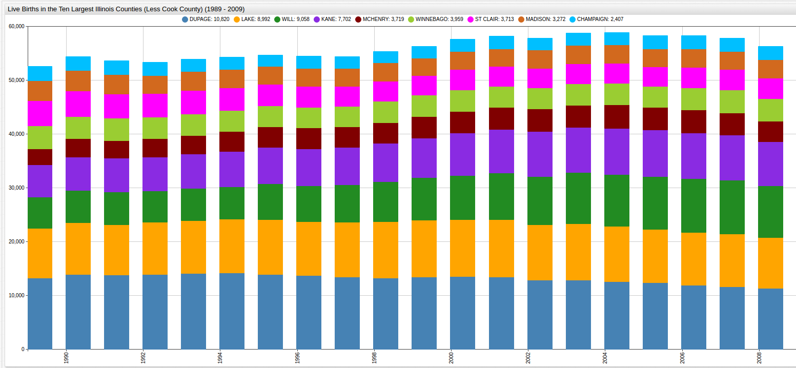
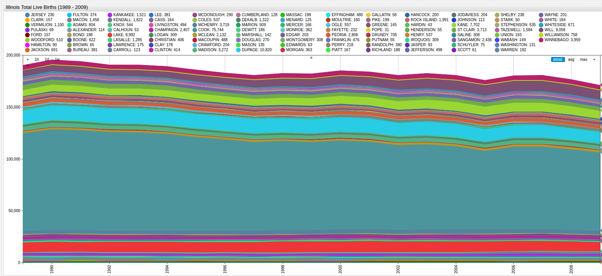
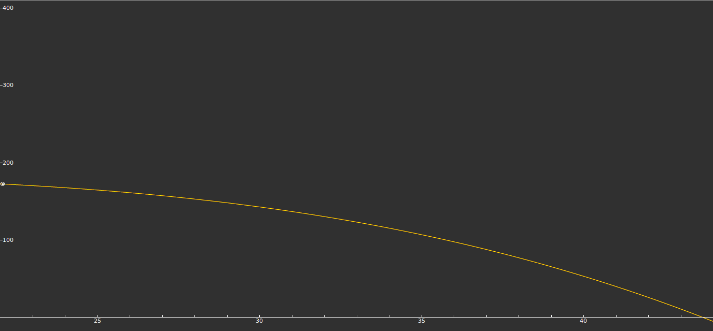
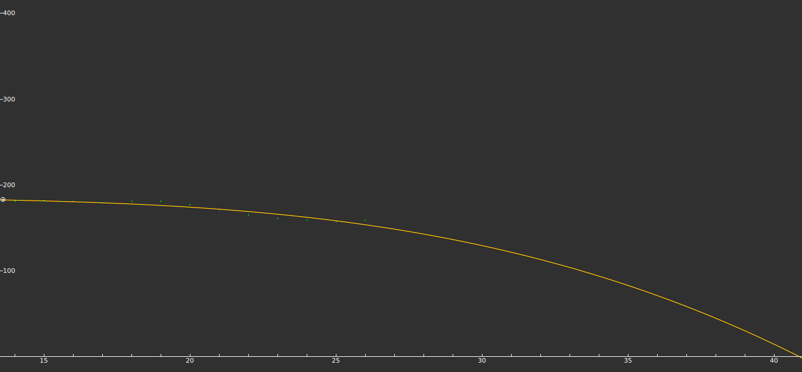

Modeling Falling Birthrates in the Prairie State
===


###Introduction
Long-considered to be a bellwether for trends in the rest of the country, the nation's
21st state has grown from a tiny, sparsely-populated part of the Northwest Territory to
the home of Chicago, the third-largest city in the country. Illinois holds the headquarters
to some of the largest and most successful corporations in the United States including Boeing, Walgreens
Boots Alliance, McDonald's, Sears Holdings, and United Continental. The University of
Chicago has contributed countless innovations to the fields of business, economics, law,
political science, and physics, among others, and is consistently ranked among the
ten best universites in the country. Occasionally marred by political corruption, five state governors have been found
guilty of misuse of power since the 1920's and a number of other state officials have 
also served time in prison as a result of their actions in office.

Home to some of America's favorite anti-heroes like Charlie Birger and Al Capone as well
as some of the country's icons like former presidents Abraham Lincoln and
Barack Obama, it's not hard to understand why Illinois is considered as diverse and
unique as the country itself.

The [Illinois Center for Health Statistics](www.dph.illinois.gov/data-statistics) has released data that covers two decades of
live births in the state, from 1989 to 2009. This data has been kept through some of the
formative events of the 20th and 21st centuries: the fall of the Berlin Wall, the World Trade Center
terrorist attacks, the Pathfinder mission to Mars, the completion of the Burj Khalifa, and 
the emergence of the Internet to name a few.

Using the [Axibase Time Series Database](https://axibase.com) and the open source modelling software [Fityk](http://fityk.nieto.pl/),
the ICHS data can be visualized, modeled, and analyzed to extract valuable information from free public data.

###Data

Analysis of these data has been divided into three sections, the first uses visualization to capture
the information as a whole, the second queries the data in the [SQL Console](https://github.com/axibase/atsd/tree/master/api/sql), and the third uses curve
fitting to anticipate future birth rates.

####Visualizations

Illinois contains 102 counties, the top ten most populous of which will be observed here. 
They are:


| Rank | County | County Seat | Population (Million) |
|------|--------|-------------|----------------------|
| 1 | Cook County | Chicago | 5.19 |
| 2 | DuPage County | Wheaton | 0.92 |
| 3 | Lake County | Waukegan | 0.70 |
| 4 | Will County | Joliet | 0.68 |
| 5 | Kane County | Geneva | 0.52 |
| 6 | McHenry County | Woodstock | 0.31 |
| 7 | Winnebago County | Rockford | 0.30 |
| 8 | St. Clair County | Belleville | 0.27 |
| 9 | Madison County | Edwardsville | 0.27 |
| 10 | Champaign County* | Urbana | 0.20 |

> \* Champaign County was the only top ten county by population to not appear as a top ten
county by birthrate, consistently out-performed by the smaller Peoria County (Population: 0.19 million).



Open [ChartLab](https://apps.axibase.com/chartlab/6402f01c) to explore the number of live births in each of the counties listed above
and navigate throughout the 20-year time period using the dropdown menu at the top of
the display, highlighted below.



[](https://apps.axibase.com/chartlab/6402f01c/51/#fullscreen)

>Learn more about creating a Dropdown menu in ChartLab in the [Appendix](#appendix) below.

Use the ChartLab model below to compare the Top 10 counties' live births against the
whole of Illinois' live births. Toggle between observed years using the dropdown menu:



[](https://apps.axibase.com/chartlab/6402f01c/55/#fullscreen)

The ChartLab model below displays the same data, with those births not
included in the top ten counties displayed in grey:



[](https://apps.axibase.com/chartlab/6402f01c/92/#fullscreen)

Removing the Illinois total numbers, and observing the live births by year from each of
the ten largest counties:



[](https://apps.axibase.com/chartlab/6402f01c/69/#fullscreen)

Now removing Cook County figures, as they represent the majority of Illinois live births:



[](https://apps.axibase.com/chartlab/6402f01c/70/#fullscreen)

Now looking at the whole of Illinois live birth rates, not just those from the most
populous regions, their performance can be contrasted with the performance of the
state as a whole:



[](https://apps.axibase.com/chartlab/6402f01c/71/#fullscreen)

>Illinois birthrates have been steadily declining for the past several decades.

A simplified version of the above figure shows only Illinois total live births, from 1989
to 2009:


[](https://apps.axibase.com/chartlab/6402f01c/72/#fullscreen)

#### SQL Queries

Birth numbers can be gathered in five-year steps:

##### 1989: 

````sql
SELECT VALUE/10000 AS 'Live Births (10000)', TAGS.county_name AS 'County'
  FROM 1989 WHERE 'County' NOT IN ('Chicago', 'Suburban Cook')
GROUP BY TAGS.county_name, VALUE
  ORDER BY VALUE DESC, TAGS.county_name
LIMIT 11
````

````ls
| Live Births (10000) | County         | 
|---------------------|----------------| 
| 19.02               | ILLINOIS TOTAL | 
| 9.41                | COOK           | 
| 1.32                | DUPAGE         | 
| 0.93                | LAKE           | 
| 0.60                | KANE           | 
| 0.58                | WILL           | 
| 0.47                | ST CLAIR       | 
| 0.42                | WINNEBAGO      | 
| 0.37                | MADISON        | 
| 0.30                | MCHENRY        | 
| 0.28                | PEORIA         | 
````

##### 1994:

````sql
SELECT VALUE/10000 AS 'Live Births (10000)', TAGS.county_name AS 'County'
  FROM 1994 WHERE 'County' NOT IN ('Chicago', 'Suburban Cook')
GROUP BY TAGS.county_name, VALUE
  ORDER BY VALUE DESC, TAGS.county_name
LIMIT 11
````

````ls
| Live Births (10000) | County         | 
|---------------------|----------------| 
| 18.92               | ILLINOIS TOTAL | 
| 9.29                | COOK           | 
| 1.42                | DUPAGE         | 
| 1.00                | LAKE           | 
| 0.66                | KANE           | 
| 0.61                | WILL           | 
| 0.42                | ST CLAIR       | 
| 0.39                | WINNEBAGO      | 
| 0.37                | MCHENRY        | 
| 0.34                | MADISON        | 
| 0.28                | PEORIA         |  
````

##### 1999:

````sql
SELECT VALUE/10000 AS 'Live Births (10000)', TAGS.county_name AS 'County'
  FROM 1999 WHERE 'County' NOT IN ('Chicago', 'Suburban Cook')
GROUP BY TAGS.county_name, VALUE
  ORDER BY VALUE DESC, TAGS.county_name
LIMIT 11
````

````ls
| Live Births (10000) | County         | 
|---------------------|----------------| 
| 18.20               | ILLINOIS TOTAL | 
| 8.45                | COOK           | 
| 1.34                | DUPAGE         | 
| 1.06                | LAKE           | 
| 0.78                | WILL           | 
| 0.74                | KANE           | 
| 0.40                | MCHENRY        | 
| 0.40                | WINNEBAGO      | 
| 0.37                | ST CLAIR       | 
| 0.33                | MADISON        | 
| 0.26                | PEORIA         | 
````

##### 2004:

````sql
SELECT VALUE/10000 AS 'Live Births (10000)', TAGS.county_name AS 'County'
  FROM 2004 WHERE 'County' NOT IN ('Chicago', 'Suburban Cook')
GROUP BY TAGS.county_name, VALUE
  ORDER BY VALUE DESC, TAGS.county_name
LIMIT 11
````

````ls
| Live Births (10000) | County         | 
|---------------------|----------------| 
| 18.07               | ILLINOIS TOTAL | 
| 8.00                | COOK           | 
| 1.26                | DUPAGE         | 
| 1.03                | LAKE           | 
| 0.96                | WILL           | 
| 0.86                | KANE           | 
| 0.44                | MCHENRY        | 
| 0.40                | WINNEBAGO      | 
| 0.37                | ST CLAIR       | 
| 0.34                | MADISON        | 
| 0.27                | PEORIA         | 
````

##### 2009:

````sql
SELECT VALUE/10000 AS 'Live Births (10000)', TAGS.county_name AS 'County'
  FROM 2009 WHERE 'County' NOT IN ('Chicago', 'Suburban Cook')
GROUP BY TAGS.county_name, VALUE
  ORDER BY VALUE DESC, TAGS.county_name
LIMIT 11
````

````ls
| Live Births (10000) | County         | 
|---------------------|----------------| 
| 17.11               | ILLINOIS TOTAL | 
| 7.57                | COOK           | 
| 1.08                | DUPAGE         | 
| 0.91                | WILL           | 
| 0.90                | LAKE           | 
| 0.77                | KANE           | 
| 0.40                | WINNEBAGO      | 
| 0.37                | MCHENRY        | 
| 0.37                | ST CLAIR       | 
| 0.33                | MADISON        | 
| 0.28                | PEORIA         | 
````

Likewise, county totals can be gathered using the same five-year steps, but evaluating for
the entire observed time and not one-year segments: 

##### 1989 - 1993:

````sql
SELECT (t1.VALUE + t2.VALUE + t3.VALUE + t4.VALUE + t5.VALUE)/10000 AS 'Live Births (10000)', t1.TAGS.county_name AS 'County'
  FROM 1989 t1 JOIN 1990 t2 JOIN 1991 t3 JOIN 1992 t4 JOIN 1993 t5
WHERE t1.TAGS.county_name = t2.TAGS.county_name AND t1.TAGS.county_name NOT IN ('Chicago','Suburban Cook')
  GROUP BY t1.TAGS.county_name, t1.VALUE, t2.VALUE, t3.VALUE, t4.VALUE, t5.VALUE
ORDER BY t1.VALUE DESC, t1.TAGS.county_name
  LIMIT 11
````

````ls
| Live Births (10000) | County         | 
|---------------------|----------------| 
| 96.14               | ILLINOIS TOTAL | 
| 47.72               | COOK           | 
| 6.88                | DUPAGE         | 
| 4.80                | LAKE           | 
| 3.11                | KANE           | 
| 2.96                | WILL           | 
| 2.26                | ST CLAIR       | 
| 2.05                | WINNEBAGO      | 
| 1.81                | MADISON        | 
| 1.65                | MCHENRY        | 
| 1.40                | PEORIA         |  
````

##### 1994 - 1998:

````sql
SELECT (t1.VALUE + t2.VALUE + t3.VALUE + t4.VALUE + t5.VALUE)/10000 AS 'Live Births (10000)', t1.TAGS.county_name AS 'County'
  FROM 1994 t1 JOIN 1995 t2 JOIN 1996 t3 JOIN 1997 t4 JOIN 1998 t5
WHERE t1.TAGS.county_name = t2.TAGS.county_name AND t1.TAGS.county_name NOT IN ('Chicago','Suburban Cook')
  GROUP BY t1.TAGS.county_name, t1.VALUE, t2.VALUE, t3.VALUE, t4.VALUE, t5.VALUE
ORDER BY t1.VALUE DESC, t1.TAGS.county_name
  LIMIT 11
````

````ls
| Live Births (10000) | County         | 
|---------------------|----------------| 
| 92.12               | ILLINOIS TOTAL | 
| 44.22               | COOK           | 
| 6.85                | DUPAGE         | 
| 5.08                | LAKE           | 
| 3.43                | KANE           | 
| 3.37                | WILL           | 
| 1.96                | ST CLAIR       | 
| 1.94                | WINNEBAGO      | 
| 1.91                | MCHENRY        | 
| 1.68                | MADISON        | 
| 1.35                | PEORIA         | 
````

##### 1999 - 2003:

````sql
SELECT (t1.VALUE + t2.VALUE + t3.VALUE + t4.VALUE + t5.VALUE)/10000 AS 'Live Births (10000)', t1.TAGS.county_name AS 'County'
  FROM 1999 t1 JOIN 2000 t2 JOIN 2001 t3 JOIN 2002 t4 JOIN 2003 t5
WHERE t1.TAGS.county_name = t2.TAGS.county_name AND t1.TAGS.county_name NOT IN ('Chicago','Suburban Cook')
  GROUP BY t1.TAGS.county_name, t1.VALUE, t2.VALUE, t3.VALUE, t4.VALUE, t5.VALUE
ORDER BY t1.VALUE DESC, t1.TAGS.county_name
  LIMIT 11
````

````ls
| Live Births (10000) | County         | 
|---------------------|----------------| 
| 91.40               | ILLINOIS TOTAL | 
| 41.79               | COOK           | 
| 6.61                | DUPAGE         | 
| 5.27                | LAKE           | 
| 4.31                | WILL           | 
| 4.00                | KANE           | 
| 2.05                | MCHENRY        | 
| 1.99                | WINNEBAGO      | 
| 1.84                | ST CLAIR       | 
| 1.67                | MADISON        | 
| 1.31                | PEORIA         | 
````

##### 2004 - 2008

````sql
SELECT (t1.VALUE + t2.VALUE + t3.VALUE + t4.VALUE + t5.VALUE)/10000 AS 'Live Births (10000)', t1.TAGS.county_name AS 'County'
  FROM 2004 t1 JOIN 2005 t2 JOIN 2006 t3 JOIN 2007 t4 JOIN 2008 t5
WHERE t1.TAGS.county_name = t2.TAGS.county_name AND t1.TAGS.county_name NOT IN ('Chicago','Suburban Cook')
  GROUP BY t1.TAGS.county_name, t1.VALUE, t2.VALUE, t3.VALUE, t4.VALUE, t5.VALUE
ORDER BY t1.VALUE DESC, t1.TAGS.county_name
  LIMIT 11
````

````ls
| Live Births (10000) | County         | 
|---------------------|----------------| 
| 89.72               | ILLINOIS TOTAL | 
| 39.19               | COOK           | 
| 5.98                | DUPAGE         | 
| 4.94                | LAKE           | 
| 4.89                | WILL           | 
| 4.24                | KANE           | 
| 2.07                | MCHENRY        | 
| 2.04                | WINNEBAGO      | 
| 1.89                | ST CLAIR       | 
| 1.69                | MADISON        | 
| 1.35                | PEORIA         |  
````

Information can also be collected on a desired county, for the entire period:

##### Cook County Live Births (1989 - 2009)

```sql
SELECT DATE_FORMAT(TIME, 'yyyy') AS 'Year', TAGS.county_name AS 'County', VALUE/100000 AS 'Live Births (10000)'
  FROM 'year.9e74-xdvk.value'
WHERE 'County' = 'COOK'
  GROUP BY 'County', VALUE, 'Year'
ORDER BY 'Year'
```

```ls
| Year | County | Live Births (10000) | 
|------|--------|---------------------| 
| 1989 | COOK   | 0.94                | 
| 1990 | COOK   | 0.97                | 
| 1991 | COOK   | 0.96                | 
| 1992 | COOK   | 0.95                | 
| 1993 | COOK   | 0.95                | 
| 1994 | COOK   | 0.93                | 
| 1995 | COOK   | 0.90                | 
| 1996 | COOK   | 0.88                | 
| 1997 | COOK   | 0.86                | 
| 1998 | COOK   | 0.86                | 
| 1999 | COOK   | 0.85                | 
| 2000 | COOK   | 0.86                | 
| 2001 | COOK   | 0.84                | 
| 2002 | COOK   | 0.82                | 
| 2003 | COOK   | 0.82                | 
| 2004 | COOK   | 0.80                | 
| 2005 | COOK   | 0.76                | 
| 2006 | COOK   | 0.79                | 
| 2007 | COOK   | 0.79                | 
| 2008 | COOK   | 0.78                | 
| 2009 | COOK   | 0.76                | 
```

#### Curve Fitting

Data points can also be collected using an SQL query.

Illinois Total Live Births:

````
SELECT DATE_FORMAT(TIME, 'yyyy') AS 'Year', TAGS.county_name AS 'County', VALUE/100000 AS 'Live Births (10000)'
  FROM 'year.9e74-xdvk.value'
WHERE 'County' = 'ILLINOIS TOTAL'
  GROUP BY 'County', VALUE, 'Year'
ORDER BY 'Year'
````

````
| Year | County         | Live Births (10000) | 
|------|----------------|---------------------| 
| 1989 | ILLINOIS TOTAL | 1.90                | 
| 1990 | ILLINOIS TOTAL | 1.95                | 
| 1991 | ILLINOIS TOTAL | 1.94                | 
| 1992 | ILLINOIS TOTAL | 1.91                | 
| 1993 | ILLINOIS TOTAL | 1.91                | 
| 1994 | ILLINOIS TOTAL | 1.89                | 
| 1995 | ILLINOIS TOTAL | 1.86                | 
| 1996 | ILLINOIS TOTAL | 1.83                | 
| 1997 | ILLINOIS TOTAL | 1.81                | 
| 1998 | ILLINOIS TOTAL | 1.83                | 
| 1999 | ILLINOIS TOTAL | 1.82                | 
| 2000 | ILLINOIS TOTAL | 1.85                | 
| 2001 | ILLINOIS TOTAL | 1.84                | 
| 2002 | ILLINOIS TOTAL | 1.81                | 
| 2003 | ILLINOIS TOTAL | 1.82                | 
| 2004 | ILLINOIS TOTAL | 1.81                | 
| 2005 | ILLINOIS TOTAL | 1.79                | 
| 2006 | ILLINOIS TOTAL | 1.81                | 
| 2007 | ILLINOIS TOTAL | 1.81                | 
| 2008 | ILLINOIS TOTAL | 1.77                | 
| 2009 | ILLINOIS TOTAL | 1.71                | 
````

The data set used for modeling is as follows:

| Year | X | Y |
|------|---|---|
| 1989 | 1 | 190 |
| 1990 | 2 | 195 |
| 1991 | 3 | 194 |
| 1992 | 4 | 191 |
| 1993 | 5 | 191 |
| 1994 | 6 | 189 |
| 1995 | 7 | 186 |
| 1996 | 8 | 183 |
| 1997 | 9 | 181 |
| 1998 | 10| 183 |
| 1999 | 11| 182 |
| 2000 | 12| 185 |
| 2001 | 13| 184 |
| 2002 | 14| 181 |
| 2003 | 15| 182 |
| 2004 | 16| 181 |
| 2005 | 17| 179 |
| 2006 | 18| 181 |
| 2007 | 19| 181 |
| 2008 | 20| 177 |
| 2009 | 21| 171 |

Using [Fityk](http://fityk.nieto.pl/) to create a best-fit model for this data:

##### Model 1


The associated formula is shown below:

``
F(x) = 197 + -2.59*x + 0.179*x^2 + -0.00511*x^3
``

Moving the window to the right estimates the total live births for years not included in the table above:



Excluding the final data point from the series, which deviated significantly, creates a less extreme model:

##### Model 2


This model's formula is:

``F(x) = 196 + -1.7*x + 0.0587*x^2 + -0.000794*x^3``

And the same forward-shift of the viewing window:


To test the accuracy of each model, [live birth figures](http://www.dph.illinois.gov/data-statistics/vital-statistics/birth-statistics) from years not included in the data set but
available from the [Illinois Department of Public Health](http://www.dph.illinois.gov/) can be used,
and [WolframAlpha](https://wolframalpha.com) can manage the computations.  

| Year | Live Births (Estimated) Model 1, Model 2 (Hundred Thousand) | Live Births (Actual) (Hundred Thousand) | % Error Model 1, Model 2 |
|------|------------------------------------------|----------------------|--------------------------|
| 2010* | 172, 179 | 165 | 4.06%, 7.82% | 
| 2011 | 169, 178 | 161 | 4.96%, 10.56% |
| 2012 | 167, 178 | 159 | 5.03%, 11.95% |
| 2013 | 164, 178 | 157 | 4.46%, 13.37% |
| 2014 | 160, 178 | 159 | 6.29%, 11.95% |

> \* Indicates a year in which the US Census was performed. 

Model 1 more accurately predicts the results of recent live birth numbers, and the variance is reasonable, 0.7085. 
Model 2 less accurately predicts the results of recent live birth numbers and its variance is quite high, 4.4109. These numbers show the stability of the model
over the course of a given period of time.

Despite its stability for the given data and relative accuracy in predicting birthrates outside of the
training data, Model 1 begins to lose effectiveness about fifteen years outside of the originally observed period, 
underlining the importance of constantly updating and maintaining such models with new information.

When updated to include the latest figures, the model looks like this:
##### Model 3 


This updated model's formula is shown here:

``F(x) = 197 + -2.53*x + 0.189*x^2 + -0.006*x^3``

The forward-shift is shown below:



Intuitively, this model appears flawed as it shows Illinois live births dropping to zero around the
year 2038, but some of the older data can now be excluded, in order to reflect the trends of the
last decade while excluding data that is two decades old and reflects the trends of a society 
that has experienced a wide array of dramatic changes:

##### Model 4


This newly updated model's formula is shown here:

``F(x) = 81.9 + 17.6*x + -0.929*x^2 + 0.0139*x^3``

The forward-shift is shown below:


Considering population dynamics, such as human factors like economic opportunity, is also paramount
when attempting to design models for a longer span of time, or for non-stationary populations.

Using model 4 to predict United States Census numbers for the next two Censuses is shown below:

| Census Year | Model 4 Prediction (Hundred Thousand Live Births) |
|-------------|---------------------------------------------------|
| 2020 | 149 |
| 2030 | 212 |

The instability that afflicted Model 1 too far outside the training data, appears to be at work 
here as well.

### Conclusions

The falling Illinois birthrates have been noted by [policy groups](https://www.illinoispolicy.org/illinois-losing-1-resident-every-4-6-minutes-could-fall-behind-pennsylvania-in-population/) 
and [investment firms](https://www.illinoispolicy.org/heres-why-moodys-is-warning-of-an-illinois-death-spiral/) that have
expressed concern for the future of the Land of Lincoln. Some have noted the continued inability of
Illinois residents to reproduce at replacement rates and pointed to formerly decadent American
cities like Detroit as the likely outcome of the continuation of such trends, while others including the [Center for Disease Control](https://www.cdc.gov/) (CDC) 
have released [predictions](https://wonder.cdc.gov/population-projections.html) that claim that by the time of the 2020 Census, 
birthrates will have stabilized or even seen a surge similar to the one in the early 90's. 
The fourth model produced here predicted similar growth as well, showing a local minima during the year 2019
followed by growth in the number of live births the following year. 

The only true certainty is that any such modeling should be taken with a grain of salt and interpreted 
with the understanding that such predictions are based on the continuation of current trends 
which can change quite quickly and sometimes unpredictably.

### Appendix

#### Creating a [Dropdown Menu](https://axibase.com/products/axibase-time-series-database/visualization/widgets/dropdown/) in [ChartLab](https://apps.axibase.com/chartlab/6402f01c)

Using the below chart as an example:


And looking at lines 22 - 48 in the Editor:


The `LIST` Setting is used to declare the desired list, in this case, the various
years of included in the data and the [`[DROPDOWN]`](https://axibase.com/products/axibase-time-series-database/visualization/widgets/dropdown/)
clause is used to declare the functionality of the menu itself. 

### Action Items

1. Download [Docker](https://docs.docker.com/engine/installation/linux/ubuntu/).
2. Download the [docker-compose.yml](Resources/docker-compose.yml) file to launch the ATSD 
container bundle.
3. Launch containers by specifying the built-in collector account credentials that will be used by Axibase Collector to insert data into ATSD.

```sh
   export C_USER=myuser; export C_PASSWORD=mypassword; docker-compose pull && docker-compose up -d
   ```

Contact [Axibase](https://axibase.com/feedback/) with any questions.