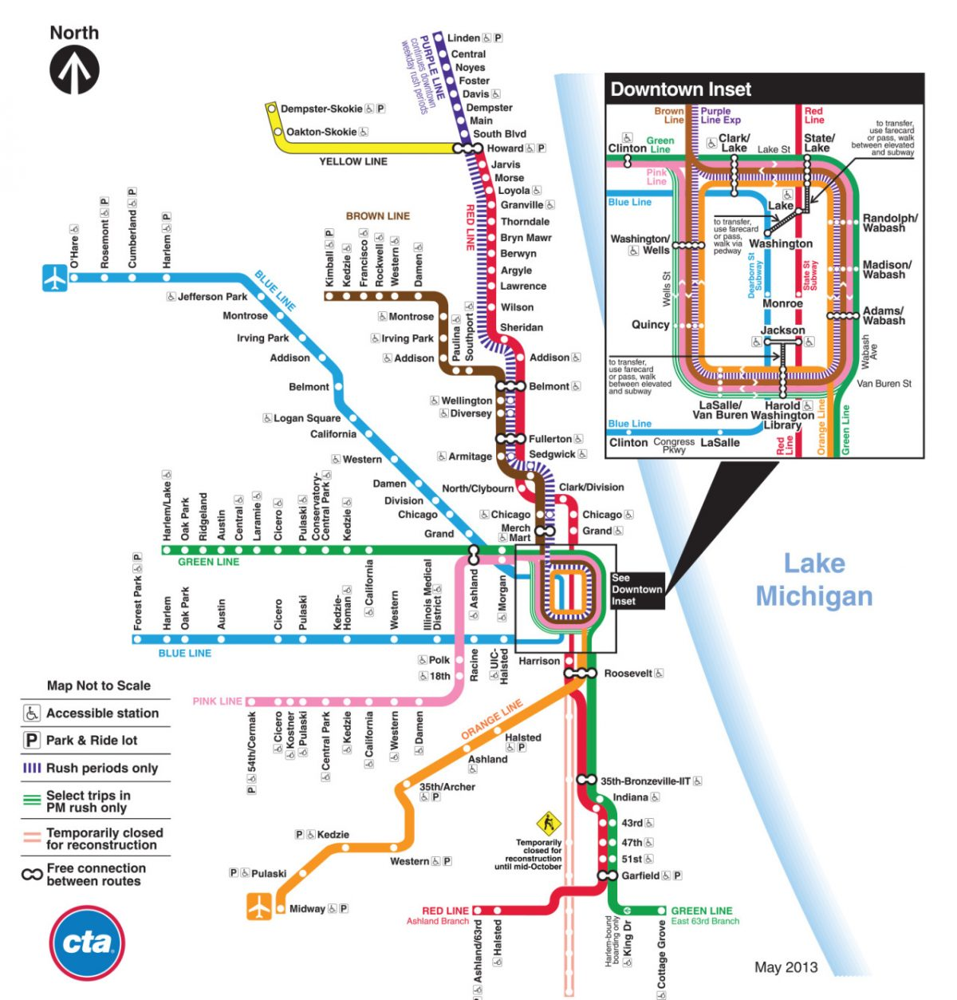
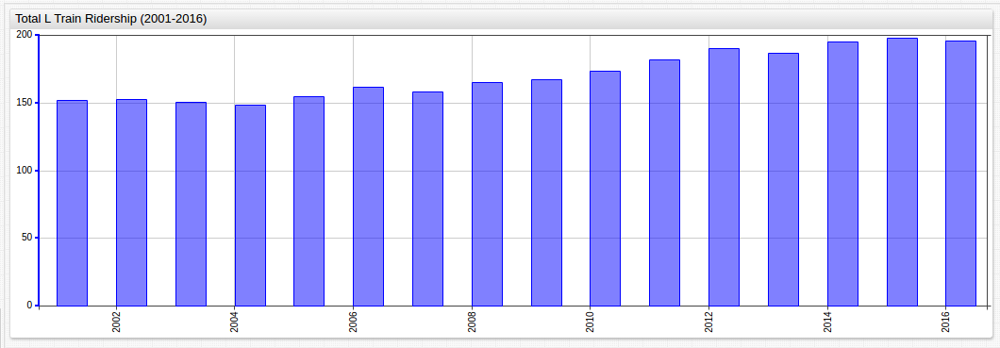
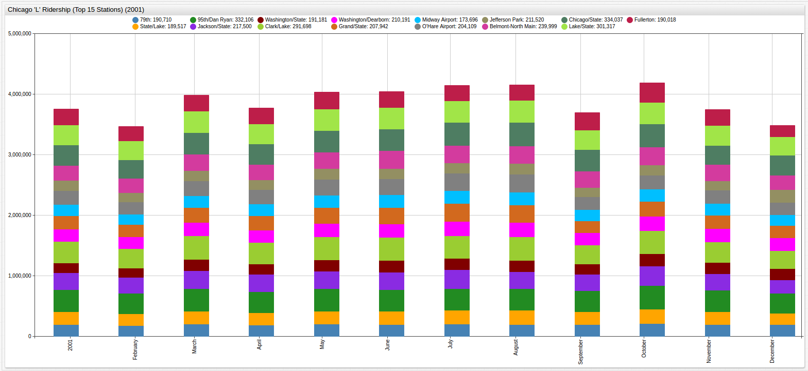
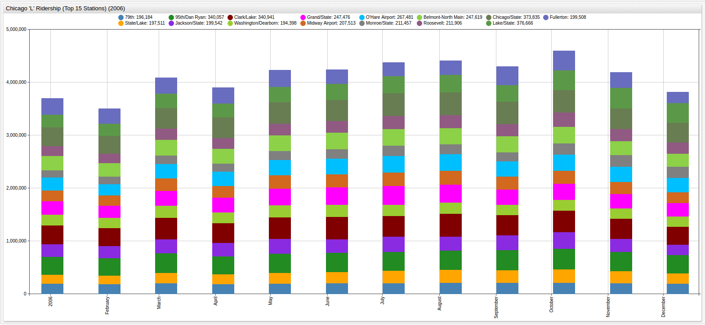
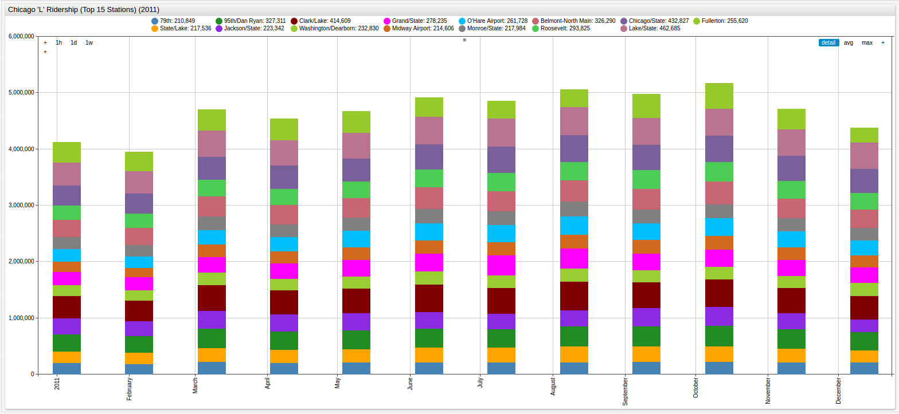
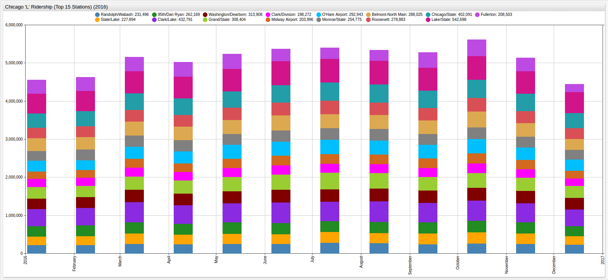

Taking the Chicago 'L' Train in 2025
===



#### Introduction

Chicago's Elevated Train, or the L as it has come to be known, is a fixture of the city, with portions of the second-busiest transit system in the United States operating
since 1892. The L sees close to a million passengers every day spread across its 145 stations and more 
than 100 miles of tracks. 

#### Methodology

Using [ridership data](https://github.com/axibase/open-data-catalog/blob/master/datasets/t2rn-p8d7.md) released by the City
of Chicago rider estimates can be made for the future. Analytics tools from [Axibase](https://axibase.com)
can model current ridership trends to highlight patterns in transit system usage and Future Value models can be used to
estimate future rider totals. The population of Chicago is falling, and it's the only major United 
States metropolitan to experience such changes, but unfortunately, that is unlikely to mean an extra seat opening up on 
your commute home. Although currently in a period of growth stagnation, the City of Chicago has plans to fully update and
re-brand the L to adapt it to the modern city landscape and help it to regain its relevance in the age of the mass car ownership.

Four instances in time will be examined: 2001, 2006, 2011, and 2016, to establish standards of annual ridership. Month-to-month
data will be visualized to show usage trends throughout the year and finally, future ridership predictions will be made
for the years 2020 and 2025.

#### Data

Open the visualization below in [ChartLab](https://axibase.com) to see the data in its entirety. Use the drop-down menus at
the top to navigate through time, selecting the years to be observed. Use the third drop-down menu to toggle between visualizations
of the top or bottom fifteen stations, the top or bottom fifty stations, or select the wildcard [`*`](https://axibase.com/products/axibase-time-series-database/visualization/widgets/selecting-series/) 
option to see all 145.


[](https://apps.axibase.com/chartlab/b6a1a2cc/7/#fullscreen)

To establish annual ridership averages, passenger totals for the fifteen busiest stations will be used. Although these stations
make up just 10% of the L's total stations, the passenger traffic between them accounted for a third of the total annual
traffic. This is a dynamic group of stations, meaning that the busiest stations in 2001 were not necessarily the busiest
stations in 2016, however, the purpose of such partitioning is merely to sample a relevant section of the whole, not to
comment on the features of a specific station.

###### Total Passengers

```sql
SELECT date_format(time, 'yyyy') AS "Year", SUM(value)/1000000 AS "Passenger Total (Million)"
  FROM monthtotal
GROUP BY date_format(time, 'yyyy')
  ORDER BY 'Year' ASC
```

```ls
| Year | Passenger Total (Million) | 
|------|---------------------------| 
| 2001 | 151.74                    | 
| 2002 | 152.36                    | 
| 2003 | 150.32                    | 
| 2004 | 148.31                    | 
| 2005 | 154.99                    | 
| 2006 | 161.97                    | 
| 2007 | 157.90                    | 
| 2008 | 165.29                    | 
| 2009 | 167.22                    | 
| 2010 | 173.56                    | 
| 2011 | 182.21                    | 
| 2012 | 189.96                    | 
| 2013 | 186.71                    | 
| 2014 | 194.83                    | 
| 2015 | 198.04                    | 
| 2016 | 195.56                    | 
```



[](https://apps.axibase.com/chartlab/4e2ef3cc/2/#fullscreen)

While it is certainly possible that L ridership has peaked and will begin to decline in the future, a total of three such
periods of stagnation were seen throughout the observation period of sixteen years leading to the conclusion that there are and always
have been occasional decreases in annual ridership that are not necessarily indicative of true decline.

###### 2001

```sql
SELECT tags.stationame AS "Station", SUM(value)/1000000 AS "Passenger Total (Million)"
  FROM monthtotal WHERE date_format(time, 'yyyy') = '2001'
GROUP BY 'Station', date_format(time, 'yyyy')
  ORDER BY SUM(value) DESC
LIMIT 15
```

```ls
| Station             | Passenger Total (Million) | 
|---------------------|---------------------------| 
| 95th/Dan Ryan       | 4.34                      | 
| Clark/Lake          | 4.27                      | 
| Chicago/State       | 4.22                      | 
| Lake/State          | 4.07                      | 
| Jackson/State       | 3.35                      | 
| Belmont-North Main  | 3.22                      | 
| Fullerton           | 3.13                      | 
| Grand/State         | 2.89                      | 
| O'Hare Airport      | 2.88                      | 
| Washington/Dearborn | 2.60                      | 
| State/Lake          | 2.55                      | 
| Midway Airport      | 2.36                      | 
| 79th                | 2.35                      | 
| Clark/Division      | 2.26                      | 
| 69th                | 2.19                      | 
```



[](https://apps.axibase.com/chartlab/2c9f96cf/7/#fullscreen)

Similar increases and decreases in L ridership can be seen when the scale of the observation period is reduced to one year.
Drag the window to the left or right to shows rider numbers of any given month in the legend at the top of the screen.

###### 2006

```sql
SELECT tags.stationame AS "Station", SUM(value)/1000000 AS "Passenger Total (Million)"
  FROM monthtotal WHERE date_format(time, 'yyyy') = '2006'
GROUP BY 'Station', date_format(time, 'yyyy')
  ORDER BY SUM(value) DESC
LIMIT 15
```

```ls
| Station             | Passenger Total (Million) | 
|---------------------|---------------------------| 
| Chicago/State       | 4.75                      | 
| Clark/Lake          | 4.62                      | 
| 95th/Dan Ryan       | 4.32                      | 
| Lake/State          | 3.71                      | 
| Grand/State         | 3.48                      | 
| Fullerton           | 3.46                      | 
| Belmont-North Main  | 3.46                      | 
| O'Hare Airport      | 3.36                      | 
| Jackson/State       | 3.12                      | 
| Midway Airport      | 2.80                      | 
| Roosevelt           | 2.65                      | 
| Washington/Dearborn | 2.52                      | 
| State/Lake          | 2.51                      | 
| Addison-North Main  | 2.48                      | 
| 79th                | 2.41                      | 
```



[](https://apps.axibase.com/chartlab/2c9f96cf/8/#fullscreen)

###### 2011

```sql
SELECT tags.stationame AS "Station", SUM(value)/1000000 AS "Passenger Total (Million)"
  FROM monthtotal WHERE date_format(time, 'yyyy') = '2011'
GROUP BY 'Station', date_format(time, 'yyyy')
  ORDER BY SUM(value) DESC
LIMIT 15
```

```ls
| Station             | Passenger Total (Million) | 
|---------------------|---------------------------| 
| Lake/State          | 5.53                      | 
| Clark/Lake          | 5.37                      | 
| Chicago/State       | 5.14                      | 
| Fullerton           | 4.25                      | 
| Belmont-North Main  | 4.21                      | 
| 95th/Dan Ryan       | 4.02                      | 
| Roosevelt           | 3.65                      | 
| Grand/State         | 3.51                      | 
| Jackson/State       | 3.49                      | 
| O'Hare Airport      | 3.33                      | 
| State/Lake          | 2.95                      | 
| Addison-North Main  | 2.92                      | 
| Monroe/State        | 2.81                      | 
| Midway Airport      | 2.65                      | 
| Washington/Dearborn | 2.56                      | 
```



[](https://apps.axibase.com/chartlab/2c9f96cf/9/#fullscreen)

Here the month of February is the only month where ridership fell below four million people among the top fifteen stations
while in 2001 four million riders among the top fifteen stations would have ranked as one of the busiest months of the year, showing
the relative overall growth of L ridership as a whole.

###### 2016

```sql
SELECT tags.stationame AS "Station", SUM(value)/1000000 AS "Passenger Total (Million)"
  FROM monthtotal WHERE date_format(time, 'yyyy') = '2016'
GROUP BY 'Station', date_format(time, 'yyyy')
  ORDER BY SUM(value) DESC
LIMIT 15
```

```ls
| Station             | Passenger Total (Million) | 
|---------------------|---------------------------| 
| Lake/State          | 7.01                      | 
| Clark/Lake          | 5.97                      | 
| Chicago/State       | 5.26                      | 
| Grand/State         | 4.30                      | 
| Belmont-North Main  | 4.29                      | 
| Fullerton           | 4.10                      | 
| O'Hare Airport      | 4.00                      | 
| Roosevelt           | 3.81                      | 
| Washington/Dearborn | 3.80                      | 
| 95th/Dan Ryan       | 3.47                      | 
| Monroe/State        | 3.45                      | 
| Jackson/State       | 3.30                      | 
| Addison-North Main  | 3.16                      | 
| State/Lake          | 3.15                      | 
| Randolph/Wabash     | 3.01                      | 
```



[](https://apps.axibase.com/chartlab/2c9f96cf/10/#fullscreen)

###### Calculation

Because of the nature of L ridership, and the patterns observed in the visualizations above, using data from the previous
year as a baseline for performance during the current year is reasonable. Ridership is increasing consistently when aggregating
the data in five year interval periods. Despite this, there still exists occasional periods of stagnation that must be considered, 
which is why a second baseline must be established. Using an Average Value Baseline makes sense given the fluctuations in passenger totals because 
such a calculation would account for both positive and negative changes in ridership and combine them for calculation of 
future year averages.

Similar to the financial model for calculating Future Value (FV) of an investment, the following formula Can be used to 
predict ridership on the L several years in to the future:

`FV = I * (1 + (R * T))`

Where, 

```ls
FV = Future Value (of Ridership)
I = Initial Amount, either the Previous Year Baseline, or Average Value Baseline
R = Rate of Increase, calculated below, the standard deviation of the percent change in AVB or the average percent change
of the PYB value.
T = Time in years, the difference in years between the current and calculated year.
```

| Year | Percent Change (Previous Year) | Percent Difference (Average Value Baseline*) |
|------|-------------------------------:|----------------------------------------:|
| 2001 | +0% | -12.49% | 
| 2002 | +0.41% | -12.03% | 
| 2003 | -1.36% | -13.55% |
| 2004 | -1.34% | -15.09% |
| 2005 | +4.31% | -9.20% |
| 2006 | +4.50% | -5.11% |
| 2007 | -2.51% | -8.10% |
| 2008 | +4.68% | -3.16% |
| 2009 | +1.17% | -2.08% |
| 2010 | +3.79% | +1.68% |
| 2011 | +4.98% | +6.75% |
| 2012 | +4.25% | +11.29% |
| 2013 | -1.71% | +9.39% |
| 2014 | +4.35% | +14.14% |
| 2015 | +1.65% | +16.02% |
| 2016 | -1.25% | +12.72% |

> For the given dataset, the average value baseline to be used is 170.69 million riders.

| Method | Average | Standard Deviation | Average Step |
|--------|--------:|-------------------:|--------------|
| PY | +1.62% | 2.75 | - |
| AVB | - | 10.89 | +1.49% | 

These calculations are meant to show two possible methods of predicting future ridership aboard the Chicago L train. The 
typical data would be within 1.62% of the previous year's ridership, and each year would represent one step from the annual 
average. This means that between any two given years, the difference should be roughly 1.49% multiplied 
by the number of years between them, and between any two given consecutive years, the ridership totals should be within 1.62% of 
each other. As the numbers are so close together, they can even be used in conjunction with one another, with the understanding 
that expected mean percentage error (MPE) will be on the order of 0.13% multiplied by the difference in years, or when speaking 
in terms of passengers, using the average amount for reference, two hundred thousand passengers times the difference in years.
This error will not be on an order higher that 10 x 10^-1 for these purposes, and merely speaks to the likelihood of the model to lose stability
as it attempts to predict rider amounts further and further into the future without inputting new training data and pruning
old training data.

#### Implementation

Using 2016 as Year 0, 2020 as Year 4, and 2025 as Year 9, and the methods described above, predictions can be made for ridership
aboard the Chicago L Train in the future.

| Year (t) | Rider Total (Million) (Avg of PYB and AVB) | MPE |
|------|:-----------:|:----:|
| 2016 (0) | 195.56 | +/- 0% (0 passengers)| 
| 2020 (4) | 207.88 | +/- 0.52% (8,000 passengers) |
| 2025 (9) | 230.90 | +/- 1.17% (18,000 passengers)|

Essentially, this model predicts the probable bounds of ridership aboard the Chicago L. As the amount of time between the
training data and the prediction grows, so too does the model's uncertainty, which is reflected by the growing difference
between the bounds of probable ridership.

#### Analysis

While probably too broad a model to be used for serious funds allocation or city planning, the applications of such a model
are fairly diverse. Future growth estimates are excellent for determining target values of a certain infrastructure and providing
bounds for more specific calculations that can act as guidelines for the results. As time passes, the training data can be 
modified to provide more time-specific information. If for example, L ridership has indeed peaked and the rate of its coming
decline were to be calculated, early 2000's training data could be excluded and more recent data could be included to predict
future, lower ridership levels using a new average value baseline, and updating the average percent change in the previous
year baseline number.

#### Conclusion

The City of Chicago pays close attention to L ridership levels and publishes [an annual report](http://www.transitchicago.com/performance/)
which details their own expectations for rider totals. For the reports available for 2017, the total number of riders
has been lower than the targeted amount posted by the Chicago Transit Authority, shown in the following [DOCUMENT-REMOVED-FROM-SOURCE](http://www.transitchicago.com/),
however, several station experienced significant growth in rider totals and the CTA has plans to open several new stations 
before the year 2020. With respect to the falling population in Chicago, and [Illinois as a whole](https://github.com/axibase/atsd-use-cases/blob/master/IllinoisBirthrates/README.md),
several analysts have predicted that the population of the Second City will stabilize and even begin to grow again by 2020,
so counting on the continued stagnation of transit riders in the city seems to be betting against the house.
