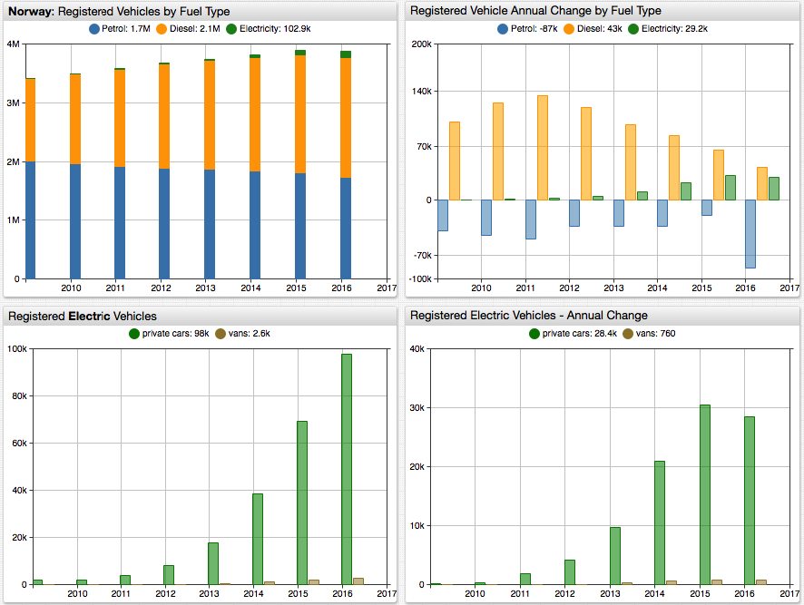
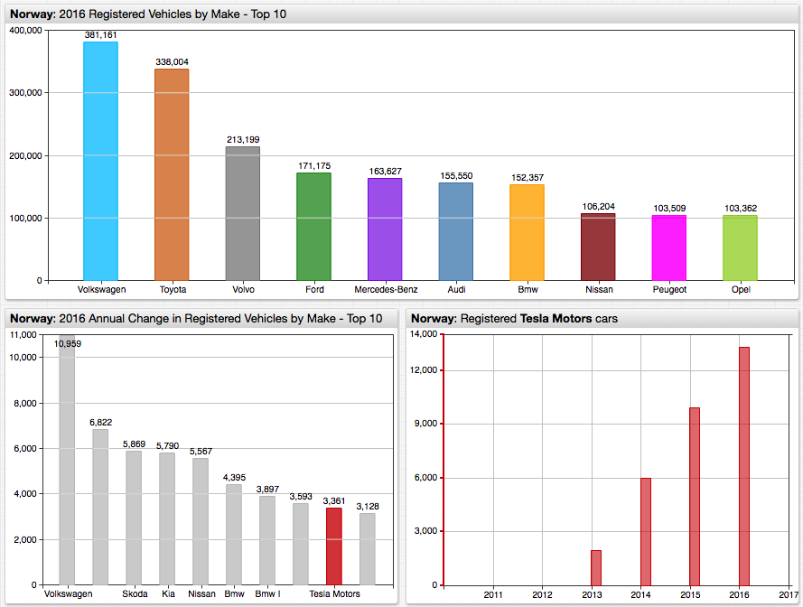
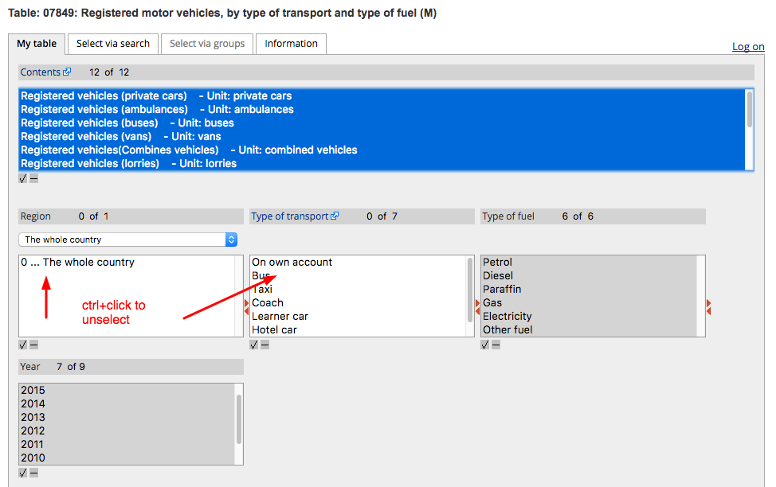

# Norway: Electric Vehicles Close the Gap with Diesel in 2016


Norway's central statistical agency, [SSB](https://www.ssb.no/statistikkbanken/selecttable/hovedtabellHjem.asp?KortNavnWeb=bilreg&CMSSubjectArea=transport-og-reiseliv&PLanguage=1&checked=true), released its annual car registration statistics on March 28, 2017. While the key trends such as the rotation out of gasoline models were still in place, the dataset delivered a few surprises.

* The electric vehicles (EVs) continued to gain ground however the pace of growth has slowed down. The installed base of EVs reached **100K** units, the annual increase was 29179 vehicles compared to 31271 vehicles in 2015.
* The unit growth of the EV installed base is getting closer to being on par with the diesel segment: 29179/42824 or **68%** in 2016 versus 31271/64708 or **48%** in 2015.
* The total number of registered Tesla Motors cars increased by 3361 units in 2016 compared to 3904 units in 2015, suggesting competition with less expensive EV models. Tesla's share in new EV registrations decreased to **11.5%** from **12.5%** in 2015 and from 18.7% in 2014.
* Starting with 2016, hybrid cars are classified under the `Other fuel` category (hence 90077 y-o-y growth) making direct comparisons for the old Petrol category difficult.

---

## Total Registered Vehicles

```sql
SELECT date_format(time, 'yyyy') AS "Year",
  sum(value) AS "Vehicles",
  sum(value) - LAG(sum(value)) AS "Change",
  ROUND(100*(sum(value) - LAG(sum(value)))/LAG(sum(value)), 1) AS "Change, %"
FROM nor.registered_vehicles
  WHERE tags.vehicle_type = 'Total'
  GROUP BY time
```

| Year | Vehicles | Change | Change, % |
|------|----------|--------|-----------|
| 2008 | 3352344  | null   | null      |
| 2009 | 3413877  | 61533  | 1.8       |
| 2010 | 3494873  | 80996  | 2.4       |
| 2011 | 3581905  | 87032  | 2.5       |
| 2012 | 3671885  | 89980  | 2.5       |
| 2013 | 3747489  | 75604  | 2.1       |
| 2014 | 3817783  | 70294  | 1.9       |
| 2015 | 3894267  | 76484  | 2         |
| 2016 | 3969612  | 75345  | 1.9       |

---

## Registered Electric Vehicles

```sql
SELECT date_format(time, 'yyyy') AS "Year",
  value AS "Electric Vehicles",
  value - LAG(value) AS "Change",
  ROUND(100*(value - LAG(value))/LAG(value), 1) AS "Change, %"
FROM nor.registered_vehicles
  WHERE tags.fuel_type = 'Electricity'
  -- tags.fuel_type = 'Diesel'
  AND tags.vehicle_type = 'Total'
ORDER BY time
```

* Electricity

| Year | Electric Vehicles | Change | Change, % |
|------|-------------------|--------|-----------|
| 2008 | 2834              | null   | null      |
| 2009 | 3222              | 388    | 13.7      |
| 2010 | 3946              | 724    | 22.5      |
| 2011 | 6185              | 2239   | 56.7      |
| 2012 | 10706             | 4521   | 73.1      |
| 2013 | 21012             | 10306  | 96.3      |
| 2014 | 42467             | 21455  | 102.1     |
| 2015 | 73738             | 31271  | 73.6      |
| 2016 | 102917            | 29179  | 39.6      |

* Diesel

| Year | Diesel Vehicles | Change | Change, % |
|------|-----------------|--------|-----------|
| 2008 | 1288795         | null   | null      |
| 2009 | 1388716         | 99921  | 7.8       |
| 2010 | 1513639         | 124923 | 9         |
| 2011 | 1647282         | 133643 | 8.8       |
| 2012 | 1765833         | 118551 | 7.2       |
| 2013 | 1863187         | 97354  | 5.5       |
| 2014 | 1946693         | 83506  | 4.5       |
| 2015 | 2011401         | 64708  | 3.3       |
| 2016 | 2054225         | 42824  | 2.1       |

---

## Total Vehicle Registrations by Fuel Type



[](https://apps.axibase.com/chartlab/bbc5e671/5/#fullscreen)

---

## Installed Base Changes by Make over a 5-year period


[](https://apps.axibase.com/chartlab/bbc5e671/6/#fullscreen)

---

## Tesla Motors Performance



[](https://apps.axibase.com/chartlab/bbc5e671/7/#fullscreen)

---

You can take a closer
look at the statistics by following the below steps to install your own [Axibase Time Series Database](https://axibase.com/products/axibase-time-series-database/) instance.

1. Install the ATSD database from a Docker image:

   ```sql
    docker run \
      --detach \
      --name=atsd \
      --publish 8443:8443 \
      axibase/atsd:latest
   ```

2. Log in to ATSD and configure the pre-defined administrator account.
3. Import the [`csv-parser-nor-configs.xml`](Resources/csv-parser-nor-configs.xml) parser definitions on **Configuration > Parsers: CSV** page.
4. Export files from Statbank in Matrix TSV format (see instructions at the end of this article) or upload prepared tsv files as outlined in steps 5 and 6 below.
5. Upload the [`total.tsv`](Resources/total.tsv) file using the `nor-transport` parser.
6. Upload the [`by-make-1.tsv`](Resources/by-make-1.tsv) and [`by-make-2.tsv`](Resources/by-make-2.tsv) files using the `nor-transport-make` parser.
7. To check that data has been imported, open the SQL Console tab in the top menu and execute this query:

  ```sql
  SELECT datetime, value
    FROM nor.registered_vehicles_by_make
  WHERE tags.make = 'Tesla Motors'
    ORDER BY datetime
  ```

* Execute SQL queries for `nor.registered_vehicles` and `nor.registered_vehicles_by_make` to analyze statistics in tabular format using [SQL](https://axibase.com/docs/atsd/sql/) syntax implemented in ATSD.
* Create new [visualizations](https://axibase.com/products/axibase-time-series-database/visualization/) on **Configuration > Portals** page using chart configurations from the ChartLab examples above.

> Feel free to contact us with installation and technical support issues via the [feedback](https://axibase.com/feedback/) form.

---

### Exporting data from StatBank

1. Registered motor vehicles, by type of transport and type of fuel (M).
* Configuration Form: [link](https://www.ssb.no/statistikkbanken/selectvarval/Define.asp?subjectcode=&ProductId=&MainTable=RegKjoretoy2&nvl=&PLanguage=1&nyTmpVar=true&CMSSubjectArea=transport-og-reiseliv&KortNavnWeb=bilreg&StatVariant=&checked=true)
  * Format: Matrix TSV
  * Summation: by Contents

  

1. Registered vehicles, by type of vehicle and trade mark (M).

* Configuration Form: [link](https://www.ssb.no/statistikkbanken/selectvarval/Define.asp?subjectcode=&ProductId=&MainTable=RegKjoretoy&nvl=&PLanguage=1&nyTmpVar=true&CMSSubjectArea=transport-og-reiseliv&KortNavnWeb=bilreg&StatVariant=&checked=true)
  * Format: Matrix TSV

  