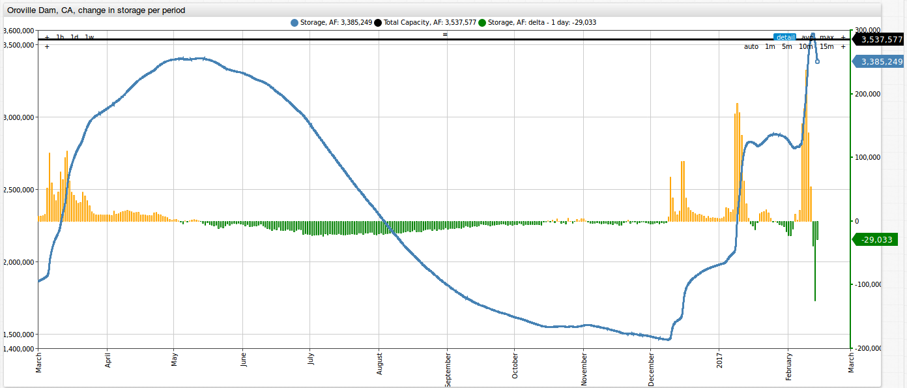
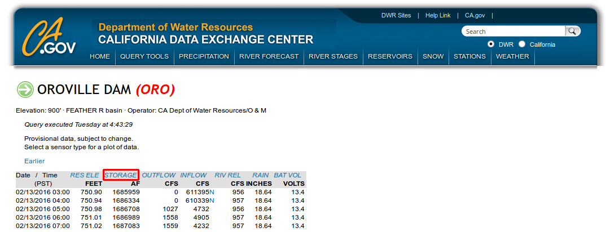
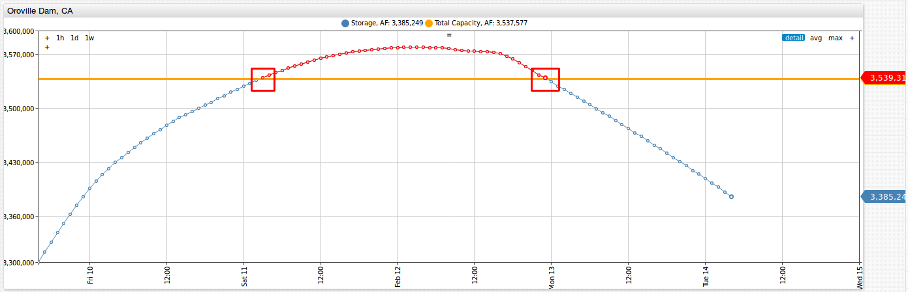
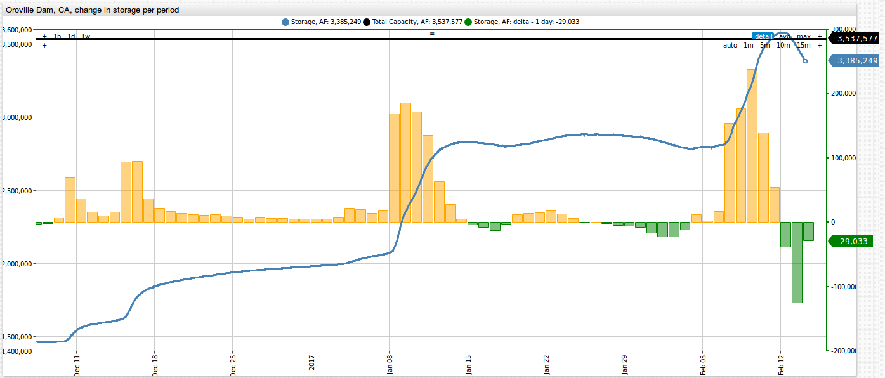
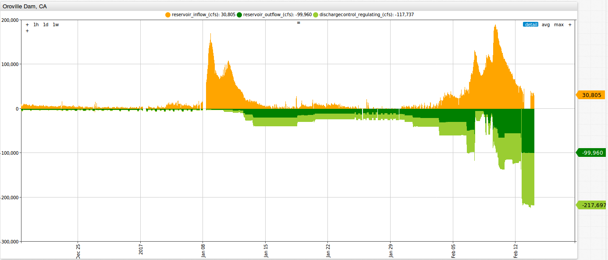

# Realtime Analysis of the Oroville Dam Disaster



In February 2017, reservoir levels for the tallest dam in the United States, located near [Oroville, California](http://www.water.ca.gov/swp/facilities/Oroville/LakeDam.cfm), were
beginning to reach capacity from high rainfall totals. Officials decided to begin using the primary dam spillway, which quickly began to deteriorate, and by
February 10th, a hole 300 feet wide, 500 feet long, and 45 feet deep had appeared in the spillway. [On February 11th](http://www.latimes.com/local/california/la-live-updates-oroville-dam-oroville-dam-spillway-expected-to-fail-1486953074-htmlstory.html),
officials decided to begin using an auxiliary, spillway composed of earthen materials. The emergency spillway quickly began to erode as well. On
February 12th, due to the "hazardous situation" surrounding the dam, more than [200,000 people](http://www.npr.org/sections/thetwo-way/2017/02/14/515172686/with-more-rain-forecast-crews-work-to-reinforce-oroville-dam)
from downstream communities were ordered to evacuate the area. In the early morning hours of February 13th, the reservoir water levels returned below the threshold capacity of the dam.

While the situation has calmed somewhat in the last several days, the crisis is by no means over. Rain has been [forecasted](https://weather.com/en/weather/tenday/l/95966:4:US)
for the next several days. With a water surface area of 15,810 acres, the difference of mere inches of rain can make the difference between crisis averted and complete disaster for the
Oroville dam.

In this article we will analyze a dataset from the [California Department of Water Resources (CDWR)](https://cdec.water.ca.gov/index.html) looking at the several vital statistics for the
Oroville dam. This article provides **realtime analysis** with Chart Lab graphs (updated **hourly** and **automatically** with data taken from the CDWR website), which show the current situation at the dam. Additionally, this article illustrates
how publicly available data from the California DWR can be easily loaded into the non-relational [Axibase Time Series Database (ATSD)](https://axibase.com/products/axibase-time-series-database/)
for interactive analysis with graphical representation of open data published by government organizations.

## Oroville Dam Dataset

Let's begin by gathering current data for the Oroville dam from [cdec.water.ca.gov](https://cdec.water.ca.gov/index.html). This dataset can be found [here](https://cdec.water.ca.gov/cgi-progs/queryF?s=ORO&d=13-Feb-2017+02:57&span=1week).

Data is collected hourly for the Oroville dam for the following metrics:

* Reservoir Elevation (feet)
* Reservoir Storage (acre-foot)
* Dam Outflow (cubic feet/second)
* Dam Inflow (cubic feet/second)
* Spillway Outflow (cubic feet/second)
* Rain (inches)

Below is an image showing these CDWR metrics in ATSD. You can toggle between the different metrics by clicking on the dropdown.



You can explore the basic CDWR portal (loaded into ATSD) by clicking the button below:

[](https://apps.axibase.com/chartlab/dee79515/11/#fullscreen)

**You do not need to install ATSD to look the realtime Oroville dam analysis in this article**.

You can, however, load the dataset into your ATSD instance by following the steps provided at the [end of the article](#action-items).

## The Current Situation - Realtime Analysis

Now let's take a more in depth look at the situation at the Oroville dam.

Below is a screenshot showing the change in storage capacity of the dam from Friday February 10th, 2017, to the morning of February 15th, 2017 (the time this article was published).
The threshold capacity is **3,537,577 af**, as marked by the orange line in the image. As a note, you can scroll over horizontally and up or down vertically by left-clicking and dragging in the direction you
would like to shift. We can see the approximate time that the dam **exceeded the threshold capacity** was between 2:00 and 3:00 am U.S. pacific time (PT) on February 11th. 3,539,160 af was recorded at 2:00 am on February 11th, and the storage level **returned to
below the threshold limit** between 11:00 pm on February 12th and 12:00 am (PT) on February 13th with 3,533,936 af recorded at midnight (both times marked below). Additionally, we can observe that the dam hit its peak overflow
of 3,578,686 af on Sunday February 12th at 3:00 am.



You can explore this portal by clicking the button below:

[](https://apps.axibase.com/chartlab/dee79515#fullscreen)

## Reservoir Storage Levels

Below is an image showing the change in reservoir storage going back to March 2016 at the Oroville dam. The blue line represents the hourly, absolute value of the
reservoir storage (in acre-feet), with values shown on the left hand side of the graph. Change in the dam storage is represented by the yellow and green columns: yellow represents an increase
in the reservoir storage, while green represents a decrease (both in acre-feet per day). These delta values are displayed on the right hand side of the graph.


Zooming into the last couple of months, we can take a look at how storage levels were changing at the time of the dam overflow.



Reservoir levels experienced their first significant uptick on December 10th, 2016, with an increase of 34,571 af added to the reservoir storage. Over the next several weeks,
the dam experienced an increase in storage (with the exception of a handful of days). By toggling over each of the individual columns, we can see the change in the storage
for February 9th (237,689 af), 10th (39,522 af), and 11th (53,896 af), which was when the dam was overtopped.

You can explore this portal by clicking on the button below:

[](https://apps.axibase.com/chartlab/dee79515/2#fullscreen)

## Reservoir Inflow, Outflows, and Precipitation

Below are three outputs for the Oroville dam:

* Precipitation vs new inflows, where net inflow is the difference between reservoir inflow and outflow. From this graph we can see the relationship between precipitation totals
  and the net inflows/storage of the dam.
* Inflows (measured in acre-foot per day) for 2017, 2016, 2015, 2014, and 2013. In this output, we can see that inflows for 2017 have been far greater than any of the recent previous years.
* Precipitation per day (inches) for 2017, 2016, 2015, 2014, and 2013. While inflows for 2017 were quite a bit greater than previous years totals, we can see that precipitation totals
  in 2017 were not too far ahead of previous years.



You can explore this portal by clicking on the button below:

[](https://apps.axibase.com/chartlab/dee79515/10/#fullscreen)

## The Next Several Days

In the last several days, the storage level in the dam has dropped back down below the threshold capacity. The crisis, however, is not over quite yet. The main driving force behind
the Oroville dam disaster has been a continued period of heavy rainfall in northern California. Below is an image showing daily precipitation totals together with the dam storage levels.
By toggling over any of the columns, we can see the values and time of these variables. We can see that after a period of rainfall, storage levels experience almost an immediate hike.


Below is a table of four of the most recent and significant rainfalls. We can see that periods having rainfall accumulations over 6 inches led to massive increases in dam storage
levels. Periods with rainfall accumulation less than 4 inches experienced much less drastic increases.

|Rainfall Period| Accumulation (in) | Reservoir Storage Change (af) (Values at 12:00 pm PT)      | Net Change (af) |
|---------------|-------------------|------------------------------------------------------------|-----------------|
| Dec-07_Dec-10 |      3.8          | 1,468,037 (Dec-06) to 1,586,443 (Dec-12)                   |     118,406     |
| Jan-07_Jan-10 |      6.2          | 2,050,031 (Jan-06) to 2,830,139 (Jan-14)                   |  **780,108**    |
| Jan-18_Jan-22 |      3.0          | 2,811,974 (Jan-17) to 2,884,036 (Jan-25)                   |     72,062      |
| Feb-02_Feb-10 |      7.3          | 2,799,106 (Feb-05) to 3,578,686 (Feb-12)                   |  **779,580**    |

You can explore this portal by clicking on the button below:

[](https://apps.axibase.com/chartlab/dee79515/7/#fullscreen)

Below is an image of the situation at the time this article was published. As of 5:00 am PT on February 15th, the reservoir storage level was at 3,230,432 af, which is 307,145 af
less than the dam threshold. We can also see that for the last several days, the storage level has been decreasing. However, rain has been [forecast](https://weather.com/en/weather/tenday/l/95966:4:US)
for the next several days.


Is there any way we can predict how quickly the dam will fill up for a given amount of rainfall? Another very helpful tool in ATSD is the capability to perform
[SQL queries](https://axibase.com/docs/atsd/sql/), which can be used to search for specific information contained in this dataset.
Using this query, we are able to obtain an estimate for the volume added (acre-foot) to the storage level of the reservoir per inch of rainfall.

```sql
SELECT
    SUM(t1.value)*3600*2.29569e-5 AS "total_inflow_in_acre_foot",
    DELTA(t2.value) AS "total_precipitation_inches",
    SUM(t1.value)*3600*2.29569e-5/DELTA(t2.value) AS "acre_foot_per_precipitation_inch"
FROM "ca.reservoir_inflow_cfs" t1
JOIN "ca.precipitation_accumulated_inches" t2
WHERE t1.datetime >= '2017-01-01T00:00:00Z'
```

```ls
| total_inflow_in_acre_foot  | total_precipitation_inches  | acre_foot_per_precipitation_inch |
|----------------------------|-----------------------------|----------------------------------|
| 2462228.8                  | 18.0                        | 136790.5                         |
```

Based off of our estimate, for every inch of rainfall at the Oroville dam, 136,790.5 acre-feet will be added to the reservoir. As of 5:00 am PT on February 15th, there was 307,145 af
of space left in the reservoir before it reaches its threshold. The maximum outflow per day that the dam is able is push out is **142,034 afd**, which was achieved on [February 14th](https://apps.axibase.com/chartlab/dee79515/2#fullscreen).
So, if we multiply the rainfall per day by our acre-feet rate (136,790.5) and subtract the maximum outflow, we should get a storage amount added per day. If we then divide the
storage added per day, we should get a answer for how many days it would take for the storage to reach threshold capacity again. Below is a table showing the amount of time for the
dam storage to reach threshold capacity for a given amount of rainfall per day.

| Rainfall       | Storage Added/Day | Remaining Storage | Time to Reach Threshold |
|----------------|-------------------|-------------------|-------------------------|
| 1 inch per day | -5,243.5          | 307,145           | No storage gain         |
| 2 inch per day | +131,547          | 307,145           | 2.334 days ~ 56 hours   |
| 3 inch per day | +268,337.5        | 307,145           | 1.144 days ~ 27 hours   |

Come back to these Chart Lab portals in the coming days and look at our **realtime analysis** for updates on the Oroville dam. **You do not need to install ATSD** to continue to monitor
the situation. Simply by clicking on each of the **Chart Lab buttons**, you can keep up to date on dam storage levels, dam inflow, dam outflow, spillway outflow, and precipitation.

### Action Items

Below are the summarized steps to follow to install local configurations of ATSD and Axibase Collector for analyzing the Oroville dam disaster:

1. Install [Docker](https://docs.docker.com/engine/installation/linux/ubuntulinux/).
2. Download the [`docker-compose.yml`](resources/docker-compose.yml) file to launch the ATSD Collector container bundle.

   ```sql
   curl -o docker-compose.yml https://raw.githubusercontent.com/axibase/atsd-use-cases/master/OrovilleDam/resources/docker-compose.yml
   ```

3. In Terminal, launch containers:

   ```txt
   export C_USER=myuser; export C_PASSWORD=mypassword; docker-compose pull && docker-compose up -d
   ```

4. Import the [`cdec.water.ca.gov-shef-parser.xml`](resources/cdec.water.ca.gov-shef-parser.xml) file into ATSD. For a more detailed description, refer to step 9 from the following [step-by-step walkthrough](../USMortality/configuration.md) from our article on [U.S. mortality statistics](../USMortality/README.md).
5. Navigate to Axibase Collector main page `https://docker_host:9443/` and manually run the following two jobs which were just imported by the docker-compose file: `cdec.water.ca.gov-shef-daily` and `cdec.water.ca.gov-shef-hourly`. You only need to run these jobs once, after which they will run on a specified schedule.
6. Navigate to the ATSD 'Metrics' page `https://docker_host:8443/metrics` and check that the metrics with the prefix `ca.` are in existence.

If you require assistance in installing this software or have any questions, please feel free to [contact us](https://axibase.com/feedback/) and we would be happy to be of assistance!