Country Living - Analyzing and Combining Iowa Employment and Consumer Price Index Datasets
==========================================================================================

### Introduction
----------------

Pigs. Fields of corn. Open prairie. Small towns. These are some of the first things that come to mind when thinking about life in Iowa. While many may see this as a simpleton and
boring way of life, Iowa is one of the most financially diverse and stable states in America. Below are some quick facts on the Iowa economy:

* From [2005 to 2015](http://www.deptofnumbers.com/gdp/iowa/), the Iowa GDP per capita grew 8.1%, compared to 3.6% for the US as a whole. 
* According to [CNBC's America's Top States for Business 2016](http://www.cnbc.com/2016/07/12/top-states-for-business-9-iowa.html), 
Iowa was ranked as the 9th best state for business in the country. The state was ranked as #2 for the cost of doing business, #12 for cost of 
living, #15 for business friendliness, and #17 for education.
* According to the [US Bureau of Labor Statistics](http://www.bls.gov/news.release/laus.nr0.htm), as of September 2016, Iowa's unemployment rate of 4.2% is lower than then US average of 5.0%. 
* [From September of 2015 to September 2016](http://www.bls.gov/news.release/laus.t05.htm), the state of Iowa added 29,600 non-farm jobs to bring the number of non-farm employed persons in the state to 1,587,800. This amounted to a growth rate of 1.9%. The US as a whole for this same period experienced a slightly lower growth rate of 1.8%. 

In order to better analyze datasets such as **Employee Financial Compensation by Industry in Iowa**, the US government in 2009 established a data collection website, 
[data.gov](https://www.data.gov/). Datasets are available online to conduct research, develop web applications, and design data visualizations, on a variety of topics ranging 
from agriculture, to manufacturing, to health, among  many others. These datasets are published using the Socrata Open Data Format. The [Socrata](https://socrata.com) Open Data Format is used 
by the US Federal government, 25 US states, 300+ US cities, and contains 4,000+ datasets for numerous US counties.

A powerful capability of the Axibase Time Series Database (ATSD) is the **ability to combine multiple datasets** in one ATSD portal. We will begin by looking at several foundational state of Iowa datasets. Next, we will look at inflation statistics
from the [Bureau of Labor Statistics (BLS)](http://www.bls.gov/home.htm). With a few simple, straightforward steps, we will then show you how combine these different datasets and compute supplementary metrics to create additional, more in depth layers of analytics.

### Iowa Employee Compensation Dataset
--------------------------------------

Let us take a look at the dataset **Employee Financial Compensation by Industry in Iowa** from data.gov, which looks at employee compensation by industry in Iowa.

This dataset can be found here: [http://catalog.data.gov/dataset/employee-compensation-by-industry-in-iowa](http://catalog.data.gov/dataset/employee-compensation-by-industry-in-iowa)

From 1998 to the present year, the state of Iowa has compiled total state wide employee compensation estimates in thousands of dollars, seasonally adjusted at annual rates. All dollar 
estimates are in current dollars (**not adjusted for inflation**). Compensation is the total remuneration, both monetary and in kind, payable by employers to employees in return for 
their work during the period. Data is published for each of the following 3 industries:
  
**Farm**, **Government and government enterprises**, **Private non-farm**

In turn, each of these industries is broken down into the following subcategories:

**Farm**: 
* Farm

**Government and government enterprises**:
* Federal, civilian
* Military
* State and local

**Private non-farm**:
* Administrative and support of waste management and remediation services
* Accommodation and food services
* Arts, entertainment, and recreation
* Construction
* Educational services
* Finance and insurance
* Forestry, fishing, and related activities
* Health care and social assistance
* Information
* Management of companies and enterprises
* Manufacturing
* Mining, quarrying, and oil and gas extraction
* Professional, scientific, and technical services
* Real estate and rental and leasing
* Retail trade
* Transportation and warehousing
* Wholesale trade
* Utilities
* Other Services (except public administration)

On the data.gov website, datasets can be downloaded as a CSV, RDF, JSON, or a XML file. This dataset can easily be parsed using the JSON job in Axibase. 

### Axibase Time Series Database
--------------------------------

The processing of datasets using Axibase Time Series Database (ATSD) is straight forward.  Processing the same data with ATSD is less time consuming
because its collection tool has built-in heuristics to handle the format in which data.gov datasets are published, namely the Socrata Open Data Format.
When loading data for a particular dataset the collector uses Socrata metadata to understand the meaning of columns and automatically extract dates, times,
and categories from the data files. Besides, ATSD stores the data in the user's own database so that this public data can be combined with internal data
sources as well as mixed and matched across different datasets. Once you install ATSD, you **don't** have to:

* Add additional datasets from data.gov
* Manipulate and design table schema
* Provision an application server
* Write programs to parse and digest these types of files.

Rather, you can configure a scheduled job to retrieve the file from the specified endpoint and have ATSD parse it according to pre-defined rules. Once you
have raw data in ATSD, creating and sharing reports with built-in widgets is fairly trivial using examples from [axibase.com](http://axibase.com/products/axibase-time-series-database/visualization/widgets/). The reports will be continuously updated as new data is published by the state of Iowa.

With ATSD, the user is able to display the dataset in an easily understandable manner. The below figure shows total statewide employee compensation for each of the above mentioned 23 industries.


Here, you can explore the complete dataset for employee compensation by industry in Iowa:

[](https://apps.axibase.com/chartlab/f5eae012)
  
Using the ATSD default portal for this particular data.gov dataset, the user has the ability to filter the data to their liking. 

The following three filters are applied to the default portal:

* First dropdown: allows the user to view data by the specified metric. In the default portal, the only current option is to filter by thousands of US dollars. 
* Second dropdown: allows the user to filter between 23 industries. In the case above, all industries have been selected. 
* Third dropdown: allows the user to filter by industry groups (farm, government and government enterprise, and private non-farm). In the above case, all groups have been selected.

The below figure shows the output when **farm** is selected as the **[industry_type]** from the third filter. We can see that the total employee compensation for farming fluctuates quite
often. There does not seem to be a single pattern that repeats year over year, such as low amount of work in the winter (leading to low values) and a high amount of work in the fall
(leading to high values). Rather, we can see that the farming industry is very sensitive to extraneous factors (such as weather), which can plunge or skyrocket the industry's overall compensation numbers in any 
given year. 


You can explore the filtered **farm** industry portal here: 

[](https://apps.axibase.com/chartlab/131b7670)
 
The next figure shows the output when **government and government enterprises** is selected as the **[industry_type]** from the third filter. We can see that the compensation for
**federal, civilian** and **military** appears to be slightly increasing over time and that **state and local** is experiencing steady growth. Unlike with the farming industry, we can see that 
government institutions are less sensitive to extraneous factors (such as poor weather, a struggling economy, or civil unrest).


We also have the ability to exclude certain series from this filtered view by clicking on the series legend. The image below shows when the **state and local** series is unselected. We can see
that the **federal, civilian** and **military** series actually experienced pretty significant growth in this period. This was simply overshadowed by the very monstrous growth in the
**state and local** series.

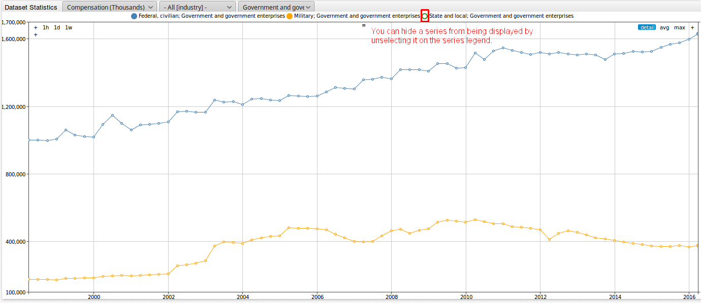

You can explore the filtered **government and government enterprises** industry portal here: 

[](https://apps.axibase.com/chartlab/cb62aab7)

The below figure shows the output when the **private non-farm** is selected as the **[industry_type]** from the third filter. 

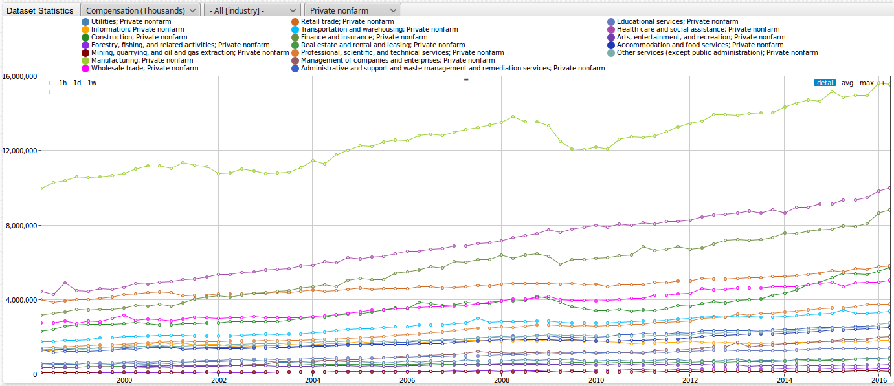 

You can explore the filtered **private non-farm** industry portal here: 

[](https://apps.axibase.com/chartlab/0c459d5f)

It appears that most of these metrics are on an upward trend, but there is a lot of information displayed, so it is somewhat difficult to tell. Let us sort for the metrics **Construction** and **Manufacturing**. The images 
for these 2 outputs are shown below, respectively. We can see that both metrics were generally experiencing steady, upward growth until the late 2000's, when each metric experienced a 
sharp decline (as marked by the red boxes in the figures below). An extraneous factor at this time that may have contributed to this change was the poor world-wide economy, otherwise
known as the [Great Recession](http://stateofworkingamerica.org/great-recession/). 
 
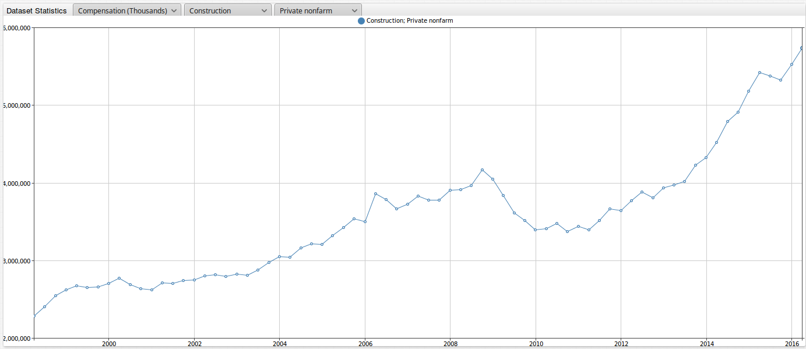

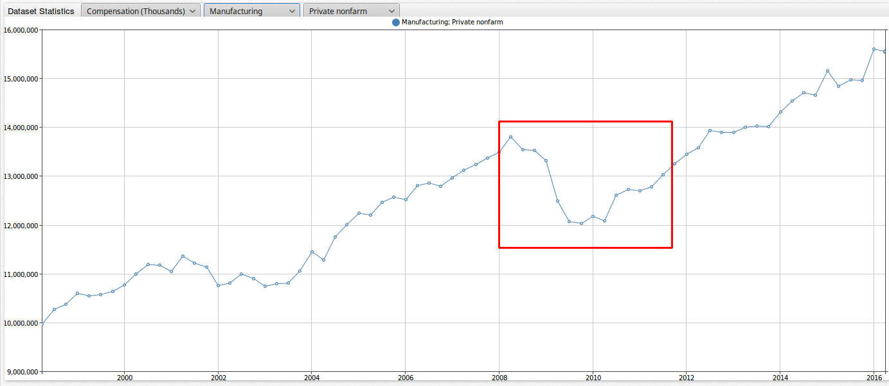

Below is a portal which explores total compensation change per industry in Iowa since 2008 and 2000. Here is a link to the [widgets page on axibase.com](https://axibase.com/products/axibase-time-series-database/visualization/widgets/),
where you can explore various widget and portal configurations.


You can explore this portal here:

[](https://apps.axibase.com/chartlab/8323be2f/5/)

### Additional Iowa Datasets - State of Iowa Employment by Month and Industry
-----------------------------------------------------------------------------

In order to provide context to the above dataset, we will quickly look at adding additional datasets to ATSD. By looking at additional information, 
we can see how the rise and fall of total statewide employee compensation corresponds to other metrics. For example, does the rise or fall of total statewide employee compensation correspond to a rise or fall of the gross number 
of employees in the state, or is there another factor at play? With a decrease in total statewide employee compensation, will unemployment rates and benefits rise as a result? To look into these 
questions, let us navigate to [https://data.iowa.gov](https://data.iowa.gov/). This site contains publicly available information pertaining to Iowa for fields such as the economy,
education, health, and the environment, among many more. Let us begin by finding a dataset which provides information on the gross number of employees working in the state.

1. Navigate to [https://data.iowa.gov](https://data.iowa.gov).
2. On the home page, select the **Employment** tab.
3. As shown in the figure below, in the **Employment** tab, scroll to the bottom of the page and click on the **Topics** drop down. Select **Employment**.

   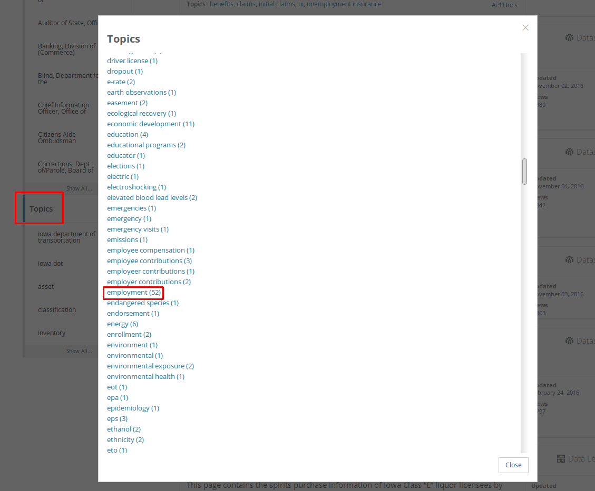

4. Select the dataset titled **Iowa Seasonally Adjusted Non-Farm Employment by Month and Industry**. This link can be found [here](https://data.iowa.gov/Economy/Iowa-Seasonally-Adjusted-Non-Farm-Employment-by-Mo/sxz8-4swt). 
5. As shown in the image below, click on **Download -> JSON**, which provides the dataset in the Socrata format, which can be easily processed into ATSD using the JSON job in Axibase collector.

   
   
Below is an image of the dataset **Iowa Seasonally Adjusted Non-Farm Employment by Month and Industry**. Data has been compiled from 1990 to the present year. The metric shown is 
the total number of employees (in thousands) per industry. 


Data is published for each of the following industry types: **Goods producing**, **Government**, and **Service providing**.  

In turn, each of these industries is broken down into the following subcategories:

**Goods producing**:
* Construction
* Manufacturing
* Mining and Logging

**Government**:
* Federal Government
* Local Government
* State Government

**Service providing**:
* Education and Health Services
* Financial Activities
* Information
* Leisure and Hospitality
* Professional and Business Services
* Retail Trade
* Transportation and Utilities
* Wholesale Trade

Other Services

The following three filters are applied to the default portal:

* First dropdown: allows the user to view data by the specified metric. In the default portal, the only current option is to filter by thousands of employees. 
* Second dropdown: allows the user to filter between the 3 industry types. In the case above, all industry groups are selected. 
* Third dropdown: allows the user to filter by a specific industry. In the default instance, all industries are selected.

Here, you can explore the complete dataset for employment by industry in Iowa:

[](https://apps.axibase.com/chartlab/1ac33603)

Let us now take a look at specific metrics in the **Iowa Seasonally Adjusted Non-Farm Employment by Month and Industry** dataset. As with the total statewide employee compensation dataset that
we looked at earlier, let us filter for the **Construction** and **Manufacturing** metrics and see how the behaviors of the 2 datasets compare. Below are images of the
**Construction** and **Manufacturing** metrics, respectively.   


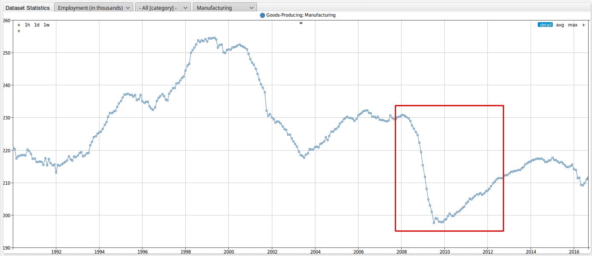

As with the employee compensation dataset, we can see that these metrics were generally experiencing steady, upward growth until the late 2000's, where each metric experienced a sharp 
decline (as marked by the red boxes in the figures above). We can see that both the total employee compensation and the gross number of employees decreased in the late 2000's, likely
as a result of the **Great Recession**. Additionally, we can see that there was a significant decline in employment numbers for manufacturing between approximately 2001 and 2004. Looking
back at the total statewide employee compensation dataset, we can see that there was also a significant decline for this data around this same period. Construction, however, did not seem to
be effected nearly as much. This decline may be attributed to a economic recession (slightly less severe than the one beginning in 2008) brought on by the September 11th terrorist attacks. For
this period, it appears that the manufacturing field was greatly affected, while the construction industry was only slightly affected. 

Next, let us look at another dataset to see if there is any relation with its behavior compared to the two we just analyzed. Below is a table of datasets from data.iowa.gov that
are readily available in Chart Lab. These dataset can be loaded in Chart Lab by replacing the entity name in the default portal (Iowa Seasonally Adjusted Non-Farm Employment by Month and Industry)
with one from the table below.  

|Entity     |data.iowa.gov dataset     |
|-----------|--------------------------|
| ytnz-cckp | [Gross seasonally adjusted non-farm employment by month](https://data.iowa.gov/Economy/Iowa-Seasonally-Adjusted-Non-Farm-Employment-by-Mo/sxz8-4swt)|
| n74v-z6ct | [Average monthly non-farm employment by year and category](https://data.iowa.gov/Economy/Iowa-Seasonally-Adjusted-Non-Farm-Employment-by-Mo/sxz8-4swt)|
| jpje-kkb9 | [Unemployment insurance claims and payments (statewide - monthly)](https://data.iowa.gov/Economy/Unemployment-Insurance-Claims-And-Payments-Statewi/jpje-kkb9)|
| njph-rx66 | [Unemployment insurance claims (statewide - weekly)](https://data.iowa.gov/Economy/Unemployment-Insurance-Claims-Statewide-Weekly-/njph-rx66)|
| b38f-jgn3 | [Unemployment insurance benefit payments by industry](https://data.iowa.gov/Economy/Unemployment-Insurance-Benefit-Payments-by-Industr/b38f-jgn3)|
| yhbr-3t8a | [Unemployment insurance recipients and unemployment insurance benefit payments by county (annual)](https://data.iowa.gov/Economy/Unemployment-Insurance-Recipients-and-UI-Benefit-P/yhbr-3t8a)|
| rmcb-sifx | [Unemployment insurance payments (statewide - yearly)](https://data.iowa.gov/Economy/Unemployment-Insurance-Recipients-and-UI-Benefit-P/yhbr-3t8a)|
| rigx-2vau | [Unemployment insurance initial claims by county](https://data.iowa.gov/Economy/Unemployment-Insurance-Initial-Claims-by-County/rigx-2vau)|
| aeyn-twxp | [Unemployment insurance recipients and unemployment insurance benefit payments by county (monthly)](https://data.iowa.gov/Economy/Unemployment-Insurance-Recipients-and-UI-Benefit-P/aeyn-twxp)|

(Note: If you would like to view a data.gov dataset without installing the ATSD software, please contact us and we would be happy to add it to this table!)

Let us change the entity in the default portal to **Unemployment insurance benefit payments by industry** (the 5th entry in the above table). Follow the below steps to change the entity:

1. Open the default portal: [https://apps.axibase.com/chartlab/1ac33603](https://apps.axibase.com/chartlab/1ac33603). 
2. Delete the default entity name **sxz8-4swt**, as shown in the image below.

   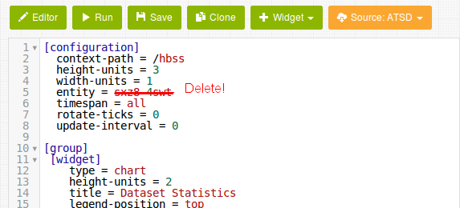

3. Enter in the new entity name, in our instance **b38f-jgn3**. 
4. Run!

Below is an image showing the output of the graph. 

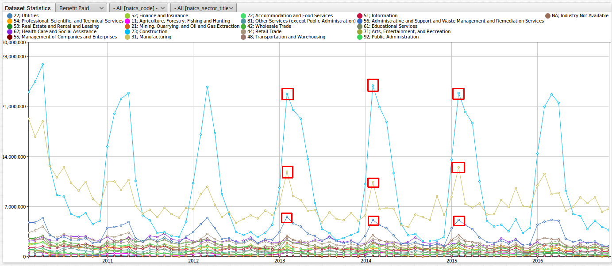

As marked with red boxes in the image above for the **Construction**, **Manufacturing**, and **Administration and Support of Waste Management and Remediation Services**
metrics, we can see that insurance benefit payments tend to follow a yearly pattern. The payments tend to peak at the very beginning of the year in January, and generally fall throughout
the rest of the year. This makes sense because for a state with harsh winters like Iowa, these services can tend to slow down in the winter months, leading to companies laying off a
portion of their workforce, with these affected employees collecting unemployment insurance payments. This particular dataset however only goes back to 2010, so we cannot tell from it
whether or not there is any kind of relation between it and the gross number of employees in the state and the total statewide employee compensation. Let's check out a different dataset showing unemployment
benefits to see if there is a relation or not.

Navigate to **Unemployment insurance claims and payments (statewide - monthly)** with the entity **jpje-kkb9**. Below is an image showing the output of this graph.  


As with the previous figure, we can see that this dataset follows the same general trend, with the payments tending to peak in January of a given year and continue to fall throughout
the rest of the year. However, we can see that in the late 2000's, the series shifted up as marked in the above figure. We can also add a 'shifted' duplicate of this series.
```
     [series]
       time-offset = 1 year
       color = silver
```

An image of this output is shown below. The current year is the blue series and the previous year is the silver series. As marked by the red box in the figure below, we can see how drastically
benefits increased for 2008 versus the overlaid data from 2007. 

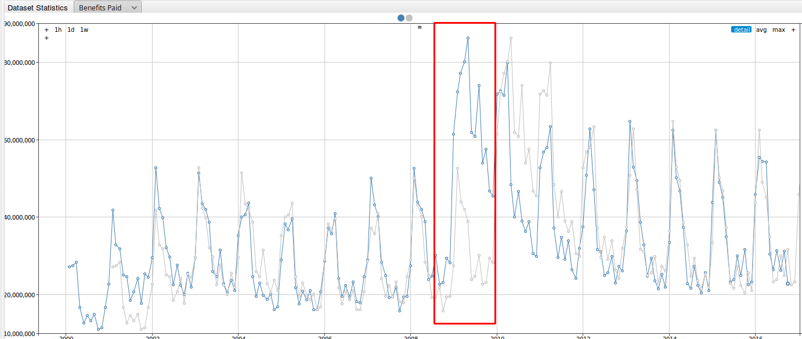

You can explore this portal here:

[](https://apps.axibase.com/chartlab/08e6e6f0)

To summarize, the **Great Recession** seems to have had the following effects on each of the datasets:

* Decrease in total compensation for the state of Iowa 
* Decrease in total number of non-farm employees in the state of Iowa
* Increase in total of unemployment insurance benefit payments for the state of Iowa

### A Closer look at Iowa's Economy
-----------------------------------

We just looked at the datasets **Employee Financial Compensation by Industry in Iowa** and **Iowa Seasonally Adjusted Non-Farm Employment by Month and Industry**, which provided some insightful information
into the general state of the economic situation in the state of Iowa over time. However, what does all of this information mean for your average worker in Iowa? A powerful capability of ATSD is the ability to combine datasets in one ATSD portal. We can take these 2 datasets and, 
with a few simple, straightforward steps, compute additional metrics to create an additional, more in depth layer of analytics. The following sections will delve into the compensation per employee, 
adjusted with consumer price index (CPI) statistics to account for inflation, for employees in the federal government industry in the state of Iowa.
 
Let us a take a closer look at the **government and government enterprises** industry in Iowa.

Looking back on an [earlier Chart Lab example](https://apps.axibase.com/chartlab/cb62aab7) from this article, we can recall that this industry experienced significant growth in terms total employee compensation 
for the industry as a whole. Below is an image of the year-over-year growth experienced by the **government and government enterprises** industry in Iowa. While growth has slowed slightly over recent
years, we can see that as a whole over this time period the growth has been quite significant.

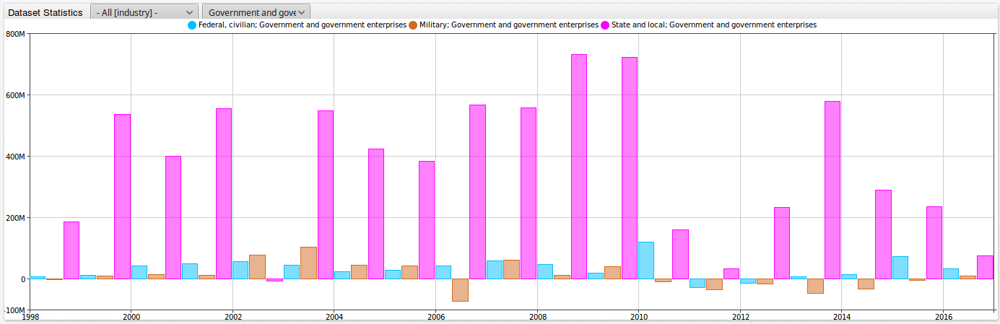
 
You can explore the year-over-year growth for the **government and government enterprises** industry in Iowa in the below portal:
 
[](https://apps.axibase.com/chartlab/f5eae012/3/)

What does this tremendous growth mean for your average government worker in Iowa? Are wages increasing for the average government employee? Are the elites in this industry only getting richer? Or is 
there another factor at play? For the government industry in Iowa, we will now walk through adding total employee compensation, the total number of employees, and compute an average
wage (adjusted with CPI values) for this industry as our new metric. We will be able to get then gain a clear understanding of the situation over time, available all in one portal.

Let us begin by displaying the metrics for total employee compensation and total number of employees in the state. Below is an image of the initial part of the configuration in Chart Lab: 

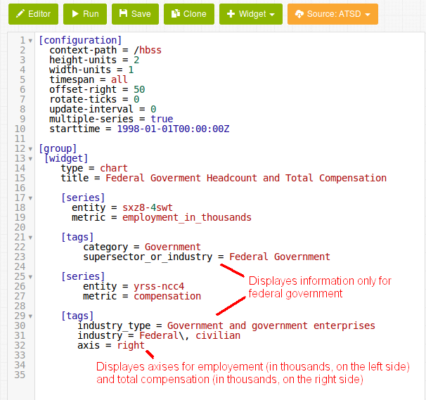

This configuration is relatively straightforward. First, we display the **[series]** for both fields by specifying their respective entity and metric names. Next, using the **[tags]** command, we are
able to display only the pertinent information, in this case data on the federal government. Finally, by specifying **axis=right** (at the bottom of the configuration), we are able to display axes for employment (in thousands, on the left hand
side) and for total compensation (in thousand, on the right hand side). Below is an image of the output in Chart Lab:

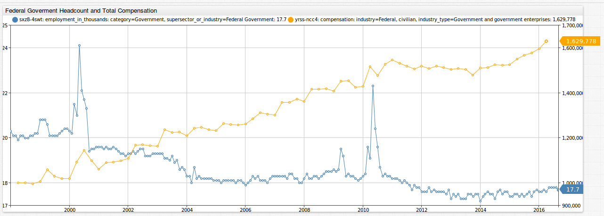

Interestingly enough, we can see that over time, in spite the fact that the total number of employees (the blue series) has gone down, the total employee compensation (the yellow series) in the state has drastically increased for the federal government industry. We can see 
that the number of federal government employees in the state decreased from 20,300 to 17,700 persons but the total compensation in the state increased from $999,528,000 to 
$1,629,778,000. Let us now move to computing the average federal government compensation per employee. Below is an image of the configuration in Chart Lab:


Our next step is similar to our first step. First, we begin by specifying the **[series}** and **[tags]** we would like to be shown. Since we are looking to only display the average employee compensation in this output,
we specify **display = false** for both of these series. Next, we specify **alias** names to be used in order to create our custom series. Finally, we specify the **value** we would like to be displayed.
This line in the configuration is shown below:

```
value = (value('comp')/value('emp'))==0 ? null : value('comp')/value('emp')
```

Since we are looking for the average compensation per employee, we simply need to divide the total employee compensation in the state (comp) by the total number of employees in the state (emp).
Since the start times of these two series differ, the beginning of the equation serves to set any non-real values (when the series do not intersect) equal to 'null.' Time intervals containing both series will be computed and displayed,
per the second part of the equation. Below is an image of the average employee compensation for the federal government industry in the state of Iowa. 

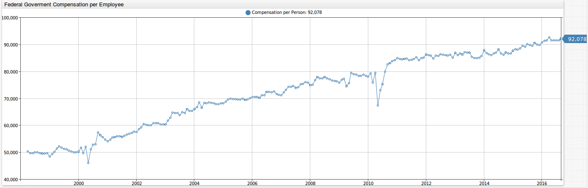

Based off of our output, the unadjusted average salary for a federal government employee in the state increased from $50,211 in March of 1998 to $92,078 in September of 2016. You can explore this portal here:

[](https://apps.axibase.com/chartlab/202133dd)

Below is another example exploring average government salary in the state of Iowa. This instance shows the average salary for local and state government employees in Iowa. Based off of our output, the unadjusted average salary increased 
from $32,711 in March 1998 to $59,196 in September 2016. In this time frame, the number of employees in Iowa for local and state government increased from 155,000 to 174,000 and 61,000 to 66,000 persons,
respectively. 

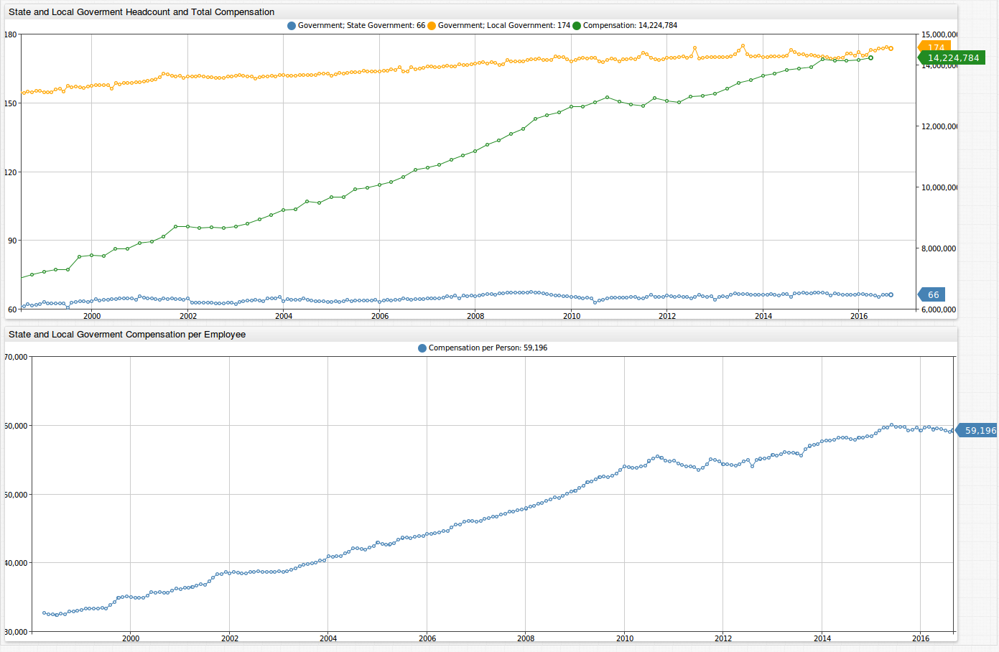

The setup for this example is almost exactly the same as the previous example, except for the fact that we are simultaneously looking at 2 metrics (local and state government) versus only 1 (federal)
from the previous example. To calculate our the compensation per employee value, we considered 'local' and 'state' employees to be one and the same. Consequently, we simply divided the total compensation
by the average of 'emps' (alias for state government employees) and 'empl' (alias for local government employees). This line in the configuration is shown below:

```
value = (value('comp')/(value('emps')+value('empl')))==0 ? null : (value('comp')/(value('emps')+value('empl')))
```

You can explore this portal here:

[](https://apps.axibase.com/chartlab/1ac33603/3/)

### Consumer Price Index (CPI) Dataset  
--------------------------------------

The initial dataset looking at total employee compensation was not adjusted for inflation. We will now add another dataset to this analysis: consumer price index (CPI) statistics. 

According to the [Bureau of Labor Statistics (BLS)](http://www.bls.gov/cpi/cpifaq.htm), CPI is a measure of the average change over time in the prices
paid by urban consumers for a market basket of goods and services. This market basket includes a wide variety of consumer items such as chicken, bedroom furniture, jewelry, eyeglasses, college tuition, 
tobacco, and many more items. CPI can be used to index the real value of, in our case, average employee salaries change over time using current dollars. The adjusted dollar amount is calculated by
multiplying your unadjusted value by the current CPI over the CPI at any specified time period to project that amount in current dollars. 

Let us now pull a dataset from the BLS website for CPI. A CPI dataset is available for download here: [http://data.bls.gov/cgi-bin/surveymost](http://data.bls.gov/cgi-bin/surveymost). The data is only
available, however, in XLSX format. As a result, we needed to create a file job in Axibase collector to download the tabular data from the Bureau of Labor Statistics file format and then upload it into
ATSD. Because the file format is nonstandard, ATSD needs to be told how to parse the data. This configuration, which describes the rules for parsing, is called a CSV parser configuration. Specific rules 
need to be written for custom BLS outputs.

The BLS file job can be found [here](jobs.xml). The CSV parser can be found [here](csv-configs.xml). 

Once the data has been downloaded and parsed, we can then add it to our Chart Lab configuration. Below is an image of a CPI for urban customers output.

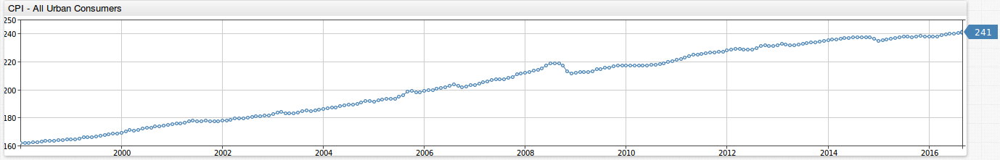

Once we have our CPI data added into our ATSD instance, we can adjust our compensation per employee values to account for inflation. Below is a screenshot of this configuration. We can see that
it is basically the same configuration as with the unadjusted compensation for employee portal. The only difference is that we are multiplying the original values by the appropriate CPI adjuster.


In our portal, we now have the following outputs:

* Federal government head count and total compensation
* Federal government compensation per employee
* CPI - all urban customers
* Federal government compensation per employee, inflation adjusted in current dollars

This example showcases a powerful capability of ATSD: the **ability to combine multiple datasets** in one ATSD portal. In this example we combined 3 datasets, which we used to create 4 separate outputs.
Taking our original datasets, we were able to compute additional, more in depth layers of analytics with only a few simple, straightforward steps. Below is a screen shot of the complete
portal for the federal government dataset. 

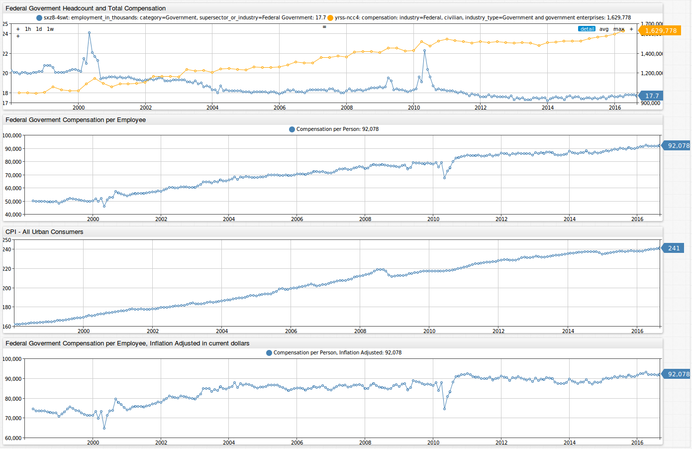

You can explore this portal here:

[](https://apps.axibase.com/chartlab/1ac33603/6/)

Below is a screen shot of the complete portal for the local and state government dataset.
 
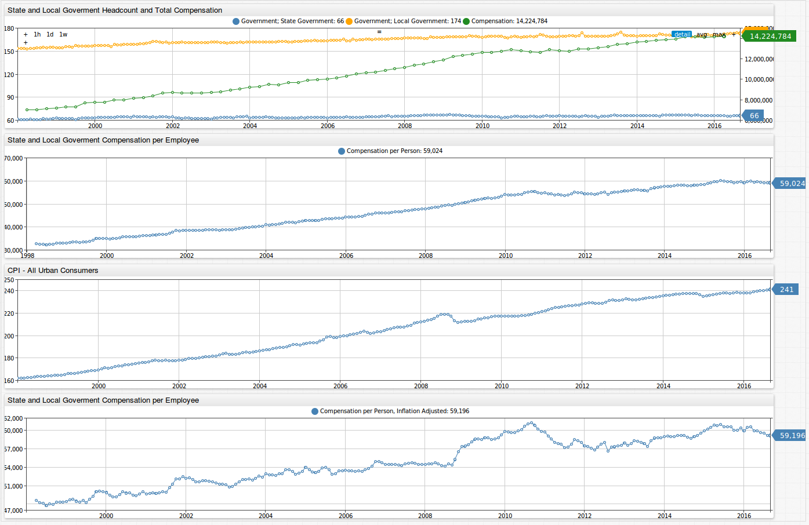

You can explore this portal here:

[](https://apps.axibase.com/chartlab/6019ae9c)

In conclusion, we can draw the following from our outputs: 

* Unadjusted federal government compensation per employee: **$50,211** in March of 1998 to **$92,078** in September of 2016
* Adjusted federal government compensation per employee: **$74,608** in March of 1998 to **$92,078** in September of 2016
* Unadjusted state and local government compensation per employee: **$32,711** in March of 1998 to **$59,196** in September of 2016
* Adjusted state and local government compensation per employee: **$48,605** in March of 1998 to **$59,196** in  September of 2016

With our adjusted compensation per employee values, we have data that has some real value. We can see that the change over time in the adjusted values are not as great as the unadjusted. Comparing 
the trends of the unadjusted to the adjusted values over time, we can see that the adjusted trend line is not as steady as the unadjusted line. That, in fact, even the government
industry can go through volatility as other fields (such as farming, construction, and manufacturing) experience. Axibase's ability to easily combine multiple datasets, regardless of standard
or non-standard formats, into one instance makes comparing employee average compensation simple and straightforward, and provides outputs that are easy to interpret.

### Action Items
----------------

Here is a link to our article on [Hawaii gas prices](https://github.com/axibase/atsd-use-cases/blob/master/HawaiiGasPrices/hawaii_gas_prices.md). The [action items](https://github.com/axibase/atsd-use-cases/blob/master/HawaiiGasPrices/hawaii_gas_prices.md#action-items) in that article show the steps for installing ATSD. 

Below are the steps to follow and create figures for Iowa employment metrics:

1. Follow the action items in the Hawaii Gas Prices article for installing ATSD.
2. Import the [BLS file job](jobs.xml) and [CSV parser](csv-configs.xml) into Axibase Collector to collect CPI datasets.
3. Add your desired data.gov, iowa.data.gov, or Bureau of Labor Statistics dataset to enable data collection. Click on [Run] to collect data for the first time.
4. Login into ATSD and open a sample Socrata portal to explore the data.

If you require assistance in installing this software or have any questions, please feel free to [contact us](https://axibase.com/feedback/) and we would be happy to be of assistance!

### References
--------------

Article Title Photo Source: [http://kids.nationalgeographic.com/explore/states/iowa/#iowa-corn.jpg](http://kids.nationalgeographic.com/explore/states/iowa/#iowa-corn.jpg)
