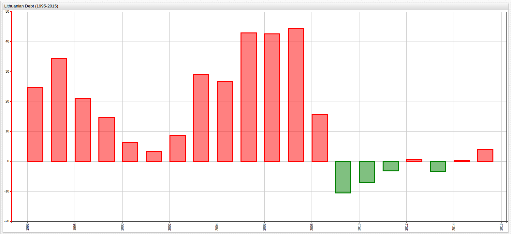
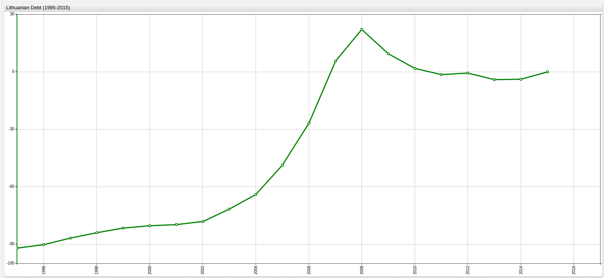
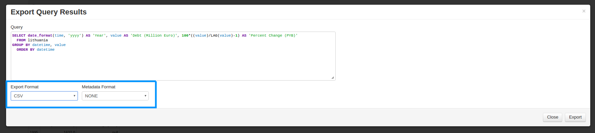

Managing Calculated Values in SQL Console and ChartLab
===

#### Introduction

Often, some kind of ad hoc calculation must be performed on a given dataset to evoke the required information. Take the value of an
investment as an example. Simply knowing that the present value is $1,000,000 does not give much information about the overall performance
of the investment. Is that higher or lower than the principal? How much has it grown or shrunk? How quickly?

Further, using monetary amounts to define the growth of a particular investment, corporation, market, hedge fund, or set of assets can be equally as unhelpful.
Different firms have different market shares and sometimes small firms are able to outperform the giants based on percent
growth but not gross profit. Additionally, the state of modern business is such that we are all connected, but still occasionally use different
currencies. Percent growth comparisons eliminate the need to constantly convert between currencies when comparing businesses
from different parts of the world that use different currencies.

When trying to beat the market each year, investment firms track their fund's percentile growth and publish gross figures
as supporting evidence. Percent growth is much more broadly applicable when comparing company performance because it disregards
the differences in overall company worth and currency value in favor of relative rates of change.

Thanks to the [`replace-value`](https://axibase.com/products/axibase-time-series-database/visualization/widgets/configuring-the-widgets/) setting in [ChartLab](https://apps.axibase.com/chartlab) and support for on-the-fly value modification in [SQL Console](https://github.com/axibase/atsd/blob/master/sql/README.md)
in [Axibase Time Series Database](https://axibase.com/products/axibase-time-series-database/), calculations derived from underlying data do not require a secondary support program.
Calculating a derived value and returning the results can be handled completely from within the ATSD or ChartLab user interface,
and even exported for further use elsewhere.

#### Data

Using excerpted data from [Eurostat](http://ec.europa.eu/eurostat) detailing [European Union Debt by Country](../../DataShorts/EU_Debt/README.md)
that has been catalogued in the [Axibase Data Library](https://axibase.com/data-library), the process of modifying numerical
data is shown here:

**Query 1**

```sql
SELECT date_format(time, 'yyyy') AS "Year", value AS "Debt (Million Euro)"
  FROM lithuania
```

**Table 1**

```ls
| Year | Debt (Million Euro) |
|------|---------------------|
| 1995 | 1632.0              |
| 1996 | 2034.9              |
| 1997 | 2734.3              |
| 1998 | 3306.2              |
| 1999 | 3790.3              |
| 2000 | 4028.1              |
| 2001 | 4162.2              |
| 2002 | 4517.3              |
| 2003 | 5822.8              |
| 2004 | 7372.5              |
| 2005 | 10539.2             |
| 2006 | 15023.2             |
| 2007 | 21689.8             |
| 2008 | 25084.0             |
| 2009 | 22449.2             |
| 2010 | 20892.0             |
| 2011 | 20239.2             |
| 2012 | 20381.5             |
| 2013 | 19715.7             |
| 2014 | 19748.3             |
| 2015 | 20525.2             |
```

**Figure 1**


[](https://apps.axibase.com/chartlab/82713e8a/#fullscreen)

#### Implementation

In order to calculate the percent growth of Lithuanian debt over the 20 year observation period, a number of different baselines can be
used. Three common baselines are previous year baseline (PYB), average value baseline (AVB), and final year baseline (FYB).
Each baseline is calculated similarly, with small differences in protocol that can act as guidelines for other calculations.

**Previous Year Baseline**

In order to calculate debt growth using a PYB, the following query is used:

**Query 2**

```sql
SELECT date_format(time, 'yyyy') AS "Year", value AS "Debt (Million Euro)", 100*((value)/LAG(value)-1) AS "Percent Change (PYB)"
  FROM lithuania
ORDER BY datetime
```

This query makes use of the [`LAG`](https://github.com/axibase/atsd/blob/master/sql/README.md#lag) function, which lets the user
access the previous row of the same result set without robust syntax. When used with the first row in a given dataset, the `LAG` function returns
a [`NULL`](https://github.com/axibase/atsd/blob/master/sql/README.md#null) value.

The underlying formula in this query is simple:

`100 * [(x/y)-1]`

Where,

`x = current year debt amount, and y = previous year debt amount`

**Table 2**

```ls
| Year | Debt (Million Euro) | Percent Change (PYB) |
|------|---------------------|----------------------|
| 1995 | 1632.00             | null                 |
| 1996 | 2034.90             | 24.69                |
| 1997 | 2734.30             | 34.37                |
| 1998 | 3306.20             | 20.92                |
| 1999 | 3790.30             | 14.64                |
| 2000 | 4028.10             | 6.27                 |
| 2001 | 4162.20             | 3.33                 |
| 2002 | 4517.30             | 8.53                 |
| 2003 | 5822.80             | 28.90                |
| 2004 | 7372.50             | 26.61                |
| 2005 | 10539.20            | 42.95                |
| 2006 | 15023.20            | 42.55                |
| 2007 | 21689.80            | 44.38                |
| 2008 | 25084.00            | 15.65                |
| 2009 | 22449.20            | -10.50               |
| 2010 | 20892.00            | -6.94                |
| 2011 | 20239.20            | -3.12                |
| 2012 | 20381.50            | 0.70                 |
| 2013 | 19715.70            | -3.27                |
| 2014 | 19748.30            | 0.17                 |
| 2015 | 20525.20            | 3.93                 |
```

The `replace-value` setting visible in the Editor window in ChartLab produces the following visualization:

**Figure 2**


[](https://apps.axibase.com/chartlab/82713e8a/2/#fullscreen)

> Open the Editor window in ChartLab and see the script reproduced below on line 16.

**Script 1**

```sql
replace-value = (value/previousValue-1)*100
```

Additionally, this visualization can be modified with an [`alert-expression`](https://axibase.com/products/axibase-time-series-database/visualization/widgets/time-chart/#tab-id-14) .

**Figure 3**



[](https://apps.axibase.com/chartlab/82713e8a/5/#fullscreen)

> The alert expression used here is visible in the Editor window on lines 17 and 18.

**Script 2**

```sql
alert-expression = value < 0
alert-style = fill: green
```

This setting renders all incidences of negative debt growth (or debt growth less than 0) as green, while positive debt growth
is rendered in red.

**Average Value Baseline**

In order to calculate debt growth using a AVB, the following queries are used:

**Query 3**

```sql
SELECT AVG(value) AS "Debt (Million Euro)"
  FROM lithuania
```

**Table 3**

```ls
| Debt (Million Euro) |
|---------------------|
| 12175.6             |
```

This value can be hardcoded into the following query to return the desired result set:

**Query 4**

```sql
SELECT date_format(time, 'yyyy') AS "Year", value AS "Debt (Million Euro)", (100*((value)/12175.6-1)) AS "Percent Change (AVB)"
  FROM lithuania
ORDER BY datetime
```

**Table 4**

```ls
| Year | Debt (Million Euro) | Percent Change (AVB) |
|------|---------------------|----------------------|
| 1995 | 1632.0              | -86.6                |
| 1996 | 2034.9              | -83.3                |
| 1997 | 2734.3              | -77.5                |
| 1998 | 3306.2              | -72.8                |
| 1999 | 3790.3              | -68.9                |
| 2000 | 4028.1              | -66.9                |
| 2001 | 4162.2              | -65.8                |
| 2002 | 4517.3              | -62.9                |
| 2003 | 5822.8              | -52.2                |
| 2004 | 7372.5              | -39.4                |
| 2005 | 10539.2             | -13.4                |
| 2006 | 15023.2             | 23.4                 |
| 2007 | 21689.8             | 78.1                 |
| 2008 | 25084.0             | 106.0                |
| 2009 | 22449.2             | 84.4                 |
| 2010 | 20892.0             | 71.6                 |
| 2011 | 20239.2             | 66.2                 |
| 2012 | 20381.5             | 67.4                 |
| 2013 | 19715.7             | 61.9                 |
| 2014 | 19748.3             | 62.2                 |
| 2015 | 20525.2             | 68.6                 |
```

**Figure 4**


[](https://apps.axibase.com/chartlab/82713e8a/3/#fullscreen)

**Figure 5**


[](https://apps.axibase.com/chartlab/82713e8a/4/#fullscreen)

> The `alert-expression` used here is the same as above in **Figure 2.1.3** (see **Script 1.1.3**) but now shows years with
debt value below the calculated AVB in green and years with debt value above the AVB in red.

**Final Year Baseline**

In order to calculate debt growth using a FYB, the following queries are used:

**Query 5**

```sql
SELECT last(value) AS "Final Year Baseline"
  FROM lithuania
```

**Table 5**

```ls
| Final Year Baseline |
|---------------------|
| 20525.2             |
```

This returned value can hardcoded as in **Query 4**:

**Query 6**

```sql
SELECT date_format(time, 'yyyy') AS "Year", value AS "Debt (Million Euro)", (100*(value/20525.2-1)) AS "Percent Change (FYB)"
  FROM lithuania
GROUP BY datetime, value
  ORDER BY datetime
```

**Table 6**

```ls
| Year | Debt (Million Euro) | Percent Change (FYB) |
|------|---------------------|----------------------|
| 1995 | 1632.0              | -92.0                |
| 1996 | 2034.9              | -90.1                |
| 1997 | 2734.3              | -86.7                |
| 1998 | 3306.2              | -83.9                |
| 1999 | 3790.3              | -81.5                |
| 2000 | 4028.1              | -80.4                |
| 2001 | 4162.2              | -79.7                |
| 2002 | 4517.3              | -78.0                |
| 2003 | 5822.8              | -71.6                |
| 2004 | 7372.5              | -64.1                |
| 2005 | 10539.2             | -48.7                |
| 2006 | 15023.2             | -26.8                |
| 2007 | 21689.8             | 5.7                  |
| 2008 | 25084.0             | 22.2                 |
| 2009 | 22449.2             | 9.4                  |
| 2010 | 20892.0             | 1.8                  |
| 2011 | 20239.2             | -1.4                 |
| 2012 | 20381.5             | -0.7                 |
| 2013 | 19715.7             | -3.9                 |
| 2014 | 19748.3             | -3.8                 |
| 2015 | 20525.2             | 0.0                  |
```

**Figure 6**



[](https://apps.axibase.com/chartlab/82713e8a/7/#fullscreen)

**Figure 7**


[](https://apps.axibase.com/chartlab/82713e8a/6/#fullscreen)

> The `alert-expression` used here is the same as above in **Figure 5** (see **Query 4**) but now shows years with
debt value below the calculated FYB in green and years with debt value above the FYB in red.

#### Export

Using **Query 2** as an example in the SQL Console:


> The Export button has been highlighted.



> The two dropdown menus which control export settings have been highlighted.

Supported query export file formats:

* CSV
* JSON (objects)
* JSON (row)
* XSLX

Calculations have been performed entirely in the ATSD user interface, and the values of those calculations have been exported
for additional use outside of the ATSD environment.
