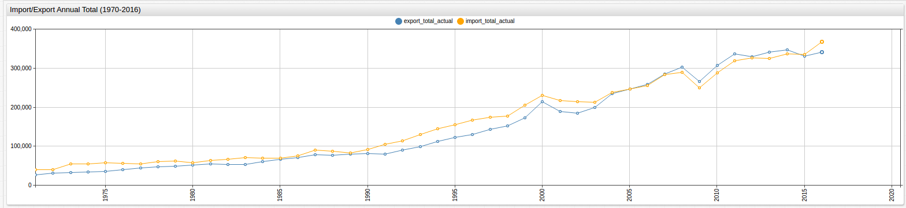

# Calculated Values with Schema-Based Parsing

## Introduction

Data is not always recorded ideally for a given analysis. Perhaps the metrics that you would like to work with are not contained
in a given file, or maybe calculations must be done with the given data in order to arrive to a dataset that better suits
your current needs.

With [Schema-Based Parsing](https://axibase.com/products/axibase-time-series-database/writing-data/csv/csv-schema/) in [Axibase Time Series Database](https://axibase.com/products/axibase-time-series-database/)
data can be modified upon import so that working with it in the [SQL Console](https://github.com/axibase/atsd/blob/master/sql/README.md)
or [ChartLab](https://apps.axibase.com/chartlab) is more useful.

## Data

Using Bank of Israel foreign trade data as an example, this procedure is explained below:

> Data Source: [Central Bank of Israel](http://www.boi.org.il/en/DataAndStatistics)

To start, look at the below visualization, SQL query, and result set:

>The data here has been imported into ATSD with no modification.


```sql
SELECT date_format(time, 'yyyy') AS "Year", im.value AS "Import Percent Change", ex.value 'Export Percent Change'
  FROM import_total AS "im" JOIN export_total AS "ex"
```

| Year | Import Percent Change | Export Percent Change |
|------|-----------------------|-----------------------|
| 1970 | 17.7                  | 9.7                   |
| 1971 | 10.8                  | 23.6                  |
| 1972 | 1.2                   | 13.5                  |
| 1973 | 35.2                  | 5.5                   |
| 1974 | 0.7                   | 5.6                   |
| 1975 | 4.2                   | 1.8                   |
| 1976 | -2.8                  | 14.7                  |
| 1977 | -3.0                  | 11.7                  |
| 1978 | 10.6                  | 4.6                   |
| 1979 | 2.8                   | 3.0                   |
| 1980 | -6.2                  | 7.8                   |
| 1981 | 10.2                  | 5.2                   |
| 1982 | 3.6                   | -3.5                  |
| 1983 | 6.8                   | 1.7                   |
| 1984 | -1.1                  | 13.6                  |
| 1985 | -0.9                  | 10.0                  |
| 1986 | 9.2                   | 5.6                   |
| 1987 | 19.6                  | 10.2                  |
| 1988 | -2.8                  | -1.5                  |
| 1989 | -5.1                  | 4.1                   |
| 1990 | 9.5                   | 2.0                   |
| 1991 | 15.8                  | -2.8                  |
| 1992 | 8.4                   | 13.9                  |
| 1993 | 14.1                  | 10.0                  |
| 1994 | 10.8                  | 12.9                  |
| 1995 | 7.7                   | 10.0                  |
| 1996 | 7.2                   | 6.1                   |
| 1997 | 4.2                   | 9.1                   |
| 1998 | 2.1                   | 6.2                   |
| 1999 | 15.6                  | 14.6                  |
| 2000 | 12.0                  | 23.4                  |
| 2001 | -5.5                  | -11.7                 |
| 2002 | -1.2                  | -2.1                  |
| 2003 | -0.8                  | 8.1                   |
| 2004 | 11.8                  | 17.6                  |
| 2005 | 3.5                   | 4.7                   |
| 2006 | 3.4                   | 5.0                   |
| 2007 | 11.1                  | 10.4                  |
| 2008 | 2.5                   | 5.8                   |
| 2009 | -13.9                 | -11.8                 |
| 2010 | 15.1                  | 15.2                  |
| 2011 | 11.0                  | 9.5                   |
| 2012 | 2.1                   | -1.9                  |
| 2013 | -0.3                  | 3.6                   |
| 2014 | 3.8                   | 1.4                   |
| 2015 | -0.5                  | -4.3                  |
| 2016 | 9.5                   | 3.0                   |

The given dataset shows the annual change in 2010 New Israeli Shekel (NIS) amount of foreign trade done by Israel for each year
from 1970 to 2016. These values are shown as a calculated percent and the following key is given for 2016 information:

```ls
NIS Million at 2010 Prices:
2016: Total Import: 367,246; Total Export: 341,267
```

Only the percent change value without the raw figures is stored in this dataset. Using this method, the 2010 NIS Million
value can be applied to the above data set so that users can see concrete import and export figures shown by change in 2010
NIS Million, instead of percent.

In a local instance of ATSD follow the path **Configurations> Parsers: CSV**, scroll to the bottom of the page and click
`Create`. Locate the `Schema` window in the lower-right hard portion of the configuration page, shown below:


The desired schema for this data set is shown below:

```sql
var dataPer2016 = ['2016',341267,319631,183461,135824,15268,367246,356431,10984,268057,89354,21465]; // numbers for 2016
function calcAccumulatedPercent(row, col) {
    var accCoef = 1;
    for (var i = row - 1; i > 1; --i) {
        var value = cell(i, col);
        if (!value) {
            return null;
        }
        accCoef = accCoef * 100 / (100 + 1.0 * changeSeparator(value));
    }
    return accCoef;
}

function calcValueForRow(row, col) {
    if (cell(row, col)) {
        return dataPer2016[col - 1] * calcAccumulatedPercent(row, col);
    }
    return null;
}

function changeSeparator(numAsStr) {
    return numAsStr ? numAsStr.replace(',', '.') : numAsStr
}

######################################

select("#row=2-*!1").select("#col=2-*!1").
addSeries().
metric(cell(1, col) + "_actual").
entity('israel_trade').
timestamp(cell(row,1)).
value(calcValueForRow(row, col)).
addSeries().
timestamp(cell(row,1)).
entity('israel_trade').
metric(cell(1,col)).
value(changeSeparator(cell(row, col)))
```

By manually entering the actual values provided in the data set as a `var` group and writing a simple program to convert the percent change
values into 2010 NIS values, before the data is submitted into the Axibase Time Series Database, a new value has been calculated and inserted,
while keeping the original value as well. The script below the comment line (######) is the schema itself. For details about writing your own schema, visit
the Axibase Schema-Based Parsing documentation, linked [here](https://axibase.com/products/axibase-time-series-database/writing-data/csv/csv-schema/).

Because ATSD supports schema-based parsing and javascript customization, your data can be modified before you submit it for storage and kept in a form
that is exactly as needed. The enhanced SQL query and visualization are shown below, featuring the newly calculated values:



```sql
SELECT date_format(time, 'yyyy') AS "Year", ima.value AS "Import Total", im.value AS "Import Percent Change", exa.value AS "Export Total", ex.value 'Export Percent Change'
  FROM import_total AS "im" JOIN import_total_actual AS "ima" JOIN export_total AS "ex" JOIN export_total_actual AS "exa"
```

| Year | Import Total | Import Percent Change | Export Total | Export Percent Change |
|------|--------------|-----------------------|--------------|-----------------------|
| 1970 | 36111.9      | 17.7                  | 21892.3      | 9.7                   |
| 1971 | 40011.9      | 10.8                  | 27058.9      | 23.6                  |
| 1972 | 40492.1      | 1.2                   | 30711.9      | 13.5                  |
| 1973 | 54745.3      | 35.2                  | 32401.0      | 5.5                   |
| 1974 | 55128.5      | 0.7                   | 34215.5      | 5.6                   |
| 1975 | 57443.9      | 4.2                   | 34831.4      | 1.8                   |
| 1976 | 55835.5      | -2.8                  | 39951.6      | 14.7                  |
| 1977 | 54160.4      | -3.0                  | 44625.9      | 11.7                  |
| 1978 | 59901.4      | 10.6                  | 46678.7      | 4.6                   |
| 1979 | 61578.7      | 2.8                   | 48079.1      | 3.0                   |
| 1980 | 57760.8      | -6.2                  | 51829.2      | 7.8                   |
| 1981 | 63652.4      | 10.2                  | 54524.3      | 5.2                   |
| 1982 | 65943.9      | 3.6                   | 52616.0      | -3.5                  |
| 1983 | 70428.1      | 6.8                   | 53510.5      | 1.7                   |
| 1984 | 69653.3      | -1.1                  | 60787.9      | 13.6                  |
| 1985 | 69026.5      | -0.9                  | 66866.7      | 10.0                  |
| 1986 | 75376.9      | 9.2                   | 70611.2      | 5.6                   |
| 1987 | 90150.8      | 19.6                  | 77813.6      | 10.2                  |
| 1988 | 87626.6      | -2.8                  | 76646.3      | -1.5                  |
| 1989 | 83157.6      | -5.1                  | 79788.8      | 4.1                   |
| 1990 | 91057.6      | 9.5                   | 81384.6      | 2.0                   |
| 1991 | 105444.7     | 15.8                  | 79105.9      | -2.8                  |
| 1992 | 114302.0     | 8.4                   | 90101.6      | 13.9                  |
| 1993 | 130418.6     | 14.1                  | 99111.7      | 10.0                  |
| 1994 | 144503.8     | 10.8                  | 111897.1     | 12.9                  |
| 1995 | 155630.6     | 7.7                   | 123086.9     | 10.0                  |
| 1996 | 166836.0     | 7.2                   | 130595.2     | 6.1                   |
| 1997 | 173843.1     | 4.2                   | 142479.3     | 9.1                   |
| 1998 | 177493.8     | 2.1                   | 151313.0     | 6.2                   |
| 1999 | 205182.9     | 15.6                  | 173404.7     | 14.6                  |
| 2000 | 229804.8     | 12.0                  | 213981.4     | 23.4                  |
| 2001 | 217165.6     | -5.5                  | 188945.6     | -11.7                 |
| 2002 | 214559.6     | -1.2                  | 184977.8     | -2.1                  |
| 2003 | 212843.1     | -0.8                  | 199960.9     | 8.1                   |
| 2004 | 237958.6     | 11.8                  | 235154.1     | 17.6                  |
| 2005 | 246287.1     | 3.5                   | 246206.3     | 4.7                   |
| 2006 | 254660.9     | 3.4                   | 258516.6     | 5.0                   |
| 2007 | 282928.2     | 11.1                  | 285402.4     | 10.4                  |
| 2008 | 290001.4     | 2.5                   | 301955.7     | 5.8                   |
| 2009 | 249691.2     | -13.9                 | 266324.9     | -11.8                 |
| 2010 | 287394.6     | 15.1                  | 306806.3     | 15.2                  |
| 2011 | 319008.0     | 11.0                  | 335952.9     | 9.5                   |
| 2012 | 325707.2     | 2.1                   | 329569.8     | -1.9                  |
| 2013 | 324730.1     | -0.3                  | 341434.3     | 3.6                   |
| 2014 | 337069.8     | 3.8                   | 346214.4     | 1.4                   |
| 2015 | 335384.5     | -0.5                  | 331327.2     | -4.3                  |
| 2016 | 367246.0     | 9.5                   | 341267.0     | 3.0                   |