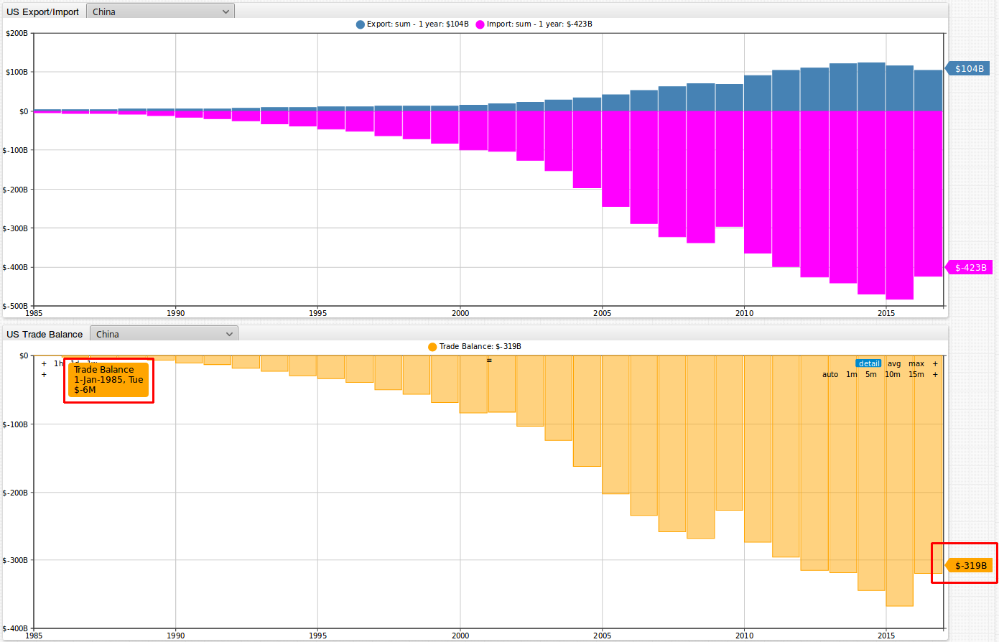
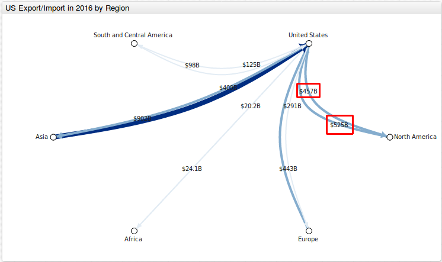
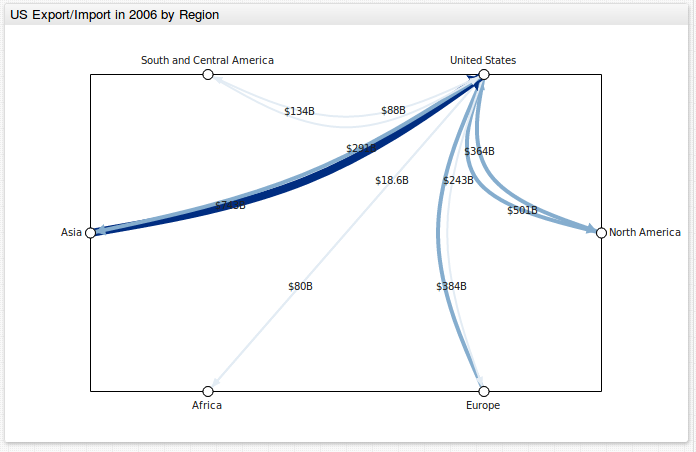
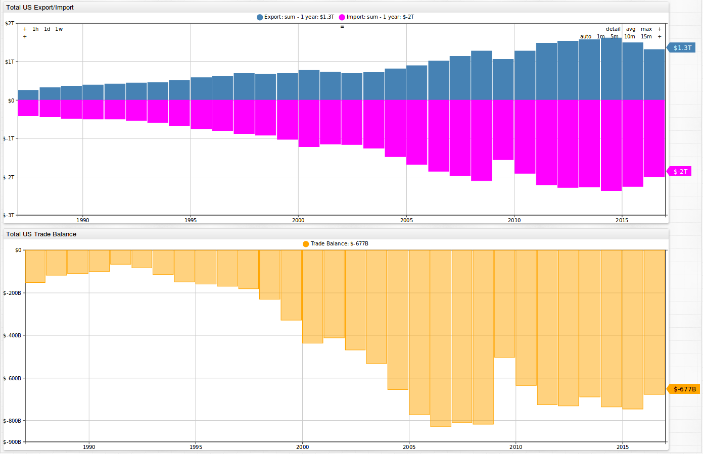
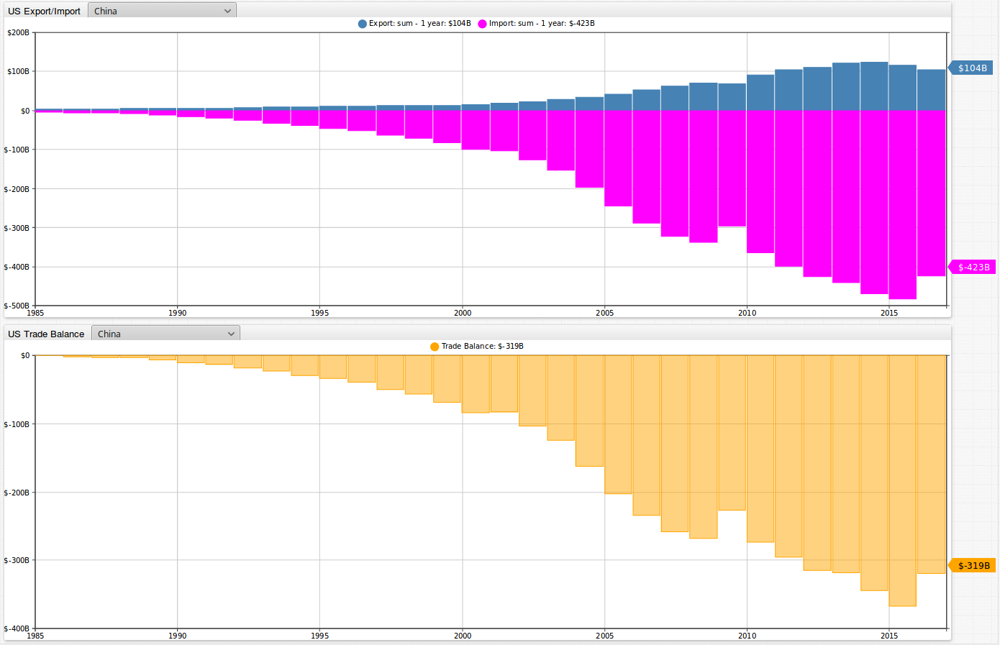
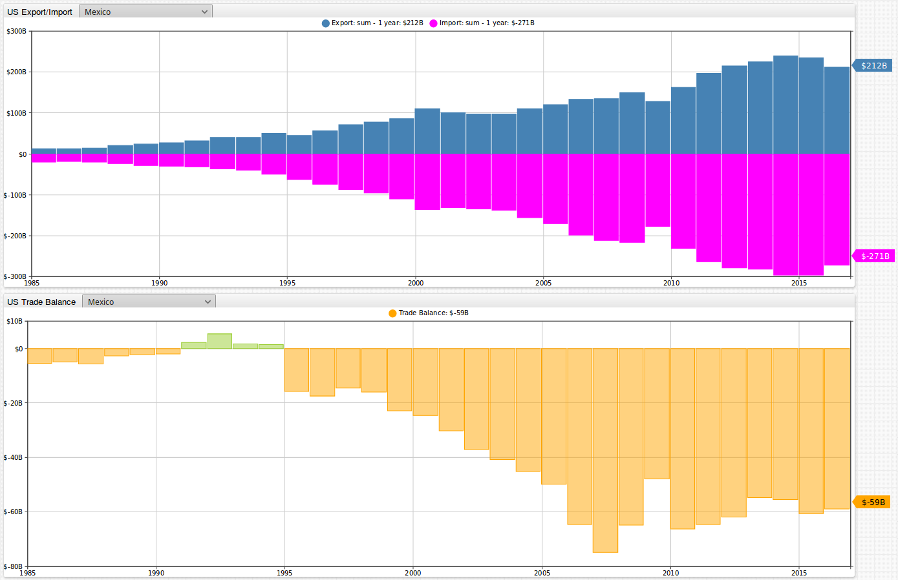
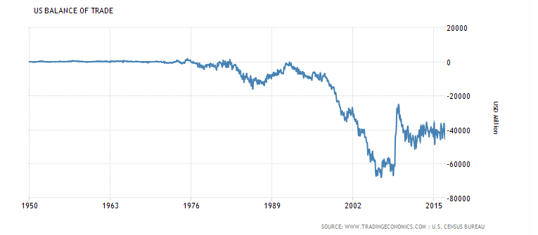

Analyzing America's International Trade History
===============================================

Buy American. Drive American. Wear American. The American economy seems to be on everybody's minds these days, namely returning jobs and money sent overseas back to the American people. Many voters in the 2016 U.S. presidental election 
desired to return to a time where America was producing more than it was taking in. According to an article on [forbes.com](http://www.forbes.com/sites/mikepatton/2016/02/29/u-s-role-in-global-economy-declines-nearly-50/#3e2283ea59c1),
the United States represented **40%** of the world's GDP in **1960**. By 2014, that number had dropped to only **20%**. According to [CNN](http://money.cnn.com/2016/03/29/news/economy/us-manufacturing-jobs/), since 2000 the U.S. has lost over 5 
million manufacturing jobs. Additionally, the percentage of Americans employed in manufacturing dropped from **19%** in 1980 to **8%** in 2016. How did things change so drastically
for America? Is there any chance of going back and recapturing the economic prosperity of days gone by? How has was America's international trading patterns changed 
over time, and what impact has that had on the country's economy? In this article we will analyze a dataset from [census.gov](https://www.census.gov) looking at 
[America's trade balance](https://www.census.gov/foreign-trade/balance/country.xlsx) from 1985 through the present time. This research article illustrates how 
publicly available data from census.gov can be easily loaded into the non-relational [Axibase Time Series Database (ATSD)](http://axibase.com/products/axibase-time-series-database/) 
for interactive analysis and graphical representation of raw data collected by government organizations. The article provides both sample queries and charts, 
as well as instructions on how to install your own ATSD instance and populate it with the raw data. 

### America's Trade Balance Dataset
-----------------------------------

Let's take a look at dataset looking at America's trade balance from [census.gov](https://www.census.gov/).  

This dataset can be found here: https://www.census.gov/foreign-trade/balance/index.html. 

Click on the link labeled **Download the full dataset for all countries (Excel - 5 MB)**. You are only given the option of downloading this dataset as an [Excel file (5 MB)](https://www.census.gov/foreign-trade/balance/country.xlsx).

This dataset contains import and export statistics collected monthly from 1985 to the present time for the United States and 259 locations. These locations include countries,
continents (such as Europe and Asia), political organizations (such as the European Union), as well as various other organizations (such as [OPEC](https://en.wikipedia.org/wiki/OPEC)). 

It is much more convenient to interact with the data once it is loaded into a database, as opposed to analyzing this dataset in Excel. The 
[Axibase Time Series Database (ATSD)](http://axibase.com/products/axibase-time-series-database/) is a powerful tool when it comes to storing, analyzing, and visualizing datasets. We will use the
following two aspects of ATSD to look into this dataset: interactive graphs from [Chart Lab](/ChartLabIntro/README.md) and tabular outputs from analytical [SQL queries](https://github.com/axibase/atsd-docs/blob/master/api/sql/README.md#overview).
You can load the dataset into your ATSD instance by following the steps provided at the [end of the article](#action-items).

### 2016 At a Glance
--------------------

Below is an image of the top countries for U.S. export and imports in 2016. We have graphs for the top countries for both U.S. exports and imports. The table on the right provides
monetary values for exports, imports, and the trade balance (export minus import) between the U.S. and each respective country, continent, or organization. The table is sorted by
trade balance, with the highest negative trade balances showing at the top. You may sort the table by clicking on the column headers.
 
In 2016, the locations with which the United States had the highest negative and positive trade balances with was China and Hong Kong at **- $319 billion** and **$25.1 billion**, 
respectively.   



You can explore this portal by clicking the button below:

[](https://apps.axibase.com/chartlab/53e42403#fullscreen)

In addition to looking at graphical outputs, we can also perform [SQL queries](https://github.com/axibase/atsd-docs/blob/master/api/sql/README.md#overview), which can be used 
to search for specific information contained in this dataset. For example, how did 2016 look for the United States for trade balance (in billions USD) with regions of the world as a whole: 

```sql
SELECT e.tags.ctyname AS region,
  e.tags.cty_code AS code,
  SUM(e.value)/1000 AS export, 
  SUM(i.value)/1000 AS import, 
  (SUM(e.value)-SUM(i.value))/1000 AS trade_balance
FROM 'us-trade-export' e 
  JOIN 'us-trade-import' i 
WHERE e.datetime >= '2016-01-01T00:00:00Z' AND e.datetime < '2017-01-01T00:00:00Z' 
  AND e.tags.cty_code < '1000' AND e.tags.cty_code NOT IN ('0004', '0005', '0006', '0007', '0008', '0015', '0017')
GROUP BY e.period(1 year), e.tags 
  ORDER BY region
```

```ls
| region                     | code  | export  | import  | trade_balance | 
|----------------------------|-------|---------|---------|---------------| 
| Africa                     | 0013  | 20.2    | 24.1    | -3.9          | 
| Asia                       | 0016  | 409.3   | 902.2   | -492.9        | 
| Australia and Oceania      | 0018  | 24.4    | 13.0    | 11.4          | 
| Europe                     | 0012  | 291.4   | 442.6   | -151.2        | 
| European Union             | 0003  | 247.4   | 381.5   | -134.1        | 
| North America              | 0010  | 457.5   | 525.4   | -67.9         | 
| OPEC                       | 0001  | 64.0    | 70.5    | -6.5          | 
| Pacific Rim                | 0014  | 328.2   | 740.6   | -412.5        | 
| South and Central America  | 0009  | 125.0   | 97.9    | 27.2          | 
| Sub Saharan Africa         | 0019  | 12.4    | 18.2    | -5.8          | 
```

Using the same query structure but changing the line `WHERE e.datetime >= '2016-01-01T00:00:00Z' AND e.datetime < '2017-01-01T00:00:00Z'`, we can look at these relationships for
previous years.

Trade balance  (in billions USD) from 2006.

```ls
| region                     | code  | export  | import  | trade_balance | 
|----------------------------|-------|---------|---------|---------------| 
| Africa                     | 0013  | 18.6    | 80.4    | -61.8         | 
| Asia                       | 0016  | 290.8   | 743.4   | -452.7        | 
| Australia and Oceania      | 0018  | 20.7    | 11.7    | 9.0           | 
| Europe                     | 0012  | 243.0   | 384.0   | -141.0        | 
| European Union             | 0003  | 211.9   | 330.5   | -118.6        | 
| North America              | 0010  | 364.4   | 500.7   | -136.3        | 
| OPEC                       | 0001  | 38.7    | 150.8   | -112.1        | 
| Pacific Rim                | 0014  | 252.4   | 618.5   | -366.1        | 
| South and Central America  | 0009  | 88.4    | 133.7   | -45.3         | 
| Sub Saharan Africa         | 0019  | 11.9    | 59.1    | -47.2         | 
```

Trade balance (in billions USD) from 1997.

```ls
| region                     | code  | export  | import  | trade_balance | 
|----------------------------|-------|---------|---------|---------------| 
| Africa                     | 0013  | 11.4    | 19.9    | -8.5          | 
| Asia                       | 0016  | 213.5   | 355.0   | -141.5        | 
| Australia and Oceania      | 0018  | 14.4    | 6.5     | 8.0           | 
| Europe                     | 0012  | 163.3   | 181.4   | -18.2         | 
| European Union             | 0003  | 143.9   | 160.9   | -17.0         | 
| North America              | 0010  | 223.2   | 253.2   | -30.0         | 
| OPEC                       | 0001  | 25.5    | 44.0    | -18.5         | 
| Pacific Rim                | 0014  | 193.7   | 315.4   | -121.6        | 
| South and Central America  | 0009  | 63.0    | 53.7    | 9.3           | 
| Sub Saharan Africa         | 0019  | 6.2     | 16.5    | -10.3         | 
```

In addition to tables output from SQL queries, we can display these relationships in Chart Lab graphs. Below are images for U.S. trade export and import numbers with South and
Central America, Asia, Africa, Europe, and North America for 2016, 2006, and 1997. Lines are drawn going from (exports) and coming back to (imports) the U.S. The heavier the lines
are between the U.S. and the respective continent, the greater the dollar amount in trade. We can see that, from the first image, 2016 exports from the U.S. to North America totalled
**$457 billion**, while imports from North America into the US totalled **$525 billion**, resulting in a trade balance of **-$68 billion**. Additionally, we can see that the heaviest lines in all three images were between
the U.S. and Asia, indicating that these two have the highest trade volume between them. 







You can explore these figures in Chart Lab by clicking on the button below:

[](https://apps.axibase.com/chartlab/b9f27b14/2/#fullscreen)

Which countries were the US's best trading partners (imports plus exports, in millions USD) in 2016?

```sql
SELECT date_format(e.time, 'yyyy') AS 'year', e.tags.ctyname AS country, e.tags.cty_code AS code,
  SUM(e.value) AS export, SUM(i.value) AS import, 
  SUM(e.value)+SUM(i.value) AS trade_total
  FROM 'us-trade-export' e
  JOIN 'us-trade-import' i
WHERE e.datetime >= '2016-01-01T00:00:00Z' and e.datetime < '2017-01-01T00:00:00Z'
  AND e.tags.cty_code > '1000'
  AND e.tags.cty_code NOT IN ('7740', '4350', '8500', '5080', '5160', '4790', '4610', '4799', '4802', '7320', '2771', '8220')
GROUP BY e.period(1 year), e.tags
  WITH ROW_NUMBER(e.entity, e.tags ORDER BY e.period(1 year)) < 10
  ORDER BY SUM(e.value)+SUM(i.value) DESC
  LIMIT 20
```

```ls
| year  | country         | code  | export    | import    | trade_total   | 
|-------|-----------------|-------|-----------|-----------|---------------| 
| 2016  | China           | 5700  | 104149.1  | 423431.2  | 527580.3      | 
| 2016  | Canada          | 1220  | 245619.2  | 254756.1  | 500375.4      | 
| 2016  | Mexico          | 2010  | 211848.7  | 270647.2  | 482495.9      | 
| 2016  | Japan           | 5880  | 57597.2   | 120006.5  | 177603.7      | 
| 2016  | Germany         | 4280  | 44997.8   | 104553.9  | 149551.7      | 
| 2016  | Korea, South    | 5800  | 37997.1   | 64465.1   | 102462.2      | 
| 2016  | United Kingdom  | 4120  | 51081.3   | 49553.9   | 100635.2      | 
| 2016  | France          | 4279  | 28018.7   | 43173.6   | 71192.3       | 
| 2016  | India           | 5330  | 19592.9   | 42552.0   | 62144.9       | 
| 2016  | Taiwan          | 5830  | 23409.5   | 35949.9   | 59359.4       | 
| 2016  | Italy           | 4759  | 15243.7   | 41147.7   | 56391.4       | 
| 2016  | Switzerland     | 4419  | 20468.3   | 33124.0   | 53592.3       | 
| 2016  | Netherlands     | 4210  | 36955.4   | 14807.3   | 51762.7       | 
| 2016  | Brazil          | 3510  | 27711.3   | 23712.0   | 51423.3       | 
| 2016  | Ireland         | 4190  | 8761.2    | 41466.4   | 50227.7       | 
| 2016  | Vietnam         | 5520  | 9451.9    | 38792.8   | 48244.7       | 
| 2016  | Belgium         | 4231  | 29878.1   | 15749.5   | 45627.6       | 
| 2016  | Malaysia        | 5570  | 10746.9   | 33600.3   | 44347.2       | 
| 2016  | Singapore       | 5590  | 24528.4   | 16606.0   | 41134.4       | 
| 2016  | Hong Kong       | 5820  | 31892.2   | 6821.8    | 38714.1       | 
```

### A Closer Look at the Recent History of America's International Trade
------------------------------------------------------------------------

Has the U.S. always had a negative international trade balance? If not, where did things change? Below are images showing import, export, and trade balance values between the U.S. and two of it's
three largest trading partners: China and Mexico. The top image in each figure showing exports (in blue) over imports (in pink). The lower figure shows the trade balance,
which is the dollar amount for exports minus imports. 





You can explore this portal by clicking on the below button:

[](https://apps.axibase.com/chartlab/552d7a44#fullscreen)

Of the two, the trade deficit with China really seems to stick out. As shown in the table below output from an SQL query, we can see that the trade balance grew from **-$6 
million** in 1985 to **-$319 billion** in 2016.     

```sql
SELECT date_format(e.time, 'yyyy') AS 'year', 
  e.tags.ctyname AS country, 
  SUM(e.value) AS export, 
  SUM(i.value) AS import, 
  SUM(e.value)-SUM(i.value) AS trade_balance
FROM 'us-trade-export' e 
  JOIN 'us-trade-import' i 
WHERE e.datetime >= '1970-01-01T00:00:00Z' AND e.datetime < '2017-01-01T00:00:00Z' 
  AND e.tags.ctyname IN ('China') 
GROUP BY e.period(1 year), e.tags 
  ORDER BY e.datetime DESC
```

```ls
| year  | country  | export    | import    | trade_balance | 
|-------|----------|-----------|-----------|---------------| 
| 2016  | China    | 104149.1  | 423431.2  | -319282.1     | 
| 2015  | China    | 116071.8  | 483244.7  | -367172.9     | 
| 2014  | China    | 123620.7  | 468483.9  | -344863.2     | 
| 2013  | China    | 121746.2  | 440430.0  | -318683.8     | 
| 2012  | China    | 110516.6  | 425619.1  | -315102.5     | 
| 2011  | China    | 104121.5  | 399371.2  | -295249.7     | 
| 2010  | China    | 91911.1   | 364952.6  | -273041.6     | 
| 2009  | China    | 69496.7   | 296373.9  | -226877.2     | 
| 2008  | China    | 69732.8   | 337772.6  | -268039.8     | 
| 2007  | China    | 62936.9   | 321442.9  | -258506.0     | 
| 2006  | China    | 53673.0   | 287774.4  | -234101.3     | 
| 2005  | China    | 41192.0   | 243470.1  | -202278.1     | 
| 2004  | China    | 34427.8   | 196682.0  | -162254.3     | 
| 2003  | China    | 28367.9   | 152436.1  | -124068.2     | 
| 2002  | China    | 22127.7   | 125192.6  | -103064.9     | 
| 2001  | China    | 19182.3   | 102278.4  | -83096.1      | 
| 2000  | China    | 16185.2   | 100018.2  | -83833.0      | 
| 1999  | China    | 13111.1   | 81788.2   | -68677.1      | 
| 1998  | China    | 14241.2   | 71168.6   | -56927.4      | 
| 1997  | China    | 12862.2   | 62557.7   | -49695.5      | 
| 1996  | China    | 11992.6   | 51512.8   | -39520.2      | 
| 1995  | China    | 11753.7   | 45543.2   | -33789.5      | 
| 1994  | China    | 9281.7    | 38786.8   | -29505.1      | 
| 1993  | China    | 8762.9    | 31539.9   | -22777.0      | 
| 1992  | China    | 7418.5    | 25727.5   | -18309.0      | 
| 1991  | China    | 6278.2    | 18969.2   | -12691.0      | 
| 1990  | China    | 4806.4    | 15237.4   | -10431.0      | 
| 1989  | China    | 5755.4    | 11989.7   | -6234.3       | 
| 1988  | China    | 5021.6    | 8510.9    | -3489.3       | 
| 1987  | China    | 3497.3    | 6293.6    | -2796.3       | 
| 1986  | China    | 3106.3    | 4771.0    | -1664.7       | 
| 1985  | China    | 3855.7    | 3861.7    | -6.0          | 
```

Below is an image of the trade balance between the United States with the rest of the world from 1985 to 2016. The trade balance has grown from **-$152 billion** in 1987 to
**-$677 billion** in 2016.


You can explore this portal by clicking on the below button:

[](https://apps.axibase.com/chartlab/552d7a44/2/#fullscreen)

Using the following query, we can see that, within the time range of our dataset, 1991 was the year with that had the least negative trade balance of **-$66.7 billion**.  

```sql
SELECT date_format(e.time, 'yyyy') AS 'year', e.tags.ctyname AS country,
  SUM(e.value)/1000 AS export, 
  SUM(i.value)/1000 AS import, 
  (SUM(e.value)-SUM(i.value))/1000 AS trade_balance
  FROM 'us-trade-export' e
  JOIN 'us-trade-import' i
WHERE e.datetime >= '1970-01-01T00:00:00Z' and e.datetime < '2017-01-01T00:00:00Z'
  AND e.tags.cty_code = '0015'
GROUP BY e.period(1 year), e.tags
  WITH ROW_NUMBER(e.entity, e.tags ORDER BY SUM(e.value)-SUM(i.value) DESC) <= 1
```

```ls
| year  | country                         | export  | import  | trade_balance | 
|-------|---------------------------------|---------|---------|---------------| 
| 1991  | World, Not Seasonally Adjusted  | 421.7   | 488.5   | -66.7         | 
```

Below is figure showing the US balance of trade going back to 1950. 



We can see that up until 1976, the United States had a trade balance of virtually zero, that is the total amount imported equalled the total amount exported. Things, however, quickly began
to change. According the [Forbes](http://www.forbes.com/sites/mikepatton/2016/02/29/u-s-role-in-global-economy-declines-nearly-50/#11502f7059c1), at that time "America was flush with cash and companies were rapidly evolving, all of which caught the eye of the federal government. Washington saw this significant revenue 
source and increased business regulations and taxes to such an extent that it began to choke the very goose that laid the golden eggs." As the U.S. increased regulations on business,
more and more companies moved their operations overseas. From 1978 to 2002, [manufacturing jobs in China](https://pdfs.semanticscholar.org/0fc1/91833dca5c728ddfe2fdd6c4f97680a05442.pdf) grew by officially by **30 million**, with
unofficial estimates putting that number at greater than **50 million**. The rise of developing economies and tightening of U.S. regulations seems to have led to the U.S. having such
an uneven trade balance. While a even trade balance make not be everything that makes an economy hum, it is certainly a place to start looking when retooling a broken trading system.  

### Action Items
----------------

Below are the summarized steps to follow to install local configurations of ATSD and Axibase Collector and create SQL queries for analyzing America's trade balance statistics:

1. Install [Docker](https://docs.docker.com/engine/installation/linux/ubuntulinux/).
2. [Install the ATSD database](https://github.com/axibase/atsd-docs/blob/master/installation/docker.md#option-2-configure-collector-account-manually) on in your local Docker configuration. 
3. Save the [Excel file](https://www.census.gov/foreign-trade/balance/country.xlsx) in CSV format.
4. Import and upload `us-trade-ie-csv-parser.xml` file into ATSD.
5. Import the Excel file saved in `.csv` format into ATSD.
6. Import the `us-trade-balance-2016`, `us-trade-balance-rank-2016`, `world-gdp`, and `world-population` replacement tables into ATSD.
7. Navigate to the SQL tab in ATSD and begin writing your queries!

Check out our file on the describing our schema based parser used for this dataset [here](https://github.com/axibase/atsd-use-cases/blob/master/USInternationalTrade/resources/csv-parser-schema-explanation.md).

If you require assistance in installing this software or have any questions, please feel free to [contact us](https://axibase.com/feedback/) and we would be happy to be of assistance!

### Sources
-----------

Title Photo: https://www.reference.com/business-finance/denominations-u-s-currency-918a309bd714c43c

Figure9: http://www.tradingeconomics.com/united-states/balance-of-trade

### Additional SQL Queries
--------------------------

Here are some additional SQL queries (along with snippets of their outputs) which take a closer look at the U.S.'s international trade history.

Annual exports for Mexico to the United States (in millions USD). 

```sql
SELECT date_format(time, 'yyyy') AS 'year', 
  tags.ctyname AS country, 
  SUM(value) AS export
FROM 'us-trade-export'
WHERE datetime >= '1985-01-01T00:00:00Z' AND datetime < '2017-01-01T00:00:00Z' 
  AND tags.ctyname IN ('Mexico') 
GROUP BY period(1 year), tags 
  ORDER BY datetime DESC
```

```ls
| year  | country  | export   | 
|-------|----------|----------| 
| 2016  | Mexico   | 211848.7 | 
| 2015  | Mexico   | 235745.1 | 
| 2014  | Mexico   | 240331.2 | 
| 2013  | Mexico   | 225954.4 | 
| 2012  | Mexico   | 215875.1 | 
| 2011  | Mexico   | 198288.7 | 
| 2010  | Mexico   | 163664.6 | 
| 2009  | Mexico   | 128892.1 | 
```

Year with the highest trade balance (in millions USD) for each country, with 2016 population estimate (absolute value) listed as well. 

```sql
SELECT date_format(e.time, 'yyyy') AS 'year', e.tags.ctyname AS country, e.tags.cty_code AS code,
  SUM(e.value) AS export, SUM(i.value) AS import, 
  SUM(e.value)-SUM(i.value) AS trade_balance,
  LOOKUP('world-population', e.tags.ctyname) AS population
  FROM 'us-trade-export' e
  JOIN 'us-trade-import' i
WHERE e.datetime >= '1970-01-01T00:00:00Z' and e.datetime < '2017-01-01T00:00:00Z'
  AND e.tags.cty_code > '1000'
  AND e.tags.cty_code NOT IN ('7740', '4350', '8500', '5080', '5160', '4790', '4610', '4799', '4802', '7320', '2771', '8220')
GROUP BY e.period(1 year), e.tags
  WITH ROW_NUMBER(e.entity, e.tags ORDER BY SUM(e.value)-SUM(i.value) DESC) <= 1
  ORDER BY country
```

```ls
| year  | country              | code  | export   | import  | trade_balance  | population | 
|-------|----------------------|-------|----------|---------|----------------|------------| 
| 2011  | Afghanistan          | 5310  | 2921.9   | 26.1    | 2895.7         | 33369945   | 
| 2013  | Albania              | 4810  | 74.4     | 22.8    | 51.6           | 2903700    | 
| 1994  | Algeria              | 7210  | 1191.5   | 1526.9  | -335.4         | 40375954   | 
| 1998  | Andorra              | 4271  | 22.3     | 0.1     | 22.2           | 69165      | 
| 1986  | Angola               | 7620  | 86.5     | 677.6   | -591.1         | 25830958   | 
| 2007  | Anguilla             | 2481  | 92.5     | 4.6     | 88.0           | 14763      | 
| 2015  | Antigua and Barbuda  | 2484  | 677.7    | 6.9     | 670.8          | 92738      | 
| 2014  | Argentina            | 3570  | 10828.6  | 4246.4  | 6582.2         | 43847277   | 
| 2008  | Armenia              | 4631  | 151.4    | 42.7    | 108.7          | 3026048    | 
| 2014  | Aruba                | 2779  | 1300.2   | 60.4    | 1239.8         | 104263     | 
| 2012  | Australia            | 6021  | 31161.4  | 9566.8  | 21594.6        | 24309330   | 
```

**Note**: The following countries/codes are excluded since they either no longer exist or their codes have been modified.
          
|Code  |   Country     | Removal/Modification Date|
|------|---------------|--------------------------|
| 7740 |   Ethiopia    |   2003-12-01| 
| 4350 |   Czechoslovakia| 2003-12-01 |
| 8500 |   International Organizations| 2003-12-01| 
| 5080 |   Israel|  2003-12-01 |
| 5160 |   Iraq-Saudi Arabia Neutral Zone|  2003-12-01|
| 4790 |   Yugoslavia (former) | 2003-12-01|
| 4610 |   USSR |    2003-12-01|
| 4799 |   Serbia and Montenegro| 2006-12-01|
| 4802 |   Serbia|  2008-12-01|
| 7320 |   Sudan |  2011-12-01|
| 2771 |   Netherlands Antilles|    2011-12-01|
| 8220 |   Unidentified Countries|  2014-12-01 |

Year with the highest trade balance for the 20 largest countries by 2016 population estimate (in millions).

```sql
SELECT date_format(e.time, 'yyyy') AS 'year', e.tags.ctyname AS country, e.tags.cty_code AS code,
  SUM(e.value) AS export, SUM(i.value) AS import, 
  SUM(e.value)-SUM(i.value) AS trade_balance,
  CAST(LOOKUP('world-population', e.tags.ctyname))/1000000 AS population
  FROM 'us-trade-export' e
  JOIN 'us-trade-import' i
WHERE e.datetime >= '1970-01-01T00:00:00Z' and e.datetime < '2016-12-01T00:00:00Z'
  AND e.tags.cty_code > '1000'
  AND e.tags.cty_code NOT IN ('7740', '4350', '8500', '5080', '5160', '4790', '4610', '4799', '4802', '7320', '2771', '8220')
GROUP BY e.period(1 year), e.tags
  WITH ROW_NUMBER(e.entity, e.tags ORDER BY SUM(e.value)-SUM(i.value) DESC) <= 1
  ORDER BY CAST(LOOKUP('world-population', e.tags.ctyname)) DESC
  LIMIT 20
```

```ls
| year  | country     | code  | export   | import   | trade_balance  | population | 
|-------|-------------|-------|----------|----------|----------------|------------| 
| 1985  | China       | 5700  | 3855.7   | 3861.7   | -6.0           | 1382.3     | 
| 1988  | India       | 5330  | 2500.1   | 2939.5   | -439.4         | 1326.8     | 
| 1991  | Indonesia   | 5600  | 1891.5   | 3240.6   | -1349.1        | 260.6      | 
| 2013  | Brazil      | 3510  | 44105.5  | 27541.2  | 16564.3        | 209.6      | 
| 1985  | Pakistan    | 5350  | 1041.7   | 273.9    | 767.8          | 192.8      | 
| 2014  | Nigeria     | 7530  | 5965.9   | 3839.5   | 2126.4         | 187.0      | 
| 1985  | Bangladesh  | 5380  | 218.9    | 196.0    | 22.9           | 162.9      | 
| 1992  | Russia      | 4621  | 2112.5   | 481.4    | 1631.1         | 143.4      | 
```

Top 20 countries by largest trade deficit (in millions USD).

```sql
SELECT date_format(e.time, 'yyyy') AS 'year', e.tags.ctyname AS country, e.tags.cty_code AS code,
  SUM(e.value) AS export, SUM(i.value) AS import, 
  SUM(e.value)-SUM(i.value) AS trade_balance
  FROM 'us-trade-export' e
  JOIN 'us-trade-import' i
WHERE e.datetime >= '2016-01-01T00:00:00Z' and e.datetime < '2017-01-01T00:00:00Z'
  AND e.tags.cty_code > '1000'
  AND e.tags.cty_code NOT IN ('7740', '4350', '8500', '5080', '5160', '4790', '4610', '4799', '4802', '7320', '2771', '8220')
GROUP BY e.period(1 year), e.tags
  WITH ROW_NUMBER(e.entity, e.tags ORDER BY e.period(1 year)) < 10
  ORDER BY trade_balance
  LIMIT 20
```
      
```ls     
| year  | country       | code  | export    | import    | trade_balance | 
|-------|---------------|-------|-----------|-----------|---------------| 
| 2016  | China         | 5700  | 104149.1  | 423431.2  | -319282.1     | 
| 2016  | Japan         | 5880  | 57597.2   | 120006.5  | -62409.2      | 
| 2016  | Germany       | 4280  | 44997.8   | 104553.9  | -59556.1      | 
| 2016  | Mexico        | 2010  | 211848.7  | 270647.2  | -58798.6      | 
| 2016  | Ireland       | 4190  | 8761.2    | 41466.4   | -32705.2      | 
| 2016  | Vietnam       | 5520  | 9451.9    | 38792.8   | -29340.9      | 
| 2016  | Korea, South  | 5800  | 37997.1   | 64465.1   | -26468.0      | 
| 2016  | Italy         | 4759  | 15243.7   | 41147.7   | -25904.0      | 
| 2016  | India         | 5330  | 19592.9   | 42552.0   | -22959.1      | 
```

Year with the highest trade balance (in millions USD) for countries in the bottom 50% by GDP per capita (true value).

```sql
SELECT e.tags.ctyname AS country, 
  date_format(e.time, 'yyyy') AS 'year', 
  SUM(e.value) AS export, SUM(i.value) AS import, SUM(e.value)-SUM(i.value) AS trade_balance, 
  CAST(LOOKUP('us-trade-balance-2016', e.tags.ctyname) AS number) AS '2016_trade_balance', 
  1000000*CAST(LOOKUP('world-gdp', e.tags.ctyname) AS number)/CAST(LOOKUP('world-population', e.tags.ctyname) AS number) AS '2016_GDP_per_capita',
  CAST(LOOKUP('us-trade-balance-rank-2016', e.tags.ctyname) as number) AS '2016_trade_balance_rank' 
FROM 'us-trade-export' e 
  JOIN 'us-trade-import' i 
WHERE e.datetime >= '1970-01-01T00:00:00Z' AND e.datetime < '2017-01-01T00:00:00Z' 
  AND e.tags.cty_code > '1000' AND e.tags.cty_code NOT IN ('7740', '4350', '8500', '5080', '5160', '4790', '4610', '4799', '4802', '7320', '2771', '8220') 
  AND 1000000*CAST(LOOKUP('world-gdp', e.tags.ctyname) AS number)/CAST(LOOKUP('world-population', e.tags.ctyname) AS number) <= 10273
GROUP BY e.period(1 year), e.tags 
  WITH ROW_NUMBER(e.entity, e.tags ORDER BY SUM(e.value)-SUM(i.value) DESC) <= 1
  ORDER BY CAST(LOOKUP('us-trade-balance-rank-2016', e.tags.ctyname) AS number)
  LIMIT 10
```

```ls
| country     | year  | export   | import   | trade_balance  | 2016_trade_balance  | 2016_GDP_per_capita  | 2016_trade_balance_rank | 
|-------------|-------|----------|----------|----------------|---------------------|----------------------|-------------------------| 
| China       | 1985  | 3855.7   | 3861.7   | -6.0           | -319282.1           | 8240.9               | 1.0                     | 
| Mexico      | 1992  | 40592.3  | 35211.1  | 5381.2         | -58798.6            | 8268.6               | 4.0                     | 
| Vietnam     | 1996  | 616.6    | 331.8    | 284.8          | -29340.9            | 2122.9               | 6.0                     | 
| India       | 1988  | 2500.1   | 2939.5   | -439.4         | -22959.1            | 1696.6               | 9.0                     | 
| Malaysia    | 1986  | 1729.6   | 2420.4   | -690.8         | -22853.4            | 9845.0               | 10.0                    | 
| Thailand    | 1985  | 849.1    | 1428.3   | -579.2         | -17537.7            | 5731.6               | 11.0                    | 
| Indonesia   | 1991  | 1891.5   | 3240.6   | -1349.1        | -12245.4            | 3611.0               | 15.0                    | 
| Russia      | 1992  | 2112.5   | 481.4    | 1631.1         | -7839.3             | 8838.2               | 18.0                    | 
| Bangladesh  | 1985  | 218.9    | 196.0    | 22.9           | -4695.8             | 1410.3               | 23.0                    | 
| Iraq        | 1993  | 4.0      | 0.0      | 4.0            | -4048.3             | 4163.3               | 24.0                    | 
```

Year with the highest trade balance (in millions USD) for countries in the top 50% by GDP per capita (true value).

```sql
SELECT e.tags.ctyname AS country, 
  date_format(e.time, 'yyyy') AS 'year', 
  SUM(e.value) AS export, SUM(i.value) AS import, SUM(e.value)-SUM(i.value) AS trade_balance, 
  CAST(LOOKUP('us-trade-balance-2016', e.tags.ctyname) AS number) AS '2016_trade_balance', 
  1000000*CAST(LOOKUP('world-gdp', e.tags.ctyname) AS number)/CAST(LOOKUP('world-population', e.tags.ctyname) AS number) AS '2016_GDP_per_capita',
  CAST(LOOKUP('us-trade-balance-rank-2016', e.tags.ctyname) as number) AS '2016_trade_balance_rank' 
FROM 'us-trade-export' e 
  JOIN 'us-trade-import' i 
WHERE e.datetime >= '1970-01-01T00:00:00Z' AND e.datetime < '2017-01-01T00:00:00Z' 
  AND e.tags.cty_code > '1000' AND e.tags.cty_code NOT IN ('7740', '4350', '8500', '5080', '5160', '4790', '4610', '4799', '4802', '7320', '2771', '8220') 
  AND 1000000*CAST(LOOKUP('world-gdp', e.tags.ctyname) AS number)/CAST(LOOKUP('world-population', e.tags.ctyname) AS number) > 10273
GROUP BY e.period(1 year), e.tags 
  WITH ROW_NUMBER(e.entity, e.tags ORDER BY SUM(e.value)-SUM(i.value) DESC) <= 1
  ORDER BY CAST(LOOKUP('us-trade-balance-rank-2016', e.tags.ctyname) AS number)
  LIMIT 10
```

```ls
| country       | year  | export   | import   | trade_balance  | 2016_trade_balance  | 2016_GDP_per_capita  | 2016_trade_balance_rank | 
|---------------|-------|----------|----------|----------------|---------------------|----------------------|-------------------------| 
| Japan         | 1990  | 48579.5  | 89684.0  | -41104.5       | -62409.2            | 37445.9              | 2.0                     | 
| Germany       | 1991  | 21302.5  | 26136.4  | -4833.9        | -59556.1            | 43316.8              | 3.0                     | 
| Ireland       | 1989  | 2482.9   | 1565.5   | 917.4          | -32705.2            | 65319.8              | 5.0                     | 
| Korea, South  | 1996  | 26621.1  | 22654.9  | 3966.2         | -26468.0            | 27807.3              | 7.0                     | 
| Italy         | 1991  | 8569.8   | 11764.2  | -3194.4        | -25904.0            | 30977.7              | 8.0                     | 
| France        | 1991  | 15345.6  | 13333.0  | 2012.6         | -15154.9            | 38477.7              | 12.0                    | 
| Switzerland   | 2008  | 22023.6  | 17781.9  | 4241.8         | -12655.6            | 79060.2              | 13.0                    | 
| Taiwan        | 1993  | 16167.8  | 25101.5  | -8933.7        | -12540.4            | 22190.0              | 14.0                    | 
| Canada        | 1991  | 85149.8  | 91063.9  | -5914.1        | -9136.9             | 42229.1              | 16.0                    | 
| Israel        | 1987  | 3130.2   | 2639.3   | 490.9          | -8352.5             | 38051.9              | 17.0                    | 
```

Year with the highest trade balance (in millions USD) by region.

```sql
SELECT e.tags.ctyname AS country, 
  date_format(e.time, 'yyyy') AS 'year', 
  SUM(e.value)/1000 AS export, 
  SUM(i.value)/1000 AS import, 
  (SUM(e.value)-SUM(i.value))/1000 AS trade_balance
FROM 'us-trade-export' e 
  JOIN 'us-trade-import' i 
WHERE e.datetime >= '1970-01-01T00:00:00Z' AND e.datetime < '2017-01-01T00:00:00Z' 
  AND e.tags.cty_code < '1000' AND e.tags.cty_code NOT IN ('0004', '0005', '0006', '0007', '0008', '0015', '0017')
GROUP BY e.period(1 year), e.tags 
  WITH ROW_NUMBER(e.entity, e.tags ORDER BY SUM(e.value)-SUM(i.value) DESC) <= 1
  ORDER BY e.time
```

```ls
| country                    | year  | export  | import  | trade_balance | 
|----------------------------|-------|---------|---------|---------------| 
| Asia                       | 1985  | 59.3    | 131.2   | -71.9         | 
| North America              | 1992  | 131.2   | 133.8   | -2.7          | 
| Pacific Rim                | 1992  | 124.5   | 208.4   | -84.0         | 
| European Union             | 1997  | 143.9   | 160.9   | -17.0         | 
| Europe                     | 1997  | 163.3   | 181.4   | -18.2         | 
| Australia and Oceania      | 2012  | 35.4    | 13.5    | 22.0          | 
| Africa                     | 2014  | 38.1    | 34.6    | 3.5           | 
| OPEC                       | 2015  | 72.8    | 66.2    | 6.6           | 
| South and Central America  | 2015  | 152.5   | 115.9   | 36.7          | 
| Sub Saharan Africa         | 2015  | 18.0    | 18.8    | -0.8          | 
```