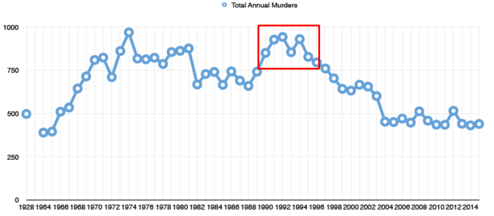
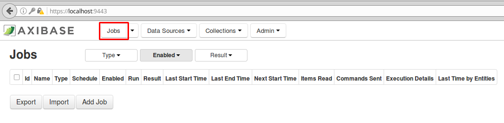
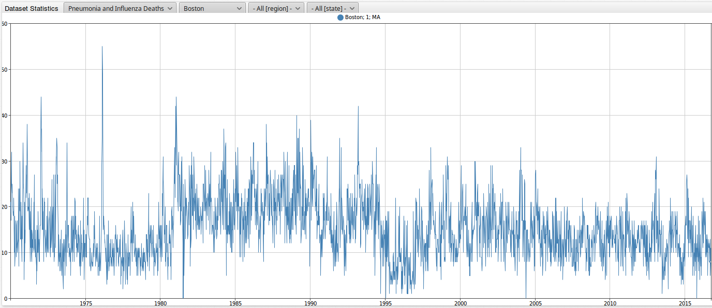

Knocking on Heaven's Door - Computing U.S. Mortality Statistics
===============================================================

### Introduction
----------------

Death. Along with taxes, it is one of the few certainties in life. While we all will meet our end some day, that end is becoming farther and farther away and the risk of death is decreasing.
According to [infoplease.com](http://www.infoplease.com/ipa/A0005148.html), life expectancy from 1935 to 2010 for both sexes in the U.S. increased from 61.7 to 78.7 years. 
As reported by the [Center for Disease Control and Prevention (CDC)](http://www.cdc.gov/nchs/data/databriefs/db88.htm#x2013;2010%3C/a%3E>), the crude death rate in the United States fell from 1,094.5 to 798.7 deaths per 100,000 people from 1935 to 2010, translating to 
a 27% decrease. However, the population of the U.S. as a whole was getting older during this time period. When this affect of aging was removed from calculation, the CDC estimates that the age
adjusted **risk of dying dropped by 60 percent from 1935 to 2010**.  
 
The death rate for the 1 to 4 years of age group dropped by **94 percent** from 1935 to 2010.

The death rate for the 65 to 74 years of age group dropped by **62 percent** from 1935 to 2010. 

Below is an image showcasing the percent change from 1935 to 2010 in death rates by age in the U.S. from the [CDC](http://www.cdc.gov/nchs/data/databriefs/db88_fig3.png).


In this article we will look at weekly death total statistics collected for over 100 U.S. cities for over 50 years. We will begin by introducing ourselves to the dataset. Next, we will walk 
through installing local configurations of the Axibase Time Series Database (ATSD) and Axibase Collector using Docker. We will then go through through the ATSD's SQL query language 
capabilities to help make sense and digest all of this information on death in the United States. Lastly, we will then look at incorporating population figures to calculate mortality rates for each individual city.
 
### Death Statistics for 122 U.S. Cities
----------------------------------------

Let's take a look at the dataset **Deaths in 122 U.S. cities - 1962-2016. 122 Cities Mortality Reporting System** from data.gov.

This dataset can be found here: [https://catalog.data.gov/dataset/deaths-in-122-u-s-cities-1962-2016-122-cities-mortality-reporting-system](https://catalog.data.gov/dataset/deaths-in-122-u-s-cities-1962-2016-122-cities-mortality-reporting-system)

This file contains data for the weekly death totals collected from 1962 to 2016 in 122 U.S. cities. The system was retired on October 6th, 2016. While the system was running, the vital statistics
offices of these cities across the United States reported the total number of death certificates processed and the number of those for which pneumonia or influenza was listed as the underlying 
or contributing cause of death by age group. Deaths from under the age of 1 year are not included in this dataset. Deaths in this dataset are split into the following categories:

* 1 - 24 years (all causes of death)
* 25 - 44 years (all causes of death)
* 45 - 64 years (all causes of death)
* 65 + years (all causes of death)
* All deaths
* Pneumonia and influenza deaths

In the [Appendix](https://github.com/axibase/atsd-use-cases/blob/master/USMortality/README.md#appendix-death-statistics-city-list) of this article, you can find a complete list of the cities (with their corresponding state) included in this dataset.

Deaths can be grouped by geographic region, all of which are shown below.

These are regions are part of the United States Census Bureau's [census regions and divisions](http://www.census.gov/econ/census/help/geography/regions_and_divisions.html)

| Region | Region Name | States included in Region |
|---|---------------|-------------------------------------------------------------------------------------------------------|
| 1 | New-England | Connecticut (CT), Maine (ME), Massachusetts (MA), New Hampshire (NH), Rhode Island (RI), Vermont (VT) |
| 2 | Middle-Atlantic | New Jersey (NJ), New York (NY), Pennsylvania (PA) |
| 3 | East-North-Central | Illinois (IL), Indiana (IN), Michigan (MI), Ohio (OH), Wisconsin (WI) |
| 4 | West-North-Central | Iowa (IA), Kansas (KS), Minnesota (MN), Missouri (MO), Nebraska (NE), North Dakota (ND), South Dakota (ND)
| 5 | South-Atlantic | Delaware (DE), District of Columbia (DC), Florida (FL), Georgia (GA), Maryland (MD), North Carolina (NC), South Carolina (SC), Virginia (VA), West Virginia (WV) |
| 6 | East-South-Central | Alabama (AL), Kentucky (KY), Mississippi (MS), Tennessee (TN) |
| 7 | West-South-Central | Arkansas (AR), Louisiana (LA), Oklahoma (OK), Texas (TX) |
| 8 | Mountain | Arizona (AZ), Colorado (CO), Idaho (ID), Montana (MT), Nevada (NV), New Mexico (NM), Utah (UT), Wyoming (WY) |
| 9 | Pacific | Alaska (AK), California (CA), Hawaii (HI), Oregon (OR), Washington (WA) |

On the data.gov website, datasets can be downloaded as a CSV, RDF, JSON, or a XML file. This dataset can easily be parsed using the JSON job in Axibase.

### Axibase Time Series Database
--------------------------------

The processing of datasets using Axibase Time Series Database (ATSD) is straight forward.  Processing the same data with ATSD is less time consuming
because its collection tool has built-in heuristics to handle the format in which data.gov datasets are published, namely the Socrata Open Data Format.
When loading data for a particular dataset the collector uses Socrata metadata to understand the meaning of columns and automatically extract dates, times,
and categories from the data files. Besides, ATSD stores the data in the user's own database so that this public data can be combined with internal data
sources as well as mixed and matched across different datasets. Once you install ATSD, you **don't** have to:

* Add additional datasets from data.gov
* Manipulate and design table schema
* Provision an application server
* Write programs to parse and digest these types of files

Rather, you can configure a scheduled job to retrieve the file from the specified endpoint and have ATSD parse it according to pre-defined rules. Once you
have raw data in ATSD, creating and sharing reports with built-in widgets is fairly trivial using examples from [axibase.com](http://axibase.com/products/axibase-time-series-database/visualization/widgets/). 

Below is an output of the default configuration with all 122 U.S. cities parsed into the Axibase Time Series Database (ATSD).


Here you can explore the complete dataset for U.S. death totals:

[](https://apps.axibase.com/chartlab/3d07088c)

The user has the ability to filter the data to their liking in the above instance. 

The following four filters are applied to the default portal:

* First dropdown: allows the user to view data by the specified metric. In the default portal, the user has the option of choosing death totals for 1 - 24 years (all causes of death),
  25 - 44 years (all causes of death), 45 - 64 years (all causes of death), 65 + years (all causes of death), all deaths, and pneumonia and influenza deaths. In the default instance above,
  1 - 24 years (all causes of death) is selected.
* Second dropdown: allows the user to filter between 122 U.S. cities. Again, the list of available cities is shown in the [Appendix](https://github.com/axibase/atsd-use-cases/blob/master/USMortality/README.md#appendix-death-statistics-city-list) . In the case above, all cities have been selected. 
* Third dropdown: allows the user to filter by geographic region (1,2,3,4,5,6,7,8, and 9 as mentioned above). In the above case, all regions have been selected.
* Fourth dropdown: allows the user to filter by state. In the above case, all states have been selected.

Below is an image when a city is selected from the the second dropdown. In this instance, Chicago (IL) has been selected for the 1 - 24 years age group. We can see that there was a quite 
the spike in the number of deaths in the city from March 2nd, 1991, to June 3, 1995.


The next image is again for Chicago, but this time filtered for the 25 - 44 years age group. Again, we can see that the was quite the spike in the number of deaths in the city, exactly matching
the period from the previous image, March 2nd, 1991, to June 3, 1995.  


Let us know filter for the remaining age groups (45 - 64 years, 65 + years, all deaths, and pneumonia and influenza deaths). We can see that these groups **do not** have the same spike in deaths 
as the previous groups, as shown below.

| 45 - 64 Years | 65 + Years  | 
| --- | --- |
|  |  |

| All Deaths | Pneumonia and Influenza Deaths | 
| --- | --- |
|  |  |

What was the reason for this drastic rise in deaths for people under the age of 44 between 1991 to 1995? This may be in part to a rise in murders in the city in this same time period. According
to a Chicago Police Department [report from 2011](http://4abpn833c0nr1zvwp7447f2b.wpengine.netdna-cdn.com/wp-content/uploads/2014/12/2011-Murder-Report.pdf), the number of murders in the city from 1991 to 1995 were 928, 943, 855, 931, and 828. In [1988](http://4abpn833c0nr1zvwp7447f2b.wpengine.netdna-cdn.com/wp-content/uploads/2014/12/1988-Annual-Report.pdf), the total number of murders was
660. As detailed in the same 2011 report, murders in the late 1990's and into the 2000's from 643 in 1999 to 436 in 2010. Below is an [figure](https://en.wikipedia.org/wiki/Crime_in_Chicago#/media/File:Chicago_Murder_Rates.png) of total annual murders in Chicago, with our peak
period marked in red.



You can observe this filtered portal for Chicago here:

[](https://apps.axibase.com/chartlab/6cf6fe70)

Using the third dropdown, we are able to sort by geographic region. This list will come in handy later in the article when we delve into Axibase's SQL query language capabilities. 

1 = New-England<br />
2 = Middle-Atlantic<br />
3 = East-North-Central<br />
4 = West-North-Central<br />
5 = South-Atlantic<br />
6 = East-South-Central<br />
7 = West-South-Central<br />
8 = Mountain<br />
9 = Pacific<br />

Let us sort by region 9 (pacific). Below is an output for this filtered instance. We can see that cities for California (CA), Hawaii (HI), Oregon (OR), Washington (WA) are all included in
this output. We can observe that up until the early to mid 2000's, the deaths in Los Angeles greatly outnumber those of any other city in the region. Recently, however, the deaths in Los Angeles
have drastically dropped off, and now seem to generally be on par with several other cities in the region. Why has there been such a drastic drop off in deaths recently in Los Angeles?  


You can explore the filtered portal for the Pacific region here:

[](https://apps.axibase.com/chartlab/c284427c)

Finally, using the fourth dropdown, we are able to sort by state. It is worth noting that all not states are represented in this dataset. 39 states plus the District of Columbia are included
in this dataset. States that are not included are: Alaska (AK), Maine (ME), Mississippi (MS), Montana (MT), New Hampshire (NH), North Dakota (ND), South Carolina (SC), South Dakota (SD), 
Vermont (VT), West Virginia (WV), and Wyoming (WY). 

Below is an image of New Jersey (NJ) filtered for all deaths.


You can explore the filtered portal for the state of New Jersey here:

[](https://apps.axibase.com/chartlab/3d07088c)

We can see that there is an unbelievable amount of data in this ATSD instance. The high quantity of cities, the frequent collection intervals of the data, and the highly variable nature of the 
death totals make it difficult to wrap our heads around all of this. How can we make sense of all of it? Using Axibase's SQL query language capabilities allows you to easily search for specific
information within this portal. We will begin by walking through installing local configurations of ATSD and Axibase Collector, which we will then use to query our dataset.

### Creating Local Configurations for ATSD and Axibase Collector 
----------------------------------------------------------------

Below is a step-by-step walk through for setting up local configurations of ATSD and Axibase Collector. We will use Docker as our host. You can learn more about Docker [on our website](https://axibase.com/docker-monitoring/).   

1. Install Docker (Xenial Version 16.04). A link for how to install Docker can be found [here](https://docs.docker.com/engine/installation/linux/ubuntulinux/). 
2. Copy the `docker-compose.yml` file from our [GitHub](https://github.com/axibase/axibase-collector-docs/blob/master/docker-bundle.md) page. Save this file to whichever directory you are using
   in Terminal (i.e. Desktop, Documents).
3. In Terminal, launch containers with the below command:

   ```sql
   export USER=myuser; export PASSWORD=mypassword; docker-compose up -d 
   ```
4. Access the ATSD user interface by navigating to the address shown in the image below. Create a username and password. 

   

5. After completing Step 4, you will be redirected to the page shown below. Login to ATSD with the username and password you just created.

    
   
6. Access Axibase Collector by navigating to `https://localhost:9443`, and populate the username and password fields. After creating your username and password, you will be prompted to
   login. Enter in your username and password.

    
    
    After setting up accounts for both ATSD and collector, navigate to **Storage Drivers** in Collector. We want to check if is there is a connection established between Collector and ATSD. 
    If **Write Status** is successful, this means that Collector can send data to ATSD. 
    
    

7. We now want to import a `.xml` job file, which contains rules for how essentially the data will be retrieved from the source, in our case [data.gov](https://catalog.data.gov/dataset/deaths-in-122-u-s-cities-1962-2016-122-cities-mortality-reporting-system). In Axibase Collector, click on the **Jobs** tab in the upper left hand corner.

   
   
   Upload the file titled `job.xml`, which can be found [here](https://github.com/axibase/atsd-use-cases/blob/master/USMortality/jobs.xml). Press **Import**.
 
   
    
8. Now click back on the `Jobs` tab. Only jobs that are **Enabled** are shown as the default. After importing, all jobs are automatically set to disabled. Select **ALL** as shown in the first image 
   below. Next, the name of the file that will show up in Collector is `socrata-cdc` (second image). Click on this job, check the **Enabled** checkbox, and hit **Save** as shown in the third figure.
   
   
   
   
      
   
   
9. Navigate back the `Jobs` tab. Since we set `socrata-cdc` to **Enabled**, it shows up by default. Hit **Run**. After a few seconds, refresh your browser. If the data was successfully retrieved
   by Collector, you should see an output as shown in the second image below.

   
   
   
   
10. Now, navigate to the **Entities** tab in ATSD. We can see that the job has created a new entity in ATSD, with the name `mr8w-325u`.  
   
   
   
11. Next, click on the `Configuration -> Replacement Table`.
   
   
   
12. Copy and paste the files included in this repository ([`city-size`](https://github.com/axibase/atsd-use-cases/blob/master/USMortality/city-size) and [`us-regions`](https://github.com/axibase/atsd-use-cases/blob/master/USMortality/us-regions) into the Replacement Table. Click **Save**. `city-size` contains 2015 population figures for each of the
    122 cities included in this dataset. `us-regions` is a list of all of the regions (i.e. 1=New-England, 2=Mid-Atlantic etc.). These will be used later in this article for performing SQL
    queries. 
   
   
   
13. Navigate to `Configuration -> Parsers:CSV` and import the `parser.xml` file.
 
   
   
   
   
   
   
14. After the parser has been added, we will proceed to uploading our [`us.population.csv`](https://github.com/axibase/atsd-use-cases/blob/master/USMortality/us.population.csv) file. This file contains population estimates from [census.gov](https://http://www.census.gov/data.html) for all 122 cities for 1960, 1970, 1980, 1990, 2000, 2010,
    and 2015. This file will be used for our SQL queries. Click again on the `Parsers:CSV` dropdown. Then, click on the `Upload` button and then select the `us.population.csv` file.          
   
   
   
   
   
   Click on the **To submitted tasks** button.
   
   
   
   If the upload was success, you should see something like the below image. 
   
   
   
15. Next, navigate to `Metrics` and enter in `us.population` into the **Name Mask** bar.     
   
   
   
   Select **Series**. If the data was parsed successfully, you should see something like the second image. 
   
   
   
   
   
We are now ready to begin querying our dataset.

### Axibase SQL Query Language
------------------------------
   
According to [techopedia.com](https://www.techopedia.com/definition/1245/structured-query-language-sql), structured query language (SQL) is a standard computer language used for relational
database management and data manipulation. SQL is used to query, insert, update, and modify data. Initially developed by IBM in the 1970's and released by Oracle Corporation in 1979, SQL allows
you to maneuver through large amounts of data and specify exactly the information you are looking for.

Let us begin by walking through some SQL examples for examining our dataset. Looking at an output for an individual city or even all of the cities combined, it is relatively easy to recognize the general
trend of deaths in the U.S. over time. However, in many instances, since there is so much information, it is difficult to tell what the number of deaths was for a certain period. Additionally,
this dataset only provides us with the total number of deaths. However, with a few simple commands using ATSD's SQL query capabilities we will be able to calculate mortality statistics for this
dataset.

### SQL Example 1 - Pneumonia and Influenza Deaths in Boston
------------------------------------------------------------

Let us begin by running through a simple query looking at pneumonia and influenza deaths in Boston, Massachusetts. An output for this configuration is shown below. 



Let us begin by querying for the latest weekly pneumonia and influenza readings for Boston. Before we actually get into the query itself, we will begin by introducing ourselves to this particular
portion of the dataset and take a look at where exactly it is stored.

1. Navigate to the **Entities** tab in ASTD. Click on the entity for our datset, `mr8w-325u`.

   
   
2. Click the **Metrics** button.   

   
   
3. In **Metrics**, click on **Series** for **cdc.pneumonia_amd _influenza_deaths**.   

   
   
4. For Boston, select **Export**.   

   
   
5. Let us export the last 20 years of data for pneumonia and influenza deaths. Click **Submit**.   

   

Below is an output for this data.


Maneuvering through the entity and searching for our desired data can be very time consuming. Now, let us look at building a simple SQL query which will do the work for us.

**SQL query for recent pneumonia and influenza deaths in Boston, Massachusetts**

```sql
SELECT datetime, value, tags.*
  FROM cdc.pneumonia_and_influenza_deaths
WHERE tags.city = 'Boston'
  ORDER BY datetime DESC
LIMIT 10
```

Looking at our query, we have each of the following clauses. 

* `SELECT` - returns a result set of records from one or more tables. In this case, we would like to return the time the weekly death total was recorded (i.e. 2016-09-24T00:00:00.000Z), the value
  (or number of deaths), and the tags (tags.city, tags.region, and tags.state). `*` is shorthand for all. 
* `FROM` - indicates the table(s) to retrieve data from. In this instance, we are filtering for `cdc.pneumonia_and_influenza_deaths`.
* `WHERE` - specifies which rows to retrieve. Here, we are only looking for `'Boston'`.
* `ORDER BY` - specifies the order in which to return the rows. `DESC` means descending order, so the most recent results will be returned first.
* `LIMIT` - specifies the number of rows to return. In our instance, the 10 most recent weekly readings are returned.

Now let us walk though actually executing the query in ATSD.

1. Click on the **SQL** tab.

   

2. Copy and paste the query into the dialogue box. Click **Execute**.
    
   
   
Below is an output of our queried data.
   

   
Now, let us look at the latest pneumonia and influenza and total deaths for Boston, using the `JOIN` clause. This will pair the results we just queried for with the corresponding total
total number of deaths in the city.

```sql
SELECT *
  FROM cdc.pneumonia_and_influenza_deaths pni
    JOIN cdc.all_deaths tot
WHERE pni.tags.city = 'Boston'
  ORDER BY pni.datetime DESC
LIMIT 10
```

Below is an output of our queried data.

```ls
| pni.entity  | pni.datetime              | pni.value  | pni.tags.city  | pni.tags.region  | pni.tags.state  | tot.entity  | tot.datetime              | tot.value  | tot.tags.city  | tot.tags.region  | tot.tags.state | 
|-------------|---------------------------|------------|----------------|------------------|-----------------|-------------|---------------------------|------------|----------------|------------------|----------------| 
| mr8w-325u   | 2016-10-01T00:00:00.000Z  | 8.0        | Boston         | 1                | MA              | mr8w-325u   | 2016-10-01T00:00:00.000Z  | 131.0      | Boston         | 1                | MA             | 
| mr8w-325u   | 2016-09-24T00:00:00.000Z  | 5.0        | Boston         | 1                | MA              | mr8w-325u   | 2016-09-24T00:00:00.000Z  | 126.0      | Boston         | 1                | MA             | 
| mr8w-325u   | 2016-09-17T00:00:00.000Z  | 11.0       | Boston         | 1                | MA              | mr8w-325u   | 2016-09-17T00:00:00.000Z  | 138.0      | Boston         | 1                | MA             | 
| mr8w-325u   | 2016-09-10T00:00:00.000Z  | 5.0        | Boston         | 1                | MA              | mr8w-325u   | 2016-09-10T00:00:00.000Z  | 134.0      | Boston         | 1                | MA             | 
| mr8w-325u   | 2016-09-03T00:00:00.000Z  | 13.0       | Boston         | 1                | MA              | mr8w-325u   | 2016-09-03T00:00:00.000Z  | 139.0      | Boston         | 1                | MA             | 
| mr8w-325u   | 2016-08-27T00:00:00.000Z  | 11.0       | Boston         | 1                | MA              | mr8w-325u   | 2016-08-27T00:00:00.000Z  | 137.0      | Boston         | 1                | MA             | 
| mr8w-325u   | 2016-08-20T00:00:00.000Z  | 12.0       | Boston         | 1                | MA              | mr8w-325u   | 2016-08-20T00:00:00.000Z  | 127.0      | Boston         | 1                | MA             | 
| mr8w-325u   | 2016-08-13T00:00:00.000Z  | 8.0        | Boston         | 1                | MA              | mr8w-325u   | 2016-08-13T00:00:00.000Z  | 133.0      | Boston         | 1                | MA             | 
| mr8w-325u   | 2016-08-06T00:00:00.000Z  | 11.0       | Boston         | 1                | MA              | mr8w-325u   | 2016-08-06T00:00:00.000Z  | 138.0      | Boston         | 1                | MA             | 
| mr8w-325u   | 2016-07-30T00:00:00.000Z  | 12.0       | Boston         | 1                | MA              | mr8w-325u   | 2016-07-30T00:00:00.000Z  | 120.0      | Boston         | 1                | MA             | 
```

The below query is the same as the first one we looked at, with the only difference being tags here are specified.

```sql
SELECT datetime, value, tags.city, tags.state, tags.region
  FROM cdc.pneumonia_and_influenza_deaths
WHERE tags.city = 'Boston'
  ORDER BY datetime DESC
LIMIT 10
```

This query again is for latest pneumonia and influenza and total readings for Boston, but with region code translated to region name using a Replacement Table. As a default, each region is listed
by their corresponding number. In the case of Boston, it falls in region 1, which included the states of Connecticut, Massachusetts, and Rhode Island. We created a replacement table in ATSD where
we entered in region names for each region number. In this instance, region 1 is named **New-England**.   

```sql
SELECT datetime, value, tags.city, tags.state, 
   LOOKUP('us-region', tags.region) AS 'region'
  FROM cdc.pneumonia_and_influenza_deaths
WHERE tags.city = 'Boston'
  ORDER BY datetime DESC
LIMIT 10
```

Below is an image of this output.

```ls
| datetime                  | value  | tags.city  | tags.state  | region      | 
|---------------------------|--------|------------|-------------|-------------| 
| 2016-10-01T00:00:00.000Z  | 8.0    | Boston     | MA          | New-England | 
| 2016-09-24T00:00:00.000Z  | 5.0    | Boston     | MA          | New-England | 
| 2016-09-17T00:00:00.000Z  | 11.0   | Boston     | MA          | New-England | 
| 2016-09-10T00:00:00.000Z  | 5.0    | Boston     | MA          | New-England | 
| 2016-09-03T00:00:00.000Z  | 13.0   | Boston     | MA          | New-England | 
| 2016-08-27T00:00:00.000Z  | 11.0   | Boston     | MA          | New-England | 
| 2016-08-20T00:00:00.000Z  | 12.0   | Boston     | MA          | New-England | 
| 2016-08-13T00:00:00.000Z  | 8.0    | Boston     | MA          | New-England | 
| 2016-08-06T00:00:00.000Z  | 11.0   | Boston     | MA          | New-England | 
| 2016-07-30T00:00:00.000Z  | 12.0   | Boston     | MA          | New-England | 
```

This query looks at total pneumonia and influenza deaths for all cities in a given region using the `GROUP BY` clause, which combines rows having common values into a a single row. The region
specified in this query is **New-England**.
 
```sql
SELECT datetime, sum(value),  
  LOOKUP('us-region', tags.region) AS 'region'
  FROM cdc.pneumonia_and_influenza_deaths
WHERE tags.region = '1'
  GROUP BY tags.region, datetime
  ORDER BY datetime DESC
LIMIT 10
```

```ls
| datetime                  | sum(value)  | region      | 
|---------------------------|-------------|-------------| 
| 2016-10-01T00:00:00.000Z  | 33.0        | New-England | 
| 2016-09-24T00:00:00.000Z  | 22.0        | New-England | 
| 2016-09-17T00:00:00.000Z  | 34.0        | New-England | 
| 2016-09-10T00:00:00.000Z  | 25.0        | New-England | 
| 2016-09-03T00:00:00.000Z  | 39.0        | New-England | 
| 2016-08-27T00:00:00.000Z  | 26.0        | New-England | 
| 2016-08-20T00:00:00.000Z  | 32.0        | New-England | 
| 2016-08-13T00:00:00.000Z  | 33.0        | New-England | 
| 2016-08-06T00:00:00.000Z  | 37.0        | New-England | 
| 2016-07-30T00:00:00.000Z  | 34.0        | New-England | 
```

Monthly pneumonia and influenza death totals for all cities in the **New-England** region for the time-range from January 1st, 2016, to October 1st, 2016. 

```sql
SELECT datetime, sum(value),  
  LOOKUP('us-region', tags.region) AS 'region'
  FROM cdc.pneumonia_and_influenza_deaths
WHERE tags.region = '1'
  AND datetime >= '2016-01-01T00:00:00Z' AND datetime < '2016-10-01T00:00:00Z'
  GROUP BY tags.region, period(1 MONTH)
  ORDER BY datetime DESC
```

```ls
| datetime                  | sum(value)  | region      | 
|---------------------------|-------------|-------------| 
| 2016-09-01T00:00:00.000Z  | 120.0       | New-England | 
| 2016-08-01T00:00:00.000Z  | 128.0       | New-England | 
| 2016-07-01T00:00:00.000Z  | 196.0       | New-England | 
| 2016-06-01T00:00:00.000Z  | 150.0       | New-England | 
| 2016-05-01T00:00:00.000Z  | 184.0       | New-England | 
| 2016-04-01T00:00:00.000Z  | 308.0       | New-England | 
| 2016-03-01T00:00:00.000Z  | 200.0       | New-England | 
| 2016-02-01T00:00:00.000Z  | 203.0       | New-England | 
| 2016-01-01T00:00:00.000Z  | 214.0       | New-England | 
```

### SQL Example 2 - Best of the Best and Worst of the Worst 
-----------------------------------------------------------

Let us know look at some additional examples which delve into sorting for the deadliest and least deadly cities.
     
The below query examines the least deadly week for the total number of deaths by city. 

```sql
SELECT date_format(time, 'yyyy-MM-dd') AS 'date', 
  tags.city AS 'city', tags.state AS 'state', 
  ISNULL(LOOKUP('us-region', tags.region), tags.region) AS 'region', 
  value AS 'all_deaths',
  LOOKUP('city-size', concat(tags.city, ',', tags.state)) AS 'population'
FROM cdc.all_deaths
  WHERE entity = 'mr8w-325u' and tags.city IS NOT NULL AND value > 0
  WITH row_number(tags ORDER BY value, time DESC) <= 1
ORDER BY 'date' DESC
  OPTION (ROW_MEMORY_THRESHOLD 500000)
```

Here is an output of the above query. This query filters for results for all 122 cities in the dataset. The below table contains only the first couple of lines of the output. As a note, moving forward
some of the remaining query results will show truncated tables for the sake of maintaining the general flow of the article.

```ls
| date        | city              | state  | region              | all_deaths  | population | 
|-------------|-------------------|--------|---------------------|-------------|------------| 
| 2016-10-01  | Denver            | CO     | Mountain            | 9.0         | 682545     | 
| 2016-10-01  | Somerville        | MA     | New-England         | 1.0         | 80318      | 
| 2016-04-16  | Colorado Springs  | CO     | Mountain            | 3.0         | 456568     | 
| 2016-02-27  | Seattle           | WA     | Pacific             | 1.0         | 684451     | 
| 2016-01-16  | New York          | NY     | Middle-Atlantic     | 502.0       | 8550405    | 
| 2016-01-02  | San Antonio       | TX     | West-South-Central  | 1.0         | 1469845    | 
| 2016-01-02  | Spokane           | WA     | Pacific             | 1.0         | 213272     | 
| 2015-12-26  | Lowell            | MA     | New-England         | 7.0         | 110699     | 
| 2015-08-22  | Scranton          | PA     | Middle-Atlantic     | 11.0        | 77118      | 
| 2015-02-07  | Baltimore         | MD     | South-Atlantic      | 18.0        | 621849     | 
| 2015-01-03  | Milwaukee         | WI     | East-North-Central  | 25.0        | 600155     | 
| 2014-12-27  | New Bedford       | MA     | New-England         | 9.0         | 94958      |  
```

Here a few noteworthy points regarding this query.

1) `tags.city IS NOT NULL` is specified to discard a few rows present in the dataset for older dates but collected without a reference to a city.<br />
2) The line `WITH row_number ... <= 1` partitions rows by tags (city, state, region) and selects the row with the **MINIMUM** value for each partition using the `ORDER BY` value condition.<br />
3) The `LOOKUP('us-region', tags.region)` function converts `tags.region` (number) into a string, for example, 3 -> East-North-Central.<br />
4) `LOOKUP('city-size', concat(tags.city, ',', tags.state))` retrieves city size for the given city and state pair, concatenated to the {city},{state} pattern.<br />

Now, lets look at the deadliest week for the total number of deaths by city.

```sql
SELECT date_format(time, 'yyyy-MM-dd') as 'date', 
  tags.city as 'city', tags.state as 'state', 
  ISNULL(LOOKUP('us-region', tags.region), tags.region) AS 'region', 
  value as 'all_deaths',
  LOOKUP('city-size', concat(tags.city, ',', tags.state)) AS 'population'
FROM cdc.all_deaths
  WHERE entity = 'mr8w-325u' and tags.city IS NOT NULL
  WITH row_number(tags ORDER BY value desc, time desc) <= 1
ORDER BY value desc
  OPTION (ROW_MEMORY_THRESHOLD 500000)  
```

```ls
| date        | city          | state  | region              | all_deaths  | population | 
|-------------|---------------|--------|---------------------|-------------|------------| 
| 1976-02-21  | New York      | NY     | Middle-Atlantic     | 2550.0      | 8550405    | 
| 1998-06-27  | Atlanta       | GA     | South-Atlantic      | 1971.0      | 463878     | 
| 2004-02-07  | Los Angeles   | CA     | Pacific             | 1755.0      | 3971883    | 
| 2003-02-08  | Saint Louis   | MO     | West-North-Central  | 1424.0      | 315685     | 
| 1991-01-26  | Chicago       | IL     | East-North-Central  | 1295.0      | 2720546    | 
| 2012-02-04  | Philadelphia  | PA     | Middle-Atlantic     | 1063.0      | 1567448    | 
| 2000-04-01  | Washington    | DC     | South-Atlantic      | 999.0       | 672228     | 
| 1983-02-12  | Houston       | TX     | West-South-Central  | 860.0       | 2327463    | 
| 1970-10-03  | Cincinnati    | OH     | East-North-Central  | 706.0       | 298550     | 
| 2016-01-09  | San Antonio   | TX     | West-South-Central  | 666.0       | 1469845    | 
| 1998-08-01  | Phoenix       | AZ     | Mountain            | 632.0       | 1563025    | 
| 2000-06-03  | Wichita       | KS     | West-North-Central  | 560.0       | 389965     | 
```

This query is the same as the above example, except for the fact that the line `WITH row_number ... <= 1` partitions rows by tags (city, state, region) and selects the row with the
**MAXIMUM** value for each partition using the `ORDER BY` value `DESC` condition.

Here is the deadliest week due to pneumonia and influenza by city.

```sql
SELECT date_format(time, 'yyyy-MM-dd') as 'date', 
  tags.city as 'city', tags.state as 'state', 
  ISNULL(LOOKUP('us-region', tags.region), tags.region) AS 'region', 
  value as 'pneumonia_influenza_deaths',
  LOOKUP('city-size', concat(tags.city, ',', tags.state)) AS 'population'
FROM cdc.pneumonia_and_influenza_deaths t1
  WHERE entity = 'mr8w-325u' and tags.city IS NOT NULL
  WITH row_number(tags ORDER BY value desc, time desc) <= 1
ORDER BY value desc
  OPTION (ROW_MEMORY_THRESHOLD 500000)
```

```ls
| date        | city         | state  | region              | pneumonia_influenza_deaths  | population | 
|-------------|--------------|--------|---------------------|-----------------------------|------------| 
| 1976-02-21  | New York     | NY     | Middle-Atlantic     | 280.0                       | 8550405    | 
| 2004-01-17  | Los Angeles  | CA     | Pacific             | 231.0                       | 3971883    | 
| 2003-02-08  | Saint Louis  | MO     | West-North-Central  | 150.0                       | 315685     | 
| 2000-03-04  | Chicago      | IL     | East-North-Central  | 83.0                        | 2720546    | 
| 1999-03-06  | Sacramento   | CA     | Pacific             | 77.0                        | 490712     | 
```

This query has the same structure as for the example directly above, but has a different metric specified: `cdc.pneumonia_and_influenza_deaths` instead of `cdc.all_deaths`.

The deadliest pneumonia and influenza week as a percentage of all deaths:

```sql
SELECT date_format(tot.time, 'yyyy-MM-dd') as 'date', 
  tot.tags.city as 'city', tot.tags.state as 'state', 
  LOOKUP('us-region', tot.tags.region) AS 'region',  
  tot.value as 'all_deaths',
  pni.value as 'pneumonia_influenza_deaths',
  pni.value/tot.value*100 as 'pneumonia_influenza_deaths, %',
  LOOKUP('city-size', CONCAT(tot.tags.city, ',', tot.tags.state)) AS 'population'
FROM cdc.all_deaths tot
  JOIN cdc.pneumonia_and_influenza_deaths pni
  WHERE tot.entity = 'mr8w-325u' AND tot.tags.city IS NOT NULL
  AND pni.value > 1
  WITH row_number(tot.tags ORDER BY pni.value/tot.value DESC, tot.time DESC) <= 1
  ORDER BY 'pneumonia_influenza_deaths, %' DESC, pni.value DESC
  OPTION (ROW_MEMORY_THRESHOLD 500000)
```

Here a few noteworthy points regarding this query.

1) This query has the same structure as for the query directly above, but 2 metrics are specified: `cdc.pneumonia_and_influenza_deaths` AND `cdc.all_deaths`.<br />
2) `JOIN` merges records with the same entity, tags, and time.<br />
3) A derived metric `pni.value/tot.value` is calculated to show a percentage of the part to the total number of deaths.<br />
4) Only weeks with more than 1 pneumonia and influenza deaths are selected with the `AND pni.value > 1` condition.<br />

Moving onto the next query, `OUTER JOIN` can help find all instances when a city failed to report `pneumonia_and_influenza_deaths` (no data).

```sql
SELECT tot.datetime, tot.value AS 'total',
  ISNULL(pni.value, 'N/A') AS 'pneumonia/influenza'
FROM cdc.all_deaths tot
  OUTER JOIN cdc.pneumonia_and_influenza_deaths pni
WHERE tot.entity = 'mr8w-325u'
  AND tot.tags.city = 'Baton Rouge'
  AND pni.value IS NULL
```

In this example, the query sorts for rows for the city of Baton Rouge where the `pni.value is NULL`. Below is an example of this output.

```ls
| tot.datetime              | total  | pneumonia/influenza | 
|---------------------------|--------|---------------------| 
| 2008-10-04T00:00:00.000Z  | 76.0   | N/A                 | 
| 2008-11-01T00:00:00.000Z  | 37.0   | N/A                 | 
| 2008-11-08T00:00:00.000Z  | 49.0   | N/A                 | 
| 2008-11-15T00:00:00.000Z  | 49.0   | N/A                 | 
| 2008-11-22T00:00:00.000Z  | 70.0   | N/A                 | 
```

Now let us look at several queries which delves into looking at the top 10 deadliest cities for total deaths and pneumonia and influenza deaths. 

Here is a query for filtering for the top 10 cities by all deaths in the current year (year to date).

```sql
SELECT tags.city as 'city', tags.state as 'state', 
  ISNULL(LOOKUP('us-region', tags.region), tags.region) AS 'region', 
  sum(value) as 'all_deaths',
  LOOKUP('city-size', concat(tags.city, ',', tags.state)) AS 'population'
FROM cdc.all_deaths
  WHERE entity = 'mr8w-325u' and tags.city IS NOT NULL
  AND datetime > current_year
GROUP BY tags
ORDER BY 'all_deaths' DESC
  LIMIT 10
  OPTION (ROW_MEMORY_THRESHOLD 500000)
```

```ls
| city         | state  | region              | all_deaths  | population | 
|--------------|--------|---------------------|-------------|------------| 
| New York     | NY     | Middle-Atlantic     | 41291.0     | 8550405    | 
| Houston      | TX     | West-South-Central  | 15058.0     | 2327463    | 
| Las Vegas    | NV     | Mountain            | 13305.0     | 623747     | 
| Los Angeles  | CA     | Pacific             | 11934.0     | 3971883    | 
| San Antonio  | TX     | West-South-Central  | 11444.0     | 1469845    | 
| Chicago      | IL     | East-North-Central  | 11389.0     | 2720546    | 
| Cleveland    | OH     | East-North-Central  | 11156.0     | 388072     | 
| Columbus     | OH     | East-North-Central  | 9934.0      | 850106     | 
| Sacramento   | CA     | Pacific             | 9070.0      | 490712     | 
| Dallas       | TX     | West-South-Central  | 8923.0      | 1300092    | 
```

This query has a similar structure to some of the examples we have already looked at. In this example the `LIMIT` clause is introduced. This clause caps the number of rows that can be returned,
which in this case is 10. The line `AND datetime > current_year` returns values from 2016-01-01T00:00:00.000Z to 2016-10-01T00:00:00.000Z.

The `OPTION (ROW_MEMORY_THRESHOLD {n})` instructs the database to perform processing in memory as opposed to a temporary table if the number of rows is within the specified threshold {n}. If 
{n} is zero or negative, the results are processed using the temporary table.

This next query examines the top 10 cities by pneumonia and influenza deaths in the current year (year to date).

```sql
SELECT tags.city as 'city', tags.state as 'state', 
  ISNULL(LOOKUP('us-region', tags.region), tags.region) AS 'region', 
  sum(value) as 'pneumonia_influenza_deaths',
  LOOKUP('city-size', concat(tags.city, ',', tags.state)) AS 'population'
FROM cdc.pneumonia_and_influenza_deaths
  WHERE entity = 'mr8w-325u' and tags.city IS NOT NULL
  AND datetime > current_year
GROUP BY tags
ORDER BY 'pneumonia_influenza_deaths' DESC
  LIMIT 10
  OPTION (ROW_MEMORY_THRESHOLD 500000)
```

```ls
| city          | state  | region              | pneumonia_influenza_deaths  | population | 
|---------------|--------|---------------------|-----------------------------|------------| 
| New York      | NY     | Middle-Atlantic     | 1531.0                      | 8550405    | 
| Los Angeles   | CA     | Pacific             | 1147.0                      | 3971883    | 
| Las Vegas     | NV     | Mountain            | 1066.0                      | 623747     | 
| San Antonio   | TX     | West-South-Central  | 735.0                       | 1469845    | 
| Sacramento    | CA     | Pacific             | 678.0                       | 490712     | 
| Chicago       | IL     | East-North-Central  | 666.0                       | 2720546    | 
| Indianapolis  | IN     | East-North-Central  | 654.0                       | 853173     | 
| Houston       | TX     | West-South-Central  | 649.0                       | 2327463    | 
| Memphis       | TN     | East-South-Central  | 648.0                       | 655770     | 
| Columbus      | OH     | East-North-Central  | 588.0                       | 850106     | 
```

This query has the same structure as for the example directly above, but has a different metric specified: `cdc.pneumonia_and_influenza_deaths` instead of `cdc.all_deaths`.

This query shows the top 10 cities with the highest percentage of deaths caused by pneumonia and influenza in the current year (year-to-date). 

```sql
SELECT tot.tags.city as 'city', tot.tags.state as 'state', 
  LOOKUP('us-region', tot.tags.region) AS 'region',  
  sum(tot.value) AS 'all_deaths',
  sum(pni.value) AS 'pneumonia_influenza_deaths',
  sum(pni.value)/sum(tot.value)*100 AS 'pneumonia_influenza_deaths, %',
  LOOKUP('city-size', CONCAT(tot.tags.city, ',', tot.tags.state)) AS 'population'
FROM cdc.all_deaths tot
  JOIN cdc.pneumonia_and_influenza_deaths pni
WHERE tot.entity = 'mr8w-325u' AND tot.tags.city IS NOT NULL
  AND tot.datetime > current_year AND tot.value > 0
GROUP BY tot.tags
  ORDER BY 'pneumonia_influenza_deaths, %' DESC, 'pneumonia_influenza_deaths' DESC
  LIMIT 10
  OPTION (ROW_MEMORY_THRESHOLD 500000)
```

In this query, we are able to calculate the percentage of pneumonia and influenza deaths using the line `sum(pni.value)/sum(tot.value)*100 AS 'pneumonia_influenza_deaths, %',`. 

```ls
| city         | state  | region              | all_deaths  | pneumonia_influenza_deaths  | pneumonia_influenza_deaths, %  | population | 
|--------------|--------|---------------------|-------------|-----------------------------|--------------------------------|------------| 
| Glendale     | CA     | Pacific             | 1412.0      | 223.0                       | 15.8                           | 201020     | 
| Worcester    | MA     | New-England         | 2493.0      | 352.0                       | 14.1                           | 184815     | 
| Long Beach   | CA     | Pacific             | 2673.0      | 314.0                       | 11.7                           | 474140     | 
| New Haven    | CT     | New-England         | 961.0       | 106.0                       | 11.0                           | 130322     | 
| Pasadena     | CA     | Pacific             | 1121.0      | 123.0                       | 11.0                           | 142250     | 
| Honolulu     | HI     | Pacific             | 3505.0      | 370.0                       | 10.6                           | 402500     | 
| Peoria       | IL     | East-North-Central  | 2340.0      | 239.0                       | 10.2                           | 115070     | 
| Fall River   | MA     | New-England         | 1039.0      | 106.0                       | 10.2                           | 88777      | 
| Little Rock  | AR     | West-South-Central  | 3862.0      | 394.0                       | 10.2                           | 197992     | 
| Los Angeles  | CA     | Pacific             | 11934.0     | 1147.0                      | 9.6                            | 3971883    | 
```

Top 10 cities with the highest percentage of deaths caused by pneumonia and influenza, for the last 12 months (trailing).

```sql
SELECT tot.tags.city as 'city', tot.tags.state as 'state', 
  LOOKUP('us-region', tot.tags.region) AS 'region',  
  sum(tot.value) AS 'all_deaths',
  sum(pni.value) AS 'pneumonia_influenza_deaths',
  sum(pni.value)/sum(tot.value)*100 AS 'pneumonia_influenza_deaths, %',
  LOOKUP('city-size', CONCAT(tot.tags.city, ',', tot.tags.state)) AS 'population'
FROM cdc.all_deaths tot
  JOIN cdc.pneumonia_and_influenza_deaths pni
WHERE tot.entity = 'mr8w-325u' AND tot.tags.city IS NOT NULL
  AND tot.datetime > now-1*YEAR AND tot.value > 0
GROUP BY tot.tags
  ORDER BY 'pneumonia_influenza_deaths, %' DESC, 'pneumonia_influenza_deaths' DESC
  LIMIT 10
  OPTION (ROW_MEMORY_THRESHOLD 500000)
```

The only difference between this query and the previous one is the specified time frame. Using the line `AND tot.datetime > now-1*YEAR AND tot.value > 0`, we are able to filter for the last
12 months, as opposed to the previous example which only looked at the calendar year of 2016.

```ls
| city         | state  | region              | all_deaths  | pneumonia_influenza_deaths  | pneumonia_influenza_deaths, %  | population | 
|--------------|--------|---------------------|-------------|-----------------------------|--------------------------------|------------| 
| Glendale     | CA     | Pacific             | 1518.0      | 240.0                       | 15.8                           | 201020     | 
| Worcester    | MA     | New-England         | 2679.0      | 386.0                       | 14.4                           | 184815     | 
| Long Beach   | CA     | Pacific             | 2841.0      | 329.0                       | 11.6                           | 474140     | 
| Pasadena     | CA     | Pacific             | 1204.0      | 130.0                       | 10.8                           | 142250     | 
| Honolulu     | HI     | Pacific             | 3744.0      | 398.0                       | 10.6                           | 402500     | 
| Fall River   | MA     | New-England         | 1111.0      | 117.0                       | 10.5                           | 88777      | 
| New Haven    | CT     | New-England         | 1077.0      | 113.0                       | 10.5                           | 130322     | 
| Peoria       | IL     | East-North-Central  | 2516.0      | 261.0                       | 10.4                           | 115070     | 
| Little Rock  | AR     | West-South-Central  | 4110.0      | 420.0                       | 10.2                           | 197992     | 
| Los Angeles  | CA     | Pacific             | 12787.0     | 1232.0                      | 9.6                            | 3971883    | 
```

Top 10 cities with the highest percentage of deaths caused by pneumonia and influenza, but for the entire period since 1970:

```sql
SELECT tot.tags.city as 'city', tot.tags.state as 'state', 
  LOOKUP('us-region', tot.tags.region) AS 'region',  
  sum(tot.value) AS 'all_deaths',
  sum(pni.value) AS 'pneumonia_influenza_deaths',
  sum(pni.value)/sum(tot.value)*100 AS 'pneumonia_influenza_deaths, %',
  LOOKUP('city-size', CONCAT(tot.tags.city, ',', tot.tags.state)) AS 'population'
FROM cdc.all_deaths tot
  JOIN cdc.pneumonia_and_influenza_deaths pni
WHERE tot.entity = 'mr8w-325u' AND tot.tags.city IS NOT NULL
  AND tot.value > 0
GROUP BY tot.tags
  ORDER BY 'pneumonia_influenza_deaths, %' DESC, 'pneumonia_influenza_deaths' DESC
  OPTION (ROW_MEMORY_THRESHOLD 500000)
```

Now we will look at several queries which again analyze pneumonia and influenza deaths. 

Number of pneumonia and influenza deaths per month, in Midwest:

```sql
SELECT date_format(time, 'yyyy MMM') as 'date',
  LOOKUP('us-region', tags.region) AS 'region', 
  sum(value) as 'pneumonia_influenza_deaths'
FROM cdc.pneumonia_and_influenza_deaths
  WHERE entity = 'mr8w-325u' and tags.city IS NOT NULL
  AND tags.region = '3'
  AND datetime > now-5*year AND datetime < '2016-10-01T00:00:00Z'
GROUP BY tags.region, period(1 MONTH)
ORDER BY datetime desc, tags.region
  OPTION (ROW_MEMORY_THRESHOLD 500000)+
```

Total pneumonia and influenza deaths in January for region 3:

```sql
SELECT date_format(time, 'yyyy MMM') as 'date',
  LOOKUP('us-region', tags.region) AS 'region', 
  sum(value) as 'pneumonia_influenza_deaths'
FROM cdc.pneumonia_and_influenza_deaths
  WHERE entity = 'mr8w-325u' and tags.city IS NOT NULL
  AND tags.region = '3'
  AND date_format(time, 'MMM') = 'Jan'
GROUP BY tags.region, period(1 MONTH)
ORDER BY datetime, tags.region
  OPTION (ROW_MEMORY_THRESHOLD 500000)
```

Top 3 deadliest pneumonia and influenza Januaries in region 3:

```sql
SELECT date_format(time, 'yyyy MMM') as 'date',
  LOOKUP('us-region', tags.region) AS 'region', 
  sum(value) as 'pneumonia_influenza_deaths'
FROM cdc.pneumonia_and_influenza_deaths
  WHERE entity = 'mr8w-325u' and tags.city IS NOT NULL
  AND tags.region = '3'
  AND date_format(time, 'MMM') = 'Jan'
GROUP BY tags.region, period(1 MONTH)
ORDER BY sum(value) desc
  LIMIT 3
  OPTION (ROW_MEMORY_THRESHOLD 500000)
```  

Deadliest pneumonia and influenza month by region:

```sql
SELECT date_format(time, 'MMM') AS 'Month',
  LOOKUP('us-region', tags.region) AS 'region', 
  sum(value) as 'pneumonia_influenza_deaths'
FROM cdc.pneumonia_and_influenza_deaths
  WHERE entity = 'mr8w-325u' and tags.city IS NOT NULL
GROUP BY tags.region, date_format(time, 'MMM')
  ORDER BY sum(value) DESC
  OPTION (ROW_MEMORY_THRESHOLD 500000)
```

### Example 3 - Calculating Mortality Rates
-------------------------------------------

Cities with the highest mortality rate:

```sql
SELECT tags.city as 'city', tags.state as 'state', 
  ISNULL(LOOKUP('us-region', tags.region), tags.region) AS 'region', 
  sum(value) as 'all_deaths',
  cast(LOOKUP('city-size', concat(tags.city, ',', tags.state))) AS 'population',
  sum(value)/cast(LOOKUP('city-size', concat(tags.city, ',', tags.state)))*1000 AS 'mortality_rate'
FROM cdc.all_deaths
  WHERE entity = 'mr8w-325u' and tags.city IS NOT NULL
  AND datetime >= '2015-01-01T00:00:00Z' AND datetime < '2016-01-01T00:00:00Z'
GROUP BY tags
ORDER BY mortality_rate DESC
```

Mortality rates in New York (fixed pop size, provisional):

```sql
SELECT tot.datetime, tot.tags.city as 'city', tot.tags.state as 'state', 
  ISNULL(LOOKUP('us-region', tot.tags.region), tot.tags.region) AS 'region', 
  sum(tot.value - t1.value - t24.value - t44.value - t64.value - t64o.value) as 'other_deaths',
  sum(t1.value) as 'infant_deaths',
  sum(t24.value) as '1-24_deaths',
  sum(t44.value) as '25-44_deaths',
  sum(t64.value) as '45-64_deaths',
  sum(t64o.value) as '64+_deaths',
  sum(tot.value) as 'all_deaths',
  cast(LOOKUP('city-size', concat(tot.tags.city, ',', tot.tags.state))) AS 'population',
  sum(tot.value)/cast(LOOKUP('city-size', concat(tot.tags.city, ',', tot.tags.state)))*1000 AS 'total_mortality_rate'
FROM cdc.all_deaths tot
  JOIN cdc._1_year t1
  JOIN cdc._1_24_years t24
  JOIN cdc._25_44_years t44
  JOIN cdc._54_64_years t64
  JOIN cdc._65_years t64o
  WHERE tot.entity = 'mr8w-325u' and tot.tags.city IS NOT NULL
  AND tot.datetime >= '1970-01-01T00:00:00Z' AND tot.datetime < '2016-01-01T00:00:00Z'
  and tot.tags.city = 'New York'
GROUP BY tot.tags, tot.period(1 year)
  HAVING sum(tot.value) > 0
ORDER BY tot.tags.city, tot.datetime
  OPTION (ROW_MEMORY_THRESHOLD 500000)
```

DESC:

1) Multiple metrics are joined in order to provide a breakdown of all deaths by age group, using the `JOIN` clause.<br />
2) Observations are grouped by a period of 1 year to view total number of deaths in each age group in a given year.<br />
3) The total mortality rate is calculated by dividing the number of all deaths by the 2015 New York City population size, which is retrieved from a replacement table for 2015 to simplify the query.<br />
4) The data is limited to one city in the `WHERE` clause.<br />
5) The timespan is limited to 2016-01-01 to exclude a not yet completed 2016 since the last observations end in October.<br />

2015 mortality rates:

```sql
SELECT tot.tags.city as 'city', tot.tags.state as 'state', 
  ISNULL(LOOKUP('us-region', tot.tags.region), tot.tags.region) AS 'region', 
  sum(tot.value - t1.value - t24.value - t44.value - t64.value - t64o.value) as 'other_deaths',
  sum(t1.value) as 'infant_deaths',
  sum(t24.value) as '1-24_deaths',
  sum(t44.value) as '25-44_deaths',
  sum(t64.value) as '45-64_deaths',
  sum(t64o.value) as '64+_deaths',
  sum(tot.value) as 'all_deaths',
  cast(LOOKUP('city-size', concat(tot.tags.city, ',', tot.tags.state))) AS 'population',
  sum(tot.value)/cast(LOOKUP('city-size', concat(tot.tags.city, ',', tot.tags.state)))*1000 AS 'total_mortality_rate'
FROM cdc.all_deaths tot
  JOIN cdc._1_year t1
  JOIN cdc._1_24_years t24
  JOIN cdc._25_44_years t44
  JOIN cdc._54_64_years t64
  JOIN cdc._65_years t64o
  WHERE tot.entity = 'mr8w-325u' and tot.tags.city IS NOT NULL
  AND tot.datetime >= '2015-01-01T00:00:00Z' AND tot.datetime < '2016-01-01T00:00:00Z'
GROUP BY tot.tags
  HAVING sum(tot.value) > 0
ORDER BY 'total_mortality_rate' desc
  OPTION (ROW_MEMORY_THRESHOLD 500000)
```

DESC:

1) Full 2015 mortality numbers and percentages for all cities. The timespan is limited in the `WHERE` clause to specific end and time dates.<br />
2) `GROUP BY` tags are used to calculated totals separate for each city.<br />
3) Cities without deaths are excluded with the `HAVING sum(tot.value) > 0 clause`.<br />
4) Total mortality rate is calculated by dividing the number of all deaths by the 2015 city size, which is retrieved from a replacement table for 2015 to simplify the query.<br />

New York Mortality Rate history, using interpolated population size.

```sql
SELECT tot.datetime, tot.tags.city as 'city', tot.tags.state as 'state', 
  ISNULL(LOOKUP('us-region', tot.tags.region), tot.tags.region) AS 'region', 
  sum(tot.value - t1.value - t24.value - t44.value - t64.value - t64o.value) as 'other_deaths',
  sum(t1.value) as 'infant_deaths',
  sum(t24.value) as '1-24_deaths',
  sum(t44.value) as '25-44_deaths',
  sum(t64.value) as '45-64_deaths',
  sum(t64o.value) as '64+_deaths',
  sum(tot.value) as 'all_deaths',
  sum(tot.value)/avg(pop.value)*1000 AS 'total_mortality_rate',
  last(pop.value) AS 'population_end_of_year'
FROM cdc.all_deaths tot
  JOIN cdc._1_year t1
  JOIN cdc._1_24_years t24
  JOIN cdc._25_44_years t44
  JOIN cdc._54_64_years t64
  JOIN cdc._65_years t64o
  JOIN us.population pop
  WHERE tot.entity = 'mr8w-325u' and tot.tags.city IS NOT NULL
  AND tot.datetime >= '1970-01-01T00:00:00Z' AND tot.datetime < '2016-01-01T00:00:00Z'
  AND tot.tags.city = 'New York'
GROUP BY tot.tags, tot.period(1 year)
  HAVING sum(tot.value) > 0
WITH INTERPOLATE (1 WEEK, LINEAR, INNER, EXTEND, START_TIME)  
  ORDER BY tot.datetime
OPTION (ROW_MEMORY_THRESHOLD 500000)
```

Mortality Rate by Age Group in New York city, 2010:

```sql
SELECT CAST(LOOKUP('new-york-city-2010-population', 'total')) AS 'population',
  sum(t1.value) AS 'infant_deaths',
  sum(t24.value) AS '1-24_deaths',
  sum(t44.value) AS '25-44_deaths',
  sum(t64.value) AS '45-64_deaths',
  sum(t65.value) AS '65+_deaths',
  sum(tot.value) AS 'all_deaths', 
  sum(t1.value)/CAST(LOOKUP('new-york-city-2010-population', 'under-1'))*1000 AS 'infant_mortality_rate',
  sum(t24.value)/CAST(LOOKUP('new-york-city-2010-population', '1-24'))*1000 AS '1-24_mortality_rate',
  sum(t44.value)/CAST(LOOKUP('new-york-city-2010-population', '25-44'))*1000 AS '25-44_mortality_rate',
  sum(t64.value)/CAST(LOOKUP('new-york-city-2010-population', '45-64'))*1000 AS '45-64_mortality_rate',
  sum(t65.value)/CAST(LOOKUP('new-york-city-2010-population', '65+'))*1000 AS '65+_mortality_rate',
  sum(tot.value)/CAST(LOOKUP('new-york-city-2010-population', 'total'))*1000 AS 'total_mortality_rate'
FROM cdc.all_deaths tot
  JOIN cdc._1_year t1
  JOIN cdc._1_24_years t24
  JOIN cdc._25_44_years t44
  JOIN cdc._54_64_years t64
  JOIN cdc._65_years t65
WHERE tot.entity = 'mr8w-325u'
  AND tot.datetime >= '2010-01-01T00:00:00Z' AND tot.datetime < '2011-01-01T00:00:00Z'
  AND tot.tags.city = 'New York'
GROUP BY tot.period(1 YEAR)
  OPTION (ROW_MEMORY_THRESHOLD 500000)
```  

1) All metrics with death numbers are joined (grouped by year) with the `SUM` aggregation.<br />
2) `SUM` aggregation is divided by the size of the corresponding age group, retrieved with a lookup function, and multiplied by 1000 since mortality is measured in deaths per 1000 people.<br />


### Appendix: Death Statistics City List 
----------------------------------------

Akron (OH)<br />
Albany (NY)<br />
Albuquerque	(NM)<br />
Allentown (PA)<br />
Atlanta (GA)<br />
Austin (TX)<br />
Baltimore (MD)<br />
Baton Rouge	(LA)<br />
Berkeley (CA)<br />
Birmingham (AL)<br />
Boise (ID)<br />
Boston (MA)<br />
Bridgeport (CT)<br />
Buffalo (NY)<br />
Cambridge (MA)<br />
Camden (NJ)<br />
Canton (OH)<br />
Charlotte (NC)<br />
Chattanooga (TN)<br />
Chicago (IL)<br />
Cincinnati (OH)<br />
Cleveland (OH)<br />
Colorado Springs (CO)<br />
Columbus (OH)<br />
Corpus Christi (TX)<br />
Dallas (TX)<br />
Dayton (OH)<br />
Denver (CO)<br />
Des Moines (IA)<br />
Detroit (MI)<br />
Duluth (MN)<br />
El Paso (TX)<br />
Elizabeth (NJ)<br />
Erie (PA)<br />
Evansville (IN)<br />
Fall River (MA)<br />
Fort Wayne (IN)<br />
Fort Worth (TX)<br />
Fresno (CA)<br />
Gary (IN)<br />
Glendale (CA)<br />
Grand Rapids (MI)<br />
Hartford (CT)<br />
Honolulu (HI)<br />
Houston (TX)<br />
Indianapolis (IN)<br />
Jacksonville (FL)<br />
Jersey City (NJ)<br />
Kansas City (KS)<br />
Kansas City	(MO)<br />
Knoxville (TN)<br />
Lansing (MI)<br />
Las Vegas (NV)<br />
Lexington (KY)<br />
Lincoln (NE)<br />
Little Rock	(AR)<br />
Long Beach (CA)<br />
Los Angeles	(CA)<br />
Lowell (MA)<br />
Lynn (MA)<br />
Memphis (TN)<br />
Miami (FL)<br />
Milwaukee (WI)<br />
Minneapolis (MN)<br />
Mobile (AL)<br />
Montgomery (AL)<br />
Nashville (TN)<br />
New Bedford (MA)<br />
New Haven (CT)<br />
New Orleans (LA)<br />
New York (NY)<br />
Newark (NJ)<br />
Norfolk	(VA)<br />
Ogden (UT)<br />
Omaha (NE)<br />
Pasadena (CA)<br />
Paterson (NJ)<br />
Peoria (IL)<br />
Philadelphia (PA)<br />
Phoenix	(AZ)<br />
Pittsburgh (PA)<br />
Portland (OR)<br />
Providence (RI)<br />
Pueblo (CO)<br />
Reading	(PA)<br />
Richmond (VA)<br />
Rochester (NY)<br />
Rockford (IL)<br />
Sacramento (CA)<br />
Saint Louis (MO)<br />
Saint Paul (MN)<br />
Saint Petersburg (FL)<br />
Salt Lake City (UT)<br />
San Antonio	(TX)<br />
San Diego (CA)<br />
San Francisco (CA)<br />
San Jose (CA)<br />
Santa Cruz (CA)<br />
Savannah (GA)<br />
Schenectady (NY)<br />
Scranton (PA)<br />
Seattle	(WA)<br />
Shreveport (LA)<br />
Somerville (MA)<br />
South Bend (IN)<br />
Spokane	(WA)<br />
Springfield	(MA)<br />
Syracuse (NY)<br />
Tacoma (WA)<br />
Tampa (FL)<br />
Toledo (OH)<br />
Trenton (NJ)<br />
Tucson (AZ)<br />
Tulsa (OK)<br />
Utica (NY)<br />
Washington (DC)<br />
Waterbury (CT)<br />
Wichita (KS)<br />
Wilmington (DE)<br />
Worcester (MA)<br />
Yonkers (NY)<br />
Youngstown (OH)<br />


