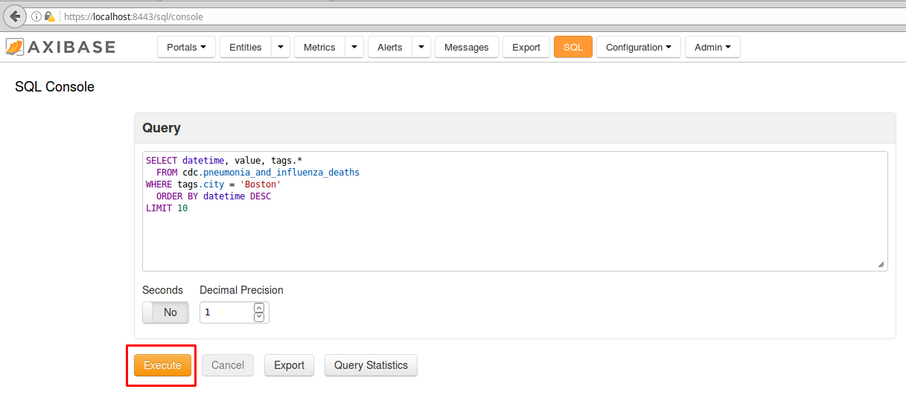
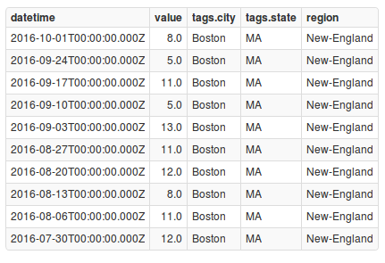
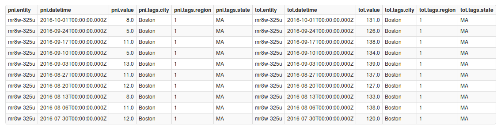

# Computing U.S. Mortality Statistics with a Structured Query Language


## Introduction

According to [infoplease.com](http://www.infoplease.com/ipa/A0005148.html), life expectancy from 1935 to 2010 for both sexes in the U.S. increased from 61.7 to 78.7 years.
As reported by the [Center for Disease Control and Prevention (CDC)](http://www.cdc.gov/nchs/data/databriefs/db88.htm#x2013;2010%3C/a%3E>), the crude death rate in the United States fell from
10.9 to 7.9 deaths per 1,000 people from 1935 to 2010, translating to a **27% decrease**. Mortality rates, however, are vastly different across different U.S. cities and age groups.
In this article we will analyze a data.gov dataset looking at [death statistics for 122 U.S. cities](https://catalog.data.gov/dataset/deaths-in-122-u-s-cities-1962-2016-122-cities-mortality-reporting-system).
This article will focus on Axibase Time Series Database (ATSD) [SQL query language capabilities](https://github.com/axibase/atsd/blob/master/sql/README.md#overview), which we will use to search for specific information contained in this dataset.

## Death Statistics for 122 U.S. Cities

Let's take a look at the dataset titled **Deaths in 122 U.S. cities - 1962-2016. 122 Cities Mortality Reporting System** from [data.gov](https://www.data.gov/).

This dataset can be found here: [https://catalog.data.gov/dataset/deaths-in-122-u-s-cities-1962-2016-122-cities-mortality-reporting-system](https://catalog.data.gov/dataset/deaths-in-122-u-s-cities-1962-2016-122-cities-mortality-reporting-system).
On the data.gov website, datasets can be downloaded as a CSV (16.7 MB), RDF, [JSON](https://data.cdc.gov/api/views/mr8w-325u/rows.json?accessType=DOWNLOAD) (66.2 MB), or a XML file. This dataset can easily be parsed using the JSON job in Axibase Collector.

This file contains data for weekly death totals collected from 1962 to 2016 in 122 U.S. cities. The system was retired on October 6th, 2016. While the system was running, the vital statistics
offices of these cities across the United States reported the total number of death certificates processed and the number of those for which pneumonia or influenza was listed as the underlying
or contributing cause of death by age group. Deaths in this dataset are split into the following categories:

* 0 - 1 years (all causes of death)
* 1 - 24 years (all causes of death)
* 25 - 44 years (all causes of death)
* 45 - 64 years (all causes of death)
* 65 + years (all causes of death)
* All deaths
* Pneumonia and influenza deaths

You can find a complete list of the cities (with their corresponding state) in our [city-list](city-list.md) file.

Additionally, these cities are be grouped by United States Census Bureau regions.
You can find a table of these regions in our [region-table](region-table.md) file.

While you can manually analyze this information in a spreadsheet program, it is much more convenient to interact with the data once it is loaded into a database.

## Axibase Time Series Database

The [Axibase Time Series Database](https://axibase.com/products/axibase-time-series-database/) is a powerful tool when it comes to storing, analyzing, and visualizing datasets. This article will not focus on creating graphs and figures using ATSD, but
rather on writing and running SQL queries. If you are interested in reading more on the visual presentation capabilities of ATSD, check out our articles on
[employee compensation numbers in Iowa](../SocrataIowaCompensation/README.md) and
[aviation statistics in the United Kingdom](../UKAviation/README.md).

Below is an output of the default configuration with all 122 U.S. cities parsed into ATSD.


Here you can explore the complete dataset for U.S. death totals:

[](https://apps.axibase.com/chartlab/3d07088c)

## Creating Local Configurations for ATSD and Axibase Collector using Docker

To query information from this dataset you will need to install both ATSD and Axibase Collector.

You can set up local instances of ATSD and Axibase Collector using Docker by going through our [step-by-step walk through](../USMortality/configuration.md).
It should take you about 15 minutes.

## ATSD Schema

Before we get in to creating SQL queries, let us begin by running through the [data schema and models](https://axibase.com/products/axibase-time-series-database/data-model/) of ATSD.

Below is a list and brief descriptions of some dataset schema terminology we will be using.

* Entity - name of the dataset that we loaded from data.gov, in our case `mr8w-325u`. It is equal to the Unique Identifier published on [data.gov](https://data.cdc.gov/api/views/mr8w-325u).
  Each dataset from data.gov has only one entity.

```json
  "id" : "mr8w-325u",
  "name" : "Deaths in 122 U.S. cities - 1962-2016. 122 Cities Mortality Reporting System",
  "attribution" : "CDC, NCIRD, Influenza Division",
```

* Metrics - a list of numeric columns contained in the dataset (for example: `pneumonia_and_influenza_deaths`). This particular dataset contains 7 metrics.

```json
   "dataTypeName" : "number",
   "fieldName" : "pneumonia_and_influenza_deaths"
```

* Series Tags - a list of text columns contained in the dataset (for example: `city`). The tag columns allow us to filter and group the data. This dataset contains 3 series tags: `city`, `state`, and `region`.

```json
   "name" : "City",
   "dataTypeName" : "text",
   "fieldName" : "city",
```

Now we will begin by introducing ourselves to this dataset and taking a look at where exactly this information is stored.

1. Navigate to the **Entities** tab in ATSD. Click on the entity for our dataset, `mr8w-325u`.

   

2. Click the **Metrics** button.

   

3. In **Metrics**, click on **Series** for `cdc.pneumonia_and _influenza_deaths`.

   

4. For Boston, select **Export**.

   

5. Let us export the last 20 years of data for pneumonia and influenza deaths. Click **Submit**.

   

Below is an output for this data.


Maneuvering through the entity and searching for our desired data for different cities, states, regions, age groups, and deaths types can be time consuming. Now, let us look some
simple SQL queries which will do the work for us.

## Basic SQL Queries

Here are some basic SQL queries with brief descriptions included. Look these over to get yourself acclimated to the general format of SQL queries. In the example following this section, we will
in detail walk through executing a query from start to finish. You can read more about our SQL syntax [here](https://github.com/axibase/atsd/blob/master/sql/README.md#syntax).

```sql
SELECT *
  FROM cdc.all_deaths tot
LIMIT 10
```

The above query displays 10 rows for the metric to see which series tags are available.

```sql
SELECT *
  FROM cdc.all_deaths tot
  ORDER BY datetime, tags.city
LIMIT 10
```

The query orders rows by date and city, and limits the response to 10 rows.

```sql
SELECT *
  FROM cdc.all_deaths tot
WHERE tags.city = 'Boston'
  ORDER BY datetime
LIMIT 10
```

This query serves to filter records for a particular city and orders rows by date, as well as setting the response limit to 10 rows.

```sql
SELECT datetime, value, tags.*
  FROM cdc.all_deaths tot
WHERE tags.city = 'Boston'
  AND datetime >= '2016-01-01T00:00:00Z'
  ORDER BY datetime
LIMIT 10
```

This next query filters records for a particular city (in this case Boston) and for a timespan (in this case retrieve samples from 2016 and older). With the `ORDER BY` clause, rows are sorted by date,
and the response is restricted to 10 rows.

```sql
SELECT date_format(period(1 MONTH)), sum(value), count(value)
  FROM cdc.all_deaths tot
WHERE tags.city = 'Boston'
  AND datetime >= '2016-01-01T00:00:00Z'
GROUP BY period(1 MONTH)
  ORDER BY 1
```

This query serves to filter records for a particular city and time. Weekly samples are aggregated into months, and the sum and count of samples are calculated for each month. Additionally, rows are ordered
by the starting month, referring to the date in the column index.

```sql
SELECT date_format(period(1 MONTH)), sum(value), count(value)
  FROM cdc.all_deaths tot
WHERE tags.city = 'Boston'
  AND datetime >= '2016-01-01T00:00:00Z'
GROUP BY period(1 MONTH)
  HAVING count(value) >= 4
ORDER BY datetime
```

This final example filters records for a particular city and time. Weekly samples are aggregated into months and the sum and count of samples in each month are calculated. With the line
`HAVING count(value) >= 4`, months with less than 4 weekly samples are excluded (October 2016 has only 1 row).

You can take a look at various other [SQL queries examples on our GitHub page](https://github.com/axibase/atsd/blob/master/sql/README.md#examples).

## Detailed SQL Example 1 - Pneumonia and Influenza Deaths in Boston

Now that we have looked at the basics, let's get into a detailed example. Here is an SQL query looking at recent pneumonia and influenza deaths in Boston, Massachusetts.

```sql
SELECT datetime, value, tags.*
  FROM cdc.pneumonia_and_influenza_deaths
WHERE tags.city = 'Boston'
  ORDER BY datetime DESC
LIMIT 10
```

Looking at our query, we have each of the following clauses:

* `SELECT` - returns a result set of records from one or more tables. In this case, we would like to return the time the weekly death total was recorded (i.e. 2016-09-24T00:00:00.000Z), the value
  (or number of deaths), and the tags (`tags.city`, `tags.region`, and `tags.state`). `*` is shorthand for all.
* `FROM` - indicates the table(s) to retrieve data from. In this instance, we are filtering for `cdc.pneumonia_and_influenza_deaths`.
* `WHERE` - specifies which rows to retrieve. Here, we are only looking for `'Boston'`.
* `ORDER BY` - specifies the order in which to return the rows. `DESC` means descending order, so the most recent results will be returned first.
* `LIMIT` - specifies the number of rows to return. In our instance, the 10 most recent weekly readings are returned.

Now let us walk though actually executing the query in ATSD.

1. Click on the **SQL** tab.

   

2. Copy and paste the query into the dialogue box. Click **Execute**.

   

Below is an output of our queried data.


Now, let us look at the latest pneumonia and influenza and total deaths for Boston, using the `JOIN` clause. This will pair the results we just queried for with the corresponding total
number of deaths in the city.

```sql
SELECT *
  FROM cdc.pneumonia_and_influenza_deaths pni
    JOIN cdc.all_deaths tot
WHERE pni.tags.city = 'Boston'
  ORDER BY pni.datetime DESC
LIMIT 10
```

```ls
| pni.entity  | pni.datetime              | pni.value  | pni.tags.city  | pni.tags.region  | pni.tags.state  | tot.entity  | tot.datetime              | tot.value  | tot.tags.city  | tot.tags.region  | tot.tags.state |
|-------------|---------------------------|------------|----------------|------------------|-----------------|-------------|---------------------------|------------|----------------|------------------|----------------|
| mr8w-325u   | 2016-10-01T00:00:00.000Z  | 8.0        | Boston         | 1                | MA              | mr8w-325u   | 2016-10-01T00:00:00.000Z  | 131.0      | Boston         | 1                | MA             |
| mr8w-325u   | 2016-09-24T00:00:00.000Z  | 5.0        | Boston         | 1                | MA              | mr8w-325u   | 2016-09-24T00:00:00.000Z  | 126.0      | Boston         | 1                | MA             |
| mr8w-325u   | 2016-09-17T00:00:00.000Z  | 11.0       | Boston         | 1                | MA              | mr8w-325u   | 2016-09-17T00:00:00.000Z  | 138.0      | Boston         | 1                | MA             |
| mr8w-325u   | 2016-09-10T00:00:00.000Z  | 5.0        | Boston         | 1                | MA              | mr8w-325u   | 2016-09-10T00:00:00.000Z  | 134.0      | Boston         | 1                | MA             |
| mr8w-325u   | 2016-09-03T00:00:00.000Z  | 13.0       | Boston         | 1                | MA              | mr8w-325u   | 2016-09-03T00:00:00.000Z  | 139.0      | Boston         | 1                | MA             |
| mr8w-325u   | 2016-08-27T00:00:00.000Z  | 11.0       | Boston         | 1                | MA              | mr8w-325u   | 2016-08-27T00:00:00.000Z  | 137.0      | Boston         | 1                | MA             |
| mr8w-325u   | 2016-08-20T00:00:00.000Z  | 12.0       | Boston         | 1                | MA              | mr8w-325u   | 2016-08-20T00:00:00.000Z  | 127.0      | Boston         | 1                | MA             |
| mr8w-325u   | 2016-08-13T00:00:00.000Z  | 8.0        | Boston         | 1                | MA              | mr8w-325u   | 2016-08-13T00:00:00.000Z  | 133.0      | Boston         | 1                | MA             |
| mr8w-325u   | 2016-08-06T00:00:00.000Z  | 11.0       | Boston         | 1                | MA              | mr8w-325u   | 2016-08-06T00:00:00.000Z  | 138.0      | Boston         | 1                | MA             |
| mr8w-325u   | 2016-07-30T00:00:00.000Z  | 12.0       | Boston         | 1                | MA              | mr8w-325u   | 2016-07-30T00:00:00.000Z  | 120.0      | Boston         | 1                | MA             |
```

The below query is the same as the first one we looked at, with the only difference being tags here are explicitly specified. Read more about [series tags here](https://github.com/axibase/atsd/blob/master/sql/README.md#series-tag-columns).

```sql
SELECT datetime, value, tags.city, tags.state, tags.region
  FROM cdc.pneumonia_and_influenza_deaths
WHERE tags.city = 'Boston'
  ORDER BY datetime DESC
LIMIT 10
```

This next query is again for latest pneumonia and influenza and total readings for Boston, but with region code translated to region name using one of our Replacement Tables (as mentioned in the [step-by-step walk through](../USMortality/configuration.md)]). As a default, each region is listed
by their corresponding number. In the case of Boston, it falls in region 1, which includes the states of Connecticut, Maine, Massachusetts, New Hampshire, Rhode Island, and Vermont. Recall that we created a replacement table in ATSD where
we entered in region names for each region number. In this instance, region 1 is named **New-England**. Read more about [replacement tables here](https://github.com/axibase/atsd/blob/master/sql/README.md#lookup).

```sql
SELECT datetime, value, tags.city, tags.state,
   LOOKUP('us-region', tags.region) AS "region"
  FROM cdc.pneumonia_and_influenza_deaths
WHERE tags.city = 'Boston'
  ORDER BY datetime DESC
LIMIT 10
```

```ls
| datetime                  | value  | tags.city  | tags.state  | region      |
|---------------------------|--------|------------|-------------|-------------|
| 2016-10-01T00:00:00.000Z  | 8.0    | Boston     | MA          | New-England |
| 2016-09-24T00:00:00.000Z  | 5.0    | Boston     | MA          | New-England |
| 2016-09-17T00:00:00.000Z  | 11.0   | Boston     | MA          | New-England |
| 2016-09-10T00:00:00.000Z  | 5.0    | Boston     | MA          | New-England |
| 2016-09-03T00:00:00.000Z  | 13.0   | Boston     | MA          | New-England |
| 2016-08-27T00:00:00.000Z  | 11.0   | Boston     | MA          | New-England |
| 2016-08-20T00:00:00.000Z  | 12.0   | Boston     | MA          | New-England |
| 2016-08-13T00:00:00.000Z  | 8.0    | Boston     | MA          | New-England |
| 2016-08-06T00:00:00.000Z  | 11.0   | Boston     | MA          | New-England |
| 2016-07-30T00:00:00.000Z  | 12.0   | Boston     | MA          | New-England |
```

This next query looks at total pneumonia and influenza deaths for all cities in a given region using the `GROUP BY` clause, which combines rows having common values into a single row. The region
specified in this query is **New-England**. Read more about the `GROUP BY` clause [here](https://github.com/axibase/atsd/blob/master/sql/README.md#grouping).

```sql
SELECT datetime, sum(value),
  LOOKUP('us-region', tags.region) AS "region"
  FROM cdc.pneumonia_and_influenza_deaths
WHERE tags.region = '1'
  GROUP BY tags.region, datetime
  ORDER BY datetime DESC
LIMIT 10
```

```ls
| datetime                  | sum(value)  | region      |
|---------------------------|-------------|-------------|
| 2016-10-01T00:00:00.000Z  | 33.0        | New-England |
| 2016-09-24T00:00:00.000Z  | 22.0        | New-England |
| 2016-09-17T00:00:00.000Z  | 34.0        | New-England |
| 2016-09-10T00:00:00.000Z  | 25.0        | New-England |
| 2016-09-03T00:00:00.000Z  | 39.0        | New-England |
| 2016-08-27T00:00:00.000Z  | 26.0        | New-England |
| 2016-08-20T00:00:00.000Z  | 32.0        | New-England |
| 2016-08-13T00:00:00.000Z  | 33.0        | New-England |
| 2016-08-06T00:00:00.000Z  | 37.0        | New-England |
| 2016-07-30T00:00:00.000Z  | 34.0        | New-England |
```

Here, monthly pneumonia and influenza death are totaled for all cities in the **New-England** region for the time-range from January 1st, 2016, to October 1st, 2016.

```sql
SELECT datetime, sum(value),
  LOOKUP('us-region', tags.region) AS "region"
  FROM cdc.pneumonia_and_influenza_deaths
WHERE tags.region = '1'
  AND datetime >= '2016-01-01T00:00:00Z' AND datetime < '2016-10-01T00:00:00Z'
  GROUP BY tags.region, period(1 MONTH)
  ORDER BY datetime DESC
```

```ls
| datetime                  | sum(value)  | region      |
|---------------------------|-------------|-------------|
| 2016-09-01T00:00:00.000Z  | 120.0       | New-England |
| 2016-08-01T00:00:00.000Z  | 128.0       | New-England |
| 2016-07-01T00:00:00.000Z  | 196.0       | New-England |
| 2016-06-01T00:00:00.000Z  | 150.0       | New-England |
| 2016-05-01T00:00:00.000Z  | 184.0       | New-England |
| 2016-04-01T00:00:00.000Z  | 308.0       | New-England |
| 2016-03-01T00:00:00.000Z  | 200.0       | New-England |
| 2016-02-01T00:00:00.000Z  | 203.0       | New-England |
| 2016-01-01T00:00:00.000Z  | 214.0       | New-England |
```

## Detailed SQL Example 2 - Best of the Best and Worst of the Worst

Let us now look at some additional examples which delve into finding out which of our 122 cities have some of the deadliest and least deadly conditions.

The below query examines the least deadly week for the total number of deaths by city.

```sql
SELECT date_format(time, 'yyyy-MM-dd') AS "date",
  tags.city AS "city", tags.state AS "state",
  ISNULL(LOOKUP('us-region', tags.region), tags.region) AS "region",
  value AS "all_deaths",
  LOOKUP('city-size', concat(tags.city, ',', tags.state)) AS "population"
FROM cdc.all_deaths
  WHERE entity = 'mr8w-325u' and tags.city IS NOT NULL AND value > 0
  WITH row_number(tags ORDER BY value, time DESC) <= 1
ORDER BY 'date' DESC
  OPTION (ROW_MEMORY_THRESHOLD 500000)
```

Here is an output of the above query. This query displays for results for all 122 cities in the dataset. The below table contains only the first couple of lines of the output. As a note, moving forward
some of the remaining query results may show truncated tables for the sake of maintaining the general flow of the article.

```ls
| date        | city              | state  | region              | all_deaths  | population |
|-------------|-------------------|--------|---------------------|-------------|------------|
| 2016-10-01  | Denver            | CO     | Mountain            | 9.0         | 682545     |
| 2016-10-01  | Somerville        | MA     | New-England         | 1.0         | 80318      |
| 2016-04-16  | Colorado Springs  | CO     | Mountain            | 3.0         | 456568     |
| 2016-02-27  | Seattle           | WA     | Pacific             | 1.0         | 684451     |
| 2016-01-16  | New York          | NY     | Middle-Atlantic     | 502.0       | 8550405    |
| 2016-01-02  | San Antonio       | TX     | West-South-Central  | 1.0         | 1469845    |
| 2016-01-02  | Spokane           | WA     | Pacific             | 1.0         | 213272     |
| 2015-12-26  | Lowell            | MA     | New-England         | 7.0         | 110699     |
| 2015-08-22  | Scranton          | PA     | Middle-Atlantic     | 11.0        | 77118      |
| 2015-02-07  | Baltimore         | MD     | South-Atlantic      | 18.0        | 621849     |
| 2015-01-03  | Milwaukee         | WI     | East-North-Central  | 25.0        | 600155     |
| 2014-12-27  | New Bedford       | MA     | New-England         | 9.0         | 94958      |
```

Here a few noteworthy points regarding this query.

1) `tags.city IS NOT NULL` is specified to discard a few rows present in the dataset for older dates but collected without a reference to a city.<br />
2) The line `WITH row_number ... <= 1` partitions rows by tags (city, state, region) and selects the row with the **MINIMUM** value for each partition using the `ORDER BY` value condition.<br />
3) The `LOOKUP('us-region', tags.region)` function converts `tags.region` (number) into a string, for example, 3 -> East-North-Central.<br />
4) `LOOKUP('city-size', concat(tags.city, ',', tags.state))` retrieves city size for the given city and state pair, concatenated to the {city},{state} pattern.<br />

Now, let's look at the deadliest week for the total number of deaths by city.

```sql
SELECT date_format(time, 'yyyy-MM-dd') AS "date",
  tags.city AS "city", tags.state AS "state",
  ISNULL(LOOKUP('us-region', tags.region), tags.region) AS "region",
  value AS "all_deaths",
  LOOKUP('city-size', concat(tags.city, ',', tags.state)) AS "population"
FROM cdc.all_deaths
  WHERE entity = 'mr8w-325u' and tags.city IS NOT NULL
  WITH row_number(tags ORDER BY value desc, time desc) <= 1
ORDER BY value desc
  OPTION (ROW_MEMORY_THRESHOLD 500000)
```

```ls
| date        | city          | state  | region              | all_deaths  | population |
|-------------|---------------|--------|---------------------|-------------|------------|
| 1976-02-21  | New York      | NY     | Middle-Atlantic     | 2550.0      | 8550405    |
| 1998-06-27  | Atlanta       | GA     | South-Atlantic      | 1971.0      | 463878     |
| 2004-02-07  | Los Angeles   | CA     | Pacific             | 1755.0      | 3971883    |
| 2003-02-08  | Saint Louis   | MO     | West-North-Central  | 1424.0      | 315685     |
| 1991-01-26  | Chicago       | IL     | East-North-Central  | 1295.0      | 2720546    |
| 2012-02-04  | Philadelphia  | PA     | Middle-Atlantic     | 1063.0      | 1567448    |
| 2000-04-01  | Washington    | DC     | South-Atlantic      | 999.0       | 672228     |
| 1983-02-12  | Houston       | TX     | West-South-Central  | 860.0       | 2327463    |
| 1970-10-03  | Cincinnati    | OH     | East-North-Central  | 706.0       | 298550     |
| 2016-01-09  | San Antonio   | TX     | West-South-Central  | 666.0       | 1469845    |
| 1998-08-01  | Phoenix       | AZ     | Mountain            | 632.0       | 1563025    |
| 2000-06-03  | Wichita       | KS     | West-North-Central  | 560.0       | 389965     |
```

This query is the same as the above example, except for the fact that the line `WITH row_number ... <= 1` partitions rows by tags (city, state, region) and selects the row with the
**MAXIMUM** value for each partition using the `ORDER BY` value `DESC` condition.

Noticeably absent in from the above list is the city of New Orleans, Louisiana. On August 29th, 2005, [Hurricane Katrina](http://edition.cnn.com/2013/08/23/us/hurricane-katrina-statistics-fast-facts/)
struck the Gulf coast of the United States, with New Orleans taking the brunt of the storm's force. According to the Federal Emergency Management Agency (FEMA), Katrina was "the single most catastrophic
natural disaster in U.S. history." FEMA estimated the total damage from the hurricane amounted to $108 billion dollars, making it the "costliest hurricane in U.S. history." Approximately 1,833 people
are estimated to have died in the storm, with 1,577 of those deaths occurring in the New Orleans area. This number of deaths would clearly put New Orleans, so why is it not showing up?

Below is a Chart Lab output for the number of deaths for New Orleans from 1970 to 2016.



We can clearly see that there is quite a noticeable gap in the data collection history from the city. From August 20th, 2005, to December 8th, 2012, New Orleans did not collect death total statistics.
Since the hurricane occurred on August 29th, 2005, these sky high death totals do not show up in our list.

You can explore the death totals for New Orleans in the Chart Lab instance below.

[](https://apps.axibase.com/chartlab/3d07088c/2/)

Another example of a city stopping data collection is Philadelphia, Pennsylvania. Looking at a [filtered output for Philadelphia](https://apps.axibase.com/chartlab/3d07088c/3/), we can see that the
city has recently experienced a significant increase in deaths. The city recorded a death total of 1,063 on February 4th, 2012; however data collection was stopped on November 24th, 2012. So, using this
particular dataset, we cannot say whether or not this is the highest weekly total in Philadelphia history, or if there was a higher occurrence happening after November 24th, 2012.

Moving on, here is the deadliest week due to pneumonia and influenza by city.

```sql
SELECT date_format(time, 'yyyy-MM-dd') AS "date",
  tags.city AS "city", tags.state AS "state",
  ISNULL(LOOKUP('us-region', tags.region), tags.region) AS "region",
  value AS "pneumonia_influenza_deaths",
  LOOKUP('city-size', concat(tags.city, ',', tags.state)) AS "population"
FROM cdc.pneumonia_and_influenza_deaths t1
  WHERE entity = 'mr8w-325u' and tags.city IS NOT NULL
  WITH row_number(tags ORDER BY value desc, time desc) <= 1
ORDER BY value desc
  OPTION (ROW_MEMORY_THRESHOLD 500000)
```

```ls
| date        | city         | state  | region              | pneumonia_influenza_deaths  | population |
|-------------|--------------|--------|---------------------|-----------------------------|------------|
| 1976-02-21  | New York     | NY     | Middle-Atlantic     | 280.0                       | 8550405    |
| 2004-01-17  | Los Angeles  | CA     | Pacific             | 231.0                       | 3971883    |
| 2003-02-08  | Saint Louis  | MO     | West-North-Central  | 150.0                       | 315685     |
| 2000-03-04  | Chicago      | IL     | East-North-Central  | 83.0                        | 2720546    |
| 1999-03-06  | Sacramento   | CA     | Pacific             | 77.0                        | 490712     |
```

This query has the same structure as for the example directly above, but has a different metric specified: `cdc.pneumonia_and_influenza_deaths` instead of `cdc.all_deaths`.

The deadliest pneumonia and influenza week as a percentage of all deaths:

```sql
SELECT date_format(tot.time, 'yyyy-MM-dd') AS "date",
  tot.tags.city AS "city", tot.tags.state AS "state",
  LOOKUP('us-region', tot.tags.region) AS "region",
  tot.value AS "all_deaths",
  pni.value AS "pneumonia_influenza_deaths",
  pni.value/tot.value*100 AS "pneumonia_influenza_deaths, %",
  LOOKUP('city-size', CONCAT(tot.tags.city, ',', tot.tags.state)) AS "population"
FROM cdc.all_deaths tot
  JOIN cdc.pneumonia_and_influenza_deaths pni
  WHERE tot.entity = 'mr8w-325u' AND tot.tags.city IS NOT NULL
  AND pni.value > 1
  WITH row_number(tot.tags ORDER BY pni.value/tot.value DESC, tot.time DESC) <= 1
  ORDER BY 'pneumonia_influenza_deaths, %' DESC, pni.value DESC
  OPTION (ROW_MEMORY_THRESHOLD 500000)
```

```ls
| date        | city         | state  | region              | all_deaths  | pneumonia_influenza_deaths  | pneumonia_influenza_deaths, %  | population |
|-------------|--------------|--------|---------------------|-------------|-----------------------------|--------------------------------|------------|
| 2002-05-18  | Glendale     | CA     | Pacific             | 26.0        | 26.0                        | 100.0                          | 201020     |
| 2005-03-12  | New Orleans  | LA     | West-South-Central  | 12.0        | 12.0                        | 100.0                          | 389617     |
| 2003-10-18  | Birmingham   | AL     | East-South-Central  | 9.0         | 9.0                         | 100.0                          | 212461     |
| 1995-05-27  | Nashville    | TN     | East-South-Central  | 9.0         | 9.0                         | 100.0                          | 654610     |
| 2015-06-20  | Washington   | DC     | South-Atlantic      | 8.0         | 8.0                         | 100.0                          | 672228     |
| 1988-02-13  | Little Rock  | AR     | West-South-Central  | 7.0         | 7.0                         | 100.0                          | 197992     |
| 2000-12-16  | Trenton      | NJ     | Middle-Atlantic     | 3.0         | 3.0                         | 100.0                          | 84225      |
| 2003-06-28  | Akron        | OH     | East-North-Central  | 2.0         | 2.0                         | 100.0                          | 197542     |
```

A few noteworthy points regarding this query.

1) This query has the same structure as for the query directly above, but 2 metrics are specified: `cdc.pneumonia_and_influenza_deaths` **AND** `cdc.all_deaths`.<br />
2) `JOIN` merges records with the same entity, tags, and time. Read more about the `JOIN` clause [here](https://github.com/axibase/atsd/blob/master/sql/README.md#joins).<br />
3) A derived metric, `pni.value/tot.value`, is calculated to show a percentage of the part to the total number of deaths.<br />
4) Only weeks with more than 1 pneumonia and influenza deaths are selected with the `AND pni.value > 1` condition.<br />

Moving onto the next query, `OUTER JOIN` can help find all instances when a city failed to report `pneumonia_and_influenza_deaths` (no data).

```sql
SELECT tot.datetime, tot.value AS "total",
  ISNULL(pni.value, 'N/A') AS "pneumonia/influenza"
FROM cdc.all_deaths tot
  OUTER JOIN cdc.pneumonia_and_influenza_deaths pni
WHERE tot.entity = 'mr8w-325u'
  AND tot.tags.city = 'Baton Rouge'
  AND pni.value IS NULL
```

In this example, the query sorts for rows for the city of Baton Rouge where the `pni.value is NULL`. Below is an example of this output.

```ls
| tot.datetime              | total  | pneumonia/influenza |
|---------------------------|--------|---------------------|
| 2008-10-04T00:00:00.000Z  | 76.0   | N/A                 |
| 2008-11-01T00:00:00.000Z  | 37.0   | N/A                 |
| 2008-11-08T00:00:00.000Z  | 49.0   | N/A                 |
| 2008-11-15T00:00:00.000Z  | 49.0   | N/A                 |
| 2008-11-22T00:00:00.000Z  | 70.0   | N/A                 |
```

Now let us look at several queries which delve into looking at the top 10 deadliest cities for total deaths and pneumonia and influenza deaths.

Here is a query for filtering for the top 10 cities by all deaths in the current year (year to date).

```sql
SELECT tags.city AS "city", tags.state AS "state",
  ISNULL(LOOKUP('us-region', tags.region), tags.region) AS "region",
  sum(value) AS "all_deaths",
  LOOKUP('city-size', concat(tags.city, ',', tags.state)) AS "population"
FROM cdc.all_deaths
  WHERE entity = 'mr8w-325u' and tags.city IS NOT NULL
  AND datetime > current_year
GROUP BY tags
ORDER BY 'all_deaths' DESC
  LIMIT 10
```

```ls
| city         | state  | region              | all_deaths  | population |
|--------------|--------|---------------------|-------------|------------|
| New York     | NY     | Middle-Atlantic     | 41291.0     | 8550405    |
| Houston      | TX     | West-South-Central  | 15058.0     | 2327463    |
| Las Vegas    | NV     | Mountain            | 13305.0     | 623747     |
| Los Angeles  | CA     | Pacific             | 11934.0     | 3971883    |
| San Antonio  | TX     | West-South-Central  | 11444.0     | 1469845    |
| Chicago      | IL     | East-North-Central  | 11389.0     | 2720546    |
| Cleveland    | OH     | East-North-Central  | 11156.0     | 388072     |
| Columbus     | OH     | East-North-Central  | 9934.0      | 850106     |
| Sacramento   | CA     | Pacific             | 9070.0      | 490712     |
| Dallas       | TX     | West-South-Central  | 8923.0      | 1300092    |
```

This query has a similar structure to some of the examples we have already looked at. In this example, the `LIMIT` clause caps the number of rows that can be returned,
which in this case is 10. The line `AND datetime > current_year` returns values from 2016-01-01T00:00:00.000Z to 2016-10-01T00:00:00.000Z.

The [`OPTION (ROW_MEMORY_THRESHOLD {n})`](https://github.com/axibase/atsd/blob/master/sql/README.md#row_memory_threshold-option) instructs the database to perform processing in memory as opposed to a temporary table if the number of rows is within the specified threshold {n}. If
{n} is zero or negative, the results are processed using the temporary table.

This next query examines the top 10 cities by pneumonia and influenza deaths in the current year (year to date).

```sql
SELECT tags.city AS "city", tags.state AS "state",
  ISNULL(LOOKUP('us-region', tags.region), tags.region) AS "region",
  sum(value) AS "pneumonia_influenza_deaths",
  LOOKUP('city-size', concat(tags.city, ',', tags.state)) AS "population"
FROM cdc.pneumonia_and_influenza_deaths
  WHERE entity = 'mr8w-325u' and tags.city IS NOT NULL
  AND datetime > current_year
GROUP BY tags
ORDER BY 'pneumonia_influenza_deaths' DESC
  LIMIT 10
```

```ls
| city          | state  | region              | pneumonia_influenza_deaths  | population |
|---------------|--------|---------------------|-----------------------------|------------|
| New York      | NY     | Middle-Atlantic     | 1531.0                      | 8550405    |
| Los Angeles   | CA     | Pacific             | 1147.0                      | 3971883    |
| Las Vegas     | NV     | Mountain            | 1066.0                      | 623747     |
| San Antonio   | TX     | West-South-Central  | 735.0                       | 1469845    |
| Sacramento    | CA     | Pacific             | 678.0                       | 490712     |
| Chicago       | IL     | East-North-Central  | 666.0                       | 2720546    |
| Indianapolis  | IN     | East-North-Central  | 654.0                       | 853173     |
| Houston       | TX     | West-South-Central  | 649.0                       | 2327463    |
| Memphis       | TN     | East-South-Central  | 648.0                       | 655770     |
| Columbus      | OH     | East-North-Central  | 588.0                       | 850106     |
```

This query has the same structure as for the example directly above, but has a different metric specified: `cdc.pneumonia_and_influenza_deaths` instead of `cdc.all_deaths`.

This query shows the top 10 cities with the highest percentage of deaths caused by pneumonia and influenza in the current year (year-to-date).

```sql
SELECT tot.tags.city AS "city", tot.tags.state AS "state",
  LOOKUP('us-region', tot.tags.region) AS "region",
  sum(tot.value) AS "all_deaths",
  sum(pni.value) AS "pneumonia_influenza_deaths",
  sum(pni.value)/sum(tot.value)*100 AS "pneumonia_influenza_deaths, %",
  LOOKUP('city-size', CONCAT(tot.tags.city, ',', tot.tags.state)) AS "population"
FROM cdc.all_deaths tot
  JOIN cdc.pneumonia_and_influenza_deaths pni
WHERE tot.entity = 'mr8w-325u' AND tot.tags.city IS NOT NULL
  AND tot.datetime > current_year AND tot.value > 0
GROUP BY tot.tags
  ORDER BY 'pneumonia_influenza_deaths, %' DESC, 'pneumonia_influenza_deaths' DESC
  LIMIT 10
```

In this query, we are able to calculate the percentage of pneumonia and influenza deaths using the line `sum(pni.value)/sum(tot.value)*100 AS "pneumonia_influenza_deaths, %",`.

```ls
| city         | state  | region              | all_deaths  | pneumonia_influenza_deaths  | pneumonia_influenza_deaths, %  | population |
|--------------|--------|---------------------|-------------|-----------------------------|--------------------------------|------------|
| Glendale     | CA     | Pacific             | 1412.0      | 223.0                       | 15.8                           | 201020     |
| Worcester    | MA     | New-England         | 2493.0      | 352.0                       | 14.1                           | 184815     |
| Long Beach   | CA     | Pacific             | 2673.0      | 314.0                       | 11.7                           | 474140     |
| New Haven    | CT     | New-England         | 961.0       | 106.0                       | 11.0                           | 130322     |
| Pasadena     | CA     | Pacific             | 1121.0      | 123.0                       | 11.0                           | 142250     |
| Honolulu     | HI     | Pacific             | 3505.0      | 370.0                       | 10.6                           | 402500     |
| Peoria       | IL     | East-North-Central  | 2340.0      | 239.0                       | 10.2                           | 115070     |
| Fall River   | MA     | New-England         | 1039.0      | 106.0                       | 10.2                           | 88777      |
| Little Rock  | AR     | West-South-Central  | 3862.0      | 394.0                       | 10.2                           | 197992     |
| Los Angeles  | CA     | Pacific             | 11934.0     | 1147.0                      | 9.6                            | 3971883    |
```

Here is a query for the top 10 cities with the highest percentage of deaths caused by pneumonia and influenza, for the last 12 months (trailing).

```sql
SELECT tot.tags.city AS "city", tot.tags.state AS "state",
  LOOKUP('us-region', tot.tags.region) AS "region",
  sum(tot.value) AS "all_deaths",
  sum(pni.value) AS "pneumonia_influenza_deaths",
  sum(pni.value)/sum(tot.value)*100 AS "pneumonia_influenza_deaths, %",
  LOOKUP('city-size', CONCAT(tot.tags.city, ',', tot.tags.state)) AS "population"
FROM cdc.all_deaths tot
  JOIN cdc.pneumonia_and_influenza_deaths pni
WHERE tot.entity = 'mr8w-325u' AND tot.tags.city IS NOT NULL
  AND tot.datetime > now-1*YEAR AND tot.value > 0
GROUP BY tot.tags
  ORDER BY 'pneumonia_influenza_deaths, %' DESC, 'pneumonia_influenza_deaths' DESC
  LIMIT 10
```

The only difference between this query and the previous one is the specified time frame. Using the line `AND tot.datetime > now-1*YEAR AND tot.value > 0`, we are able to filter for the last
12 months, as opposed to the previous example which only looked at the calendar year of 2016.

```ls
| city         | state  | region              | all_deaths  | pneumonia_influenza_deaths  | pneumonia_influenza_deaths, %  | population |
|--------------|--------|---------------------|-------------|-----------------------------|--------------------------------|------------|
| Glendale     | CA     | Pacific             | 1518.0      | 240.0                       | 15.8                           | 201020     |
| Worcester    | MA     | New-England         | 2679.0      | 386.0                       | 14.4                           | 184815     |
| Long Beach   | CA     | Pacific             | 2841.0      | 329.0                       | 11.6                           | 474140     |
| Pasadena     | CA     | Pacific             | 1204.0      | 130.0                       | 10.8                           | 142250     |
| Honolulu     | HI     | Pacific             | 3744.0      | 398.0                       | 10.6                           | 402500     |
| Fall River   | MA     | New-England         | 1111.0      | 117.0                       | 10.5                           | 88777      |
| New Haven    | CT     | New-England         | 1077.0      | 113.0                       | 10.5                           | 130322     |
| Peoria       | IL     | East-North-Central  | 2516.0      | 261.0                       | 10.4                           | 115070     |
| Little Rock  | AR     | West-South-Central  | 4110.0      | 420.0                       | 10.2                           | 197992     |
| Los Angeles  | CA     | Pacific             | 12787.0     | 1232.0                      | 9.6                            | 3971883    |
```

Top 10 cities with the highest percentage of deaths caused by pneumonia and influenza, but for the entire period since 1970:

```sql
SELECT tot.tags.city AS "city", tot.tags.state AS "state",
  LOOKUP('us-region', tot.tags.region) AS "region",
  sum(tot.value) AS "all_deaths",
  sum(pni.value) AS "pneumonia_influenza_deaths",
  sum(pni.value)/sum(tot.value)*100 AS "pneumonia_influenza_deaths, %",
  LOOKUP('city-size', CONCAT(tot.tags.city, ',', tot.tags.state)) AS "population"
FROM cdc.all_deaths tot
  JOIN cdc.pneumonia_and_influenza_deaths pni
WHERE tot.entity = 'mr8w-325u' AND tot.tags.city IS NOT NULL
  AND tot.value > 0
GROUP BY tot.tags
  ORDER BY 'pneumonia_influenza_deaths, %' DESC, 'pneumonia_influenza_deaths' DESC
  OPTION (ROW_MEMORY_THRESHOLD 500000)
```

In this example, we did not specify a line for `tot.datetime`, as we did in the previous example. Consequentially, results are returned for all times ranging back to the start of the dataset.

```ls
| city          | state  | region              | all_deaths  | pneumonia_influenza_deaths  | pneumonia_influenza_deaths, %  | population |
|---------------|--------|---------------------|-------------|-----------------------------|--------------------------------|------------|
| Cambridge     | MA     | New-England         | 51209.0     | 6090.0                      | 11.9                           | 110402     |
| Worcester     | MA     | New-England         | 144668.0    | 14404.0                     | 10.0                           | 184815     |
| Santa Cruz    | CA     | Pacific             | 40367.0     | 3959.0                      | 9.8                            | 64220      |
| Boston        | MA     | New-England         | 407382.0    | 36691.0                     | 9.0                            | 667137     |
| Grand Rapids  | MI     | East-North-Central  | 140092.0    | 12451.0                     | 8.9                            | 195097     |
```

Below are a few more examples of pneumonia and influenza death queries.

Number of pneumonia and influenza deaths per month in 2016 in the East-North-Central (`tags.region = '3'`) region:

```sql
SELECT date_format(time, 'yyyy MMM') AS "date",
  LOOKUP('us-region', tags.region) AS "region",
  sum(value) AS "pneumonia_influenza_deaths"
FROM cdc.pneumonia_and_influenza_deaths
  WHERE entity = 'mr8w-325u' and tags.city IS NOT NULL
  AND tags.region = '3'
  AND datetime > now-5*year AND datetime < '2016-10-01T00:00:00Z'
GROUP BY tags.region, period(1 MONTH)
ORDER BY datetime desc, tags.region
```

```ls
| date      | region              | pneumonia_influenza_deaths |
|-----------|---------------------|----------------------------|
| 2016 Sep  | East-North-Central  | 476.0                      |
| 2016 Aug  | East-North-Central  | 430.0                      |
| 2016 Jul  | East-North-Central  | 529.0                      |
| 2016 Jun  | East-North-Central  | 425.0                      |
| 2016 May  | East-North-Central  | 566.0                      |
| 2016 Apr  | East-North-Central  | 812.0                      |
| 2016 Mar  | East-North-Central  | 633.0                      |
| 2016 Feb  | East-North-Central  | 578.0                      |
| 2016 Jan  | East-North-Central  | 732.0                      |
```

Total yearly pneumonia and influenza deaths in January for the East-North-Central region ranging back to 1970:

```sql
SELECT date_format(time, 'yyyy MMM') AS "date",
  LOOKUP('us-region', tags.region) AS "region",
  sum(value) AS "pneumonia_influenza_deaths"
FROM cdc.pneumonia_and_influenza_deaths
  WHERE entity = 'mr8w-325u' and tags.city IS NOT NULL
  AND tags.region = '3'
  AND date_format(time, 'MMM') = 'Jan'
GROUP BY tags.region, period(1 MONTH)
ORDER BY datetime, tags.region
```

```ls
| date      | region              | pneumonia_influenza_deaths |
|-----------|---------------------|----------------------------|
| 1970 Jan  | East-North-Central  | 526.0                      |
| 1971 Jan  | East-North-Central  | 457.0                      |
| 1972 Jan  | East-North-Central  | 764.0                      |
| 1973 Jan  | East-North-Central  | 479.0                      |
| 1974 Jan  | East-North-Central  | 289.0                      |
| 1975 Jan  | East-North-Central  | 384.0                      |
| 1976 Jan  | East-North-Central  | 368.0                      |
| 1977 Jan  | East-North-Central  | 346.0                      |
| 1978 Jan  | East-North-Central  | 547.0                      |
| 1979 Jan  | East-North-Central  | 303.0                      |
| 1980 Jan  | East-North-Central  | 249.0                      |
```

Top 3 deadliest pneumonia and influenza Januaries in the East-North-Central region:

```sql
SELECT date_format(time, 'yyyy MMM') AS "date",
  LOOKUP('us-region', tags.region) AS "region",
  sum(value) AS "pneumonia_influenza_deaths"
FROM cdc.pneumonia_and_influenza_deaths
  WHERE entity = 'mr8w-325u' and tags.city IS NOT NULL
  AND tags.region = '3'
  AND date_format(time, 'MMM') = 'Jan'
GROUP BY tags.region, period(1 MONTH)
ORDER BY sum(value) desc
  LIMIT 3
```

```ls
| date      | region              | pneumonia_influenza_deaths |
|-----------|---------------------|----------------------------|
| 2000 Jan  | East-North-Central  | 1292.0                     |
| 2004 Jan  | East-North-Central  | 1279.0                     |
| 2015 Jan  | East-North-Central  | 1203.0                     |
```

Deadliest pneumonia and influenza by month in the Pacific region:

```sql
SELECT date_format(time, 'MMM') AS "Month",
  LOOKUP('us-region', tags.region) AS "region",
  sum(value) AS "pneumonia_influenza_deaths"
FROM cdc.pneumonia_and_influenza_deaths
  WHERE entity = 'mr8w-325u' and tags.city IS NOT NULL
  AND LOOKUP('us-region', tags.region) = 'Pacific'
GROUP BY tags.region, date_format(time, 'MMM')
ORDER BY sum(value) DESC
```

```ls
| Month  | region   | pneumonia_influenza_deaths |
|--------|----------|----------------------------|
| Jan    | Pacific  | 32144.0                    |
| Mar    | Pacific  | 30288.0                    |
| Feb    | Pacific  | 28677.0                    |
| Apr    | Pacific  | 25047.0                    |
| Dec    | Pacific  | 23639.0                    |
| May    | Pacific  | 22972.0                    |
| Jun    | Pacific  | 20664.0                    |
| Jul    | Pacific  | 20374.0                    |
| Oct    | Pacific  | 19626.0                    |
| Nov    | Pacific  | 19363.0                    |
| Aug    | Pacific  | 19279.0                    |
| Sep    | Pacific  | 18611.0                    |
```

## Detailed SQL Example 3 - Calculating Mortality Rates

We have spent some time looking at SQL queries to search for information from our dataset for the total number of deaths, percentages of deaths caused by pneumonia and influenza, and ranking
these results in terms of the deadliest month, region, or city. Now let us delve into computing our own mortality statistics for our dataset. According to the [CIA World Factbook](https://www.cia.gov/library/publications/the-world-factbook/rankorder/2066rank.html), mortality (or death)
rate is the average annual number of deaths during a year per 1,000 individuals in the population. As of 2016, the **United States** as a whole ranks 90th in the world, with a rate of **8.20**
deaths per 1,000 individuals. Generally speaking, the higher the death rate, the worse. Below is a table from their website showing the top 5 death rates in the world.

| Rank | Country       | (Deaths/1,000 Population) | Date of Information |
|------|---------------|---------------------------|---------------------|
| 1    | Lesotho       | 14.90                     | 2016 est.           |
| 2    | Bulgaria      | 14.50                     | 2016 est.           |
| 3    | Lithuania     | 14.50                     | 2016 est.           |
| 4    | Ukraine       | 14.40                     | 2016 est.           |
| 5    | Latvia        | 14.40                     | 2016 est.           |

To calculate our own mortality rates for a city in a given year, we need to simply divide the total number of deaths in the city by the population and multiply the result by 1,000. Additionally,
this dataset does not include population numbers, so we need to pull in population figures to calculate mortality numbers. See [step 12](../USMortality/configuration.md)
in the step-by-step walk through for information on pulling in population statistics.

Below is our SQL query for determining the cities with the highest mortality rate in 2015.

```sql
SELECT tags.city AS "city", tags.state AS "state",
  ISNULL(LOOKUP('us-region', tags.region), tags.region) AS "region",
  sum(value) AS "all_deaths",
  cast(LOOKUP('city-size', concat(tags.city, ',', tags.state))) AS "population",
  sum(value)/cast(LOOKUP('city-size', concat(tags.city, ',', tags.state)))*1000 AS "mortality_rate"
FROM cdc.all_deaths
  WHERE entity = 'mr8w-325u' and tags.city IS NOT NULL
  AND datetime >= '2015-01-01T00:00:00Z' AND datetime < '2016-01-01T00:00:00Z'
GROUP BY tags
ORDER BY mortality_rate DESC
```

Our line in the query which calculates our mortality rate:

```sql
sum(value)/cast(LOOKUP('city-size', concat(tags.city, ',', tags.state)))*1000 AS "mortality_rate"
```

Here is the output from our query looking at mortality rates in 2015.

```ls
| city              | state  | region              | all_deaths  | population  | mortality_rate |
|-------------------|--------|---------------------|-------------|-------------|----------------|
| Youngstown        | OH     | East-North-Central  | 3523.0      | 64628.0     | 54.5           |
| Dayton            | OH     | East-North-Central  | 7328.0      | 140599.0    | 52.1           |
| Birmingham        | AL     | East-South-Central  | 9385.0      | 212461.0    | 44.2           |
| Salt Lake City    | UT     | Mountain            | 7377.0      | 192672.0    | 38.3           |
| Cleveland         | OH     | East-North-Central  | 14320.0     | 388072.0    | 36.9           |
| Rochester         | NY     | Middle-Atlantic     | 7439.0      | 209802.0    | 35.5           |
| Knoxville         | TN     | East-South-Central  | 6273.0      | 185291.0    | 33.9           |
| Tacoma            | WA     | Pacific             | 7021.0      | 207948.0    | 33.8           |
| Syracuse          | NY     | Middle-Atlantic     | 4150.0      | 144142.0    | 28.8           |
| Little Rock       | AR     | West-South-Central  | 5673.0      | 197992.0    | 28.7           |
| Albany            | NY     | Middle-Atlantic     | 2729.0      | 98469.0     | 27.7           |
| Erie              | PA     | Middle-Atlantic     | 2746.0      | 99475.0     | 27.6           |
| Chattanooga       | TN     | East-South-Central  | 4851.0      | 176588.0    | 27.5           |
| Santa Cruz        | CA     | Pacific             | 1718.0      | 64220.0     | 26.8           |
| South Bend        | IN     | East-North-Central  | 2710.0      | 101516.0    | 26.7           |
| Peoria            | IL     | East-North-Central  | 3046.0      | 115070.0    | 26.5           |
| Las Vegas         | NV     | Mountain            | 16294.0     | 623747.0    | 26.1           |
| Sacramento        | CA     | Pacific             | 12056.0     | 490712.0    | 24.6           |
| Canton            | OH     | East-North-Central  | 1757.0      | 71885.0     | 24.4           |
| Mobile            | AL     | East-South-Central  | 4675.0      | 194288.0    | 24.1           |
| Hartford          | CT     | New-England         | 2947.0      | 124006.0    | 23.8           |
| Lansing           | MI     | East-North-Central  | 2696.0      | 115056.0    | 23.4           |
| Ogden             | UT     | Mountain            | 1964.0      | 85444.0     | 23.0           |
| Evansville        | IN     | East-North-Central  | 2735.0      | 119943.0    | 22.8           |
| Savannah          | GA     | South-Atlantic      | 3248.0      | 145674.0    | 22.3           |
| Rockford          | IL     | East-North-Central  | 3262.0      | 148278.0    | 22.0           |
| Baton Rouge       | LA     | West-South-Central  | 5002.0      | 228590.0    | 21.9           |
| Duluth            | MN     | West-North-Central  | 1717.0      | 86110.0     | 19.9           |
| Camden            | NJ     | Middle-Atlantic     | 1482.0      | 76119.0     | 19.5           |
| Providence        | RI     | New-England         | 3439.0      | 179207.0    | 19.2           |
| Reading           | PA     | Middle-Atlantic     | 1823.0      | 97879.0     | 18.6           |
| Spokane           | WA     | Pacific             | 3951.0      | 213272.0    | 18.5           |
| Worcester         | MA     | New-England         | 3397.0      | 184815.0    | 18.4           |
| Shreveport        | LA     | West-South-Central  | 3595.0      | 197204.0    | 18.2           |
| Toledo            | OH     | East-North-Central  | 5086.0      | 279789.0    | 18.2           |
| Scranton          | PA     | Middle-Atlantic     | 1399.0      | 77118.0     | 18.1           |
| Atlanta           | GA     | South-Atlantic      | 8288.0      | 463878.0    | 17.9           |
| Buffalo           | NY     | Middle-Atlantic     | 4607.0      | 258071.0    | 17.9           |
| Schenectady       | NY     | Middle-Atlantic     | 1165.0      | 65305.0     | 17.8           |
| Grand Rapids      | MI     | East-North-Central  | 3324.0      | 195097.0    | 17.0           |
| Tampa             | FL     | South-Atlantic      | 6255.0      | 369075.0    | 16.9           |
| Tucson            | AZ     | Mountain            | 8981.0      | 531641.0    | 16.9           |
| Tulsa             | OK     | West-South-Central  | 6795.0      | 403505.0    | 16.8           |
| Fort Wayne        | IN     | East-North-Central  | 4351.0      | 260326.0    | 16.7           |
| Boise             | ID     | Mountain            | 3431.0      | 218281.0    | 15.7           |
| Columbus          | OH     | East-North-Central  | 13046.0     | 850106.0    | 15.3           |
| Saint Louis       | MO     | West-North-Central  | 4821.0      | 315685.0    | 15.3           |
| Memphis           | TN     | East-South-Central  | 9888.0      | 655770.0    | 15.1           |
| Fall River        | MA     | New-England         | 1328.0      | 88777.0     | 15.0           |
| Pueblo            | CO     | Mountain            | 1624.0      | 109412.0    | 14.8           |
| Waterbury         | CT     | New-England         | 1577.0      | 108802.0    | 14.5           |
| New Haven         | CT     | New-England         | 1887.0      | 130322.0    | 14.5           |
| Lexington         | KY     | East-South-Central  | 4539.0      | 314488.0    | 14.4           |
| Akron             | OH     | East-North-Central  | 2839.0      | 197542.0    | 14.4           |
| Montgomery        | AL     | East-South-Central  | 2862.0      | 200602.0    | 14.3           |
| Cincinnati        | OH     | East-North-Central  | 4240.0      | 298550.0    | 14.2           |
| Saint Petersburg  | FL     | South-Atlantic      | 3481.0      | 257083.0    | 13.5           |
| Nashville         | TN     | East-South-Central  | 8806.0      | 654610.0    | 13.5           |
| Fresno            | CA     | Pacific             | 6954.0      | 520052.0    | 13.4           |
| Richmond          | VA     | South-Atlantic      | 2938.0      | 220289.0    | 13.3           |
| Allentown         | PA     | Middle-Atlantic     | 1595.0      | 120207.0    | 13.3           |
| New Bedford       | MA     | New-England         | 1259.0      | 94958.0     | 13.3           |
| Utica             | NY     | Middle-Atlantic     | 800.0       | 61100.0     | 13.1           |
| Wichita           | KS     | West-North-Central  | 4937.0      | 389965.0    | 12.7           |
| Springfield       | MA     | New-England         | 1896.0      | 154341.0    | 12.3           |
| Kansas City       | MO     | West-North-Central  | 5654.0      | 475378.0    | 11.9           |
| Albuquerque       | NM     | Mountain            | 6649.0      | 559121.0    | 11.9           |
| Indianapolis      | IN     | East-North-Central  | 10079.0     | 853173.0    | 11.8           |
| Trenton           | NJ     | Middle-Atlantic     | 987.0       | 84225.0     | 11.7           |
| Baltimore         | MD     | South-Atlantic      | 7229.0      | 621849.0    | 11.6           |
| Omaha             | NE     | West-North-Central  | 5119.0      | 443885.0    | 11.5           |
| Detroit           | MI     | East-North-Central  | 7788.0      | 677116.0    | 11.5           |
| Boston            | MA     | New-England         | 7669.0      | 667137.0    | 11.5           |
| Lowell            | MA     | New-England         | 1212.0      | 110699.0    | 10.9           |
| Bridgeport        | CT     | New-England         | 1595.0      | 147629.0    | 10.8           |
| Honolulu          | HI     | Pacific             | 4323.0      | 402500.0    | 10.7           |
| San Jose          | CA     | Pacific             | 10894.0     | 1026908.0   | 10.6           |
| Portland          | OR     | Pacific             | 6707.0      | 632309.0    | 10.6           |
| Corpus Christi    | TX     | West-South-Central  | 3427.0      | 324074.0    | 10.6           |
| Saint Paul        | MN     | West-North-Central  | 3124.0      | 300851.0    | 10.4           |
| San Antonio       | TX     | West-South-Central  | 14858.0     | 1469845.0   | 10.1           |
| Kansas City       | KS     | West-North-Central  | 1521.0      | 151306.0    | 10.1           |
| Jacksonville      | FL     | South-Atlantic      | 8318.0      | 868031.0    | 9.6            |
| Glendale          | CA     | Pacific             | 1891.0      | 201020.0    | 9.4            |
| Norfolk           | VA     | South-Atlantic      | 2313.0      | 246393.0    | 9.4            |
| Lincoln           | NE     | West-North-Central  | 2571.0      | 277348.0    | 9.3            |
| Pasadena          | CA     | Pacific             | 1312.0      | 142250.0    | 9.2            |
| Charlotte         | NC     | South-Atlantic      | 7589.0      | 827097.0    | 9.2            |
| Wilimington       | DE     | South-Atlantic      | 651.0       | 71948.0     | 9.0            |
| Dallas            | TX     | West-South-Central  | 11252.0     | 1300092.0   | 8.7            |
| Minneapolis       | MN     | West-North-Central  | 3556.0      | 410939.0    | 8.7            |
| Colorado Springs  | CO     | Mountain            | 3902.0      | 456568.0    | 8.5            |
| New Orleans       | LA     | West-South-Central  | 3317.0      | 389617.0    | 8.5            |
| Gary              | IN     | East-North-Central  | 649.0       | 77156.0     | 8.4            |
| Washington        | DC     | South-Atlantic      | 5620.0      | 672228.0    | 8.4            |
| El Paso           | TX     | West-South-Central  | 5633.0      | 681124.0    | 8.3            |
| Miami             | FL     | South-Atlantic      | 3490.0      | 441003.0    | 7.9            |
| Houston           | TX     | West-South-Central  | 18294.0     | 2327463.0   | 7.9            |
| Long Beach        | CA     | Pacific             | 3348.0      | 474140.0    | 7.1            |
| Milwaukee         | WI     | East-North-Central  | 4228.0      | 600155.0    | 7.0            |
| Cambridge         | MA     | New-England         | 771.0       | 110402.0    | 7.0            |
| San Francisco     | CA     | Pacific             | 6013.0      | 864816.0    | 7.0            |
| Newark            | NJ     | Middle-Atlantic     | 1945.0      | 281944.0    | 6.9            |
| Elizabeth         | NJ     | Middle-Atlantic     | 859.0       | 129007.0    | 6.7            |
| Seattle           | WA     | Pacific             | 4551.0      | 684451.0    | 6.6            |
| San Diego         | CA     | Pacific             | 8897.0      | 1394928.0   | 6.4            |
| New York          | NY     | Middle-Atlantic     | 54301.0     | 8550405.0   | 6.4            |
| Denver            | CO     | Mountain            | 4264.0      | 682545.0    | 6.2            |
| Phoenix           | AZ     | Mountain            | 9480.0      | 1563025.0   | 6.1            |
| Berkeley          | CA     | Pacific             | 716.0       | 120971.0    | 5.9            |
| Austin            | TX     | West-South-Central  | 5150.0      | 931830.0    | 5.5            |
| Paterson          | NJ     | Middle-Atlantic     | 798.0       | 147754.0    | 5.4            |
| Chicago           | IL     | East-North-Central  | 14227.0     | 2720546.0   | 5.2            |
| Yonkers           | NY     | Middle-Atlantic     | 923.0       | 201116.0    | 4.6            |
| Lynn              | MA     | New-England         | 386.0       | 92457.0     | 4.2            |
| Pittsburgh        | PA     | Middle-Atlantic     | 1153.0      | 304391.0    | 3.8            |
| Jersey City       | NJ     | Middle-Atlantic     | 991.0       | 264290.0    | 3.7            |
| Los Angeles       | CA     | Pacific             | 13887.0     | 3971883.0   | 3.5            |
| Somerville        | MA     | New-England         | 177.0       | 80318.0     | 2.2            |
| Des Moines        | IA     | West-North-Central  | 0.0         | 210330.0    | 0.0            |
```

These results are pretty eye opening. Of the 122 cities in our dataset, 95 have higher mortality rates than the US average of 8.2. The highest 2015 mortality rate, in Youngstown, Ohio, is
**6.65** and **3.65** times higher than the US national average and the rate in Lesotho (which has the highest number in the world). #2 on our list is Dayton, Ohio, whose mortality
rate of 52.1 is not much lower than in Youngstown. How can these numbers be so high?

Below is a table comparing population estimates for top 6 cities with the highest 2015 mortality rates.

| City           |  1960 Population  |     2015 Population | Population Change (%)|
|----------------|-------------------|---------------------| ---------------------|
| Youngstown     |    166,689        |     64,628          | **(-)** 61.2         |
| Dayton         |    262,332        |     140,599         | **(-)** 46.4         |
| Birmingham     |    340,887        |     212,461         | **(-)** 37.7         |
| Salt Lake City |    189,454        |     192,672         | **(+)** 1.6          |
| Cleveland      |    876,050        |     388,072         | **(-)** 55.7         |
| Rochester      |    318,611        |     209,802         | **(-)** 34.2         |

How has the population of five of these six cities declined so dramatically?

Four of these six cities are located in the Rust Belt of the United States (map shown below). According to [geography.about.com](http://geography.about.com/od/urbaneconomicgeography/a/Rust-Belt.htm),
the Rust Belt is an area of the United States which once served as the hub of American industry. In the early to mid 20th century, abundant natural resources led to thriving coal, steel,
and manufacturing industries. However, at the mid point of the century, many of these cities fell upon hard times, as manufacturing jobs went overseas, populations began to decline as a result.
The website sums up the Rust Belt as a "landscape (that) is characterized by the presence of old factory towns and post-industrial skylines."

 

Along with Detroit (MI) and Gary (IN), Youngstown (OH) is often used to showcase the rise and fall of manufacturing in the United States. Youngstown was once a city where steel was king. Steel
dominated every aspect of life, and as this industry grew, so too did Youngstown. According to the [Hampton Institute](http://www.hamptoninstitution.org/youngstown.html#.WE6P3URVZhE), the
population of Youngstown grew from 33,000 in 1890 to 170,000 in 1930. Youngstown became the center of Mahoning Valley, which became to be known as the "Steel Valley." By the 1930's, Youngstown
ranked fifth in the nation in terms of home ownership. However, the glory of Youngstown was short lived. According to [encyclopedia.com](http://www.encyclopedia.com/places/united-states-and-canada/miscellaneous-us-geography/rust-belt):

"The U.S. worldwide market share of manufactured steel went from 20 percent in 1970 to 12 percent by 1990, and American employment in the industry dropped from 400,000 to 140,000 over the
same period. Starting in the late 1970s, steel factories began closing. Among the hardest hit of the communities was Youngstown, Ohio, where the closure of three steel mills starting in
1977 eliminated nearly 10,000 high-paying jobs."

The loss of the manufacturing industry has been devastating for Youngstown. Large swaths of the population moved out. Crime soared in the city. The [crime rate](http://www.city-data.com/city/Youngstown-Ohio.html) in
Youngstown in 2014 was **496.3**, compared to 287.5 for the U.S. as a whole.

Here are some numbers from [census.gov](http://www.census.gov/quickfacts/table/LFE041215/00,3988000) comparing Youngstown (OH) to the United States as a whole:

Persons without health insurance, under age 65 (percent): **15.0%** vs 10.5%<br />
Persons in poverty (percent): **38.3%** vs 13.5%<br />
Per capita income in past 12 months (in 2015 dollars), 2011-2015: **$15,056** vs $28,930<br />

Now, let us move to looking at mortality rates in New York City (fixed population size):

```sql
SELECT tot.datetime, tot.tags.city AS "city", tot.tags.state AS "state",
  ISNULL(LOOKUP('us-region', tot.tags.region), tot.tags.region) AS "region",
  sum(tot.value - t1.value - t24.value - t44.value - t64.value - t64o.value) AS "other_deaths",
  sum(t1.value) AS "infant_deaths",
  sum(t24.value) AS "1-24_deaths",
  sum(t44.value) AS "25-44_deaths",
  sum(t64.value) AS "45-64_deaths",
  sum(t64o.value) AS "64+_deaths",
  sum(tot.value) AS "all_deaths",
  cast(LOOKUP('city-size', concat(tot.tags.city, ',', tot.tags.state))) AS "population",
  sum(tot.value)/cast(LOOKUP('city-size', concat(tot.tags.city, ',', tot.tags.state)))*1000 AS "total_mortality_rate"
FROM cdc.all_deaths tot
  JOIN cdc._1_year t1
  JOIN cdc._1_24_years t24
  JOIN cdc._25_44_years t44
  JOIN cdc._54_64_years t64
  JOIN cdc._65_years t64o
  WHERE tot.entity = 'mr8w-325u' and tot.tags.city IS NOT NULL
  AND tot.datetime >= '1970-01-01T00:00:00Z' AND tot.datetime < '2016-01-01T00:00:00Z'
  and tot.tags.city = 'New York'
GROUP BY tot.tags, tot.period(1 year)
  HAVING sum(tot.value) > 0
ORDER BY tot.tags.city, tot.datetime
```

Here are a few noteworthy points regarding this query:

1) Multiple metrics are joined in order to provide a breakdown of all deaths by age group, using the `JOIN` clause.<br />
2) Observations are grouped by a period of 1 year to view total number of deaths in each age group in a given year.<br />
3) The total mortality rate is calculated by dividing the number of all deaths by the 2015 New York City population size, which is retrieved from a replacement table for 2015 to simplify the query.<br />
4) The data is limited to one city in the `WHERE` clause.<br />
5) The timespan is limited to 2016-01-01 to exclude a not yet completed 2016 since the last observations end in October.<br />
6) `other_deaths` is included to account for deaths which are not included in any of the age groups but are included in the `all_deaths`. This may be for instances when the age of a person
   was unknown and therefore did not fit into any of the age categories.

```ls
| tot.datetime              | city      | state  | region           | other_deaths  | infant_deaths  | 1-24_deaths  | 25-44_deaths  | 45-64_deaths  | 64+_deaths  | all_deaths  | population  | total_mortality_rate |
|---------------------------|-----------|--------|------------------|---------------|----------------|--------------|---------------|---------------|-------------|-------------|-------------|----------------------|
| 1970-01-01T00:00:00.000Z  | New York  | NY     | Middle-Atlantic  | 0.0           | 3243.0         | 2966.0       | 6323.0        | 23540.0       | 52021.0     | 88093.0     | 8550405.0   | 10.3                 |
| 1971-01-01T00:00:00.000Z  | New York  | NY     | Middle-Atlantic  | 0.0           | 2748.0         | 3140.0       | 6242.0        | 22769.0       | 51816.0     | 86715.0     | 8550405.0   | 10.1                 |
| 1972-01-01T00:00:00.000Z  | New York  | NY     | Middle-Atlantic  | 0.0           | 2333.0         | 3079.0       | 6182.0        | 22429.0       | 52436.0     | 86459.0     | 8550405.0   | 10.1                 |
| 1973-01-01T00:00:00.000Z  | New York  | NY     | Middle-Atlantic  | 0.0           | 2201.0         | 2947.0       | 5896.0        | 20727.0       | 50474.0     | 82245.0     | 8550405.0   | 9.6                  |
| 1974-01-01T00:00:00.000Z  | New York  | NY     | Middle-Atlantic  | 0.0           | 2117.0         | 2704.0       | 5460.0        | 19589.0       | 49867.0     | 79737.0     | 8550405.0   | 9.3                  |
| 1975-01-01T00:00:00.000Z  | New York  | NY     | Middle-Atlantic  | 0.0           | 2143.0         | 2377.0       | 5359.0        | 18781.0       | 47390.0     | 76050.0     | 8550405.0   | 8.9                  |
| 1976-01-01T00:00:00.000Z  | New York  | NY     | Middle-Atlantic  | 0.0           | 2048.0         | 2259.0       | 5287.0        | 18517.0       | 49016.0     | 77127.0     | 8550405.0   | 9.0                  |
| 1977-01-01T00:00:00.000Z  | New York  | NY     | Middle-Atlantic  | 0.0           | 1977.0         | 2143.0       | 5206.0        | 18170.0       | 48585.0     | 76081.0     | 8550405.0   | 8.9                  |
| 1978-01-01T00:00:00.000Z  | New York  | NY     | Middle-Atlantic  | 0.0           | 1824.0         | 1958.0       | 4954.0        | 17231.0       | 47020.0     | 72987.0     | 8550405.0   | 8.5                  |
| 1979-01-01T00:00:00.000Z  | New York  | NY     | Middle-Atlantic  | 0.0           | 1750.0         | 2047.0       | 4863.0        | 16566.0       | 46451.0     | 71677.0     | 8550405.0   | 8.4                  |
| 1980-01-01T00:00:00.000Z  | New York  | NY     | Middle-Atlantic  | 0.0           | 1683.0         | 2022.0       | 5363.0        | 16714.0       | 49927.0     | 75709.0     | 8550405.0   | 8.9                  |
| 1981-01-01T00:00:00.000Z  | New York  | NY     | Middle-Atlantic  | 0.0           | 1692.0         | 2013.0       | 5476.0        | 16240.0       | 48500.0     | 73921.0     | 8550405.0   | 8.6                  |
| 1982-01-01T00:00:00.000Z  | New York  | NY     | Middle-Atlantic  | 0.0           | 1679.0         | 1913.0       | 5517.0        | 15956.0       | 47850.0     | 72915.0     | 8550405.0   | 8.5                  |
| 1983-01-01T00:00:00.000Z  | New York  | NY     | Middle-Atlantic  | 0.0           | 1637.0         | 1903.0       | 5962.0        | 15939.0       | 49259.0     | 74700.0     | 8550405.0   | 8.7                  |
| 1984-01-01T00:00:00.000Z  | New York  | NY     | Middle-Atlantic  | 0.0           | 1536.0         | 1762.0       | 6377.0        | 15590.0       | 48246.0     | 73511.0     | 8550405.0   | 8.6                  |
| 1985-01-01T00:00:00.000Z  | New York  | NY     | Middle-Atlantic  | 0.0           | 1546.0         | 1732.0       | 7327.0        | 15644.0       | 48232.0     | 74481.0     | 8550405.0   | 8.7                  |
| 1986-01-01T00:00:00.000Z  | New York  | NY     | Middle-Atlantic  | 0.0           | 1638.0         | 1848.0       | 8303.0        | 15371.0       | 48443.0     | 75603.0     | 8550405.0   | 8.8                  |
| 1987-01-01T00:00:00.000Z  | New York  | NY     | Middle-Atlantic  | 0.0           | 1599.0         | 1857.0       | 9098.0        | 15451.0       | 48280.0     | 76285.0     | 8550405.0   | 8.9                  |
| 1988-01-01T00:00:00.000Z  | New York  | NY     | Middle-Atlantic  | 0.0           | 1759.0         | 2047.0       | 9654.0        | 15569.0       | 49694.0     | 78723.0     | 8550405.0   | 9.2                  |
| 1989-01-01T00:00:00.000Z  | New York  | NY     | Middle-Atlantic  | 0.0           | 1824.0         | 1895.0       | 9993.0        | 14828.0       | 47239.0     | 75779.0     | 8550405.0   | 8.9                  |
| 1990-01-01T00:00:00.000Z  | New York  | NY     | Middle-Atlantic  | 0.0           | 1614.0         | 1925.0       | 9711.0        | 14318.0       | 46140.0     | 73708.0     | 8550405.0   | 8.6                  |
| 1991-01-01T00:00:00.000Z  | New York  | NY     | Middle-Atlantic  | 1.0           | 1570.0         | 1901.0       | 9799.0        | 13687.0       | 44154.0     | 71112.0     | 8550405.0   | 8.3                  |
| 1992-01-01T00:00:00.000Z  | New York  | NY     | Middle-Atlantic  | 0.0           | 1420.0         | 1759.0       | 9795.0        | 13942.0       | 43903.0     | 70819.0     | 8550405.0   | 8.3                  |
| 1993-01-01T00:00:00.000Z  | New York  | NY     | Middle-Atlantic  | 2.0           | 1350.0         | 1737.0       | 9616.0        | 14057.0       | 46109.0     | 72871.0     | 8550405.0   | 8.5                  |
| 1994-01-01T00:00:00.000Z  | New York  | NY     | Middle-Atlantic  | 6.0           | 1300.0         | 1582.0       | 10043.0       | 14323.0       | 45169.0     | 72423.0     | 8550405.0   | 8.5                  |
| 1995-01-01T00:00:00.000Z  | New York  | NY     | Middle-Atlantic  | 2.0           | 1186.0         | 1453.0       | 9163.0        | 14193.0       | 44633.0     | 70630.0     | 8550405.0   | 8.3                  |
| 1996-01-01T00:00:00.000Z  | New York  | NY     | Middle-Atlantic  | 2.0           | 1017.0         | 1189.0       | 7227.0        | 13284.0       | 43674.0     | 66393.0     | 8550405.0   | 7.8                  |
| 1997-01-01T00:00:00.000Z  | New York  | NY     | Middle-Atlantic  | 1.0           | 924.0          | 1097.0       | 5536.0        | 12204.0       | 42941.0     | 62703.0     | 8550405.0   | 7.3                  |
| 1998-01-01T00:00:00.000Z  | New York  | NY     | Middle-Atlantic  | 0.0           | 862.0          | 997.0        | 4755.0        | 12133.0       | 42190.0     | 60937.0     | 8550405.0   | 7.1                  |
| 1999-01-01T00:00:00.000Z  | New York  | NY     | Middle-Atlantic  | 12.0          | 863.0          | 1044.0       | 4487.0        | 12304.0       | 43258.0     | 61968.0     | 8550405.0   | 7.2                  |
| 2000-01-01T00:00:00.000Z  | New York  | NY     | Middle-Atlantic  | 48.0          | 857.0          | 1000.0       | 4536.0        | 12383.0       | 43139.0     | 61963.0     | 8550405.0   | 7.2                  |
| 2001-01-01T00:00:00.000Z  | New York  | NY     | Middle-Atlantic  | 46.0          | 745.0          | 1107.0       | 5916.0        | 13192.0       | 41486.0     | 62492.0     | 8550405.0   | 7.3                  |
| 2002-01-01T00:00:00.000Z  | New York  | NY     | Middle-Atlantic  | 23.0          | 756.0          | 953.0        | 4304.0        | 12310.0       | 41361.0     | 59707.0     | 8550405.0   | 7.0                  |
| 2003-01-01T00:00:00.000Z  | New York  | NY     | Middle-Atlantic  | 180.0         | 775.0          | 951.0        | 3829.0        | 11982.0       | 39902.0     | 57619.0     | 8550405.0   | 6.7                  |
| 2004-01-01T00:00:00.000Z  | New York  | NY     | Middle-Atlantic  | 102.0         | 780.0          | 954.0        | 3605.0        | 12295.0       | 40762.0     | 58498.0     | 8550405.0   | 6.8                  |
| 2005-01-01T00:00:00.000Z  | New York  | NY     | Middle-Atlantic  | 53.0          | 774.0          | 988.0        | 3494.0        | 12387.0       | 40799.0     | 58495.0     | 8550405.0   | 6.8                  |
| 2006-01-01T00:00:00.000Z  | New York  | NY     | Middle-Atlantic  | 56.0          | 734.0          | 858.0        | 3311.0        | 11761.0       | 38562.0     | 55282.0     | 8550405.0   | 6.5                  |
| 2007-01-01T00:00:00.000Z  | New York  | NY     | Middle-Atlantic  | 63.0          | 677.0          | 798.0        | 3074.0        | 11692.0       | 37510.0     | 53814.0     | 8550405.0   | 6.3                  |
| 2008-01-01T00:00:00.000Z  | New York  | NY     | Middle-Atlantic  | 31.0          | 692.0          | 827.0        | 2939.0        | 11682.0       | 37371.0     | 53542.0     | 8550405.0   | 6.3                  |
| 2009-01-01T00:00:00.000Z  | New York  | NY     | Middle-Atlantic  | 19.0          | 690.0          | 793.0        | 2793.0        | 11547.0       | 36891.0     | 52733.0     | 8550405.0   | 6.2                  |
| 2010-01-01T00:00:00.000Z  | New York  | NY     | Middle-Atlantic  | 20.0          | 596.0          | 811.0        | 2571.0        | 11513.0       | 36953.0     | 52464.0     | 8550405.0   | 6.1                  |
| 2011-01-01T00:00:00.000Z  | New York  | NY     | Middle-Atlantic  | 23.0          | 585.0          | 799.0        | 2664.0        | 11700.0       | 38066.0     | 53837.0     | 8550405.0   | 6.3                  |
| 2012-01-01T00:00:00.000Z  | New York  | NY     | Middle-Atlantic  | 19.0          | 584.0          | 779.0        | 2549.0        | 11312.0       | 37094.0     | 52337.0     | 8550405.0   | 6.1                  |
| 2013-01-01T00:00:00.000Z  | New York  | NY     | Middle-Atlantic  | 10.0          | 575.0          | 748.0        | 2639.0        | 11383.0       | 38396.0     | 53751.0     | 8550405.0   | 6.3                  |
| 2014-01-01T00:00:00.000Z  | New York  | NY     | Middle-Atlantic  | 10.0          | 514.0          | 726.0        | 2524.0        | 11228.0       | 38227.0     | 53229.0     | 8550405.0   | 6.2                  |
| 2015-01-01T00:00:00.000Z  | New York  | NY     | Middle-Atlantic  | 11.0          | 517.0          | 727.0        | 2619.0        | 11118.0       | 39309.0     | 54301.0     | 8550405.0   | 6.4                  |
```

We can see that the mortality rate in the city has declined considerably since the 1970's. According to their (since-removed) report on Population
and Mortality in 2010, the City of New York had the following key findings:

* The 2010 New York City death rate reached a historic low of 6.4 deaths per 1,000 people in the population, a 14.7% decline from 2001.
* The 2009 New York City life expectancy reached a historic high of 80.6 years, a 3.7% (35 months) increase since 2000 and a 0.5% (5 months) increase since 2008.
* Premature deaths (before age 65) accounted for 30% of all deaths in New York City.  The premature death rate decreased to 2.2 per 1,000 population, a 15.4% decline since 2001.

The death rate for 2010 that was found in the report (6.4) does not match the value from our SQL query result. This is due to the fact that we were using a fixed population size from 2015 to calculate
**all** of the mortality rates. Since we have population numbers for 1960, 1970, 1980, 1990, 2000, 2010, and 2015, we can compute much more accurate mortality rates for New York City using interpolated population
sizes.

```sql
SELECT tot.datetime, tot.tags.city AS "city", tot.tags.state AS "state",
  ISNULL(LOOKUP('us-region', tot.tags.region), tot.tags.region) AS "region",
  sum(tot.value - t1.value - t24.value - t44.value - t64.value - t64o.value) AS "other_deaths",
  sum(t1.value) AS "infant_deaths",
  sum(t24.value) AS "1-24_deaths",
  sum(t44.value) AS "25-44_deaths",
  sum(t64.value) AS "45-64_deaths",
  sum(t64o.value) AS "64+_deaths",
  sum(tot.value) AS "all_deaths",
  sum(tot.value)/avg(pop.value)*1000 AS "total_mortality_rate",
  last(pop.value) AS "population_end_of_year"
FROM cdc.all_deaths tot
  JOIN cdc._1_year t1
  JOIN cdc._1_24_years t24
  JOIN cdc._25_44_years t44
  JOIN cdc._54_64_years t64
  JOIN cdc._65_years t64o
  JOIN us.population pop
  WHERE tot.entity = 'mr8w-325u' and tot.tags.city IS NOT NULL
  AND tot.datetime >= '1970-01-01T00:00:00Z' AND tot.datetime < '2016-01-01T00:00:00Z'
  AND tot.tags.city = 'New York'
GROUP BY tot.tags, tot.period(1 year)
  HAVING sum(tot.value) > 0
WITH INTERPOLATE (1 WEEK, LINEAR, INNER, EXTEND, START_TIME)
  ORDER BY tot.datetime
```

```ls
| tot.datetime              | city      | state  | region           | other_deaths  | infant_deaths  | 1-24_deaths  | 25-44_deaths  | 45-64_deaths  | 64+_deaths  | all_deaths  | total_mortality_rate  | population_end_of_year |
|---------------------------|-----------|--------|------------------|---------------|----------------|--------------|---------------|---------------|-------------|-------------|-----------------------|------------------------|
| 1970-01-01T00:00:00.000Z  | New York  | NY     | Middle-Atlantic  | 0.0           | 3308.4         | 3030.9       | 6445.1        | 24068.3       | 53156.4     | 90009.1     | 11.5                  | 7812810.2              |
| 1971-01-01T00:00:00.000Z  | New York  | NY     | Middle-Atlantic  | 0.0           | 2733.0         | 3135.7       | 6243.4        | 22721.1       | 51819.6     | 86652.9     | 11.2                  | 7730758.4              |
| 1972-01-01T00:00:00.000Z  | New York  | NY     | Middle-Atlantic  | -0.0          | 2290.6         | 3016.4       | 6059.9        | 21980.9       | 51333.0     | 84680.7     | 11.0                  | 7648706.6              |
| 1973-01-01T00:00:00.000Z  | New York  | NY     | Middle-Atlantic  | -0.0          | 2202.1         | 2948.7       | 5897.4        | 20740.7       | 50485.7     | 82274.7     | 10.8                  | 7566654.8              |
| 1974-01-01T00:00:00.000Z  | New York  | NY     | Middle-Atlantic  | 0.0           | 2119.0         | 2704.0       | 5465.7        | 19597.0       | 49888.4     | 79774.1     | 10.6                  | 7484603.0              |
| 1975-01-01T00:00:00.000Z  | New York  | NY     | Middle-Atlantic  | 0.0           | 2146.4         | 2384.4       | 5360.1        | 18778.4       | 47432.9     | 76102.3     | 10.2                  | 7402551.2              |
| 1976-01-01T00:00:00.000Z  | New York  | NY     | Middle-Atlantic  | 0.0           | 2083.1         | 2299.6       | 5384.4        | 18871.0       | 49944.4     | 78582.6     | 10.7                  | 7318921.5              |
| 1977-01-01T00:00:00.000Z  | New York  | NY     | Middle-Atlantic  | 0.0           | 1941.0         | 2097.0       | 5103.7        | 17823.1       | 47567.4     | 74532.3     | 10.2                  | 7236869.7              |
| 1978-01-01T00:00:00.000Z  | New York  | NY     | Middle-Atlantic  | 0.0           | 1820.9         | 1956.9       | 4958.0        | 17235.0       | 47058.6     | 73029.3     | 10.1                  | 7154817.9              |
| 1979-01-01T00:00:00.000Z  | New York  | NY     | Middle-Atlantic  | 0.0           | 1750.3         | 2052.7       | 4866.1        | 16573.1       | 46461.3     | 71703.6     | 10.1                  | 7072766.1              |
| 1980-01-01T00:00:00.000Z  | New York  | NY     | Middle-Atlantic  | -0.0          | 1689.6         | 2022.0       | 5356.4        | 16704.0       | 49884.4     | 75656.4     | 10.7                  | 7096298.8              |
| 1981-01-01T00:00:00.000Z  | New York  | NY     | Middle-Atlantic  | 0.0           | 1718.6         | 2053.0       | 5597.0        | 16558.6       | 49466.3     | 75393.4     | 10.6                  | 7121782.8              |
| 1982-01-01T00:00:00.000Z  | New York  | NY     | Middle-Atlantic  | 0.0           | 1678.3         | 1915.9       | 5512.7        | 15949.6       | 47842.1     | 72898.6     | 10.2                  | 7146786.0              |
| 1983-01-01T00:00:00.000Z  | New York  | NY     | Middle-Atlantic  | 0.0           | 1610.6         | 1858.4       | 5841.9        | 15637.1       | 48305.4     | 73253.4     | 10.2                  | 7171789.2              |
| 1984-01-01T00:00:00.000Z  | New York  | NY     | Middle-Atlantic  | -0.0          | 1533.4         | 1762.3       | 6377.3        | 15591.7       | 48276.9     | 73541.6     | 10.2                  | 7196792.4              |
| 1985-01-01T00:00:00.000Z  | New York  | NY     | Middle-Atlantic  | -0.0          | 1549.1         | 1734.3       | 7321.9        | 15642.9       | 48260.0     | 74508.1     | 10.3                  | 7221795.6              |
| 1986-01-01T00:00:00.000Z  | New York  | NY     | Middle-Atlantic  | -0.0          | 1637.1         | 1848.0       | 8301.9        | 15372.4       | 48441.9     | 75601.3     | 10.5                  | 7246798.8              |
| 1987-01-01T00:00:00.000Z  | New York  | NY     | Middle-Atlantic  | -0.0          | 1626.4         | 1889.0       | 9261.3        | 15718.7       | 49197.3     | 77692.7     | 10.7                  | 7272282.8              |
| 1988-01-01T00:00:00.000Z  | New York  | NY     | Middle-Atlantic  | -0.0          | 1725.9         | 2010.4       | 9474.4        | 15291.0       | 48707.3     | 77209.0     | 10.6                  | 7297286.0              |
| 1989-01-01T00:00:00.000Z  | New York  | NY     | Middle-Atlantic  | 0.0           | 1829.4         | 1897.3       | 9993.6        | 14844.9       | 47276.7     | 75841.9     | 10.4                  | 7322289.2              |
| 1990-01-01T00:00:00.000Z  | New York  | NY     | Middle-Atlantic  | -0.0          | 1613.7         | 1929.3       | 9725.6        | 14329.1       | 46202.3     | 73800.0     | 10.0                  | 7390160.0              |
| 1991-01-01T00:00:00.000Z  | New York  | NY     | Middle-Atlantic  | 1.0           | 1589.7         | 1927.7       | 9960.9        | 13868.1       | 44775.5     | 72122.9     | 9.7                   | 7458507.1              |
| 1992-01-01T00:00:00.000Z  | New York  | NY     | Middle-Atlantic  | 0.0           | 1442.6         | 1793.4       | 9983.9        | 14211.3       | 44777.1     | 72208.3     | 9.6                   | 7528168.5              |
| 1993-01-01T00:00:00.000Z  | New York  | NY     | Middle-Atlantic  | 2.0           | 1352.9         | 1729.9       | 9605.3        | 14034.1       | 46086.1     | 72810.3     | 9.6                   | 7596515.6              |
| 1994-01-01T00:00:00.000Z  | New York  | NY     | Middle-Atlantic  | 5.7           | 1275.1         | 1555.9       | 9859.4        | 14063.7       | 44272.6     | 71032.4     | 9.3                   | 7664862.7              |
| 1995-01-01T00:00:00.000Z  | New York  | NY     | Middle-Atlantic  | 2.3           | 1184.6         | 1451.6       | 9168.1        | 14184.7       | 44663.9     | 70655.1     | 9.2                   | 7733209.8              |
| 1996-01-01T00:00:00.000Z  | New York  | NY     | Middle-Atlantic  | 2.0           | 1019.3         | 1192.4       | 7242.1        | 13315.1       | 43686.0     | 66457.0     | 8.6                   | 7801556.9              |
| 1997-01-01T00:00:00.000Z  | New York  | NY     | Middle-Atlantic  | 1.0           | 924.6          | 1093.3       | 5534.6        | 12196.6       | 42932.1     | 62682.1     | 8.0                   | 7869903.9              |
| 1998-01-01T00:00:00.000Z  | New York  | NY     | Middle-Atlantic  | 0.0           | 878.3          | 1022.7       | 4844.7        | 12377.6       | 43105.3     | 62228.6     | 7.9                   | 7939565.4              |
| 1999-01-01T00:00:00.000Z  | New York  | NY     | Middle-Atlantic  | 12.7          | 860.1          | 1036.1       | 4495.6        | 12292.6       | 43233.0     | 61930.1     | 7.8                   | 8007912.5              |
| 2000-01-01T00:00:00.000Z  | New York  | NY     | Middle-Atlantic  | 47.3          | 843.6          | 985.3        | 4447.4        | 12154.1       | 42285.3     | 60763.0     | 7.6                   | 8024821.8              |
| 2001-01-01T00:00:00.000Z  | New York  | NY     | Middle-Atlantic  | 46.0          | 745.9          | 1108.1       | 5919.7        | 13201.1       | 41514.9     | 62535.7     | 7.8                   | 8041446.9              |
| 2002-01-01T00:00:00.000Z  | New York  | NY     | Middle-Atlantic  | 23.0          | 756.6          | 951.9        | 4304.3        | 12306.3       | 41349.3     | 59691.3     | 7.4                   | 8058072.0              |
| 2003-01-01T00:00:00.000Z  | New York  | NY     | Middle-Atlantic  | 179.7         | 776.7          | 953.0        | 3831.0        | 12000.0       | 39965.7     | 57706.1     | 7.2                   | 8074697.2              |
| 2004-01-01T00:00:00.000Z  | New York  | NY     | Middle-Atlantic  | 102.3         | 788.1          | 963.9        | 3658.3        | 12441.9       | 41312.7     | 59267.1     | 7.3                   | 8091642.0              |
| 2005-01-01T00:00:00.000Z  | New York  | NY     | Middle-Atlantic  | 52.7          | 764.4          | 976.7        | 3438.4        | 12212.4       | 40139.4     | 57584.1     | 7.1                   | 8108267.1              |
| 2006-01-01T00:00:00.000Z  | New York  | NY     | Middle-Atlantic  | 56.3          | 734.0          | 859.4        | 3313.3        | 11772.4       | 38617.7     | 55353.1     | 6.8                   | 8124892.2              |
| 2007-01-01T00:00:00.000Z  | New York  | NY     | Middle-Atlantic  | 62.4          | 677.6          | 798.0        | 3076.3        | 11694.9       | 37520.0     | 53829.1     | 6.6                   | 8141517.4              |
| 2008-01-01T00:00:00.000Z  | New York  | NY     | Middle-Atlantic  | 31.6          | 692.6          | 828.4        | 2943.3        | 11696.0       | 37425.6     | 53617.4     | 6.6                   | 8158142.5              |
| 2009-01-01T00:00:00.000Z  | New York  | NY     | Middle-Atlantic  | 19.0          | 692.7          | 807.1        | 2836.1        | 11716.9       | 37429.6     | 53501.4     | 6.6                   | 8175087.3              |
| 2010-01-01T00:00:00.000Z  | New York  | NY     | Middle-Atlantic  | 20.7          | 598.9          | 802.4        | 2558.9        | 11485.9       | 36858.0     | 52324.7     | 6.4                   | 8249735.3              |
| 2011-01-01T00:00:00.000Z  | New York  | NY     | Middle-Atlantic  | 22.3          | 578.3          | 791.1        | 2633.6        | 11540.1       | 37567.6     | 53133.0     | 6.4                   | 8324543.0              |
| 2012-01-01T00:00:00.000Z  | New York  | NY     | Middle-Atlantic  | 19.0          | 583.4          | 779.9        | 2542.7        | 11310.9       | 37090.3     | 52326.1     | 6.3                   | 8399350.8              |
| 2013-01-01T00:00:00.000Z  | New York  | NY     | Middle-Atlantic  | 10.0          | 576.4          | 749.4        | 2642.7        | 11387.9       | 38398.9     | 53765.3     | 6.4                   | 8474158.6              |
| 2014-01-01T00:00:00.000Z  | New York  | NY     | Middle-Atlantic  | 10.0          | 514.6          | 722.9        | 2520.0        | 11219.1       | 38195.9     | 53182.4     | 6.2                   | 8548966.4              |
| 2015-01-01T00:00:00.000Z  | New York  | NY     | Middle-Atlantic  | 11.0          | 527.3          | 742.1        | 2680.3        | 11335.9       | 40083.7     | 55380.3     | 6.5                   | 8550405.0              |
```

Using our interpolated population numbers, we can see that our death rate value for 2010 (6.4) matches the one found in the report by the City of New York.

Since numbers for `us.population` and the CDC metrics are collected at different frequencies (10 year vs 1 week), they have different collection periods. Therefore, it is necessary to
calculate intermediate (weekly) population values to match the frequency of the CDC metrics. The `WITH INTERPOLATE` clause is set to 1 week to match the population periods to those of the
CDC metrics. Read more about interpolation [here](https://github.com/axibase/atsd/blob/master/sql/README.md#interpolation).

```sql
SELECT datetime, value
 FROM us.population pop
WHERE tags.city = 'New York'
 ORDER BY datetime
```

This interpolation function provides weekly estimates based on linear regression between neighboring points:

```sql
SELECT datetime, value
 FROM us.population pop
WHERE tags.city = 'New York'
WITH INTERPOLATE (1 WEEK, LINEAR, INNER, EXTEND, START_TIME)
 ORDER BY datetime
LIMIT 5
```

We can also look at determining mortality rate by age group in New York City. We grabbed age group population statistics from [nyc1.gov](http://www1.nyc.gov/site/planning/data-maps/nyc-population/census-2010.page)
as part of the 2010 U.S. census. The `new-york-city-2010-population` file can be found [here](resources/new-york-city-2010-population) in this repository.

```sql
SELECT CAST(LOOKUP('new-york-city-2010-population', 'total')) AS "population",
  sum(t1.value) AS "infant_deaths",
  sum(t24.value) AS "1-24_deaths",
  sum(t44.value) AS "25-44_deaths",
  sum(t64.value) AS "45-64_deaths",
  sum(t65.value) AS "65+_deaths",
  sum(tot.value) AS "all_deaths",
  sum(t1.value)/CAST(LOOKUP('new-york-city-2010-population', 'under-1'))*1000 AS "infant_mortality_rate",
  sum(t24.value)/CAST(LOOKUP('new-york-city-2010-population', '1-24'))*1000 AS "1-24_mortality_rate",
  sum(t44.value)/CAST(LOOKUP('new-york-city-2010-population', '25-44'))*1000 AS "25-44_mortality_rate",
  sum(t64.value)/CAST(LOOKUP('new-york-city-2010-population', '45-64'))*1000 AS "45-64_mortality_rate",
  sum(t65.value)/CAST(LOOKUP('new-york-city-2010-population', '65+'))*1000 AS "65+_mortality_rate",
  sum(tot.value)/CAST(LOOKUP('new-york-city-2010-population', 'total'))*1000 AS "total_mortality_rate"
FROM cdc.all_deaths tot
  JOIN cdc._1_year t1
  JOIN cdc._1_24_years t24
  JOIN cdc._25_44_years t44
  JOIN cdc._54_64_years t64
  JOIN cdc._65_years t65
WHERE tot.entity = 'mr8w-325u'
  AND tot.datetime >= '2010-01-01T00:00:00Z' AND tot.datetime < '2011-01-01T00:00:00Z'
  AND tot.tags.city = 'New York'
GROUP BY tot.period(1 YEAR)
```

```ls
| population  | infant_deaths  | 1-24_deaths  | 25-44_deaths  | 45-64_deaths  | 65+_deaths  | all_deaths  | infant_mortality_rate  | 1-24_mortality_rate  | 25-44_mortality_rate  | 45-64_mortality_rate  | 65+_mortality_rate  | total_mortality_rate |
|-------------|----------------|--------------|---------------|---------------|-------------|-------------|------------------------|----------------------|-----------------------|-----------------------|---------------------|----------------------|
| 8175133.0   | 596.0          | 811.0        | 2571.0        | 11513.0       | 36953.0     | 52464.0     | 5.5                    | 0.3                  | 1.1                   | 5.8                   | 37.2                | 6.4                  |
```

There are two noteworthy points regarding this query:

1) All metrics with death numbers are joined (grouped by year) using the `SUM` aggregation.<br />
2) `SUM` aggregation is divided by the size of the corresponding age group, retrieved with a lookup function, and multiplied by 1000 since mortality is measured in deaths per 1000 people.<br />

As the final query in this article, let us take a look at mortality rates by age group in Youngstown. We determined population figures with help from `places.mooseroots.com`
as part of the 2010 U.S. Census. The `youngstown-2010-population` file can be found [here](resources/youngstown-2010-population).

```sql
SELECT CAST(LOOKUP('youngstown-2010-population', 'total')) AS "population",
  sum(t24.value+t1.value) AS "0-24_deaths",
  sum(t44.value) AS "25-44_deaths",
  sum(t64.value) AS "45-64_deaths",
  sum(t65.value) AS "65+_deaths",
  sum(tot.value) AS "all_deaths",
  sum(t24.value+t1.value)/CAST(LOOKUP('youngstown-2010-population', '1-24'))*1000 AS "1-24_mortality_rate",
  sum(t44.value)/CAST(LOOKUP('youngstown-2010-population', '25-44'))*1000 AS "25-44_mortality_rate",
  sum(t64.value)/CAST(LOOKUP('youngstown-2010-population', '45-64'))*1000 AS "45-64_mortality_rate",
  sum(t65.value)/CAST(LOOKUP('youngstown-2010-population', '65+'))*1000 AS "65+_mortality_rate",
  sum(tot.value)/CAST(LOOKUP('youngstown-2010-population', 'total'))*1000 AS "total_mortality_rate"
FROM cdc.all_deaths tot
  OUTER JOIN cdc._1_year t1
  OUTER JOIN cdc._1_24_years t24
  OUTER JOIN cdc._25_44_years t44
  OUTER JOIN cdc._54_64_years t64
  OUTER JOIN cdc._65_years t65
WHERE tot.entity = 'mr8w-325u'
  AND tot.datetime >= '2010-01-01T00:00:00Z' AND tot.datetime < '2011-01-01T00:00:00Z'
  AND tot.tags.city = 'Youngstown'
GROUP BY tot.period(1 YEAR)
```

```ls
| population  | 0-24_deaths  | 25-44_deaths  | 45-64_deaths  | 65+_deaths  | all_deaths  | 1-24_mortality_rate  | 25-44_mortality_rate  | 45-64_mortality_rate  | 65+_mortality_rate  | total_mortality_rate |
|-------------|--------------|---------------|---------------|-------------|-------------|----------------------|-----------------------|-----------------------|---------------------|----------------------|
| 66982.0     | 16.0         | 40.0          | 493.0         | 2461.0      | 3039.0      | 0.7                  | 2.6                   | 27.5                  | 223.4               | 45.4                 |
```

Below is a table comparing mortality rates in 2010 in New York City and Youngstown. We can see that mortality rates in Youngstown are higher almost across the whole board.

|Mortality Rate  | New York City  | Youngstown  |
|----------------|----------------|-------------|
| Infant         | 5.5            | 0.0**       |
| 1 to 24 years  | 0.3            | 0.7         |
| 25 to 44 years | 1.1            | 2.6         |
| 45 to 64 years | 5.8            | 27.5        |
| 65+ years      | 37.2           | 223.4       |
| total          | 6.5            | 45.4        |

** As a quick note, figures for the population under the age of 1 year in Youngstown were not available at the time this article was written (numbers were only available starting with the 0 to 24 age
group), so we were not able to calculate an infant mortality rate for the city. The value, therefore, for the 1-24 age group below for Youngstown is a little higher than it should be in reality.

So what can explain these unbelievably high values in Youngstown? This is a complicated, multi-layered issue, with some experts spending years analyzing these problems. Two factors that may play into
these high rates are an aging population, which has above average rates for a number of diseases. Below is a table comparing incident rates for [6 diseases in Mahoning County (Youngstown)](https://www.odh.ohio.gov/healthstats/vitalstats/deathstat.aspx) versus the
United States as a whole.

| Rate (# Deaths / 100,000 Population) | Mahoning County (Youngstown) | United States |
|--------------------------------------|------------------------------|---------------|
| Heart Disease                        | 203.6                        | [167.0](http://kff.org/other/state-indicator/number-of-deaths-due-to-diseases-of-the-heart-per-100000-population/?currentTimeframe=0) |
| Cancer                               | 190.5                        | [171.2](https://www.cancer.gov/about-cancer/understanding/statistics) |
| Chronic Lower Respiratory Disease           | 47.7                         | [46.1](https://www.cdc.gov/nchs/fastats/copd.htm) |
| Stroke                               | 49.9                         | [41.7](https://www.cdc.gov/nchs/fastats/stroke.htm) |
| Unintentional Injury (Accident)      | 50.7                         | [42.7](https://www.cdc.gov/nchs/fastats/accidental-injury.htm) |
| Alzheimer's Disease                  | 30.8                         | [29.8](https://www.cdc.gov/nchs/fastats/alzheimers.htm) |

We can see that Youngstown has higher incident rates for each disease. Additionally, according to the 2010 U.S. Census, the percentage of residents age 65 and older in Youngstown versus the United
States was 16.44% versus 12.75%. These factors, along with a struggling economy and
high poverty and crime rates, may have led to Youngstown having such high mortality rates.

This may be a simplified conclusion to a complicated issue. However, we were able to get to this point using ATSD. We loaded a dataset from data.gov, pulled in population figures from census.gov,
wrote our own SQL queries, and were able to compute our own mortality statistics. Using these capabilities of ATSD allows you gain a deeper understanding of complicated datasets and issues.

### Action Items

Below are the summarized steps to follow to install local configurations of ATSD and Axibase Collector and create SQL queries for analyzing CDC death statistics:

1. Install Docker. A link for how to install Docker can be found [here](https://docs.docker.com/engine/installation/linux/ubuntulinux/).
2. Download the [`docker-compose.yml`](https://raw.githubusercontent.com/axibase/atsd-use-cases/master/USMortality/resources/docker-compose.yml) file to launch the ATSD Collector container bundle.

   ```sh
   curl -o docker-compose.yml https://raw.githubusercontent.com/axibase/atsd-use-cases/master/USMortality/resources/docker-compose.yml
   ```

3. In Terminal, launch containers:

   ```sh
   export C_USER=myuser; export C_PASSWORD=mypassword; docker-compose pull && docker-compose up -d
   ```

4. Import the `parser.xml` file into ATSD.
5. Import the `us.population.csv` into ATSD.
6. Import the `city-size`, `us-regions`, `new-york-city-2010-population`, and `youngstown-2010-population` replacement tables into ATSD.
7. Navigate to the SQL tab in ATSD and begin writing your queries!

The full guide for setting up can be found [here](../USMortality/configuration.md).

If you require assistance in installing this software or have any questions, please feel free to [contact us](https://axibase.com/feedback/) and we would be happy to be of assistance!

### Sources

Article Title Photo: [http://www.governing.com/gov-data/pedestrian-deaths-poor-neighborhoods-report.html](http://www.governing.com/gov-data/pedestrian-deaths-poor-neighborhoods-report.html)<br />
Rust Belt Photo: [http://fountainheadauto.blogspot.ru/2014/09/trivia-time.html](http://fountainheadauto.blogspot.ru/2014/09/trivia-time.html)<br />
