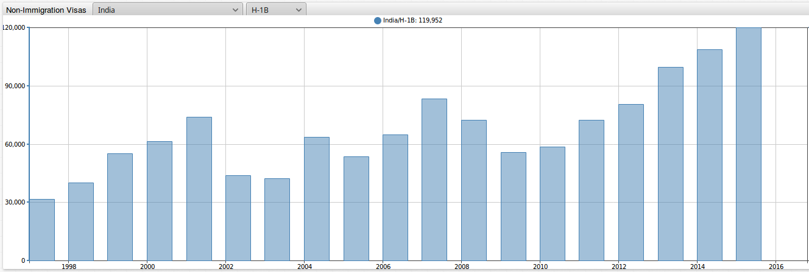
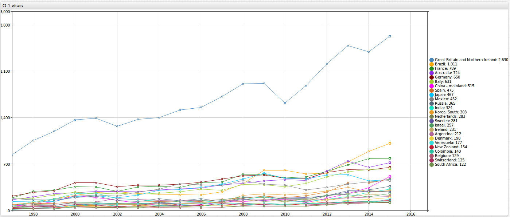
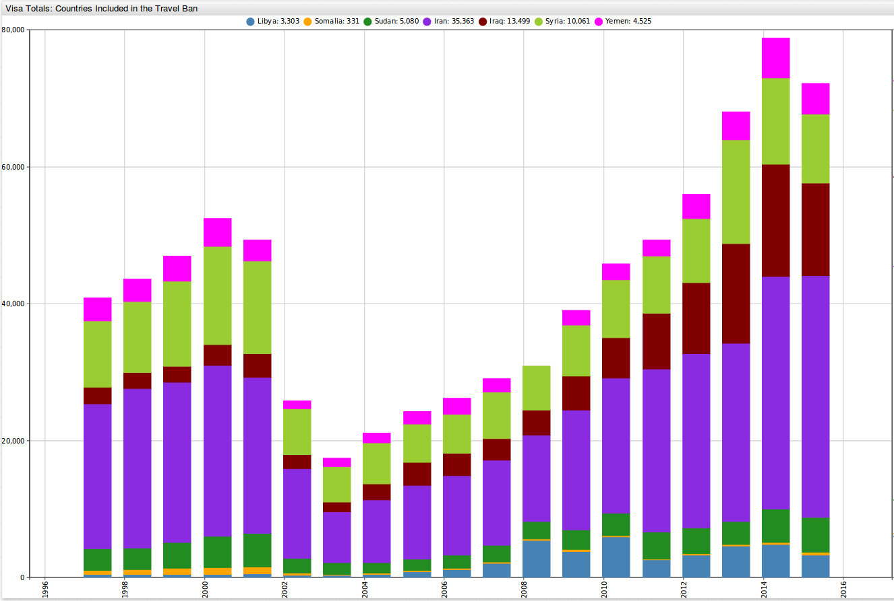
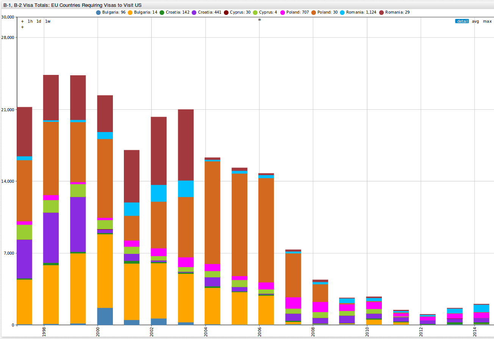
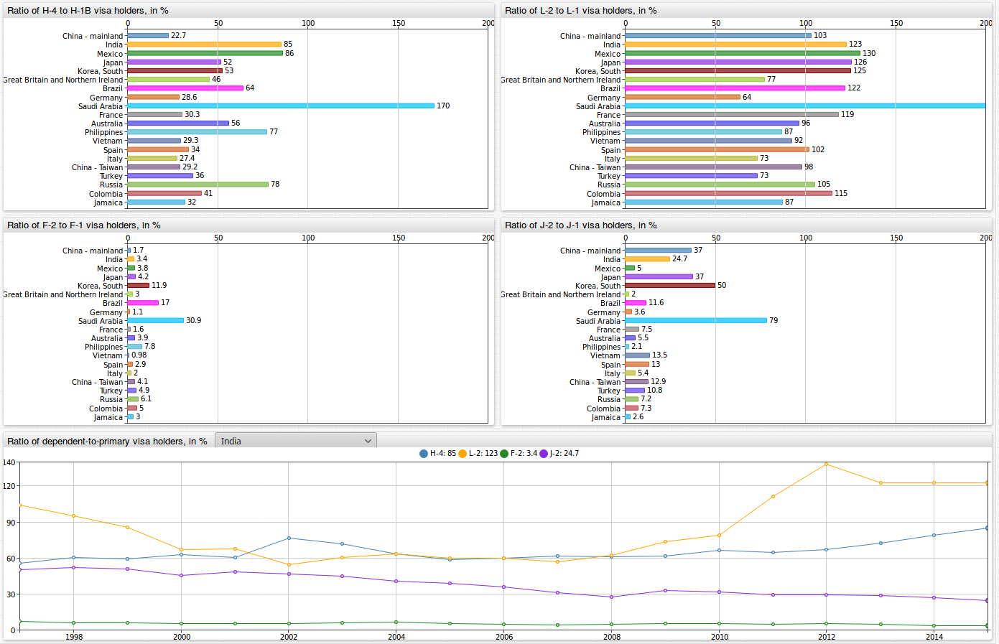
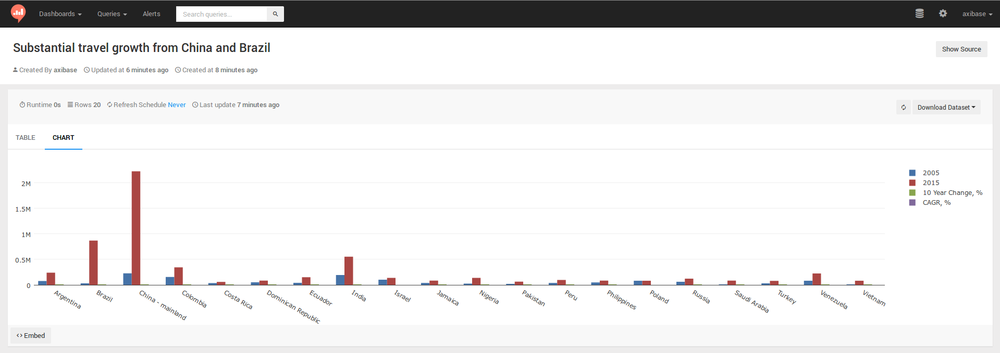
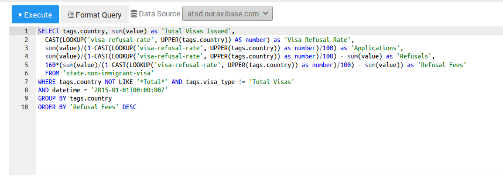
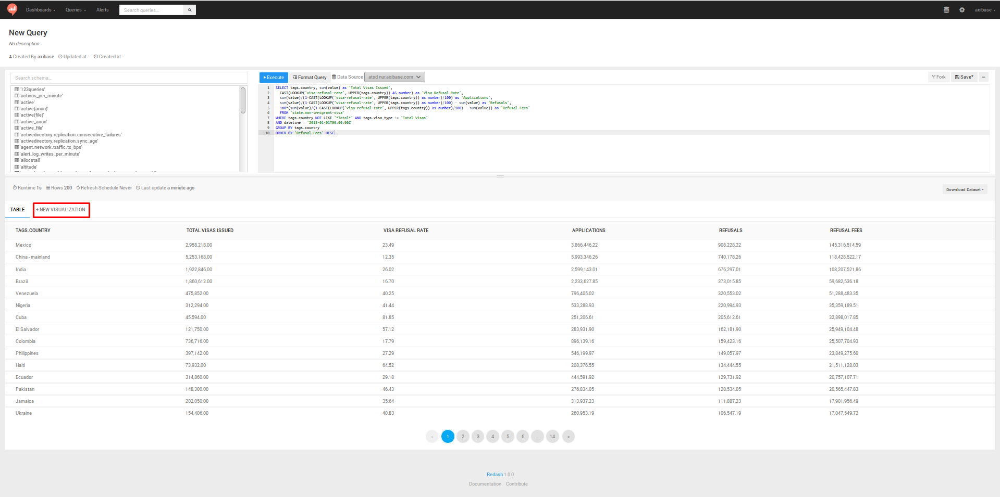
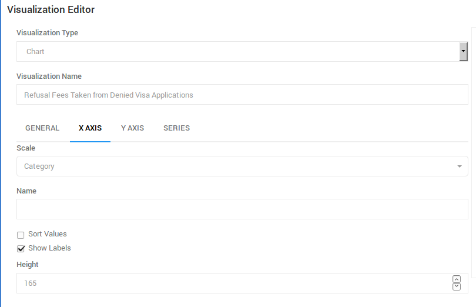

Visa Travel to America. Identifying Trends and Outliers with Charts, SQL and Redash
===================================================

In 2015, the United States was the [second most](https://en.wikipedia.org/wiki/World_Tourism_rankings) visited country in the world. Where do all of these travelers come from and
what are their reasons for coming to the United States?

In this article we will analyze a dataset from [travel.state.gov](https://travel.state.gov) looking at non-immigrant visa figures from 1997 through 2015. This research article illustrates
how publicly available data collected by government organizations can be easily loaded into the non-relational [Axibase Time Series Database](https://axibase.com/products/axibase-time-series-database/)
for interactive analysis. Additionally, this article illustrates some of the capabilities of [Redash](https://redash.io/), an open-source data visualization tool that is integrated with ATSD. We’ll walk through how to make SQL queries in ATSD and create visualizations in Redash. Additionally,
this article contains instructions on how to install your own ATSD instance and populate it with the raw data.  

### U.S. Visa Dataset
---------------------

Let's take a look at the dataset from travel.state.gov, which can be accessed via our archive located in the [Resources](../USVisaRefusal/Resources/visas.tar.gz) folder in this repository. Alternatively, you can
download the Excel file from the [travel.state.gov](https://travel.state.gov) website and save each year as its
own separate CSV file. The title of the Excel file on the travel.state.gov website is **Nonimmigrant Visa Issuances by Visa Class and by Nationality FY1997-2015 NIV Detail Table**.    

This dataset contains yearly totals for non-immigrant visas issued from 1997 through 2015. Totals were collected for 84 different visa
types. You can find the complete list of all the visa types included in this dataset [here](../USVisaRefusal/Resources/visalist.txt). You can find descriptions of all visa types on
the [U.S. Department of State](https://travel.state.gov) website.

Visa figures were collected for 200 countries, 7 continents, and for unknown national origins. You can find a complete list of all the countries included in this dataset [here](../USVisaRefusal/Resources/countrylist.txt).

As opposed to analyzing the dataset in Excel, it is much more convenient to interact with the data once it is loaded into a database. We will use the following two aspects of [Axibase Time Series Database](https://axibase.com/products/axibase-time-series-database/) to look into this dataset: tabular outputs from analytical [SQL queries](https://github.com/axibase/atsd/blob/master/sql/README.md#overview) and interactive graphs from [Chart Lab](../ChartLabIntro/README.md) which is similar to [`jsfiddle`](https://jsfiddle.net/).

You can load the dataset into your ATSD instance by following the steps provided at the [end of the article](#action-items).

### Visa Travel by Country, Continent, and Visa Type
----------------------------------------------------

Let's begin by taking a look at travel by country. The portal shown below allows you to sort by country and visa type. You can toggle between different countries in the first
dropdown, and by visa type in the second dropdown. The below image output shows an output for H-1B visas, which are temporary work visas for workers in specialty occupations, issued
to Indian nationals from 1997 to 2015, which increased from **31,684** in 1997 to **119,952** in 2015. The number of visas issued to mainland China grew from **3,206** in 1997 to
**18,306** in 2015.



You can explore this portal by clicking on the below button:

[](https://apps.axibase.com/chartlab/8c9bb9cc#fullscreen)

This next portal allows you to sort between continents and visa types. You can toggle between different continents in the first dropdown, and by visa type in the second dropdown.
The below images is an output for H-1B visas issued to the continent of Asia as a whole. We can see that the number of visas issued increased from **47,726** in 1997 to **149,788**
in 2015. Recalling from the previous Chart Lab portal, the number of H-1B visas issued to China and India in 2015 was 138,258, meaning that only **11,530** H-1B visas were issued
to the rest of Asia as a whole.


You can explore this portal by right-clicking on the below button:

[](https://apps.axibase.com/chartlab/3c55ada0#fullscreen)

### Delving Further into U.S. Visas
------------------------------------

By looking at the two Chart Lab instances above, we can gain an understanding of the general situation of non-immigrant travel to the United States. Let's begin by taking a look
at some of the more specialized visa types, beginning with the O-1 visa.

The below output shows countries with the greatest number of O-1 visa, which is a work visa for individuals with exceptional abilities. The brain-drain from other countries has
steadily grown over the years, especially from the U.K., which in 2015 had **2,630** O-1 visas issued. In comparison, China only had **515** O-1 visas issued in 2015. Going back
to our first Chart Lab portal, we can see that the total number of visas for the U.K. actually fell by **61%** form 1997 to 2015.



You can explore this portal by clicking on the below button:

[](https://apps.axibase.com/chartlab/3a320d35#fullscreen)

Below is an image for the total visas issued for the countries included in Trump administration's revised [travel ban](https://www.washingtonpost.com/graphics/national/immigration-order-explainer/)
(which has since been lifted). These countries included Iran, Libya, Somalia, Sudan, Syria, and Yemen. After the September 11th terrorist attacks, the number of visas issued
to these countries dropped to only **16,076** in 2003 but climbed back up to **62,464** in 2015. Visas to the United States are generally priced at [$160](https://travel.state.gov),
which amounted to **$10 million** in revenue in 2015.    



You can explore this portal by clicking on the below button:

[](https://apps.axibase.com/chartlab/16c6e667/3/#fullscreen)

According to a recent article published by [Reuters](http://www.reuters.com/article/us-eu-usa-visa-idUSKBN1691Q9), the [European Union](https://en.wikipedia.org/wiki/European_Union) (EU) becoming increasingly insistent on requiring American citizens to
obtain travel visas to visit Europe (currently, Americans do not need visas). This is in response to Washington refusing to grant visa-free access to 5 EU countries: Poland, Croatia,
Bulgaria, Romania, and Cyprus. All EU countries except for these 5 may travel to the US without needing to obtain a travel visa. The following image shows the number of B-1 and B-2 visas
from these countries between 1997 and 2015. The early to mid 2000's saw the peak of the total number of B-1 and B-2 visas issued to these countries, but in recent years
these numbers has dropped off, falling to 9,977 in 2015 ($1,596,320 in revenue at $160 per visa).  



If the EU would require U.S. citizens to obtain travel visas, Washington would likely require the currently visa-exempt countries from the EU to begin obtaining visas in order to visit the country. The total
[number of European travelers](https://en.wikipedia.org/wiki/Visa_Waiver_Program ) to the U.S. utilizing the visa waiver program was 14,043,823 and 13,997,570 in 2014 and 2015, respectively.
At $160 per visa, this would have come to about **$2.24 and $2.239 billion**, a bill EU citizens may soon have to foot should the visa waiver program be lifted.

You can explore this portal by clicking on the below button:

[](https://apps.axibase.com/chartlab/82d4e825#fullscreen)

This below figure shows how many dependents come with each primary visa holder. Saudi Arabian visa holders are currently bringing in the most dependents. Below are some ratios (in %)
for Saudi nationals showing the number of dependent travelers coming to the United States per primary visa holder.

* H-4 (family members of H-1B visa holders) to H-1B (general temporary work visa): **170**
* L-2 (spouse of L-1 visa holder) to L-1 (work visa available to employees of international companies with offices abroad and in the U.S.): **245**
* F-2 (dependents of F-1 visa holders) to F-1 (student visa): **31**
* J-2 (dependents of J-1 visa holders) to J-1 (research scholars, professors, exchange visitors): **79**



You can explore this portal by clicking on the below button:

[](https://apps.axibase.com/chartlab/1bc51064/2/#fullscreen)

### SQL Queries
---------------

In addition to outputs from Chart Lab, ATSD is also capable of performing [SQL queries](https://github.com/axibase/atsd/blob/master/sql/README.md#overview),
which can be used to search for specific information contained in this dataset. You can read more about our SQL syntax [here](https://github.com/axibase/atsd/blob/master/sql/README.md#syntax).

This query shows the number of the most popular visas issued worldwide, except for B (travel), C (transit), G (government), and A (diplomatic). We can see that by far the greatest
number of visas issued in 2015 (except for the above mentioned visa types) was for F-1 (student visa), for which 644,233 were issued.

```sql
SELECT tags.visa_type, sum(value)
  FROM "state.non-immigrant-visa"
WHERE tags.visa_type NOT LIKE 'A%'
  AND tags.visa_type NOT LIKE 'B%'
  AND tags.visa_type NOT LIKE 'C%'
  AND tags.visa_type NOT LIKE 'G%'
  AND tags.visa_type NOT LIKE '%Total%' AND tags.country NOT LIKE '%Total%'
AND datetime = '2015-01-01T00:00:00Z'
GROUP BY tags.visa_type
HAVING sum(value) > 10000
ORDER BY 2 DESC
```

```ls
| tags.visa_type  | sum(value) |
|-----------------|------------|
| F-1             | 644233     |
| J-1             | 332540     |
| H-1B            | 172748     |
| H-4             | 124484     |
| H-2A            | 108144     |
| L-2             | 86067      |
| L-1             | 78537      |
| H-2B            | 69684      |
| J-2             | 42289      |
| E-2             | 41162      |
| F-2             | 33632      |
| K-1             | 30947      |
| P-1             | 24262      |
| I               | 14447      |
| O-1             | 13865      |
| TN              | 13093      |
| M-1             | 11058      |
```

This below query shows the top 15 largest countries by non-immigrant visas in 2015, for all visa types except B (travel), C (transit), G (government), and A (diplomatic).

```sql
SELECT tags.country, sum(value)
  FROM "state.non-immigrant-visa"
WHERE tags.visa_type NOT LIKE 'A%'
  AND tags.visa_type NOT LIKE 'B%'
  AND tags.visa_type NOT LIKE 'C%'
  AND tags.visa_type NOT LIKE 'G%'
  AND tags.visa_type NOT LIKE '%Total%' AND tags.country NOT LIKE '%Total%'
AND datetime = '2015-01-01T00:00:00Z'
GROUP BY tags.country
ORDER BY 2 DESC
LIMIT 15
```

```ls
| tags.country                        | sum(value) |
|-------------------------------------|------------|
| China - mainland                    | 373275     |
| India                               | 368884     |
| Mexico                              | 231186     |
| Japan                               | 58333      |
| Korea, South                        | 58060      |
| Great Britain and Northern Ireland  | 56302      |
| Brazil                              | 47694      |
| Germany                             | 47680      |
| Saudi Arabia                        | 40333      |
| France                              | 37301      |
| Australia                           | 25035      |
| Philippines                         | 23269      |
| Vietnam                             | 22710      |
| Spain                               | 22640      |
| Italy                               | 20603      |
```

The query below shows some statistics for of B-1 and B-2 visas totals (which may be used for business or tourism). This query displays the number of these visas issued for 2005 and
2010 totals, 10-year percentage change, as well as a compound annual growth rate (CAGR). The output is ordered by the number of visas issued in 2015.

```sql
SELECT tags.country, first(value) AS "2005",
  last(value) AS "2015",
  (last(value)/first(value)-1)*100 AS "10 Year Change, %",
  (POWER(last(value)/first(value), 1/count(value))-1)*100 AS "CAGR, %"
  FROM "state.non-immigrant-visa"
WHERE tags.visa_type = 'B-1,2'
  AND tags.country NOT LIKE '%Total%'
  AND LOOKUP('us-visa-waiver-program', tags.country) IS NULL
  AND datetime >= '2005-01-01T00:00:00Z'
GROUP BY tags.country
  --HAVING last(value) > 10000 AND first(value) > 10000
ORDER BY 3 DESC
  LIMIT 20
```

```ls
| tags.country        | 2005      | 2015       | 10 Year Change, %  | CAGR, % |
|---------------------|-----------|------------|--------------------|---------|
| China - mainland    | 226722.0  | 2227670.0  | 882.6              | 23.1    |
| Brazil              | 30468.0   | 870008.0   | 2755.5             | 35.6    |
| India               | 193218.0  | 553385.0   | 186.4              | 10.0    |
| Colombia            | 155586.0  | 345233.0   | 121.9              | 7.5     |
| Argentina           | 76155.0   | 240115.0   | 215.3              | 11.0    |
| Venezuela           | 82050.0   | 223854.0   | 172.8              | 9.6     |
| Ecuador             | 39927.0   | 150458.0   | 276.8              | 12.8    |
| Israel              | 102073.0  | 137439.0   | 34.6               | 2.7     |
| Nigeria             | 26077.0   | 136409.0   | 423.1              | 16.2    |
| Russia              | 62213.0   | 122147.0   | 96.3               | 6.3     |
| Peru                | 37929.0   | 97936.0    | 158.2              | 9.0     |
| Saudi Arabia        | 9242.0    | 85303.0    | 823.0              | 22.4    |
| Dominican Republic  | 51538.0   | 85140.0    | 65.2               | 4.7     |
| Jamaica             | 37103.0   | 83483.0    | 125.0              | 7.7     |
| Philippines         | 47368.0   | 83139.0    | 75.5               | 5.2     |
| Poland              | 80777.0   | 81861.0    | 1.3                | 0.1     |
| Vietnam             | 4334.0    | 80936.0    | 1767.5             | 30.5    |
| Turkey              | 30390.0   | 78118.0    | 157.1              | 9.0     |
| Pakistan            | 18894.0   | 62714.0    | 231.9              | 11.5    |
| Costa Rica          | 35449.0   | 58139.0    | 64.0               | 4.6     |
```

Total revenue for travel visas (in millions of USD) for the state department at $160 per visa from 1997 to 2015. Revenues from visas in this time period has more than doubled, from
**$491.3 million** in 1997 to **$1.152 billion** in 2015.  

```sql
SELECT date_format(time, 'yyyy') AS "year", sum(value) * 160 / power(10, 6) AS "Visa Fees, $M"
  FROM "state.non-immigrant-visa"
WHERE tags.visa_type = 'B-1,2'
  AND tags.country NOT LIKE '%Total%'
GROUP BY datetime
```

```ls
| year  | Visa Fees, $M |
|-------|---------------|
| 1997  | 491.3         |
| 1998  | 516.3         |
| 1999  | 551.7         |
| 2000  | 570.8         |
| 2001  | 564.3         |
| 2002  | 404.5         |
| 2003  | 353.2         |
| 2004  | 374.5         |
| 2005  | 433.5         |
| 2006  | 488.6         |
| 2007  | 531.0         |
| 2008  | 558.0         |
| 2009  | 467.0         |
| 2010  | 523.0         |
| 2011  | 694.0         |
| 2012  | 854.8         |
| 2013  | 903.3         |
| 2014  | 1004.3        |
| 2015  | 1152.0        |
```

### Data Visualization with Redash
----------------------------------

SQL queries are a great tool for searching for and displaying specific information from a dataset in tabular format. One of the biggest drawbacks from SQL outputs is that you are
not able to show these tables as some kind graphical output. Axibase is partnered with [Redash](https://redash.io/), an open-source data visualization tool.
You can plug your query results into Redash, and with a few simple steps, create graphical outputs from your SQL queries. Begin by walking through [setting up Redash through ATSD](https://redash.io/help/data-sources/axibase_tsd.html). The setup should take you about 10 minutes.


Let's begin by preparing a visualization for our last SQL query looking at worldwide visa issuances.

1. After completing the walkthrough, from the 'Queries' dropdown select 'New Queries', as shown in the image below.

   

2. Copy and paste the SQL query configuration from above. Select `atsd nur.axibase.com` as your 'Data Source'.

   

3. Press `Execute`!

4. After selecting `Execute`, you should see a table output like the image below. Click on 'New Visualization', as shown in the image below.

   

5. Now, we can specify the details of our output. Select `tags.country` as the X Column and `tags.visa_type` as the Y Column. You can give your output a title by filling in the
   'Visualization Name' box.

   

6. Next, select the X Column tab. Select `Category` as the Scale, uncheck the `Sort Values` button, and modify the height of the column to fit all the country names. Click 'Save' in
   the bottom right-hand corner.

   

Below is the output from our query. You can toggle over any column to see what the visa issuances were for that particular visa type in 2015. By selecting the 'Save' button,
you can save the configuration and come back to it anytime. By selecting the 'Publish' button, you can make this configuration available to anybody else who shares the same
system credentials with you. As opposed to looking only at a tabular output from an SQL query, we can quickly see the scale of things looking at this output.  


Here are some additional Redash charts for some of the queries that were included earlier in this article.

These two figures show the top 20 countries with the most B-1,2 visas issued for 2005 and 2015 (1st figure), as well as the compound annual growth rate for these countries (2nd figure). Looking at these
outputs, we can see that Brazil and China have experienced tremendous growth in terms of the number of visas issued from 2005 to 2015, as well as the compound annual growth rate.
What may not have stood out from the tabular SQL query output is that while the number of visas issued to Vietnam has remained relatively small, the compound annual growth
rate in this 10-years period was **30.2%**, which came in 2nd only behind Brazil (which finished at 35.6%).


Travellers have come to America from all over the world. With over 200 countries and 84 visa types included in this dataset, the possibilities for travel documents seem endless.
Using ATSD can help you make sense of all this information. You can use Chart Lab to create interactive graphs which allow you to gain a general view of the situation, SQL queries
to search for specific information contained within the dataset, and Redash to display this specifically searched for information in a clear and concise manner.  

### Action Items
----------------

Below are the summarized steps to follow to install local configurations of ATSD for analyzing United States visa statistics:   

1. Install [Docker](https://docs.docker.com/engine/installation/linux/ubuntulinux/).
2. Install Redash using the following command.

   ```sh
      git clone https://github.com/getredash/redash
      cd redash
      docker-compose -f docker-compose.production.yml run --rm server create_db to setup the database
      docker-compose -f docker-compose.production.yml up -d
   ```

   For more details on Redash click [here](https://redash.io/help-onpremise/setup/setting-up-redash-instance.html).

3. Install the ATSD database on your local configuration using the following command.

   ```sql
    docker run \
      --detach \
      --name=atsd \
      --restart=always \
      --publish 8088:8088 \
      --publish 8443:8443 \
      --publish 8081:8081 \
      --publish 8082:8082/udp \
      axibase/atsd:latest
   ```

4. Log in to ATSD and configure the pre-defined administrator account.
5. Import the [`travel_visas.xml`](../USVisaRefusal/Resources/travel_visas.xml) file into ATSD. For a more detailed description, refer to step 9 from the following [step-by-step walkthrough](../USMortality/configuration.md) from our article on [U.S. mortality statistics](../USMortality/README.md).
6. Import the [`visas.tar.gz`](../USVisaRefusal/Resources/visas.tar.gz) file into ATSD using the above-mentioned parser.
7. Navigate to the Docker machine IP at port 5000, where you should see a Redash login screen.
8. Follow the steps in [ATSD data source guide](https://redash.io/help/data-sources/axibase_tsd.html) to create a read-only account in ATSD and add a new ATSD data source in Redash.
9. Create a sample query configuration, and execute the following query to validate the integration:

   ```sql
   SELECT * FROM jvm_memory_free LIMIT 10
   ```

10. You are all set! Continue creating query configurations described in this article.

If you require assistance in installing this software or have any questions, please feel free to [contact us](https://axibase.com/feedback/) and we would be happy to be of assistance!

### Sources
-----------

Title Photo: http://www.siam-legal.com/US_Visa/k1-visa-thailand.php
