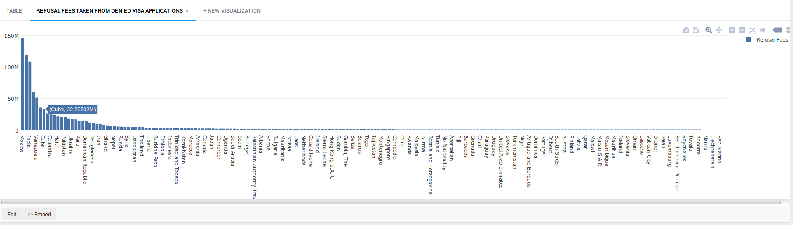

Visa Travel to America with Charts, SQL, and Redash
===================================================

In 2015, the United States was the [second most](https://en.wikipedia.org/wiki/World_Tourism_rankings) visited country in the world. Where do all of these travellers come from and 
what are their reasons for coming to the United States? 

In this article we will analyze a dataset from [travel.state.gov](travel.state.gov) looking at non-immigrant visa figures from 1997 through 2015. This research article illustrates 
how publicly available data from travel.state.gov can be easily loaded into the non-relational [Axibase Time Series Database (ATSD)](http://axibase.com/products/axibase-time-series-database/)
for interactive analysis and graphical representation of raw data collected by government organizations. Additionally, this article illustrates some of the capabilities of [Redash](https://redash.io/),
which is an open source data visualization tool that is partnered with Axibase. We will walk through how to take SQl queries from ATSD and create visualizations in Redash. Additionally,
this article contains instructions on how to install your own ATSD instance and populate it with the raw data. 

### U.S. Visa Dataset
---------------------

Let's take a look at the dataset from [travel.state.gov](travel.state.gov), which can be accessed via our archive located [here](Resources/visas.tar.gz). Alternatively, you can
download the Excel file from the [travel.state.gov](https://travel.state.gov/content/visas/en/law-and-policy/statistics/non-immigrant-visas.html) website and save each year as its
own seperate CSV file. The title of the Excel file is **Nonimmigrant Visa Issuances by Visa Class and by Nationality FY1997-2015 NIV Detail Table**.    

This dataset contains yearly totals for visas issued from 1997 through 2015. This dataset contains information on non-immigrant visas. Totals were collected for 84 different visas 
types. You can find the complete list of all the visa types include in this dataset [here](Resources/visalist.txt).

Visa figures were collected for 200 countries, 7 continents, and for unknown national origins. You can find a complete list of all the countries included in this dataset [here](Resources/countrylist.txt).
You can find descriptions of all visa types on the [U.S. Department of State](https://travel.state.gov/content/visas/en/general/all-visa-categories.html) website.

It is much more convenient to interact with the data once it is loaded into a database. The [Axibase Time Series Database (ATSD)](http://axibase.com/products/axibase-time-series-database/) 
is a powerful tool when it comes to storing, analyzing, and visualizing datasets. We will use the following two aspects of ATSD to look into this dataset: interactive graphs 
from [Chart Lab](/ChartLabIntro/README.md) and tabular outputs from analytical [SQL queries](https://github.com/axibase/atsd-docs/blob/master/api/sql/README.md#overview).
You can load the dataset into your ATSD instance by following the steps provided at the [end of the article](#action-items). 
 
### Immigration by Country, Continent, and Visa Type
----------------------------------------------------

Let's begin by taking a look at immigration by country. The below image shows an output for H-1B visas, which are temporary work visas for workers in speciality occupations, issued
to Indian nationals from 1997 to 2015, which grew from **31,684** in 1997 to **119,952** in 2015. You can toggle between different countries in the first dropdown, and by visa type
in the second dropdown.


You can explore this portal by clicking on the below button:

[](https://apps.axibase.com/chartlab/8c9bb9cc)

The next image below an output for H-1B visas issued to the continent of Asia as a whole. We can see that the number of visas issued increased from **47,726** in 1997 to **149,788**
in 2015. you can toggle between different continents in the first dropdown, and by visa type in the second dropdown.
 


You can explore this portal by clicking on the below button: 

[](https://apps.axibase.com/chartlab/3c55ada0)

### Delving in Further to U.S. Visas
------------------------------------

Countries with the greatest number of O-1 visa, which is a work visa for individuals with exceptional abilities. The brain-drain from other countries has steadily grown over the 
years, especially from the U.K., which in 2015 had **2,630** O-1 visas issued.


You can explore this portal by clicking on the below button: 

[](https://apps.axibase.com/chartlab/3a320d35)

Below is an image for the total visa issued for the countries included in Trump administration's [travel ban](https://www.washingtonpost.com/graphics/national/immigration-order-explainer/)
(which has since been lifted). These countries included Iran, Iraq, Libya, Somalia, Sudan, Syria, and Yemen. After the September 11th terrorist attacks, the number of visas issued
to these countries dropped to only **17,431** in 2003 but climbed back up to **72,162** in 2015.    


You can explore this portal by clicking on the below button:

[](https://apps.axibase.com/chartlab/16c6e667/3/)

This below figure shows how many dependents come with each primary visa holder. Saudi Arabian visa holders are currently bringing in the most dependents. Below are some ratios (in %)
for Saudi nationals showing the number of dependent travellers coming to the United States per primary visa holder.

* H-4 (family members of H-1B visa holders) to H-1B (general temporary work visa): **170**
* L-2 (spouse of L-1 visa holder) to L-1 (work visa available to employees of international companies with offices abroad and in the U.S.): **245**
* F-2 (dependents of F-1 visa holders) to F-1 (student visa): **31**
* J-2 (dependents of J-1 visa holders) to J-1 (research scholars, professors, exchange visitors): **79**


You can explore this portal by clicking on the below button: 

[](https://apps.axibase.com/chartlab/1bc51064/2/)

### SQL Queries 
---------------

In addition to outputs from Chart Lab, ATSD is also capable to perform [SQL queries](https://github.com/axibase/atsd-docs/blob/master/api/sql/README.md#overview), 
which can be used to search for specific information contained in this dataset. You can read more about our SQL syntax [here](https://github.com/axibase/atsd-docs/blob/master/api/sql/README.md#syntax).

This query shows the number of the most popular visas issued world wide, except for B (travel), C (transit), G (government), and A (diplomatic).

```sql
SELECT tags.visa_type, sum(value) 
  FROM 'state.non-immigrant-visa' 
WHERE tags.visa_type NOT LIKE 'A*' 
  AND tags.visa_type NOT LIKE 'B*' 
  AND tags.visa_type NOT LIKE 'C*' 
  AND tags.visa_type NOT LIKE 'G*' 
  AND tags.visa_type NOT LIKE '*Total*' AND tags.country NOT LIKE '*Total*' 
AND datetime = '2015-01-01T00:00:00Z'
GROUP BY tags.visa_type
HAVING sum(value) > 10000
ORDER BY 2 DESC
```

```ls
| tags.visa_type  | sum(value) | 
|-----------------|------------| 
| F-1             | 644233     | 
| J-1             | 332540     | 
| H-1B            | 172748     | 
| H-4             | 124484     | 
| H-2A            | 108144     | 
| L-2             | 86067      | 
| L-1             | 78537      | 
| H-2B            | 69684      | 
| J-2             | 42289      | 
| E-2             | 41162      | 
| F-2             | 33632      | 
| K-1             | 30947      | 
| P-1             | 24262      | 
| I               | 14447      | 
| O-1             | 13865      | 
| TN              | 13093      | 
| M-1             | 11058      | 
```

This below query shows the top 15 largest countries by non-immigrant visas in 2015, for all visa types except B (travel), C (transit), G (government), and A (diplomatic).

```sql
SELECT tags.country, sum(value) 
  FROM 'state.non-immigrant-visa' 
WHERE tags.visa_type NOT LIKE 'A*' 
  AND tags.visa_type NOT LIKE 'B*' 
  AND tags.visa_type NOT LIKE 'C*' 
  AND tags.visa_type NOT LIKE 'G*' 
  AND tags.visa_type NOT LIKE '*Total*' AND tags.country NOT LIKE '*Total*' 
AND datetime = '2015-01-01T00:00:00Z'
GROUP BY tags.country
ORDER BY 2 DESC
LIMIT 15
```

```ls
| tags.country                        | sum(value) | 
|-------------------------------------|------------| 
| China - mainland                    | 373275     | 
| India                               | 368884     | 
| Mexico                              | 231186     | 
| Japan                               | 58333      | 
| Korea, South                        | 58060      | 
| Great Britain and Northern Ireland  | 56302      | 
| Brazil                              | 47694      | 
| Germany                             | 47680      | 
| Saudi Arabia                        | 40333      | 
| France                              | 37301      | 
| Australia                           | 25035      | 
| Philippines                         | 23269      | 
| Vietnam                             | 22710      | 
| Spain                               | 22640      | 
| Italy                               | 20603      | 
```

The query below shows some statistics for of B-1 and B-2 visas totals (which may be used for business or tourism). This query displays the number of these visas issued for 2005 and
2010 totals, 10 year percentage change, as well as a compounded annual growth rate (CAGR). The output is ordered by the number of visa issued in 2015. 

```sql 
SELECT tags.country, first(value) AS "2005", 
  last(value) AS "2015", 
  (last(value)/first(value)-1)*100 AS "10 Year Change, %", 
  (POWER(last(value)/first(value), 1/count(value))-1)*100 AS "CAGR, %"
  FROM 'state.non-immigrant-visa' 
WHERE tags.visa_type = 'B-1,2'
  AND tags.country NOT LIKE '*Total*'
  AND LOOKUP('us-visa-waiver-program', tags.country) IS NULL
  AND datetime >= '2005-01-01T00:00:00Z'
GROUP BY tags.country
  --HAVING last(value) > 10000 AND first(value) > 10000
ORDER BY 3 DESC
  LIMIT 20
```

```ls
| tags.country        | 2005      | 2015       | 10 Year Change, %  | CAGR, % | 
|---------------------|-----------|------------|--------------------|---------| 
| China - mainland    | 226722.0  | 2227670.0  | 882.6              | 23.1    | 
| Brazil              | 30468.0   | 870008.0   | 2755.5             | 35.6    | 
| India               | 193218.0  | 553385.0   | 186.4              | 10.0    | 
| Colombia            | 155586.0  | 345233.0   | 121.9              | 7.5     | 
| Argentina           | 76155.0   | 240115.0   | 215.3              | 11.0    | 
| Venezuela           | 82050.0   | 223854.0   | 172.8              | 9.6     | 
| Ecuador             | 39927.0   | 150458.0   | 276.8              | 12.8    | 
| Israel              | 102073.0  | 137439.0   | 34.6               | 2.7     | 
| Nigeria             | 26077.0   | 136409.0   | 423.1              | 16.2    | 
| Russia              | 62213.0   | 122147.0   | 96.3               | 6.3     | 
| Peru                | 37929.0   | 97936.0    | 158.2              | 9.0     | 
| Saudi Arabia        | 9242.0    | 85303.0    | 823.0              | 22.4    | 
| Dominican Republic  | 51538.0   | 85140.0    | 65.2               | 4.7     | 
| Jamaica             | 37103.0   | 83483.0    | 125.0              | 7.7     | 
| Philippines         | 47368.0   | 83139.0    | 75.5               | 5.2     | 
| Poland              | 80777.0   | 81861.0    | 1.3                | 0.1     | 
| Vietnam             | 4334.0    | 80936.0    | 1767.5             | 30.5    | 
| Turkey              | 30390.0   | 78118.0    | 157.1              | 9.0     | 
| Pakistan            | 18894.0   | 62714.0    | 231.9              | 11.5    | 
| Costa Rica          | 35449.0   | 58139.0    | 64.0               | 4.6     | 
```

Total revenue for travel visas (in millions of USD) for the state department at $160 per visa from 1997 to 2015:

```sql
SELECT date_format(time, 'yyyy') AS "year", sum(value) * 160 / power(10, 6) AS "Visa Fees, $M"
  FROM 'state.non-immigrant-visa' 
WHERE tags.visa_type = 'B-1,2' 
  AND tags.country NOT LIKE '*Total*' 
GROUP BY datetime
```

```ls
| year  | Visa Fees, $M | 
|-------|---------------| 
| 1997  | 491.3         | 
| 1998  | 516.3         | 
| 1999  | 551.7         | 
| 2000  | 570.8         | 
| 2001  | 564.3         | 
| 2002  | 404.5         | 
| 2003  | 353.2         | 
| 2004  | 374.5         | 
| 2005  | 433.5         | 
| 2006  | 488.6         | 
| 2007  | 531.0         | 
| 2008  | 558.0         | 
| 2009  | 467.0         | 
| 2010  | 523.0         | 
| 2011  | 694.0         | 
| 2012  | 854.8         | 
| 2013  | 903.3         | 
| 2014  | 1004.3        | 
| 2015  | 1152.0        | 
```

Of the **$1.152 billion** that the U.S. made from non-immigration visas, how much of that was earned from visa applications that were denied? We can load visa refusal rates from
[travel.state.gov](https://travel.state.gov/content/dam/visas/Statistics/Non-Immigrant-Statistics/RefusalRates/FY16.pdf) into ATSD as a replacement table, and then calculate the
total dollar amount earned from visas that were denied. In 2015 Mexico topped the list for paying the most for refused visa applications at **$145,316,514.6**.

```sql 
SELECT tags.country, sum(value) as 'Total Visas Issued', 
  CAST(LOOKUP('visa-refusal-rate', UPPER(tags.country)) AS number) as 'Visa Refusal Rate',
  sum(value)/(1-CAST(LOOKUP('visa-refusal-rate', UPPER(tags.country)) as number)/100) as 'Applications',
  sum(value)/(1-CAST(LOOKUP('visa-refusal-rate', UPPER(tags.country)) as number)/100) - sum(value) as 'Refusals',
  160*(sum(value)/(1-CAST(LOOKUP('visa-refusal-rate', UPPER(tags.country)) as number)/100) - sum(value)) as 'Refusal Fees'
  FROM 'state.non-immigrant-visa' 
WHERE tags.country NOT LIKE '*Total*' AND tags.visa_type != 'Total Visas'
AND datetime = '2015-01-01T00:00:00Z'
GROUP BY tags.country
ORDER BY 'Refusal Fees' DESC
```

```ls
| tags.country                           | Total Visas Issued  | Visa Refusal Rate  | Applications  | Refusals  | Refusal Fees | 
|----------------------------------------|---------------------|--------------------|---------------|-----------|--------------| 
| Mexico                                 | 2958218.0           | 23.5               | 3866446.2     | 908228.2  | 145316514.6  | 
| China - mainland                       | 5253168.0           | 12.4               | 5993346.3     | 740178.3  | 118428522.2  | 
| India                                  | 1922846.0           | 26.0               | 2599143.0     | 676297.0  | 108207521.9  | 
| Brazil                                 | 1860612.0           | 16.7               | 2233627.9     | 373015.9  | 59682536.2   | 
| Venezuela                              | 475852.0            | 40.2               | 796405.0      | 320553.0  | 51288483.3   | 
| Nigeria                                | 312294.0            | 41.4               | 533288.9      | 220994.9  | 35359189.5   | 
| Cuba                                   | 45594.0             | 81.8               | 251206.6      | 205612.6  | 32898017.9   | 
| El Salvador                            | 121750.0            | 57.1               | 283931.9      | 162181.9  | 25949104.5   | 
| Colombia                               | 736716.0            | 17.8               | 896139.2      | 159423.2  | 25507704.9   | 
| Philippines                            | 397142.0            | 27.3               | 546200.0      | 149058.0  | 23849275.6   | 
| Haiti                                  | 73932.0             | 64.5               | 208376.6      | 134444.6  | 21511128.0   | 
| Ecuador                                | 314860.0            | 29.2               | 444591.9      | 129731.9  | 20757107.7   | 
| Pakistan                               | 148300.0            | 46.4               | 276834.0      | 128534.0  | 20565447.8   | 
| Jamaica                                | 202050.0            | 35.6               | 313937.2      | 111887.2  | 17901956.5   | 
| Ukraine                                | 154406.0            | 40.8               | 260953.2      | 106547.2  | 17047549.7   | 
| Guatemala                              | 111236.0            | 48.7               | 216749.8      | 105513.8  | 16882208.8   | 
| Peru                                   | 223836.0            | 28.6               | 313539.7      | 89703.7   | 14352593.8   | 
......
| Tuvalu                                 | 154.0               | 20.0               | 192.5         | 38.5      | 6160.0       | 
| Korea, North                           | 178.0               | 15.0               | 209.4         | 31.4      | 5025.9       | 
| Andorra                                | 54.0                | 28.6               | 75.6          | 21.6      | 3455.8       | 
| Solomon Islands                        | 334.0               | 4.3                | 348.9         | 14.9      | 2389.5       | 
| Nauru                                  | 80.0                | 13.3               | 92.3          | 12.3      | 1968.7       | 
| Micronesia, Federated States of        | 10.0                | 25.0               | 13.3          | 3.3       | 533.3        | 
| Liechtenstein                          | 110.0               | 0.0                | 110.0         | 0.0       | 0.0          | 
| Monaco                                 | 90.0                | 0.0                | 90.0          | 0.0       | 0.0          | 
| San Marino                             | 50.0                | 0.0                | 50.0          | 0.0       | 0.0          | 
| United Nations Laissez-Passer          | 214.0               | 0.0                | 214.0         | 0.0       | 0.0          | 
```
  
### Data Visualization with Redash
----------------------------------

SQL queries allow you search for and display specific information from a dataset in tabular format, but you are not able to directly output these tables in ATSD.
  
Axibase is partnered with [Redash](https://redash.io/), which is a open source data visualization tool. You can plug in your query results, and with a few simple steps, create
graphical outputs for your SQL queries. Begin by walking through [setting up Redash though ATSD](https://github.com/axibase/website/blob/master/user-guide/data-sources/atsd.md). 
The set up time should take you about 10 minutes.
     
Let's begin by preparing a visualization for our last SQL query looking at refusal fees.
     
1. After completing the walkthrough, form the 'Queries' dropdown select 'New Queries', as shown in the image below. 
      
   
   
2. Copy and paste the SQL query configuration from above. Select `atsd nur.axibase.com` as your 'Data Source'. 
 
   

3. Press Execute!
      
4. After selecting execute, you should see a table output like in the image below. Click on '+New Visualization', as shown in the image below.
        
   
       
5. Now, we can specify the details of our output. Select `tags.country` as the X Column and `Refusal Fees` as the Y Column.

   
    
6. Next, select the X Column tab. Select `Category` as the Scale, uncheck the `Sort Values` button, and modify the height of the column to fit all the country names. Click 'Save' in
   the bottom right hand corner.
 
   
   
7. Below is our output from our query. You can toggle over any column to see what the visa refusal fees were for that particular country in 2015. By selecting the 'Save' button,
   you can save the configuration and come back to it anytime. By selecting the 'Publish' button, you can make this configuration available to anybody else that shares the same
   system credentials with you.  
    
   
   
Here are some additional Redash charts for some of the queries that were include earlier in this article.

Top 20 countries with the most B-1,2 visas issued for 2005 and 2015 (1st figure), as well as the compound annual growth rate for these countries (2nd figure).    
   


Worldwide visa issuances (excluding travel, diplomats, government, transit).


   
### Action Items
----------------

Below are the summarized steps to follow to install local configurations of ATSD for analyzing United States visa statistics:   
   
1. Install [Docker](https://docs.docker.com/engine/installation/linux/ubuntulinux/).
2. Install Redash using the following command.
   
   ```sql
      git clone https://github.com/getredash/redash
      cd redash
      docker-compose -f docker-compose.production.yml run --rm server create_db to setup the database
      docker-compose -f docker-compose.production.yml up -d
   ```

   For more details on Redash click [here](https://redash.io/help-onpremise/setup/setting-up-redash-instance.html).

3. Install the ATSD database on your local configuration using the following command. 

   ```sql
    docker run \
      --detach \
      --name=atsd \
      --restart=always \
      --publish 8088:8088 \
      --publish 8443:8443 \
      --publish 8081:8081 \
      --publish 8082:8082/udp \
      axibase/atsd:latest
   ```

4. Login into ATSD and configure the pre-defined administrator account.
5. Import the [`travel_visas.xml`](Resources/travel_visas.xml) file into ATSD. For a more detailed description, refer to step 9 from the following [step-by-step walkthrough](https://github.com/axibase/atsd-use-cases/blob/master/USMortality/configuration.md) from our article on [U.S. mortality statistics](https://github.com/axibase/atsd-use-cases/blob/master/USMortality/README.md). 
6. Import the [`visas.tar.gz`](Resources/visa.tar.gz) file into ATSD using the the above mentioned parser.
7. Navigate to the Docker machine IP at port 5000, where you should see a Redash login screen.
8. Follow the steps in [ATSD datasource guide](https://github.com/axibase/website/blob/master/user-guide/data-sources/atsd.md) to create a read-only account in ATSD and add a new ATSD datasource in Redash.
9. Create a sample query configuration, and execute the following query to validate the integration:

   ```sql
   SELECT * FROM jvm_memory_free LIMIT 10 
   ```
   
10. You are all set! Continue creating query configurations described in this article.

If you require assistance in installing this software or have any questions, please feel free to [contact us](https://axibase.com/feedback/) and we would be happy to be of assistance!
        
### Sources
-----------

Title Photo: http://www.siam-legal.com/US_Visa/k1-visa-thailand.php
