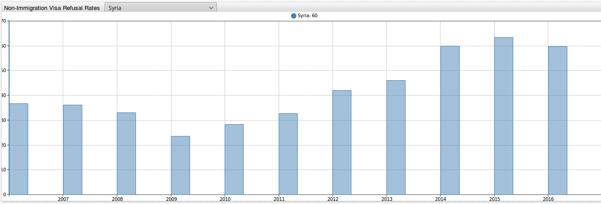
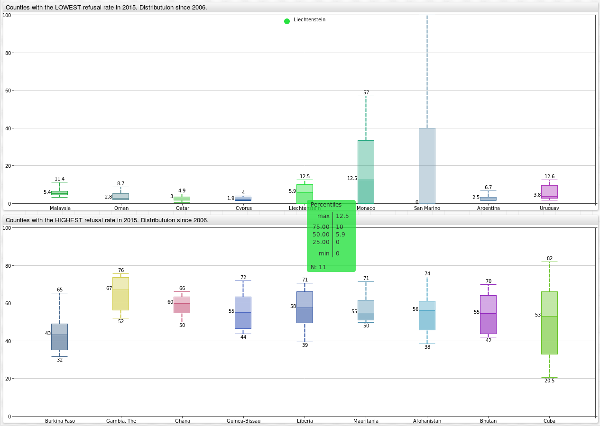

U.S. Visa Refusal Rates with Charts and SQL Queries
===================================================

There are few ways to earn **$400 million** in a short amount of time in today's world. You can win the lottery, come up with the next big smart phone app, or invest your money. Or
You could simply be the [U.S. State Department](https://www.state.gov/), which in 2015 earned more than **$1.7 billion** from issued non-immigrant visas. Additionally, the State 
Department earned over **$400 million** from non-immigrant visas that ended up being refused. What do the visa refusal rates for countries around the world look like? How have 
visa refusal rates changed over time? What is the total revenue the U.S. draws from refused visa applications?

In this article we will analyze a dataset from [travel.state.gov](https://travel.state.gov) looking at non-immigrant visa figures from 1997 through 2015 together with visa refusal rates
from 2006 to 216 (also from [travel.state.gov](https://travel.state.gov)). This research article illustrates how publicly available data from travel.state.gov collected by government 
organizations can be easily loaded into the non-relational [Axibase Time Series Database (ATSD)](http://axibase.com/products/axibase-time-series-database/) for interactive analysis and 
visual outputs with Chart Lab charts and SQL queries. Additionally, this article contains instructions on how to install your own ATSD instance and populate it with raw data. 

### U.S. Visa Dataset and Refusal Rates
---------------------------------------

Let's take a look at the dataset from travel.state.gov, which can be accessed via our archive located in the [Resources](Resources/visas.tar.gz) folder in this repository. Alternatively, you can
download the Excel file from the [travel.state.gov](https://travel.state.gov/content/visas/en/law-and-policy/statistics/non-immigrant-visas.html) website and save each separate year as its
own individual CSV file. The title of the Excel file on the travel.state.gov website is **Nonimmigrant Visa Issuances by Visa Class and by Nationality FY1997-2015 NIV Detail Table**.    

This dataset contains yearly totals for non-immigrant visas issued from 1997 through 2015. Totals were collected for 84 different visa types. You can find the complete list of all 
the visa types included in this dataset [here](Resources/visalist.txt). You can find descriptions of all visa types on the [U.S. Department of State](https://travel.state.gov/content/visas/en/general/all-visa-categories.html) website.

Visa figures were collected for 200 countries, 7 continents, and for unknown national origins. You can find a complete list of all the countries included in this dataset [here](Resources/countrylist.txt).

Visa refusal rates were taken from the [travel.state.gov](https://travel.state.gov/content/dam/visas/Statistics/Non-Immigrant-Statistics/refusalratelanguage.pdf#3) website, and can be
accessed via our archive located in the [Resources](Resources/visa-refusal.csv) as individual CSV files for each year. Alternatively, you can navigate to the travel.state.gov
website and download each file individually; however these files are only available in PDF format. These refusal rates are applied for only type [B visas](https://en.wikipedia.org/wiki/B_visa). Generally speaking, B-1 
visas are issued for individuals seeking entry for business purposes, while B-2 visas are issued for tourism and non-business purposes. In this article, in order to come up with a total
monetary value for visa refusal fees, we will apply these refusal rates to all visa types. 

As opposed to analyzing this information in Excel, it is much more convenient to interact with the data once it is loaded into a database. The [Axibase Time Series Database (ATSD)](http://axibase.com/products/axibase-time-series-database/) 
is a powerful tool when it comes to storing, analyzing, and visualizing datasets. We will use the following two aspects of ATSD to look into this dataset: interactive graphs 
from [Chart Lab](/ChartLabIntro/README.md) and tabular outputs from analytical [SQL queries](https://github.com/axibase/atsd-docs/blob/master/api/sql/README.md#overview).
You can load the dataset into your ATSD instance by following the steps provided at the [end of the article](#action-items). 
 
### U.S. Visa Refusal Rates
---------------------------

The below figure shows the refusal rates from 2006 through 2016. We can see that refusal rates for Syrian nationals grew from **23.6%** in 2009 to **60.0%** in 2016. You can filter 
by country by clicking on the dropdown button. Here are a few more countries with figures showing how their refusal rates have changed over time.

* Mexico: 33.0% (2007) to 23.5% (2016)
* Russia: 15.3% (2006) to 9.3% (2016)
* Iran: 45% (2006) to 45% (2016)
* China: 24.5% (2006) to 12.4% (2016)



You can explore this portal by clicking on the below button:

[](https://apps.axibase.com/chartlab/8c9bb9cc/4/#fullscreen)

The below figure shows the countries with the highest and lowest refusal rates in 2015. Cuba topped the list with the highest refusal rate at **82%**, while Lictenstein, Monaco, and
San Marino all had refusal rates of **0%**.


You can explore this portal by clicking on the below button:

[](https://apps.axibase.com/chartlab/b8675093/2/#fullscreen)

The below figure shows the distribution over time of the lowest (top figure) and highest (bottom figure) refusal rates from 2015. By scrolling over of the the distributions, you
can see the maximum and minimum refusal rates for the country from 2006 through 2016, as well as values for the 25th, 50th, and 75th percentiles. We can see that the visa refusal rates
for nationals from Monaco has shot up to a **57%** refusal rate in 2015 (the absolute minimum in this time frame was 0%). Cuba shot up to a **82%** refusal rate in 2015, with the minimum
refusal from 2006 to 2014 being 20.5%.   



You can explore this portal by clicking on the below button:

[](https://apps.axibase.com/chartlab/b8675093#fullscreen)

### SQL Queries
---------------

In addition to outputs from Chart Lab, ATSD is also capable of performing [SQL queries](https://github.com/axibase/atsd-docs/blob/master/api/sql/README.md#overview), 
which can be used to search for specific information contained in this dataset. You can read more about our SQL syntax [here](https://github.com/axibase/atsd-docs/blob/master/api/sql/README.md#syntax).

This first query shows countries were refusals have increased most over the last 10 years. Surprisingly, two countries that have long been considered U.S. allies, Canada and Norway,
saw their refusal rates considerably increase during this time period. Canada's visa refusal rate increased from 25.5% in 2006 to 47.9% in 2016, while in this same period Norway's 
refusal rate increased by 17.1%. Cuba, the country with the largest visa refusal rate in 2016, saw a 20.5% increase from 2006 to 2016.  

```sql
SELECT tags.country AS 'Country', 
  first(value) AS 'Refusal Rate, 2006', 
  median(value) AS 'Median Rate, 2006-2016',   
  last(value) AS 'Refusal Rate, 2016', 
  last(value)-first(value) AS 'Change, 2006-2016'
FROM 'state.visa-refusal-rate' 
  GROUP BY tags.country
  HAVING COUNT(value) > 10
ORDER BY 'Change, 2006-2016' DESC
  LIMIT 25
```

```ls
| Country                           | Refusal Rate, 2006  | Median Rate, 2006-2016  | Refusal Rate, 2016  | Change, 2006-2016 | 
|-----------------------------------|---------------------|-------------------------|---------------------|-------------------| 
| Vatican City                      | 0.0                 | 11.8                    | 62.5                | 62.5              | 
| Angola                            | 11.1                | 19.9                    | 48.5                | 37.4              | 
| Afghanistan                       | 39.8                | 56.0                    | 73.8                | 34.0              | 
| Burkina Faso                      | 33.2                | 43.1                    | 65.4                | 32.1              | 
| Comoros                           | 21.6                | 25.0                    | 53.7                | 32.1              | 
| Haiti                             | 32.7                | 54.4                    | 64.5                | 31.8              | 
| Maldives                          | 16.3                | 16.3                    | 47.6                | 31.3              | 
| Liberia                           | 39.4                | 57.6                    | 70.2                | 30.8              | 
| Burundi                           | 32.9                | 52.2                    | 61.3                | 28.4              | 
| Guinea-Bissau                     | 44.5                | 55.0                    | 71.9                | 27.4              | 
| Venezuela                         | 13.8                | 16.1                    | 40.2                | 26.4              | 
| Tajikistan                        | 31.2                | 32.4                    | 55.2                | 24.0              | 
| Syria                             | 36.7                | 36.7                    | 59.8                | 23.1              | 
| Canada                            | 25.5                | 47.9                    | 47.9                | 22.4              | 
| Kyrgyzstan                        | 29.4                | 29.8                    | 51.7                | 22.3              | 
| Cuba                              | 61.3                | 53.1                    | 81.8                | 20.5              | 
| Congo, Rep. of the (Brazzaville)  | 29.0                | 33.0                    | 46.6                | 17.5              | 
| Norway                            | 4.9                 | 17.8                    | 22.0                | 17.1              | 
| Algeria                           | 20.2                | 23.1                    | 36.0                | 15.8              | 
| Bangladesh                        | 47.2                | 47.2                    | 62.8                | 15.6              | 
| Pakistan                          | 31.3                | 40.0                    | 46.4                | 15.1              | 
| Kazakhstan                        | 12.5                | 11.7                    | 27.6                | 15.0              | 
| Mauritania                        | 56.5                | 54.7                    | 71.4                | 15.0              | 
| Mali                              | 42.7                | 52.8                    | 57.6                | 14.9              | 
| Marshall Islands                  | 14.7                | 14.0                    | 29.4                | 14.7              | 
```

This next query shows countries where refusals have decreased most over the last 10 years. Poland in this time period saw a decrease of 20.8%, which may be due in part to it's admittance
to the [European Union](https://en.wikipedia.org/wiki/European_Union) in 2004. Seven African countries (Cote d'Ivoire, Kiribati, Malawi, Niger, Nigeria, Zambia, Zimbabwe) saw decreases
greater than 12.4% from 2006 to 2016. 

```sql
SELECT tags.country AS 'Country', 
  first(value) AS 'Refusal Rate, 2006', 
  median(value) AS 'Median Rate, 2006-2016',   
  last(value) AS 'Refusal Rate, 2016', 
  last(value)-first(value) AS 'Change, 2006-2016'
FROM 'state.visa-refusal-rate' 
  GROUP BY tags.country
  HAVING COUNT(value) > 10
ORDER BY 'Change, 2006-2016' 
  LIMIT 25
```

```ls
| Country                          | Refusal Rate, 2006  | Median Rate, 2006-2016  | Refusal Rate, 2016  | Change, 2006-2016 | 
|----------------------------------|---------------------|-------------------------|---------------------|-------------------| 
| Micronesia, Federated States of  | 100.0               | 50.0                    | 25.0                | -75.0             | 
| Guyana                           | 60.3                | 52.7                    | 25.8                | -34.5             | 
| Burma                            | 44.9                | 32.0                    | 13.0                | -31.9             | 
| Palau                            | 78.6                | 53.3                    | 53.3                | -25.3             | 
| San Marino                       | 25.0                | 0.0                     | 0.0                 | -25.0             | 
| Cambodia                         | 58.3                | 44.0                    | 35.6                | -22.7             | 
| Romania                          | 34.1                | 22.4                    | 11.4                | -22.7             | 
| Poland                           | 26.2                | 10.2                    | 5.4                 | -20.8             | 
| Niger                            | 51.9                | 41.3                    | 31.1                | -20.8             | 
| Malawi                           | 35.1                | 26.9                    | 14.5                | -20.6             | 
| Peru                             | 48.6                | 26.0                    | 28.6                | -20.0             | 
| Paraguay                         | 26.3                | 7.6                     | 7.5                 | -18.8             | 
| Albania                          | 54.5                | 39.8                    | 36.0                | -18.5             | 
| Zambia                           | 39.8                | 23.1                    | 22.3                | -17.5             | 
| Zimbabwe                         | 40.1                | 22.9                    | 22.9                | -17.2             | 
| Bolivia                          | 31.4                | 17.4                    | 14.4                | -17.0             | 
| Turkmenistan                     | 48.7                | 24.3                    | 33.0                | -15.8             | 
| Costa Rica                       | 24.1                | 13.7                    | 8.4                 | -15.7             | 
| Colombia                         | 33.3                | 21.7                    | 17.8                | -15.5             | 
| Monaco                           | 14.3                | 12.5                    | 0.0                 | -14.3             | 
| Cote d'Ivoire                    | 51.3                | 37.4                    | 37.4                | -13.9             | 
| Vanuatu                          | 30.0                | 16.7                    | 16.7                | -13.3             | 
| Armenia                          | 58.7                | 48.9                    | 45.9                | -12.8             | 
| Nigeria                          | 54.0                | 35.1                    | 41.4                | -12.6             | 
| Kiribati                         | 18.2                | 19.6                    | 5.8                 | -12.4             | 
```

Countries with worst refusal rates in 2016:

```sql
SELECT tags.country AS 'Country', 
  first(value) AS 'Refusal Rate, 2006', 
  median(value) AS 'Median Rate, 2006-2016',   
  last(value) AS 'Refusal Rate, 2016', 
  last(value)-first(value) AS 'Change, 2006-2016'
FROM 'state.visa-refusal-rate' 
  GROUP BY tags.country
  HAVING COUNT(value) > 10
ORDER BY last(value) DESC
  LIMIT 10
```

```ls
| Country        | Refusal Rate, 2006  | Median Rate, 2006-2016  | Refusal Rate, 2016  | Change, 2006-2016 | 
|----------------|---------------------|-------------------------|---------------------|-------------------| 
| Cuba           | 61.3                | 53.1                    | 81.8                | 20.5              | 
| Afghanistan    | 39.8                | 56.0                    | 73.8                | 34.0              | 
| Guinea-Bissau  | 44.5                | 55.0                    | 71.9                | 27.4              | 
| Mauritania     | 56.5                | 54.7                    | 71.4                | 15.0              | 
| Liberia        | 39.4                | 57.6                    | 70.2                | 30.8              | 
| Gambia, The    | 65.5                | 67.2                    | 69.9                | 4.4               | 
| Bhutan         | 57.0                | 54.6                    | 69.8                | 12.8              | 
| Ghana          | 66.1                | 59.8                    | 65.7                | -0.4              | 
| Burkina Faso   | 33.2                | 43.1                    | 65.4                | 32.1              | 
| Haiti          | 32.7                | 54.4                    | 64.5                | 31.8              | 
```

Countries with lowest refusal rates in 2016:

```sql
SELECT tags.country AS 'Country', 
  first(value) AS 'Refusal Rate, 2006', 
  median(value) AS 'Median Rate, 2006-2016',   
  last(value) AS 'Refusal Rate, 2016', 
  last(value)-first(value) AS 'Change, 2006-2016'
FROM 'state.visa-refusal-rate' 
  GROUP BY tags.country
  HAVING COUNT(value) > 10
ORDER BY last(value)
  LIMIT 10
```

```ls
| Country               | Refusal Rate, 2006  | Median Rate, 2006-2016  | Refusal Rate, 2016  | Change, 2006-2016 | 
|-----------------------|---------------------|-------------------------|---------------------|-------------------| 
| Liechtenstein         | 5.9                 | 5.9                     | 0.0                 | -5.9              | 
| Monaco                | 14.3                | 12.5                    | 0.0                 | -14.3             | 
| San Marino            | 25.0                | 0.0                     | 0.0                 | -25.0             | 
| Oman                  | 5.2                 | 2.8                     | 1.9                 | -3.3              | 
| Cyprus                | 2.2                 | 1.9                     | 2.0                 | -0.2              | 
| Argentina             | 6.7                 | 2.5                     | 2.1                 | -4.6              | 
| Uruguay               | 12.6                | 3.8                     | 3.1                 | -9.5              | 
| Qatar                 | 4.1                 | 3.0                     | 3.5                 | -0.6              | 
| Malaysia              | 11.4                | 5.4                     | 3.6                 | -7.8              | 
| United Arab Emirates  | 9.8                 | 8.0                     | 4.0                 | -5.8              | 
```

The below query shows the total revenue for travel visas (in millions of USD) for the state department at [$160](https://travel.state.gov/content/visas/en/fees/fees-visa-services.html) per visa from 1997 to 
2015. Revenues from issued visas in this time period almost doubled, from **$951 million** in 1997 to **$1.743 billion** in 2015.  

```sql
SELECT date_format(time, 'yyyy') AS "year", sum(value) * 160 / power(10, 6) AS "Visa Fees, $M"
  FROM 'state.non-immigrant-visa' 
WHERE tags.visa_type = 'Grand Total' 
  AND tags.country NOT LIKE '*Total*' 
GROUP BY datetime
```

```ls
| year  | Visa Fees, $M | 
|-------|---------------| 
| 1997  | 951           | 
| 1998  | 930           | 
| 1999  | 991           | 
| 2000  | 1143          | 
| 2001  | 1214          | 
| 2002  | 923           | 
| 2003  | 781           | 
| 2004  | 808           | 
| 2005  | 862           | 
| 2006  | 934           | 
| 2007  | 1031          | 
| 2008  | 1055          | 
| 2009  | 927           | 
| 2010  | 1025          | 
| 2011  | 1198          | 
| 2012  | 1428          | 
| 2013  | 1466          | 
| 2014  | 1589          | 
| 2015  | 1743          | 
```

In comparison to the **$2.069 billion** that the U.S. made from non-immigration visas, how much was earned from visa applications that were submitted but denied? We can load visa refusal rates from
[travel.state.gov](https://travel.state.gov/content/dam/visas/Statistics/Non-Immigrant-Statistics/RefusalRates/FY16.pdf) into ATSD as a series, and then calculate the
total dollar amount earned from visas that were denied. In 2015 Mexico topped the list for paying the most for refused visa applications at **$59,794,320.00**, with India coming in
at a close second at **$47,992,945.00**. 

```sql 
SELECT  t1.tags.country as 'Country', t1.value as 'Total Visas Issued', t2.value as 'Visa Refusal Rate',
  ROUND(t1.value/((100-t2.value)/100)) as 'Applications',
  ROUND(t1.value/((100-t2.value)/100))* (t2.value/100) as 'Refusals',
  ROUND(160*(t1.value/((100-t2.value)/100))* (t2.value/100)) as 'Refusal Fees'
  FROM 'state.non-immigrant-visa' t1
JOIN 'state.visa-refusal-rate' t2   
WHERE t1.tags.country NOT LIKE '*Total*' AND t1.tags.visa_type = 'Grand Total' AND date_format(t1.time, 'yyyy') = '2015'
ORDER BY 'Refusal Fees' DESC
```

```ls
| Country                                | Total Visas Issued  | Visa Refusal Rate  | Applications  | Refusals   | Refusal Fees | 
|----------------------------------------|---------------------|--------------------|---------------|------------|--------------| 
| Mexico                                 | 1479109.00          | 20.17              | 1852823.00    | 373714.40  | 59794320.00  | 
| India                                  | 961423.00           | 23.78              | 1261379.00    | 299955.93  | 47992945.00  | 
| China - mainland                       | 2626584.00          | 10.03              | 2919400.00    | 292815.82  | 46850528.00  | 
| Philippines                            | 198571.00           | 27.96              | 275640.00     | 77068.94   | 12331028.00  | 
| Nigeria                                | 156147.00           | 32.56              | 231535.00     | 75387.80   | 12062032.00  | 
| Cuba                                   | 22797.00            | 76.03              | 95106.00      | 72309.09   | 11569501.00  | 
| Ecuador                                | 157430.00           | 31.34              | 229289.00     | 71859.17   | 11497480.00  | 
| Colombia                               | 368358.00           | 15.52              | 436030.00     | 67671.86   | 10827493.00  | 
| Jamaica                                | 101025.00           | 37.62              | 161951.00     | 60925.97   | 9748151.00   | 
| Haiti                                  | 36966.00            | 60.45              | 93466.00      | 56500.20   | 9040080.00   | 
| Brazil                                 | 930306.00           | 5.36               | 982995.00     | 52688.53   | 8430161.00   | 
| El Salvador                            | 60875.00            | 45.72              | 112150.00     | 51274.98   | 8203994.00   | 
| Pakistan                               | 74150.00            | 40.40              | 124413.00     | 50262.85   | 8042040.00   | 
| Dominican Republic                     | 93071.00            | 33.78              | 140548.00     | 47477.11   | 7596348.00   | 
| Guatemala                              | 55618.00            | 45.37              | 101809.00     | 46190.74   | 7390485.00   | 
| Venezuela                              | 237926.00           | 15.57              | 281803.00     | 43876.73   | 7020268.00   | 
| Ukraine                                | 77203.00            | 34.03              | 117027.00     | 39824.29   | 6371910.00   | 
| Vietnam                                | 107205.00           | 23.43              | 140009.00     | 32804.11   | 5248663.00   | 
| Honduras                               | 49311.00            | 39.73              | 81817.00      | 32505.89   | 5200932.00   | 
| Bangladesh                             | 21636.00            | 59.96              | 54036.00      | 32399.99   | 5183994.00   | 
| Egypt                                  | 55317.00            | 33.57              | 83271.00      | 27954.07   | 4472658.00   | 
| Jordan                                 | 43475.00            | 37.59              | 69660.00      | 26185.19   | 4189650.00   | 
| Great Britain and Northern Ireland     | 93516.00            | 20.41              | 117497.00     | 23981.14   | 3836988.00   | 
| Iran                                   | 35363.00            | 38.55              | 57548.00      | 22184.75   | 3549536.00   | 
| Ghana                                  | 11660.00            | 63.28              | 31754.00      | 20093.93   | 3215010.00   | 
| Peru                                   | 111918.00           | 14.46              | 130837.00     | 18919.03   | 3027046.00   | 
| Guyana                                 | 30757.00            | 37.28              | 49039.00      | 18281.74   | 2925053.00   | 
| Russia                                 | 159896.00           | 10.24              | 178137.00     | 18241.23   | 2918601.00   | 
| Syria                                  | 10061.00            | 63.43              | 27512.00      | 17450.86   | 2792099.00   | 
| Turkey                                 | 105519.00           | 13.88              | 122526.00     | 17006.61   | 2721047.00   | 
| Nepal                                  | 21992.00            | 42.19              | 38042.00      | 16049.92   | 2567978.00   | 
| Iraq                                   | 13499.00            | 52.82              | 28612.00      | 15112.86   | 2418032.00   | 
| Nicaragua                              | 19656.00            | 41.19              | 33423.00      | 13766.93   | 2202702.00   | 
| Ethiopia                               | 14573.00            | 48.32              | 28199.00      | 13625.76   | 2180085.00   | 
| Korea, South                           | 73402.00            | 13.21              | 84574.00      | 11172.23   | 1787562.00   | 
| Australia                              | 40290.00            | 21.24              | 51155.00      | 10865.32   | 1738465.00   | 
| Uzbekistan                             | 11043.00            | 49.59              | 21906.00      | 10863.19   | 1738139.00   | 
| Japan                                  | 75700.00            | 12.22              | 86238.00      | 10538.28   | 1686132.00   | 
| Lebanon                                | 26150.00            | 27.10              | 35871.00      | 9721.04    | 1555369.00   | 
| France                                 | 48378.00            | 16.28              | 57785.00      | 9407.40    | 1505196.00   | 
| Trinidad and Tobago                    | 27310.00            | 25.16              | 36491.00      | 9181.14    | 1468989.00   | 
| Georgia                                | 8823.00             | 50.58              | 17853.00      | 9030.05    | 1444815.00   | 
| Thailand                               | 63952.00            | 12.35              | 72963.00      | 9010.93    | 1441747.00   | 
| Kenya                                  | 22090.00            | 27.34              | 30402.00      | 8311.91    | 1329899.00   | 
| Italy                                  | 29132.00            | 22.10              | 37397.00      | 8264.74    | 1322346.00   | 
| Germany                                | 65798.00            | 10.87              | 73823.00      | 8024.56    | 1283921.00   | 
| Liberia                                | 4545.00             | 62.45              | 12104.00      | 7558.95    | 1209418.00   | 
| Armenia                                | 8292.00             | 47.17              | 15696.00      | 7403.80    | 1184580.00   | 
| Canada                                 | 7495.00             | 49.13              | 14734.00      | 7238.81    | 1158182.00   | 
| Indonesia                              | 70297.00            | 8.71               | 77004.00      | 6707.05    | 1073128.00   | 
| Costa Rica                             | 61248.00            | 9.83               | 67925.00      | 6677.03    | 1068325.00   | 
| Spain                                  | 30580.00            | 17.76              | 37184.00      | 6603.88    | 1056616.00   | 
| Afghanistan                            | 4156.00             | 61.03              | 10665.00      | 6508.85    | 1041378.00   | 
| Poland                                 | 95097.00            | 6.37               | 101567.00     | 6469.82    | 1035169.00   | 
| Israel                                 | 160249.00           | 3.85               | 166666.00     | 6416.64    | 1026660.00   | 
| Romania                                | 47352.00            | 11.16              | 53300.00      | 5948.28    | 951730.00    | 
| Mongolia                               | 10803.00            | 34.76              | 16559.00      | 5755.91    | 920938.00    | 
| Congo, Dem. Rep. of the (Kinshasa)     | 6851.00             | 45.62              | 12598.00      | 5747.21    | 919581.00    | 
| Senegal                                | 4684.00             | 54.37              | 10265.00      | 5581.08    | 892988.00    | 
| Argentina                              | 252525.00           | 2.14               | 258047.00     | 5522.21    | 883554.00    | 
| Burkina Faso                           | 5424.00             | 50.37              | 10929.00      | 5504.94    | 880780.00    | 
| Palestinian Authority Travel Document  | 7381.00             | 42.68              | 12877.00      | 5495.90    | 879333.00    | 
| Yemen                                  | 4525.00             | 54.01              | 9839.00       | 5314.04    | 850255.00    | 
| Morocco                                | 20320.00            | 20.60              | 25592.00      | 5271.95    | 843510.00    | 
| Moldova                                | 7045.00             | 41.83              | 12111.00      | 5066.03    | 810569.00    | 
| Albania                                | 8260.00             | 36.82              | 13074.00      | 4813.85    | 770201.00    | 
| Algeria                                | 13689.00            | 25.92              | 18479.00      | 4789.76    | 766347.00    | 
| Laos                                   | 2305.00             | 66.68              | 6918.00       | 4612.92    | 738043.00    | 
| Saudi Arabia                           | 133235.00           | 3.24               | 137696.00     | 4461.35    | 713818.00    | 
| Panama                                 | 34036.00            | 11.36              | 38398.00      | 4362.01    | 697922.00    | 
| Bulgaria                               | 20854.00            | 17.26              | 25204.00      | 4350.21    | 696041.00    | 
| Cameroon                               | 10089.00            | 29.89              | 14390.00      | 4301.17    | 688199.00    | 
| Ireland                                | 18606.00            | 18.34              | 22785.00      | 4178.77    | 668595.00    | 
| Kyrgyzstan                             | 3236.00             | 55.75              | 7313.00       | 4077.00    | 652319.00    | 
| Sri Lanka                              | 14337.00            | 22.07              | 18397.00      | 4060.22    | 649645.00    | 
| Angola                                 | 10565.00            | 26.77              | 14427.00      | 3862.11    | 617944.00    | 
| Serbia                                 | 19411.00            | 16.54              | 23258.00      | 3846.87    | 615496.00    | 
| Sweden                                 | 12733.00            | 23.19              | 16577.00      | 3844.21    | 615083.00    | 
| Gambia, The                            | 1228.00             | 75.64              | 5041.00       | 3813.01    | 610088.00    | 
| Bolivia                                | 23118.00            | 13.56              | 26745.00      | 3626.62    | 580250.00    | 
| Eritrea                                | 2810.00             | 55.67              | 6339.00       | 3528.92    | 564612.00    | 
| Uganda                                 | 7917.00             | 30.63              | 11413.00      | 3495.80    | 559314.00    | 
| Sudan                                  | 5080.00             | 40.45              | 8531.00       | 3450.79    | 552103.00    | 
| Cambodia                               | 3662.00             | 48.41              | 7098.00       | 3436.14    | 549804.00    | 
| South Africa                           | 61997.00            | 5.08               | 65315.00      | 3318.00    | 530880.00    | 
| Guinea                                 | 2205.00             | 59.81              | 5486.00       | 3281.18    | 525030.00    | 
| Kosovo                                 | 4162.00             | 44.03              | 7436.00       | 3274.07    | 523860.00    | 
| Macedonia                              | 5505.00             | 36.08              | 8612.00       | 3107.21    | 497172.00    | 
| Norway                                 | 9106.00             | 25.12              | 12161.00      | 3054.84    | 488766.00    | 
| China - Taiwan                         | 30601.00            | 8.81               | 33557.00      | 2956.37    | 473025.00    | 
| Kazakhstan                             | 20264.00            | 12.70              | 23212.00      | 2947.92    | 471666.00    | 
| Hong Kong S.A.R.                       | 61288.00            | 4.36               | 64082.00      | 2793.98    | 447036.00    | 
| Netherlands                            | 18553.00            | 13.01              | 21328.00      | 2774.77    | 443958.00    | 
| Mali                                   | 2359.00             | 52.77              | 4995.00       | 2635.86    | 421713.00    | 
| Singapore                              | 11958.00            | 17.82              | 14551.00      | 2592.99    | 414878.00    | 
| Mauritania                             | 1607.00             | 61.45              | 4169.00       | 2561.85    | 409858.00    | 
| Montenegro                             | 5597.00             | 31.26              | 8142.00       | 2545.19    | 407244.00    | 
| Libya                                  | 3303.00             | 43.02              | 5797.00       | 2493.87    | 399003.00    | 
| Hungary                                | 5406.00             | 31.31              | 7870.00       | 2464.10    | 394263.00    | 
| Denmark                                | 8999.00             | 20.73              | 11352.00      | 2353.27    | 376534.00    | 
| Cote d`Ivoire                          | 5813.00             | 28.59              | 8140.00       | 2327.23    | 372371.00    | 
| Chile                                  | 14223.00            | 13.66              | 16473.00      | 2250.21    | 360039.00    | 
| Sierra Leone                           | 1963.00             | 53.02              | 4178.00       | 2215.18    | 354460.00    | 
| Rwanda                                 | 2245.00             | 49.17              | 4417.00       | 2171.84    | 347469.00    | 
| Belize                                 | 4745.00             | 30.47              | 6824.00       | 2079.27    | 332703.00    | 
| Belarus                                | 14505.00            | 12.53              | 16583.00      | 2077.85    | 332453.00    | 
| Zimbabwe                               | 7743.00             | 21.03              | 9805.00       | 2061.99    | 329918.00    | 
| Greece                                 | 7339.00             | 21.89              | 9396.00       | 2056.78    | 329076.00    | 
| Burma                                  | 10357.00            | 16.32              | 12377.00      | 2019.93    | 323186.00    | 
| New Zealand                            | 9809.00             | 16.94              | 11810.00      | 2000.61    | 320086.00    | 
| Cabo Verde                             | 3536.00             | 36.05              | 5529.00       | 1993.20    | 318931.00    | 
| Kuwait                                 | 31634.00            | 5.73               | 33557.00      | 1922.82    | 307649.00    | 
| Tunisia                                | 7596.00             | 19.69              | 9458.00       | 1862.28    | 297976.00    | 
| Burundi                                | 1327.00             | 58.35              | 3186.00       | 1859.03    | 297452.00    | 
| Bosnia and Herzegovina                 | 6121.00             | 20.38              | 7688.00       | 1566.81    | 250683.00    | 
| United Arab Emirates                   | 20403.00            | 7.10               | 21962.00      | 1559.30    | 249492.00    | 
| Lithuania                              | 3037.00             | 33.49              | 4566.00       | 1529.15    | 244677.00    | 
| Togo                                   | 1983.00             | 43.42              | 3505.00       | 1521.87    | 243484.00    | 
| Malaysia                               | 43783.00            | 3.34               | 45296.00      | 1512.89    | 242061.00    | 
| Tajikistan                             | 1860.00             | 44.44              | 3348.00       | 1487.85    | 238037.00    | 
| Bahamas, The                           | 15607.00            | 7.40               | 16854.00      | 1247.20    | 199554.00    | 
| Saint Lucia                            | 3373.00             | 26.90              | 4614.00       | 1241.17    | 198596.00    | 
| Benin                                  | 2155.00             | 35.74              | 3354.00       | 1198.72    | 191770.00    | 
| Congo, Rep. of the (Brazzaville)       | 1707.00             | 40.77              | 2882.00       | 1174.99    | 187998.00    | 
| Bhutan                                 | 962.00              | 54.55              | 2117.00       | 1154.82    | 184738.00    | 
| Azerbaijan                             | 7507.00             | 12.93              | 8622.00       | 1114.82    | 178368.00    | 
| Tanzania                               | 8061.00             | 12.02              | 9162.00       | 1101.27    | 176210.00    | 
| Belgium                                | 7024.00             | 12.85              | 8060.00       | 1035.71    | 165707.00    | 
| Grenada                                | 2110.00             | 32.00              | 3103.00       | 992.96     | 158871.00    | 
| Barbados                               | 9408.00             | 9.54               | 10400.00      | 992.16     | 158748.00    | 
| Croatia                                | 16373.00            | 5.29               | 17288.00      | 914.54     | 146321.00    | 
| Zambia                                 | 3394.00             | 20.98              | 4295.00       | 901.09     | 144178.00    | 
| Tonga                                  | 2277.00             | 28.09              | 3166.00       | 889.33     | 142313.00    | 
| Fiji                                   | 4742.00             | 14.92              | 5574.00       | 831.64     | 133052.00    | 
| Paraguay                               | 12145.00            | 6.15               | 12941.00      | 795.87     | 127338.00    | 
| Uruguay                                | 28021.00            | 2.70               | 28799.00      | 777.57     | 124410.00    | 
| Saint Vincent and the Grenadines       | 2080.00             | 27.15              | 2855.00       | 775.13     | 124029.00    | 
| Palau                                  | 31.00               | 96.00              | 775.00        | 744.00     | 119040.00    | 
| Saint Kitts and Nevis                  | 2005.00             | 26.60              | 2732.00       | 726.71     | 116257.00    | 
| Niger                                  | 1599.00             | 31.10              | 2321.00       | 721.83     | 115481.00    | 
| Finland                                | 5327.00             | 11.86              | 6044.00       | 716.82     | 114687.00    | 
| Slovakia                               | 5632.00             | 11.14              | 6338.00       | 706.05     | 112970.00    | 
| Chad                                   | 1352.00             | 33.87              | 2044.00       | 692.30     | 110793.00    | 
| Djibouti                               | 609.00              | 52.00              | 1269.00       | 659.88     | 105560.00    | 
| Dominica                               | 1275.00             | 33.33              | 1912.00       | 637.27     | 101985.00    | 
| Somalia                                | 331.00              | 64.60              | 935.00        | 604.01     | 96645.00     | 
| Austria                                | 7356.00             | 7.40               | 7944.00       | 587.86     | 94055.00     | 
| Antigua and Barbuda                    | 2234.00             | 20.17              | 2798.00       | 564.36     | 90311.00     | 
| Switzerland                            | 11282.00            | 4.62               | 11828.00      | 546.45     | 87436.00     | 
| Turkmenistan                           | 1570.00             | 25.41              | 2105.00       | 534.88     | 85574.00     | 
| Portugal                               | 5704.00             | 8.41               | 6228.00       | 523.77     | 83801.00     | 
| Czech Republic                         | 7732.00             | 6.33               | 8255.00       | 522.54     | 83602.00     | 
| Suriname                               | 6121.00             | 7.78               | 6637.00       | 516.36     | 82622.00     | 
| Latvia                                 | 2275.00             | 18.40              | 2788.00       | 512.99     | 82078.00     | 
| Samoa                                  | 1180.00             | 29.99              | 1685.00       | 505.33     | 80876.00     | 
| South Sudan                            | 603.00              | 41.77              | 1036.00       | 432.74     | 69208.00     | 
| Gabon                                  | 1946.00             | 15.74              | 2310.00       | 363.59     | 58163.00     | 
| Macau S.A.R.                           | 3464.00             | 9.30               | 3819.00       | 355.17     | 56829.00     | 
| Guinea-Bissau                          | 176.00              | 65.18              | 505.00        | 329.16     | 52713.00     | 
| Botswana                               | 1502.00             | 16.67              | 1802.00       | 300.39     | 48076.00     | 
| Qatar                                  | 9366.00             | 2.97               | 9653.00       | 286.69     | 45870.00     | 
| Equatorial Guinea                      | 1096.00             | 19.30              | 1358.00       | 262.09     | 41939.00     | 
| Estonia                                | 1514.00             | 13.53              | 1751.00       | 236.91     | 37903.00     | 
| Madagascar                             | 1910.00             | 11.01              | 2146.00       | 236.27     | 37809.00     | 
| Mauritius                              | 3685.00             | 5.71               | 3908.00       | 223.15     | 35705.00     | 
| Malawi                                 | 1737.00             | 10.23              | 1935.00       | 197.95     | 31671.00     | 
| Bahrain                                | 4921.00             | 3.81               | 5116.00       | 194.92     | 31187.00     | 
| Iceland                                | 2048.00             | 8.11               | 2229.00       | 180.77     | 28920.00     | 
| Comoros                                | 144.00              | 54.44              | 316.00        | 172.03     | 27531.00     | 
| Slovenia                               | 1430.00             | 10.56              | 1599.00       | 168.85     | 27014.00     | 
| Cyprus                                 | 4481.00             | 3.53               | 4645.00       | 163.97     | 26235.00     | 
| Central African Republic               | 285.00              | 32.43              | 422.00        | 136.85     | 21886.00     | 
| Oman                                   | 6122.00             | 2.00               | 6247.00       | 124.94     | 19990.00     | 
| Namibia                                | 1400.00             | 7.43               | 1512.00       | 112.34     | 17979.00     | 
| Kiribati                               | 557.00              | 16.05              | 663.00        | 106.41     | 17038.00     | 
| Mozambique                             | 2282.00             | 4.03               | 2378.00       | 95.83      | 15332.00     | 
| Papua New Guinea                       | 1583.00             | 5.14               | 1669.00       | 85.79      | 13724.00     | 
| Korea, North                           | 89.00               | 47.67              | 170.00        | 81.04      | 12972.00     | 
| Swaziland                              | 511.00              | 12.95              | 587.00        | 76.02      | 12163.00     | 
| Maldives                               | 325.00              | 15.49              | 385.00        | 59.64      | 9531.00      | 
| Lesotho                                | 318.00              | 13.95              | 370.00        | 51.61      | 8248.00      | 
| Micronesia, Federated States of        | 5.00                | 85.71              | 35.00         | 30.00      | 4798.00      | 
| Malta                                  | 311.00              | 7.87               | 338.00        | 26.60      | 4251.00      | 
| Brunei                                 | 335.00              | 6.82               | 360.00        | 24.55      | 3923.00      | 
| Timor-Leste                            | 165.00              | 12.68              | 189.00        | 23.97      | 3834.00      | 
| Luxembourg                             | 378.00              | 5.88               | 402.00        | 23.64      | 3778.00      | 
| Marshall Islands                       | 57.00               | 26.67              | 78.00         | 20.80      | 3317.00      | 
| Tuvalu                                 | 77.00               | 21.05              | 98.00         | 20.63      | 3285.00      | 
| Seychelles                             | 236.00              | 7.26               | 254.00        | 18.44      | 2956.00      | 
| Vanuatu                                | 145.00              | 10.53              | 162.00        | 17.06      | 2730.00      | 
| Vatican City                           | 44.00               | 25.00              | 59.00         | 14.75      | 2347.00      | 
| Solomon Islands                        | 167.00              | 7.26               | 180.00        | 13.07      | 2092.00      | 
| Monaco                                 | 45.00               | 12.50              | 51.00         | 6.38       | 1029.00      | 
| Sao Tome and Principe                  | 90.00               | 5.71               | 95.00         | 5.42       | 872.00       | 
| Nauru                                  | 40.00               | 5.26               | 42.00         | 2.21       | 355.00       | 
| Andorra                                | 27.00               | 0.00               | 27.00         | 0.00       | 0.00         | 
| Liechtenstein                          | 55.00               | 0.00               | 55.00         | 0.00       | 0.00         | 
| San Marino                             | 25.00               | 0.00               | 25.00         | 0.00       | 0.00         | 
```

How about the sum of all the refusal fees the U.S. earned in 2015?

```sql
SELECT REPLACE(t1.entity, 'travel.state.gov', 'Total') AS 'Country', 
  SUM(t1.value) as 'Total Visas Issued', 
  ROUND(AVG(t2.value),2) as 'Average Visa Refusal Rate',
  ROUND(SUM(t1.value/((100-t2.value)/100))) as 'Total Applications',
  ROUND(SUM((t1.value/((100-t2.value)/100))* (t2.value/100))) as 'Total Refusals',
  ROUND(SUM(160*(t1.value/((100-t2.value)/100))* (t2.value/100))) AS 'Total Refusal Fees'
  FROM 'state.non-immigrant-visa' t1
JOIN 'state.visa-refusal-rate' t2   
WHERE t1.tags.country NOT LIKE '*Total*' AND t1.tags.visa_type = 'Grand Total' AND date_format(t1.time, 'yyyy') = '2015'
GROUP BY t1.tags.visa_type
```

```ls
| Country  | Total Visas Issued  | Average Visa Refusal Rate  | Total Applications  | Total Refusals  | Total Refusal Fees | 
|----------|---------------------|----------------------------|---------------------|-----------------|--------------------| 
| Total    | 10888211.00         | 26.55                      | 13459350.00         | 2571139.00      | 411382202.00       | 
```

We can see that the total amount of money earned from visa applications which ended up being denied was **$411,382,202.00**, which comes to a little less than 1/4 of the amount earned
from visas that were issued. These numbers check out with the State Department's [official report from 2015](https://www.state.gov/documents/organization/249770.pdf), which reported
that 10.9 million visas were issued at foreign posts in 2015. According to our SQL query, in this year 2,571,139 non-immigrant visa applications were rejected. You can take a closer
look at the U.S. visa refusal rates by following the below actions items to install your own ATSD instance.  

### Action Items
----------------

Below are the summarized steps to follow to install local configurations of ATSD for analyzing United States visa statistics:   

1. Install the ATSD database on your local configuration using the following command. 

   ```sql
    docker run \
      --detach \
      --name=atsd \
      --restart=always \
      --publish 8088:8088 \
      --publish 8443:8443 \
      --publish 8081:8081 \
      --publish 8082:8082/udp \
      axibase/atsd:latest
   ```

2. Login into ATSD and configure the pre-defined administrator account.
3. Import the [`travel_visas.xml`](Resources/travel_visas.xml) and [`visa-refusal-rates-csv-parser.xml`](Resources/visa-refusal-rates-csv-parser.xml) files into ATSD. For a more detailed description, refer to step 9 from the following [step-by-step walkthrough](https://github.com/axibase/atsd-use-cases/blob/master/USMortality/configuration.md) from our article on [U.S. mortality statistics](https://github.com/axibase/atsd-use-cases/blob/master/USMortality/README.md). 
4. Import the [`visas.tar.gz`](Resources/visas.tar.gz) file into ATSD using the the `travel_visas.xml` parser. For a more detailed description, refer to step 10 from the walkthrough mentioned in the previous step.
5. Import the [`visa-refusal.csv`](Resources/visa-refusal.csv) using the `visa-refusal-rates-csv-parser.xml` parser.
6. To check that data has correctly been imported, navigate to the metrics page in ATSD, and check that the metrics with the names `state.non-immigrant-visa` and `state.visa-refusal-rate` have appeared.  

If you require assistance in installing this software or have any questions, please feel free to [contact us](https://axibase.com/feedback/) and we would be happy to be of assistance!
        
### Sources
-----------

Title Photo: http://www.siam-legal.com/US_Visa/k1-visa-thailand.php

