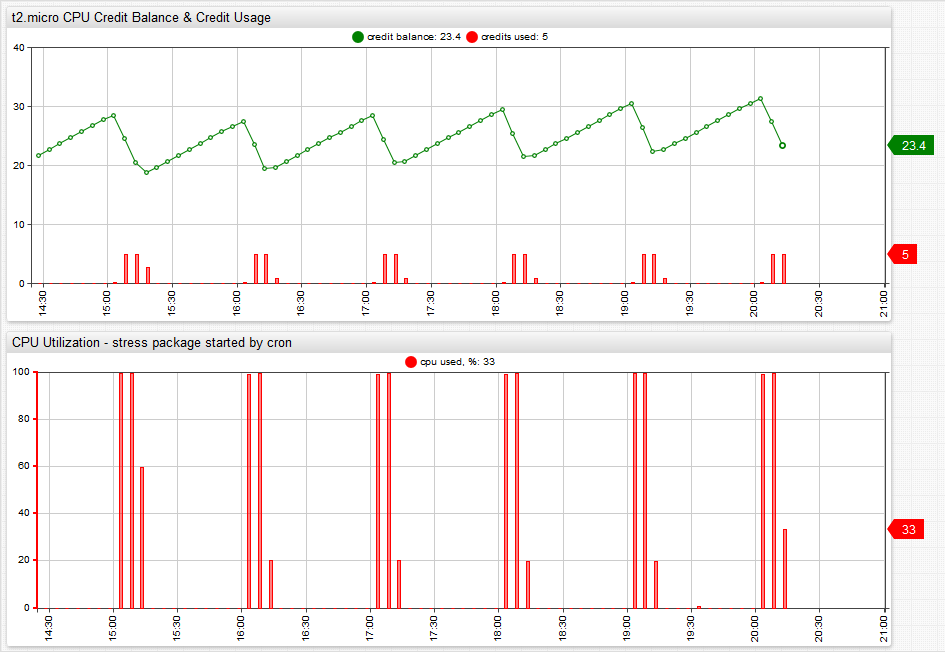

# AWS EC2 T2 Instances: 700 Seconds of Fame


There is no shortage of innovation going on in cloud pricing models, ranging from [preemptible virtual machines](https://cloudplatform.googleblog.com/2015/05/Introducing-Preemptible-VMs-a-new-class-of-compute-available-at-70-off-standard-pricing.html) from Google to pay-per-tick code execution services such as [AWS Lambda](https://aws.amazon.com/lambda/). The overall trend is that pricing is getting ever more granular and complex. This applies to both emerging pay-as-you-go services as well as mainstream virtual machines. As IaaS providers get more creative, IaaS customers do as well. The IT world is not far from a time where capacity owners are placing and buying back IT capacity just like corporate cash positions today. The future is a world where enterprises close daily books not just in dollars, but also in petabytes and GHz.

A small step in this direction is a new utility pricing model implemented by AWS for their T2 virtual machines, also known as EC2 instances. These virtual machines have a fixed maximum capacity measured based on the number of CPU cores and a variable burst capacity measured in CPU credit units. CPU credits measure the amount of time that the virtual machine is allowed run at maximum capacity. One CPU credit is equal to one virtual CPU running at 100% utilization for one minute. If the machine has 60 credits, it can utilize one vCPU for 1 hour. If the CPU credit balance of a machine is zero, it runs at base performance.

The AWS [pricing page](https://docs.aws.amazon.com/AWSEC2/latest/UserGuide/t2-instances.html) provides the following parameters for T2 instances as of May 17, 2015:

| Instance Type | Initial CPU Credit`*` | CPU Credits Earned Per Hour | Base Performance <br>(CPU Utilization) |
:--:|:--:|:--:|:--:
`t2.micro` | 30 | 6 | 10%
`t2.small` | 30 | 12 | 20%
`t2.medium` | 60 | 24 | 40%

> `*` T2 instances run on High Frequency Intel Xeon Processors operating at 2.5 GHz with Turbo up to 3.3 GHz.

The above table means that a `t2.small` instance can run for 12 minutes each hour at full capacity. If the instance runs out of CPU credits and still has work to do, it runs on a CPU share equivalent to 500 MHz CPU (2.5 GHz * 20%).  Expect delays because that is not much. To put things in context, Samsung Galaxy S6 smartphones have 4 cores with 2.1 GHz clock speed each.

The charts below illustrate the relationship between CPU credit balance, CPU credits and CPU usage.



CPU Usage results in CPU credit drawdown which reduces the CPU credit balance. Idle time frees the CPU and earns CPU credits.

The CPU usage in this case is generated with a stress package triggered by [`cron`](https://axibase.com/docs/axibase-collector/scheduling.html#cron-expressions) schedule at the beginning of each hour and runs just enough to maintain CPU credit balance at a constant level throughout the day. There are no applications running on the instance other than services pre-installed on Ubuntu `14.04` server distribution.

```sh
3 * * * * stress –cpu 1 –timeout 700
```

The attentive reader notices that the number of seconds that the stress command loads the CPU is 700 seconds which is 20 seconds less than the advertized 12 minutes but assume that this is how much CPU time is consumed by the machine without CPU stress.

What is the conclusion on T2 instances after all? One way to approach this is to follow Amazon advice that  “T2 instances are a good choice for workloads that do not use the full CPU often or consistently, but occasionally need to burst.”

The question is how do you know if T2 is a good choice given your particular application. The solution is monitoring and alerting. Unlike other instances, T2 machines expose CPU credit balance and CPU credit usage metric which you can view in the Amazon CloudWatch console or query with the AWS CloudWatch API.

You can also create alerts for CPU credit balance which fire during prime hours in case the system is out of credits.

Last but not least, if you are running more than a few EC2 instances, you can have Axibase Time-Series Database collect CloudWatch metrics for you to help make smart capacity planning decisions and forecasting at scale.