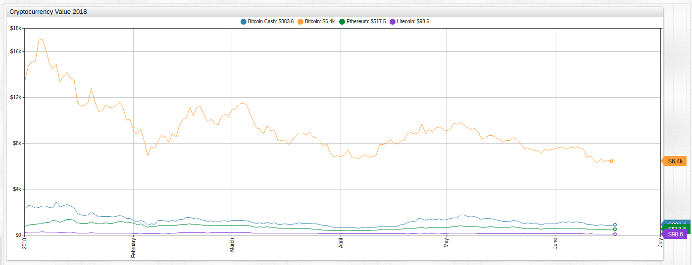
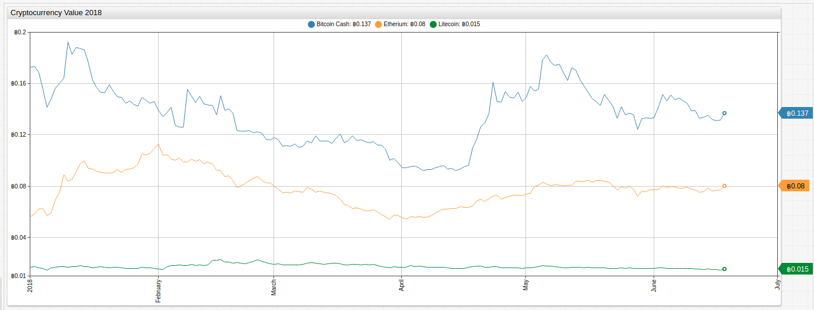
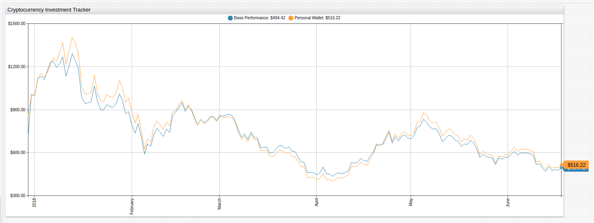
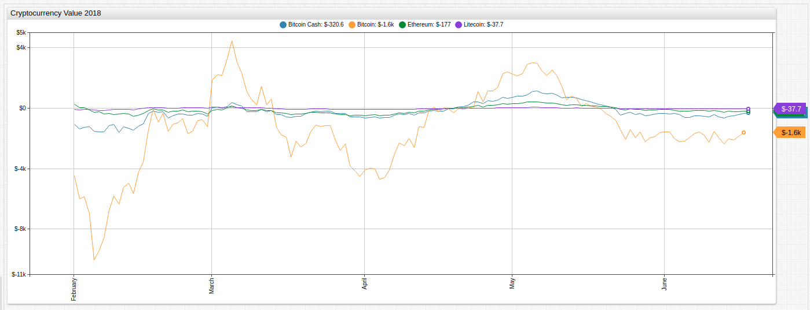
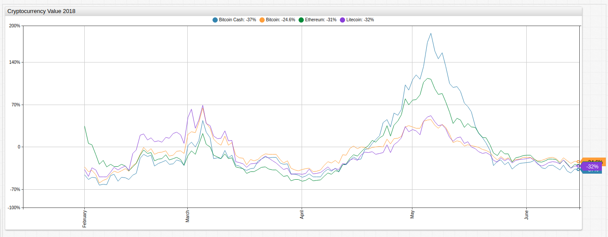
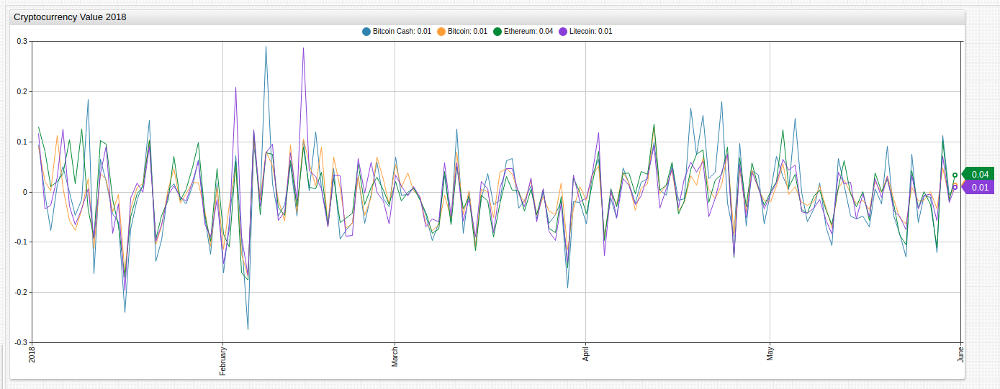

# Cryptocurrency Value Tracker



[](https://apps.axibase.com/chartlab/71df6f9f#fullscreen)

Although in existence since 2009, the world's first cryptocurrency Bitcoin did not begin making headlines until 2014 when the digital asset's value grew almost 1,000% in just a few days, jumping from under $100 to almost $1,000. Then it happened again in 2017 at an even larger scale when Bitcoin was valued at nearly $20,000 a unit.

Things have cooled off slightly for `BTC`, as its known on the digital currency news and analysis site [CoinDesk](https://www.coindesk.com/), but the sustained popularity of Bitcoin has led to the creation of hundreds of other similar products.

The relevance of the technology, and the acceptance of digital currency in general, was given a significant boost recently when the Federal Reserve [announced](https://news.research.stlouisfed.org/2018/06/fred-adds-cryptocurrency-series/) that it would begin hosting cryptocurrency pricing data on its economic data website [FRED](https://research.stlouisfed.org/).

## Bitcoin Index

Cryptocurrency movement against the dollar has always been volatile. This visualization tracks the value of Bitcoin against the other three cryptocurrencies showing that their relationship to one another is just as tenuous. Both Bitcoin Cash and Litecoin moved upwards or downwards more than 50% in relation to Bitcoin at least once in the 6-month observation period.



[](https://apps.axibase.com/chartlab/c00386b4#fullscreen)

## Example Investment

The chart below tracks two hypothetical investments. The `Base Performance` line tracks a investment of $1,000 spread evenly over each of the four cryptocurrencies purchased on January 1, 2018 and the `Personal Wallet` line tracks a second hypothetical investment of $1,000 spread unevenly among each of the four cryptocurrencies and made on a variable date.

Open the visualization and modify the `var positions` and `value` settings in the **Editor** window to see if you can create a profitable investment and outsmart the cryptocurrency market.



[](https://apps.axibase.com/chartlab/c26b6e26)

The default configuration tracks a custom investment of $100 Bitcoin, $400 Etherium, $100 Litecoin, and $400 Bitcoin Cash.

```css
var positions = [['btc', 100], ['eth', 400], ['ltc', 100], ['bch', 400]]  
```

Modify the `value` setting to customize the date of purchase. By default, the investment was purchased at `2018-01-01` prices.

```css
value = +value('@{position[0]}')*@{position[1]}/fred.ValueForDate('@{position[0]}','2018-01-01')
```

The final value of the `Base Performance` investment is $494.42 against the `Personal Wallet` investment value of $516.22.

## Mathematical Functions

The charts in this article track cryptocurrency prices for 2018 and transform the underlying data using [user-defined functions](https://github.com/axibase/charts/blob/master/syntax/udf.md#user-defined-functions) in ATSD and [ChartLab](../../tutorials/shared/chartlab.md). The [`fred.js`](../../tutorials/shared/trends.md#fred-library) library is a collection of mathematical functions used to transform FRED data.

### Monthly Change



[](https://apps.axibase.com/chartlab/0fb3df5f#fullscreen)

Although Bitcoin had the largest absolute movement during the observed period, each currency behaved similarly.

### Monthly Percent Change



[](https://apps.axibase.com/chartlab/5a8664ca#fullscreen)

Cryptocurrency markets fluctuate at surprisingly similar rates when comparing month-on-month percentile change.

### Log Return

The log return value of a dataset is computed `ln(value_t/value_t-1)`. By creating the argument using a [consecutive value calculation](../../tutorials/subtract-subsequent-values/README.md#charts-functions) and applying the natural logarithm function, log returns may be used to quickly estimate and compare asset performance using normalized data.



[](https://apps.axibase.com/chartlab/df649def#fullscreen)

Log returns are helpful for comparing assets of different orders of value such as `BTC` (average value $7000) and `LIC` (average value $200). With minor deviations, all four cryptocurrencies had similar log return values.

## Dow Theory

Comparing Bitcoin monthly value change to the `sine` function demonstrates the semi-regular periodicity of asset value [hypothesized](https://en.wikipedia.org/wiki/Dow_theory) by Charles H. Dow over 100 years ago. As Dow's theory was meant to explain the cyclical nature of asset valuation caused by human factors, applying the principle to the intrinsically valueless cryptocurrency is an interesting study.


[](https://apps.axibase.com/chartlab/78743661#fullscreen)

## Different Prices, Similar Story

Comparing absolute returns, percent returns, and log returns shows that although each of the four selected cryptocurrencies are used by a variable number of consumers for a variable number of transactions, and valued on significantly different orders of magnitude, the patterns of returns are quite similar.

Although it may prove not to be economically viable as a means of currency, blockchain technology is already [being implemented](http://fortune.com/2017/12/26/blockchain-tech-companies-ibm/) in a number of other industries to ensure data consistency and security.