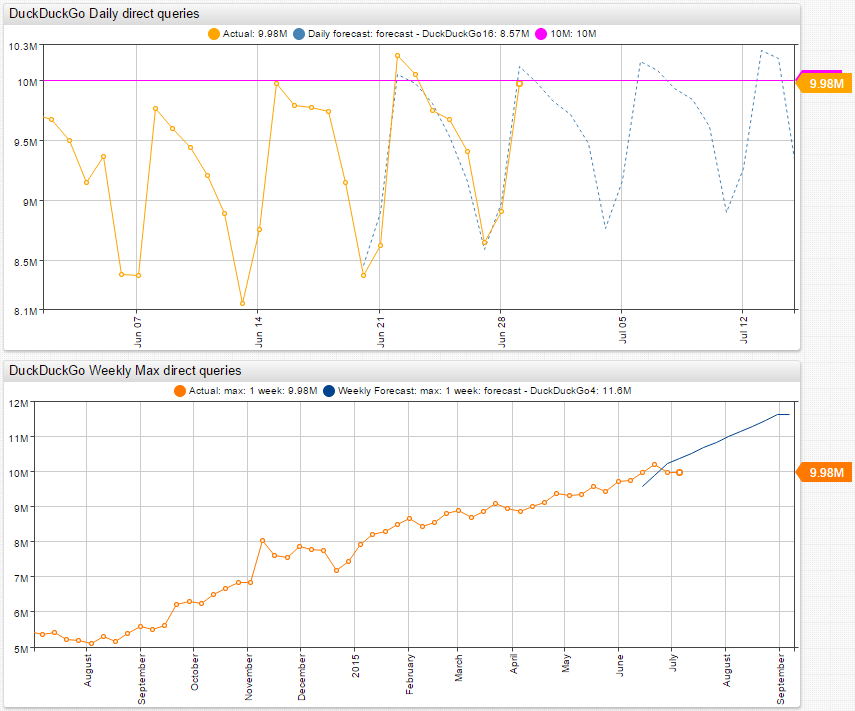

# DuckDuckGo Search Statistics

## DuckDuckGo

Axibase tracks [DuckDuckGo](https://duckduckgo.com/) search statistics. It is a very interesting case as DuckDuckGo shares the core operational metric with minimal delay. The primary DuckDuckGo metric that the company tracks is the number of [search queries per day](https://duckduckgo.com/traffic.html).

DuckDuckGo is a new search engine that has a focus on privacy. With DuckDuckGo there are no personalized search results based on location or past click behavior and search history. None of that information is gathered or stored, which means DuckDuckGo always shows users the same search results if the search terms are the same. DuckDuckGo also emphasizes information from the best sources rather than the highest number of sources, which often results in higher quality and more relevant search results.

With increased concerns over privacy due to recent world events, DuckDuckGo has been gaining ground on the competition. In the last two years, DuckDuckGo has experienced a huge spike in popularity, partially due in result to the United States government surveillance program that came to light. The service has grown by over 600% since then. Now DuckDuckGo is nearly a mainstream search engine, primarily due to the focus on user privacy. Read more about the DuckDuckGo surrounding the NSA surveillance program from [Technically](https://technical.ly/philly/2015/06/16/duckduckgo-cnbc/).

Search queries are driven by humans. This activity at a large scale is subject to common patterns such as a strong weekly cycle, which means patterns can be forecast with a high degree of accuracy.

## Data Forecasting

The [Holt-Winters algorithm](https://axibase.com/docs/atsd/forecasting/calendar_exceptions_testing.html#settings-3), which is built into ATSD, is designed to detect trends over periods of time. ATSD iterates various Holt-Winters algorithm parameters to arrive at a combination of settings that produces the most accurate forecast.

Using the [Data Forecasting](https://axibase.com/docs/atsd/forecasting/) to predict the amount of daily search queries in DuckDuckGo. DuckDuckGo is approaching 10 million search queries per day, and ATSD can forecast the exact day when DuckDuckGo can surpass this threshold for the first time.  See the [DuckDuckGo Blog](https://duck.co/blog/post/176/-why-duckduckgo-is-giving-away-shirts) for more information about this milestone.

For the above forecast, automatic parameters are calculated using Data Forecasting, allowing the system to match the best parameters to historical data. However, if the Holt-Winters algorithm is to run using static parameters, the system cannot forecast abnormal events such as news publications or one-time events such as NSA PRISM disclosures.

This is where daily recomputation of forecasts in ATSD shows its strengths. Recomputation allows ATSD to determine new periods and new trends continuously. New forecasts are generated every night, taking into account all the recent developments and trends that have occurred in the time series. This kind of approach results in high forecast accuracy and dynamic response to abnormal events and new trends.

With Data Forecasting in ATSD it is also possible to exclude special events using [Calendars](https://axibase.com/docs/atsd/forecasting/calendar_exceptions_testing.html#calendar) to minimize their impact on stationary periods and trends.
